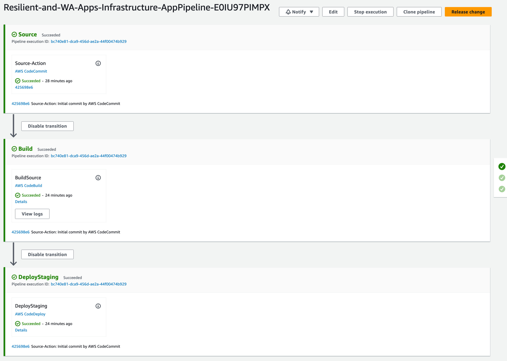

[Continuous Integration and Continuous Deployment (CI/CD)](https://docs.aws.amazon.com/whitepapers/latest/practicing-continuous-integration-continuous-delivery/welcome.html?sc_channel=el&sc_campaign=resiliencewave&sc_geo=mult&sc_country=mult&sc_outcome=acq&sc_content=chaos-engineering-pipeline) allow software teams to automate build, test, and release of software changes consistently and repeatedly. [Chaos engineering](https://aws.amazon.com/blogs/architecture/verify-the-resilience-of-your-workloads-using-chaos-engineering/?sc_channel=el&sc_campaign=resiliencewave&sc_geo=mult&sc_country=mult&sc_outcome=acq&sc_content=chaos-engineering-pipeline) is the process of stressing an application in testing or production environments by creating disruptive events, such as server outages or API throttling, and observing how the system responds to uncover the hidden issues, monitoring blind spots, and performance bottlenecks that are difficult to find in distributed systems. By combining the CI/CD practice and chaos engineering, we can add resilience testing to our suite of automated tests. Running automated fault injection experiments in our CI/CD pipelines helps us detect issues early and avoid outages in production, and repeating experiments on every deployment also verifies that our system continues to be resilient to failure after unknown parts of the system change.

In this post, we will look at how to use chaos engineering experiments in our CI/CD pipelines to run experiments on each deployment automatically. We will be using [AWS Fault Injection Simulator (FIS)](https://docs.aws.amazon.com/fis/latest/userguide/what-is.html?sc_channel=el&sc_campaign=resiliencewave&sc_geo=mult&sc_country=mult&sc_outcome=acq&sc_content=chaos-engineering-pipeline) – a fully managed service for running fault injection experiments on AWS – and [AWS CodePipeline](https://docs.aws.amazon.com/codepipeline/latest/userguide/welcome.html?sc_channel=el&sc_campaign=resiliencewave&sc_geo=mult&sc_country=mult&sc_outcome=acq&sc_content=chaos-engineering-pipeline) – a fully managed continuous delivery service for fast and reliable application and infrastructure updates – but the same approach applies to other tools and services.

Our application is built using [Amazon EC2](https://docs.aws.amazon.com/AWSEC2/latest/UserGuide/concepts.html?sc_channel=el&sc_campaign=resiliencewave&sc_geo=mult&sc_country=mult&sc_outcome=acq&sc_content=chaos-engineering-pipeline) instances in an [Amazon EC2 Auto Scaling](https://docs.aws.amazon.com/autoscaling/ec2/userguide/what-is-amazon-ec2-auto-scaling.html?sc_channel=el&sc_campaign=resiliencewave&sc_geo=mult&sc_country=mult&sc_outcome=acq&sc_content=chaos-engineering-pipeline) group with [Amazon RDS](https://docs.aws.amazon.com/AmazonRDS/latest/UserGuide/Welcome.html?sc_channel=el&sc_campaign=resiliencewave&sc_geo=mult&sc_country=mult&sc_outcome=acq&sc_content=chaos-engineering-pipeline)as a datastore and fronted by an [Application Load Balancer](https://docs.aws.amazon.com/elasticloadbalancing/latest/application/introduction.html?sc_channel=el&sc_campaign=resiliencewave&sc_geo=mult&sc_country=mult&sc_outcome=acq&sc_content=chaos-engineering-pipeline) (Figure 1). It makes use of the [AWS Code services](https://aws.amazon.com/products/developer-tools/?sc_channel=el&sc_campaign=resiliencewave&sc_geo=mult&sc_country=mult&sc_outcome=acq&sc_content=chaos-engineering-pipeline) for CI/CD (Figure 2) as well as [Amazon CloudWatch](https://docs.aws.amazon.com/AmazonCloudWatch/latest/monitoring/WhatIsCloudWatch.html?sc_channel=el&sc_campaign=resiliencewave&sc_geo=mult&sc_country=mult&sc_outcome=acq&sc_content=chaos-engineering-pipeline) for monitoring and alarms. The application could as well use containers, serverless, or a mix of them all, and the same way of using chaos engineering in the pipeline as described in this post would apply.

Start with creating an [AWS FIS experiment template](https://docs.aws.amazon.com/fis/latest/userguide/experiment-templates.html?sc_channel=el&sc_campaign=resiliencewave&sc_geo=mult&sc_country=mult&sc_outcome=acq&sc_content=chaos-engineering-pipeline) by configuring one or more actions to run against the target resources of the application. Here we have created an action to add network latency to Amazon EC2 instances in our cluster identified by a tag (Figure 3). Resource IDs, filters, or tags can identify target resources. Additionally, we define Amazon CloudWatch alarms as Stop conditions to stop running the experiments if a particular threshold or boundary has been reached. These Stop conditions are particularly important when we run automated experiments.

Create a state machine using [AWS Step Functions](https://docs.aws.amazon.com/step-functions/latest/dg/welcome.html?sc_channel=el&sc_campaign=resiliencewave&sc_geo=mult&sc_country=mult&sc_outcome=acq&sc_content=chaos-engineering-pipeline) with the experiment template ID as an input parameter from AWS CodePipeline (Figure 4). The state machine will use the AWS SDK integration to initially start the experiment in AWS FIS and later wait for the experiment to finish. Based on the experiment's outcome – completed, stopped, or failed – it will pass either Succeed or Fail back to the pipeline.

We add a new stage at the point in the pipeline where we want to initiate our AWS Step Functions state machine, in this case, after deployment to staging (Figure 5). We pass the ID of the experiment template to the state machine as an input parameter, which launches our AWS FIS experiment and waits for the experiment to finish. Based on what Step Functions passes back to AWS CodePipeline, the pipeline will continue or fail.

When a pipeline execution is started through a source change, manually, or on a schedule, it will go through the pipeline's stages and actions. Once the pipeline reaches the experiment stage, it will initiate the AWS Step Functions action and execute the state machine (Figure 6). The state machine will start an AWS FIS experiment based on the experiment template ID provided, and the experiment will run the fault injection actions defined until the experiment finishes (Figure 7). With the experiment finished, the state machine will finish execution and pass back the output to the pipeline (Figure 8). The pipeline continues to the next stage with the experiment stage succeeded (Figure 9).

If a stop condition triggers (Figure 11), an error occurs, or we manually stop the experiment, the pipeline action and stage will fail and stop the pipeline (Figure 12). Your experiment uncovering a hidden issue in the system and reaching a defined threshold will prevent the release from moving from staging and being deployed to production.

As your confidence in the system and its resilience to failure grows, you can expand the pipeline further and add an experiment stage after deployment to production. This allows you to run the same experiments automatically both in pre-production and production environments.

## Summary

We can add resilience testing to our suite of automated tests and continuously verify our system's output or behavior by combining the CI/CD practice and chaos engineering, by including AWS FIS experiments as part of our AWS CodePipeline delivery pipelines. Doing so allows us to cover more experiments than we can run manually, helps us verify the system's resilience to failure over time, and helps us build confidence in the overall system and its ability to withstand turbulent conditions. There are different ways of running experiment in your pipelines, but the approach described in this post waits for the experiment to finish and based on the outcome of the experiment decides if it should continue with the pipeline or not.

If you want to deploy a sample pipeline with an experiment stage and a state machine to start experiments, check out our [AWS Samples GitHub](https://github.com/aws-samples/aws-fault-injection-simulator-samples/tree/main/pipeline-experiment).
