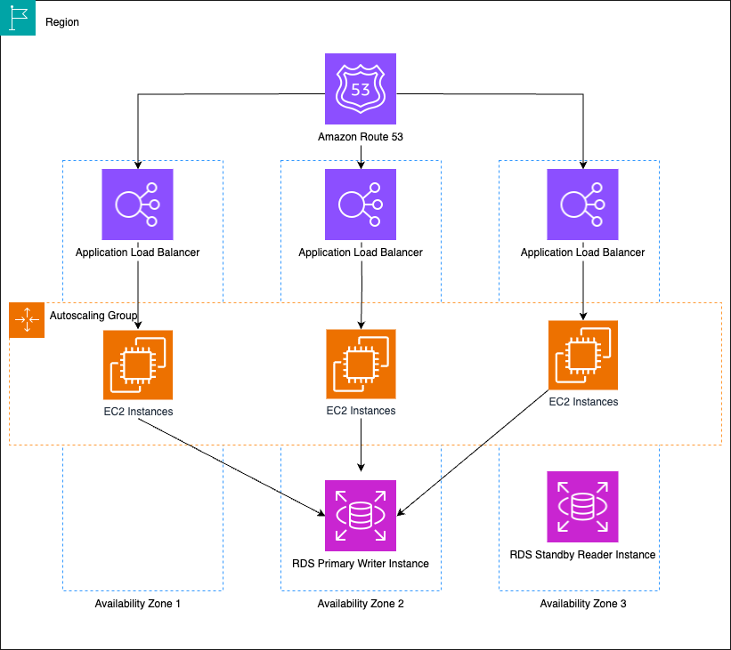

## Introduction

In an always-on, competitive marketplace, it is becoming increasingly important that your applications are always available by applying [resiliency as a shared responsibility between AWS and the customer](https://docs.aws.amazon.com/whitepapers/latest/disaster-recovery-workloads-on-aws/shared-responsibility-model-for-resiliency.html?sc_channel=el&sc_campaign=post&sc_geo=mult&sc_country=mult&sc_outcome=acq&sc_content=choosing-the-right-chaos-engineering-tool-for-the-job). Making your applications more resilient so they can withstand failures is a crucial activity for any company, and isn’t a single time event, or even an annual test, it requires continuous improvement. 

[Resiliency](https://docs.aws.amazon.com/wellarchitected/latest/reliability-pillar/resiliency-and-the-components-of-reliability.html?sc_channel=el&sc_campaign=post&sc_geo=mult&sc_country=mult&sc_outcome=acq&sc_content=choosing-the-right-chaos-engineering-tool-for-the-job) often requires redundancy and excess capacity to handle failures, which can be expensive and impact your carbon footprint. You will need to find tradeoffs on the criticality of the system, downtime tolerance, budget, and SLA goals. A balanced approach is to architect for sufficient resiliency to meet RTO/RPO targets while provision.
Quickly restoring service after an outage requires resilient infrastructure and thorough [disaster recovery testing](https://docs.aws.amazon.com/whitepapers/latest/disaster-recovery-workloads-on-aws/testing-disaster-recovery.html?sc_channel=el&sc_campaign=post&sc_geo=mult&sc_country=mult&sc_outcome=acq&sc_content=choosing-the-right-chaos-engineering-tool-for-the-job)

So how can you test for failures on a regular basis, and with some level of automation? Enter Chaos Engineering. In this article we will guide you through what Chaos Engineering is and why you need it. We will also introduce several tools available today, including AWS native service offerings, open source, and commercial options. 

There is no better way to test your system than chaos engineering, you won't need to be an expert to incorporate it into your organization.

## What is Chaos Engineering, and why might I want it?

Based on the pioneering work done by [Jesse Robbins](https://en.wikipedia.org/wiki/Jesse_Robbins) in the early days of [amazon.com](https://www.amazon.com/), then taken further by [Netflix’s Chaos Monkey](https://github.com/Netflix/chaosmonkey), chaos engineering is the operational practice of introducing disruption to a workload and discover vulnerable parts to determine behavior based on a hypothesis. The goal is to observe how the workload responds and proactively inject faults, such as latency, or failure of underlying compute, networking databases, server errors and more, so improvements can be made, ultimately causing the workload to become more reliable.
It helps developers easily setup and run controlled chaos engineering experiments across a range of AWS services and could be used to find blind spots and respond to infrequent but critical events.

There is no right or wrong when it comes to the environment where you run chaos experiments. When you are getting started, it’s recommended to run your experiments in pre-production to reduce the risk to your production workloads. Running chaos experiments in production could certainly lead to more downtime and reduced availability in the short-term, potentially impacting SLAs. However, finding weaknesses through chaos testing helps build more fault-tolerant systems that should improve availability and performance in the long run. Short-term SLA impacts enable longer-term benefits. 

The failure scenarios injected through chaos experiments are typically small-scale, localized events. But it's possible for an experiment to trigger unexpected cascading failures that become impactful enough to violate SLAs more severely, so check with all relevant stakeholders before running experiments in production. 

Many attribute chaos engineering to simply breaking a production environment on purpose at random times and in random ways. This is not the case. Chaos engineering is really just an additional part of the continuous improvement cycle that can also improve performance and should be planned for accordingly. To run a chaos experiment, you need the following:

* A known workload you want to test.
* A hypothesis of how you expect a workload to respond to disruption.
* The type of disruption you want to introduce.
* A tool to run the experiment.

## Different failure scenario based on a resilient architecture

Let’s say you have a three tier application running on AWS. This uses [Elastic Load Balancing](https://aws.amazon.com/elasticloadbalancing/?sc_channel=el&sc_campaign=post&sc_geo=mult&sc_country=mult&sc_outcome=acq&sc_content=choosing-the-right-chaos-engineering-tool-for-the-job) (ELB) in front of multiple web servers, another ELB in front of application servers, and an [Amazon RDS](https://aws.amazon.com/rds/?sc_channel=el&sc_campaign=post&sc_geo=mult&sc_country=mult&sc_outcome=acq&sc_content=choosing-the-right-chaos-engineering-tool-for-the-job) instance for the backend. Our hypothesis is that in the event of an [Availability Zone](https://docs.aws.amazon.com/AmazonRDS/latest/UserGuide/Concepts.RegionsAndAvailabilityZones.html?sc_channel=el&sc_campaign=post&sc_geo=mult&sc_country=mult&sc_outcome=acq&sc_content=choosing-the-right-chaos-engineering-tool-for-the-job) (AZ) loss, our application will continue functioning, and autoscaling will scale the workload back up to the desired count. Our disruption will be simulating AZ loss. We have chosen [AWS Fault Injection Simulator](https://aws.amazon.com/fis/?sc_channel=el&sc_campaign=post&sc_geo=mult&sc_country=mult&sc_outcome=acq&sc_content=choosing-the-right-chaos-engineering-tool-for-the-job) (FIS) as our chaos engineering tool for this experiment. Upon running the experiment, our results find that waiting on the [autoscaling group](https://docs.aws.amazon.com/autoscaling/ec2/userguide/auto-scaling-groups.html?sc_channel=el&sc_campaign=post&sc_geo=mult&sc_country=mult&sc_outcome=acq&sc_content=choosing-the-right-chaos-engineering-tool-for-the-job) to spin up new instances is causing unacceptable delays to end users accessing the application. We can now make changes to our workload to make it more statically stable by having enough [Amazon EC2](https://aws.amazon.com/ec2/?sc_channel=el&sc_campaign=post&sc_geo=mult&sc_country=mult&sc_outcome=acq&sc_content=choosing-the-right-chaos-engineering-tool-for-the-job) instances deployed to account for an AZ failure while still serving our minimum end user count. But we don’t stop there, we run the experiment again to validate the new hypothesis, and continue to run it on a regular basis to confirm behavior going forward.

## Tools available

There are a number of chaos engineering tools available today, and most will have at least some level of integration with AWS so they can be used to run experiments against your AWS workloads. In the following section we will introduce several options.

## Fault Injection Simulator

[Fault Injection Simulator (FIS)](https://aws.amazon.com/fis/?sc_channel=el&sc_campaign=post&sc_geo=mult&sc_country=mult&sc_outcome=acq&sc_content=choosing-the-right-chaos-engineering-tool-for-the-job) is an AWS native, fully managed fault injection/chaos engineering service. FIS supports best practice chaos engineering parameters to make it easy to get started running experiments, without the need to install any agents. Sample experiments are available to use as a starting point. Fully managed fault injection actions are used to define actions such as stopping an instance, throttling an API, and failing over a database. Fault Injection Simulator supports [Amazon CloudWatch](https://aws.amazon.com/cloudwatch/?sc_channel=el&sc_campaign=post&sc_geo=mult&sc_country=mult&sc_outcome=acq&sc_content=choosing-the-right-chaos-engineering-tool-for-the-job) so that you can use your existing metrics to monitor Fault Injection Simulator experiments. You do not need to know any special code or scripting language in order to use FIS out of the box.

As of today, FIS has native integration to the following:

* AWS APIs
* Amazon CloudWatch
* Amazon EBS
* Amazon EC2
* Amazon ECS
* Amazon EKS
* AWS Networking
* Amazon RDS
* AWS Systems Manager

A full list of the current [supported fault injections can be found here](https://docs.aws.amazon.com/fis/latest/userguide/fis-actions-reference.html#fis-actions-reference-fis?sc_channel=el&sc_campaign=post&sc_geo=mult&sc_country=mult&sc_outcome=acq&sc_content=choosing-the-right-chaos-engineering-tool-for-the-job).
FIS can be used for both simplistic scenarios like throttling a single EC2 instance CPU, to complex real-world scenarios to gradually and simultaneously impairing performance of different types of resources, APIs, services, and geographic locations. Affected resources can be randomized, and custom fault types can be created using [AWS Systems Manager](https://aws.amazon.com/systems-manager/?sc_channel=el&sc_campaign=post&sc_geo=mult&sc_country=mult&sc_outcome=acq&sc_content=choosing-the-right-chaos-engineering-tool-for-the-job)to further increase complexity. You can setup guardrails to only affect resources with specific tags, and set rules based on CloudWatch alarms or other tools to stop an experiment. 
FIS is integrated with [AWS Identity and Access Management (IAM)](https://aws.amazon.com/iam/?sc_channel=el&sc_campaign=post&sc_geo=mult&sc_country=mult&sc_outcome=acq&sc_content=choosing-the-right-chaos-engineering-tool-for-the-job) so you can control which users and resources have permission to access and run experiments, and which resources and services can be affected.
FIS provides visibility throughout every stage of an experiment via the AWS console and APIs. You can observe which actions have executed while an experiment is running, and view details of actions, stop conditions which were triggered, how metrics compared to your expected behavior, and more. You can use FIS from within the AWS console, AWS CLI, and [AWS SDKs](https://aws.amazon.com/developer/tools/?sc_channel=el&sc_campaign=post&sc_geo=mult&sc_country=mult&sc_outcome=acq&sc_content=choosing-the-right-chaos-engineering-tool-for-the-job). You can access the FIS service programmatically to integrate experiments into your CI/CD pipelines.
You can get started with AWS FIS [here](https://docs.aws.amazon.com/fis/latest/userguide/what-is.html?sc_channel=el&sc_campaign=post&sc_geo=mult&sc_country=mult&sc_outcome=acq&sc_content=choosing-the-right-chaos-engineering-tool-for-the-job)

## Chaos Toolkit

[Chaos Toolkit](https://chaostoolkit.org/) is an open source chaos engineering tool which you can use to run experiments against your AWS workloads. The chaostoolkit CLI is implemented in Python 3, so your team will need to have working knowledge of python to install the toolkit and to build and run your experiments.
Chaos Toolkit can be deployed locally, onto an EC2 instance, or in AWS Batch as a Docker image to run from inside your AWS environment. Extension modules for AWS have been added to Chaos Toolkit and can be found on [Github](https://github.com/chaostoolkit-incubator/chaostoolkit-aws). 
Each Chaos Toolkit Experiment is built around a single file using JSON. The JSON file will consist of the following sections:

* steady-state-hypothesis describes the normal state of your workload and checks before an experiment runs to make sure normal state is in place, and after the experiment runs to compare.
* method contains the actual experiment activities which will take place.
* action is the activity which will be applied to the workload during the experiment.
* probes define how to observe the workload during the experiment.
* controls are declared operational controls which affect the experiment execution.
* rollbacks define how to revert back to a normal state.

Not all sections are required to be filled out to run an experiment. For example, the [tutorial experiment](https://chaostoolkit.org/reference/tutorials/ec2/) for running Chaos Toolkit on EC2 provided by Chaos Toolkit has no method or rollback.
Experiments can be built using JSON to run AWS modules which call the AWS API to perform actions. Each experiment consists of Actions which are made operations against the workload, and Probes, which collect information from the workload during the experiment. 
Chaos Toolkit allows you to run a discovery which can be used to help build your experiments. After running an experiment you can generate a report as a PDF or HTML to view the results. 
Chaos Toolkit is great for more experienced teams who desire to run specific experiments against their AWS workloads, but requires a significant amount of hands-on. 
You can get started with Chaos Toolkit [here](https://chaostoolkit.org/reference/tutorial/)

## Gremlin

Gremlin is a commercial chaos engineering platform which uses agents to run experiments against EC2, ECS and EKS. Gremlin supports a wide range of experiments in three categories:

* Resource experiments targeting compute resources.
* Network experiments targeting network latency, packet loss, DNS, and certificates.
* State experiments targeting instance state, processes, and system time.

Gremlin allows you to monitor your experiments in real time with a central dashboard. You can run targeted experiments to run against specific instances, or randomized to target a random instance or container out of a group. Because Gremlin is a paid commercial product, there is extensive documentation and support to get started.
Gremlin does not have the same native AWS API integration as FIS or the extension modules like Chaos Toolkit. You can however create custom experiments to simulate scenarios like an AZ failure by dropping all network traffic or killing an application process. 
Gremlin is a good fit for a team which desires to run experiments against just their compute resources versus native AWS API integration to target managed services. A less experienced team can make use of the ease of use and minimal effort to get started. 
You can get started with Gremlin [here](https://www.gremlin.com/docs/reliability-management/quick-start-guide/)

## Comparison chart

|	|AWS FIS	|Chaos Toolkit	|Gremlin	|
|---	|---	|---	|---	|
|License	|Commercial	|Open Source	|Commercial	|
|Deployment	|AWS native	|EC2, Docker container using AWS Batch	|Agent based on EC2, EKS	|
|Metrics/Scoring	|Yes (when integrated with AWS Resilience Hub)	|No	|Yes	|
|Custom experiments	|Yes	|Yes	|Yes	|
|Rollback	|Yes	|Yes	|Yes	|
|ECS/EKS	|Yes	|Yes	|Yes	|
|EC2	|Yes	|Yes	|Yes	|
|RDS failover	|Yes	|Yes	|No	|
|GUI	|Yes	|No	|Yes	|
|CLI	|Yes	|Yes	|Yes	|
|Application testing	|Yes	|No	|Yes	|
|Randomized target	|Yes	|Yes	|Yes	|
|Network testing	|Yes	|Yes	|Yes	|
|AZ failure	|Yes	|Yes	|Yes	|
|Region failure	|Yes	|No	|Yes	|

## Conclusion

In summary, there are a growing number of tools available for chaos engineering, each with their own strengths and limitations. When evaluating chaos engineering tools, key factors to consider include the types of failures supported, integration with your specific infrastructure, automation capabilities, visualization and analytics, RBAC controls, and extensibility. Teams should evaluate trade-offs like complexity vs control when selecting a chaos tool and assess their resilience testing needs and map them to tool features accordingly. There is no one-size-fits-all solution, but using a combination of custom scripts and robust frameworks can provide comprehensive chaos coverage. As chaos engineering continues maturing, we can expect tools to become more interoperable, customizable, and intelligent. 
Thoughtfully incorporating the right chaos tools into your testing regimen will strengthen system resilience and improve incident response when outages strike.

In this article we shared with you what Chaos Engineering is and how it can be applied to your workloads on AWS. We dove into the use cases, features and limitations of various Chaos Engineering tools which are available today, and why you might choose each, depending on your workload and the goal of your chaos experiments. The goal of any tool is to help you achieve greater reliability for your workload, the choice comes down to which one will help you reach that goal easier, cheaper and faster. The experience of your team and the maturity of your AWS workload may also impact which tool you choose, as a more experienced team or a cloud native application may need more capability, or closer integration with AWS managed services. 

## Training

After reading this blog you might want to get some hands-on practice with chaos engineering. The best training option depends on your preferred learning style and depth of knowledge desired. we recommend starting with fundamental training like the [Chaos Engineering course](https://www.linkedin.com/learning/devops-foundations-chaos-engineering), [O'Reilly book](https://www.oreilly.com/library/view/chaos-engineering/9781492043850/), or [AWS re:Invent sessions](https://www.oreilly.com/library/view/chaos-engineering/9781492043850/) then progressing to hands-on workshops and conference sessions. Developing chaos engineering skills takes practice.

The AWS Well Architected Labs has a 300 level lab available which will walk you through multiple chaos experiments including EC2 instance failure, AZ failure, and RDS instance failover. The labs include both API script based experiments and Fault Injection Simulator experiments. 
https://wellarchitectedlabs.com/reliability/300_labs/300_testing_for_resiliency_of_ec2_rds_and_s3/

## External resources

- Chaos Engineering with AWS Fault Injection Simulator: [https://www.youtube.com/watch?v=AThR8dFmPP4](https://www.youtube.com/watch?v=AThR8dFmPP4)
- Chaos engineering leveraging AWS Fault Injection Simulator in a multi-account AWS environment: [https://aws.amazon.com/blogs/mt/chaos-engineering-leveraging-aws-fault-injection-simulator-in-a-multi-account-aws-environment/](https://aws.amazon.com/blogs/mt/chaos-engineering-leveraging-aws-fault-injection-simulator-in-a-multi-account-aws-environment/?sc_channel=el&sc_campaign=post&sc_geo=mult&sc_country=mult&sc_outcome=acq&sc_content=choosing-the-right-chaos-engineering-tool-for-the-job)
- AWS Fault Injection Simulator blogs: [https://aws.amazon.com/blogs/devops/tag/aws-fault-injection-simulator/](https://aws.amazon.com/blogs/devops/tag/aws-fault-injection-simulator/?sc_channel=el&sc_campaign=post&sc_geo=mult&sc_country=mult&sc_outcome=acq&sc_content=choosing-the-right-chaos-engineering-tool-for-the-job)
- How Finbourne Assures Resiliency Through Chaos Engineering Events Every 17 min: [https://www.youtube.com/watch?v=lkDq9g43djw](https://www.youtube.com/watch?v=lkDq9g43djw)
- DPG Media Successfully Launches Video On Demand Service with Gremlin and AWS: [https://aws.amazon.com/partners/success/dpg-media-gremlin/?did=ps_card&trk=ps_card](https://aws.amazon.com/partners/success/dpg-media-gremlin/?sc_channel=el&sc_campaign=post&sc_geo=mult&sc_country=mult&sc_outcome=acq&sc_content=choosing-the-right-chaos-engineering-tool-for-the-job)
