With the rise of application modernization, a significant topic of discussion is breaking down monolithic applications into microservices. Essentially, the process begins with breaking the monolith into its individual working parts, making it easier to create a virtualized application environment using tools like containers. During the process, another question arises: whether to use a single (mono) repository for all microservices or a repository for each microservice. 

U a repository for each microservice has several benefits:

* Facilitating faster software release
* Enabling the creation of smaller teams to develop and deliver a single service
* Allowing the team to maintain a smaller codebase, reducing complexity 
* Allowing for faster build and deployment processes with a smaller codebase
* Allowing for the freedom to write code independently and differently from all other services

Creating a separate repository for each microservice benefits a team in maintaining its own development and release cycles. 

Having said this, the next question that arises is how to set up the required infrastructure easily when the microservices are interconnected with each other? 

This post will show you how you can take advantage of AWS Copilot CLI - that accelerates you to go from 0-100 MPH under 60 mins for creating a full microservices infrastructure with CI/CD Pipelines for two connected services. AWS Copilot CLI is a tool for developers to build, release, and operate production-ready, containerized applications on AWS App Runner, Amazon ECS, and AWS Fargate. More information about Copilot, core concepts can be found in [the Copilot official documentation](https://aws.github.io/copilot-cli/docs/concepts/overview/).

## Table of Contents

| Attributes             |                                                                 |
|------------------------|-----------------------------------------------------------------|
| ✅ AWS experience      | 100 - Beginner                                              |
| ⏱ Time to complete     | 60 minutes                                                      |
| 💰 Cost to complete    | Free tier eligible                                               |
| 🧩 Prerequisites       | - [AWS Account](https://portal.aws.amazon.com/billing/signup#/start/email?sc_channel=el&sc_campaign=devopswave&sc_content=cicdcfnaws&sc_geo=mult&sc_country=mult&sc_outcome=acq)<br>- AWS [CloudFormation basic understanding](https://docs.aws.amazon.com/AWSCloudFormation/latest/UserGuide/cfn-whatis-howdoesitwork.html?sc_channel=el&sc_campaign=devopswave&sc_content=cicdcfnaws&sc_geo=mult&sc_country=mult&sc_outcome=acq)|
| 💻 Code Sample         | Code sample used in tutorial on [GitHub](https://github.com/build-on-aws/copilot-multi-repo-connected-services.git)                            |
| 📢 Feedback            | <a href="https://pulse.buildon.aws/survey/DEM0H5VW" target="_blank">Any feedback, issues, or just a</a> 👍 / 👎 ?    |
| ⏰ Last Updated        | 2023-04-24                                                     |

| ToC |
|-----|

## Architecture


The architecture diagram above shows a three-tier application with an Application Load Balancer (ALB) forwarding traffic to the **frontend** ECS Service. The frontend ECS service serves the webpage content to the browser and also acts as a router, communicating to the **backend** ECS service that executes the business logic. The backend ECS service, in turn uses a DynamoDb table to insert/update/delete data. In this case, the frontend and backend are separate microservices that are maintained using their own CI/CD pipeline and Git repository. The frontend communicates with the backend using a user-friendly DNS domain name that is created as part of service discovery. The service discovery feature on Amazon ECS manages the DNS records during scale-in and scale-out events. The infrastructure above allows us to deploy each microservice as an independent unit, even though the applications depend on each other for functionality and can be accessed individually. 

In the next section, you will build and deploy the above architecture using [AWS Copilot](https://aws.amazon.com/containers/copilot/). You will use a sample “*Todo*” application. It has a UI built using ReactJs and is served from a frontend service. Todo service allows you to organize your work and life, and that is stored on the DynamoDB table for subsequent access of the service. It also lets you add more to-dos, and also delete the ones you don’t need. The frontend service also behaves as a router to the backend service using a Nginx proxy server for the requests received from the LoadBalancer. The backend service does the actual business logic of managing the data that is stored in the DynamoDB table. The Service discovery associated with the backend service maintains the DNS records within the Route53 private hosted zone. This is essential for maintaining the correct DNS records for the frontend service to access the backend service using a user-friendly URL, since the internal IP addresses of the backend service can change due to scaling events. Both frontend and backend are deployed within the same VPC and placed within the private subnets. The Application Load Balancer is placed within the public subnets. All the infrastructure that is required for this functionality to work can be created using AWS Copilot. 

## Prerequisites

There are some prerequisites required for you to proceed in this post. Make sure you have the below items configured to proceed with the next sections on this post:

1. An active [AWS Account](https://aws.amazon.com/free/?trk=7541ebd3-552d-4f98-9357-b542436aa66c&sc_channel=ps&ef_id=CjwKCAjwrdmhBhBBEiwA4Hx5g-fwRXcA1K2OaGyp9hrExFj5NGMnyadBCvZyKrNvCAUG_j106eJ_KBoCtFoQAvD_BwE:G:s&s_kwcid=AL!4422!3!651751058790!e!!g!!aws%20account!19852662149!145019243897&all-free-tier.sort-by=item.additionalFields.SortRank&all-free-tier.sort-order=asc&awsf.Free%20Tier%20Types=*all&awsf.Free%20Tier%20Categories=*all)
2. [AWS Copilot installed](https://docs.aws.amazon.com/AmazonECS/latest/developerguide/AWS_Copilot.html)
3. AWS CLI [installed](https://docs.aws.amazon.com/cli/latest/userguide/getting-started-install.html) and [configured](https://docs.aws.amazon.com/cli/latest/userguide/cli-chap-configure.html) to interact with your account
4. [Git client](https://docs.aws.amazon.com/codecommit/latest/userguide/setting-up-gc.html#setting-up-gc-install-git) installed
5. Docker [installed](https://docs.docker.com/engine/install/) and [running](https://docs.docker.com/config/daemon/start/) on your workstation

## Initial Setup

In this section, you will do the initial setup of pulling down the sample application code, initialize the application and environment on using AWS Copilot. We will start with this sample application where all the code is in a single, mono-repo, deploy the frontend and backend service as a separate unit, and then move the code into its own repository with a CI/CD process. 

**Step 1:** Pull down the sample application to your local workstation and change the directory to the code location:

```
git clone https://github.com/aws-samples/copilot-multi-repo-connected-services.git
cd copilot-multi-repo-connected-services/code
```

The code directory structure should look like this:

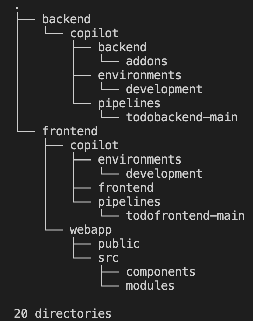

**Step 2:** Navigate into the backend folder.

Make sure you are within the **backend** folder on your terminal. If not run the below command to change directory:

```
cd backend/
```

The folder structure should look like this:

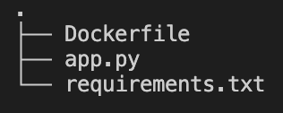

**Step 3:** Initialize an application using copilot.

Run this command to initialize an application using Copilot:

```
copilot app init todo
```

As a result of executing the command above, you should see something similar to this:

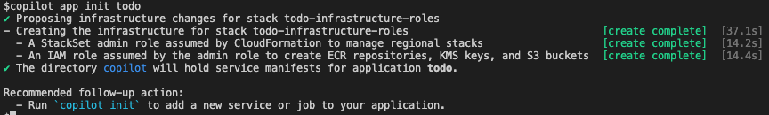

When you run `copilot app init`, Copilot creates an IAM role using CloudFormation to manage services and jobs. Copilot also registers the `/copilot/applications/todo` parameter to the Systems Manager Parameter Store. If you run `copilot app ls`, for example, Copilot would check the Parameter Store and notify you of all applications in the AWS Region.

You can see the newly created `copilot` directory. This directory saves the manifest files.

**Step 4:** Set up a development environment

Run a `copilot env init` command to create a development environment. Follow the interactive terminal and provide the inputs. You will be asked a few questions, and you should provide the following answers:

* What is your environment's name? Enter **development**.
* Which credentials would you like to use to create development? **Choose the profile for your development account** and press Enter.
* Would you like to use the default configuration for a new environment? Select **Yes, use default.** and press Enter.

This command generates a yaml file in `copilot/environments/development/manifest.yml`. With Copilot you can define and manage Environment by Manifest.

Copilot registers the development environment to the Parameter Store and creates an IAM Role to manage CloudFormation. You can see the progress in the terminal. When the environment creation is complete, you will see the output on the screen:

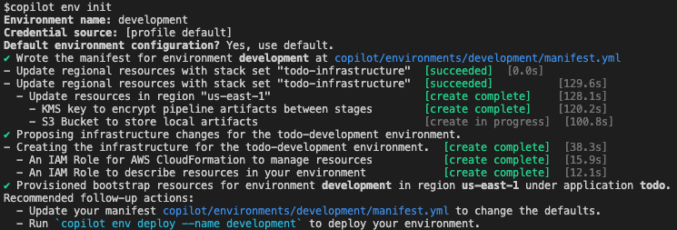

Run the `copilot env ls` command and check if the development environment has been created. You should see an output like this: 

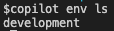

**Step 5:** Deploy a development environment

In the previous step, you initialized the development environment creation. In this step you will deploy the environment infrastructure. Run the `copilot env deploy` command, follow the interactive terminal, and provide the inputs. 

You will be asked a few questions:

* Select an environment manifest from your workspace. Select **development**.

Copilot creates the VPC, Public Subnets, Private Subnets, Route53 Private HostedZone for Service discovery, custom route table, Security Group for containers to talk to each other, and an ECS Cluster to group the ECS services. When the environment creation is complete, you will see this output:

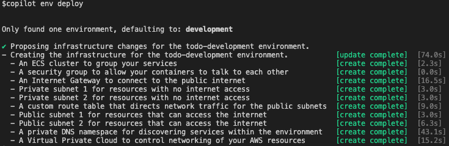

You've set up the development environment and the required infrastructure. In the next sections, you will deploy the infrastructure and the application, starting from backend to frontend.

## **Set Up the Backend Service**

In this section you will set up the ECR repository and backend ECS Service - and deploy the application to Fargate tasks using AWS Copilot. 

**Step 1:** Initialize the backend service

In this step, you will create an ECS service that hosts the backend application within the ECS tasks. As pictured in the architecture diagram, the backend service also needs a DynamoDB table for database. You will be creating that as well in this step via Copilot. 

Run the `copilot svc init` command to create a manifest file which defines your backend service.

You will be asked a few questions and should provide the following answers:

* Which service type best represents your service's architecture? Select **Backend** **Service** and press Enter.
* What do you want to name this service? Enter **backend**.
* Which Dockerfile would you like to use for backend? Select **.Dockerfile** and press Enter.

This command creates an ECR repository to save Docker images for the backend service and creates a `copilot/backend` directory to save a manifest file. When the backend service creation is complete, you will see this output:

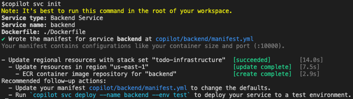 

At this time, Copilot creates only an ECR repository and containers are not running in the cloud yet.

The `copilot svc init` command created a manifest file within the `copilot/backend/manifest.yml` file. Modify that to add a health check configuration to the ECS Task. Open the `copilot/backend/manifest.yml` file and within the `image` section, add the `healthcheck` configuration to the ECS task so that it looks like below.

You can look at the application in `app.py` that has a separate route in the path `/ishealthy` for healthcheck. 

```
image:
  build: backend/Dockerfile
  # Port exposed through your container to route traffic to it.
  port: 10000
 **healthcheck:
    command: ["CMD-SHELL", "curl -f http://localhost:10000/ishealthy || exit 1"]
    interval: 10s
    retries: 2
    timeout: 6s 
    start_period: 10s**
```

**Step 2:** Create a DynamoDB table

In this step, you will be creating the DynamoDB table required by the backend service using Copilot. The backend service uses a DynamoDB table to save to-do items. You can add storage resources to services with the `copilot storage init` command.

Run the `copilot storage init` command to create a DynamoDB table to be used by the backend service. 

You will be asked a few questions and should provide the following answers:

* What type of storage would you like to associate with backend? Select **DynamoDB** and press Enter.
* What would you like to name this DynamoDB Table? Enter **todotable**.
* Do you want the storage to be created and deleted with the backend service? Select **Yes, the storage should be created and deleted at the same time as backend**
* What would you like to name the partition key of this DynamoDB? Enter **TodoId**.
* What datatype is this key? Select **Number** and press **Enter**.
* Would you like to add a sort key to this table? Enter **n**.

By running the `copilot storage init` command, Copilot creates a `copilot/backend/addons` directory and a CloudFormation template: `todotable.yml` there. Copilot uses this template to create additional resources.

When the CloudFormation template creation is complete, you will see the output on the screen as shown here:

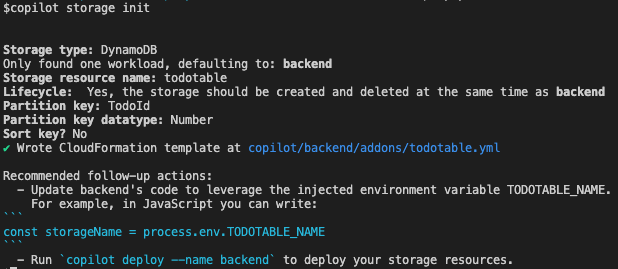

The above setup also creates an environment variable in the ECS Task definition with the name `TODOTABLE_NAME`. If you look at the `app.ts` file, the application is already equipped to use this environment variable in the following line of the code `table_name = os.getenv('TODOTABLE_NAME')`. 

**Step 3:** Deploy the backend service

Run the `copilot svc deploy` command to deploy the backend service to the development environment automatically. You have not built the Docker image, so it will take some time to build a container image. You can see the progress on the terminal.

After the deployment is complete, you should see this output: 

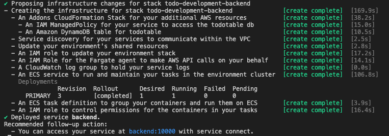 

After deployment, run `copilot svc status` to see the service status. If the status is ACTIVE, then your container is running normally.

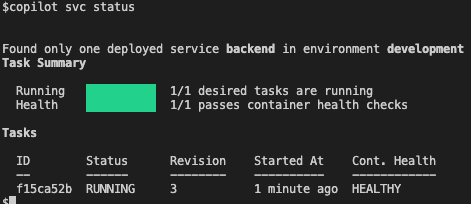

For the backend service, Copilot also sets up the service discovery. Service discovery uses AWS Cloud Map API actions to manage HTTP and DNS namespaces for your Amazon ECS services. `COPILOT_SERVICE_DISCOVERY_ENDPOINT` is a special environment variable that Copilot CLI sets for you when it creates your service. It's of the format `{env name}.{app name}.local` and requests to `/api` are passed to `http://backend.development.todo.local:10000/`. The endpoint `backend.development.todo.local` resolves to a private IP address and is routed privately within your VPC to the backend service. When configuring the frontend service, you can see the code as to how it uses the `COPILOT_SERVICE_DISCOVERY_ENDPOINT` environment variable to access the backend service using service discovery. More information about Service Discovery can be found [here](https://docs.aws.amazon.com/AmazonECS/latest/developerguide/service-discovery.html). 

**Step 4:** Set up the CI/CD pipeline for backend

First, create a new CodeCommit repository to hold the code for the backend service application using AWS CLI: 

```
aws codecommit create-repository —repository-name todobackend —repository-description "My todoapp repository"
```

Then run the `git init` command in the `code` directory to initialize it as a new local git repository, and add a new remote.

>Note: Make sure you are within the **backend** directory

```
git init
git switch -c main
git remote add origin https://git-codecommit.us-east-1.amazonaws.com/v1/repos/todobackend
```

Next, run `copilot pipeline init` to generate a pipeline manifest.

You will be asked a few questions and should provide the following answers:

* What would you like to name this pipeline? Type **todobackend-main** and press Enter.
* What type of continuous delivery pipeline is this? Move to **Workloads** and press Enter.
* Which environment would you like to add to your pipeline? Move to **development** and press Enter.
* Which environment would you like to add to your pipeline? Move to **No additional environments** and press Enter.

Then you should see this output:

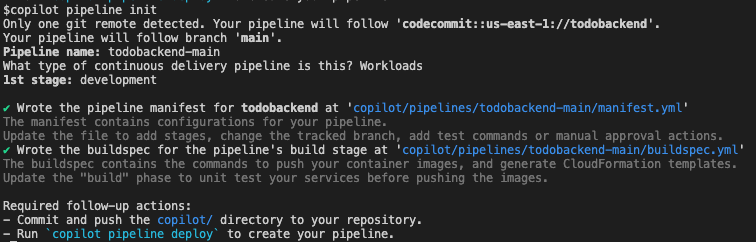

Run `copilot pipeline deploy` to create a pipeline. This command uses the CodeCommit repository that was was added as a remote git repository to the local as a source stage to CodePipeline. Once this command succeeds, you should see the output on the terminal, like this:

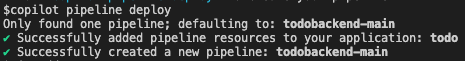

Finally, push the local code to CodeCommit repository:

```
git add -A
git commit -m 'initial commit'
git push origin main
```

>Note: Make sure you push the Copilot directory with all its contents.

At this point, you can go to the AWS CodePipeline console on your AWS account to see the pipeline running. Any future changes to the backend application can be made within the git repository, and pushing it to the remote repository should automatically deploy your code via CodePipeline.  

## **Set Up the Frontend Service**

In this section, you will set up the frontend service. We already set up the application and environment for our application while setting up the backend service in the previous section. We will reuse the same application and environment for setting up the frontend service. 

**Step 1:** Navigate to the frontend directory

Make sure you are within the `code/frontend` directory. Use the below command to change directory:

```
cd frontend
```

The folder structure should look like this:

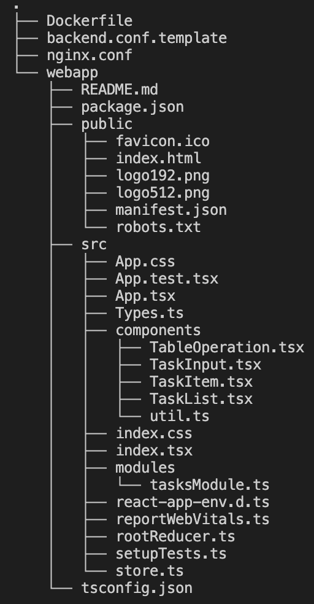

**Step 2:** Initialize the application

Execute `copilot app init` to reuse the application that we created for the backend application. The interactive terminal will ask to choose the from existing application.

You will be asked a few questions and should provide the following answers:

* Would you like to use one of your existing applications? (Y/n) Choose **Y**.
* Which existing application do you want to add a new service or job to? [Use arrows to move, type to filter, ? for more help] Choose **todo**.

You should see these results:

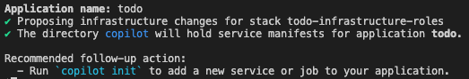

**Step 3:** Reuse the development environment

Since we are reusing the environment that was created while setting up the backend service, we have to generate a manifest for the environment by hand using the below commands:

1. `mkdir -p copilot/environments/development`
2. `copilot env show -n development --manifest > copilot/environments/development/manifest.yml`

**Step 4:** Initialize the frontend service

In this step, you will create an ECS service that hosts the frontend application within the ECS tasks.

If you are wondering how the frontend service knows about the backend service, then take a look at the Nginx configuration file: `backend.conf.template`. Requests to `/api` are passed to `backend.${COPILOT_SERVICE_DISCOVERY_ENDPOINT}`. `COPILOT_SERVICE_DISCOVERY_ENDPOINT` is a special environment variable that Copilot CLI sets for you when it creates your service. It's of the format `{env name}.{app name}.local` and requests to `/api` are passed to `http://backend.development.todo.local:10000/`. The endpoint `backend.development.todo.local `resolves to a private IP address and is routed privately within your VPC to the backend service. More information about Service Discovery can be found [here](https://docs.aws.amazon.com/AmazonECS/latest/developerguide/service-discovery.html). 

Run the `copilot svc init` command to create a manifest file which defines your frontend service.

You will be asked a few questions and should provide the following answers:

* Which service type best represents your service's architecture? Select **Load Balanced Web Service** and press Enter.
* What do you want to name this service? Enter **frontend**.
* Which Dockerfile would you like to use for backend? Select **.Dockerfile** and press Enter.

This command creates an ECR repository to save Docker images for the backend service and creates a `copilot/frontend` directory to save a manifest file. When the backend service creation is complete, you will see this output:

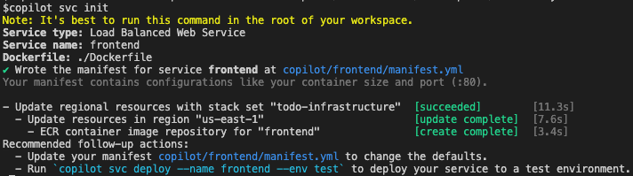

**Step 5:** Deploy the frontend service

Run `copilot svc deploy` to deploy the frontend service to the development environment automatically. You have not built a docker image so it will take some time to build a container image. You can see the progress on the terminal.

After the deployment is complete, you should see this output:

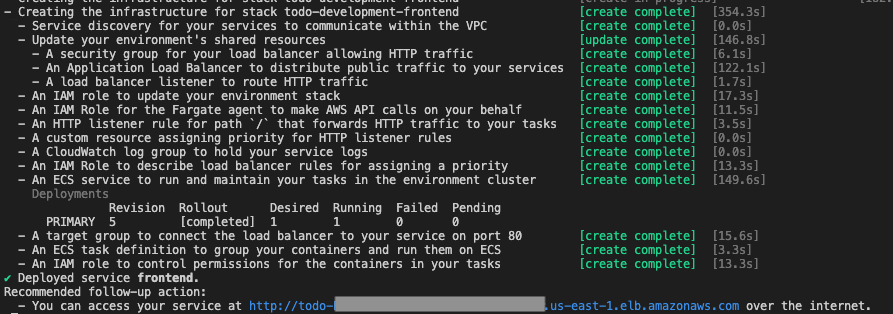

Make a note of the URL for your service, as shown in the above screenshot. 

After deployment, run `copilot svc status` to see the service status. If the status is ACTIVE then your container is running normally.

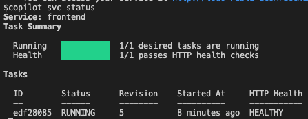

At this point, we have deployed both the frontend and backend services. You should be able to access the todo application on any browser using the ALB URL that you noted earlier. 


**Step 6:** Setup CI/CD pipeline for frontend

First, create a new CodeCommit repository to hold the code for the backend service application using AWS CLI: 

```
aws codecommit create-repository —repository-name todofrontend —repository-description "My todoapp frontend repository"
```

Then run `git init` in the `code` directory to initialize it as a new local git repository, and add a new remote.

>Note: Make sure you are within the **backend** directory.

```
git init
git switch -c main
git remote add origin https://git-codecommit.us-east-1.amazonaws.com/v1/repos/todofrontend
```

Run `copilot pipeline init` to generate a pipeline manifest.

You will be asked a few questions and should provide the following ansewrs:

* What would you like to name this pipeline? Type **todofrontend-main** and press Enter.
* What type of continuous delivery pipeline is this? Move to **Workloads** and press Enter.
* Which environment would you like to add to your pipeline? Move to **development** and press Enter.
* Which environment would you like to add to your pipeline? Move to **No additional environments** and press Enter.

Then you should see this output:

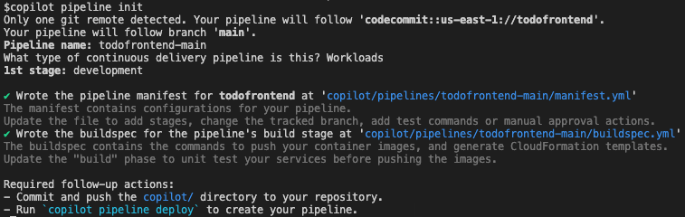

Next, run `copilot pipeline deploy` to create a pipeline. This command uses the CodeCommit repository that was was added as a remote git repository to the local as a source stage to CodePipeline. Once this command succeeds, you should see this output:


Finally, push the local code to CodeCommit repository:

```
git add -A
git commit -m 'initial commit'
git push origin main
```

>Note: Make sure you push the Copilot directory with all its contents.

At this point, you can go to the AWS CodePipeline console on your AWS account to see the pipeline running. Any future changes to the front application can be made within the git repository, and pushing it to the remote repository should automatically deploy your code via CodePipeline.  

## Conclusion

I hope you followed the steps outlined above and enjoyed configuring the infrastructure to host you microservices application on Amazon ECS, and also deployed a CI/CD pipeline for your application code deployment using AWS Copilot. AWS Copilot is a powerful CLI that helps you accelerate from 0 to 100 MPH under 60 mins in building the infrastructure and deployment platform that is well architected and applied with AWS best practices. Also, if you see how you reused an existing environment and application while creating the frontend service, you can add more microservices with their own CI/CD processes in a similar way as when the functionality of your application is enhanced. 
