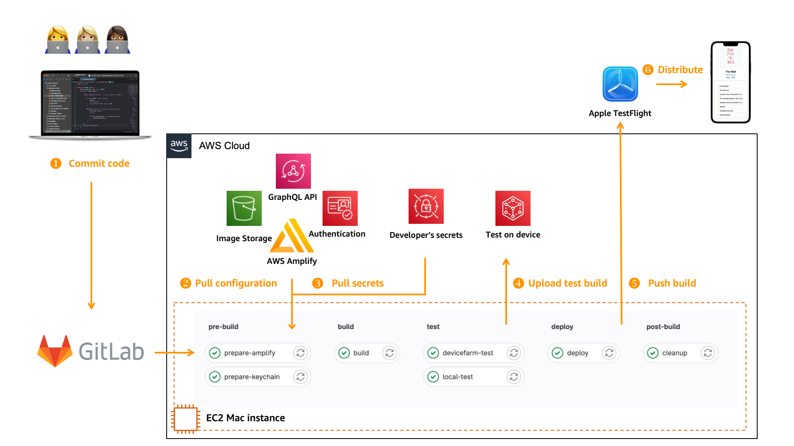

|ToC|
|---|

When it comes to building, testing, and deploying applications, software development engineers and devops engineers must master the art of automation. Today, most backend or frontend web applications are built automatically and, sometimes, are also deployed to production as changes occur.

The workflows that facilitate this process - fetching code, building it alongside code from other developers, running various tests, and even deploying the changes - are called continuous integration and continuous deployment, or CI/CD for short. CI/CD helps to reduce the time to deliver new code to your customers. It also helps to detect issues faster and to accelerate feedback cycles. The IT industry considers CI/CD as a best practice.

While CI/CD workflows for Linux and Windows have been thoroughly explained, though, building such pipelines to develop applications for Apple operating systems is less commonly understood. iOS, iPadOS, tvOS, watchOS, and macOS require their own unique approach to CI/CD, and building that pipeline is what we'll be learning how to do in this post.

## Benefits of Automation

Code is an investment: you spend intellectual effort and time to write it, and your organization will maintain and evolve it for years, sometime for decades to come.

But code can also be a liability. Undeployed code is essentially unsold inventory: your investment (and your company's investment) will only unlock value for customers (and therefore for your organization) when it lands in their hands - as a web site, a mobile app, or some kind of functionality they can use. The only place where code is happy is in production. Don't keep unreleased code.

Automation helps ensure code doesn't become a liability. It reduces the time it takes to write, test, deploy, and release code into production. This sort of automation, in the form of a CI/CD pipeline, has seven high-level benefits.

1. Faster time to market: CI/CD pipelines automate the software delivery process, making it faster and more efficient, and reducing time to market. By automating tasks, CI/CD reduces the quantity of manual operations required to build, test, and deploy code.

2. Increased quality: By automating the testing process, CI/CD pipelines ensure that your code is tested continuously throughout the development cycle, improving software quality and reducing the risk of bugs and defects going into production unnoticed. It is easier to catch errors when small changes are tested incrementally rather than testing large chunks of code changed during the last 6 months.

3. Better collaboration: CI/CD pipelines facilitate collaboration between development and operations teams, enabling them to work together more effectively.

4. Enhanced visibility: CI/CD pipelines provide real-time visibility into the development process, enabling teams to identify and address issues quickly, reducing downtime and increasing productivity. This is typically achieved by a publishing dashboard with key quality metrics, such as the number of successful builds and deployments.

5. Improved security: CI/CD pipelines typically integrate security testing and validation into the development process, reducing the risk of security vulnerabilities and breaches. The deepness of security checks depends on your requirements. It can range from a verification of your dependencies to a static code analysis.

6. A better feedback loop: CI/CD pipelines provide immediate feedback on changes made in the development process, enabling developers to identify and fix issues quickly. As a developer, you may receive immediate feedback about a change you made in the code. Fixing issues as they arise is easier than having to come back to changes you made months ago.

7. Increased scalability: CI/CD pipelines enable teams to scale up or down quickly, depending on the needs of the project, without sacrificing quality or efficiency. Larger teams have hundreds of developers, thousands of packages, and are making hundreds of changes every single day. Automation is the only known technique allowing you to scale your development teams.

## Specificities of Building for Apple Operating Systems

To build and sign applications distributed on the App Store, you have to use a macOS machine. Macs are the only officially supported way to create and sign your iOS application binaries.

While many developers are comfortable using macOS and its graphical user interface (GUI), automating a build, sign, test, and deploy process using just the command-line presents a few unique challenges, such as:

- Getting access to the machine itself: Are you going to use your laptop 💻? (Spoiler alert: this is not a good idea.) A set of machine on-premises in a closet? Or cloud-based machines?

- Accessing the machine remotely: Assuming your machine is in the cloud, how do you securely access it?

- Configuring the machine as a build and test server, only using the command line: It is easy and well-documented how to install tools on macOS using the graphical user interface, but can you install the same set of tools just by using a command-line interface?

- Managing signing keys and certificates and the code signing process: Apple does a great job of making the code-signing process easy to use and mostly transparent when you use [Xcode](https://developer.apple.com/xcode/), the Apple development environment. But when replicating the configuration using the command-line, you have to take care of low-level details otherwise hidden.

- Scaling and automating the whole process: It is important to eliminate any manual step in your pipelines to be able to scale your build farm of machines and meet the requirements from your team as it grows.

Let's tackle some of these challenges in the following sections. This post is a high-level overview of the steps, but I will write and add detailed tutorials in the coming weeks.

## Your macOS Machine

Using on-premises and self-managed machines for your pipelines is not a good idea. It often involves long procurement processes, which then leave you responsible for the physical installation and security of the machines. What's more, they're not easy to replace [when they fail](https://www.slideshare.net/AmazonWebServices/high-availability-websites-part-one/12-Everything_fails_all_the_time).

Your development team will also ask you to have access to multiple machines running a mix of previous, current, and future versions of macOS and Xcode. This is often required to continue supporting older versions of your app running on older operating system versions and to test new releases as soon as beta versions of operating systems are available. Manually managing these configurations is a no-go over time.

For the same reasons you choose to use managed services in the cloud, consider using macOS machines in the cloud instead of on-premises.

The good news is that you have multiple options to do so. AWS offers [Amazon EC2 Mac](https://aws.amazon.com/ec2/instance-types/mac/?sc_channel=el&sc_campaign=devopswave&sc_geo=mult&sc_country=mult&sc_outcome=acq&sc_content=cicd-for-ios-app) instances that combine all the things you know about EC2, applied to Mac Minis. The advantage of using EC2 Mac, when you are already using AWS and EC2, is that your macOS machines fit into your existing billing, provisioning, security, and auditing processes. You know how to automate their lifecycle using [Infrastructure as Code](/tags/infrastructure-as-code). You know how to secure access using [security groups](https://docs.aws.amazon.com/AWSEC2/latest/UserGuide/ec2-security-groups.html?sc_channel=el&sc_campaign=devopswave&sc_geo=mult&sc_country=mult&sc_outcome=acq&sc_content=cicd-for-ios-app), [SSH keys](https://docs.aws.amazon.com/AWSEC2/latest/UserGuide/ec2-key-pairs.html?sc_channel=el&sc_campaign=devopswave&sc_geo=mult&sc_country=mult&sc_outcome=acq&sc_content=cicd-for-ios-app), [IAM policies](https://docs.aws.amazon.com/AWSEC2/latest/UserGuide/iam-policies-for-amazon-ec2.html?sc_channel=el&sc_campaign=devopswave&sc_geo=mult&sc_country=mult&sc_outcome=acq&sc_content=cicd-for-ios-app) etc.

But you may also choose other providers, such as [CircleCI](https://circleci.com/docs/using-macos/), [Github](https://docs.github.com/en/actions/using-github-hosted-runners/about-github-hosted-runners#supported-runners-and-hardware-resources), [Gitlab](https://docs.gitlab.com/ee/ci/runners/saas/macos/environment.html#vm-images), or [Azure DevOps](https://azure.microsoft.com/en-us/products/devops/#features).

## Your Build Tools

Depending on your cloud provider, you may access a machine installed with just the OS, or already partially configured for development. In most cases, additional libraries and tools are required to meet your specific application requirements, such as the toolchain, dependencies, build tools, testing tools, monitoring and management agents, and so on.

When I use EC2 Mac, some of the typical tools used by a cloud developer are pre-installed: [brew](https://brew.sh/), [the AWS command-line](https://formulae.brew.sh/formula/awscli), [the SSM agent](https://docs.aws.amazon.com/systems-manager/latest/userguide/install-ssm-agent-macos.html?sc_channel=el&sc_campaign=devopswave&sc_geo=mult&sc_country=mult&sc_outcome=acq&sc_content=cicd-for-ios-app).

My laundry list of additional tools is usually:

**Xcode**: [Xcode](https://developer.apple.com/xcode/) is required to build and sign applications distributed on the App Store. Xcode comes with command line tools allowing you to build, sign, test, and archive packages. Installing Xcode requires an [Apple ID](https://appleid.apple.com/). I developed a tool called ([xcodeinstall](https://github.com/sebsto/xcodeinstall)) to allow you to download and install Xcode from the command line without having to use a web browser. The tool securely stores your Apple ID and your session credentials in AWS Secrets Manager. Because Secret Manager's secrets are accessible from multiple machines, I typically authenticate and create a session from the security and comfort of my laptop. Then I use `xcodeinstall` on the cloud machine to download and install the specific version of Xcode my project requires.

**xcbeautify**: [xcbeautify](https://github.com/tuist/xcbeautify) is a command-line tool to make the output text of your build command easier to read.

**jq**: [jq](https://stedolan.github.io/jq/) is a command-line parser and filter for JSON documents. I use `jq` a lot in my shell scripts.

**amplify**: This one is specific to AWS. [Amplify](https://docs.amplify.aws/?sc_channel=el&sc_campaign=devopswave&sc_geo=mult&sc_country=mult&sc_outcome=acq&sc_content=cicd-for-ios-app) is a command-line tool and a set of libraries to help application developers to manage and access cloud-based services, such as REST or GraphQL API, object storage, identity management, geo location, etc.

I try to stay away from tools written in [Ruby]((https://www.ruby-lang.org/en/)) (such as [cocoapods](https://cocoapods.org) and [fastlane](https://fastlane.tools)) because of the extra complexity to install specific versions of Ruby and to manage the versioning of Ruby's dependencies. But that's a personal preference. Of course, you will customize this list based on your actual project requirements and your own preferences.

Installing these might take a significant amount of time (Xcode download and installation alone might take up to 30 minutes). When using EC2 Mac, the best practice is therefore [to capture a snapshot of your disk image](https://docs.aws.amazon.com/AWSEC2/latest/UserGuide/EBSSnapshots.html?sc_channel=el&sc_campaign=devopswave&sc_geo=mult&sc_country=mult&sc_outcome=acq&sc_content=cicd-for-ios-app) and [store it as a machine image](https://docs.aws.amazon.com/AWSEC2/latest/UserGuide/creating-an-ami-ebs.html?sc_channel=el&sc_campaign=devopswave&sc_geo=mult&sc_country=mult&sc_outcome=acq&sc_content=cicd-for-ios-app) to start other machines based on the same disk image in the future.

## Your Build Agent

Build agents (or runners) are small applications that run your build and test commands, being based on shell scripts or build tools. Your code repository triggers the build agent when there is a change in your code. The build agent runs on macOS and will execute a sequence of commands that you specify in the build configuration. Most CI/CD systems use YAML files to describe a build pipeline. See the "Your Build Pipeline" section below for an example of the tasks I run.

The build agent must be installed on the build machine. [CircleCI](https://circleci.com/docs/runner-installation-mac/), [GitLab](https://docs.gitlab.com/runner/install/osx.html), and [GitHub](https://docs.github.com/en/actions/hosting-your-own-runners/adding-self-hosted-runners) propose a build agent for macOS.

I found out that the installation instructions from these three providers only address the case where you run your machine with a graphical user interface. The provided documentation doesn't cover the case where you want to run the agent as an operating system daemon, automatically started at boot time.

To understand the difference, I must explain a bit about how to start background applications on macOS. macOS provides two types of background apps: launch agents and launch daemons.  Launch agents are started when you start a GUI session, typically when you authenticate on your mac machine. Launch daemons are started when the OS boots. macOS's [launchd](https://support.apple.com/guide/terminal/script-management-with-launchd-apdc6c1077b-5d5d-4d35-9c19-60f2397b2369/mac) process make sure the agents and daemons are started at the right moment and stay up and running. It automatically restarts failed processes.

Launch agents have access to the session context of the GUI, including the keychain. Launch daemons are started before a user login and have no access by default to the session context. This means launch daemons have no access to the user keychain, by default. The [keychain](https://support.apple.com/guide/keychain-access/what-is-keychain-access-kyca1083/mac) is a secure database where macOS store secrets. This is where you store the code signing key and certificate.

Here we want to use the machine without GUI session ever. We must therefore install our build agent (runner) as a launch daemon. We also must tell the agent to run as a specific macOS user, from a working directory where it has enough permissions to read and write files. Finally, the `plist` launch script must contain the `<key>SessionCreate</key><true/>` line. It allows a daemon to create a session similar to a GUI session and to have access to the user keychain.

You will find an example of launch daemons scripts for [circleci](https://github.com/sebsto/amplify-ios-getting-started/blob/main/.circleci/lanch-daemon-com.circleci.runner.plist), [GitHub](https://github.com/sebsto/amplify-ios-getting-started/blob/main/.github/workflows/github-runner.md), and [GitLab](https://github.com/sebsto/amplify-ios-getting-started/blob/main/.gitlab-runner.md) in [my repository](https://github.com/sebsto/amplify-ios-getting-started).

## Your Build Scripts

You write build scripts to build and test your applications. I typically develop [shell scripts](https://github.com/sebsto/amplify-ios-getting-started/tree/main/code/cli-build) for these tasks. Some customers use higher level build tools such as [fastlane](https://fastlane.tools/), [buck](https://fastlane.tools/) (from Facebook), or [bazel](https://bazel.build/) (from Google). The latter two make sense for complex builds, with many dependencies and large pool of developers. Don't embark on the journey to configure these tools for simple projects and small teams.

For small and mid-size projects, I like working with shell scripts because it reduces the dependencies on third-party tools and it obliges me to fully understand the logic of what's going on during my build. It's a bit like writing assembly or C code instead of using higher-level programming languages. But it comes at the cost of more lines of code to write and to maintain.

The build scripts, whatever build system you choose, must be versioned alongside your code and stored in the same repository as your application sources.

I strongly advise you to test your build scripts on a remote machine without using the graphical user interface. You will find that some macOS components behave differently when invoked from the context of a graphical user interface session vs from a command-line. Pay particular attention to [code signature](https://support.apple.com/guide/security/app-code-signing-process-sec7c917bf14/web) and the manipulation of the keychain.

## Your Build Pipeline (or Workflow)

Typically, my builds are made of six distinct phases that must be accomplished in sequence (one after the other). I code each phase with one or multiple shell scripts. The animation hereafter illustrates the whole pipeline. It is based on GitLab, but the exact same architecture applies to circleci and GitHub.

**Phase 1**: prepare the machine. I use this phase to prepare the machine before the build. This phase implies downloading the signing key and certificate and storing them into a temporary keychain created just for this build. I also verify if the Apple root signing certificate is correctly installed in the macOS System keychain, gather other secrets such as the Apple ID credentials and [the mobile provisioning profile](https://developer.apple.com/help/account/manage-profiles/create-a-development-provisioning-profile/).

**Phase 2**: a security check. This phase usually triggers another system that checks the security status of the packages my application relies upon. There are multiple systems available. I typically use [Snyk Open Source](https://snyk.io/product/open-source-security-management/).

**Phase 3**: the build itself.  Usually this is a single `xcodebuild` command.

**Phase 4**: the test. There are three types of tests: unit tests, the GUI test on a device simulator, and the GUI test on actual physical devices. All three types of tests can be fully automated. Expect more about this in a future article.

**Phase 5**: the deployment. This is where I push the newly built binary to the App Store for distribution to my test user, using Apple's [TestFlight](https://developer.apple.com/testflight/) app.

**Phase 6**: the cleaning. This is where I clean the build environment. I delete the temporary keychain and mobile provisioning profile, delete the build directory, etc.

Some systems (circleci and GitLab) entirely clean your directory between each phase of the build. It is important to configure the pipeline to keep the files or directories you want to preserve between phases.

You will find examples of pipeline definitions for [CircleCI](https://github.com/sebsto/amplify-ios-getting-started/blob/main/.circleci/config.yml), [GitHub](https://github.com/sebsto/amplify-ios-getting-started/blob/main/.github/workflows/ContinuousIntegration.yml), and [GitLab](https://github.com/sebsto/amplify-ios-getting-started/blob/main/.gitlab-ci.yml) in [my repository](https://github.com/sebsto/amplify-ios-getting-started).

## Your Other Challenges

This article shares a high-level overview of the key points to pay attention to when preparing a macOS machine to run your CI/CD pipelines. I will complement this overview with hands-on tutorials covering the different steps I wrote about here. But before letting you experiment on your own, I would like to mention three typical other challenges you will encounter during your first project.

**Where do I store my secrets?** Your builds depend on multiple secrets: the code signing key and certificate, the mobile provisioning profile, your Apple ID credentials to connect to the AppStore, and so on. There are multiple options to store these secrets depending on the provider you choose. On AWS, I use [Secrets Manager](https://docs.aws.amazon.com/secretsmanager/latest/userguide/intro.html?sc_channel=el&sc_campaign=devopswave&sc_geo=mult&sc_country=mult&sc_outcome=acq&sc_content=cicd-for-ios-app). My build shell scripts use the the AWS command-line to retrieve secrets during the preparation phase of the build.

**How do I centralize logs?** You might want to push the build logs files to a central location for easier searching and debugging or to create dashboards. Again, multiple solutions exist. On AWS, I typically use [CloudWatch Logs](https://docs.aws.amazon.com/AmazonCloudWatch/latest/monitoring/Install-CloudWatch-Agent.html?sc_channel=el&sc_campaign=devopswave&sc_geo=mult&sc_country=mult&sc_outcome=acq&sc_content=cicd-for-ios-app) for this purpose. You need to [install and configure the CloudWatch logs agent](https://docs.aws.amazon.com/AmazonCloudWatch/latest/monitoring/installing-cloudwatch-agent-commandline.html?sc_channel=el&sc_campaign=devopswave&sc_geo=mult&sc_country=mult&sc_outcome=acq&sc_content=cicd-for-ios-app) on macOS.

**How do I ensure build environments are identical?** Building from the macOS machine is not the ideal solution. How can you ensure the build environment is correctly cleaned between builds and that your n+1 build will not fail because of an artifact created during build n? The Linux world uses docker containers to solve that problem. Every time a docker container is started, it is started in a well-known initial state. Any changes made during the build will be lost when the container stops. Unfortunately, macOS cannot run inside a container (at least [not officially in a supported way](https://github.com/sickcodes/Docker-OSX)). But you can achieve the same effect with virtual machines (VM). You can create a macOS VM on top of a physical macOS server (on-premises or in the cloud) and run your build pipelines in the VM. That way, the build agent runs on the physical machine and start a VM on-demand for each individual builds. Multiple systems exist to provide developers with transient VM on macOS. Our customers often use [Tart](https://github.com/cirruslabs/tart/) or [Anka](https://veertu.com/anka-build/) for doing so.

## Conclusion

Now you have a high-level overview of the setup and configuration it requires to automate your builds on macOS and to create your first CI/CD pipelines on macOS.

Let me know your feedback on [Twitter](https://twitter.com/sebsto), [Mastodon](https://awscommunity.social/@sebsto), or [LinkedIn](https://www.linkedin.com/in/sebastienstormacq/).
