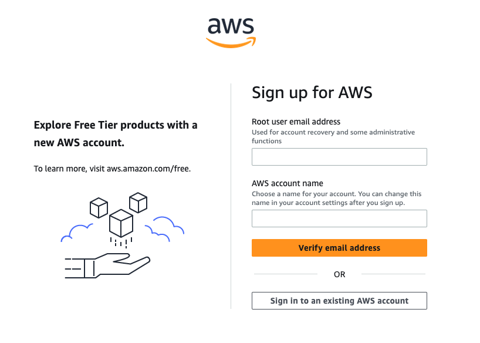
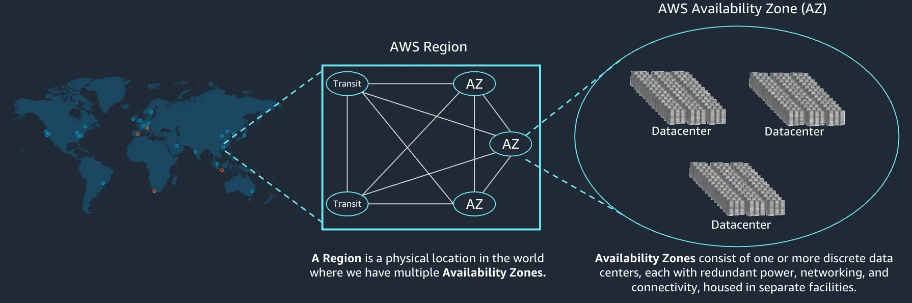
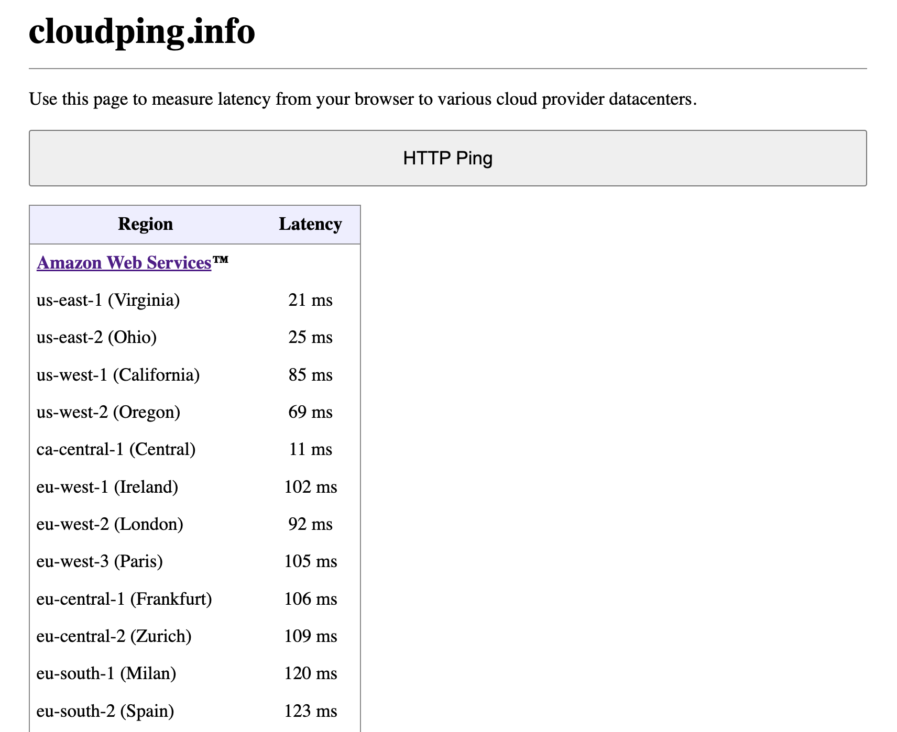
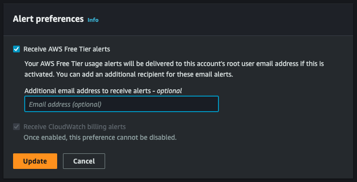
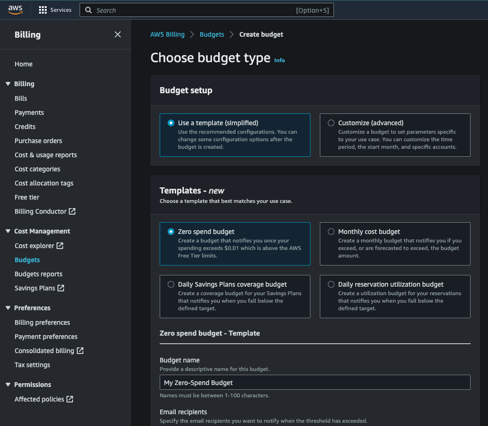
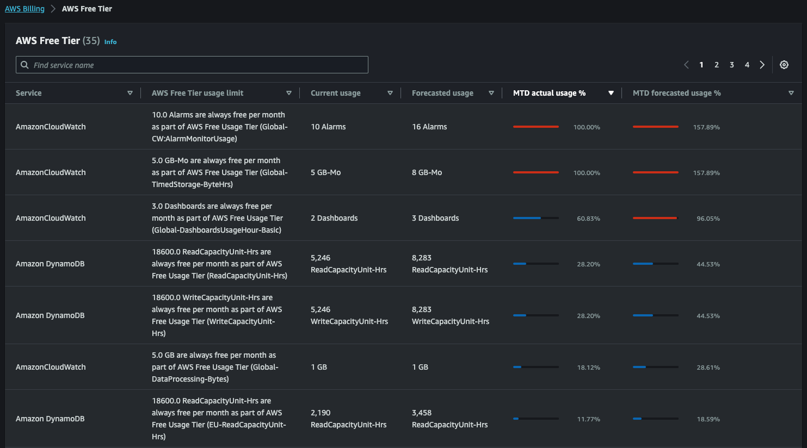
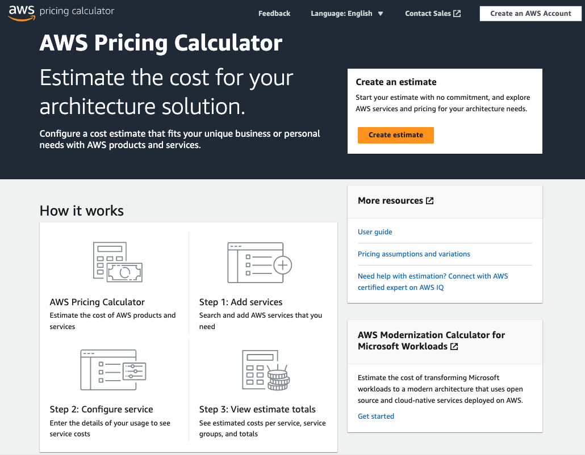
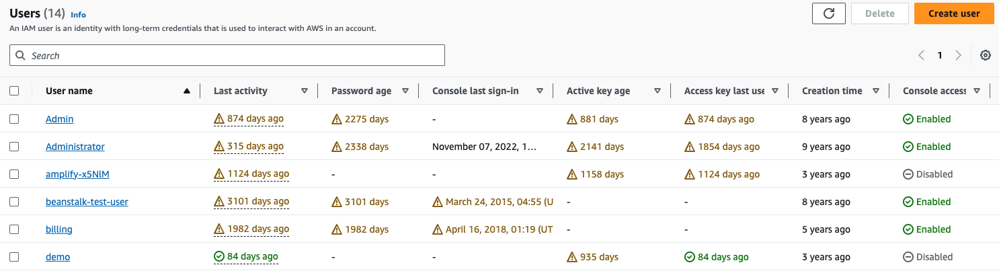
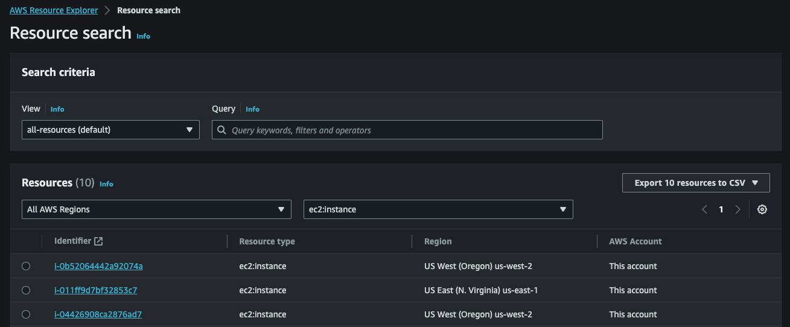

| ToC |
|-----|

## Introduction

Setting up an AWS cloud account is a significant step in your cloud journey, but navigating the vastness of its capabilities requires more than just sign-up knowledge.

Its been more than a decade since I have been working with AWS products and services - as a customer and as an employee. Throughout this time, I've had the privilege of observing the curiosity of builders like yourself, frequently posing similar questions about how to set the foundation right.

Over the years, certain patterns of best practices have emerged, strategies that make the difference between a smoothly operating AWS environment and one that is riddled with challenges. Ensuring a solid foundation in your AWS cloud account is paramount to optimize costs, enhance security, and ensure smooth operations.

Today, I'll share five of those best practices for AWS cloud account fundamentals, to guide you in setting up and maintaining your AWS environment in the most effective way possible. While my focus is cost here, these practices will also help you secure your account from malicious activities. By the end of this blog, you'll have insights drawn from years of experience, ensuring that your cloud journey is set on the right path from the very beginning.

## 1. Understanding AWS Accounts

An [AWS Account](https://portal.aws.amazon.com/billing/signup#/start/email?sc_channel=el&sc_campaign=costwave&sc_content=cloud-account-fundamentals&sc_geo=mult&sc_country=mult&sc_outcome=acq) is how you access the AWS Services. The AWS account can be created quickly by using a credit card. All the best practices listed here are to help you NOT overspend and put in the guardrails.

Before you begin creating the account consider following scenarios:

### 1.1 Is this a personal or business account?

- If this is your **personal account**, ensure you are creating this account with right intentions. The reason I say this is, many students or beginners create AWS account with a credit card (if they can get any), and then regret when resources are left unused and they receive a bill they cannot afford. If you are just starting to learn and want to play with AWS, then check out **[AWS Educate Account](https://aws.amazon.com/education/awseducate?sc_channel=el&sc_campaign=costwave&sc_content=cloud-account-fundamentals&sc_geo=mult&sc_country=mult&sc_outcome=acq)**. It requires **no credit card** and provides labs where you can practice and get experience with AWS services. Once you have experience, you can then create an AWS account with a credit card and continue exploring.

- If this is your **business account**, then make sure you use company e-mail address that is an alias in your company domain. I have seen customers using one individual's company email address, and regret when this person is on holiday, has changed roles or left the company. **Create an email alias** in your company domain (e.g. `aws-admins@example.com`), add multiple administrators to it and then use this alias to create the AWS account. This will ensure you retain access to the AWS account, even if any of the employees move to different role or leave the company. Also, AWS emails will be sent to the distribution list and do not have single point of failure on one individual. Same with the phone number, **use a corporate phone number** instead of a personal one. You can eventually convert payment method to invoicing instead of the credit card.

> Never ignore emails from AWS

Choosing the right email address is important. AWS sends important information about your account and bills to this email address. If you set the additional alerts mentioned in this blog, you can be always aware of your cloud spend.

> If you are thinking of setting up multiple AWS accounts using [AWS Organizations](https://docs.aws.amazon.com/organizations/latest/userguide/orgs_introduction.html?sc_channel=el&sc_campaign=costwave&sc_content=cloud-account-fundamentals&sc_geo=mult&sc_country=mult&sc_outcome=acq), you can use what is known as "plus addressing" or "subaddressing". This is where you add in a `+` and another string to your email, e.g. `my-email+dev-account@example.com`. This has the benefit of allowing multiple "unique" email addresses for setting up AWS account, and centralizing your mails from AWS to a single mail box. Any mail with the `+something` will deliver to the same mail box as the one without it. For a quick overview on setting up and managing multiple AWS accounts with Organizations, have a look at this post on hot to [Manage Security and Costs Across the Enterprise With AWS Organizations](/tutorials/practical-cloud-guide/manage-security-and-costs-across-the-enterprise-with-aws-organizations).

### 1.2 Do you need single or multiple AWS Accounts?

Typically, a single account suffice the individual needs.

However, there are many reasons why businesses would prefer multiple AWS accounts. You may want isolation between accounts. You may want control over security, and data access. Or you have different teams and business units and want to charge back to them for cloud spend. Or you want to keep your production and non-production workloads in different accounts. This can give you visibility on your development vs production spend. And with this strategy I have also found customers opting for [AWS Support charges](https://docs.aws.amazon.com/awsaccountbilling/latest/aboutv2/consolidatedbilling-support.html?sc_channel=el&sc_campaign=costwave&sc_content=cloud-account-fundamentals&sc_geo=mult&sc_country=mult&sc_outcome=acq) only for Production accounts.

[AWS Service Quotas](https://docs.aws.amazon.com/general/latest/gr/aws_service_limits.html) (formerly known as limits) are applied separately for each AWS Account, so you can always ensure your Production environment has the required quotas to scale. [AWS Organizations](https://docs.aws.amazon.com/organizations/latest/userguide/orgs_introduction.html?sc_channel=el&sc_campaign=costwave&sc_content=cloud-account-fundamentals&sc_geo=mult&sc_country=mult&sc_outcome=acq), which is a free AWS service, can help you manage multiple accounts in your organizations. While you can get separate account level bills, you can still get all your [bills consolidated](https://docs.aws.amazon.com/awsaccountbilling/latest/aboutv2/consolidated-billing.html?sc_channel=el&sc_campaign=costwave&sc_content=cloud-account-fundamentals&sc_geo=mult&sc_country=mult&sc_outcome=acq) to single payer, and combine usage across all accounts to share the volume pricing discounts, Savings plans and Reserved Instance discounts. Your multi-account strategy will help you set a good foundation on how you control cost.

These reasons for multiple accounts are detailed in the AWS documentation - [do you need multiple AWS accounts](https://docs.aws.amazon.com/accounts/latest/reference/welcome-multiple-accounts.html?sc_channel=el&sc_campaign=costwave&sc_content=cloud-account-fundamentals&sc_geo=mult&sc_country=mult&sc_outcome=acq) and [Why should I set up a multi-account AWS environment?](https://aws.amazon.com/organizations/getting-started/best-practices/?sc_channel=el&sc_campaign=costwave&sc_content=cloud-account-fundamentals&sc_geo=mult&sc_country=mult&sc_outcome=acq).

If you do not wish to create separate accounts, you should, at the very least, ensure that you have a tagging strategy and some form of separation with VPCs and/or Regions:

- Tagging strategy can help you gain visibility and management of cost and usage. It is detailed out in the AWS documentation - [Tags for cost allocation and financial management](https://docs.aws.amazon.com/whitepapers/latest/tagging-best-practices/tags-for-cost-allocation-and-financial-management.html).

- You can create separate Amazon Virtual Private Cloud (VPC) for your different environments. This will help you isolate your workloads in the same account. **Do NOT use the default VPC or the default security group inside a VPC for Production workloads.**  I have had a customer where a developer took down an entire e-commerce website (loss of revenue) because they changed a security group rule in a default security group, thinking they are doing it for the dev/test environment. So, **no sharing, isolate, and add layers to your security.**

## 2. Choosing AWS Regions

If you are just starting with AWS, there are 2 important concepts you need to understand - **Regions**, and **Availability Zones**. AWS services and resources are hosted in multiple locations world-wide and these separate geographic areas are called as AWS Regions. Each Region has multiple, isolated locations known as Availability Zones. This is to ensure you have a highly-available, fault tolerant environment.

Choosing which AWS Region to use depends on multiple factors:

- **Latency:**
  If this is an application/website to service end customers and latency is of utmost important then identify where are majority of your customers located and choose the AWS Region closest to your customers. This helps reduce Internet latency. While geographical distances matter the most, it does not always guarantee that the closest in distance means faster network latency. Sometimes it also depends on how Internet Service Providers (ISP) have laid out their network. To find out the closest AWS Region for lower internet latency, you can use third-party sites like [cloudping.info](https://www.cloudping.info/) and open source CLI tool like [awsping](https://github.com/ekalinin/awsping). They send a http ping from your local browser to AWS resources in different regions.

  For example, in the screenshot below you can see that from my home in Toronto, ca-central-1 i.e. Canada (Central) has the lowest latency of ~11ms.

  

  There are many more resources in the [AWS Global Infrastructure](https://aws.amazon.com/about-aws/global-infrastructure?sc_channel=el&sc_campaign=costwave&sc_content=cloud-account-fundamentals&sc_geo=mult&sc_country=mult&sc_outcome=acq) like [AWS Local Zones](https://docs.aws.amazon.com/local-zones/latest/ug/getting-started.html?sc_channel=el&sc_campaign=costwave&sc_content=cloud-account-fundamentals&sc_geo=mult&sc_country=mult&sc_outcome=acq), [Edge Locations](https://docs.aws.amazon.com/AmazonCloudFront/latest/DeveloperGuide/Introduction.html?sc_channel=el&sc_campaign=costwave&sc_content=cloud-account-fundamentals&sc_geo=mult&sc_country=mult&sc_outcome=acq) etc, that can help reduce latency which we will not be covering in this post.

- **Cost:**
  It is important to remember that each AWS Region is completely independent, and so is their pricing. Each service has pricing listed based on the Regions. Whenever you provision a resource, for example, [Amazon EC2 instance](https://aws.amazon.com/ec2/pricing/on-demand/?sc_channel=el&sc_campaign=costwave&sc_content=cloud-account-fundamentals&sc_geo=mult&sc_country=mult&sc_outcome=acq) you will be charged for that instance type based on its region.  
  
  Not all components of your application require high latency, for example, a development environment may not require high latency and can be hosted in a different cost-effective region while the production environment is hosted in low-latency region.
  
  Anecdotally, the `US-EAST-1` is the most cost-effective region and can be used to lower your cost. I suggest using the [AWS Pricing Calculator](https://calculator.aws?sc_channel=el&sc_campaign=costwave&sc_content=cloud-account-fundamentals&sc_geo=mult&sc_country=mult&sc_outcome=acq) to cost estimate your needs.
  
  In addition to that, if your workload is stateless, fault-tolerant, or flexible such as containerized workloads, CI/CD, web servers, test & development workloads, then you can use [Spot instances](https://aws.amazon.com/ec2/spot/getting-started?sc_channel=el&sc_campaign=costwave&sc_content=cloud-account-fundamentals&sc_geo=mult&sc_country=mult&sc_outcome=acq) to further reduce your cost. To compare the current Spot prices against standard On-Demand rates per Region, visit the [Spot Instance Advisor](https://aws.amazon.com/ec2/spot/instance-advisor?sc_channel=el&sc_campaign=costwave&sc_content=cloud-account-fundamentals&sc_geo=mult&sc_country=mult&sc_outcome=acq).

  Note that there maybe a charge for data transfer between Regions. So, if you are planning to host in multiple regions and have to transfer data between regions, you might have to pay additional charges. More information in this blog - [Overview of Data Transfer Costs for Common Architectures](https://aws.amazon.com/blogs/architecture/overview-of-data-transfer-costs-for-common-architectures/?sc_channel=el&sc_campaign=costwave&sc_content=cloud-account-fundamentals&sc_geo=mult&sc_country=mult&sc_outcome=acq)

- **Compliances:**
  If your workloads contains data that is required to be bound by local regulations, then you should choose a Region that complies with the regulation. This factor overrides all other factors for region selection. So, do check out if your application has to follow a certain country's data privacy laws like GDPR. You can find the detailed list of [Privacy Laws and Regulations](https://aws.amazon.com/compliance/data-privacy/?sc_channel=el&sc_campaign=costwave&sc_content=cloud-account-fundamentals&sc_geo=mult&sc_country=mult&sc_outcome=acq).

- **AWS Services:**
  Newer AWS services and features are gradually deployed to all Regions. Some AWS regions are usually the first to offer newer services, features and software releases. If it is important for you to always be upgrading or experimenting with new launches, then select these regions. You can find detailed [list of AWS Services Available by Region](https://aws.amazon.com/about-aws/global-infrastructure/regional-product-services?sc_channel=el&sc_campaign=costwave&sc_content=cloud-account-fundamentals&sc_geo=mult&sc_country=mult&sc_outcome=acq)

You can **alternatively enable or disable regions** in your account. This is helpful to lock down regions you do not regularly use. You can find considerations of this activity and follow the steps mentioned in the [AWS Documentation](https://docs.aws.amazon.com/accounts/latest/reference/manage-acct-regions.html#manage-acct-regions-considerations?sc_channel=el&sc_campaign=costwave&sc_content=cloud-account-fundamentals&sc_geo=mult&sc_country=mult&sc_outcome=acq).

## 3. Free Tier and Budget alerts

A common misconception among builders is that AWS Free Tier means everything is free. Well if you thought so too, then let me break the ice for you, NO.

> Free Tier: Not everything is free.

There are 3 types of offers in AWS Free Tier today:

- **Free Trials:** These are short term free trials that start from the date you provision a particular service. For example, you get Amazon GuardDuty, an intelligent threat detection and continuous monitoring service, free for 30 days since its activation.

- **Always free:** These offers do not expire and they are available to all customers. For example, you get 1 Million free requests per month with AWS Lambda. If you exceed beyond this, you will be charged regular rates per the Region.

- **12 months free:** When you create a new AWS account, AWS provides **some resources** in **some AWS services** free for the **first 12 months only**. Within those 12 months, if in a month you exceed the free tier limit, your credit card will be charged as per the on-demand prices.

  For example, **750 hours of Linux and Windows t2.micro instances** (t3.micro for the regions in which t2.micro is unavailable), **each month for one year**. If you **exceed 750 hours**, you will be charged an **On-Demand hourly rate** of $0.0116 (in the US East N. Virginia Region).

While the displayed pricing is an hourly rate but depending on which instances you choose, you pay by the hour or second (minimum of 60 seconds) for each instance type. For more information, you can read pricing pages for each AWS service, for example, refer [Amazon EC2 On-Demand Pricing](https://aws.amazon.com/ec2/pricing/on-demand/?sc_channel=el&sc_campaign=costwave&sc_content=cloud-account-fundamentals&sc_geo=mult&sc_country=mult&sc_outcome=acq)

Check out [AWS Free Tier](https://aws.amazon.com/free?sc_channel=el&sc_campaign=costwave&sc_content=cloud-account-fundamentals&sc_geo=mult&sc_country=mult&sc_outcome=acq) to learn more about these offers.

> If you are a beginner, I recommended to use EC2 Micro instances only.

### 3.1 How can you ensure that you do not exceed the Free tier limits?

1. As soon as you create the account, the first step is to **turn on AWS Free Tier usage alerts**. It is important to note, the AWS Free Tier usage alerts automatically notifies you over email when you **exceed 85 percent** of your Free Tier limit for each service:

    - Sign in to the AWS Management Console and open the [Billing console](https://console.aws.amazon.com/billing?sc_channel=el&sc_campaign=costwave&sc_content=cloud-account-fundamentals&sc_geo=mult&sc_country=mult&sc_outcome=acq).

    - Under `Preferences` in the navigation pane, choose `Billing preferences`.

    - For `Alert preferences`, choose `Edit`.

    - Select `Receive AWS Free Tier alerts` to opt in to Free Tier usage alerts. By default, it will deliver alerts to the root user email address (the one you used in 1.1 above), you can optionally add one more additional recipient. Once done, choose `Update`.

    

2. For additional tracking, you can create a new budget in the [AWS Console for AWS Budgets](https://us-east-1.console.aws.amazon.com/billing/home?region=us-east-1#/budgets&sc_channel=el&sc_campaign=costwave&sc_content=cloud-account-fundamentals&sc_geo=mult&sc_country=mult&sc_outcome=acq) to track your usage to **100 percent** of the Free Tier limit by setting a `zero spend budget` using the simplified template as shown in the image below:
  

3. Optionally, you can also create a new budget to track individual services usage. Set a monthly usage budget with a fixed usage amount and forecasted notifications to help ensure that you are staying within the service limits for a specific service. You can also be sure you are staying under a specific AWS Free Tier offering.

4. **Review your AWS Free Tier usage** by using the Free Tier page in the Billing console.
  

If you need detailed steps on setting up AWS Budgets, do check out this [tutorial on Control Your AWS Costs](https://aws.amazon.com/getting-started/hands-on/control-your-costs-free-tier-budgets?sc_channel=el&sc_campaign=costwave&sc_content=cloud-account-fundamentals&sc_geo=mult&sc_country=mult&sc_outcome=acq).

### 3.2 How can you estimate cost?

You can use the [AWS Pricing Calculator](https://calculator.aws?sc_channel=el&sc_campaign=costwave&sc_content=cloud-account-fundamentals&sc_geo=mult&sc_country=mult&sc_outcome=acq) to cost estimate your needs.

There are third-party tools like [Cloudcraft](https://www.cloudcraft.co/) that can help you generate estimates based on your architecture diagram. I have covered this in [my YouTube video](https://youtu.be/NZnr1vSJTs0?t=650).

https://youtu.be/NZnr1vSJTs0?t=650

## 4. Security is important

Security and Compliance is a shared responsibility between AWS and the customer. Understanding this [shared responsibility model](https://aws.amazon.com/compliance/shared-responsibility-model?sc_channel=el&sc_campaign=costwave&sc_content=cloud-account-fundamentals&sc_geo=mult&sc_country=mult&sc_outcome=acq) is important. AWS is responsible for protecting the infrastructure (hardware, software, networking, physical facilities) that runs all AWS services. The customer is responsible for configuring security on the AWS services the customer selects. AWS provides tools that we can use to apply security controls according to our individual requirements. Whenever you are performing any activities, ask yourself how can you make it secure.

After you set your billing alerts, create an AWS Identity and Access Management (IAM) User.

> Even if this is your personal account and you are the only one using this account, DO NOT use the AWS root login (i.e. email id and password you used to create the account). **Create an IAM User** with **Administrative access for yourself** and use that to login to the AWS Console.

This might feel like an additional step on your journey to begin using cloud, and you might want to skip it and dive straight into hands-on. However, like with any other activity on the internet, SECURITY should be your highest priority. If you do not follow these minimal best practices, you are making yourself vulnerable and it can ultimately affect your pocket.

### 4.1 Why and how to secure root access

The root user credentials can perform all actions on your account, including actions that ONLY the root user can perform like change account details or close the account. If, by any means, unknowingly, the credentials are leaked, your account and personal details will be at risk. You can find the detailed list of [tasks that require root user credentials](https://docs.aws.amazon.com/IAM/latest/UserGuide/root-user-tasks.html?sc_channel=el&sc_campaign=costwave&sc_content=cloud-account-fundamentals&sc_geo=mult&sc_country=mult&sc_outcome=acq).

To secure the root user credentials:

- Enable AWS multi-factor authentication (MFA) on your AWS account root user. Because the root user can perform sensitive operations in your account, adding this additional layer of authentication helps you to better secure your account. There are many different types of MFA - hardware or software. I have personally used a third-party app like [Authy](https://authy.com/).

- Never share your AWS account root user password or access keys with anyone.

- Use a strong password

- Do NOT create an AWS account root user access key. The access key (an access key ID and secret access key) is used to make programmatic requests to AWS.

### 4.2 IAM User and best practices

As mentioned earlier, **create an IAM User with administrative permissions**. Detailed steps on [how to set up AWS account access for an administrative user using IAM Identity Center](https://docs.aws.amazon.com/SetUp/latest/UserGuide/setup-configadminuser.html?sc_channel=el&sc_campaign=costwave&sc_content=cloud-account-fundamentals&sc_geo=mult&sc_country=mult&sc_outcome=acq)

Listing down some of the best practices to secure the IAM user credentials:

- DO NOT share IAM Users. Create IAM User for each user in your business.

- Use a strong password policy with complex requirements like longer length, higher strength, prevent reuse and mandatory rotation periods with password expiration.

- Only provide limited access using IAM Users. Not everyone needs Administrative access. You can create IAM Groups like Administrators, Developers, etc. Provide these group with limited permissions that are required by each role and then add individual users to these groups.

- Same applies for the Access Keys and Secret Access keys required for programmatic access. You can use IAM Roles for programmatic access. If you do create these keys for IAM Users, ensure you DO NOT share these between users or expose them on the Internet.

- Enable MFA for the IAM Users. If this is a business account, you can also enforce IAM Users to enable MFA to login to AWS Console. More information on [configuring MFA device enforcement](https://docs.aws.amazon.com/singlesignon/latest/userguide/how-to-configure-mfa-device-enforcement.html?sc_channel=el&sc_campaign=costwave&sc_content=cloud-account-fundamentals&sc_geo=mult&sc_country=mult&sc_outcome=acq)

- Regularly review, delete old, un-used IAM Users/Roles. As you can see in the image below, [AWS IAM Console](https://us-east-1.console.aws.amazon.com/iamv2/home?region=us-east-2#/users&sc_channel=el&sc_campaign=costwave&sc_content=cloud-account-fundamentals&sc_geo=mult&sc_country=mult&sc_outcome=acq) provides details on last activity, password age, active key age, access key last used, and more.

## 5. Clean up as you go, delete everything

Remember it is pay as you go model, any resource left running in the cloud will be charged for. So, regular maintenance and hygiene is very important - in our house and in our account too!

- **Myth Burst 1: If you stop an EC2 instance, then you will stop paying for it.** While it is technically true, you need to understand there are 3 types of cost associate with an EC2 instance - compute, storage and data transfer. When an EC2 instance is stopped, you stop getting charged for the compute and data transfer cost. However, the instance might still have an attached EBS volume (i.e. storage) which is provisioned. You will continue being charged for it. If you do not need this EC2 instance, then Terminate the instance.

> Always provision small and add more if required. This is especially true for storage, as you can always increase your storage but can never reduce the provisioned storage size.

- **Myth Burst 2: If you close the account, you don't need to remove resources.** As mentioned in the AWS documentation for [Closing an account](https://docs.aws.amazon.com/awsaccountbilling/latest/aboutv2/close-account.html?sc_channel=el&sc_campaign=costwave&sc_content=cloud-account-fundamentals&sc_geo=mult&sc_country=mult&sc_outcome=acq) - during the post-closure period the billing for On-Demand charges stops. However, you're billed for any usage that has accrued up until the time you closed your account. In addition, if you purchased any subscriptions with ongoing payment obligations, you might continue to be charged for them after your account is closed. So always terminate everything, delete resources, take backups before you close the account.

### 5.1 How do you identify resources left behind in your account?

You can use AWS Resource Explorer to identify resources in your AWS account. Check out detailed blog post on how to clean up resources in the blog [Tidying up your bedroom](/tutorials/tidy-your-bedroom-identify-unused-resources).

## Bonus Tip - Need Help?

Your AWS account has [default quotas](https://docs.aws.amazon.com/general/latest/gr/aws-service-information.html?sc_channel=el&sc_campaign=costwave&sc_content=cloud-account-fundamentals&sc_geo=mult&sc_country=mult&sc_outcome=acq) for each AWS service and most of them are region-specific. This is to safeguard you from accidentally requesting too many resources. If you need to increase any values:

- Open the [Service Quotas console](https://console.aws.amazon.com/servicequotas/home?sc_channel=el&sc_campaign=costwave&sc_content=cloud-account-fundamentals&sc_geo=mult&sc_country=mult&sc_outcome=acq).
- In the left navigation pane, choose AWS services. - Find and select the service, select the quota, and click on `Request increase at account-level`.
- Follow the directions to request a quota increase.

You can find lot of troubleshooting articles, best practices and community support on [AWS re:Post](https://repost.aws?sc_channel=el&sc_campaign=costwave&sc_content=cloud-account-fundamentals&sc_geo=mult&sc_country=mult&sc_outcome=acq) and on [Stack Overflow AWS Collective](https://stackoverflow.com/collectives/aws).

For specialized concerns, reach out to [AWS Support](https://aws.amazon.com/premiumsupport?sc_channel=el&sc_campaign=costwave&sc_content=cloud-account-fundamentals&sc_geo=mult&sc_country=mult&sc_outcome=acq).

You can also [Contact AWS](https://aws.amazon.com/contact-us?sc_channel=el&sc_campaign=costwave&sc_content=cloud-account-fundamentals&sc_geo=mult&sc_country=mult&sc_outcome=acq) to address sales, billing, or account-related inquiries.

Startups should certainly explore the benefits of  [AWS Startup Programs](https://aws.amazon.com/startups?sc_channel=el&sc_campaign=costwave&sc_content=cloud-account-fundamentals&sc_geo=mult&sc_country=mult&sc_outcome=acq).

If you wish to report a suspicious email claiming to be from Amazon that you believe is a forgery, you may submit a report. You may also forward phishing emails and other suspected forgeries directly to `stop-spoofing@amazon.com`. To seek [more information on suspicious emails](https://aws.amazon.com/contact-us?sc_channel=el&sc_campaign=costwave&sc_content=cloud-account-fundamentals&sc_geo=mult&sc_country=mult&sc_outcome=acq).

## Conclusion

In this blog post, we looked at five fundamentals and learnt best practices on your journey to exploring AWS Cloud. By adhering to these best practices for AWS cloud account, you not only secure your resources but also set the stage for efficient and scalable operations, ensuring less wastage and unnecessary spend.

While it seems tempting to take the easier route and leave it to fate, let's take the correct path to ensure we're building on solid ground, one best practice at a time. Whether you're just beginning your AWS journey or looking to refine your approach, these fundamentals are your roadmap to cloud success. Safe travels!
