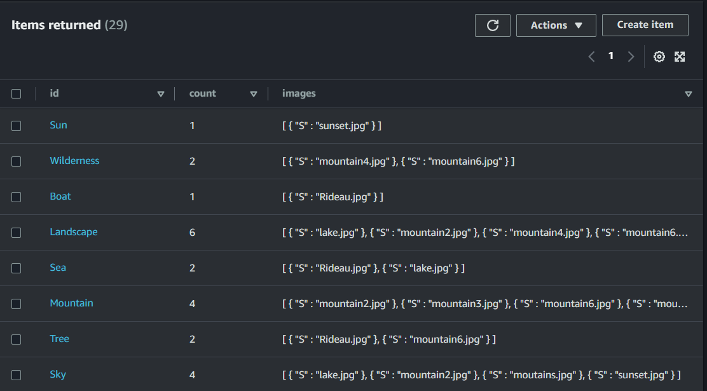
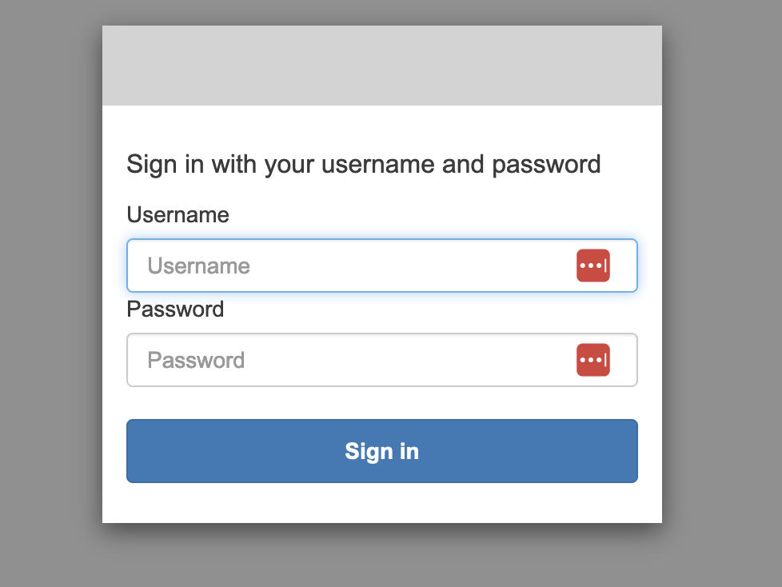
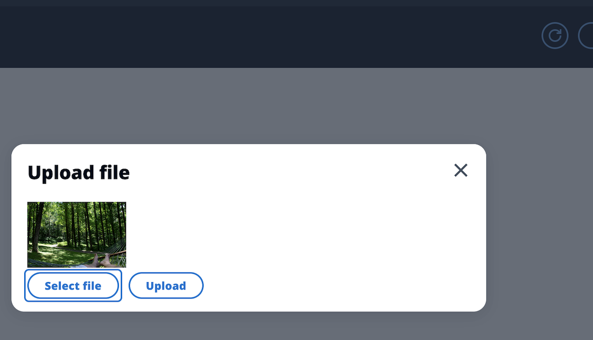
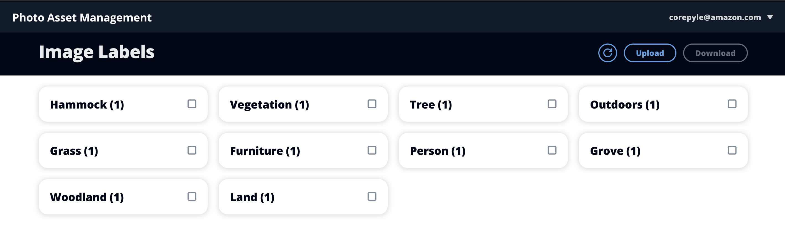

| ToC |
| --- |

# Implementations

Want to jump straight into the code? The following implementations are available:

- [.NET](https://github.com/awsdocs/aws-doc-sdk-examples/tree/main/dotnetv3/cross-service/PhotoAssetManager)
- [C++](https://github.com/awsdocs/aws-doc-sdk-examples/tree/main/cpp/example_code/cross-service/photo_asset_manager)
- [Java (V2)](https://github.com/awsdocs/aws-doc-sdk-examples/tree/main/javav2/usecases/pam_source_files)
- [JavaScript (V3)](https://github.com/awsdocs/aws-doc-sdk-examples/tree/main/javascriptv3/example_code/cross-services/photo-asset-manager)
- [Kotlin](https://github.com/awsdocs/aws-doc-sdk-examples/tree/main/kotlin/usecases/creating_pam)
- [Rust](https://github.com/awsdocs/aws-doc-sdk-examples/pull/4682)

## 1. Prologue

Hello, and let us introduce ourselves! We’re the AWS SDK Code Examples team. We’re a group inside AWS that focuses on giving you a broad range of working code to learn AWS SDKs. There are a lot of people inside and outside of AWS who are active in this area. Our main focus is the [aws-doc-sdk-examples](https://github.com/awsdocs/aws-doc-sdk-examples) repo on Github, which has samples for multiple programming languages that demonstrate how to use AWS SDKs. These examples are runnable directly, and snippets from these examples show up throughout [docs.aws.amazon.com](https://docs.aws.amazon.com/) and [AWS Developer Center](https://aws.amazon.com/developer/code-examples/?sc_channel=el&sc_campaign=appswave&sc_geo=mult&sc_country=mult&sc_outcome=acq&sc_content=cloudjourneysone&code-examples-all.sort-by=item.additionalFields.category&code-examples-all.sort-order=desc&awsf.sdk-code-examples-programming-language=*all&awsf.sdk-code-examples-type=*all&awsf.sdk-code-samples-tech-category=*all&awsf.sdk-code-examples-product=*all).

Within the team is a sub-group that creates more complex examples than single snippets of code. They reach across multiple services to build more fully-featured applications. On the other hand, they’re simpler than battle-tested enterprise level applications. We hope you read them and learn from them, but we don’t expect you to drastically modify or extend them.

We’re a small team consisting of several software development engineers. We start with a high level idea for how we might solve a customer problem with an application. This might be directed at consumers (Photo Asset Management), businesses (Work Item Tracker), or others within the range of AWS customers. It takes about a month to design, implement, and write the technical specification for the app. When we’re done, we hand it off to the wider Code Examples team to build out in each of the supported AWS languages.

This not a tutorial. Think of it as a case study. We’re going to walk you through our process and some of the decisions we made along the way. It’s messy, we learned a lot, and we needed to do a lot of research. Our initial plan survived mostly intact by the end, but we had to make plenty of little decisions that we’ll show you. There are links at the end pointing to instructions on how to deploy the final result.

## 2. Using ML

We started this project wanting to demonstrate how Rekognition image labeling and S3 Glacier storage can be included in an architecture. We needed a customer problem to solve, so we brainstormed “Dan” as a user persona. Having this Dan persona let us ask critical questions throughout the project, from confirming that the application would be useful, to making specific styling choices based on how he would interact with them.

> Dan is a casual photographer (shooting in jpeg) who focuses on nature photography. He also takes some ad-hoc photos of his friends and family. He wants a website where he can upload all of his photos, store them indefinitely, and download bundles of images that match nature-related tags (such as “forest”, “lake”, and “mountain”). Dan is the end user of this application.

With Dan in mind, we generated some user stories:

1. Dan needs to upload a large number of 1024x768 .jpeg photos.
2. Dan needs to see tags that were detected by the analyzer and a count of how many images meet that criteria.
3. Dan needs to download a bundle of files by tag (“nature”, “lake”, “mountain”). We then approached designing the rest of the project from the inside out, starting with detecting tags by the analyzer.

Amazon Rekognition automates image recognition for applications without needing machine learning (ML) experience. Rekognition accepts images as input and outputs labels (we called them tags in the user journey). The labels indicate the common features most associated with the image. For Dan, this is perfect - he wants to use the app to make big decisions for him, but still wants to be able to focus on the little details himself.

After Rekognition detects the labels, they need to be stored somewhere. But having the labels alone isn’t enough - they need to map from the label back to a list of matching images. After a quick sketch of Dan’s UI (see 5. Making it Interactive), we knew we would also need to keep count of how many images matched each label. With only a single category of data, and no relational integrity constraints, a full SQL database like Postgres felt like overkill. We opted for DynamoDB for this data. The use of the detected labels as keys was a natural fit for DynamoDB’s key model. And with no need for sort or search, there was no need to design a sort key.

The final database decision was what columns to track. Because we’d need to retrieve the individual images, we needed to track the set of images for the label. We knew we needed the count of images for each label. We didn’t know if we needed to track the count separately, because this information could be derived from the size of the set. The question then was whether we would be accessing this information more often (preferring a dedicated column) or updating more often (preferring keeping the data implicit). Reviewing the sketch of the UI, as well as the user stores (3. Dealing with Storage), our understanding of Dan meant that the access was more frequent than updates. We ended up with this table during our prototyping.



## 3. Dealing with storage

With the analyzer and data model in place, we started looking at how to store the images. We had two explicit requirements from the user stories (upload .jpegs and download bundles). We considered file storage and block storage, but both implied the use of long-running virtual server instances. That didn’t fit our understanding of Dan. Dan will work in bursts, separated by long stretches of time. Keeping a server instance running while we wait for him to use the service again would be very expensive.

While that alone had us leaning towards object storage, Rekognition itself can also work directly against S3 objects. Because that meant we wouldn’t need to handle any image data ourselves, it made us very confident in our choice to only use S3 for our storage.

But we wanted to push further.

Because Dan was going to use this app irregularly, and only download a subset of images at any given time, how low could we get his storage costs? S3 offers a number of storage tiers. Generally speaking, accepting a higher latency for object retrieval means cheaper long-term storage. This led us to S3’s longer term storage tiers. They come with a number of trade-offs for engineers.

Objects can be individually moved between storage tiers. This is done with policies (to move things to longer term storage) and batch jobs (to move things to faster access storage). Our initial plan was to use a lifecycle policy to move images to the longer term storage tiers after image labeling took place. Then, when Dan asked to retrieve data, we would start a batch job to restore those images to a temporary location (probably another S3 bucket) that would be emptied after we were done handling the download (see [4. Retrieving images](#4-retrieving-images)).

We started working on this implementation, but we discovered that S3’s batch restore jobs are marked as completed when the restore starts, and not when it actually completes. We would have to track the image restoration ourselves. This would necessitate a second job tracking system in our program. A good feature for a larger app, but not one we wanted at this point.

However, we found an S3 feature called intelligent tiering that automatically moves objects between the most appropriate tier based on its access patterns. This meets Dan’s workflow perfectly! As long as he uses the app irregularly, most of his images will remain in low-cost, long-term storage. When he accesses a bundle, the images in that bundle will be pulled to current storage for a month, then (as long as they aren’t touched) they’ll be moved to archive for lower costs.

Now, images are uploaded to a storage bucket. All objects in this bucket are configured with intelligent tiering. When objects are uploaded, an event triggers a run of our serverless code that sends the image to be analyzed, and the tags are recorded in a database. Later, when Dan downloads images, they are pulled from storage and placed in a temporary location. After 24 hours, the images in the temporary location are deleted.

## 4. Retrieving images

Dan wants to be able to download a set of images matching a subset of labels. And the easiest way to download a bunch of files is still a single zip.

Copying images from storage into a zip takes time. Indeed, booting up our serverless code and creating the zip often took longer than 30 seconds, which is more than the max timeout our API would allow. Instead, we had to make the API trigger an event and return 200. A more robust system would provide a way for Dan to track the progress of the restore, but that’s more than Dan needs today.

Our next challenge came in the form of optimization. We used AWS Lambda to run our serverless code, and the payment model calculated as a combination of CPU time and peak memory usage. Downloading all of Dan’s images in parallel could result in memory peaks at the gigabyte scale. Not cheap. And writing to the zip would still happen in serial! Instead, we opted to handle all the images in serial. As we download them one by one from storage, we zip them into an archive and write them to the working bucket using S3’s multi-part object utilities.

When the download completed, we needed a way to tell Dan that it was ready. We could go knock on Dan’s door and let him know in person, but sending an email or text seemed more reasonable. We also considered in-app notifications, but Dan shouldn’t be forced to log into the app just to know if his images are ready. For text and email we could send the notification directly, or use a queuing service. The queuing service seemed like overkill - there’s only a single message to a single user at the end of the restore. We ended up going with SNS. It supports both text and email and covered our use case.

To notify Dan we needed his contact information. Initially we wanted Dan to provide this information as input to the client. Both user input and identifiable information triggered a security conversation. We realized we'd need to be securing these routes regardless of how we collected Dan's info.

To secure our routes, Dan will have to log in. If he has to log in, we have his email or phone number at hand. Now, rather than taking an email or phone number when Dan makes a request to download a label, we instead create a notification channel to Dan for any message we might want to send. This notification channel is opaque and internal to AWS, and only our serverless code has permission to publish to it. This is perfect for notifying Dan when his downloads are ready without the risk of exposing his private information.

## 5. Making it interactive

All of this infrastructure is great, but it’s still inaccessible to Dan. He needs some kind of user interface. We knew Dan was going to need to do three things: upload photos, view labels, and download photos. Some kind of user interface was needed. Before deciding on the technical architecture, we made the following napkin (text file) sketch.

```text
(Upload images) (Import Bucket)
Tags
[ ] Mountain (32)
[ ] Lake (27)
[ ] Clouds (18)
[Phone Number|Email] (Download)

Select tags → Click (Download) → Start User Story 3
Upload Images → <input type=“file” multiple /> to select images & Upload over form
Import Bucket → [Bucket Name] (Copy) → Import jpegs from that button (User story 1)
```

Not much to it. There are a few interesting pieces, though. Some features here didn’t make it in the final cut.

### Dropping the import feature

We needed some images to analyze. We wanted to offer users the ability to bulk import a large set of images. We considered the following:

- Hosting the images publicly
- Hosting the images privately
- Allowing users to provide their own source of images

With S3 as our storage mechanism, we considered creating buckets for this purpose. We were already using infrastructure-as-code to create our resources. We could have used it to create a private bucket and populate it with images. That would require hosting a large number of images in our (already large) GitHub repo. Having the extra bucket would also bloat the architecture with a feature that would be unlikely to show up in a production environment. A public bucket could be used, but then the example has external dependencies. We didn’t want to do that. The bucket was out.

In the final state, the ability to upload a single image at a time seemed sufficient.

### Dropping the phone and email fields

As discussed before, our image retrieval architecture is asynchronous. Dan is notified when his images are ready for download. The original design included fields for email and phone number. The idea was to let Dan provide these values and we would send notifications to either one. Because we’re using Cognito (more on this in the following section) we already have access to the user’s email, so it made sense to cut this feature.

### The frontend that Dan got

We wanted the client to feel familiar to as many developers as possible, and since React is [very popular](https://2022.stateofjs.com/en-US/libraries/front-end-frameworks/) and covered all of our needs, it seemed appropriate. We’re not designers, so we needed something to quickly make the client attractive and usable. [Cloudscape](https://cloudscape.design/) is an open source design system created by AWS, and was a good fit that we were already familiar with.

For hosting, we didn’t want to break Dan’s bank. We could have hosted a server, but that gets expensive. Static website hosting with S3 is less expensive. That alone was compelling. It also requires very little configuration compared to creating and deploying a web server. The problem with S3 hosting is that a bucket must be public if you want to expose a website. That’s not very secure. In order to secure the site we ended up hiding the bucket behind a CDN. We used CloudFront for this. For more information on that process, see [Getting started with a secure static website - Amazon CloudFront](https://docs.aws.amazon.com/AmazonCloudFront/latest/DeveloperGuide/getting-started-secure-static-website-cloudformation-template.html?sc_channel=el&sc_campaign=appswave&sc_geo=mult&sc_country=mult&sc_outcome=acq&sc_content=cloudjourneysone).

Securing the site required some kind of authorization. Ideally we wanted to handle as little of that as possible and offload the effort to a service that does it better than we could. Registration wasn’t necessary (we handled that in the infrastructure). We just needed a way for Dan to log in. We ended up going with [Cognito hosted UI](https://docs.aws.amazon.com/cognito/latest/developerguide/cognito-user-pools-app-integration.html?sc_channel=el&sc_campaign=appswave&sc_geo=mult&sc_country=mult&sc_outcome=acq&sc_content=cloudjourneysone). It was pretty simple to set up. During resource deployment we grab the URL provided by Cognito and pass it to the client when it’s deployed. The client calls the URL and handles the tokens when they come back as part of a redirect.

## 6. Epilogue

We hope you’ve enjoyed this journey with us. As a team of experienced AWS engineers, we thought we had a pretty good handle on using AWS. We learned so much. Each of us had done one or two things in this example already, but there were still specifics none of us had found necessary in our prior projects (Cognito Hosted UIs, streaming to Lambdas through a zip, and S3 storage classes, for example).

Each of these were important for a reason, based on Dan’s use case. More than anything, this exercise reinforced for us the importance of domain-driven design in building an application. Programs are built for people, and knowing how people will use them anchored our decisions and research in this cross-service example.

The code for this example is available in a few places. The main entry point is our [CDK](https://github.com/awsdocs/aws-doc-sdk-examples/tree/main/applications/photo-asset-manager/cdk/README.md). This has all the AWS managed pieces together in one place for review. There are implementations for the Lambda functions in each of the language directories (see [Implementations](#implementations)). And there is one implementation of the [React UI](https://github.com/awsdocs/aws-doc-sdk-examples/tree/main/resources/clients/react/elros-pam).

### End result







## Shared application resources

- [Front End](https://github.com/awsdocs/aws-doc-sdk-examples/tree/main/resources/clients/react/elros-pam)
- [CDK](https://github.com/awsdocs/aws-doc-sdk-examples/tree/main/applications/photo-asset-manager/cdk/README.md)
