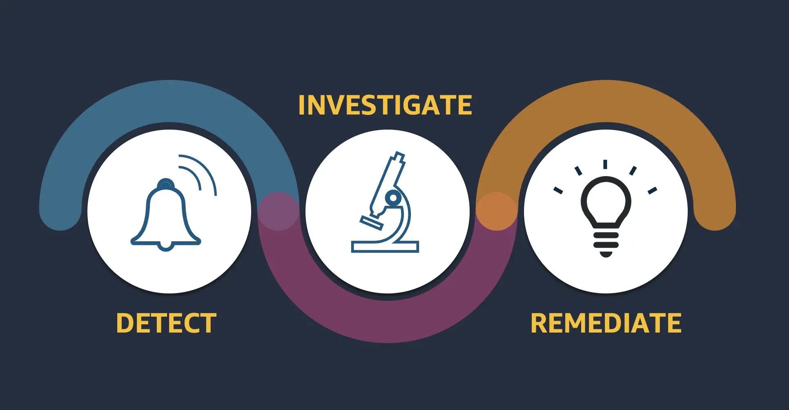
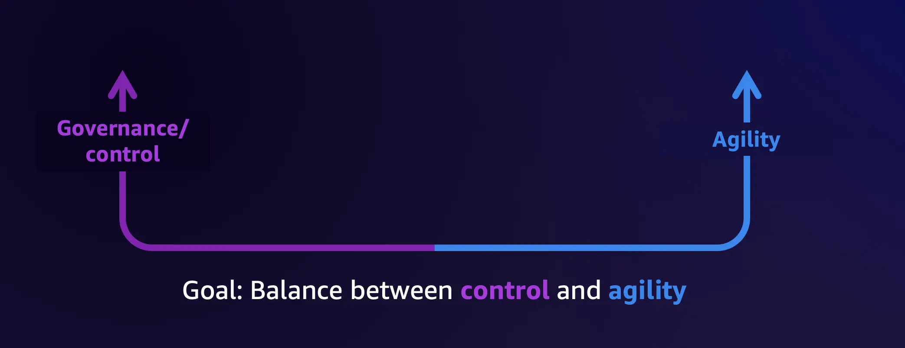
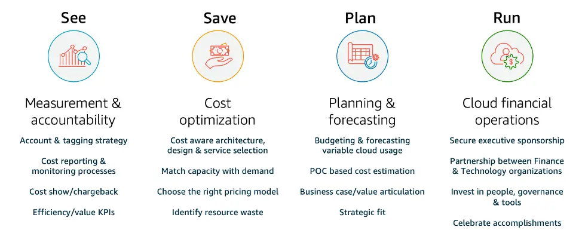

|ToC|
|---|

*Before I start, if you are looking for suggestions related to Resilience sessions at re:Invent, check out Seth's post [HERE](https://community.aws/posts/resilience-at-reinvent)*

https://youtu.be/CykKw2fVbWc

We've all been in, or have had a close relationship with IT Operations. They are the heart of every organization. 💟 Now, when you start operating in the cloud this is the time when you get your IT teams to focus not *just* on operations, but also business outcomes, IT process optimization, and software development acceleration! All things a company in the cloud needs.

Ultimately the goal is to be agile, move fast, but at the same time keep track of compliance, security, spend and more! For all that, the portfolio of AWS Cloud Operations solutions is the thing for you. So, if you are planning to attend AWS re:Invent 2023, and would love to learn more about Cloud Operations but are not sure what sessions and activities you should participate in - look no further. In this post I will share a quick preview of some of the top sessions around **observability**, **centralized operations**, **governance**, **compliance**, and **cloud financial management**. Let's jump right into it

## Innovation Talk 🔊

First let's kick it off with Innovation Talks, these are a series of deep dives hosted by AWS Thought Leaders, that give you a glimpse into technological advances that can help drive your business forward. I need to share my favorite one of the whole lot.

1. [COP227-INT](https://hub.reinvent.awsevents.com/attendee-portal/catalog/?search=COP227-INT&sc_channel=el&sc_campaign=reinvent&sc_geo=mult&sc_country=mult&sc_outcome=acq&sc_content=cloudops-at-reinvent23) - **Cloud Operations for today, tomorrow, and beyond** | Presented by [Nandini Ramani](https://www.linkedin.com/in/nandiniramani/), this innovation talk will be covering the latest and greatest AWS capabilities in the field of governance, compliance, resiliency and performance that can be useful in improving your applications in the cloud, on premises, in hybrid and edge environments (and beyond!)

## Observability 👀

They say: "You miss the forest for the trees", meaning that we tend to misunderstand the larger picture/problem because of focusing on a small part of it. The same is true in IT. Having better visibility of what is going on in your workloads gives you insights on how to improve the performance of your applications and infrastructure. This is what we like to call **Observability**. It's more than just looking at graphs and logs, it's about understanding the measurable outputs of your application and gaining insights from them so you could further optimize. This is often a misunderstood topic, so here are a few sessions you need to see:

2. [COP343](https://hub.reinvent.awsevents.com/attendee-portal/catalog/?search=COP343&sc_channel=el&sc_campaign=reinvent&sc_geo=mult&sc_country=mult&sc_outcome=acq&sc_content=cloudops-at-reinvent23) - **Building observability to increase resiliency** | Resilience is an important topic (so important, my colleague Seth wrote a whole list like this, which you *need* to check out [here](https://community.aws/posts/resilience-at-reinvent)), and we should all be acquainted with [what it is](https://community.aws/concepts/should-know-resilience). And in this session [David](https://www.linkedin.com/in/david-yanacek/) is talking about how you can use *well-applied observability* to find early signs of problems before they become customer impacting. He will be demonstrating these specific techniques with services like [Amazon CloudWatch](https://aws.amazon.com/cloudwatch/&sc_campaign=reinvent&sc_geo=mult&sc_country=mult&sc_outcome=acq&sc_content=cloudops-at-reinvent23) and [AWS X-Ray](https://aws.amazon.com/xray/&sc_campaign=reinvent&sc_geo=mult&sc_country=mult&sc_outcome=acq&sc_content=cloudops-at-reinvent23). On top of that he will be diving deep into real-world failure modes and how to solve them quickly! 👏

3. [COP324](https://hub.reinvent.awsevents.com/attendee-portal/catalog/?search=COP324&sc_channel=el&sc_campaign=reinvent&sc_geo=mult&sc_country=mult&sc_outcome=acq&sc_content=cloudops-at-reinvent23) - **Centralize hybrid and multicloud management with AWS** | Sometimes, managing a single environment can be hard enough. Now imagine doing that over multiple ones - better yet, do it across a hybrid and/or multi cloud setup 😱 Configuring, monitoring, and running things from different control planes is downright awful, so we all strive to centralize as much of that as we can - single pane of glass as they say. Well, in this session presented by [Rich](https://www.linkedin.com/in/rich-mcdonough/) and [Ellie](https://www.linkedin.com/in/ellietamari/), you get to learn just that. How to manage (centralize) all these different kinds of environments from a single place. Remember folks, the key word here is - simplify!

4. [COP325](https://hub.reinvent.awsevents.com/attendee-portal/catalog/?search=COP325&sc_channel=el&sc_campaign=reinvent&sc_geo=mult&sc_country=mult&sc_outcome=acq&sc_content=cloudops-at-reinvent23) - **Building an effective observability strategy** | I've thrown around the word "observability" a few times here. I've said that it's an important part of your cloud operations strategy. But why is that so? 🤔 What are all the things that you should observe? How do you observe and what you observe? All these questions (and more) are being answered in this session run by [Ania](https://www.linkedin.com/in/ania-develter/), [Helen](https://www.linkedin.com/in/helenashton/), and [Toshal](https://www.linkedin.com/in/toshal/). Make sure to join them and get all of your observability questions answered, and see them demonstrate all these practices and techniques.

## Governance and Compliance 🔐

Governance and Compliance sound very scary. 😱 But these two are very important parts of  well functioning cloud operations. Namely you *need* to be able to setup good foundations, with guardrails and rules so the builders who build on top of your environments are able to do so in a scalable, secure and cost efficient way. And no matter the size of you organization, you are after all operating in the real world with real (and complex) compliance landscapes. By setting up certain compliance guardrails, you let your builders with peace in mind. As you are able to rapidly detect, flag, and take action on any issues that may occur. Now, that I've got your attention, lets talk about **3** sessions that can help you with this pesky Governance and Compliance:

5. [COP338](https://hub.reinvent.awsevents.com/attendee-portal/catalog/?search=COP338&sc_channel=el&sc_campaign=reinvent&sc_geo=mult&sc_country=mult&sc_outcome=acq&sc_content=cloudops-at-reinvent23) - **Using Generative AI to improve your compliance and auditing process** | I *knew* it was only a matter of time until I would mention *Generative AI* 😅 Well, here we are, talking about it! 🥳 So, I said a second ago how Compliance can be quite pesky, and that building guardrails is the way to go. Well, to build those guardrails you need to write some compliance rules! Yes [AWS Config](https://aws.amazon.com/config/&sc_channel=el&sc_campaign=reinvent&sc_geo=mult&sc_country=mult&sc_outcome=acq&sc_content=cloudops-at-reinvent23) and [AWS CloudTrail](https://aws.amazon.com/cloudtrail/&sc_channel=el&sc_campaign=reinvent&sc_geo=mult&sc_country=mult&sc_outcome=acq&sc_content=cloudops-at-reinvent23) are the services to make that happen, but you have to write a bunch of compliance rules. Which, while it is fun,  can be tedious! Enter - [Amazon CodeWhisperer](https://aws.amazon.com/codewhisperer/&sc_channel=el&sc_campaign=reinvent&sc_geo=mult&sc_country=mult&sc_outcome=acq&sc_content=cloudops-at-reinvent23), a Generative AI coding assistant that can help you write those compliance rules. In this session [Isaiah](https://www.linkedin.com/in/isaiah-salinas-9853627/) and [Snehal](https://www.linkedin.com/in/snehal-nahar-170b967/) are showcasing just that, faster compliance rule writing with Amazon CodeWhisperer 🚀

6. [COP318](https://hub.reinvent.awsevents.com/attendee-portal/catalog/?search=COP318&sc_channel=el&sc_campaign=reinvent&sc_geo=mult&sc_country=mult&sc_outcome=acq&sc_content=cloudops-at-reinvent23) - **Best practices for cloud governance** | Time, again, for a *best practices* session. In this case, you have [Svetlana](https://www.linkedin.com/in/svetlana-kolomeyskaya-24a4092/), [Krista](https://www.linkedin.com/in/krista-gorman-83178844/), and [Troy](https://www.linkedin.com/in/troy-jordan/) talking to you about how to build well-architected and scalable foundation on AWS, with the best practices in cloud governance in mind. It's always great to hear what we have learned from, and how our customers successfully adopt the cloud! 

7. [COP207](https://hub.reinvent.awsevents.com/attendee-portal/catalog/?search=COP207&sc_channel=el&sc_campaign=reinvent&sc_geo=mult&sc_country=mult&sc_outcome=acq&sc_content=cloudops-at-reinvent23) - **Don't let cloud compliance and operations exceed your budget** | Okay, cost optimization time! 👏 With all the tools to successfully run cloud operations available, you need to be aware of the costs that follow. [Cost Optimization](https://community.aws/cost-optimization) is on everyone's mind these days, so it is very important to understand how to use the cloud efficiently. In this session [Nereida](https://www.linkedin.com/in/nereida-woo/) and [Craig](https://www.linkedin.com/in/craigedwardsma/) are here to help us optimize the usage of AWS Config and AWS CloudTrail (these two services love to go together it seems 😅). They will take us through a few scenarios (customer ones in fact) that resulted in, less than optimal, spend. And how, with a few best practices, you could avoid such scenarios! 💰

## Cloud Financial Management 💰

Continuing from session number 7, right into Cloud Financial Management! When moving to The Cloud it is quite important to understand how you will approach financial management, as it differs from the traditional approach. Predicting, controlling and understanding your costs is critical to a successful Cloud IT operations organization. As with Observability, you are giving yourself insights on what opportunities exists to optimize spend. Alright, let's look at a few sessions that will be very useful for all of you who are cost aware (I know I am 🤑):

8. [COP333](https://hub.reinvent.awsevents.com/attendee-portal/catalog/?search=COP333&sc_channel=el&sc_campaign=reinvent&sc_geo=mult&sc_country=mult&sc_outcome=acq&sc_content=cloudops-at-reinvent23) - **Optimize costs in your multi-account environments** | When I talked about COP324 that managing things in multiple accounts can be tricky. That remains true when it comes to cost optimization. Lucky for us we have [Andrew](https://www.linkedin.com/in/andrew-blackham/) and [Nivas](https://www.linkedin.com/in/nivasd/) to talk to us about some of the best practices when it comes to cost optimization in a multi-account setup. They will talk about one of my favorite services - [AWS Control Tower](https://aws.amazon.com/controltower/&sc_channel=el&sc_campaign=reinvent&sc_geo=mult&sc_country=mult&sc_outcome=acq&sc_content=cloudops-at-reinvent23) and show you how you can do things such as: Implement proper tagging to understand what costs how much and where is it running; How to use AWS Compute Optimizer, to see first hand where you are over provisioning those compute resources! 🔥

9. [COP225](https://hub.reinvent.awsevents.com/attendee-portal/catalog/?search=COP225&sc_channel=el&sc_campaign=reinvent&sc_geo=mult&sc_country=mult&sc_outcome=acq&sc_content=cloudops-at-reinvent23) - **Mastering cost allocation strategies of your AWS workloads** | Time to get some hands on work done! Yes, we have our first **workshop** on the list! 🥳 And it's time to build some dashboards! In this workshop, you will get hands on experience in tools and techniques that help you build a cost allocation strategy. What you can expect from [Nataliya](https://www.linkedin.com/in/nataliya-godunok/) and RK is: Tagging best practices, Understanding [Amazon ECS](https://aws.amazon.com/ecs/&sc_channel=el&sc_campaign=reinvent&sc_geo=mult&sc_country=mult&sc_outcome=acq&sc_content=cloudops-at-reinvent23) costs, and how to visualize data with [Amazon QuickSight](https://aws.amazon.com/quicksight/&sc_channel=el&sc_campaign=reinvent&sc_geo=mult&sc_country=mult&sc_outcome=acq&sc_content=cloudops-at-reinvent23). 📊 Do not skip on this workshop! 👏

10. [COP205](https://hub.reinvent.awsevents.com/attendee-portal/catalog/?search=COP205&sc_channel=el&sc_campaign=reinvent&sc_geo=mult&sc_country=mult&sc_outcome=acq&sc_content=cloudops-at-reinvent23) - **Forecasting: Effective strategies for AWS Cost planning** | Okay, I am very biased for this session, as it is being delivered by the most amazing [Steph](https://www.linkedin.com/in/awssteph/), and I am such a huge fan of hers! 🤩 But beyond that, what she and [Arthur](https://www.linkedin.com/in/arthurbasbaum/) will be covering in this session is important - forecasting 🌦️. Not the *weather* kind, but the *financial* kind. When talking to customers about the cloud, one of the most common questions I seem to get is *"But Darko, if the cloud is pay as you go - how can I know how much will I spend?"*, well my dear reader this session is exactly about that. Here you will learn about defining a realistic cost plan for your new and existing workloads by considering usage growth, business seasonalities, and migration & modernization! Huzzah!

## What's new 🚀

Finally, the reason we all go to re:Invent - hearing about cool new stuff that will make our jobs just a little bit easier. Hence, here are three sessions about the latest and greatest features in Cloud Operations you *need* to attend:

11. [COP339](https://hub.reinvent.awsevents.com/attendee-portal/catalog/?search=COP339&sc_channel=el&sc_campaign=reinvent&sc_geo=mult&sc_country=mult&sc_outcome=acq&sc_content=cloudops-at-reinvent23) - **What's new with AWS Observability & Operations**

12. [COP340](https://hub.reinvent.awsevents.com/attendee-portal/catalog/?search=COP340&sc_channel=el&sc_campaign=reinvent&sc_geo=mult&sc_country=mult&sc_outcome=acq&sc_content=cloudops-at-reinvent23) - **What's new with AWS Governance and Compliance**

13. [COP204](https://hub.reinvent.awsevents.com/attendee-portal/catalog/?search=COP204&sc_channel=el&sc_campaign=reinvent&sc_geo=mult&sc_country=mult&sc_outcome=acq&sc_content=cloudops-at-reinvent23) - **What's new with AWS Cost Optimization**

## Bonus round 🪙

Not everything at re:Invent is a talk or a workshop. In addition to attending sessions, come visit any of our four kiosks in the AWS Village at the Expo in the Venetian: **Cloud Operations, Observability, Cloud Financial Management, and Management Console**. Come get some swag, Meet our experts, do a fun VR experience, or learn about the future of Cloud Operations. 🙌 I will be spending some time at the booth as well, so please do not be shy and come say hi 👋

## In conclusion

Here were some of my picks for the Cloud Operations sessions/workshops at this year's re:Invent. Being that Cloud Operations is a key part of any organizations cloud adventure, learning from the best, getting some hands on experience and hearing about best practices should be a good spend of anyone's time. I hope to see you at a few of these sessions, and please, do share your suggestions with me, via [LinkedIn](https://www.linkedin.com/in/darko-mesaros/).

See you all at re:Invent ❤️
