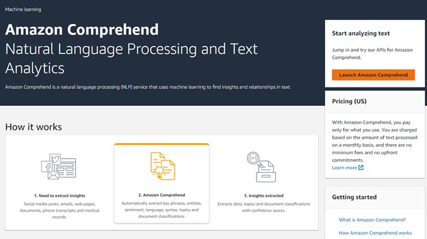
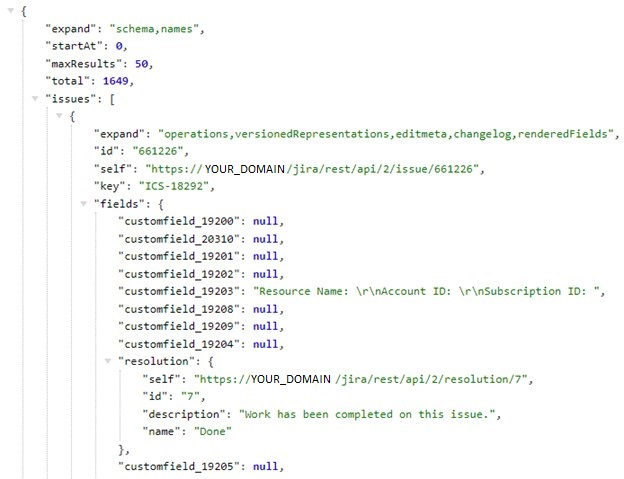
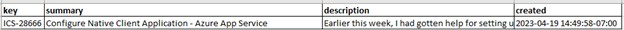
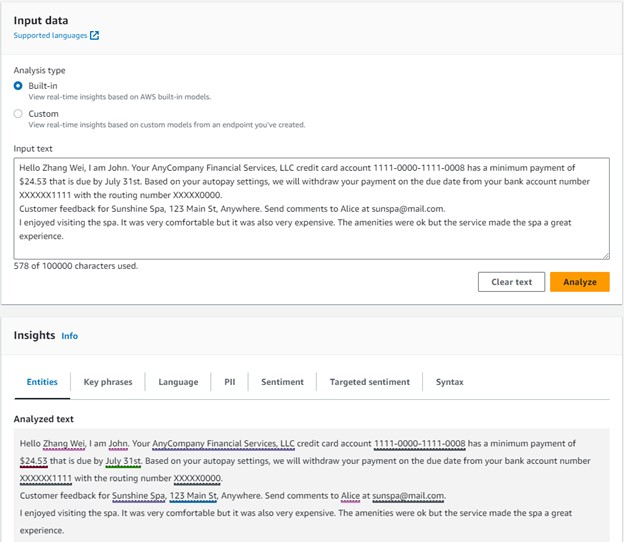
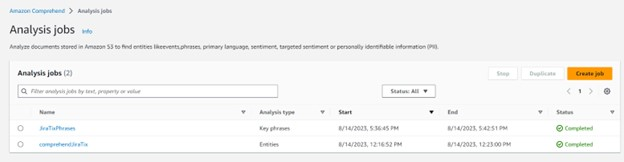
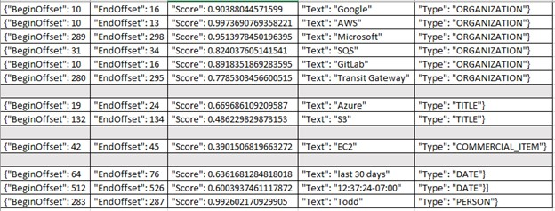

|ToC|
|---|

Do you want to quickly gain insights from thousands of Jira Tickets?  What if you could identify popular topics across tickets to provide better FAQs and self-service documentation? 
This post shares an overview of getting started with AWS Comprehend using multiple technologies including the Jira API, data cleaning, S3, and AWS Athena to test the robustness of entity and key phrase recognition within AWS Comprehend.  Spoiler alert, this effort was not quick; it highlights the challenges of entity recognition when you leverage AWS Comprehend out of the box and don't train your own model.  Using the Jira API is painless, data cleaning is not for the faint of heart.  Natural Language Processing (NLP) is a much harder problem than people let on.  In short, as of this writing, I did not get the result I was looking for from AWS Comprehend.  There was no "easy button" to quickly identify insights from Jira tickets.  I will continue to investigate and in the meantime, I hope this helicopter view of AWS Comprehend helps you get started with your own projects.  

## What is AWS Comprehend?


AWS Comprehend is a text analysis service based on a natural language processing (NLP) algorithm.  It uses pre-trained deep-learning algorithms to parse through text and then provides an analysis of that text based on your interest in entities (keywords), key phrases, sentiment, personally identifiable information (PII), language identification, and syntax.  For more details check out [AWS Comprehend](https://docs.aws.amazon.com/comprehend/index.html?sc_channel=el&sc_campaign=post&sc_geo=mult&sc_country=mult&sc_outcome=acq&sc_content=comprehend-jira-tickets)

To get started with AWS Comprehend, you need data.  My project focused on insights from Jira ticket fields which meant learning about the Jira API.  Luckily for me, Jira has an API that permits in-depth queries of ticket data.  The API is well documented and many people query Jira data.  For more information on how best to interact with the Jira API, check it out [here](https://developer.atlassian.com/server/jira/platform/rest-apis/).

## Working with the Jira API
To get started with a Jira API query, you need your favorite web browser, and you need to understand your organization's namespace for how Jira is installed.  For example, http://hostname/rest/api/2/issue/MKY-1 this pulls issue: MKY-1.  For this project, I did not require authentication mechanisms.  Work with your Atlassian product owner for more information if you need that option.  This project leverages the Jira API 2 based on how licensing works at my organization.

I focused on pulling all issues from within a ticketing queue that lives inside a Jira project.  My query had to be structured properly to get into the correct project and queue:

```text
https://YOUR_HOSTNAME/jira/rest/api/2/search?jql=project=YOUR_PROJECTNAME AND component in(YOUR_SUBPROJECT,YOUR_SUBPROJECT, ...,)
```

The next portion of the query specifies the data you wish to pull.  When I first started, I pulled all the data.  After dropping the raw Jira data into the AWS Comprehend "Analyze" option I noted Comprehend does an excellent job of identifying every single keyword including many I didn't want.  Comprehend found all the HTML tags, Urls, and extra information I would not be analyzing.  I refined my query to target just the data I needed which meant requesting specific fields like **Key**, **Summary**, and **Description**.  There are many ways to structure your query to get the data you want.  You can pull tickets in a certain date range: `created=YOUR_DATERANGE` or all tickets up to a certain amount: `maxresults=YOUR_MAX`, and you can also query for specific fields.  Here is my final query:

```text
https://YOUR_HOSTNAME/jira/rest/api/2/search?jql=project=YOUR_PROJECT AND component in (YOUR_SUBPROJECT, YOUR_SUBPROJECT) AND created=2021-09-30 ORDER BY Created&maxResults=1650&fields=key, summary, description
```

Here is an example of the Jira API Json output




## Data Cleaning, Oh My!
The JSON data returned from the Jira API only contains data from fields you specify, be advised that if your installation of Jira permits email communication within the ticket, you will see HTML information that distracts from keywords you want to focus on.  Removing as much unnecessary text as possible makes all the difference when using AWS Comprehend.  Comprehend does a great job of identifying every single word, which can be overwhelming if you have extraneous data.  The cleanest data will provide a more clear understanding of the keywords you are evaluating to understand if Comprehend is right for you.  To do this, find a great data scientist!  One who is familiar with the pandas python library and the use of regular expressions.  My forever friend wrote a script that reads Json output from Jira and writes it into a pandas data frame, followed by 12 lines of code to handle unnecessary stylesheet tags, Urls, images, email signature lines, headings, formatted tables, and sequences of whitespace.  

Here's an example of how to get started cleaning your data using a pandas dataframe:

```python
df = pd.DataFrame.from_dict(contents['issues'])
df = (
    pd.concat([df, pd.json_normalize(df.fields)], axis=1)
    .drop(['expand', 'id', 'self', 'fields'], axis=1)
    .assign(created=lambda df: pd.to_datetime(df.created))
    .assign(description=lambda df: df.description.apply(lambda x: re.sub(r'\{.*?\}', '', x)))  # Remove all stylesheet tags
)
df.to_csv('cleaned_tickets.csv', index=False)
df
```

By requesting free-text fields in Jira, you never know what you're going to get and AWS Comprehend can be easily filled with unnecessary keywords that distract from the insights you wish to achieve.

Check out what clean data looks like:



## Using AWS Comprehend
There are two ways to access Comprehend using the AWS Console.  The first is testing a small amount of data using Real Time Analysis, and the second is creating an analysis job that runs on large amounts of data.  

**Real Time Analysis**



This is where you see how the entity recognition worked.

**Analysis Job**



The analysis job takes data stored in S3 and evaluates it based on a pre-trained model.  I evaluated two jobs, the entity recognition and key-phrase identification model.  I ran my data through both of these with interesting results.  After a job completes, in S3, you'll find an output folder with a tar.gz file.  I was able to use 7zip to unzip and then untar the data and open it in an excel spreadsheet to see the job output.

**Sample Output**



Based on the output above, I noticed the entity classification is not what I had hoped for.  My goal is to query this data and ask for total ticket counts across AWS, Google, and Azure.  Given the three names were categorized differently, I would need to know how each word had been categorized, which defeats the purpose of the ability to easily query.  This is exactly where a human can know that AWS, Google, Azure, and Microsoft mean the same thing in the context I want counts for.  Machines sadly, don't "know" this distinction.  As you can see, Google, AWS, and Microsoft appear as "organizations", as well as SQS, Gitlab, and Transit Gateway.  While Ec2 is the only AWS service identified as a "commercial item", Azure and S3 are listed as "Title".  You can see that AWS Comprehend is great at identifying dates, and names of people, and less sure about timestamps.  Overall, AWS Comprehend has done a solid job identifying entities or keywords and categorizing them.  I will argue the categorization needs refinement, which would require training my own model.  Stay tuned for a future post on that experience.  

## Costs

So far, no costs for AWS Comprehend or S3 were incurred in this proof of concept.  This is most likely because the account has been open for less than a year, and the free tier option is applicable.  

## Next Steps
Based on this overview, I plan to query the AWS Comprehend output to S3 using Athena to see if I can get the counts and insights I need to craft better FAQ documentation for cloud enthusiasts.  Additionally, I plan to investigate training my own model to be used with AWS Comprehend and compare those results with this pilot to check for improvement.  All in all, this has been a fascinating proof of concept to better understand how AWS Comprehend works using its out-of-the-box NLP model.  It has highlighted the difficulties involved in preparing data for ingestion to ensure helpful data insights.  More work in the Entity NLP research space is needed to better understand different words that could be synonymous with others based on context.

