There are situations where you need access to AWS resources that are not in Lightsail, such as files on an EC2 server or the need to connect to an AWS RDS such as PostgreSQL or MariaDB. It is possible to use these resources via VPC (Virtual Private Cloud) peering with a few caveats. This article shows how to configure VPC peering to connect to AWS resources not in Lightsail.

## VPC Peering

A VPC is a virtual network that connects AWS resources to each other. It isolates your infrastructure into a logical grouping to facilitate managing resources. Each AWS region typically has a default account in addition other user created VPCs. VPC peering establishes a network connection between two VPCs. Lightsail is in its own VPC and if you want to access resources outside of Lightsail you can use VPC peering to connect to the [default VPC](https://docs.aws.amazon.com/vpc/latest/userguide/default-vpc.html?sc_channel=el&sc_campaign=post&sc_content=connectinglightsailtoawsservices&sc_geo=mult&sc_country=mult&sc_outcome=acq&sc_publisher=amazon_media&sc_category=lightsail). Lightsail can only create VPC peering with the default VPC for an AWS region.

To establish VPC peering open the [Lightsail console](https://lightsail.aws.amazon.com/ls/webapp/home/instances?sc_channel=el&sc_campaign=post&sc_content=connectinglightsailtoawsservices&sc_geo=mult&sc_country=mult&sc_outcome=acq&sc_publisher=amazon_media&sc_category=lightsail). Choose **Account**.


Then choose **Account** from the drop down menu.

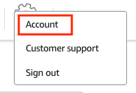

Next, choose the **Advanced** tab.

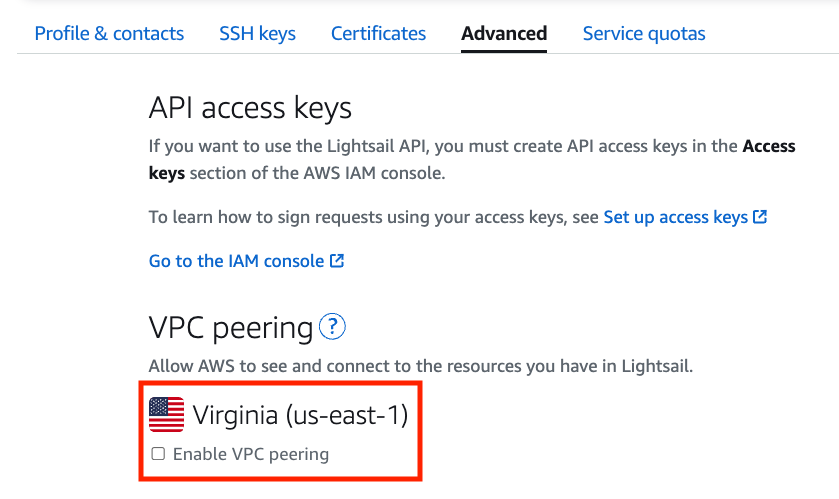

Choose the AWS regions where you want to **Enable VPC peering**.


You can confirm if VPC peering was successful by opening the VPC console.

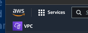

Choose **Peering connections** in the side menu.

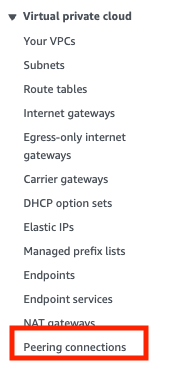

Verify peering connections by examining the Requester VPC and Accepter VPC which should be the default VPC for the chosen region.

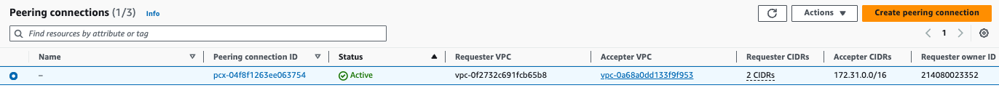

## Connecting to an RDS Database

A common scenario is to connect a Lightsail instance to a RDS. To do this, you’ll need the Lightsail instance’s private IP address.

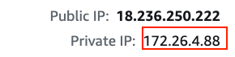

Next, open the RDS console. You can use the search bar in the AWS home console.

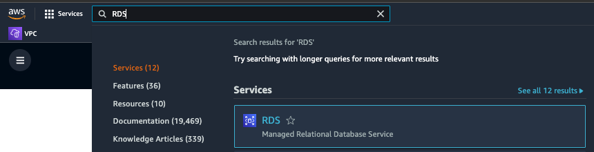

Choose **Databases**, then choose the database by selecting the DB Identifier.

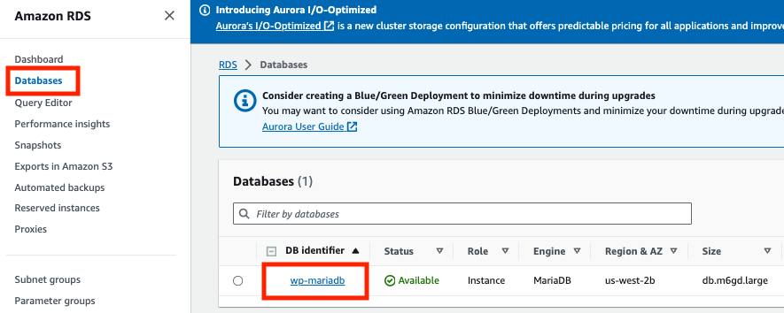

To connect to the database, we will need to modify the security group to allow connections from the Lightsail instance. Choose the link to the security group.

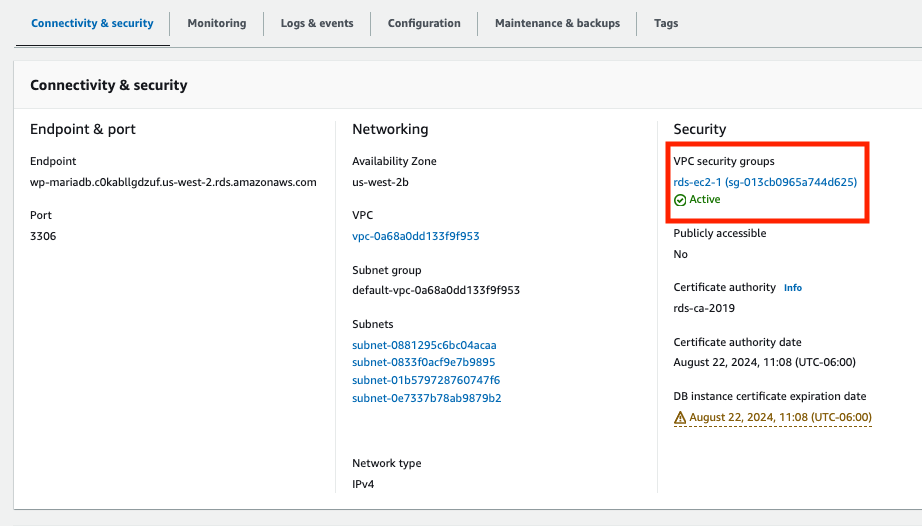

Choose the security group for the database, then choose **Edit inbound rules** under the **Actions** button.

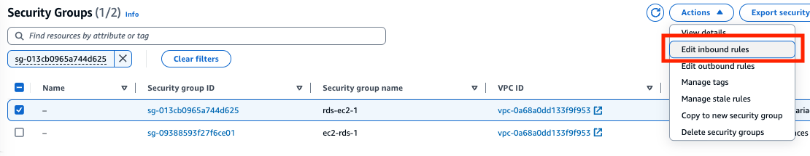

Choose **Add rule**, enter the port for MariaDB, the private IP address of the Lightsail instance, and a description. Choose **Save rule**.

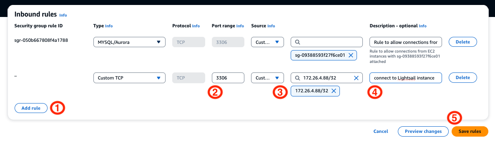

The new Inbound rule will be listed for the security group.

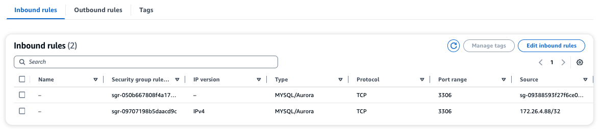

## Test the Connection

In this example, he Lightsail instance has the MariaDB client installed. We can use it to test VPC peering by connecting to the database and running SQL commands. Open a terminal on the Lightsail instance.

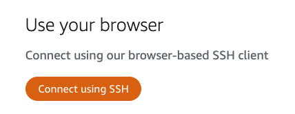

In the terminal, connect to the database.

```bash
$ mariadb -h wp-mariadb.c0kabllgdzuf.us-west-2.rds.amazonaws.com -P 3306 -u
```

List the databases on the RDS.

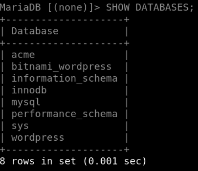

List the tables in the acme database.

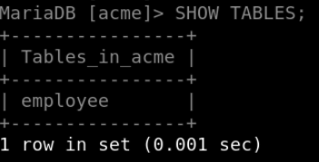

Query the acme database for employees.

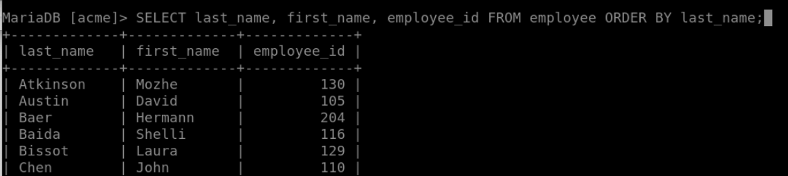

You can now connect any client or application to the database from your Lightsail instance.

## Summary

This article shows that you are not limited to the resources in AWS Lightsail. You can connect and use other AWS resources as long as they are in the default VPC for an AWS region. For example, checkout this [document that shows how to connect a to AWS Elastic File System (EFS)](https://aws.amazon.com/getting-started/hands-on/efs-and-lightsail/?sc_channel=el&sc_campaign=post&sc_content=connectinglightsailtoawsservices&sc_geo=mult&sc_country=mult&sc_outcome=acq&sc_publisher=amazon_media&sc_category=lightsail).


