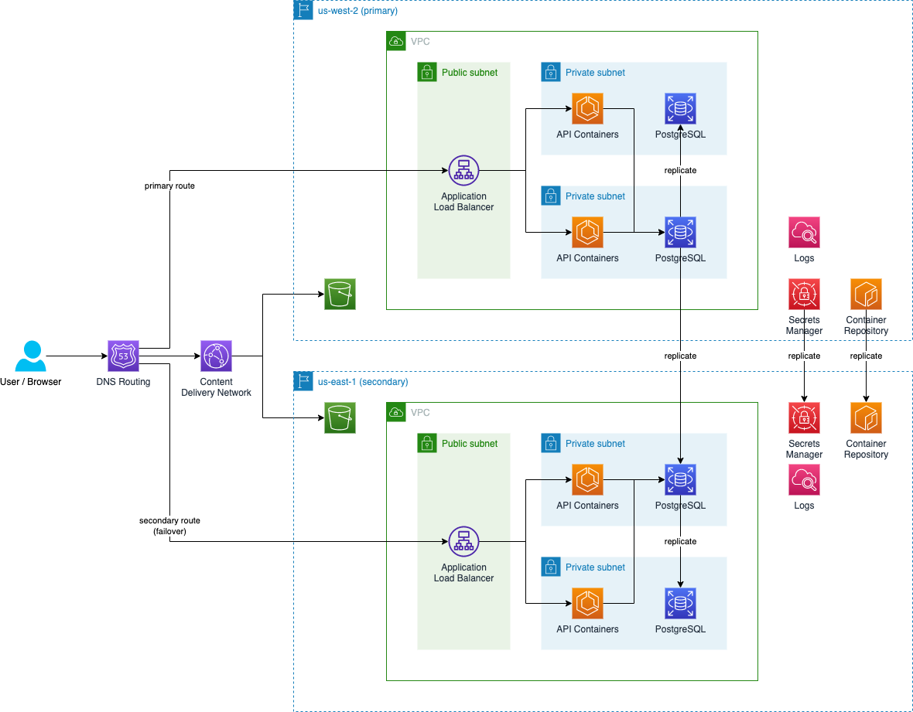
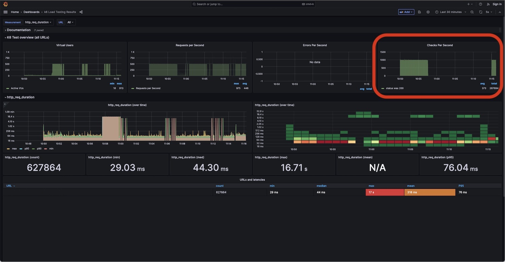

## Introduction

As engineers and architects, one of our goals is to create resilient systems that will withstand failures. However, it is crucial to acknowledge that system failures are not a matter of "if" but "when." In order to effectively plan for these system failures, organizations rely on disaster recovery (DR) plans to ensure business continuity is possible, and done in a methodical way. These plans outline the steps to restore system operations within predefined parameters, such as the [Recovery Time Objective (RTO) and Recovery Point Objective (RPO)](https://docs.aws.amazon.com/whitepapers/latest/disaster-recovery-of-on-premises-applications-to-aws/recovery-objectives.html). In this article, we will explore the concept of disaster recovery within the context of a common three-tier architecture and delve into the cost-conscious Pilot Light DR strategy. 

A disaster recovery plan plays a vital role in restoring business continuity when a system fails. It encompasses actions required to minimize downtime and data loss resulting from disasters, including application failures, power outages, and natural calamities. By effectively planning for such contingencies, organizations can mitigate the impact of disruptions and swiftly resume operations.

One widely adopted architectural pattern is the three-tier architecture, comprising of a static web frontend, an API backend, and a database for storage. Although this structure is reliable and suitable for many use cases, concrete disaster recovery mechanisms that are repeatable, reliable, and cost effective aren’t nearly as well documented. We hope to rectify that today.

## Choosing the DR Strategy

Architectural patterns are not one-size-fits-all, and the same holds true for disaster recovery strategies. Amazon Web Services (AWS) recommends various [options](https://docs.aws.amazon.com/whitepapers/latest/disaster-recovery-workloads-on-aws/disaster-recovery-options-in-the-cloud.html) for creating a DR strategy. The various strategies are worth considering, but the one we’re going to look at today is Pilot Light. For our scenario we want to avoid the increased cost and complexity of Multi-site active/active, the cost of maintaining a full Warm standby, but still have an improved RTO and RPO vs Backup & Restore. 

Let's look at the proposed architecture.

The diagram illustrates a highly available three-tier architecture.

* The database tier employs an Aurora PostgreSQL database in a Multi-AZ configuration to ensure high availability, and uses AWS Secrets Manager to handle the storage, replication, and rotation of database credentials. 
* The application tier incorporates an Application Load Balancer (ALB) connected to a horizontally scalable API running on Elastic Container Service (ECS). The API is deployed to a AWS EC2 Target Group spanning multiple Availability Zones. This ensures high availability at the application tier.
* The web tier comprises a React-based static website stored in an Amazon S3 bucket, and delivered using a CloudFront distribution for content delivery.

In the secondary region, we replicate the same architecture, but set the ECS Service to have 0 desired tasks. This will reduce cost, but extend the RTO as the environment will require time to scale up before it can receive traffic.

We configure cross-region replication for:

* The [RDS PostgreSQL](https://docs.aws.amazon.com/AmazonRDS/latest/UserGuide/USER_ReadRepl.html#USER_ReadRepl.XRgn) database.
* The [AWS Secrets Manager](https://docs.aws.amazon.com/secretsmanager/latest/userguide/create-manage-multi-region-secrets.html) database credentials.
* The [Amazon Elastic Container Registry](https://docs.aws.amazon.com/AmazonECR/latest/userguide/registry-settings-configure.html) repository that contains our API image.

## Security Considerations

Now that we’ve discussed our high availability architecture, let’s talk about how security lends itself to resilience in this scenario. As stated above, we’ve chosen to use AWS Secrets Manager to handle our database credentials for us. That way, when the disaster is simulated, we can simply retrieve those credentials with an API call with no disruption or delay to recovery. Some of the advantages to using Secrets Manager to store our database credentials are...

* Credentials are kept separate from the codebase.
* Credentials can be rotated manually, and automatically, without affecting the application.
* Credentials are always encrypted.
* Only the service(s) with permission to access and decrypt the credentials can do so, satisfying a least-privilege security posture.

Critically, for our scenario, as mentioned above, Secrets Manager supports cross-region replication of secrets, simplifying our disaster recovery plan, and ensuring that our application code will always be able to access the keys in the secondary region. 

## Detection

In order to respond to the disaster in a timely manner, we need detective controls in place to monitor the health of the environment, and alert us to any changes, keeping our Time to Detect (TTD) as low as possible. To achieve this, we must look at each tier of the stack and determine where detective controls are best employed. To that end, the key components driving our TTD are:

* Our API application, running in ECS, has a /health endpoint that includes a database query. If the query fails, the endpoint returns an error.
* Our ALB’s Target Group includes a health check that queries the /health endpoint.
* We have a Route 53 health check that targets the /health endpoint on the primary ALB.

As a result, if either the database or the API become inaccessible, the unhealthy signal propagates through the entire stack.

In order for us to be informed when our service becomes unhealthy, we’ve [configured the Route 53 health check to include an alarm that sends us an e-mail](https://docs.aws.amazon.com/Route53/latest/DeveloperGuide/monitoring-health-checks.html) via an Amazon Simple Notification Service (SNS) topic. 

When we receive an e-mail, we will perform our recovery steps in the secondary region.

## Recovery

With our health checks configured throughout the stack and monitoring for changes, let’s outline the steps we must take to respond to the incident. To simplify the actions we need to perform in a recovery situation, we'll follow the Route 53 Application Recovery Controller [documentation](https://docs.aws.amazon.com/r53recovery/latest/dg/routing-control.create.html) to do the following: 

* Create a cluster.
* Create a control panel.
* Create 2 routing controls, one for each region.
* Open each routing control and create a health check.
* In your Route 53 hosted zone, associate your DNS Failover Primary record with the primary region health check.
* In your Route 53 hosted zone, associate your DNS Failover Secondary record with the secondary region health check.

[DNS Failover](https://docs.aws.amazon.com/Route53/latest/DeveloperGuide/dns-failover-types.html#dns-failover-types-active-passive-one-resource) records automatically fail over when the primary health check is unhealthy. Route 53 ARC gives us the ability to manually set the state of the health checks as a way of triggering DNS Failover.

When a disaster occurs, we will take the following steps in the secondary region:

### Promote the Database

1. Navigate to RDS in the console at [https://console.aws.amazon.com/rds/](https://console.aws.amazon.com/rds/)
2. Select Databases
3. Select your secondary database
4. Select Actions > Promote
5. On the Promote Read Replica page, enter the backup retention period and the backup window for the newly promoted DB instance
6. When the settings are as you want them, choose Continue
7. On the acknowledgment page, choose Promote Read Replica

The database will take a few minutes to finish promoting.

### Scale the Service

1. Navigate to ECS in the console at [https://console.aws.amazon.com/ecs/](https://console.aws.amazon.com/ecs/)
2. Select Clusters
3. Select your cluster
4. Select checkbox for your service
5. Click Update
6. Set Desired Tasks to the amount you need to handle traffic (the amount that was in the primary region)
7. Click Update

### Route Traffic

1. Navigate to Route 53 ARC in the console at [https://console.aws.amazon.com/route53recovery/](https://console.aws.amazon.com/route53recovery/)
2. Under Multi-Region > Routing control, select Clusters
3. Select your cluster
4. Select your control panel
5. In Routing controls, select the topmost checkbox that selects all of your routing controls
6. Click Change routing control states
7. In the Change traffic routing window that appears, toggle the routing controls so that the routing control associated with the health check for your secondary region is the only one that is On
8. Type Confirm and click Change traffic routing

Afterwards, continuity for your application will be restored.

## Simulating Disasters and Evaluating Performance

Now that we’ve stepped through the scenario together, we must quantify its effectiveness in order to determine whether it’s a good fit for the architecture. To assess the effectiveness of this disaster recovery plan, we are going to focus on simulating two scenarios: one which makes the database entirely unavailable, and one that does the same for our API. 

### Simulating a Database Event

During this simulation, we execute the following steps. You can see the event take place in the [Grafana dashboard](https://k6.io/docs/results-output/grafana-dashboards/) below. We are interested in the “Checks Per Second” chart on the dashboard, as that shows us successful responses from our application.

* 10:54 AM: We begin the scenario by executing applying a [constant load](https://k6.io/docs/using-k6/scenarios/executors/constant-arrival-rate/) to our API using the [k6 testing framework](https://k6.io/). 
* 10:57 AM: After a few minutes has passed, a Security Group rule is removed, effectively disabling all traffic to the database over port 5432 (the PostgreSQL port). Request success rates plummet to zero, near instantly.
* 11:00 AM: The e-mail arrives indicating the primary ALB is unhealthy. 
* We perform our recovery procedure as described above.
* 11:14 AM: Traffic begins returning successfully.

### Measuring the Results

For both simulations, we measured MTTD, RTO, and RPO. 

* MTTD is the time it took for us to receive the e-mail after we removed network connectivity.
* RTO is the time it took for traffic to return successfully after we removed network connectivity.
* RPO is the amount of data from the primary database that we do not find in the secondary database.

In the case of RPO, as the database did not crash, and only network access to it was removed, it completed replicating all of its data. Ultimately, we found:

* MTTD: 3 minutes
* RTO: ~17 minutes
* RPO: 0 minutes

## Additional Considerations

There are aspects of this scenario to be mindful of when looking at our results.

We were expecting and waiting for the notification mail to arrive and immediately knew exactly what to do in order to fail over our service. This means that our response to the disaster was an ideal one. When a service impacting event happens to your organization, stress levels might be high, and more than one of your products may be impacted. 

Not all failures are made equal. We removed incoming connectivity to the database and API. There were no major hardware or infrastructure failures, as those are difficult to simulate. This means that our RPO is also ideal. Regardless, any RPO will be a function of your [replica lag](https://docs.aws.amazon.com/AmazonRDS/latest/UserGuide/rds-metrics.html), which is measured in seconds, so be sure to monitor it.

## Conclusion

Selecting an appropriate disaster recovery strategy is crucial for ensuring business continuity for an organization’s application. A Pilot Light strategy offers a cost-conscious approach to disaster recovery versus strategies like active-passive or active-active, that maintain full infrastructure at all times. The simulated disasters we walked through in this article provide real insights into expectations for outcomes when disasters occur, given a common three-tier architecture. By tailoring the disaster recovery plan to the unique requirements of the application, organizations can enhance their ability to bounce back from catastrophic events and restore business continuity according to their RTO and RPO.

