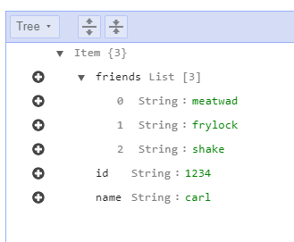
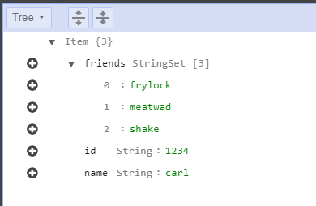
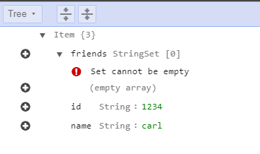

*Full [code](https://gist.github.com/robzhu/3a6017c85758a682c759176f92e00fa7) if you want to follow along.*

[Amazon DynamoDB](https://aws.amazon.com/dynamodb/) is one of the most versatile and popular services on AWS. In seconds, we can deploy a highly available, dynamically scaling key-document store with global replication, transactions, and [more](https://aws.amazon.com/dynamodb/features/)! However, if we modify a list attribute on a document, we need to take extra steps to achieve correctness and concurrency. Below, I'll describe the problem and offer several solutions. 

Suppose we insert the following document, using the [JavaScript AWS-SDK](https://github.com/aws/aws-sdk-js-v3#getting-started) and the [DynamoDB DocumentClient](https://docs.aws.amazon.com/AWSJavaScriptSDK/latest/AWS/DynamoDB/DocumentClient.html):

```JavaScript
DynamoDB.put({ TableName, Item: {
    id: "1234",
    name: "carl",
    friends: ["meatwad", "frylock", "shake"]
  }
});
```

In the DynamoDB console, here's what the document looks like:



By default, the DocumentClient has marshalled the JavaScript array as a DynamoDB List type. How would we remove the value "frylock" from the "friends" List attribute? Here's the doc on the List's remove operation. Since we need to specify the index of the element to remove, we need to read the document and find the index:

```JavaScript
async function removeFriendByValue(friendName: string) {
  const Key = { id: "1234" };
  // fetch the document
  let result = await DynamoDB.get({
    TableName,
    Key
  }).promise();
  // find the index
  const indexToRemove = result.Item.friends.indexOf(friendName);
  if (indexToRemove === -1) {
    // element not found
    return;
  }
  // remove-by-index
  await DynamoDB.update({
    TableName,
    Key,
    UpdateExpression: `REMOVE friends[${indexToRemove}]`,
  }).promise();
}
```

But this implementation has a race condition; there is a small window of time between reading the document, finding the index, and sending the update request, during which the document could be updated by another source, thus causing the operation "remove element at index X" to produce an undesired result. Luckily, there are several solutions to this common problem.

## 1. Condition Expressions on the list contents

DynamoDB supports a handy feature called a Condition Expressions, which lets us specify a condition that must be met in order for the operation to execute. In this case we want to build a rule that says, "only execute this operation if the target value is in the list":

```JavaScript
{
  TableName,
  Key,
  UpdateExpression: `REMOVE friends[${indexToRemove}]`,
  ConditionExpression: `friends[${indexToRemove}] = :valueToRemove`,
  ExpressionAttributeValues: {
    ":valueToRemove": friendName
  }
}
```

A Condition Expression is a predicate that prevents execution if it evaluates to false. When we use Condition Expressions, we also need to handle the error case where the condition expression is not met. Here's the updated function:

```JavaScript
// helper function to return the error in a promise
async function updateWithErrorWrapper(params) {
  return new Promise(resolve => {
    DynamoDB.update(params, (err, data) => {
      resolve({ err, data });
    });
  });
}

async function conditionalRemoveFriendByValue(friendName) {
  const Key = { id: "1234" };
  
  // fetch the document
  let result = await DynamoDB.get({
    TableName,
    Key
  }).promise();
  
  // find the index
  let indexToRemove = result.Item.friends.indexOf(friendName);
  if (indexToRemove === -1) {
    // element not found
    return false;
  }
  
  // remove-by-index IFF the attribute contains the element we want to remove.
  const { err, data } = await updateWithErrorWrapper({
    TableName,
    Key,
    UpdateExpression: `REMOVE friends[${indexToRemove}]`,
    ConditionExpression: `friends[${indexToRemove}] = :valueToRemove`,
    ExpressionAttributeValues: {
      ":valueToRemove": friendName
    }
  });
  
  if (err) {
    if (err.code === "ConditionalCheckFailedException") {
      console.error("condition expression failed");
    } else {
      console.error("unhandled error: " + err);
    }
    return false;
  }
  return true;
}
```

But this technique only ensures that updates to the list attribute are safe. How can we ensure we only apply updates when the document has not changed?

## 2. Condition Expression on a version attribute

Borrowing from databases that employ multi-version concurrency control, we can introduce a "version" attribute at the root of our document. We can use the version field to set a condition expression that aborts the update when any other update has occurred. During the put operation, we can include an initial version property like so:

```JavaScript
DynamoDB.put({ TableName, Item: {
    id: "1234",
    name: "carl",
    friends: ["meatwad", "frylock", "shake"],
    version: 1,
  }
});
```

Let's update the condition expression and add error handling:

```JavaScript
async function conditionalVersionRemoveFriendByValue(friendName) {
  const Key = { id: "1234" };
  
  // fetch the document
  const document = (await DynamoDB.get({
    TableName,
    Key
  }).promise()).Item;
  
  // find the index
  let indexToRemove = document.friends.indexOf(friendName);
  let version = document.version;
  if (indexToRemove === -1) {
    // element not found
    return false;
  }
  
  // remove-by-index IFF the version field matches
  const { err, data } = await updateWithErrorWrapper({
    TableName,
    Key,
    UpdateExpression: `
      REMOVE friends[${indexToRemove}]
      ADD version :incrementVersionBy
    `,
    ConditionExpression: `version = :version`,
    ExpressionAttributeValues: {
      ":version": version,
      ":incrementVersionBy": 1
    }
  });
  
  if (err) {
    if (err.code === "ConditionalCheckFailedException") {
      console.error("condition expression failed");
    } else {
      console.error("unhandled error: " + err);
    }
    return false;
  }
  return true;
}
```

Notice that the Update Expression also increments the version attribute. The two drawbacks to this approach:

1. We need to add a version attribute to every document/table for which we want to enforce this pattern.
2. We need to create a wrapper layer that ensures all updates respect the version attribute and somehow ensure that direct update operations are avoided.

## 3. Use the Set data type

In practice, a friends list would store of a list of unique foreign keys. If we know the entries are unique, we can marshal the friends field as the DynamoDB Set data type instead of a List. Compared to lists, sets have a few differences:

1. All values must be of the same type (string, bool, number)
2. All values must be unique
3. To remove element(s) from a set, use the DELETE operation, specifying a set of values
4. A Set cannot be empty

Sounds perfect for storing a list of related document keys. However, we saw that the DocumentClient serializes JavaScript arrays as Lists, so we need to override that behavior with a custom marshaller.

```JavaScript
import * as AWS from "aws-sdk";
const DynamoDB = new AWS.DynamoDB.DocumentClient();

DynamoDB.put({
  TableName,
  Item: {
    id: "1234",
    name: "carl",
    friends: DynamoDB.createSet(["meatwad", "frylock", "shake"])
  }
});
```

In the console, our new document looks almost identical, except for the "StringSet" type on the friends attribute.



Now for the **DELETE** operation:

```JavaScript
async function deleteFriendByValue(friendName: string) {
  const Key = { id: "1234" };
  // Delete the value from the set. This operation is idempotent and will not
  // produce an error if the value(s) are missing.
  const { err, data } = await updateWithErrorWrapper({
    TableName,
    Key,
    UpdateExpression: `DELETE friends :valuesToRemove`,
    ExpressionAttributeValues: {
      ":valuesToRemove": DynamoDB.createSet([friendName])
    }
  });

  if (err) {
    console.error("unhandled error: " + err);
    return false;
  }

  return true;
}
```

Working with Sets from JavaScript has two gotchas. First: a set attribute on a document does not deserialize into a JavaScript array. Let's see what it actually returns:

```JavaScript
const result = await DynamoDB.get({
   TableName,
   Key: { id: "1234" }
 }).promise();
 console.log(result.Item.friends);
 console.log(Array.isArray(result.Item.friends.values));

// Output:
Set {
  wrapperName: 'Set',
  values: [ 'frylock', 'meatwad', 'shake' ],
  type: 'String' }
true
```

From the above experiment, a DynamoDB Set deserializes into an object with its array of items stored under the values property. If we want a Set to deserialize into an array, we need to add an unmarshalling step where we assign the values property instead of the deserialized set object itself. Remember how sets cannot be empty? If we try to remove all elements from a set, the console will stop us:



However, if we remove the last element from a set in code, the attribute will be deleted from the document. This means the unmarshalling step we mentioned in gotcha #1 will need to account for the case where the property is undefined. Here's a helper function that covers both cases:

```JavaScript
function toArrayfromSet(set) {
  if (!set) return [];
  if (Array.isArray(set)) return set;
  
  return Array.isArray(set.values) ? set.values : [];
}
```

You'll still get an error if you try to store an empty array as a set, so here's the helper function going the other way:

```JavaScript
export function fromArrayToSet(values: string[]) {
  if (!values || values.length === 0) {
    throw Error('Cannot convert empty array into a set');
  }
  return DynamoDB.createSet(values);
}
```

## 4. Global Write Lock

The final solution is avoid the Transactional Memory problem by preventing concurrent writes. We can avoid concurrent writes by requiring any writer to obtain a distributed write lock (using a distributed lock service, such as etcd or zookeeper).

Since there are many implementations of the global-write-lock pattern, I'll omit sample code and directly discuss the tradeoffs.

This technique has two significant drawbacks: 1) a distributed lock service adds extra complexity and latency. 2) A global write lock reduces write throughout. If you’re already using a distributed lock service and you don’t need high write throughput, this solution is worth considering.

## What About Transactions?

DynamoDB also supports multi-document [transactions](https://aws.amazon.com/blogs/aws/new-amazon-dynamodb-transactions/), and this sounds like a promising solution. But, as my colleague Danilo puts it:

> Items are not locked during a transaction. DynamoDB transactions provide serializable isolation. If an item is modified outside of a transaction while the transaction is in progress, the transaction is canceled and an exception is thrown with details about which item or items caused the exception.

For this use case, transactions will essentially act like a slower version of condition expressions.

# That's all, Folks

Here's a [gist](https://gist.github.com/robzhu/3a6017c85758a682c759176f92e00fa7) of all the code we've written so far. 
