 
Amazon Bedrock, the easiest way to build and scale generative AI applications with foundation models (FMs), is now generally available. Amazon Bedrock is a fully managed service that offers a choice of high-performing FMs from leading AI companies including AI21 Labs, Anthropic, Cohere, Meta, Stability AI, and Amazon, along with a broad set of capabilities that you need to build generative AI applications, simplifying development while maintaining privacy and security.

Amazon Bedrock is the first to offer Llama 2, Meta’s large language models (LLMs), in 13B and 70B parameter versions that have been fine-tuned as a fully managed API. Llama models are ideal for dialogue use cases. To learn more, see Llama 2 on Amazon Bedrock.

To help you accelerate deploying generative AI into production, provisioned throughput is available in Amazon Bedrock, which provides you the flexibility and control to reserve throughput and maintain a consistent user experience even during peak traffic times. For customers building in highly regulated industries, Amazon Bedrock has achieved HIPAA eligibility and GDPR compliance. Additionally, Amazon Bedrock is integrated with Amazon CloudWatch, to help you track usage metrics and build customized dashboards for audit purposes, and with AWS CloudTrail, to monitor and troubleshoot API activity as you integrate other systems into your generative AI applications.

In this post, we'll unravel the mystery of Amazon Bedrock and show you step-by-step how to use popular large language models that are currently available on Amazon Bedrock. We'll show you two ways to use it:

- Using the Amazon Bedrock console 
- Using the Amazon Bedrock API 

## 1.	Get started with Amazon Bedrock

Amazon Bedrock is available in the US East (N. Virginia) and US West (Oregon) AWS Regions.

You can access foundation models (FMs) available in Amazon Bedrock through the AWS Management Console, AWS SDKs, and open-source frameworks such as LangChain. In the Amazon Bedrock console, you can browse FMs, browse and load example use cases and tips for each FM. 

First, you need to enable access to the FM. In the console, select `Model access` in the left navigation pane and enable the FM you want to access. Once FM access is enabled, you can experiment with different model and inference configuration settings to find the right FM for your use case.

### 1.1	Using the Amazon Bedrock console

In the Amazon Bedrock console, select `Model access` in the left navigation pane and enable the model you want to use. After enabling model access, you can use the model interactively in Playground or through the API. See the screenshot below for an example.

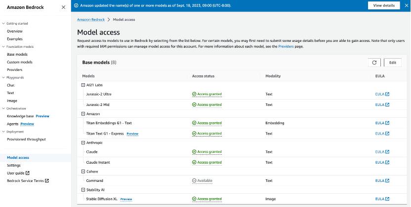

For example, here is a content generation use case for Claude v2 model:

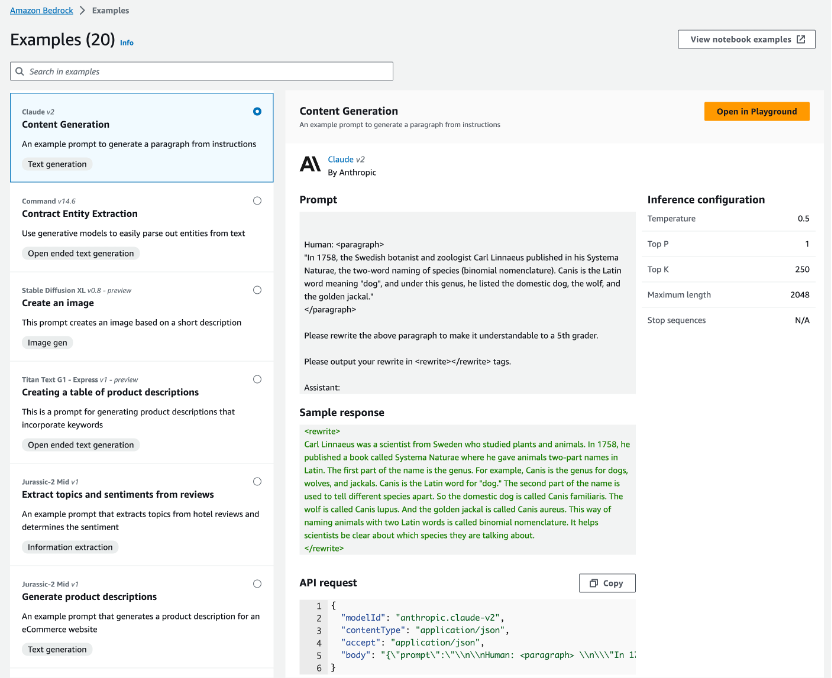

The example shows a prompt with an example response, an example's inference configuration parameter settings, and an API request to run the example. If you choose `Open in Playground` you can further explore models and use cases in an interactive console experience.

Amazon Bedrock provides a playground for chat, text, and image models. In the chat platform, you can try out various FMs using a conversation chat interface. The following example uses Anthropic's Claude V2 model to ask for a list of the best restaurants in Hong Kong:

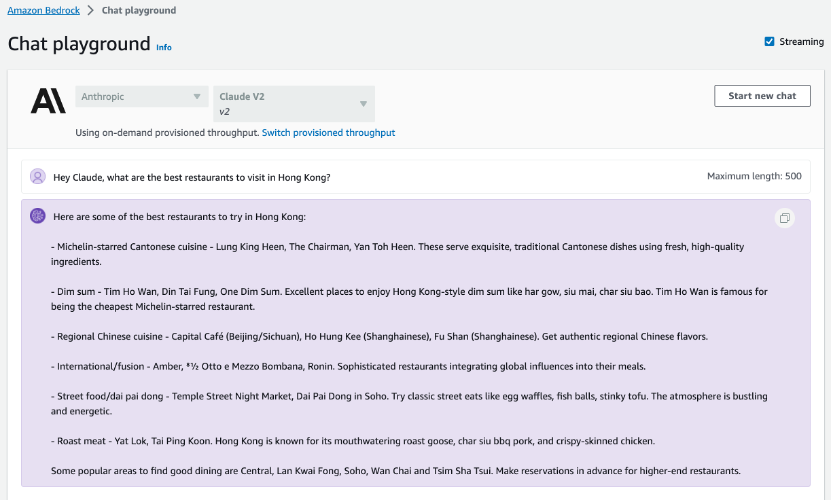

When evaluating different models, you should try different prompt engineering techniques and inference configuration parameters. Prompt Engineering is an exciting new skill focused on how to better understand FMs and apply them to your tasks and use cases. Effective prompt engineering can help you get the most out of FMs and get correct and accurate responses.

The following example follows the response from the Claude V2 model in the screenshot above to ask further about restaurants worth visiting near Causeway Bay in Hong Kong:

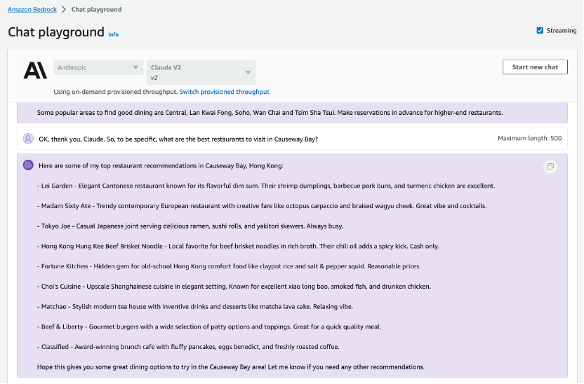

You can then continue to ask Claude V2: 
“OK, please be more specific, what about Cantonese restaurants near Causeway Bay?” 

We used this method to test whether the model correctly understood the context. The output screenshot of the model is as follows:

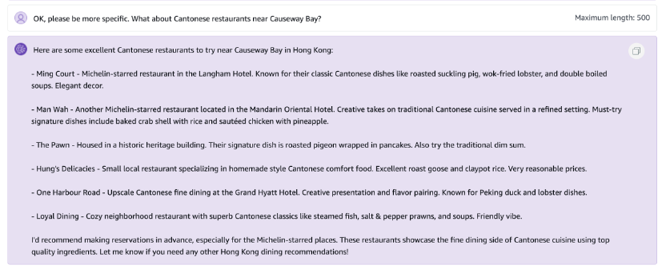

Inference configuration parameters affect the responses generated by the model. Parameters such as `Temperature`, `Top-P`, and `Top-K` allow you to control randomness and diversity, while `Maximum Length` controls the length of the model response, as shown in the following figure.


Note that each model exposes a different but often overlapping set of inference parameters. These parameters are either named the same between models or similar enough to make inferences when you try different models.

You can also provide examples in prompts, or encourage models to reason through more complex tasks. Check out the [Amazon Bedrock documentation](https://docs.aws.amazon.com/bedrock/latest/userguide/what-is-service.html) and the model provider's corresponding documentation for more tips and best practices.

### 1.2 Using the Amazon Bedrock API

In this demo, we show how to use the [AWS boto3 Python SDK](https://boto3.amazonaws.com/v1/documentation/api/latest/index.html) to work with [Amazon Bedrock](https://aws.amazon.com/bedrock/) Foundation Models. Working with Amazon Bedrock is as simple as selecting an Foundation model for your use case and then making a few API requests. 

#### 1.2.1 Enable AWS IAM Permissions for Amazon Bedrock

The AWS identity you assume from your notebook environment (which is the `Studio/notebook Execution Role` from SageMaker, or could be a role or IAM User for self-managed notebooks), must have sufficient [AWS IAM permissions](https://docs.aws.amazon.com/IAM/latest/UserGuide/access_policies.html) to call the Amazon Bedrock service.

To grant Bedrock access to your identity, you can:

-	Open the [AWS IAM Console](https://us-east-1.console.aws.amazon.com/iam/home?)
-	Find your [Role](https://us-east-1.console.aws.amazon.com/iamv2/home?#/roles) (if using SageMaker or otherwise assuming an IAM Role), or else [User](https://us-east-1.console.aws.amazon.com/iamv2/home?#/users)
-	Select `Add Permissions` > `Create Inline Policy` to attach new inline permissions, open the JSON editor and paste in the below example policy:

```
{
    "Version": "2012-10-17",
    "Statement": [
        {
            "Sid": "BedrockFullAccess",
            "Effect": "Allow",
            "Action": ["bedrock:*"],
            "Resource": "*"
        }
    ]
}
```
I use my `sagemaker-demo-role-haowen` role, which includes the `bedrock_full_access_haowen` policy from the code above. This is shown in the screenshot below.

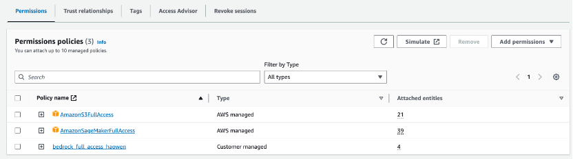

#### 1.2.2 Code Execution Environment

For **SageMaker Studio**, my environment is as follows:

-	Data Science 3.0
-	Python 3
-	ml.m5.large
-	us-east-1 region

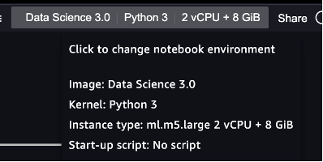

For **SageMaker Notebook Instances**, my environment is as follows:

-	Conda_Python3
-	ml.m5.large
-	us-east-1 region

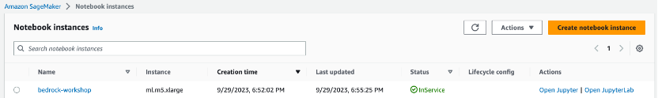


**Clone and use the notebooks**

In SageMaker Studio, you can open a `System Terminal` to run commands by clicking `File > New > Terminal`.
Once your notebook environment is set up, clone the repository into it.

```
cd ~/SageMaker(in SageMaker Notebook instance) or cd ~(in SageMaker Studio)

git clone https://github.com/aws-samples/amazon-bedrock-workshop.git
cd amazon-bedrock-workshop/

bash ./download-dependencies.sh
```

After execute the `download-dependencies.sh` script, you will see the output:

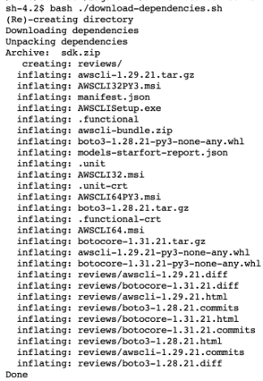

This script will create a `dependencies` folder and download the relevant SDKs, but will not `pip install` them just yet. Once the packages are ready, you can start your Bedrock fantasy journey by selecting the `bedrock_boto3_setup.ipynb` file below:

```
amazon-bedrock-workshop/00_Intro/bedrock_boto3_setup.ipynb
```

You can get the full code [here](https://github.com/aws-samples/amazon-bedrock-workshop/blob/main/00_Intro/bedrock_boto3_setup.ipynb).

#### 1.2.3 Create the boto3 client

Interaction with the Bedrock API is done via the AWS SDK for Python: [boto3](https://boto3.amazonaws.com/v1/documentation/api/latest/index.html).

You'll need to run the below cell to install it in the notebook kernel:

```
# Make sure you ran `download-dependencies.sh` from the root of the repository first!
%pip install --no-build-isolation --force-reinstall \
    ../dependencies/awscli-*-py3-none-any.whl \
    ../dependencies/boto3-*-py3-none-any.whl \
    ../dependencies/botocore-*-py3-none-any.whl
```

This notebook demonstrates invoking Bedrock models directly using the AWS SDK, However, for other notebooks you have cloned from the previous GitHub repository, you may need to install [LangChain](https://github.com/hwchase17/langchain):

```
%pip install --quiet langchain==0.0.304
```

Depending on your environment, you might need to customize the setup when creating your Bedrock service client. To assist with this, we've provided a `get_bedrock_client()` utility method that supports passing in different options. You can find the implementation in `../utils/bedrock.py`.

```
import json
import os
import sys

import boto3

module_path = ".."
sys.path.append(os.path.abspath(module_path))
from utils import bedrock, print_ww

boto3_bedrock = bedrock.get_bedrock_client(
    assumed_role=os.environ.get("BEDROCK_ASSUME_ROLE", None),
    endpoint_url=os.environ.get("BEDROCK_ENDPOINT_URL", None),
    region=os.environ.get("AWS_DEFAULT_REGION", None),
)
```

#### 1.2.4 Validate the connection

We can check if the client works by trying out the `list_foundation_models()` method, which will tell us all the models available for us to use:

```
boto3_bedrock.list_foundation_models()
```

The following screenshot shows the output of running the above method in my environment:

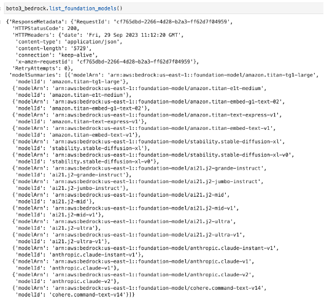

#### 1.2.5 Input and output data formats

The `invoke_model()` method of the Amazon Bedrock client will be our primary tool for most text generation and processing tasks, regardless of the model we’re using. However, the input and output formats vary depending on the specific foundation model, as detailed below:

**Amazon Titan Large**

***Input***

```
{   
    "inputText": "<prompt>",
    "textGenerationConfig" : { 
        "maxTokenCount": 512,
        "stopSequences": [],
        "temperature": 0.1,  
        "topP": 0.9
    }
}
```
***Output***
```
{
    "inputTextTokenCount": 613,
    "results": [{
        "tokenCount": 219,
        "outputText": "<output>"
    }]
}
```

**Anthropic Claude**

***Input***

```
{
    "prompt": "\n\nHuman:<prompt>\n\nAnswer:",
    "max_tokens_to_sample": 300,
    "temperature": 0.5,
    "top_k": 250,
    "top_p": 1,
    "stop_sequences": ["\n\nHuman:"]
}
```
***Output***

```
{
    "completion": "<output>",
    "stop_reason": "stop_sequence"
}
```

**Stability AI Stable Diffusion XL**

***Input***

```
{
    "text_prompts": [
        {"text": "this is where you place your input text"}
    ],
    "cfg_scale": 10,
    "seed": 0,
    "steps": 50
}
```
***Output***

```
{ 
    "result": "success", 
    "artifacts": [
        {
            "seed": 123, 
            "base64": "<image in base64>",
            "finishReason": "SUCCESS"
        },
        //...
    ]
}
```

#### 1.2.6 Understanding common inference parameters

**Randomness and Diversity**

Foundation models offer parameters to control randomness and diversity in their responses.

***Temperature*** – Large language models utilize probability to determine the sequence of words in a generated text. For any given next word, there is a probability distribution of options for the next word in the sequence. When you set the temperature closer to zero, the model tends to select the higher-probability words. When you set the temperature further away from zero, the model may select a lower-probability word.

In technical terms, temperature modulates the probability density function for subsequent tokens, implementing temperature sampling. This parameter can deepen or flatten the density function curve. Lower values result steeper curves and more deterministic responses, while higher values lead to flatter curves and more random responses.

***Top K*** – While temperature defines the probability distribution of potential words, Top K defines a cut-off point where the model no longer considers less probable words. For example, if K=50, the model selects from 50 of the most probable words that could be next in a given sequence. This reduces the probability that an unusual word gets selected next in a sequence. In technical terms, Top K is the number of the highest-probability vocabulary tokens to keep for Top- K-filtering - This limits the distribution to high-probability tokens, ensuring the model selects from the most likely options.

***Top P*** – Top P introduces a cut-off based on the cumulative probability of potential choices. If you set Top P below 1.0, the model considers the most probable options and ignores fewer probable ones. Top P is similar to Top K, but instead of capping the number of choices, it caps choices based on the sum of their probabilities. For the prompt "I hear the hoof beats of," you might expect responses like "horses," "zebras" or even "unicorns". If you set the temperature to its maximum, without capping Top K or Top P, you increase the probability of getting unusual results such as "unicorns." If you set the temperature to 0, you increase the probability of "horses." If you set a high temperature and set Top K or Top P to the maximum, you increase the probability of "horses" or "zebras," and decrease the probability of "unicorns."

**Length**

The following parameters govern the length of the generated response.

***Response length*** – Configures the minimum and maximum number of tokens to use in the generated response.

***Length penalty*** – Length penalty optimizes the model to be more concise in its output by penalizing longer responses. Length penalty differs from response length, which sets a strict minimum or maximum response length.
In technical terms, the length penalty penalizes the model exponentially for lengthy responses. 0.0 means no penalty. Set a value less than 0.0 for the model to generate longer sequences, or set a value greater than 0.0 for the model to produce shorter sequences.

***Repetitions*** 
The following parameters help control repetition in the generated response.

***Repetition penalty*** (also known as ***presence penalty***) – Prevents repetitions of the same words (tokens) in responses. 1.0 means no penalty. Values greater than 1.0 discourage repetition.

#### 1.2.7 Explore and Experiment with foundation models

Now that we’ve covered the theoretical aspects, let's put the models to work! Execute the cells below to explore basic, synchronous example invocations for each model:


**An example of using the Amazon Titan Large model in Bedrock**

```
# If you'd like to try your own prompt, edit this parameter!
prompt_data = """Command: Write me a blog about making strong business decisions as a leader.

Blog:
"""

body = json.dumps({"inputText": prompt_data})
modelId = "amazon.titan-tg1-large"
accept = "application/json"
contentType = "application/json"

response = boto3_bedrock.invoke_model(
    body=body, modelId=modelId, accept=accept, contentType=contentType
)
response_body = json.loads(response.get("body").read())

print(response_body.get("results")[0].get("outputText"))
```

Upon executing the provided code, I obtained the following model output:

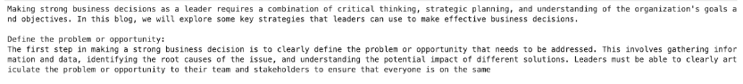


**An example of using the Anthropic Claude v2 model in Bedrock**

```
# If you'd like to try your own prompt, edit this parameter!
prompt_data = """Human: Write me a blog about making strong business decisions as a leader.

Assistant:
"""

body = json.dumps({"prompt": prompt_data, "max_tokens_to_sample": 500})
# modelId = "anthropic.claude-instant-v1"  # change this to use a different version from the model provider
modelId = "anthropic.claude-v2"
accept = "application/json"
contentType = "application/json"

response = boto3_bedrock.invoke_model(
    body=body, modelId=modelId, accept=accept, contentType=contentType
)
response_body = json.loads(response.get("body").read())

print(response_body.get("completion"))
```

Upon executing the provided code, I obtained the following model output:


**An example of using the Stability Stable Diffusion XL model in Bedrock**

```
prompt_data = "a fine image of an astronaut riding a horse on Mars"
body = json.dumps({
    "text_prompts": [{"text": prompt_data}],
    "cfg_scale": 10,
    "seed": 20,
    "steps": 50
})
modelId = "stability.stable-diffusion-xl"
accept = "application/json"
contentType = "application/json"

response = boto3_bedrock.invoke_model(
    body=body, modelId=modelId, accept=accept, contentType=contentType
)
response_body = json.loads(response.get("body").read())

print(response_body["result"])
print(f'{response_body.get("artifacts")[0].get("base64")[0:80]}...')

import base64
import io
from PIL import Image

base_64_img_str = response_body.get("artifacts")[0].get("base64")
image = Image.open(io.BytesIO(base64.decodebytes(bytes(base_64_img_str, "utf-8"))))
image
```

Upon executing the provided code, I obtained the following model output:


## 2.	Data privacy and network security

With Amazon Bedrock, you are in control of your data, and all your inputs and customizations remain private to your AWS account. Your data, such as prompts, completions, and fine-tuned models, is not used for service improvement. Also, the data is never shared with third-party model providers.

Your data remains in the Region where the API call is processed. All data is encrypted in transit with a minimum of TLS 1.2 encryption. Data at rest is encrypted with AES-256 using [AWS KMS](https://aws.amazon.com/kms/) managed data encryption keys. You can also use your own keys (customer managed keys) to encrypt the data.

You can configure your AWS account and virtual private cloud (VPC) to use [Amazon VPC endpoints](https://docs.aws.amazon.com/vpc/latest/privatelink/concepts.html#concepts-vpc-endpoints) (built on [AWS PrivateLink](https://aws.amazon.com/privatelink/)) to securely connect to Amazon Bedrock over the AWS network. This allows for secure and private connectivity between your applications running in a VPC and Amazon Bedrock.


## 3.	Governance and monitoring

Amazon Bedrock integrates with IAM to facilitate granular permission management for Amazon Bedrock. These permissions encompass access to specific models, the playground environment, and various features within Amazon Bedrock. All API activity for AWS-managed services, including Amazon Bedrock, is comprehensively logged to CloudTrail within your account.

Amazon Bedrock emits data points to CloudWatch using the AWS/Bedrock namespace to track common metrics such as `InputTokenCount`, `OutputTokenCount`, `InvocationLatency`, and (number of) `Invocations`. You can filter results and get statistics for a specific model by specifying the model ID dimension when you search for metrics. This near real-time insight helps you track usage and cost (input and output token count) and troubleshoot performance issues (invocation latency and number of invocations) as you start building generative AI applications with Amazon Bedrock.

The following table describes runtime metrics provided by Amazon Bedrock.

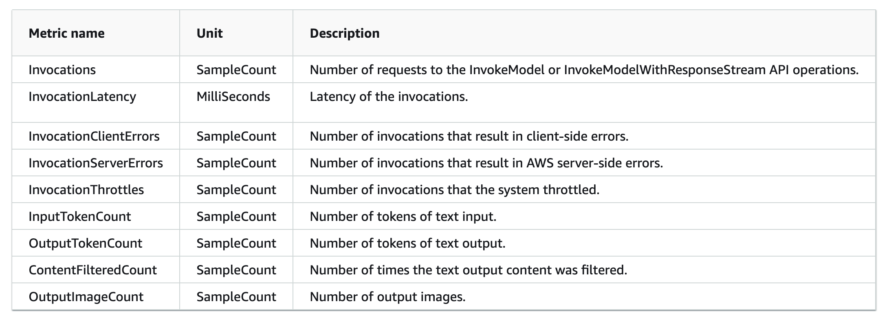

**View Amazon Bedrock metrics**

To view metrics (CloudWatch console):

- Sign in to the AWS Management Console and open the [CloudWatch console](https://console.aws.amazon.com/cloudwatch/).

- Choose `Metrics`, choose `All Metrics`, and then search for `ModelId`.

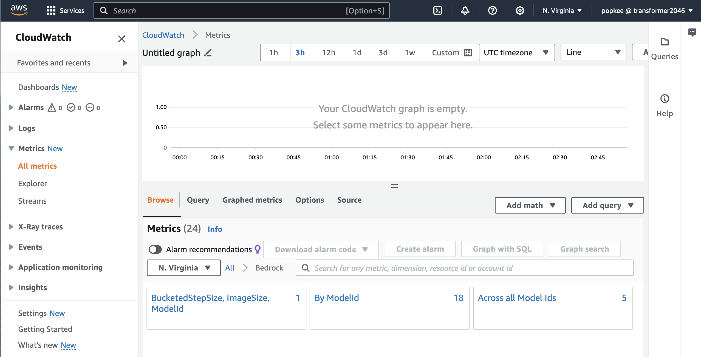

To retrieve metrics for your Amazon Bedrock operations, you can specify the following metric `dimension`. A `dimension` is a set of name-value pairs that you use to identify a metric. Amazon Bedrock supports the following dimensions:

- `ModelId` – all metrics

- `ModelId + ImageSize + BucketedStepSize` – OutputImageCount

The screenshot below depicts the `ModelId` metrics for the **Anthropic Claude v2 model**:

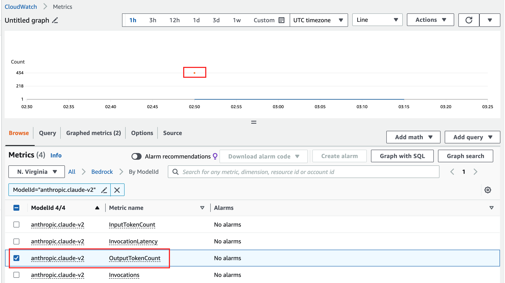

By selecting all the `metric name` and hovering the mouse over the corresponding monitoring points, you can view various detailed metric values, including `InvocationLatency`, `OutputTokenCount`, and `InputTokenCount`.

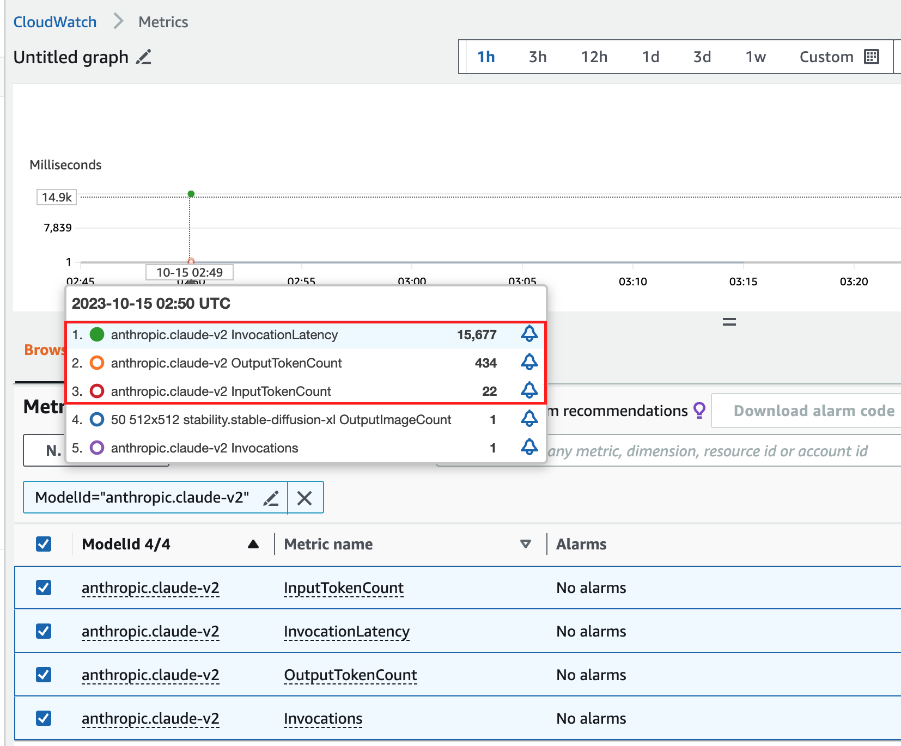

Additionally, the screenshot below illustrates the `ModelId + ImageSize + BucketedStepSize` metrics for the **Stable Diffusion XL model**:

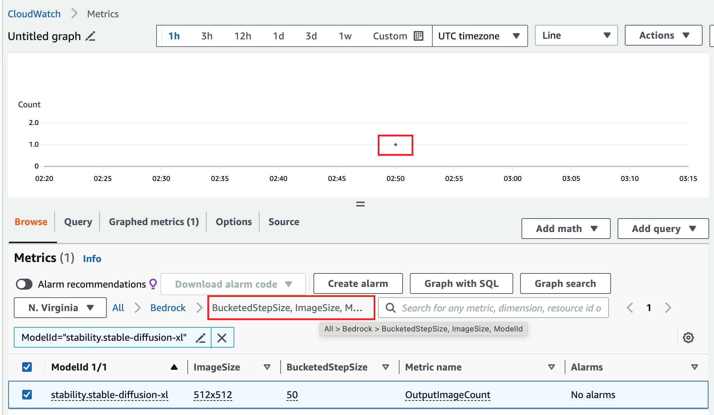


## Summary

In this article, we explored two primary methods for utilizing today's prominent large language models on Amazon Bedrock:

- Using the Amazon Bedrock console 
- Using the Amazon Bedrock API 

Stay tuned for the next article, where we will delve into and analyze the more sophisticated features of Amazon Bedrock.

## References

1) [Amazon Bedrock Is Now Generally Available – Build and Scale Generative AI Applications with Foundation Models]
(https://aws.amazon.com/blogs/aws/amazon-bedrock-is-now-generally-available-build-and-scale-generative-ai-applications-with-foundation-models/)

2) [Quickly build Generative AI applications with Amazon Bedrock]
(https://community.aws/posts/amazon-bedrock-quick-start)

3) [Amazon Bedrock Workshop]
(https://catalog.us-east-1.prod.workshops.aws/workshops/a4bdb007-5600-4368-81c5-ff5b4154f518/en-US)

4) [Monitor Amazon Bedrock with Amazon CloudWatch](https://docs.aws.amazon.com/bedrock/latest/userguide/monitoring-cw.html)


## About the Author

### Haowen Huang ([LinkedIn](https://www.linkedin.com/in/haowen-huang-9599445/))

Haowen is a Senior Developer Advocate at AWS based in Hong Kong. He has over 20 years of experience in the cloud computing, internet and telecom industries. He focuses on the promotion and application of AI, machine learning and data science.  