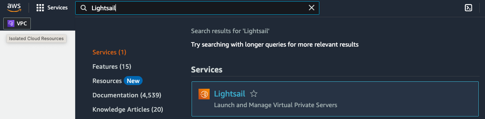
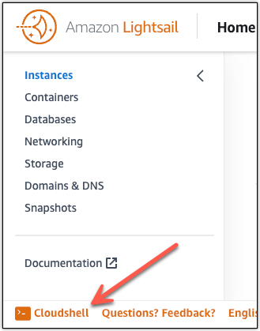
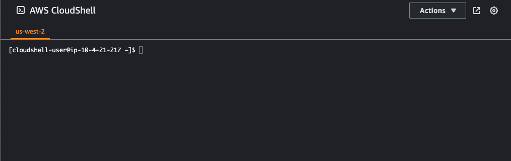
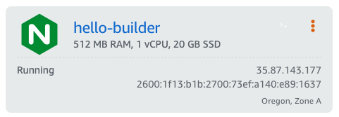
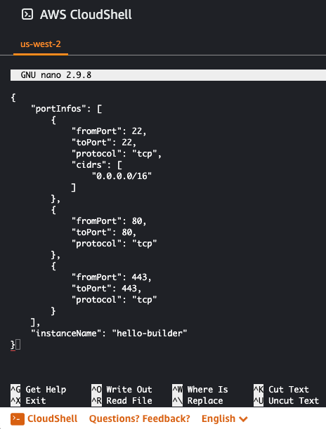

|ToC|
|---|

Have you ever needed to deploy a website, either to support or announce an event? You could use one of the many sites that offer this service, or you could use AWS to deploy your website. Using AWS may seem complicated but there’s a simple way to build websites and deploy other applications using AWS Lightsail. This article show how to deploy a website in five steps with AWS Lightsail and CloudShell.

## What is AWS Lightsail and CloudShell?

[AWS Lightsail](https://aws.amazon.com/lightsail/faq?sc_channel=el&sc_campaign=post&sc_content=deploy-nginx-with-aws-cloudshell-and-lightsail&sc_geo=mult&sc_country=mult&sc_outcome=acq) is a service that provides preconfigured Linux and Windows application stacks through an intuitive management console. The preconfigured instances of Virtual Private Servers (VPS), container services, storage, and databases. Networking, access, and security environments are automatically configured to host application. Lightsail bundles all the resources into monthly fixed price, letting you focus on your code and not the cost.

Let’s start by opening the Lightsail console. From the main AWS console, use the search bar to find and launch Lightsail.



We can use the Lightsail console to create and deploy the website, but there’s a faster option.

[AWS CloudShell](https://aws.amazon.com/cloudshell/faqs?sc_channel=el&sc_campaign=post&sc_content=deploy-nginx-with-aws-cloudshell-and-lightsail&sc_geo=mult&sc_country=mult&sc_outcome=acq) is a browser-based, pre-authenticated shell that you can launch directly from the Lightsail console. With CloudShell, you can run AWS CLI commands without downloading or installing command line tools. To open a terminal, choose CloudShell on the Console Toolbar, in the lower left of the console.



When the command prompt displays, the shell is ready.



## Let's Do This!

Are you ready to build a website? Away we go.

### Step 1: Deploy a NGINX on a Virtual Private Server

Lightsail virtual private servers, or instances, include many prebuilt application stacks called blueprints. Lets find the blueprint of NGINX, a popular web server. In the CloudShell terminal, use the `get-blueprints` command to list all the available blueprints. Because CloudShell includes common Unix/Linux utilities, you can use the unix utility, `grep`, to filter through the list to find the NGINX blueprint.

```bash
$ aws lightsail get-blueprints | grep nginx
            "blueprintId": "nginx",
            "group": "nginx",
```

All you need is the `blueprint-id` to create the NGINX instance. Because it's a single page web site, you can use the smallest instance, nano_2_0, which costs $3.50/month. Name the instance and tell AWS which availability zone to use.

```bash
aws lightsail create-instances \
    --instance-names hello-builder \
    --availability-zone <your availability zone> \
    --blueprint-id nginx \
    --bundle-id nano_2_0
```

When the instance is created, you’ll see a panel for the instance in the Lightsail console.



### Step 2: Configure access to your web server instance

We need to log into the server to deploy and render the web page to a browser. To do this, configure the firewall to open ports for NGINX and the ssh server. Copy the configuration file below and paste it into a text editor. CloudShell includes all the tools you expect in a Linux terminal including the nano editor.

```json
{
    "portInfos": [
        {
            "fromPort": 22,
            "toPort": 22,
            "protocol": "tcp",
            "cidrs": [
                "0.0.0.0/16"
            ]
        },
        {
            "fromPort": 80,
            "toPort": 80,
            "protocol": "tcp"
        },
        {
            "fromPort": 443,
            "toPort": 443,
            "protocol": "tcp"
        }
    ],
    "instanceName": "hello-builder"
}
```

Save the file as `ports.json`. You can save the file in CloudShell which provides 1 gb of storage.



We can configure the ports with the Lightsail `put-instance-public-ports` command, which uploads the `ports.json` file to the web server Upload the ports.json file and apply it to the VPS.

```bash
$ aws lightsail put-instance-public-ports --cli-input-json file://ports.json
```

### Step 3: Log into the server and deploy the web page

To login to the web server from the CloudShell terminal download the credentials, or the [key-pair](https://docs.aws.amazon.com/AWSEC2/latest/UserGuide/ec2-key-pairs.html?sc_channel=el&sc_campaign=post&sc_content=deploy-nginx-with-aws-cloudshell-and-lightsail&sc_geo=mult&sc_country=mult&sc_outcome=acq). First, make a directory to hold the credentials and then make a request for the key-pair. Set the file permission so that it is readable by only you.

```bash
$ mkdir ~/.ssh
# get key-pair
$ aws --region us-west-2 lightsail download-default-key-pair --output text --query privateKeyBase64 > ~/.ssh/us-west-2-default.cer 

# check key
$ cat  ~/.ssh/us-west-2-default.cer 

# set permissions
$ chmod 400 ~/.ssh/us-west-2-default.cer
```

You’ll need the public IP address of the server to login. You can get it from the Lightsail console or you can use the AWS CLI in CloudShell.

```bash
$ aws lightsail get-instance --instance-name hello-builder | jq '.instance.publicIpAddress'
```

Log into the web server using `ssh`, the default user name for the web server is `bitnami`.

```bash
ssh -i ~/.ssh/us-west-2-default.cer bitnami@<your-public-ip-address
```

Replace the NGINX index.html file with the web page below by changing into `bitnami` content directory and the deleting the default index.html file.

```bash
$ cd /opt/bitnami/nginx/html
$ rm index.html
```

Open a new `index.html` file in a text editor and paste the web page below.

```html
<!DOCTYPE html>
<html lang="en">

<head>
    <meta charset="UTF-8">
    <title>One Page Website</title>
    <style>
    * {
        margin: 0;
        padding: 0;
    }
    html{
        scroll-behavior: smooth;
    }
    body{
        font-size: 100%;
        font-family: sans-serif;
    }
    div, section, span, ul, li, a, header{
        box-sizing: border-box;
    }
    /*css reset*/
    header{
        width: 100%;
        display: flex;
        justify-content: space-between;
        padding: 20px 50px;
        align-items: center;
        position: fixed;
        z-index: 999;
    }
    #menu li{
        list-style: none;
        display: inline-block;
        margin: 20px;
    }
    #menu li a{
        color: #fff;
        text-decoration: none;
        font-size: 20px;
    }
    section{
        width: 100%;
        float: left;
        height: 100vh;
        position: relative;
    }
    #home{
    background-color: #413302;
    }
    #newyork{
        background-color: #49B660;
    }
    #london{
        background-color: #778388;
    }
    #paris{
        background-color: #107BEF ;
    }
    #tokyo{
        background-color: #F94706;
    }
    h1{
        position: absolute;
        top: 50%;
        left: 50%;
        transform: translate(-50%, -50%);
        color: #fff;
    }
    div img {
        position:absolute;
        top:0;
        left:0;
        right:0;
        bottom:0;
        margin:auto;
    }
    div figcaption {
        background-color: white;
        color: black;
        font-style: normal;
        padding: 2px;
        text-align: left;
        position:absolute;
        bottom:0;
    }
    </style>
</head>
<body>
    <section id="home">
        <header>
            <a href="#"><svg xmlns="http://www.w3.org/2000/svg" viewBox="0 0 640 512" id="IconChangeColor" height="200" width="200"><!--! Font Awesome Free 6.1.1 by @fontawesome - https://fontawesome.com License - https://fontawesome.com/license/free (Icons: CC BY 4.0, Fonts: SIL OFL 1.1, Code: MIT License) Copyright 2022 Fonticons, Inc. --><path d="M180.41 203.01c-.72 22.65 10.6 32.68 10.88 39.05a8.164 8.164 0 0 1-4.1 6.27l-12.8 8.96a10.66 10.66 0 0 1-5.63 1.92c-.43-.02-8.19 1.83-20.48-25.61a78.608 78.608 0 0 1-62.61 29.45c-16.28.89-60.4-9.24-58.13-56.21-1.59-38.28 34.06-62.06 70.93-60.05 7.1.02 21.6.37 46.99 6.27v-15.62c2.69-26.46-14.7-46.99-44.81-43.91-2.4.01-19.4-.5-45.84 10.11-7.36 3.38-8.3 2.82-10.75 2.82-7.41 0-4.36-21.48-2.94-24.2 5.21-6.4 35.86-18.35 65.94-18.18a76.857 76.857 0 0 1 55.69 17.28 70.285 70.285 0 0 1 17.67 52.36l-.01 69.29zM93.99 235.4c32.43-.47 46.16-19.97 49.29-30.47 2.46-10.05 2.05-16.41 2.05-27.4-9.67-2.32-23.59-4.85-39.56-4.87-15.15-1.14-42.82 5.63-41.74 32.26-1.24 16.79 11.12 31.4 29.96 30.48zm170.92 23.05c-7.86.72-11.52-4.86-12.68-10.37l-49.8-164.65c-.97-2.78-1.61-5.65-1.92-8.58a4.61 4.61 0 0 1 3.86-5.25c.24-.04-2.13 0 22.25 0 8.78-.88 11.64 6.03 12.55 10.37l35.72 140.83 33.16-140.83c.53-3.22 2.94-11.07 12.8-10.24h17.16c2.17-.18 11.11-.5 12.68 10.37l33.42 142.63L420.98 80.1c.48-2.18 2.72-11.37 12.68-10.37h19.72c.85-.13 6.15-.81 5.25 8.58-.43 1.85 3.41-10.66-52.75 169.9-1.15 5.51-4.82 11.09-12.68 10.37h-18.69c-10.94 1.15-12.51-9.66-12.68-10.75L328.67 110.7l-32.78 136.99c-.16 1.09-1.73 11.9-12.68 10.75h-18.3zm273.48 5.63c-5.88.01-33.92-.3-57.36-12.29a12.802 12.802 0 0 1-7.81-11.91v-10.75c0-8.45 6.2-6.9 8.83-5.89 10.04 4.06 16.48 7.14 28.81 9.6 36.65 7.53 52.77-2.3 56.72-4.48 13.15-7.81 14.19-25.68 5.25-34.95-10.48-8.79-15.48-9.12-53.13-21-4.64-1.29-43.7-13.61-43.79-52.36-.61-28.24 25.05-56.18 69.52-55.95 12.67-.01 46.43 4.13 55.57 15.62 1.35 2.09 2.02 4.55 1.92 7.04v10.11c0 4.44-1.62 6.66-4.87 6.66-7.71-.86-21.39-11.17-49.16-10.75-6.89-.36-39.89.91-38.41 24.97-.43 18.96 26.61 26.07 29.7 26.89 36.46 10.97 48.65 12.79 63.12 29.58 17.14 22.25 7.9 48.3 4.35 55.44-19.08 37.49-68.42 34.44-69.26 34.42zm40.2 104.86c-70.03 51.72-171.69 79.25-258.49 79.25A469.127 469.127 0 0 1 2.83 327.46c-6.53-5.89-.77-13.96 7.17-9.47a637.37 637.37 0 0 0 316.88 84.12 630.22 630.22 0 0 0 241.59-49.55c11.78-5 21.77 7.8 10.12 16.38zm29.19-33.29c-8.96-11.52-59.28-5.38-81.81-2.69-6.79.77-7.94-5.12-1.79-9.47 40.07-28.17 105.88-20.1 113.44-10.63 7.55 9.47-2.05 75.41-39.56 106.91-5.76 4.87-11.27 2.3-8.71-4.1 8.44-21.25 27.39-68.49 18.43-80.02z" id="mainIconPathAttribute" fill="orange"></path></svg></a>
            <ul id="menu">
                <li><a href="#home">Home</a></li>
                <li><a href="#newyork">New York</a></li>
                <li><a href="#london">London</a></li>
                <li><a href="#paris">Paris</a></li>
                <li><a href="#tokyo">Tokyo</a></li>
            </ul>
        </header>
         <h1>This Is Home</h1>
         <div>
            
            <figcaption> Photo credit:<a href="https://unsplash.com/@whatyouhide">Andrea Leopardi</a></figcaption>
        </div>
    </section>
    <section id="newyork">
        <div>
            
            <figcaption> Photo credit:<a href="https://unsplash.com/@zachmiles">Zach Miles</a></figcaption>
        </div>
    </section>
    <section id="london">
        <div>
            
            <figcaption> Photo credit:<a href="https://unsplash.com/@rubicon99">David Monaghan</a></figcaption>
        </div>
    </section>
   
    <section id="paris">
        <div>
            
            <figcaption> Photo credit:<a href="https://unsplash.com/@cyril_mzn">Cyruk Mzn</a></figcaption>
        </div>
    </section>
    <section id="tokyo">
        <div>
            
            <figcaption> Photo credit:<a href="https://unsplash.com/@erikeae">Erik Eastman</a></figcaption>
        </div>
    </section>
</body>
</html>
```

Save the file as `index.html`.


At this point, you can open a browser to the public IP of the web server to see the site. However, if the instance is rebooted the server will be assigned a new public IP address. Let’s fix that.

### Step 4: Attach a static IP

If the server is restarted, the IP address will change. You can create a static IP and attach it to the web server.

```bash
$ aws lightsail allocate-static-ip \
    --static-ip-name hello-builder-static-ip

$ aws lightsail attach-static-ip \
--static-ip-name hello-builder-static-ip \
--instance-name hello-builder

$ aws lightsail get-static-ip --static-ip-name hello-builder-static-ip | jq '.staticIp.ipAddress'
```

### Step 5: Register a domain

Your site should have a memorable address. If you don’t have a domain name, you can create one in Lightsail. Note that domain services are only available in the the `us-east-1` region, if you are deploying the server in another region, include the `—region us-east-1` parameter in the command.

```bash
$ aws lightsail create-domain \    
--region us-east-1 \
--domain-name hellobuildercities.com
```

Let’s register the domain name to AWS Route 53, Amazon’s DNS service. You’ll need the static IP attached to the server, which you can find with the Lightsail  get-static-ip command.

```bash
$ aws lightsail get-static-ip --static-ip-name hello-builder-static-ip | jq '.staticIp.ipAddress'

$ aws lightsail create-domain-entry \
    --region us-east-1 \
    --domain-name hellobuildercities.com \
    --domain-entry name=example.com,type=A,target=<your-static-ip-address>
```

Wait one minute, because that’s how long it takes for your domain to propagate word-wide. Open a browser to your website and take it all in.

### Step 6: There is no Step 6

You’re done. Walk away from the computer. Enjoy your day.

## Summary

Having CloudShell in the Lightsail console is brilliant. You have a complete Linux environment to deploy Lightsail services beyond virtual private servers. Build a container solution, deploy a high availability database, or create more storage for data. You can do this in the CloudShell terminal, and with 1 gb of storage, you can save scripts, configuration files, or even applications. Lightsail is the AWS service for people who want to build in the cloud without having to build the cloud.
