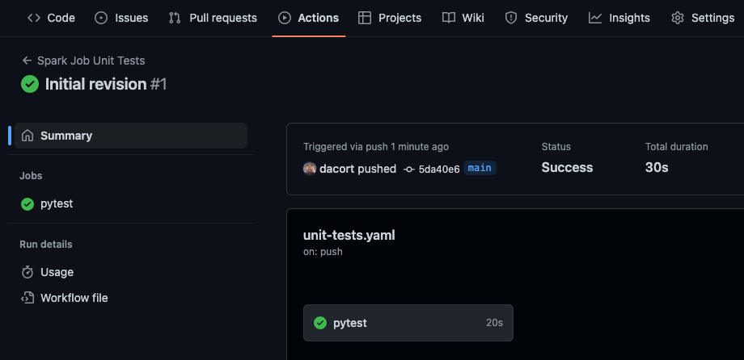
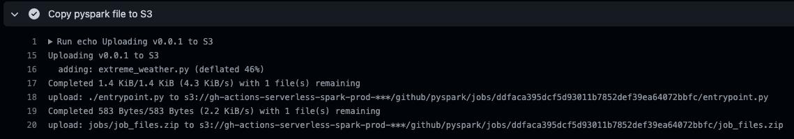

Apache Spark is one of the most popular frameworks for data processing both on-premises and in the cloud. Despite its popularity, modern DevOps practices for Apache Spark are not well-documented or readily available to data teams. GitHub Actions have become a popular way of maintaining continuous integration and deployment as part of code repositories - by combining development workflows with source code, developers get immediate feedback on their changes and can interate faster. In this post, we show how to deploy an end-to-end Spark ETL pipeline to Amazon EMR Serverless with GitHub Actions to measure weather trends for a provided location.

## What you will learn

- How to use Amazon EMR Serverless
- How to setup OpenID Connect
- How to configure unit tests and integration tests for PySpark
- How to automatically deploy your latest code


## Sections
<!-- Update with the appropriate values -->
| Info                | Level                                  |
| ------------------- | -------------------------------------- |
| ✅ AWS Level        | Intermediate                               |
| ⏱ Time to complete  | 60 minutes                             |
| 💰 Cost to complete | ~$10                                    |
| 🧩 Prerequisites    | - [AWS Account](https://portal.aws.amazon.com/billing/signup#/start/email)<br>- [GitHub Account](https://github.com) |
| 📢 Feedback            | <a href="https://pulse.buildon.aws/survey/DEM0H5VW" target="_blank">Any feedback, issues, or just a</a> 👍 / 👎 ?    |
| ⏰ Last Updated     | 2023-04-13                            |

| ToC |
|-----|

---

## Prerequisites

In this blog post, we'll show you how to build a production-ready Spark job in Python that runs unit and integration tests automatically, automatically builds and deploys new releases, and can even run manual or scheduled ETL jobs.

We'll go step-by-step to create a new repository and build up a PySpark job from scratch to a fully-deployed job in production with unit and integration tests, automatic deploys of versioned assets, and automated job runs. We'll use the [NOAA Global Surface Summary of Day](https://registry.opendata.aws/noaa-gsod/) as our source data.

In order to follow along, you'll need:

 - An AWS account (if you don't yet have one, you can create one and [set up your environment here](https://aws.amazon.com/getting-started/guides/setup-environment/)).
 - A GitHub account - sign up for free at [github.com](https://github.com/)
 - The `git` command
- An editor (VS Code, vim, emacs, Notepad.exe)

We also need to create some infrastructure for our jobs to run. For the purposes of this tutorial, we're only going to create one set of resources. In a real-world environment, you might create test, staging, and production environments and change your workflows to run in these different environments or even completely different AWS accounts. These are the resources we need:

- EMR Serverless application - We'll use EMR 6.9.0 with Spark 3.3.0
- S3 bucket - This will contain our integration test artifacts, versioned production releases, and logs from each job run
- IAM roles
  - One role used by our GitHub Action with a limited set of permissions to deploy and run Spark jobs, and view the logs
  - One role used by the Spark job that can access data on S3

### Creating Demo Resources

> **Note**: This demo can only be run in `us-east-1` region - if you want to use another region, you will need to [create your EMR Serverless application with a VPC](https://docs.aws.amazon.com/emr/latest/EMR-Serverless-UserGuide/vpc-access.html).

You can create these resources by downloading the [CloudFormation template](https://github.com/build-on-aws/ci-cd-serverless-spark/raw/main/cloudformation-templates/ci-cd-serverless-spark.cfn.yaml) and either using the AWS CLI, or by navigating to the [CloudFormation console](https://us-east-1.console.aws.amazon.com/cloudformation/home?region=us-east-1#/stacks/create) and uploading the template there.

There are two parameters you can set when creating the stack:

- `GitHubRepo` is the `user/repo` format of your GitHub repository that you want your OIDC role to be able to access. We create the repository in the next step and will be something like `<your-github-username>/ci-cd-serverless-spark`
- `CreateOIDCProvider` allows you to disable creating the OIDC endpoint for GitHub in your AWS account if it already exists.

```bash
# Make sure to replace the ParameterValue for GitHubRepo below
aws cloudformation create-stack \
    --region us-east-1 \
    --stack-name gh-serverless-spark-demo \
    --template-body file://./ci-cd-serverless-spark.cfn.yaml \
    --capabilities CAPABILITY_NAMED_IAM \
    --parameters ParameterKey=GitHubRepo,ParameterValue=USERNAME/REPO ParameterKey=CreateOIDCProvider,ParameterValue=true
```

Once the stack is created, navigate to the Outputs tab for the stack you created on the [CloudFormation console](https://us-east-1.console.aws.amazon.com/cloudformation/home?region=us-east-1#/stacks) as you'll need these values later.

> **Note**: There's a lot of copy/paste in this tutorial. If you'd like to take a look at the finished state, please refer to the [ci-cd-serverless-spark repo](https://github.com/build-on-aws/ci-cd-serverless-spark).

Now let's get started!

## Create a Unit Test That Runs on `git push`

First, [create a new repository](https://github.com/new) on GitHub. For the rest of this tutorial, we'll assume you used `ci-cd-serverless-spark` for the repository name. The repository can be public or private.

> **Note:** Make sure you use the same repository name that you did when you created the CloudFormation Stack above!


In this step, we'll create our initial source code structure as well as our first GitHub Action that will be configured to run on every `git push`. Assuming you're running in a standard terminal, we'll create a `test_basic.py` file in the `pyspark/tests` directory and a `requirements-dev.txt` file in the `pyspark` directory.

```bash
# First clone your repository
git clone github.com/<USERNAME>/<REPOSITORY>

# Change into the cloned repository
# Make the directories we'll need for the rest of the tutorial
cd ci-cd-serverless-spark
mkdir -p .github/workflows pyspark/tests pyspark/jobs pyspark/tests pyspark/scripts
```

- Create a `test_basic.py` file in `pyspark/tests` that contains only the following simple assertion.

```python
def test_is_this_on():
    assert 1 == 1
```

- Create `requirements-dev.txt` in `pyspark` that defines the Python requirements we need in our dev environment.

```requirements
pytest==7.1.2
```

Next we need to create our GitHub Action to run unit tests when we push our code. If you're not familiar with GitHub Actions, it's a way to automate all your software workflows by creating workflow files in your GitHub repository that can be triggered by a wide variety of actions on GitHub. The first GitHub Action we're going to create automatically runs `pytest` every single time we push a new commit to our repository.

To do this, create a `unit-tests.yaml` file in the `.github/workflows` directory. The file should look like this:

```yaml
name: Spark Job Unit Tests
on: [push]
jobs:
  pytest:
    runs-on: ubuntu-20.04
    defaults:
      run:
        working-directory: ./pyspark
    steps:
      - uses: actions/checkout@v3
      - name: Set up Python 3.7.10
        uses: actions/setup-python@v4
        with:
          python-version: 3.7.10
          cache: "pip"
          cache-dependency-path: "**/requirements-dev.txt"
      - name: Install dependencies
        run: |
          python -m pip install -r requirements-dev.txt
      - name: Analysing the code with pytest
        run: |
          python3 -m pytest
```

This performs a few steps:

- Checkout the code
- Install Python 3.7.10 (the version that EMR Serverless uses)
- Install our `pytest` dependency from `requirements-dev.txt`
- Run `pytest`

With these three files added, we can now `git add` and `git push` our code. Your directory structure should look like this:


```bash
git add .
git commit -am "Initial Revision"
git push
```

Once you do this, return to the GitHub UI and you'll see a yellow dot next to your commit. This indicates an Action is running. Click on the yellow dot or the "Actions" tab and you'll be able to view the logs associated with your commit once the GitHub runner starts up.



Great! Now whenever you `git push`, the unit tests in `pyspark/tests` will be run to validate your code. Let's move on to creating some actual Spark code.

## Add PySpark Analysis and Unit Test

As mentioned, we'll be using the NOAA GSOD dataset. What we'll do next is add our main PySpark entrypoint script and a new class that can return the largest values from a Spark DataFrame.

Let's take a quick look at the data. The raw structure is fairly typical and straightforward. We have an S3 bucket with CSV files split into yearly partitions. Each CSV file is a specific weather station ID. If we open one of the files, it contains daily weather readings including min, max, and mean measures of temperature, wind, and pressure as well as information about the amount and type of precipitation. You can find more information about the dataset on [noaa.gov](https://www.ncei.noaa.gov/access/metadata/landing-page/bin/iso?id=gov.noaa.ncdc:C00516).

The station ID for Boeing Field in Seattle, WA is `72793524234`. Let's take a look at the the data from that station for 2022 - it's located at `s3://noaa-gsod-pds/2022/72793524234.csv`.

```
+-----------+----------+--------+----------+---------+---------------------------+----+---------------+----+---------------+------+--------------+----+--------------+-----+----------------+----+---------------+-----+-----+----+--------------+----+--------------+----+---------------+-----+------+
|STATION    |DATE      |LATITUDE|LONGITUDE |ELEVATION|NAME                       |TEMP|TEMP_ATTRIBUTES|DEWP|DEWP_ATTRIBUTES|SLP   |SLP_ATTRIBUTES|STP |STP_ATTRIBUTES|VISIB|VISIB_ATTRIBUTES|WDSP|WDSP_ATTRIBUTES|MXSPD|GUST |MAX |MAX_ATTRIBUTES|MIN |MIN_ATTRIBUTES|PRCP|PRCP_ATTRIBUTES|SNDP |FRSHTT|
+-----------+----------+--------+----------+---------+---------------------------+----+---------------+----+---------------+------+--------------+----+--------------+-----+----------------+----+---------------+-----+-----+----+--------------+----+--------------+----+---------------+-----+------+
|72793524234|2023-01-01|47.54554|-122.31475|7.6      |SEATTLE BOEING FIELD, WA US|44.1|24             |42.7|24             |1017.8|16            |17.4|24            |8.1  |24              |1.4 |24             |6.0  |999.9|48.9|              |39.9|              |0.01|G              |999.9|010000|
|72793524234|2023-01-02|47.54554|-122.31475|7.6      |SEATTLE BOEING FIELD, WA US|37.8|24             |34.0|24             |1010.1|16            |10.2|24            |5.2  |24              |2.5 |24             |13.0 |999.9|50.0|              |30.0|              |0.01|G              |999.9|100000|
|72793524234|2023-01-03|47.54554|-122.31475|7.6      |SEATTLE BOEING FIELD, WA US|41.0|24             |30.5|24             |1008.7|22            |7.8 |24            |10.0 |24              |4.5 |24             |11.1 |999.9|50.0|              |30.0|              |0.0 |G              |999.9|010000|
|72793524234|2023-01-04|47.54554|-122.31475|7.6      |SEATTLE BOEING FIELD, WA US|42.6|24             |30.3|24             |1010.6|24            |9.7 |24            |10.0 |24              |2.3 |24             |14.0 |21.0 |51.1|              |35.1|              |0.0 |G              |999.9|000000|
+-----------+----------+--------+----------+---------+---------------------------+----+---------------+----+---------------+------+--------------+----+--------------+-----+----------------+----+---------------+-----+-----+----+--------------+----+--------------+----+---------------+-----+------+
```

Our job is simple: we're going to extract "extreme weather events" across all stations from a single year.

For the structure of our PySpark job, we'll create the following files in the `pyspark` directory:

- An `entrypoint.py` file that will be where we initialize our job and run the analysis:

```python
import sys
from datetime import date

from jobs.extreme_weather import ExtremeWeather

from pyspark.sql import SparkSession

if __name__ == "__main__":
    """
    Usage: extreme-weather [year]
    Displays extreme weather stats (highest temperature, wind, precipitation) for the given, or latest, year.
    """
    spark = SparkSession.builder.appName("ExtremeWeather").getOrCreate()

    if len(sys.argv) > 1 and sys.argv[1].isnumeric():
        year = sys.argv[1]
    else:
        year = date.today().year

    df = spark.read.csv(f"s3://noaa-gsod-pds/{year}/", header=True, inferSchema=True)
    print(f"The amount of weather readings in {year} is: {df.count()}\n")

    print(f"Here are some extreme weather stats for {year}:")
    stats_to_gather = [
        {"description": "Highest temperature", "column_name": "MAX", "units": "°F"},
        {"description": "Highest all-day average temperature", "column_name": "TEMP", "units": "°F"},
        {"description": "Highest wind gust", "column_name": "GUST", "units": "mph"},
        {"description": "Highest average wind speed", "column_name": "WDSP", "units": "mph"},
        {"description": "Highest precipitation", "column_name": "PRCP", "units": "inches"},
    ]

    ew = ExtremeWeather()
    for stat in stats_to_gather:
        max_row = ew.findLargest(df, stat["column_name"])
        print(
            f"  {stat['description']}: {max_row[stat['column_name']]}{stat['units']} on {max_row.DATE} at {max_row.NAME} ({max_row.LATITUDE}, {max_row.LONGITUDE})"
        )
```

- A `jobs/extreme_weather.py` file that has the actual analysis code broken down into unit-testable methods:

```python
from pyspark.sql import DataFrame, Row
from pyspark.sql import functions as F

class ExtremeWeather:
  def findLargest(self, df: DataFrame, col_name: str) -> Row:
      """
      Find the largest value in `col_name` column.
      Values of 99.99, 999.9 and 9999.9 are excluded because they indicate "no reading" for that attribute.
      While 99.99 _could_ be a valid value for temperature, for example, we know there are higher readings.
      """
      return (
          df.select(
              "STATION", "DATE", "LATITUDE", "LONGITUDE", "ELEVATION", "NAME", col_name
          )
          .filter(~F.col(col_name).isin([99.99, 999.9, 9999.9]))
          .orderBy(F.desc(col_name))
          .limit(1)
          .first()
      )
```

We'll also create a new unit test for our analysis as well as some mock data:

In `pyspark/tests`, create a `conftest.py` file

- `conftest.py` - Creates a sample dataframe for testing

```python
import pytest
from pyspark.sql import SparkSession, SQLContext

@pytest.fixture(scope="session")
def mock_views_df():
  spark = (
        SparkSession.builder.master("local[*]")
        .appName("tests")
        .config("spark.ui.enabled", False)
        .getOrCreate()
    )
  return spark.createDataFrame(
    [
      ("72793524234","2023-01-01",47.54554,-122.31475,7.6,"SEATTLE BOEING FIELD, WA US",44.1,24,42.7,24,1017.8,16,017.4,24,8.1,24,1.4,24,6.0,999.9,48.9,"",39.9,"",0.01,"G",999.9,"010000"),
      ("72793524234","2023-01-02",47.54554,-122.31475,7.6,"SEATTLE BOEING FIELD, WA US",37.8,24,34.0,24,1010.1,16,010.2,24,5.2,24,2.5,24,13.0,999.9,50.0,"",30.0,"",0.01,"G",999.9,"100000"),
      ("72793524234","2023-01-03",47.54554,-122.31475,7.6,"SEATTLE BOEING FIELD, WA US",41.0,24,30.5,24,1008.7,22,007.8,24,10.0,24,4.5,24,11.1,999.9,50.0,"",30.0,"",0.00,"G",999.9,"010000"),
      ("72793524234","2023-01-04",47.54554,-122.31475,7.6,"SEATTLE BOEING FIELD, WA US",42.6,24,30.3,24,1010.6,24,009.7,24,10.0,24,2.3,24,14.0, 21.0,51.1,"",35.1,"",0.00,"G",999.9,"000000"),
        ],
    ["STATION","DATE","LATITUDE","LONGITUDE","ELEVATION","NAME","TEMP","TEMP_ATTRIBUTES","DEWP","DEWP_ATTRIBUTES","SLP","SLP_ATTRIBUTES","STP","STP_ATTRIBUTES","VISIB","VISIB_ATTRIBUTES","WDSP","WDSP_ATTRIBUTES","MXSPD","GUST","MAX","MAX_ATTRIBUTES","MIN","MIN_ATTRIBUTES","PRCP","PRCP_ATTRIBUTES","SNDP","FRSHTT"]
  )
```

Then update the `test_basic.py` file with a new test. _Feel free to leave the old test in the file._

```python
from jobs.extreme_weather import ExtremeWeather
def test_extract_latest_daily_value(mock_views_df):
    ew = ExtremeWeather()
    assert ew.findLargest(mock_views_df, "TEMP").TEMP == 44.1
```

And add the following dependency to the `requirements-dev.txt` file:

```
pyspark==3.3.0
```

Your directory structure should now look like this:


Now that's done, simply go ahead and commit and push your changes.

```bash
git add .
git commit -am "Add pyspark code"
git push
```

Using the GitHub Action we created before, your new unit test will automatically run and validate that your analysis code is running correctly.

In the GitHub UI, in the "Actions" tab, you should now have two workflow runs for your unit tests.


For extra credit, feel free to make the test fail and see what happens when you commit and push the failing test.

## Create an Integration Test to Run on New Pull Requests

This is awesome! But our mock data is a small slice of what's actually available, and we want to make sure we catch any errors with big changes to the codebase.

In order to do this, we'll create a new `integration_test.py` file that uses our existing code and runs a few validations over a known-good set of files. We'll then create a new GitHub Action to run when people create pull requests on our repository. This will help validate that any new changes we introduce still produce the expected behavior.

In the `pyspark` directory, create a new `integration_test.py` file.

```python
from jobs.extreme_weather import ExtremeWeather

from pyspark.sql import SparkSession

if __name__ == "__main__":
    """
    Usage: integration_test
    Validation job to ensure everything is working well
    """
    spark = (
        SparkSession.builder.appName("integration-ExtremeWeather")
        .getOrCreate()
    )
    df = spark.read.csv("s3://noaa-gsod-pds/2022/72793524234.csv", header=True, inferSchema=True)
    assert df.count()==365, f"expected 365 records, got: {count}. failing job."

    ew = ExtremeWeather()
    max_temp = ew.findLargest(df, 'TEMP').TEMP
    max_wind_speed = ew.findLargest(df, 'MXSPD').MXSPD
    max_wind_gust = ew.findLargest(df, 'GUST').GUST
    max_precip = ew.findLargest(df, 'PRCP').PRCP
    assert max_temp == 78.7, f"expected max temp of 78.7, got: {max_temp}. failing job."
    assert max_wind_speed == 19.0, f"expected max wind speed of 19.0, got: {max_wind_speed}. failing job."
    assert max_wind_gust == 36.9, f"expected max wind gust of 36.9, got: {max_wind_gust}. failing job."
    assert max_precip == 1.55, f"expected max precip of 1.55, got: {max_precip}. failing job."
```

Let's also create a `run-job.sh` script in the `pyspark/scripts` directory - this script runs an EMR Serverless job and waits for it to complete.

```bash
#!/usr/bin/env bash
set -e

# This script kicks off an EMR Serverless job and waits for it to complete.
# If the job does not run successfully, the script errors out.
APPLICATION_ID=$1
JOB_ROLE_ARN=$2
S3_BUCKET=$3
JOB_VERSION=$4
ENTRY_POINT=$5
SPARK_JOB_PARAMS=(${@:6})

# Convert the passed Spark job params into a JSON array
# WARNING: Assumes there are job params
printf -v SPARK_ARGS '"%s",' "${SPARK_JOB_PARAMS[@]}"

# Start the job
JOB_RUN_ID=$(aws emr-serverless start-job-run \
    --name ${ENTRY_POINT} \
    --application-id $APPLICATION_ID \
    --execution-role-arn $JOB_ROLE_ARN \
    --job-driver '{
        "sparkSubmit": {
            "entryPoint": "s3://'${S3_BUCKET}'/github/pyspark/jobs/'${JOB_VERSION}'/'${ENTRY_POINT}'",
            "entryPointArguments": ['${SPARK_ARGS%,}'],
            "sparkSubmitParameters": "--py-files s3://'${S3_BUCKET}'/github/pyspark/jobs/'${JOB_VERSION}'/job_files.zip"
        }
    }' \
    --configuration-overrides '{
        "monitoringConfiguration": {
            "s3MonitoringConfiguration": {
                "logUri": "s3://'${S3_BUCKET}'/logs/"
            }
        }
    }' --query 'jobRunId' --output text)

echo "Job submitted: ${APPLICATION_ID}/${JOB_RUN_ID}"

# Wait for it to complete
JOB_STATUS="running"
while [ "$JOB_STATUS" != "SUCCESS" -a "$JOB_STATUS" != "FAILED" ]; do
    sleep 30
    JOB_STATUS=$(aws emr-serverless get-job-run --application-id $APPLICATION_ID --job-run-id $JOB_RUN_ID --query 'jobRun.state' --output text)
    echo "Job ($JOB_RUN_ID) status is: ${JOB_STATUS}"
done

if [ "$JOB_STATUS" = "FAILED" ]; then
    ERR_MESSAGE=$(aws emr-serverless get-job-run --application-id $APPLICATION_ID --job-run-id $JOB_RUN_ID --query 'jobRun.stateDetails' --output text)
    echo "Job failed: ${ERR_MESSAGE}"
    exit 1;
fi

if [ "$JOB_STATUS" = "SUCCESS" ]; then
    echo "Job succeeded! Printing application logs:"
    echo "  s3://${S3_BUCKET}/logs/applications/${APPLICATION_ID}/jobs/${JOB_RUN_ID}/SPARK_DRIVER/stdout.gz"
    aws s3 ls s3://${S3_BUCKET}/logs/applications/${APPLICATION_ID}/jobs/${JOB_RUN_ID}/SPARK_DRIVER/stdout.gz \
        && aws s3 cp s3://${S3_BUCKET}/logs/applications/${APPLICATION_ID}/jobs/${JOB_RUN_ID}/SPARK_DRIVER/stdout.gz - | gunzip \
        || echo "No job output"
fi
```

Now in the `.github/workflows` directory, we're going to create a new workflow for running our integration test! Create an `integration-test.yaml` file. In here, we'll replace environment variables using a few values from our CloudFormation stack.

To find the right values to replace, take a look at the "Outputs" tab in the stack you created in the [CloudFormation Console](https://us-east-1.console.aws.amazon.com/cloudformation/home?region=us-east-1#/stacks) or use this AWS CLI command.

```bash
# Change "gh-serverless-spark-demo" to the name of the stack you created
aws cloudformation describe-stacks \
  --query 'Stacks[?StackName==`gh-serverless-spark-demo`][].Outputs' \
  --output text
```

Replace the `APPLICATION_ID`, `S3_BUCKET_NAME`, `JOB_ROLE_ARN`, and `OIDC_ROLE_ARN` values with the appropriate values from your stack.


```yaml
name: PySpark Integration Tests
on:
  pull_request:
    types: [opened, reopened, synchronize]

env:
  #### BEGIN: BE SURE TO REPLACE THESE VALUES
  APPLICATION_ID: 00f5trm1fv0d3p09
  S3_BUCKET_NAME: gh-actions-serverless-spark-123456789012
  JOB_ROLE_ARN: arn:aws:iam::123456789012:role/gh-actions-job-execution-role-123456789012
  OIDC_ROLE_ARN: arn:aws:iam::123456789012:role/gh-actions-oidc-role-123456789012
  #### END:   BE SURE TO REPLACE THESE VALUES
  AWS_REGION: us-east-1

jobs:
  deploy-and-validate:
    runs-on: ubuntu-20.04
    # id-token permission is needed to interact with GitHub's OIDC Token endpoint.
    # contents: read is necessary if your repository is private
    permissions:
      id-token: write
      contents: read
    defaults:
      run:
        working-directory: ./pyspark
    steps:
      - uses: actions/checkout@v3
      - name: Configure AWS credentials
        uses: aws-actions/configure-aws-credentials@v1
        with:
          role-to-assume: ${{ env.OIDC_ROLE_ARN }}
          aws-region: ${{ env.AWS_REGION }}

      - name: Copy pyspark file to S3
        run: |
          echo Uploading $GITHUB_SHA to S3
          zip -r job_files.zip jobs
          aws s3 cp integration_test.py s3://$S3_BUCKET_NAME/github/pyspark/jobs/$GITHUB_SHA/
          aws s3 cp job_files.zip s3://$S3_BUCKET_NAME/github/pyspark/jobs/$GITHUB_SHA/

      - name: Start pyspark job
        run: |
          bash scripts/run-job.sh $APPLICATION_ID $JOB_ROLE_ARN $S3_BUCKET_NAME $GITHUB_SHA integration_test.py s3://${S3_BUCKET_NAME}/github/traffic/
```

So we can see how integration tests integrate (ha!) with pull requests. We're going to commit these changes by creating a new branch, pushing the files into that branch, then opening a pull request.

The `integration-test` workflow we created will run whenever somebody opens a new pull request.

```bash
git checkout -b feature/integration-test
git add .
git commit -m "Add integration test"
git push --set-upstream origin feature/integration-test
```

Once pushed, go to your GitHub repository and you will see a notification that the new branch `feature/integration-test` had a recent push and can create a new **pull request**.


To activate the `integration-test.yaml` workflow, click **Compare & pull request** to activate the integration workflow. Once you press the button, you will get the **Open a pull request** form. Give it a name `Add integration test` and press the **Create pull request** button.


This activates the integration workflow. In the new screen, click on the **Details** link of the PySpark Integration Tests.

You will see the status of the **deploy-and-validate** pull request workflow. The workflow will run the `scripts/run-job.sh` shell script, which will reach out to your AWS resources and push a Spark job into your EMR Serverless application and run the `integration_test.py` script. You can monitor the progress and see the job status change from PENDING to RUNNING and then to SUCCESS.


If you want to, you can use the [EMR Serverless Console](https://us-east-1.console.aws.amazon.com/emr/home?region=us-east-1#/serverless) to view the status of the jobs.

If you haven't set up EMR Studio before, click the **Get started** button and then **Create and launch EMR Studio**.


Once the checks finish, go ahead and click the **Merge pull request** button on the pull request page and now any new pull requests to your repo will require this integration check to pass before merging!

In your local repository, on your desktop/laptop, return to the main branch and do a git pull.

```bash
git checkout main
git pull
```

## Ship It! 🚢

Okay, so we've taken our brand new repository and added unit tests, integration tests, and now we want to begin shipping things to production. In order to do this, we'll create a new GitHub Action based on whenever somebody adds a tag to our repository. If the tag matches a semantic version (e.g. `v1.0.2`), we'll automatically package up our project and ship it to S3!

> **Note:** In a production environment, we could make use of different environments or accounts to isolate production and test resources, but for this demo we just use a single set of resources.

In theory, tags will only be applied when new code has been verified and is ready to ship. This approach allows us to easily run new versions of code when ready, or rollback to an older version if a regression is identified.

We'll create a new `deploy` workflow that only occurs when a tag is applied.

Create and commit this file in `.github/workflows/deploy.yaml`, replacing `S3_BUCKET_NAME` and `OIDC_ROLE_ARN` with the previous values.:

```yaml
name: Package and Deploy Spark Job
on:
  # Only deploy these artifacts when a semantic tag is applied
  push:
    tags:
      - "v*.*.*"

env:
  #### BEGIN: BE SURE TO REPLACE THESE VALUES
  S3_BUCKET_NAME: gh-actions-serverless-spark-prod-123456789012
  OIDC_ROLE_ARN: arn:aws:iam::123456789012:role/gh-actions-oidc-role-123456789012
  #### END:   BE SURE TO REPLACE THESE VALUES
  AWS_REGION: us-east-1

jobs:
  deploy:
    runs-on: ubuntu-20.04
    # These permissions are needed to interact with GitHub's OIDC Token endpoint.
    permissions:
      id-token: write
      contents: read
    defaults:
      run:
        working-directory: ./pyspark
    steps:
      - uses: actions/checkout@v3
      - name: Configure AWS credentials
        uses: aws-actions/configure-aws-credentials@v1
        with:
          role-to-assume: ${{ env.OIDC_ROLE_ARN }}
          aws-region: ${{ env.AWS_REGION }}

      - name: Copy pyspark file to S3
        run: |
          echo Uploading ${{github.ref_name}} to S3
          zip -r job_files.zip jobs
          aws s3 cp entrypoint.py s3://$S3_BUCKET_NAME/github/pyspark/jobs/${{github.ref_name}}/
          aws s3 cp job_files.zip s3://$S3_BUCKET_NAME/github/pyspark/jobs/${{github.ref_name}}/
```

```bash
git add .
git commit -am "Adding deploy action"
git push
```

Now let's create a new release.

- Return to the GitHub UI and click on the **Releases** link on the right-hand side.
- Then click on the **Create a new release** button.
- Click on **Choose a tag** and in the **Find or create a new tag** box, type `v0.0.1`.
- Then click on the **Create new tag: v0.0.1 on publish** button below that.


If you want you can fill in the release title or description, or just click the "Publish release" button!

When you do this, a new tag is added to the repository and will trigger the Action we just created.

Return to the main page of your repository and click on the **Actions** button. You should see a new **Package and Deploy Spark Job** Action running. Click on the job, then the **deploy** link and you'll see GitHub deploying your new code to S3.



## Configure a Job Runner

The last step is getting our code to run in production. For this, we'll create a new GitHub Action that can both automatically run the latest version of our deployed code, or manually run the same job with a set of custom parameters.

Create the file `.github/workflows/run-job.yaml` and make sure to replace the environment variables at the top.

```yaml
name: ETL Job

env:
  #### BEGIN: BE SURE TO REPLACE THESE VALUES
  APPLICATION_ID: 00f5trm3rnk3hl09
  S3_BUCKET_NAME: gh-actions-serverless-spark-123456789012
  JOB_ROLE_ARN: arn:aws:iam::123456789012:role/gh-actions-job-execution-role-123456789012
  OIDC_ROLE_ARN: arn:aws:iam::123456789012:role/gh-actions-oidc-role-123456789012
  #### END:   BE SURE TO REPLACE THESE VALUES
  AWS_REGION: us-east-1
  JOB_VERSION: v0.0.1

on:
  schedule:
    - cron: "30 2 * * *"
  workflow_dispatch:
    inputs:
      job_version:
        description: "What version (git tag) do you want to run?"
        required: false
        default: latest

jobs:
  extreme-weather:
    runs-on: ubuntu-20.04
    # These permissions are needed to interact with GitHub's OIDC Token endpoint.
    permissions:
      id-token: write
      contents: read
    defaults:
      run:
        working-directory: ./pyspark
    steps:
      - uses: actions/checkout@v3
      - name: Configure AWS credentials from Prod account
        uses: aws-actions/configure-aws-credentials@v1
        with:
          role-to-assume: ${{ env.OIDC_ROLE_ARN }}
          aws-region: ${{ env.AWS_REGION }}
      - uses: actions-ecosystem/action-get-latest-tag@v1
        id: get-latest-tag
        if: ${{ github.event.inputs.job_version == 'latest' }}
        with:
          semver_only: true
      - name: Start pyspark job
        run: |
          echo "running ${{ (steps.get-latest-tag.outputs.tag || github.event.inputs.job_version) || env.JOB_VERSION}} of our job"
          bash scripts/run-job.sh $APPLICATION_ID $JOB_ROLE_ARN $S3_BUCKET_NAME ${{ (steps.get-latest-tag.outputs.tag || github.event.inputs.job_version) || env.JOB_VERSION}} entrypoint.py s3://${S3_BUCKET_NAME}/github/traffic/ s3://${S3_BUCKET_NAME}/github/output/views/
```

...just checking. Did you replace the 4 variables after `BEGIN: BE SURE TO REPLACE THESE VALUES`? Because I sure didn't! But if you didn't, it's a good chance to remind you that this GitHub Action could be running in an entirely different account with an entirely different set of permissions. This is the awesome power of OIDC and CI/CD workflows.

Now that you've triple-checked the placeholder values are replaced, commit and push the file.

```bash
git commit -am "Add run job"
git push
```

Once pushed, this Action will run your job every day at 02:30 UTC time. But for now, let's go ahead and trigger it manually.

Return to the GitHub UI, click on the Actions tab and click on **ETL Job** on the left-hand side. Click on the "Run workflow" button and you're presented with some parameters we configured in the Action above.


Feel free to change the git tag we want to use, but we can just leave it as `latest`. Click the green **Run workflow** button and this will kick off an EMR Serverless job!

The GitHub Action we created starts the job, waits for it to finish, and then we can take a look at the output.

## View the output

This job just logs the output to `stdout`. When logs are enabled, EMR Serverless writes the driver `stdout` to a standard path on S3.

If the job is successful, the job output is logged as part of the GitHub Action.


You can also view the logs with the following `aws s3 cp` command, assuming you have `gunzip` installed.

Replace `S3_BUCKET` with the bucket from your CloudFormation stack and `APPLICATION_ID` and `JOB_RUN_ID` with the values from your **Fetch Data** GitHub Action.

```
aws s3 cp s3://${S3_BUCKET}/logs/applications/${APPLICATION_ID}/jobs/${JOB_RUN_ID}/SPARK_DRIVER/stdout.gz - | gunzip
```

```
The amount of weather readings in 2023 is: 736662

Here are some extreme weather stats for 2023:
  Highest temperature: 120.7°F on 2023-01-14 00:00:00 at ONSLOW AIRPORT, AS (-21.6666666, 115.1166666)
  Highest all-day average temperature: 104.4°F on 2023-01-12 00:00:00 at MARBLE BAR, AS (-21.1833333, 119.75)
  Highest wind gust: 106.1mph on 2023-01-25 00:00:00 at ST GEORGE ISLAND AIRPORT, AK US (56.57484, -169.66265)
  Highest average wind speed: 78.5mph on 2023-02-04 00:00:00 at MOUNT WASHINGTON, NH US (44.27018, -71.30336)
  Highest precipitation: 17.04inches on 2023-02-06 00:00:00 at INHAMBANE, MZ (-23.8666666, 35.3833333)
```

## Conclusion

Keep in mind that this GitHub Action will run daily, incurring AWS costs.

To prevent additional cost, delete your EMR Serverless application in the [EMR Serverless Console](https://us-east-1.console.aws.amazon.com/emr/home?region=us-east-1#/serverless). And if you don't want email notifications when your scheduled job fails, be sure to delete your `run-job.yaml` GitHub Action as well.

```bash
rm .github/workflows/run-job.yaml
git commit -am "Removed scheduled job run"
git push
```

The EMR team been hard at work improving the local Spark development experience for EMR as well. Here are a few more resources for you to check out:
- [Amazon EMR Toolkit for VS Code](https://marketplace.visualstudio.com/items?itemName=AmazonEMR.emr-tools)
- [Amazon EMR CLI](https://github.com/awslabs/amazon-emr-cli)
- [EMR Serverless sample code](https://github.com/aws-samples/emr-serverless-samples)

If you enjoyed this tutorial, found any issues, or have feedback us, <a href="https://pulse.buildon.aws/survey/DEM0H5VW" target="_blank">please send it our way!</a>
