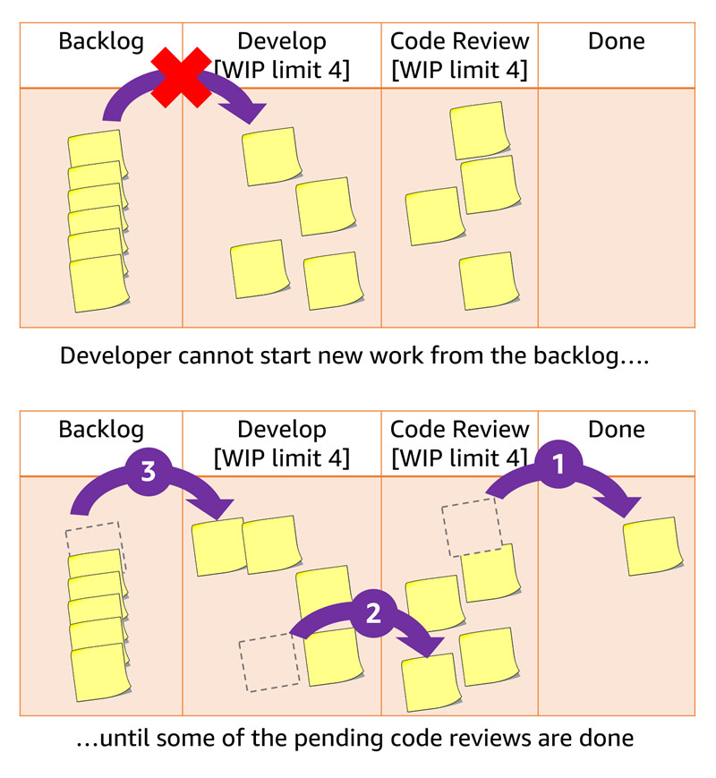
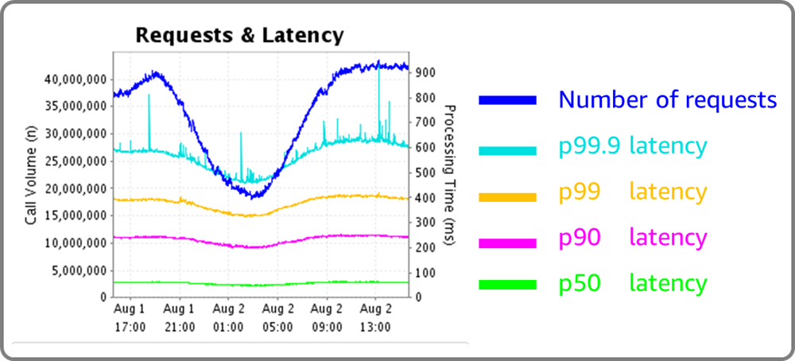
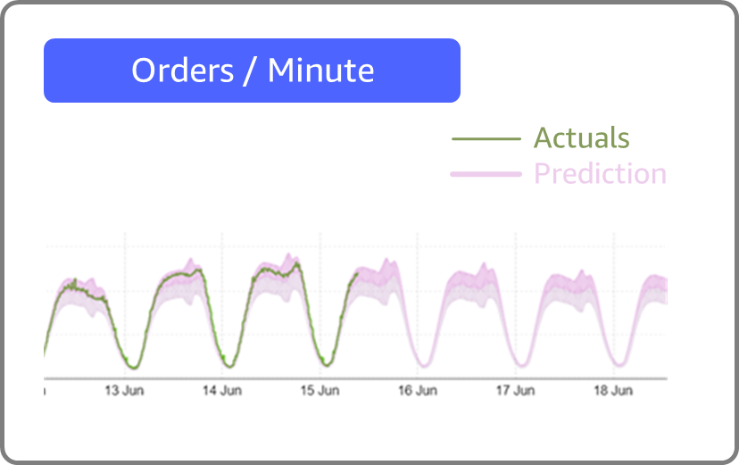

## Walls

### The question

Our development team owns the design and implementation of an application, while our operations team is separate, and owns deployment to production and running it there. Handoff from development to operations is often insufficient to inform the operations team of everything they needed to know. When operations integrates the systems into production, there are often unanticipated problems.

How do we break down walls between development and operations?

, production on the right, operations team hiding somewhere on the right... possibly behind target") 
Figure 1. Development team on the left (overdressed for launch day), production on the right, operations team hiding somewhere on the right... possibly behind target

### The answer

We’ve decided to rename the "operations" team to be a "DevOps" team and make all the members of that team DevOps engineers. They do the same job as before, but now they do it as DevOps!

### Why that’s wrong

Yes, folks taking on DevOps engineering roles is a good thing. But these DevOps engineers aren't your grandparents' operations team. They don't take a hand-off from developers and run the application in production for the them. Instead, they work with developers to create and design systems and processes that enable those developers to own their application from implementation all the way to running in production. A DevOps engineer may help implement CI/CD pipelines, create infrastructure as code templates for developers to use to stand up cloud resources, or implement observability and monitoring systems so developers have awareness of what their applications (and the users of those applications) are doing in production.

 

## Velocity

### The question

It takes too long to deliver products and features for those products. From the time we learn a feature is needed by users, to the time that feature is delivered, is way too long.

How can we deliver customer value faster?

### The answer

Just go faster. Don’t you know what “faster” means?

Work harder and get that code delivered!

Skip the code review. Not only do code reviews take time to do, it take forever to find someone on the team to do one. Why review code that is already written, when you can be coding and releasing new features?

And while we’re at it, take it easy testing by developers. Instead, hand it off to the test team. Customers do not care about your unit test coverage, they care about features. Let the test team do their thing, and you do yours... write code.

 
Figure 2. I asked for that new feature this morning. Can’t you just use Kubernetes or something?

### Why that’s wrong

Jeff Bezos famously said you cannot just ask folks to try better (or in this case just go faster). Good intentions do not work because people already have good intentions. Instead we can look at [mechanisms](https://docs.aws.amazon.com/wellarchitected/latest/operational-readiness-reviews/building-mechanisms.html)using processes and tools to release sooner.

Code review and testing are both important mechanisms to identify problems early, and fix them. The earlier we find and fix problems, the less expensive (in both monetary cost, and cost to customer trust) they are. For code review consider using automation to help. [Amazon CodeGuru Reviewer](https://docs.aws.amazon.com/codeguru/latest/reviewer-ug/welcome.html) uses machine learning and automated reasoning to identify critical issues, security vulnerabilities, and hard-to-find bugs during application development and provides recommendations to improve code quality. You can get hands-on with the CodeGuru in the[Amazon Code Guru Workshop here](https://catalog.us-east-1.prod.workshops.aws/workshops/1786241d-967f-4195-99ef-5716ef485201/en-US). But you also need a human reviewer too - the machines are not quite ready to replace us yet. One process to encourage folks to do code reviews instead of coding new features is using a WIP (Work in Process) limits. This concept, [taken from Kanban](http://www.setheliot.com/blog/2016/07/20/how-wip-limits-work-to-help-you-get-more-stuff-done/), limits how much new work can be started until existing work is done, where “done” *includes* code review. This is shown in figure 3, where each yellow note represents a coding task. Developers cannot take new work (and exceed the “Develop” WIP limit of 4) until some code reviews are completed.

 
Figure 3. Limiting WIP can streamline throughput, and incentivizes code reviews.

And continuing to explore how to find problems early, a good test suite will be your best friend. Automate it as part of your CI/CD pipeline, and ensure it is high quality (not brittle or noisy). Treat test code as your treat production code (yes, including code reviews). Include [load testing](https://docs.aws.amazon.com/prescriptive-guidance/latest/load-testing/welcome.html) and [chaos engineering](https://aws.amazon.com/blogs/architecture/verify-the-resilience-of-your-workloads-using-chaos-engineering/) to test non-functional requirements like scalability and resilience.

 

## Agility

### The question

First we get requirements from customers and stakeholders, then we create a design that delivers those, and finally we implement that design. But at the end we find it does not work like we think it would. And the customers and stakeholders change what they want along the way, which is not what they asked for in the first place. In the end, the customer is unhappy and we are stressed.

How can we respond to changing requirements and still deliver value on a predictable schedule?

### The answer

Hold the line. Get all the requirements in writing at the start, and don’t budge an inch. If you give them an inch, next they’ll want a kilometer! At the end release it all at once - that is the time to learn if all your integrations work. If the customer does not like what you released, then time to create the next version. Job security guaranteed.

Or.....

The customer is always right!  Give them everything they want, when they ask for it. If it is top of mind to them, then it is number one priority for you. You won’t deliver anything valuable remotely close to your timetable, but then that’s what follow-on contracts are for. Job security still guaranteed.

### Why that’s wrong

The [tenets of agile software](https://agilemanifesto.org/) are actually quite simple, although implementation takes effort and practice. They value collaborating with customers by producing working software they can see and use, and then iterating on that.

With DevOps, teams [break their work down into smaller chunks and approach product delivery collaboratively](https://www.buildon.aws/concepts/devops-essentials/), with a holistic view of the product, enabling better team transparency and quicker, more reliable deployments. By doing this you learn as you develop what works and what does not, testing each release. Using continuous integration and continuous delivery (CI/CD), you integrate with other systems as new functionality is added, instead of as a big-bang at the end of a long release. You also create working software that you can share (demo or beta) with customers and stakeholders to get feedback. As customers and stakeholders give feedback and request changes to requirements, you add these to a backlog along with all the other remaining tasks to be done. By prioritizing these new asks along with the old, you can see clearly what is left to be developed, and the timeline be which requirements will, and won’t be, done. A prioritized backlog makes it highly visible what will be delivered, and the trade-offs you make when new requirements are moved to the top of the stack. At all points, the engineering team is learning, and there will be no surprises as delivery dates approach. And yes, I said “dates” plural, because the team will continue to use feedback from real customers in production to iteratively improve the application.

 

## Undifferentiated heavy lifting 

### The question

When launching an application, there is lots of work required that is not actual development. Our developers do not want to deal with this overhead, they just want to design and code.

How can our development teams reduce overhead and focus on value adding activities?

### The answer

This one’s easy. The development team does not want to do it — that’s why we have a DevOps team! No task is too big or too small. The DevOps team will run their scripts and their infrastructure as code templates and get it done. Need a Kubernetes cluster? File a ticket to DevOps. Need to change the policy on an IAM role? Drop a message on the DevOps Slack channel.

Figure 4. A DevOps engineer works through his ticket backlog (again overdressed — shirt and tie not necessary)

### Why that’s wrong

Folks don’t like waiting on a ticket to be serviced. And folks like it even less when they have an insurmountable stream of “muck” work thrown at them. DevOps is about collaboration, not throwing it over the wall (see Figure 1).
 
A DevOps team can play a key role in creating and maintaining scripts. They can create infrastructure as code templates that are vetted to be compliant with business security and architectural policies. They can create systems that make it easy to find and deploy these templates to stand up cloud infrastructure (like the aforementioned Kubernetes cluster). They do this working with Developers and others as stakeholders. Then the developers use these scripts and infrastructure deployment processes elf-service to stand up what they need. For their part, the DevOps team focuses on removing or automating repetitive or low-value tasks. They then have more time to spend focusing on innovating and enhancing technology quality, without having to take on menial tasks
 
The line for what is self-service (using DevOps created tools) and what is done by DevOps depends on the organization. Above I describe an organization where development is almost completely self-service, but with guardrails to help developers maintain compliance with policies. In other cases DevOps may stamp out landing zones in AWS accounts, that Developers can then deploy infrastructure to (using the template library). In some organizations, they prefer security (such as IAM roles) to be a centralized function. What makes it DevOps is a culture of collaboration and ownership.

 

## Visibility

### The question

Production is a turbulent place, and we’ve just deployed our application there. Our customers expect it to be reliable, performant, and secure.

When our application is running in production, how do we know it is working as it should?

### The answer

First of all, the development team lead verified it worked on her machine. Now its in production and we have other teams for that!  The DevOps team deploys it and runs it. Customer service takes the calls from frustrated users and files the bugs. And the support engineers investigate the bugs and fix some of them, and file tickets to the development team for the others. The bugs gets fixed and everyone is happy.

### Why that’s wrong

Remember that the earlier we find and fix problems, the better. Bugs happen, that is the truth of software engineering. But letting customers find our bugs is a miss, and in some cases can carry severe consequences.

Monitoring with alarming will enable you to understand what is happening in production, and find and fix issues before they can impact users. This, combined with logging and tracing is called [observability,](https://catalog.workshops.aws/observability/en-US/intro) and it will enable you to understand how and why things happened, and design long term fixes.

Monitoring should occur at several levels. At the lower levels metrics like CPU utilization, and disk I/O will enable you to spot problems with design or the runtime environment, that can potentially impact the smooth operation of your application. At a service level you should define one or more Service Level Indicators (SLI) like latency or error rate that give you a view as to the health of an individual service. And at the application level (where your customers interact) you should define a Key Performance Indicator (KPI) that provides a measure for what your customers are experiencing. For example an online retailer might use order rate, where an anomalous drop indicates customers are not able to use the site to place orders.

A DevOps team organizes their tools and processes around such measures so as to find and fix problems early

Figure 5. Requests and latency on a service API. Latency is a good SLI, and is measured at various percentiles.

Figure 6. Order rate -- a good KPI for an online retailer. When orders drop below predicted values, it indicates a serious problem with customer experience on the site.

While we do not want to use our customers as front line “monitoring”, we still want to listen to their needs and add requirements to the backlog for future releases to meet those needs. Tracing and instrumentation can be used to gather objective data on how customers use your application. Also, user studies, beta releases, surveys, and social media sentiment analysis are ways to gather subjective data from your customers.

 

## Conclusion

To help you learn DevOps I have posed questions and then pretended to answer them using ridiculous answers so absurd that no one would ever believe that anyone would actually do it that way. But.... all of us have had managers give us similar answers — and if you haven't, just wait around the industry for a few more years. DevOps really can help, though, offering a culture of collaboration and continuous improvement to create quality software. And there are plenty of thoughtful, effective managers who do work with their teams to grow a DevOps culture.

If you want to learn more check out these resources:

* [DevOps Essentials: An essential guide for learning about DevOps and its core concepts](https://www.buildon.aws/concepts/devops-essentials/)
* [Big Trucks, Jackie Chan movies, and millions of cardboard boxes: How Amazon Does DevOps in Real Life](https://www.buildon.aws/posts/how-amazon-does-devops-in-real-life/)
* [AWS re:Invent 2022 - AWS Well-Architected best practices for DevOps on AWS (DOP207)](https://www.youtube.com/watch?v=hfXokRAyorA)
