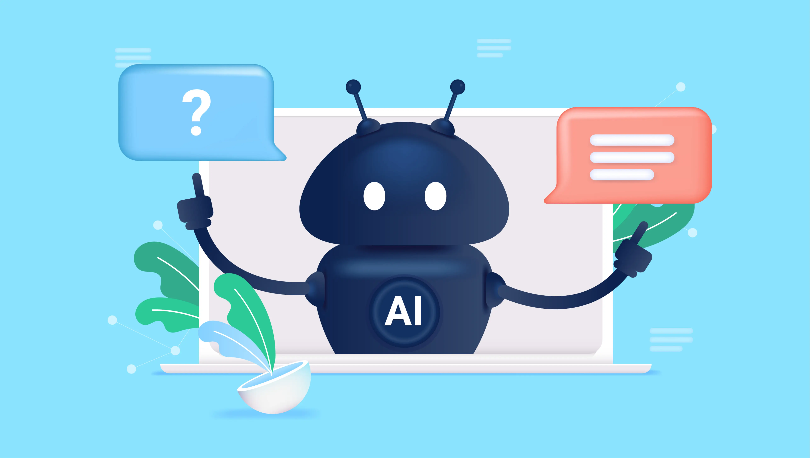
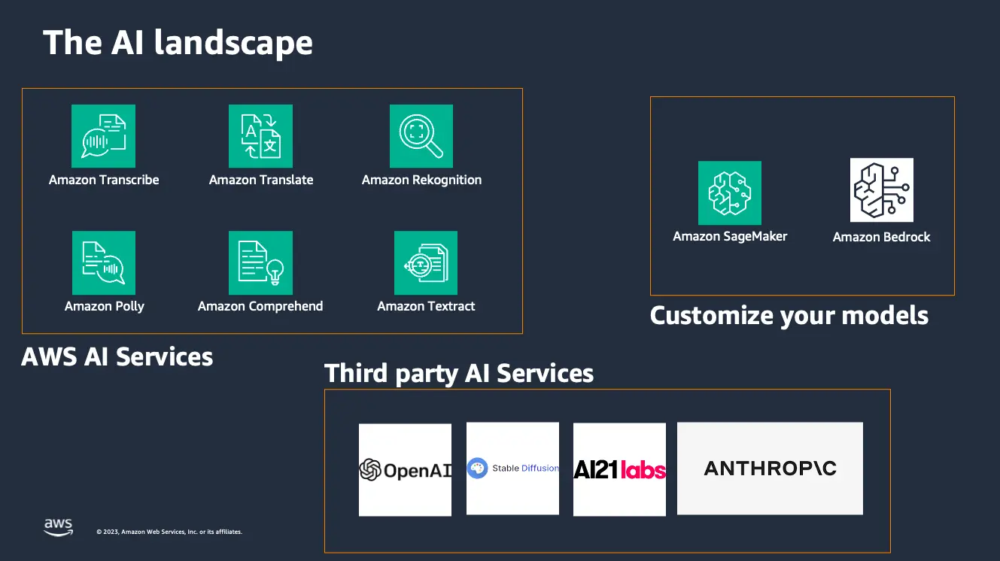
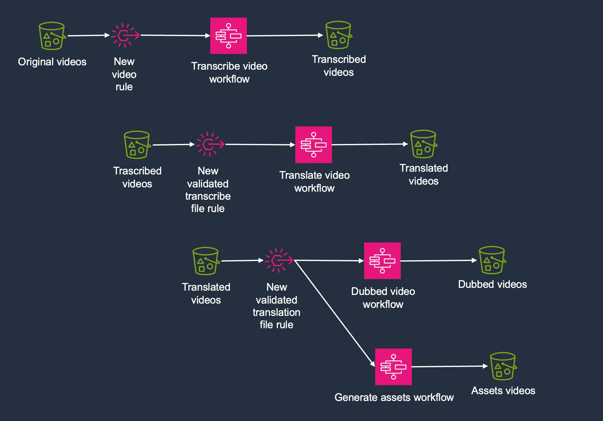
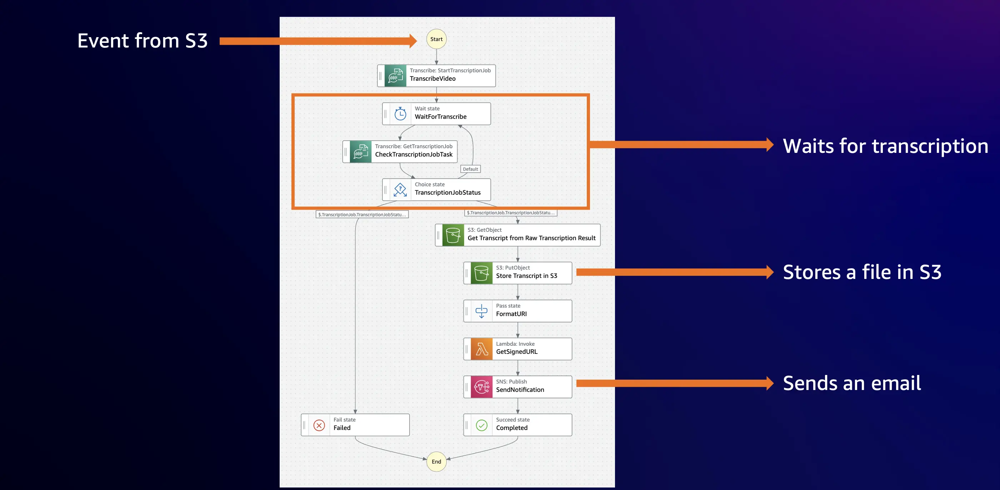
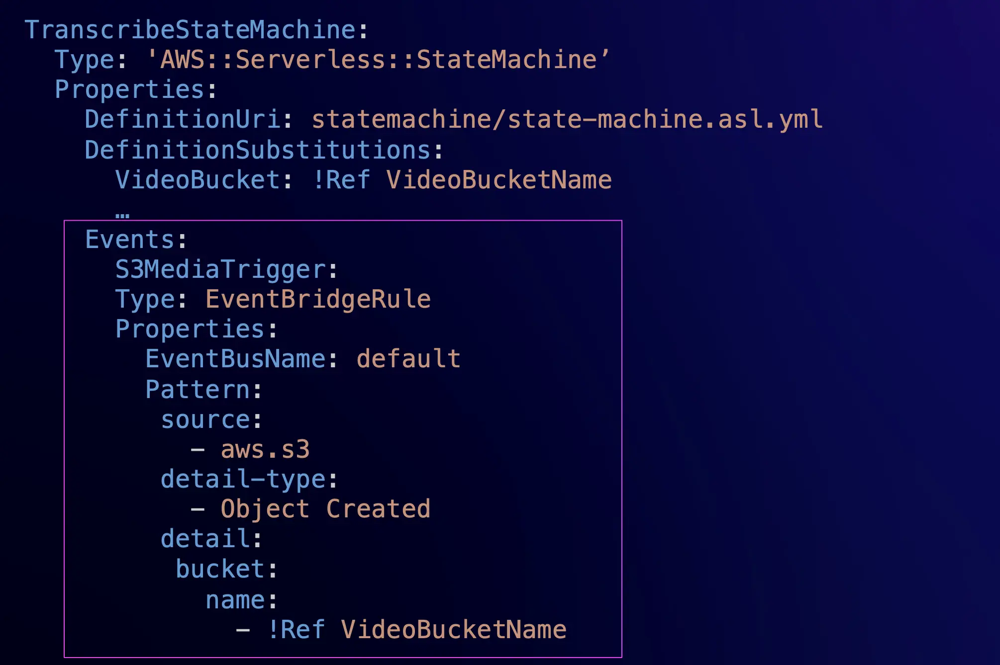
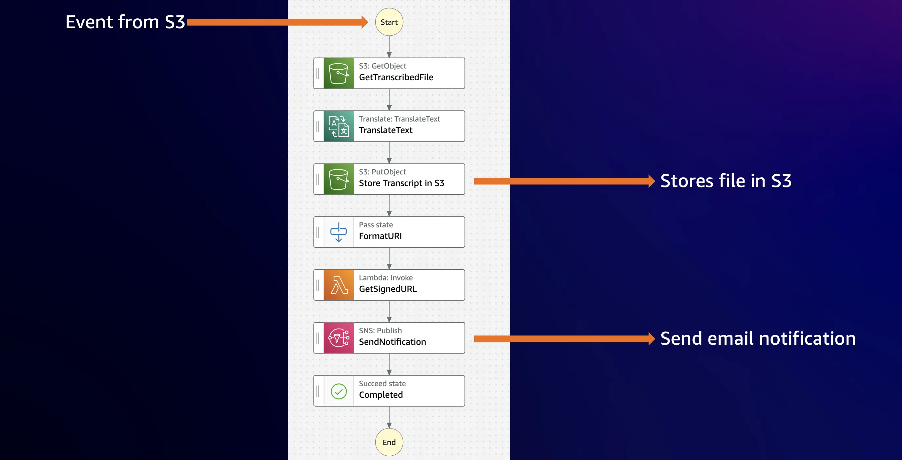
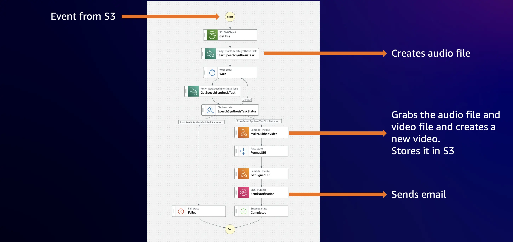
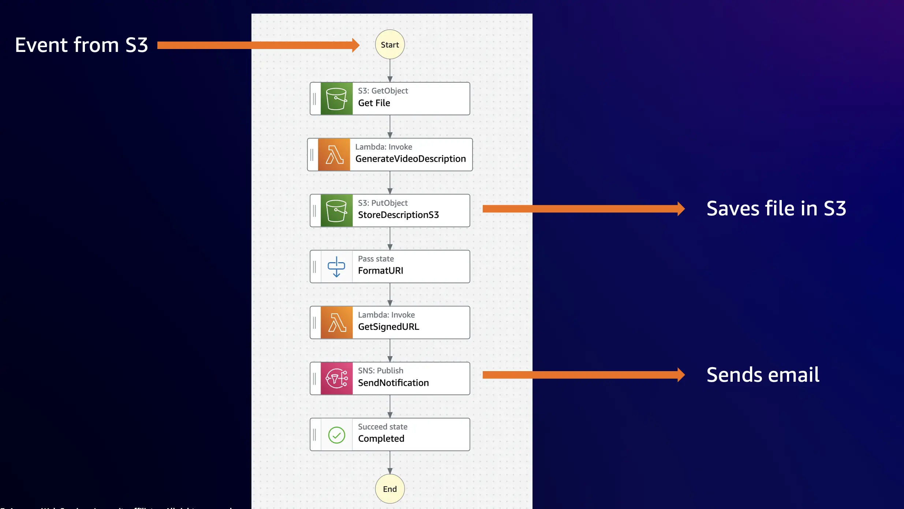

Twenty years into working as a software developer, the rise of AI — and the headlines about how it might transform the role of the developer — made me anxious. I didn’t want to transition into a machine learning role; I didn’t want to learn how to tune models or build them, how to clean data. I love to build applications!

Don’t get me wrong: I was happy to use AI-based developer tools to improve my productivity as a developer. These tools enable greater efficiency, just like the higher level programming languages that developers began to prefer to machine level programming languages like Assembler. Using [Amazon CodeWhisperer](https://docs.aws.amazon.com/codewhisperer/?sc_channel=el&sc_campaign=reinvent&sc_geo=mult&sc_country=mult&sc_outcome=acq&sc_content=dub-videos-using-generative-ai), for example, made me 50% more productive, as now I no longer needed to leave the IDE to find answers to my coding questions.

But I didn't want my job as a developer to disappear.

As I thought about AI more, though, I realized the opportunity it presents to developers: in this new world, we will need applications that solve new problems. As developers, we are going to get a lot of requests in the future to build apps that can recognize objects in images, that can understand and process natural language, that can create text, music or images, that can make recommendations based on data, that can answer questions, and many other things.

This new technology can feel overwhelming, so as an experiment, I decided to build an application with it — an application that dubs videos from English to Spanish using AI APIs. I learned a lot along the way.

## A Quick Overview of the AI Service Landscape

Before I started building the application, I wanted to understand the kinds of tools that help build AI applications, and there are a surprising number of options in the AI landscape today. AWS, for example, offers many AI managed services, like [Amazon Transcribe](https://docs.aws.amazon.com/transcribe/?sc_channel=el&sc_campaign=reinvent&sc_geo=mult&sc_country=mult&sc_outcome=acq&sc_content=dub-videos-using-generative-ai), [Amazon Translate](https://docs.aws.amazon.com/translate/?sc_channel=el&sc_campaign=reinvent&sc_geo=mult&sc_country=mult&sc_outcome=acq&sc_content=dub-videos-using-generative-ai), [Amazon Rekogniton](https://docs.aws.amazon.com/rekognition/?sc_channel=el&sc_campaign=reinvent&sc_geo=mult&sc_country=mult&sc_outcome=acq&sc_content=dub-videos-using-generative-ai), [Amazon Polly](https://docs.aws.amazon.com/polly/?sc_channel=el&sc_campaign=reinvent&sc_geo=mult&sc_country=mult&sc_outcome=acq&sc_content=dub-videos-using-generative-ai) — to generate audio from text, [Amazon Textract](https://docs.aws.amazon.com/textract/?sc_channel=el&sc_campaign=reinvent&sc_geo=mult&sc_country=mult&sc_outcome=acq&sc_content=dub-videos-using-generative-ai), and [Amazon Comprehend](https://docs.aws.amazon.com/comprehend/?sc_channel=el&sc_campaign=reinvent&sc_geo=mult&sc_country=mult&sc_outcome=acq&sc_content=dub-videos-using-generative-ai). In addition, if you are working in a bigger org with an ML team, you can take advantage of the custom-made solutions built in Amazon SageMaker. For a lot of the problems that require Generative AI, AWS offers [Amazon Bedrock](https://docs.aws.amazon.com/bedrock/?sc_channel=el&sc_campaign=reinvent&sc_geo=mult&sc_country=mult&sc_outcome=acq&sc_content=dub-videos-using-generative-ai). 

Amazon Bedrock is a fully managed service that makes Foundational Models (FMs) from leading AI startups and Amazon available via an API, so you can choose from a wide range of FMs to find the model that is best suited for your use case. It is the easiest way to build and scale generative AI applications with FMs. When using Bedrock, you can choose your FM from: Jurassic 2 from AI21 Labs, Claude form Anthropic, Stable Diffusion from Stability AI and Titan and Titan Embeddings from Amazon.

And finally in the AI Landscape we can find all the APIs third party companies offer that provides different models and solutions for specific problems. 



After analyzing the AI landscape, my first realization was that you mostly just need to know how to call an endpoint. But calling some of these endpoints isn’t as simple as using a REST API. For the Generative AI ones, you need to define a prompt.

That’s another skill to learn: prompt engineering helps you to write prompts to the generative AI endpoints to request the right data. Generative AI endpoints don’t return the same response twice, and fine tuning the prompt to consistently get the right answer in the right format is a critical skill.

Another important skill is how to orchestrate and choreograph the endpoint calling. Usually calling one service is not enough to solve a problem; you need to call 2, 3, or more services and transform the data in between to obtain the expected result. So learning patterns that help you to solve this problem is handy. 

With those basic skills in mind, here’s how I got started building my application.

## Automatic Video Dubbing Using AI

In our everyday work as developer advocates, my colleagues and I create a lot of videos. However, I’m the only Spanish speaker on my team and I want to share as much information as I can with my Spanish community as possible. But I don’t have the time to record all my videos both in English and in Spanish. So I thought, why not use AI to solve this problem?

The idea is this: a video in English is uploaded to an Amazon S3 bucket, and then automatically it gets dubbed into Spanish and the title, description, and tags for YouTube all get created in Spanish based on the content of the video. And when everything is ready, I receive an email with all the assets.  


This sounds like a great idea, but after trying this for a while, I realized that this process needed some validations in the middle in order to ensure really good results. Let’s see how this is built using AWS serverless services.

But first you can take a look at this video that should be the solution to the problem.

https://www.youtube.com/watch?v=fwzeNBHMvxI

### High Level Architecture

For solving this problem I created 4 state machines using AWS Step Functions. Each state machine solves a specific problem to solve the problem and allows a human to get in the middle of the process to do the validation of the generated assets.



Each state machine is triggered when there is a new file in an [Amazon S3](https://docs.aws.amazon.com/s3/?sc_channel=el&sc_campaign=reinvent&sc_geo=mult&sc_country=mult&sc_outcome=acq&sc_content=dub-videos-using-generative-ai) bucket using an [Amazon EventBridge](https://docs.aws.amazon.com/eventbridge/?sc_channel=el&sc_campaign=reinvent&sc_geo=mult&sc_country=mult&sc_outcome=acq&sc_content=dub-videos-using-generative-ai) rule, and the state machine stores a file in another S3 bucket and sends an email that the process was completed with a link to the object in S3.

This solution is based on the orchestration and choreography patterns. Orchestration is a pattern that helps you to organize tasks that need to execute in a strict order, and you need to have full control on what is going on in the process, you need to know the state for that process all the time. In orchestration solutions, there is a main component that is overseeing the process and controlling the state. To implement this pattern in AWS, one simple solution is to use AWS Step Functions. 

AWS Step Functions is a fully managed service that offers managed state machines. A state machine is a set of discrete computational steps, each step with a defined input and output. The state machine has transitions that are defined based on the data or based in logic built in the state machine. 

When using Step Functions you don’t need to write almost any code, as it supports direct integration with over 200 AWS services. And when these state machines run, you can get a detailed view of each of the inputs and outputs of each state for each execution of the state machine. 

Let’s look a bit more in detail at each of the state machines and check how they are built.

### Transcribe State Machine

The first state machine to run is the one that is in charge of transcribing the original video. This state machine, as the others, gets triggered when there is a new file in an S3 bucket. Then it calls Amazon Transcribe, an AI service that will do the transcription for us. This process is asynchronous, so we add a wait loop in the state machine to wait for the transcription to complete. 

When the transcription is ready, the file gets stored in the correct format in S3 and an email is sent to the end user, to get the validation. Amazon Transcribe is a great service, but in order to get the best end result possible, having a human validate the transcription is very important. 



A couple of things you can see in this state machine that you will also see in the other state machines. 

1. **The state machine is triggered by an event.** It is very simple to define that using EventBridge rules when you create the state machine. Here you can see an example using AWS SAM.



2. **Most of the logic of this state machine is by calling the AWS Services directly**. This is done by using the direct integration that AWS Step Functions provides with over 200 services. In the following example, you can see how you can start a transcription job directly from the state machine, and you can pass all the parameters. This example is written with Amazon State Language (ASL), the language you use to define state machines. 

```json
TranscribeVideo:
    Comment: 'Given the input video starts a transcription job'
    Type: Task
    Next: WaitForTranscribe
    Resource: 'arn:aws:states:::aws-sdk:transcribe:startTranscriptionJob'
    Parameters:
      Media:
        MediaFileUri.$: States.Format('s3://{}/{}', $.detail.bucket.name, $.detail.object.key)
      TranscriptionJobName.$: $$.Execution.Name
      OutputBucketName: ${TranscribedBucket}
      OutputKey.$: States.Format('{}.txt', $.detail.object.key)
      LanguageCode: en-US
```

3. **The use of AWS Step Function intrinsic functions:** Intrinsic functions help you to perform basic data processing operations without using a task. You can manipulate arrays, strings, hashes, create unique IDs, base64 decode or encode, and many other operations directly from the state machine. Whenever you see the `States.XXX`, this means that an intrinsic function is being used. The following example uses intrinsic functions two times nested, when creating the key for the object to store in S3, it first splits a string (`States.StringSplit`) and then it gets the element in the third place (`States.ArrayGetItem`).

```json
Store Transcript in S3:
    Type: Task
    Next: FormatURI
    Resource: arn:aws:states:::aws-sdk:s3:putObject
    ResultPath: $.result
    Parameters:
      Bucket: ${TranscribedBucket}
      Key.$: States.ArrayGetItem(States.StringSplit($.TranscriptionJob.Transcript.TranscriptFileUri, '/'),3)
      Body.$: $.transcription.filecontent.results.transcripts[0].transcript
```

### Translate State Machine

When the end user uploads a validated transcription file to an S3 bucket, then the second state machine starts. This is the translation state machine. This state machine is very similar to the previous one, but instead of calling Amazon Transcribe, it calls Amazon Translate. The call here is synchronous, which is why the response comes right away to the next step. 

You can see in this state machine that there are some components that are being re-utilized, like the SNS topic and the Lambda function that signs the S3 URL.



When this state machine completes, it uploads a translated file to S3 and sends an email to the user to validate the translation.

### Dubbing the Video

When the user uploads a validated translation, two state machines will get triggered at the same time. One is the state machine that dubs the video, and the other generates the title, description, and tags. The state machine that dubs the videos looks very similar to the previous state machines; the differences are, first, that it calls asynchronously Amazon Polly to transform the translated text file into audio, and second, that it calls an AWS Lambda function that will replace the audio track of the original video with the new translated one. 



This Lambda function uses a library called [ffmpeg](https://ffmpeg.org/) to achieve this. And it's one of the few functions that you will find in the project. This function takes care of replacing the original audio of the video with the new translated audio from Polly and storing it in S3. 

### Generating the Assets 

The last state machine is the one that generates the titles, descriptions, and tags of the video. This state machine looks similar to the previous one, but the Lambda function that it contains calls Amazon Bedrock.



Using Amazon Bedrock is one of the easiest ways to build and scale generative AI applications using foundational models. This Lambda function uses the AWS SDK to call Bedrock and to generate the assets needed to upload this video to social media. 

Using Bedrock from a Lambda function is very simple. The first step is to give permissions to the function to access Bedrock. You can see how the function is defined using AWS SAM.

```json
GenerateVideoMetadataFunction:
    Type: AWS::Serverless::Function
    Properties:
      CodeUri: src/
      Handler: index.lambda_handler
      Runtime: python3.9
      MemorySize: 128
      Timeout: 600
      Policies:
        - Statement:
            - Effect: Allow
              Action: 'bedrock:*'
              Resource: '*'
```

Then you can write the function code. This particular function takes as an input the translated transcription of the video, and returns the title, description, and tags based on that information. This function is using the foundational model from AI21 Jurassic Ultra. 

```python
import boto3
import json
import os 

bedrock = boto3.client(service_name='bedrock-runtime')

def lambda_handler(event, context):

    key = event['detail']['object']['key']    
    key = key.split('/')[1]

    prompt="Given the transcript provided at the end of the prompt, return a JSON object with the following properties: description, titles, and tags. For the description write a compelling description for a YouTube video, that is maximum two paragraphs long and has good SEO. Don't focus on the person who is mentioned in the video, just focus on the content of the video. The description should be in the same language as the video. For the title, return an array of 5 different title options for this video. For the tags, provide an array of 20 tags for the video. Here is the transcript of the video: {}".format(event['body']['filecontent'])

    body = json.dumps({
        "prompt": prompt,
        "maxTokens": 1525,
        "temperature": 0.7,
        "topP": 1,
        "stopSequences":[],
        "countPenalty":{"scale":0},
        "presencePenalty":{"scale":0},
        "frequencyPenalty":{"scale":0}})
    modelId = 'ai21.j2-ultra-v1'
    accept = 'application/json'
    contentType = 'application/json'

    response = bedrock.invoke_model(body=body, modelId=modelId, accept=accept, contentType=contentType)

    response_body = json.loads(response.get('body').read())
    
    description = json.dumps(response_body.get("completions")[0].get("data").get("text"))

    result = {"key": key, 
              "description": description, 
              "region": os.environ['AWS_REGION']
              }

    return result
```

You can test the parameters and prompts for this function in the Bedrock playground, which makes it super easy to tune the amount of tokens you need, fine tune the prompt to obtain the correct result, and do any extra configuration you need in the call. 

After you have the right settings in the Bedrock playground, you can click the “View API request” button and you will get all the parameters you will need to configure in your API call when writing your function.

https://www.youtube.com/watch?v=w2AHOEnhUeE

## Conclusion

At the end of the day, even the most advanced AI tools are just endpoints. This mindset helped me build an incredibly useful application — not as a ML engineer, but as a software developer!

After this experiment, I’m less afraid of the future that AI brings to developers, as these new AI services are just tools to build applications. One interesting thing I noticed is if you provide longer or overly complicated prompts to a generative AI model the results are not great. Therefore when you use gen AI, you need to make a very clear prompt and that can be used for a specific task. This means that you need to split that long prompt into shorter ones and then chain the results toghether to get best results - a process called prompt chaining. For prompt chainin,g the orchestration pattern and Step Functions are very useful. 

You can find the code for this application in GitHub and more information regarding building applications with AI [here](https://s12d.com/serverlessAI).
