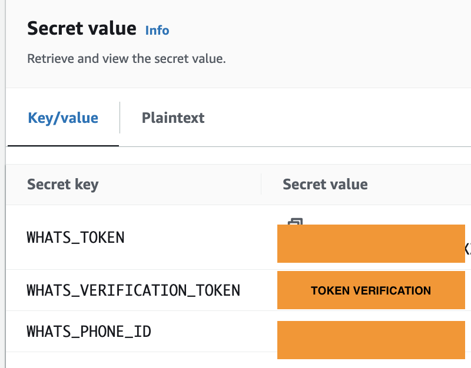

|ToC|
|---|

What was an exciting trip to Las Vegas for a presentation as speaker on re:Invent 2023 turned into an unexpected journey to an unknown destination. A booking mishap resulted in the speaker gaining an airline ticket to Las Vegas, New Mexico instead of the well-known Las Vegas. This hilarious error set the stage for investigating how advanced technologies like generative AI and [Retrieval Augmented Generation(RAG)](https://aws.amazon.com/what-is/retrieval-augmented-generation/) can revolutionize traditional support channel models, turning a complicated ticket change into a quick solution through fluid conversation.

This blog will guide you through building a Whatsapp Travel Assistant Application that uses an LLM assistant. It can understand and communicate in multiple languages, both written and spoken, with the goal of providing self-service assistance through natural conversations and remembering previous interactions to solve [common travel issues](https://github.com/build-on-aws/elevating-customer-support-with-rag-langchain-agent-bedrock-dynamodb-and-kendra/blob/main/customer-support-bot/airline-qa-base). Capable of checking the status of passenger flights, as well as the data related to their trip, using your reservation number or passenger identification. 

> ✅ The Whatsapp Travel Assistant Application is ready to deploy using [AWS Cloud Development Kit](https://aws.amazon.com/cdk). Find the code in [Elevating Customer Support With Rag Langchain Agent Bedrock Dynamodb And Kendra](https://github.com/build-on-aws/elevating-customer-support-with-rag-langchain-agent-bedrock-dynamodb-and-kendra)
github repo.

## How The Travel Assistant Work? 

To show how the travel assistant works, let's break it down into three main blocks:


### 1. Message Input and Initial Processing:


A user sends either a text or voice message via WhatsApp, the message hits the [Amazon API Gateway](https://aws.amazon.com/api-gateway/), then a [whastapp_in](https://github.com/build-on-aws/elevating-customer-support-with-rag-langchain-agent-bedrock-dynamodb-and-kendra/blob/main/customer-support-bot/lambdas/code/whatsapp_in/lambda_function.py) [Amazon Lambda Function](https://aws.amazon.com/lambda/) is executed to process new WhatsApp messages, extract relevant details, and write them in [Amazon DynamoDB Streams](https://docs.aws.amazon.com/amazondynamodb/latest/developerguide/Streams.html).


### 2. Message Processing Based on Format:


The [process_stream](https://github.com/build-on-aws/elevating-customer-support-with-rag-langchain-agent-bedrock-dynamodb-and-kendra/blob/main/customer-support-bot/lambdas/code/process_stream/lambda_function.py) [ Lambda Function is trigger by events in DynamoDB Streams](https://docs.aws.amazon.com/amazondynamodb/latest/developerguide/Streams.Lambda.html)  and identify the format of the message (text or audio):

- *If Message is Text Format:*
a Lambda Function named [API_bedrock_agents](https://github.com/build-on-aws/elevating-customer-support-with-rag-langchain-agent-bedrock-dynamodb-and-kendra/blob/main/customer-support-bot/lambdas/code/langchain_agent_text/lambda_function.py) is triggered, the heart and brain of the Travel Assistant. We’ll explain it later. 
- *If Message is Audio Format:* The [star_transcibe_job](https://github.com/build-on-aws/elevating-customer-support-with-rag-langchain-agent-bedrock-dynamodb-and-kendra/blob/main/customer-support-bot/lambdas/code/audio_job_transcriptor/lambda_function.py) Lambda Function is triggered. This Lambda Function downloads the WhatsApp audio from the link in the message in an [Amazon S3 bucket](https://aws.amazon.com/s3/), using authentication, then converts the audio to text using the Amazon Transcribe [start_transcription_job](https://boto3.amazonaws.com/v1/documentation/api/latest/reference/services/transcribe/client/start_transcription_job.html) API, which leaves the transcript file in an Output [Amazon S3 bucket](https://aws.amazon.com/s3/). 

Function that invokes `start_transcription_jobb` looks like this:

```
def start_job_transciptor (jobName,s3Path_in,OutputKey,codec):
    response = transcribe_client.start_transcription_job(
            TranscriptionJobName=jobName,
            IdentifyLanguage=True,
            MediaFormat=codec,
            Media={
            'MediaFileUri': s3Path_in
            },
            OutputBucketName = BucketName,
            OutputKey=OutputKey 
            )
```

> **Note**: Notice that the [IdentifyLanguage](https://docs.aws.amazon.com/transcribe/latest/dg/lang-id.html) parameter is configured to True. Amazon Transcribe can determine the primary language in the audio. 

The transcribe_done Lambda Function is triggered once the Transcribe Job is complete. It extracts the transcript from the Output S3 bucket and sends it to the agent.

### 3. LLM Processing and Response:

Here we explain the heart ❤️  and brain 🧠 of the Travel Assistant.

The Travel Assistant is managed by a [Langchain Agent](https://python.langchain.com/docs/modules/agents/), a framework for developing LLM applications, who uses the [Amazon Bedrock](https://aws.amazon.com/bedrock/) API to understand and respond through natural language by invoking a [foundational models](https://community.aws/posts/how-to-choose-your-llm). This Travel Assistant employs [Anthropic Claude](https://aws.amazon.com/bedrock/claude/), from which the assistant gains multilingual capabilities. 

By using [Retrieval Augmented Generation (RAG)](https://docs.aws.amazon.com/sagemaker/latest/dg/jumpstart-foundation-models-customize-rag.html), the assistant can extract passenger details from an [Amazon DynamoDB](https://aws.amazon.com/dynamodb/) table and answer questions about how to resolve specific cases to a knowledge base in [Amazon Kendra](https://aws.amazon.com/kendra/).

In order to have seamless conversations that [recall past messages](https://community.aws/posts/working-with-your-live-data-using-langchain), we use the [Langchain feature for memory management](https://python.langchain.com/docs/modules/memory/types/). This feature stores conversation content in a DynamoDB Table called *SessionTable*. To handle session duration, we use a DynamoDB table named  *user_metadata*, this table stores the user’s metadata and session start, which is queried and compared with a define max session duration during each interaction. Change session duration [here](https://github.com/build-on-aws/elevating-customer-support-with-rag-langchain-agent-bedrock-dynamodb-and-kendra/blob/main/customer-support-bot/lambdas/code/langchain_agent_text/lambda_function.py). 

>📚 **Tip:** [Kenton Blacutt](https://github.com/KBB99), an AWS Associate Cloud App Developer, collaborated with Langchain, creating the [Amazon Dynamodb based memory class](https://github.com/langchain-ai/langchain/pull/1058) that allows us to store the history of a langchain agent in an [Amazon DynamoDB](https://docs.aws.amazon.com/amazondynamodb/latest/developerguide/Introduction.html?sc_channel=el&sc_campaign=genaiwave&sc_content=working-with-your-live-data-using-langchain&sc_geo=mult&sc_country=mult&sc_outcome=acq).


The query_table_passanger lambda function is invoked by the agent when it needs to know the passenger's information or query user_metadata in DynamoDB table.

When the agent finishes assembling the response, they respond to Whatapp through the [whatsapp_out](https://github.com/build-on-aws/elevating-customer-support-with-rag-langchain-agent-bedrock-dynamodb-and-kendra/blob/main/customer-support-bot/lambdas/code/whatsapp_out/lambda_function.py) Lambda Function. 

## Let's Build The Travel Assistant


### Step 0: Activate WhatsApp account Facebook Developers

1- [Get Started with the New WhatsApp Business Platform](https://www.youtube.com/watch?v=CEt_KMMv3V8&list=PLX_K_BlBdZKi4GOFmJ9_67og7pMzm2vXH&index=2&t=17s&pp=gAQBiAQB)

2- [How To Generate a Permanent Access Token — WhatsApp API](https://www.youtube.com/watch?v=LmoiCMJJ6S4&list=PLX_K_BlBdZKi4GOFmJ9_67og7pMzm2vXH&index=1&t=158s&pp=gAQBiAQB)

3- [Get started with the Messenger API for Instagram](https://www.youtube.com/watch?v=Pi2KxYeGMXo&list=PLX_K_BlBdZKi4GOFmJ9_67og7pMzm2vXH&index=5&t=376s&pp=gAQBiAQB)

## Step 1: Previous Configuration

✅ **Clone the repo**

```
git clone https://github.com/build-on-aws/elevating-customer-support-with-rag-langchain-agent-bedrock-dynamodb-and-kendra.git
```

✅ **Go to**: 

```
cd re-invent-agent
```

✅ **Create The Virtual Environment**: by following the steps in the [README](/re-invent-agent/README.md)

```
python3 -m venv .venv
```

```
source .venv/bin/activate
```
for windows: 

```
.venv\Scripts\activate.bat
```

✅ **Install The Requirements**:

```
pip install -r requirements.txt
```

✅ **Set Values**:

In [customer_support_bot_stack.py](/customer-support-bot/customer_support_bot/customer_support_bot_stack.py) edit this line with the whatsapp Facebook Developer app number: 

`
DISPLAY_PHONE_NUMBER = 'YOU-NUMBER'
`

This agent maintains the history of the conversation, which is stored in the `session_tabble` Amazon DynamoDB table, also have control session management in the `session_active_tabble` Amazon DynamoDB table, and sets the time [here](/customer-support-bot/lambdas/code/langchain_agent_text/lambda_function.py) in this line:


`
if diferencia > 300:  #session time in seg
`

## Step 2: Deploy The App With CDK.

Follow steps [here](/customer-support-bot/README.md)

✅ **Synthesize The Cloudformation Template With The Following Command**:

```
cdk synth
```

✅🚀 **The Deployment**:

```
cdk deploy
```

✅ **Review what is deployed in the stack:** 

- Go to the [AWS Cloudformation console](console.aws.amazon.com/cloudformation), select the region where you deployed and click on `CustomerSupportBotStack`:

Then go to the resources tab and explore what's deployed:


✅ **Wait a few minutes:** 

This stack automatically creates an Amazon Kendra Index with the data source that contains the [Q&A database of the airline "La inventada"](/customer-support-bot/airline-qa-base), you must wait a few minutes for all the data to be synchronized.


## Step 3: Activate WhatsApp Messaging In The App

Go to AWS Secrets Manager and edit the WhatsApp settings and replace them with Facebook Developer settings.



## Step 4: Configure Webhook In Facebook Developer Application


## Let´s try!

✅ **Q&A:** 

You can start asking for customer service information as if it were an airline customer service line.


✅ **Passenger information:** 

The CDK stack creates the dynamoDB table named `Passenger_ID` with the [sample passenger dataset](/customer-support-bot/airline-dataset) [from Kaggle](https://www.kaggle.com/datasets/iamsouravbanerjee/airline-dataset). Select one and request information regarding it. What if I now change the language and ask the AI in Spanish?


> The multilanguage function depends on the [LLM you use](https://aws.amazon.com/bedrock/).


✅ **Send it voice notes:**  

> [Amazon Transcribe](https://docs.aws.amazon.com/transcribe/latest/dg/lang-id.html) is able to automatically identify the languages spoken in your media without you having to specify a language code.


## 🚀 Keep testing the agent, play with the prompt in this Amazon Lambda function and adjust it to your need.


## Conclusion

While the speaker's trip to the wrong city of Las Vegas began as a comedy of errors, it also highlighted an important opportunity to reimagine customer service. Whatsapp Travel Assistant is the application that the speaker imagined, an application capable of delivering a self-service experience for travelers through natural conversations. 

Whatsapp Travel Assistant can: 

- Understand conversations in any language, both written and spoken, and response in the same language.

- Query a knowledge database in Amazon Kendra and an Amazon DynamoDB Table using RAG. 

- Deliver sophisticated answers according to the query using RAG, querying knowledge databases in Amazon Kendra, and tables in Amazon DynamoDB.

- Manage conversation memory and store it in an Amazon DynamoDB table.

- Managing session time through a Amazon Dynamodb Table. 

We invite you to build this application, play with it, improve it and tell us how it went for you. 

Thanks! 🧔🏻‍♂️👩🏻

🚀 Some links for you to continue learning and building:

- [How To Choose Your LLM](https://community.aws/posts/how-to-choose-your-llm)

- [Working With Your Live Data Using LangChain](https://community.aws/posts/working-with-your-live-data-using-langchain)

- [Integrating Foundation Models into Your Code with Amazon Bedrock](https://www.youtube.com/watch?v=ab1mbj0acDo)

- [AWS Kendra LangChain Extensions](https://github.com/aws-samples/amazon-kendra-langchain-extensions/tree/main)

- [Prompt Engineering Techniques](https://www.promptingguide.ai/techniques)

- [Learn the fundamentals of generative AI for real-world applications](https://www.deeplearning.ai/courses/generative-ai-with-llms/)

- [LangChain for LLM Application Development](https://www.deeplearning.ai/short-courses/langchain-for-llm-application-development/)

- [Prompt engineering for foundation models](https://docs.aws.amazon.com/sagemaker/latest/dg/jumpstart-foundation-models-customize-prompt-engineering.html)


- [Prompt Engineering for Developers: How AI Can Help With Architecture Decisions](https://community.aws/posts/prompt-engineering-for-developers/how-ai-can-help-with-architecture-decisions)

- [Fun on a Friday with Prompt Engineering and thinking about re:Invent 2023](https://community.aws/posts/friday-fun-style-changing-reinvent-guide)
