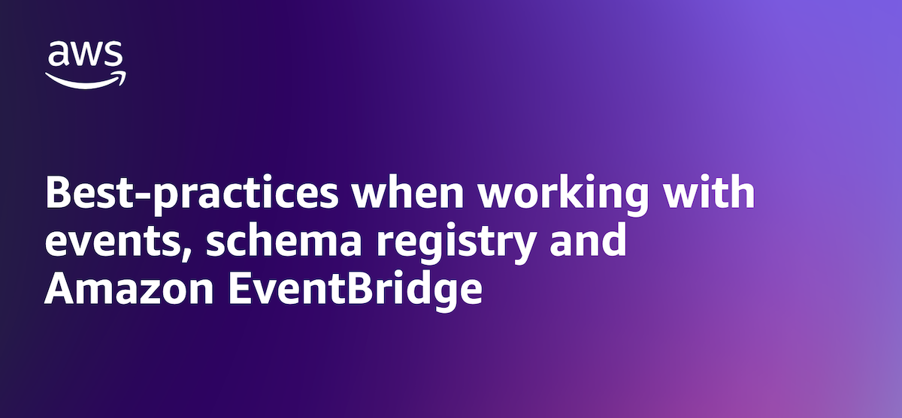
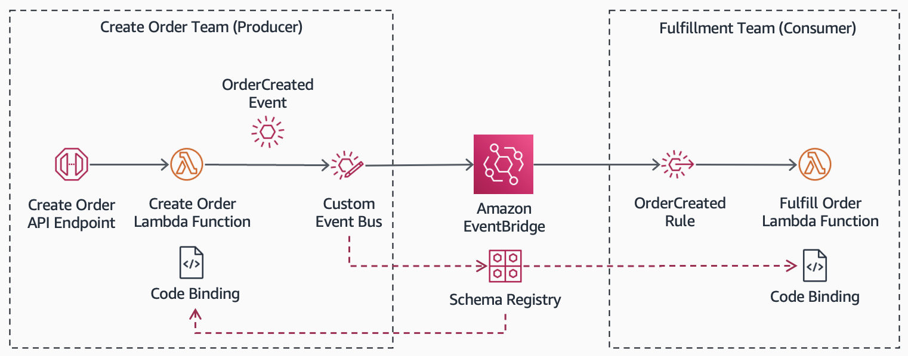
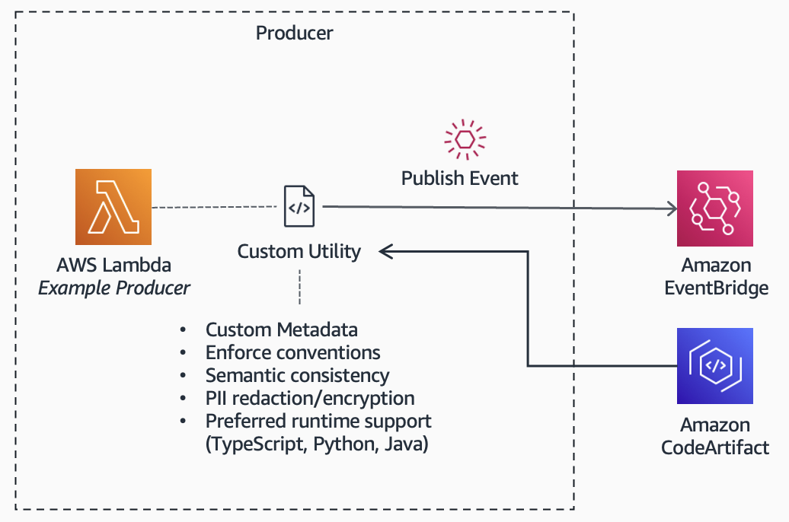
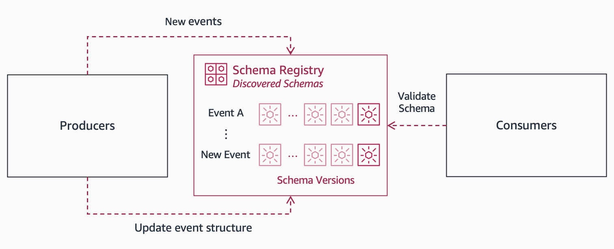
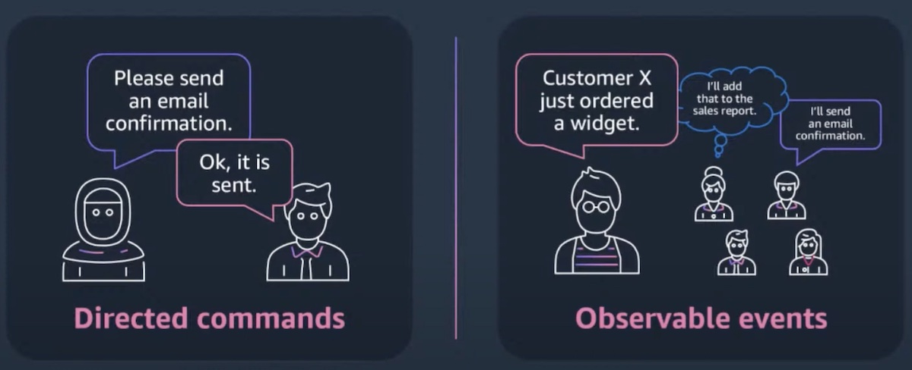

|ToC|
|---|



## Overview

### What is a schema registry?
In a request-response architecture, you may be familiar with the concept of Application Programming Interfaces (APIs). APIs form a contract of communication between services. In an event-driven architecture, this contract is facilitated by the schema registry. The schema registry is a central collection of schemas, including its version history. Schemas describe the structure of events including fields, values and formats. To illustrate, we will use an e-commerce store use case. For example, an `OrderCreated` event may include the `status` of the order as a *string*, a list of `product-ids` as an *array*.


### Why is it important?
At its core, event-driven architectures consist of producer services generating events, and consumer services reacting to those events. Producers and consumers are decoupled by a service such as [Amazon EventBridge](https://aws.amazon.com/eventbridge/), a serverless event bus. By decoupling, developers can move fast: they can build, deploy and scale applications independently. Developers can subscribe to events they are interested in, emit events for extensibility, and avoid writing integration code. 



However, with evolving business requirements, producers and consumers can be out of sync leading to reliability challenges. For example, the `OrderCreated` event can introduce a new field such as the `total` cost of the order. In a growing business and increasingly complex application, it can be challenging for teams to understand what events are available and what they mean. The schema registry plays an important role in reliability, allowing producers and consumers enforce a contract. And, event discovery, helping teams understand events and the applications they can build on top of them.

## Best-practices

### Understand event discovery and design principles
An event is a data representation of something that happened. While this sounds simple, event discovery and design is a nuanced and complex topic that extends well beyond this post. While we cover some best-practices in this post, implementation will vary highly depending on your needs, so ensure that you take the time to do your research. Review concepts such as [event storming](https://medium.com/serverless-transformation/eventbridge-storming-how-to-build-state-of-the-art-event-driven-serverless-architectures-e07270d4dee) and [Domain-Driven Design (DDD)](https://serverlessland.com/event-driven-architecture/visuals/eda-and-ddd). 

### Develop a naming convention for event types
Events in Amazon EventBridge have a [standard structure](https://docs.aws.amazon.com/eventbridge/latest/userguide/eb-events-structure.html), including the `source` and `detail-type`. This provides important context including where the event came from, and what the event is about. This context will be used by consumers, collaboration across teams, monitoring and observability tools, and tracing across services. As such, developing names that are easy to understand will be beneficial. Names are typically difficult to change, so it’s worthwhile thinking about setting a standard up-front. 

For example, consider naming conventions to distinguish [event types](https://serverlessland.com/event-driven-architecture/visuals/event-types): 
* **Notification and Delta Events:**  If the event is communicating only the detail relevant to state changes, consider a `<Noun><PastTenseVerb>` format. For example, `OrderCreated`. 
* **Fact Events:** If the event is communicating full state changes (also known as *[event-carried state transfer](https://itnext.io/the-event-carried-state-transfer-pattern-aae49715bb7f)*), consider using an alternative `<Event>Fact` format. For example, `OrderCreatedFact`.
* **Domain Events:** In addition to events used for communicating across services (*outside* events), there are events that are only used within a service (*inside* events). Here, consider a namespace prefix. For example, `Order@OrderCreated`. Note that events can be produced by different services as the system evolves, and the `source` field in the event data can be used.  

### Catalog and document events for shared understanding
In addition to a schema registry, consider documentation for business-level definitions to develop shared understanding across teams. Consider tools such as [EventCatalog](https://www.eventcatalog.dev/) and [Contextive](https://marketplace.visualstudio.com/items?itemName=devcycles.contextive). A key concept is [bounded context](https://serverlessland.com/event-driven-architecture/visuals/bounded-context-with-event-architectures). The same term can have different meanings within a service (*inside* events) vs. communication across services (*outside* events). 

### Incorporate a standard event metadata for context awareness
While there is freedom to publish any data into event `detail`, consider augmenting event `data` with additional `metadata` to provide additional context for consumers. This is a pattern that is [increasingly adopted by the community](https://sbrisals.medium.com/the-power-of-amazon-eventbridge-is-in-its-detail-92c07ddcaa40). 

```json
{
    "version": "1.0",
    "id": "0d079340-135a-c8c6-95c2-41fb8f496c53",
    "detail-type": "OrderCreated",
    "source": "com.orders",
    "account": "123451235123",
    "time": "2023-09-01T18:41:53Z",
    "region": "ap-southeast-2",
    "detail": {
		"metadata": { ... }, /* Metadata for additional context */
		"data": { ... } /* Content about the event */
	}
}
```

For example, consider the following `metadata`:
* **event-id:** (or `idempotency-key`) With a unique identifier (such as a [UUID](https://www.ietf.org/rfc/rfc4122.txt)), consumers can identify duplicates. This is important as EventBridge guarantees *at-least once* delivery and consumers will need to be [idempotent](https://docs.aws.amazon.com/wellarchitected/latest/framework/rel_prevent_interaction_failure_idempotent.html).
* **sequence-id:** With a sequence identifier in a new field (or as part of the `event-id`), consumers can handle ordering. If an event is out of order, the consumer can make a decision on what to do such as waiting or saving the event for later use.
* **tenant-id:** For a SaaS application, the [tenant context](https://docs.aws.amazon.com/wellarchitected/latest/saas-lens/tenant.html) will enable consumer services to handle events relevant to the tenant boundary.
* **data-classification:** For security, a data classification tag can identify whether the event contains sensitive data such as Personally Identifiable Information (PII). This enables security policies to be implemented for certain classifications.

### Implement a tool for consistency and abstraction when publishing and consuming events
For producers, implement a consistent way to enforce the standard `metadata` outlined above. To achieve this, develop a custom utility such as `PublishEvent()` to initialize events. Distribute across teams using a package manager such as [AWS CodeArtifact](https://aws.amazon.com/codeartifact/). The utility can additionally provide abstraction for implementation details, enforce security on sensitive data and perform validation. Producers are isolated from details such as the EventBridge [PutEvents\(\)](https://docs.aws.amazon.com/eventbridge/latest/APIReference/API_PutEvents.html) API with AWS SDK, and only need to concern themselves with the event they are publishing.  



For consumers, consider conforming [payloads](https://www.boyney.io/blog/2022-02-11-event-payload-patterns) to a standard such as [CloudEvents](https://cloudevents.io/). To achieve this, use EventBridge [input transformer](https://docs.aws.amazon.com/eventbridge/latest/userguide/eb-transform-target-input.html) to transform data prior to consumption. See [CloudEvents input transformer](https://serverlessland.com/patterns/eventbridge-cloudevents-transformer-cdk-typescript) for an example. 

### Use code bindings and developer tools for agility
[EventBridge schema registry](https://docs.aws.amazon.com/eventbridge/latest/userguide/eb-schema.html) generates [code bindings](https://docs.aws.amazon.com/eventbridge/latest/userguide/eb-schema-code-bindings.html) to accelerate development. Code bindings can be accessed via the EventBridge console, [Schema Registry API](https://docs.aws.amazon.com/eventbridge/latest/schema-reference/what-is-eventbridge-schemas.html) and in popular developer IDEs with [AWS Toolkit](https://docs.aws.amazon.com/sdkref/latest/guide/support-maint-idetoolkits.html). See [video](https://www.youtube.com/watch?v=YAoCILSZ6ug) to learn more. 

[AWS Serverless Application Model (SAM)](https://aws.amazon.com/serverless/sam/) can be used to easily build serverless producer and consumers, see [example on Github](https://github.com/aws-samples/amazon-eventbridge-producer-consumer-example). To adopt best-practices, consider tools such as [Lambda Powertools](https://docs.powertools.aws.dev/), [cfn-lint](https://github.com/aws-cloudformation/cfn-lint) and [serverless-rules](https://github.com/awslabs/serverless-rules).

### Implement validation across your producers and consumers 
EventBridge [schemas](https://docs.aws.amazon.com/eventbridge/latest/userguide/eb-schema.html) support open-standards such as OpenAPI and JSONSchema. Producers and consumers can cache and use the schema to validate the event structure including data types. If an event does not conform to the schema, an exception can be thrown. Depending on the use case and frequency of schema changes, validation can be done at runtime or at build time in the CI/CD pipeline prior to deployment. Teams can use observability tools such as [AWS X-Ray](https://aws.amazon.com/xray/) and [Amazon CloudWatch](https://aws.amazon.com/cloudwatch/) to monitor any issues.

### Handle schema evolution with versioning and schema discovery
Businesses are rarely static and events change (*schema evolution*). With [schema discovery enabled](https://catalog.us-east-1.prod.workshops.aws/workshops/63320e83-6abc-493d-83d8-f822584fb3cb/en-US/eventbridge/schema-registry/enable-schema-discovery), teams do not have to maintain their own schemas. This increases developer productivity and reduces the risk of errors. Schemas for all AWS sources are automatically updated under *AWS event schema registry*. While SaaS partner and custom schemas are automatically generated to the *[Discovered schema registry](https://docs.aws.amazon.com/eventbridge/latest/userguide/eb-schema-registry.html)*. 



With schema versions, producers and consumers can determine how to handle compatibility at their own choice. For example, a new version can be backwards compatible and consumers can process as is. However, for major and breaking changes, producers and consumers can wait until the application is updated before enforcing the new version. 

### Start small with sparse event payloads
A common question when building event-driven architectures is “how much data should an event contain?”. While there is no one-size fits all answer, one approach is to start small with [sparse event payloads](https://serverlessland.com/event-driven-architecture/designing-events). As opposed to describing the full-state of an event, they contain little details. Perhaps, this is just the event identifier and fields critical for filtering by EventBridge that can be matched by [event patterns](https://docs.aws.amazon.com/eventbridge/latest/userguide/eb-event-patterns.html). 

```json
/* Sparse event example */
{
    "detail-type": "OrderCreated",
    "source": "com.orders",
    "detail": {
		"metadata": { 
            "event-id": "1a2b3c4d5e6f7g8h9i",
        }, 
		"data": { 
            "order-id": "123456789",
            "fulfillment-type": "fulfilled-by-amazon", /* Data for filtering */
        } 
	}
}
```

The benefit of sparse events is reduced coupling of the producer and consumer. However, if consumers require additional data, they will need to retrieve the data from a service or database. This can increase processing load, costs, and complexity with duplicate integration code. To resolve, over time, the event payload can expand to include additional data that are commonly used by consumers.  

```json
/* Full state description example */
{
    "detail-type": "OrderCreated",
    "source": "com.orders",
    "detail": {
		"metadata": { 
            "event-id": "1a2b3c4d5e6f7g8h9i",
        }, 
		"data": { 
            "order-id": "123456789",
            "fulfillment-type": "fulfilled-by-amazon", 
            /* Provide data commonly used by consumers */
            "total": 100,
            "status": "Pending",
            "product-ids": ["ABC-123", "DEF-345", "GHI-678"], 
        } 
	}
}
```

## Common challenges and pitfalls

### Avoid using directed commands as events 
With familiarity for request-response architectures, it can be natural to mistake directed commands for events. For example, `Send Email` may look like an event. However, in an event-driven architecture, it is typically processed by the consumer such as an `EmailNotificationService`, which subscribes to an observed business domain event such as `OrderCreated`.  



### Be aware of complexity on calculating the current state 
[Notification or delta events](https://serverlessland.com/event-driven-architecture/visuals/event-types) only communicate details relevant to state changes. To compute the current state, each consumer needs to process past events in the correct order. Typically, the [Event Sourcing and Command Query Responsibility Segregation \(CQRS\) patterns](https://community.aws/posts/scaling-your-application-data-patterns) are used. Events that are lost, duplicates or processed in the incorrect order can lead to an incorrect state. This can have significant adverse impact, especially if there are flow-on downstream systems. 
To assist, EventBridge provides an [archive](https://docs.aws.amazon.com/eventbridge/latest/userguide/eb-archive.html) to replay events. See [example Amazon EventBridge implementation](https://docs.aws.amazon.com/prescriptive-guidance/latest/modernization-data-persistence/service-per-team.html#amazon-eventbridge).

### Be aware of complexity on inferring state changes
Fact events communicate the full state (*event-carried state transfer*). Depending on the use case, consumers may need to infer the reason for state change. To achieve this, it is not uncommon for these events to incorporate the `reason`, and even the full `before` and `after` states. This can increase the payload size for each event, increasing costs and load on the system, especially for frequent events. In addition, consumers will need to incorporate application logic to infer the state changes. This can be duplicative and add complexity to consumers.

### Be aware of complexity on calculating relationships and joins 
When transitioning to an event-driven architecture, it is common to generate events from an existing relational database, where data is normalised. For example, events can be generated from the  `Order` and `Product` tables using [Change Data Capture \(CDC\) streams](https://aws.amazon.com/blogs/big-data/stream-change-data-to-amazon-kinesis-data-streams-with-aws-dms/). However, consumers such as `EmailNotificationService` may require details about *both* events: the order and relevant products ordered. Unfortunately, unlike a relational database, consumers may not be optimised for relational data and complex joins. Performing these calculations can introduce performance bottlenecks and increase costs. 


To resolve the challenge, consider adopting the [transactional outbox pattern](https://docs.aws.amazon.com/prescriptive-guidance/latest/cloud-design-patterns/transactional-outbox.html). Here, you create a dedicated outbox table in your database, as a buffer prior to publishing events. The outbox can contain denormalised data that is isolated and purpose-built for consumers. A database transaction is used to ensure that both the producer’s internal state (in the `Order` and `Product` tables) and the consumer’s state (as facilitated by the outbox table) are consistent. To avoid performance bottlenecks, avoid data that is too large or frequently updated, and only include data that is commonly used by consumers.  


For events generated by non-relational databases such as [Amazon DynamoDB Streams](https://docs.aws.amazon.com/amazondynamodb/latest/developerguide/Streams.html), data may already be denormalised. However, you can also [implement the same pattern with EventBridge Pipes](https://aws.amazon.com/blogs/compute/implementing-the-transactional-outbox-pattern-with-amazon-eventbridge-pipes/) in order to avoid inconsistencies associated with dual writes to the database and the event bus. 

## Conclusion
In this post, we covered the [EventBridge schema registry](https://docs.aws.amazon.com/eventbridge/latest/userguide/eb-schema.html). And more importantly, its critical role in facilitating a contract between producers and consumers in an event-driven architecture. We learned about best-practices on how to best leverage the capabilities of the registry, as well as designing and structuring events for scalability, performance and security.

Remember that each event represents an extension point for your application. And so, the goal is to design them in a way that it’s easy for consumers. Consumers will process key events, build applications on top of them, ultimately deliver value for your customers. First and foremost, be attentive and aware of their needs. From there, you will need to balance considerations across various factors including architecture coupling between producers and consumers, how to handle data model relationships, development effort and infrastructure considerations, and how business requirements and teams may evolve in future.

If you are building event-driven architectures, [connect with me](https://github.com/wirjo). I'd be interested in your feedback and insights. For additional resources, visit [Serverless Land](https://serverlessland.com/). 