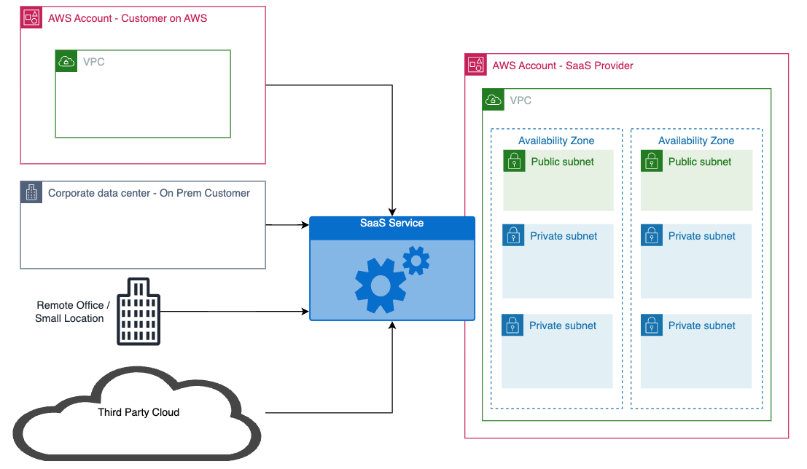
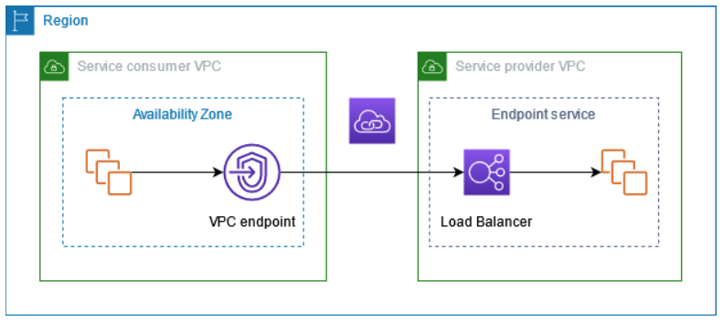
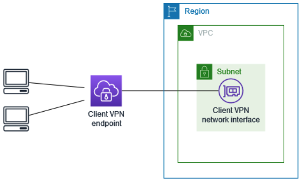
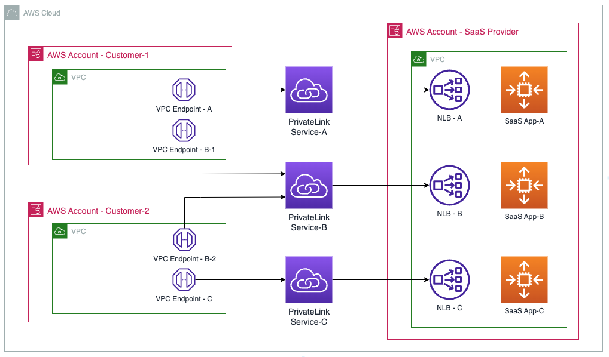
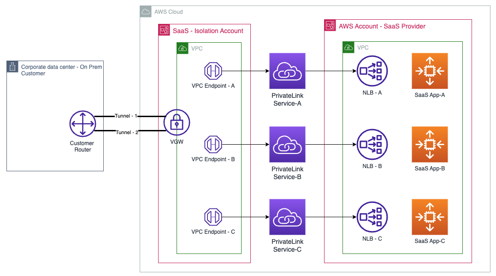
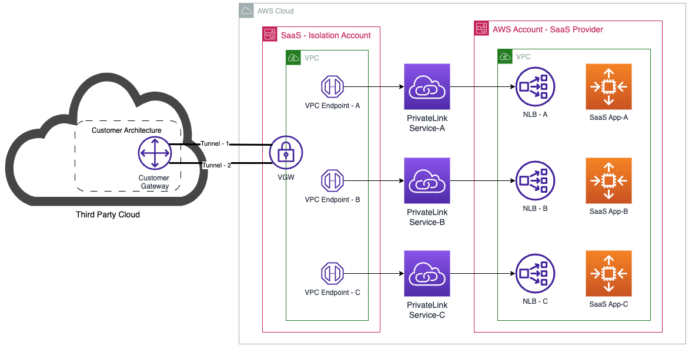

|ToC|
|---|

SaaS providers building on AWS are often faced with the challenge of extending their services to customers wherever they are, be it on AWS, on premises, or even on another clouds. There is always the option of going over an internet route, yet it is less efficient, often more costly, brings security exposure, and is harder to scale and maintain. In this blog will describe how to use AWS PrivateLink, AWS VPN, and a landing VPC concept to  securely extend connectivity to SaaS customers wherever they are in a modular, secure, and scalable architecture.

## SaaS Connectivity Challenges

Besides the need to innovate and create differentiators, SaaS providers for B2B software are keen to make their products as accessible as possible to their business customers wherever they are. The easier they make it for their customers to access their product the faster their product adaption and consequently revenue growth. 

If you are a SaaS provider building in the AWS cloud, you look for ways to make your product easily accessible, not only for your AWS based customers, but also for customers on premises and on other third party clouds. The task of extending your services to your customers wherever they are comes with security, latency, tenant isolation, and SaaS infrastructure protection challenges. In the next sections we will discuss the use cases, solution requirements, and the proposed solution.

## The Use Cases
There are three use cases that are most commonly seen when providing SaaS service to an end customer:

1- The SaaS end customer is on AWS 

2- The end customer is on premises with their data centers or a distributed setup of small offices 

3- The end customer is on a third party cloud

The diagram below highlights the three target use cases and the desire to provide them access to the SaaS service

The easy solution to all is to take an internet route. While using direct access over the internet can appear to be more common, easy, and can satisfy all three use cases, it lacks the security and privacy VPN and PrivateLink provide. The approach would also be subject to unpredictable and variable latency, that is just native to any traffic crossing the big internet.

## Solution Requirements

With the understanding of the use cases along sides with the challenges taking an internet route may present, it is time to take a look at alternatives that can be more secure and reliable. The core elements we would want to see in these alternative solutions are: 

**1- More secure:** Besides the encryption that is commonly used at a transport/session layer using TLS/SSL, having a VPN connection or a Private connection adds a layer of security that most customers with critical workloads (e.g. banks) would care to have. 

**2- Performance predictability:** having deterministic, consistent, and low latency connection is very desirable.

**3- Tenant isolation:** It is very important for SaaS providers to ensure tenants are isolated and have experiences that are as close to a single tenant behaviour as possible. 

**4- SaaS isolation and protection layer:** This is where we need to ensure an isolation layer/protection layer is created between the consumer and the SaaS service. i.e. restricting tenants access to just the service provided and not expose the SaaS infrastructure through direct VPN or direct connections

**5- Modular and scalable:** The better we can do at creating common components/modules that are reusable across the different use cases, the more efficient and easier to build and maintain our solution will become.

## Solution Building Blocks

Now that we went over the use cases, the challenges going over an internet route present, and the clarity we established on the requirements of a desired solution, let's start by creating the building blocks: 

**a- An isolation layer:**
First common layer is an private connectivity and isolation layer that protects our SaaS infrastructure and only exposes the services that need to be exposed. For this purpose what comes in mind first is [AWS PrivateLink](https://aws.amazon.com/privatelink/). AWS PrivateLink provides private connectivity between virtual private clouds (VPCs), supported AWS services, and your on-premises networks without exposing your traffic to the public internet. The figure below shows conceptually how PrivateLink works. 

PrivateLink allows you to privately extend connectivity to your customers that are on AWS in a secure, and private manner, all while maintaining an isolation layer with exposing only the service you intend to expose. From the diagram we can see that although PrivateLink might be the solution to some use cases, specifically where your customers are on AWS, for customers outside of AWS, on premises or on other clouds, we will need to get more creative. Let's put this building block a side and move on to our next building block 

**b- Encrypting external traffic over VPN:**
For customer that are outside of AWS, either on premises (data Centers or Remote Offices), or in other third party clouds. Bringing their traffic in over a VPN tunnel using [AWS VPN ](https://aws.amazon.com/vpn/) can be a much more secure approach. This can be achieved through site-to-site VPN or Client VPN. In addition, using [Accelerated Site-to-Site (S2S) VPN ](https://docs.aws.amazon.com/vpn/latest/s2svpn/accelerated-vpn.html) can be an option that also takes care of the latency problem by leveraging AWS edge locations then tunneling traffic over the AWS backbone. 

When it comes to [Site-to-Site VPN](https://aws.amazon.com/vpn/) there are two managed options that we can utilize, based on the use case at hand. The AWS managed options are [AWS Virtual Private Gateway (VGW)](https://docs.aws.amazon.com/vpn/latest/s2svpn/how_it_works.html#VPNGateway), and [AWS Transit Gateway (TGW)](https://aws.amazon.com/transit-gateway/). 

Here is a conceptual diagram for site-to-site VPN using VGW

And this is a conceptual diagram for site-to-site VPN using TGW

For smaller size customers with a limited number of machines, typically in a distributed setup or in small offices, site-to-site (S2S) VPN might not be the most optimal solution. AWS Client VPN Endpoint provides a more favorable alternative allowing you to extend a shared VPN Endpoint infrastructure with multiple customer. AWS Client VPN uses Source NAT, and can be configured for client isolation while sharing the underlying VPN termination endpoint. Simply, if you don't add an authorization rule to allow client-to-client communication, by the default they are isolated from each other.

The diagram below shows a conceptual view of the AWS Client VPN Endpoint construct and how it works

**c- Private Cloud Boundaries:**
[AWS Virtual Private Cloud (VPC)](https://aws.amazon.com/vpc/?refid=58b3b422-9e3d-4d31-a50d-c6f8b1a5161a) is a construct that natively provide isolation boundaries for your infrastructure in the cloud. AWS VPC gives you full control over your virtual networking environment, including resource placement, connectivity, and security. Definitely a building block that we will need. Within the solution part we will use the "landing VPC" concept in order to terminate external traffic arriving at VPN endpoint and provide a layer of isolation. 

## Solution Approach

As we have identified the building blocks, it is time to start solutioning for each use case we have. Now that we have the building blocks, it should be super easy!! 

**a- The end customer is on AWS:**

This one is likely the most straight forward because we have an AWS service that is built just for that, AWS PrivateLink. Since the end customer is already on AWS, we can simply extend connectivity using AWS PrivateLink. Here is how you do it:

1- We start by creating an [Endpoint Service](https://docs.aws.amazon.com/vpc/latest/privatelink/create-endpoint-service.html) on the SaaS provider side to expose the service. This can be easily achieved by frontending your application servers with a [Network Load Balancer (NLB) ](https://docs.aws.amazon.com/elasticloadbalancing/latest/network/introduction.html) or a [Gateway Load Balancer (GWLB)](https://aws.amazon.com/elasticloadbalancing/gateway-load-balancer/), creating an Endpoint Service, and then expose the service to your end customers.  When it comes to exposing your service to end customers, you can set permissions to make your service public pending acceptance, basically the end customer regardless of who they are will be able to find the services you have publicly exposed, request access, and it is up to you to approve. Or you can restrict access to only your end customers by allow listing their specific accounts, and then you can chose to still manually accept or bypass the acceptance process, since you have already only allow listed your specific customer accounts. This can all be built through automation using a trigger during customer registration, allow listing the registered accounts that are paying for your service.

2- your end customer searches for your service and creates an [Interface VPC Endpoint](https://docs.aws.amazon.com/vpc/latest/privatelink/create-interface-endpoint.html) for the service. Once done, they have private access to your service over the AWS backbone. The figure below highlights the approach.

The diagram below details the end-to-end solution. It also highlights the ability to expose multiple services through the creation of an Endpoint Service per service you wish to expose. It also demonstrates how multiple customers can share the same service by creating their unique endpoint within their VPC infrastructure.   

Let's recap the requirements and if we have addressed them all

*- More secure/private: PrivateLink extends a private connection over the AWS backbone, the traffic stays private and never leaves AWS* 

*- Performance predictability: Since traffic is not taking any internet route, staying on the AWS dedicated fiber constructed backbone, your end customers get to enjoy low, consistent, and predictable latency*

*- Tenant isolation: With PrivateLink, traffic is kept private and neighbor isolation is native to the service*

*- SaaS isolation and protection layer: PrivateLink by definition is a stateful one way street, only the service exposed and the port numbers associated with it are allowed through the customer created endpoint. This provides the built in native infrastructure protection required by the SaaS provider*

*- Modular and scalable: Once you create your Endpoint service, the service can be shared with your customers utilizing the same infrastructure components and service created. There is no need to create a service per customer. You can create an Endpoint Service for each product in your SaaS portfolio allowing you to scale in a modular way*

It seems that we are all set here in terms of fulfilling the solution requirements, time to move on to the next use case

**b- The end customer is  on premises:**

When the customer in outside of AWS, on premises or on a third party cloud, we need to first ensure we bring their data in a a secure way to AWS, for that we will use our second building block AWS VPN. Depending on the requirements, you have the choice between site-to-site VPN or Client VPN. Site-to Site VPN is recommended for larger customers, while for smaller customers with a few machines, Client VPN can be a more practical solution.  With site-to-site VPN you can chose between terminating your VPN tunnel either on a VGW or a TGW. The advantage of using a TGW is having access to the [VPN acceleration option](https://docs.aws.amazon.com/vpn/latest/s2svpn/accelerated-vpn.html), witch is not currently supported ,as of the date of this writing, on VGW. With VPN acceleration your traffic is captured at the closest AWS Edge Location and travels all the way back to the AWS region where the SaaS service is, over the AWS backbone, thus providing for a more deterministic, low latency VPN solution. And if you are curious like me about how VPN acceleration works, it is based on [AWS Global Accelerator](https://aws.amazon.com/global-accelerator/). Under the hood when you configure Accelerated VPN, behind the scenes AWS provisions a Global Accelerator for each tunnel endpoint. That part is totally abstracted, you only need to request acceleration during your VPN connection creation and AWS takes care of the rest for you. On the other hand for Client VPN you can use AWS Client VPN Endpoints, a managed services that allows you to terminate client VPN tunnels. 

Needless to say, if the end customer has an [AWS Direct Connect](https://aws.amazon.com/directconnect/) connection to AWS, their use case would converge to the first use case as they have AWS presence. 

Once we brought traffic securely to AWS, and to maintain a consistent approach, we can reuse our already validated previous solution. Since now the traffic is on AWS, we can drop it into a landing VPC using the VPC construct, providing the required isolation boundaries. Once we do, we are only a few more steps from getting access to the SaaS service. We can simply search for the service and creating a Service Endpoint, as previously described. The diagram below describes the end-to-end approach using the VGW to terminate your VPN tunnel. It is also worth noting, when you use aws managed S2S VPN, for higher reliability, two VPN tunnels are created with each terminated in a different availability zone. 

Another aspect that needs to be considered is DNS resolution. For our setup to work, your customer's on premises servers will need to be able to resolve the DNS name of the SaaS service, something that can be addressed using [Route 53 resolver endpoints](https://docs.aws.amazon.com/Route53/latest/DeveloperGuide/resolver.html) and forwarding rules on your on premises servers in a hybrid-DNS setup.

Move on to the use case with smaller end customers, and a small number of machines each, and often mobile or distributed. In this case we may not require a site-to-site VPN, a Clinet VPN solution would look like the diagram below. Client VPN uses source NAT-ing, and would support end-customer isolation.

 

Validating that we fulfilled all the use case solution requirements should be easy as we already have reused the already validated solution from our first use case as a building block, hence we only need to validate the VPN part. Here is a short recap: 

*- More secure/private: AWS VPN uses IPSec keeping the traffic secure, encrypted, and private from on premises all the way to AWS. Once on AWS, PrivateLink takes care of the rest*

*- Performance predictability: Since traffic is traveling over the internet, there is always a part that experiences the unpredictable latency over the big internet, the shorter the path the better. Using Accelerated VPN minimizes the risk as traffic has to only be on an internet route from the end customer location to the closest AWS Edge Location, afterwords it is deterministically carried over the AWS dedicated fiber backbone. If you would like to take this a step further, you will need to consider AWS Direct Connect relying on dedicated fiber routes*

*- Tenant isolation: VPN being terminated on a dedicated VPC per customer, the landing VPC used for site-to-site VPN connections provides the required isolation. For smaller Client VPN end customers, as AWS uses Source NAT for Client VPN connections, you can achieve client isolation while terminating multiple clients connections on the same Client VPN Endpoint and the same landing VPC.*

*- SaaS isolation and protection layer: Since in all cases either site-to-site or client VPN we are always terminating our traffic in a landing VPC isolated from the SaaS setup. And since the connection is then extended to the SaaS infrastructure using PrivateLink. PrivateLink takes care of the isolation for the reminder part of the path.*

*- Modular and scalable: The Endpoint service part we used in use case one is modular and scalable as we discussed. Now the remaining part to address is the VPN part. The VPN part is also scalable and modular. In a shared setup utilizing AWS Client VPN Endpoints, which is shared among multiple tenants, or a dedicated per customer setup for larger customers, with a landing VPC & VPN tunnel per customer, they both scale well and have a unified approach built on the same building blocks,  AWS VPN, landing VPC, and AWS PrivateLink.*  

**c- The end customer is on a third party cloud:**

For our third use case where the end customer is on a third party cloud. This use case is very similar to the second use case. Using the same approach with a site-to-site VPN tunnel, terminating traffic in a landing VPC, then using AWS PrivateLink to connect back the service would create a complete path.The diagram below demonstrates the approach, very similar to our previous use case though. 

This would be subject to the same requirements cross validation as the previous use case

## Scaling the Solution

As we have standardized on the approach and used building blocks that are shared between the three use cases. a SaaS provider can scale and extend their services to  end customers regardless where they are, using the same building blocks. The building blocks are in summary: 

*- Create an Endpoint Service per product (service), and scale this as they add additional products by creating an Endpoint Service for each new product using the same approach. If your customers are operating in multiple regions, you are encouraged to create an Endpoint Service per service per region.*

*- For AWS customers, you would need to just allow list their accounts to access your service and you are set to go, they can create VPC endpoints for your service and instantly get access to it.*

*- For customer on premises or on a 3rd party cloud. You need to create the appropriate VPN connection either site-to-site VPN, or Client VPN based on the customer size and requirements. You will also need to create landing VPCs, one per large customer (site-to-site VPN). For small customers that use Client VPN  you can create a shared Client VPN Endpoint and a shared landing VPC.*

And there you have it, you have accommodated all your end customers regardless where they are in a secure, reliable, scalable and efficient architecture!

## Conclusion

In conclusion; in this blog we have demonstrated how SaaS providers can extend their services to customers securely wherever they are, be it on AWS, on premises, or on other clouds. We have leveraged AWS PrivateLink, AWS VPN, and the concept of a landing VPC to enable a modular and secure architecture that can scale as business grows. We have also demonstrated the need to change tactics depending on where the customer is, as long as we maintain the a foundational elements and maintain modularity. At last, we have demonstrated that besides modularity and scalability, the solution can be flexibly adaptive to future needs.
