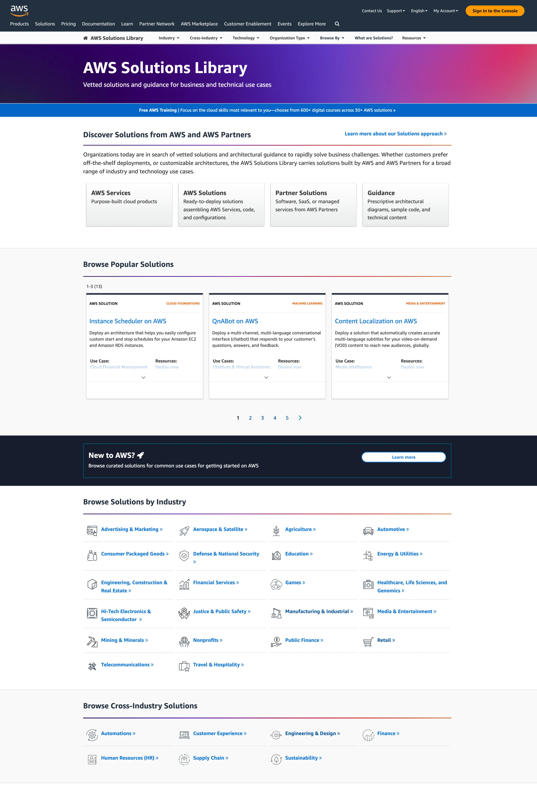
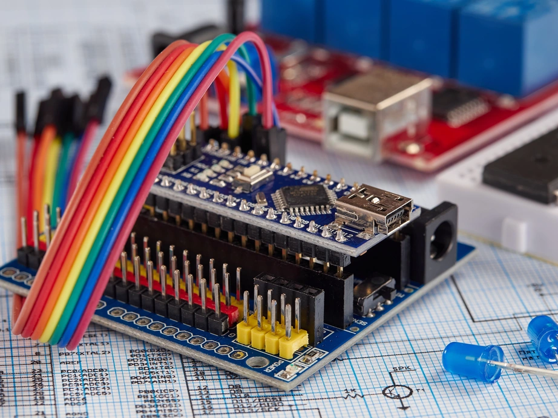

|ToC|
|---|

Tech moves too quickly. I think it high time we all pumped the brakes a bit and took a little breather. Customers are patient. They’ll wait if you ask nicely. If your product manager is breathing down your neck for status updates, tell em you’ll have it in two weeks and send em this article to read in the meantime. In the digital age, it’s better to be right than to be first.

Wait. This doesn’t sound right. Let’s try that again.

Whether you’re a startup or a large enterprise, product teams are increasingly under pressure to innovate and release faster. Development on the cloud moves quickly and if you’re the one doing the development, every release cycle needs to have impact and move the product forward. If you’re feeling that pressure, but as the saying goes, “losing the forest through the trees,” here are a five ideas that help speed up your product development. Some ideas are practical. Others a little more philosophical. My hope is you find an idea or two to consider boosting your product development.

That sounds better. Let’s get started.

## 1. Don’t reinvent the cloud

Experience builds character. But you don’t need it to build your app. Seek a solution first. It’s silly to even consider developing a modern application without tapping into the boundless possibilities of open-source dependencies. This is true at the micro-dependency level but is also true at the solution level.

`Infinite product ideas x infinite ways to build them = Analysis Paralysis.`

No need to worry. AWS hosts the [AWS Solution Library](https://aws.amazon.com/solutions/?sc_channel=el&sc_campaign=reinvent&sc_content=five-ways-to-accelerate-product-development-for-developers&sc_geo=mult&sc_country=mult&sc_outcome=acq) built for faster discovery, organized by technology, industry, and use case to help you jump-start your time-to-value. How’s that for a pitch? Consider the “[New to AWS](https://aws.amazon.com/solutions/new-to-aws/?sc_channel=el&sc_campaign=reinvent&sc_content=five-ways-to-accelerate-product-development-for-developers&sc_geo=mult&sc_country=mult&sc_outcome=acq)” domain if you’re just getting started or explore solutions using the search. These solutions are prescriptive and built by AWS experts to show you exactly how to build on AWS. Here’s a brief rundown of what you’ll find:

* **AWS Services -** Purpose-built cloud products design to solve a specific use case.
* **AWS Solutions -** Ready-to-deploy solutions assembling AWS Services, code, and configurations.
* **Partner Solutions** - Software, SaaS, or managed services from AWS Partners.
* **Guidance** - Prescriptive architectural diagrams, sample code, and technical content.

📣 **Shameless plug**: If you’re attending re:Invent 2023, I’ll be there showing you exactly how to get value out of the AWS Solutions Library. In the [ARC203 “Solve everyday challenges faster with AWS Solutions Library“ workshop](https://hub.reinvent.awsevents.com/attendee-portal/catalog/?search=ARC203&sc_channel=el&sc_campaign=reinvent&sc_content=five-ways-to-accelerate-product-development-for-developers&sc_geo=mult&sc_country=mult&sc_outcome=acq), we’ll deploy up to four AWS Solutions and show how they can be connected to quickly build a data ingestion engine. You can also come say hi on the floor at the expo in the Solutions Lounge!

## 2. Use better tools

GenAI. Done. Next.

Well... Not quite. GenAI is no doubt the most transformational development in computing since the internet. But it’s still early and yet to replace developers completely. Until it does, there are tools available to speed up product development and release faster. Here are a few to consider:

* [AWS App Runner](https://aws.amazon.com/apprunner/?sc_channel=el&sc_campaign=reinvent&sc_content=five-ways-to-accelerate-product-development-for-developers&sc_geo=mult&sc_country=mult&sc_outcome=acq) - A fully managed application service that lets you build, deploy, and run web applications and API services without prior infrastructure or container experience.
* [Amazon CodeWhisperer](https://aws.amazon.com/codewhisperer?trk=83c710fd-0a7a-416b-9bb8-baa535b64ee0&sc_channel=el) - AI coding companion trained on billions of lines of code.
* [AWS Amplify Studio](https://aws.amazon.com/amplify/studio/?sc_channel=el&sc_campaign=reinvent&sc_content=five-ways-to-accelerate-product-development-for-developers&sc_geo=mult&sc_country=mult&sc_outcome=acq) - Visual interface to designed to speed up full-stack development with a few clicks.
* [AWS IoT TwinMaker](https://aws.amazon.com/iot-twinmaker/?sc_channel=el&sc_campaign=reinvent&sc_content=five-ways-to-accelerate-product-development-for-developers&sc_geo=mult&sc_country=mult&sc_outcome=acq) - Easily create digital twins of real world systems to optimize operations.

## 3. Escalate quickly and decide

I was recently having a discussion with my Product Manager about a setting for a solution we’re developing. The question was whether the intended users would know what their SMTP settings were to include at setup. This got me thinking of a quote I once heard “Every application setting is a decision the product team couldn’t make.” This never felt more true than in that conversation. But here’s the thing, when you make the decision can be just as important as what decision you made. Escalate blockers quickly and make a decision. Amazon calls this Day 1 culture and making high quality, high velocity decisions is critical to Amazon’s innovation success. To borrow from my colleague Daniel Slater’s “[Elements of Amazon’s Day 1 Culture](https://aws.amazon.com/executive-insights/content/how-amazon-defines-and-operationalizes-a-day-1-culture/?sc_channel=el&sc_campaign=reinvent&sc_content=five-ways-to-accelerate-product-development-for-developers&sc_geo=mult&sc_country=mult&sc_outcome=acq),” here are three things to consider when making high-impact decisions quickly:

1. **Recognize two-way doors.** While some decisions are one-way doors, others are two-way doors, meaning they are reversible, and you can correct mistakes quickly.
2. **Don't wait for all the data.** If you wait until you know everything, you are probably being too slow. Most decisions only need about 70% of the information you wish you had.
3. **Disagree and commit.** People can disagree, but once a decision is made, everyone must commit to it. This saves time versus trying to convince each other.

## 4. Experiment with process

If you’re not agile, you’re fragile. No matter how big your team is, in-person, hour long daily scrums are a must. Make sure each member on the team expresses an opinion and solve at least one developer problem. And don’t forget to type up an exhaustive list of actions that you won’t check-in on next meeting. Who doesn’t love another meeting?

Again, kidding. But you can see where I’m going here. It’s tempting to want to add in the usual suspects with the development process: scrums, retrospectives, demos, etc. But there are shortcuts that speed up product development and give you time back. In any organization, especially those with remote workers or fully remote teams, it’s easy to get lost in your to-do list and lose sight of the bigger picture and what is actually important work you can be accomplishing each day. Fast forward to sprint end and you realize that you’ve lost precious time going down rabbit holes that don’t help you reach your deadline. Consider these ideas to cut meetings and release faster:

* **Asynchronous scrum.** Get off the video call and post these bad boys in Slack. Use reminder bots to hold you accountable.
* **Don’t do process for process’ sake.** “[What is your git workflow?](https://aws.amazon.com/blogs/devops/implementing-gitflow-with-amazon-codecatalyst/?sc_channel=el&sc_campaign=reinvent&sc_content=five-ways-to-accelerate-product-development-for-developers&sc_geo=mult&sc_country=mult&sc_outcome=acq)” Ask this question to your development team and watch the hours tick by. Consider the size of your team and don’t be afraid to scale down (or up) aspects of your development lifecycle.
* **Protect your calendar.** Block off time to stay focused and practice saying no to “status” meetings to catch people up. Your task management system is the preverbal fire your team gathers around to feel warm and fuzzy. Redirect status meetings there.

## 5. Don’t be a perfectionist

I recently watched the movie *Blackberry* on a long flight to Seattle. There was an excellent scene with a big trailer quote that got me thinking about product development:

> Mike Lazaridis: “I will build a prototype. But I’ll do it perfectly or I don’t do it.“  
> Jim Balsillie: “Mike, are you familiar with the saying, ‘perfect is the enemy of good?’”  
> Mike Lazaridis: “Well, good enough is the enemy of humanity.”  

Bam! Mic drop. Got em.

Cool quote but I tend to lean towards Jim’s thinking here. My wife and I are three years into a seven year plan to build a farmstead and we have a saying in our house: “Good enough is perfect.” But how do you know what’s good enough? Here’s one answer: observability. On the farm, we are continuously monitoring. Whether it’s goat fencing, chicken feeders or watering schedules, each season we observe what’s working well and what’s not. We tweak what’s not working and scale what is. The same is true for your product. Consider implementing monitoring throughout your stack and look for bottlenecks that refocus your attention. Tweak what’s not working. Scale what is. Here are a few observability resources to get you started:

* [Centralized Logging with OpenSearch](https://aws.amazon.com/solutions/implementations/centralized-logging-with-opensearch//?did=sl_card&trk=sl_card&sc_channel=el&sc_campaign=reinvent&sc_content=five-ways-to-accelerate-product-development-for-developers&sc_geo=mult&sc_country=mult&sc_outcome=acq)
* [Observability solutions on the AWS Solutions Library](https://aws.amazon.com/solutions/cloud-foundations/capabilities/observability/?sc_channel=el&sc_campaign=reinvent&sc_content=five-ways-to-accelerate-product-development-for-developers&sc_geo=mult&sc_country=mult&sc_outcome=acq)
* Blog Post: [Observability using native Amazon CloudWatch and AWS X-Ray for serverless modern applications](https://aws.amazon.com/blogs/mt/observability-using-native-amazon-cloudwatch-and-aws-x-ray-for-serverless-modern-applications/?sc_channel=el&sc_campaign=reinvent&sc_content=five-ways-to-accelerate-product-development-for-developers&sc_geo=mult&sc_country=mult&sc_outcome=acq)

## Conclusion

There’s a lot more to be said about product development. Especially when it comes to speeding it up. But if you consider your process, the tools you use and continuously experiment, tweak what’s not working and scale what is, you’ll be well on your way to launching products faster.

I would love to hear what you think and talk about your product. Shoot me a [message on LinkedIn](https://www.linkedin.com/in/tierfour) or come hang out at [re:Invent 2023](https://hub.reinvent.awsevents.com/attendee-portal/catalog/?search=ARC203?sc_channel=el&sc_campaign=reinvent&sc_content=five-ways-to-accelerate-product-development-for-developers&sc_geo=mult&sc_country=mult&sc_outcome=acq)!
