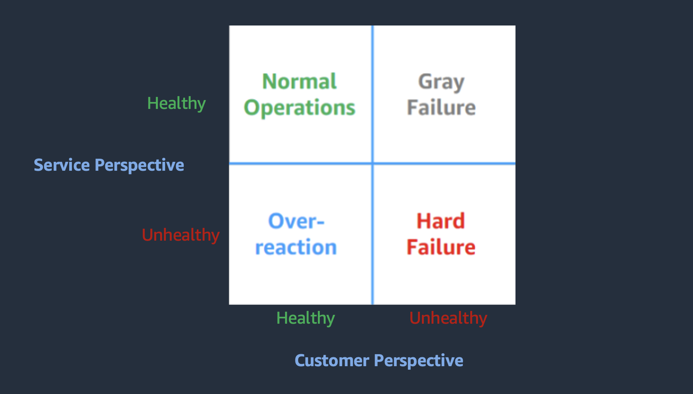
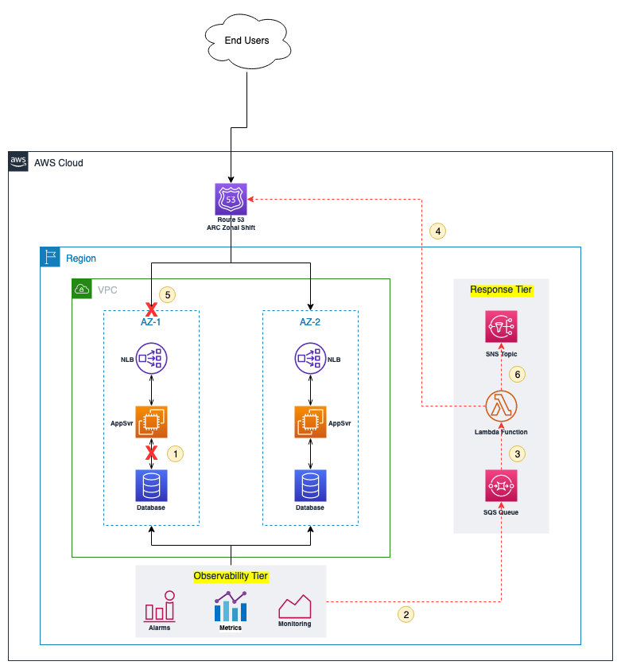
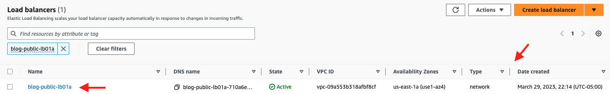
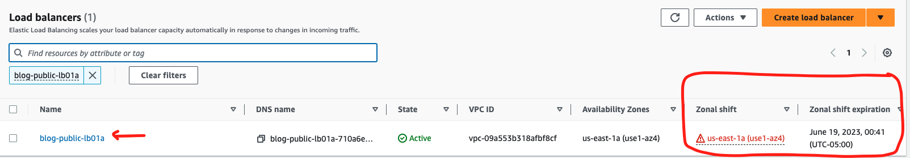

|ToC|
|---|

A gray failure in an application is a false positive state where one or more components of an application are unhealthy but do not breach health monitoring of the application. This can be a problem because everything seems fine to the application owner, but the application users may be experiencing an application degradation. Here I share a solution that helps you by reducing the mean-time-to-respond to a gray failure and improving your overall end user experience.

## The Impact of Gray Failures

In this modern era, most applications have different components working together to provide a service. When a component is unable to perform its intended function, the overall functionality of the application suffers. But this type of component failure can be difficult to detect.

Let's consider a two-tier blog application that allows users to read and provide comments. The blog article is served by its frontend component, and comments are saved to a database in its backend component. Both components are monitored using system health checks to ensure they are up and running. If communication is disrupted between the components, the monitoring tool doesn't detect it, and users continue to read the blog but are unable to leave comments. This impacts the end user experience and may result in loss of revenue due to reduced web traffic.

In short, these sorts of failures may not be catastrophic, but they're still important to detect and address as quickly as possible.

## Detecting Gray Failures

A resilient application is designed to detect gray failures by using differential observability. Differential observability is the process of monitoring an application from different perspectives – the customer perspective and the service perspective.



Figure 1 above describes customer perspective and service perspective using a matrix. The matrix consists of four quadrants.

- Normal Operations: both service monitoring and customers see the application as healthy.
- Over-reaction: service monitoring sees the application as unhealthy but everything looks fine to the customers.
- Hard Failure: both service monitoring and customers perceive the application as unhealthy.
- Gray Failure: the service monitoring perceives the application as healthy but the customers are experiencing issues and perceive the application as unhealthy.

To detect gray failures using differential observability, both perspectives described above must be monitored. The end user experience can be monitored using canaries, which are configurable scripts that run on a schedule to monitor your endpoints and APIs. Canaries can discover issues before end customers do. You can create them by using synthetic monitoring tools like [Amazon CloudWatch Synthetics](https://docs.aws.amazon.com/AmazonCloudWatch/latest/monitoring/CloudWatch_Synthetics_Canaries.html?sc_channel=el&sc_campaign=resiliencewave&sc_geo=mult&sc_country=mult&sc_outcome=acq&sc_content=arc-zonal-shift).

Monitoring the service perspective requires the ability to monitor individual components separately to detect a failure that can degrade the entire application stack. This can be achieved using a combination of performance metrics and health checks. You can monitor performance metrics like latency, average response time, HTTP status codes, request rates, CPU/Memory utilization, and a host of others. A health check provides a way to verify if a component is capable of performing work successfully. It is important to know when to use a shallow check versus a deep check. A shallow health check performs a superficial check which may not detect a dependency failure, while a deep health check performs dependency checks which can easily detect the true health of an application. However, deep health checks are expensive and prone to false positives. For more information see
* [Detecting gray failures with outlier detection in Amazon CloudWatch Contributor Insights](https://aws.amazon.com/blogs/mt/detecting-gray-failures-with-outlier-detection-in-amazon-cloudwatch-contributor-insights?sc_channel=el&sc_campaign=resiliencewave&sc_geo=mult&sc_country=mult&sc_outcome=acq&sc_content=arc-zonal-shift), which shows how to use Amazon CloudWatch Contributor Insights to help detect gray failures 
* [Implementing health checks](https://aws.amazon.com/builders-library/implementing-health-checks?sc_channel=el&sc_campaign=resiliencewave&sc_geo=mult&sc_country=mult&sc_outcome=acq&sc_content=arc-zonal-shift), which shares best practices for using health checks

## Responding to Gray Failures in AWS

The AWS global infrastructure provides a platform where applications can be designed to mitigate gray failures by using the concept of [Availability Zone](https://docs.aws.amazon.com/AWSEC2/latest/UserGuide/using-regions-availability-zones.html#concepts-availability-zones?sc_channel=el&sc_campaign=resiliencewave&sc_geo=mult&sc_country=mult&sc_outcome=acq&sc_content=arc-zonal-shift) (AZ) Independence. An AZ is one or more discrete data centers with redundant power, networking, and connectivity in an AWS Region. This isolation boundary provides the capability to contain gray failures and move traffic away from an impaired AZ while you continue to troubleshoot for the root cause. Availability Zone Independence (AZI) allows you to achieve traffic isolation at the AZ level. This makes it easy to evacuate a degraded application at the AZ level. [Amazon Route 53 Application Recovery Controller](https://docs.aws.amazon.com/r53recovery/latest/dg/what-is-route53-recovery.html?sc_channel=el&sc_campaign=resiliencewave&sc_geo=mult&sc_country=mult&sc_outcome=acq&sc_content=arc-zonal-shift) (Route 53 ARC) has a feature called [Zonal Shift](https://docs.aws.amazon.com/r53recovery/latest/dg/arc-zonal-shift.html?sc_channel=el&sc_campaign=resiliencewave&sc_geo=mult&sc_country=mult&sc_outcome=acq&sc_content=arc-zonal-shift). Zonal Shift provides a mechanism to quickly shift traffic from an impaired AZ. When the AZ recovers, you can cancel the shift to return traffic to the AZ. For example, an AZI application deployed into multiple AZs can use zonal shift to suspend traffic from going to an unhealthy application stack in a specific AZ but continue to send traffic to healthy application stack(s) in other AZs. When the unhealthy application stack recovers, you can resume sending traffic again by canceling the zonal shift.

It is important to note that Zonal Shift does not validate a gray failure nor verify available resources in other AZs. Determining when and how to shift traffic away from a degraded AZ requires careful consideration. That is, you need to have a mechanism to detect a valid gray failure and a mechanism to validate available resources in other zones to accommodate the shift. For example, an application experiencing a sudden increase in traffic may go into an AZ gray failure mode. Shifting traffic away from one AZ may overwhelm the other AZs and could make the situation even worse. The scope of this blog post is limited to how to automate Route 53 ARC Zonal Shift, but for a more detailed description and recommended best practices for using the zonal shift capability, check out this [blog](https://aws.amazon.com/blogs/networking-and-content-delivery/rapidly-recover-from-application-failures-in-a-single-az?sc_channel=el&sc_campaign=resiliencewave&sc_geo=mult&sc_country=mult&sc_outcome=acq&sc_content=arc-zonal-shift) post.

### Manual Zonal Shift

The Route 53 ARC Zonal Shift feature can be accessed through the AWS console and through an API endpoint. In an environment where the monitoring capability is not robust enough to detect false positive gray failures and verify available capacity in other zones, it's important to have a human verify before manually shifting traffic. While this prevents the application from self-inflicted failures due to spurious gray failures, it increases the time-to-respond to a gray failure.

### Automated (Event-Driven) Zonal Shift

The mean-time-to-respond to a zonal gray failure can be reduced by automating the Route 53 ARC Zonal Shift feature. This mechanism uses logic designed to respond to a zonal gray failure event by automatically triggering Route 53 ARC Zonal Shift using the highly available `StartZonalShift` API to stop traffic from going to the impaired AZ. The [AWS SDK and Developer tools](https://aws.amazon.com/developer/tools?sc_channel=el&sc_campaign=resiliencewave&sc_geo=mult&sc_country=mult&sc_outcome=acq&sc_content=arc-zonal-shift) provides the ability to integrate and interact with Zonal Shift API endpoint from a programming language of choice.

## Sample Solution

To help you get started with automating your response to a gray failure, I will walk you through a sample [solution](https://github.com/build-on-aws/automated-arc-zonal-shift) that I put together based on a hypothetical application. The application is a traditional 3-tier web application deployed in two (2) AZs. Each AZ has an independent stack - a stack contains a Network Load Balancer, a web server, and a database server. End user requests are routed through Amazon Route 53. The application has a differential observability mechanism that monitors different components to determine the health of each AZ. The sample solution deploys a Lambda function, an SQS queue, and an SNS topic. The solution does not deploy the application stack nor the monitoring mechanism. For some guidance on how to create such a monitoring mechanism, please refer to this [AWS Whitepaper](https://docs.aws.amazon.com/whitepapers/latest/advanced-multi-az-resilience-patterns/detecting-single-instance-and-availability-zone-isolated-failure.html?sc_channel=el&sc_campaign=resiliencewave&sc_geo=mult&sc_country=mult&sc_outcome=acq&sc_content=arc-zonal-shift).

When a gray failure is detected in an AZ, the monitoring mechanism delivers a message containing the details of the failure to the SQS queue. This queue triggers the Lambda function. The Lambda function starts a Zonal Shift using the API and sends a success or failure message to the SNS topic. The sample solution is available at this [AWS CDK Project](https://github.com/build-on-aws/automated-arc-zonal-shift).



The solution deploys the infrastructure components in the “Response Tier” only. The workflow is as follows:

1. The App Server lost network access to the Database. The NLB still sees the App Server as healthy and continues to send requests to it. Client requests are failing with 5XX errors. A Gray Failure has occurred in the AZ.
2. The Application monitoring mechanism detects the gray failure. A message is sent to the SQS queue.
3. The SQS queue triggers a Lambda Function with information about the degraded AZ.
4. The Lambda function makes an API call to start Route 53 ARC Zonal Shift.
5. Route 53 ARC Zonal Shift shifts traffic from the degraded AZ.
6. The Lambda function publishes a message to an SNS topic for notification.

### Sample Solution Deployment

The sample solution is authored using AWS CDK with python. When deployed, the following components/resources are created:

- Lambda Layer: contains the boto3 SDK for python required by the logic to make zonal shift API calls.
- Lambda function: contains the python logic to start the zonal shift.
- SNS topic: receives the gray failure message from the monitoring app and triggers the lambda function.

#### Deployment Steps

1. Clone the GitHub repository [here]("https://github.com/build-on-aws/automated-arc-zonal-shift").

    ```bash
    git clone https://github.com/build-on-aws/automated-arc-zonal-shift
    ```

   Change directory into the cloned repo.

    ```bash
    cd automated-arc-zonal-shift
    ```

2. Ensure CDK is installed.

    ```bash
    npm install -g aws-cdk
    ```

   Create a Python virtual environment.

    ```bash
    python3 -m venv .venv
    ```

3. Activate virtual environment.

    _On MacOS or Linux_

    ```bash
    source .venv/bin/activate
    ```

    _On Windows_

    ```bash
    % .venv\Scripts\activate.bat
    ```

4. Install the required dependencies.

    ```bash
    pip install -r requirements.txt
    ```

5. Synthesize (`cdk synth`) or deploy (`cdk deploy`) the example.

    ```bash
    cdk deploy
    ```

### Testing the Solution

A zonal gray failure has occurred, and the monitoring mechanism has identified the network load balancer as the entry point for the degraded AZ. To test the solution, the name of the load balancer is sent to the SQS queue using the provided sample `payload.json` file. This should trigger the Lambda function and start the Zonal Shift.

1. From the root directory change to src/sample.

    ```bash
    cd src/sample
    ```

2. Edit the payload.json file to reflect your load balancer's name.

    `DO NOT` change the Key.

    ```bash
    vi payload.json
    ```

3. Log into the AWS console, navigate to the Load Balancer page, and note the status of the NLB as indicated below. Note that there is no column labelled for Zonal Shift.

   

    ```bash
    aws sqs send-message --message-body file://payload.json
    ```

4. Trigger the Zonal Shift by running the command below.

    ```bash
    aws sqs send-message --message-body file://payload.json
    ```

5. To verify the shift, log back into the Load Balancer page of the AWS Console and verify the status of the NLB. Note that new columns have appear for Zonal Shift as indicated below.

   

### Cleaning Up

Now that we are done with infrastructure, we need to remove it so we don't pay for unused resources. The following command will remove the resources we created:

```bash
cdk destroy
```

You have just deployed and tested a mechanism that responds to a zonal gray failure by automatically shifting traffic away from a degraded availability zone to a healthy availability zone. This mechanism can improve the end user experience by reducing the mean-time-to-respond to zonal gray failures.

## Conclusion

This blog post discusses gray failures, how to detect them, and how to reduce the end user impact by quickly responding to gray failures. A gray failure can affect the overall availability of an application. This could impact the end user experience and drive down the application traffic/usage resulting in loss of revenue. By using the concept of differential observability and availability zone independence architectures, you can quickly detect and respond to a zonal gray failure with reduced impact to the end user experience and also prevent possible loss of revenue. Automating the [Amazon Route 53 Application Recovery Controller Zonal Shift](https://docs.aws.amazon.com/r53recovery/latest/dg/arc-zonal-shift.html?sc_channel=el&sc_campaign=resiliencewave&sc_geo=mult&sc_country=mult&sc_outcome=acq&sc_content=arc-zonal-shift) feature helps decrease the mean-time-to-respond with little or no user intervention. This improves the overall resilience posture of the application and can help keep end users engaged. This blog post also provides a sample solution and a walk through on how to get started with automating zonal shift.

### Learn more:

- [How zonal shift works](https://docs.aws.amazon.com/r53recovery/latest/dg/arc-zonal-shift.how-it-works.html?sc_channel=el&sc_campaign=devopswave&sc_geo=mult&sc_country=mult&sc_outcome=acq&sc_content=arc-zonal-shift)
- [Best practices for zonal shifts in Route 53 ARC](https://docs.aws.amazon.com/r53recovery/latest/dg/route53-arc-best-practices.html#zonalshift.route53-arc-best-practices.zonal-shifts?sc_channel=el&sc_campaign=devopswave&sc_geo=mult&sc_country=mult&sc_outcome=acq&sc_content=arc-zonal-shift)
- [Implementing health checks](https://aws.amazon.com/builders-library/implementing-health-checks?sc_channel=el&sc_campaign=devopswave&sc_geo=mult&sc_country=mult&sc_outcome=acq&sc_content=arc-zonal-shift)
