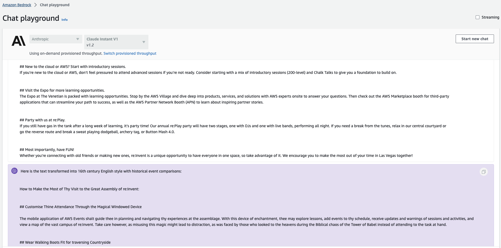

|ToC|
|---|

Friday. 13:44. Been a busy week, and I'm trying to finish off my last admin tasks. Instead, I decide to have a bit of fun. [re:Invent](https://reinvent.awsevents.com/) is just around the corner, and we're currently in what is affectionately called "pre:Invent season". Due to this, I started reading some guides people have written in the past with tips & tricks to help others get the most out of the event. I've only been to re:Invent twice so far, with vastly different experiences. First time as a customer in 2018, and last year, as an employee. The main difference for me was a 2h flight with zero timezone changes, versus my previous ~23h flights, and a 9h time difference - also way less swag (downside of being an employee).

Luckily, I will have the same 2h flight this year, and when I went searching for guides to read, I saw multiple pages of results, so I won't even try to write a new one. Instead, I'm going to have some fun and try to make them more interesting. Since generative AI and large language models (LLMs) are all the rage right now, I wanted to test out how they perform with changing the style and tone of content. I've dabbled a bit with this as part of trying to build out a style guide before, and using the LLMs to validate if content adheres to it, but that was serious work with no room for making jokes. So here we are.

I found this [AWS Blog post](https://aws.amazon.com/blogs/industries/ready-set-reinvent-how-to-prepare-for-aws-reinvent-2022/?sc_channel=el&sc_campaign=genaiwave&sc_content=friday-fun-style-changing-reinvent-guide&sc_geo=mult&sc_country=mult&sc_outcome=acq) from last year, and at the bottom, it has a nice list of bullet points to make the most out of re:Invent. I decided to use this list as the input data to modify the style using my prompts, and then proceeded to test out the styles & formats with a few different models using [Amazon Bedrock](https://docs.aws.amazon.com/bedrock/latest/userguide/what-is-service.html?sc_channel=el&sc_campaign=genaiwave&sc_content=friday-fun-style-changing-reinvent-guide&sc_geo=mult&sc_country=mult&sc_outcome=acq).

## Using Amazon Bedrock

The first step was to agree to the various end-user license agreements (EULA) via the [AWS Console](https://us-east-1.console.aws.amazon.com/bedrock/home?region=us-east-1#/modelaccess?sc_channel=el&sc_campaign=genaiwave&sc_content=friday-fun-style-changing-reinvent-guide&sc_geo=mult&sc_country=mult&sc_outcome=acq) to allow access to them via the API. To accept then, click on the `Edit` button, select the ones you want to accept, then click `Save` - I selected all of them to be able to test the different ones. I then used the AWS CLI to call the different models, and this is where I needed to do some command-line work. I wanted to be able to reuse the input text, so I added the bullet points to a file called `input_text.txt`, and used `input_prompt.txt` for my prompts. The example from the [documentation](https://docs.aws.amazon.com/bedrock/latest/userguide/api-methods-run-inference.html?sc_channel=el&sc_campaign=genaiwave&sc_content=friday-fun-style-changing-reinvent-guide&sc_geo=mult&sc_country=mult&sc_outcome=acq) shows the following:

```bash
aws bedrock-runtime invoke-model \ 
    --model-id anthropic.claude-v2 \ 
    --body "{\"prompt\": \"\n\nHuman:story of two dogs\n\nAssistant:\"}" invoke-model-output.txt
```

> 💡If you receive an error with `aws: error: argument command: Invalid choice, valid choices are:`, you need to update your AWS CLI to the latest version, Amazon Bedrock was made generally available on 28 September 2023.

### Bad Bashful Ideas

So the question is: how can I pipe in my prompt and my input text without manually doing some json formatting. Luckily I picked up some jq-fu from past experiences, so off we go with the updated version:

```bash
aws bedrock-runtime invoke-model \
    --model-id anthropic.claude-v2 \
    --body "{\"prompt\": \"\n\nHuman:$(jq -Rs . < input_prompt.txt)\n$(jq -Rs . < input_text.txt)\nAssistant:\"}" model_response_output.txt
```

And I'm greeted with `string argument should contain only ASCII characters` due to the `jq` encoded strings starting and ending a quote (`"`). For this I needed to do a search and found the following `sed` command which did the trick:

```bash
sed -e 's/^"//' -e 's/"$//'
```

Initial testing seemed to indicate this does what I expect:

```bash
# command
jq -Rs . < input_prompt.txt | sed -e 's/^"//' -e 's/"$//'

# output
Using the following text, can you please change the style to be 16th century English, and make it more dramatic by comparing mistakes you could make with historical events prior to the 17th century?\n
```

So putting it all together, this now turned into, and I thought I was done:

```bash
aws bedrock-runtime invoke-model \
    --model-id anthropic.claude-v2 \
    --body "{\"prompt\": \"\n\nHuman:$(jq -Rs . < input_prompt.txt | sed -e 's/^"//' -e 's/"$//')\n$(jq -Rs . < input_prompt.txt | sed -e 's/^"//' -e 's/"$//')\nAssistant:\"}" model_response_output.txt
```

Except I still received the same error as before: `string argument should contain only ASCII characters`. Turns out that by using `sed`, I may be stripping out the line breaks.

At this point I decided to give my tired brain a rest, and I also think I'm overcomplicating the `bash` command. I specifically wanted to use the CLI for my first test, but this shouts "write a script in a programming language" to me with my limited `bash` skills.

I ended up using the [Chat](https://us-east-1.console.aws.amazon.com/bedrock/home?region=us-east-1#/chat-playground?region=us-east-1#/modelaccess?sc_channel=el&sc_campaign=genaiwave&sc_content=friday-fun-style-changing-reinvent-guide&sc_geo=mult&sc_country=mult&sc_outcome=acq) to run my joyful prompts - I did increase the length to max values to allow outputting the full text after changing it via `Update inference configurations`.



Just to avoid any confusion, the responses below contain the generated text after providing the prompts and those bullet points.

## Attempt 1: Change the style

For the first set of experiments, I focussed on changing the style, and boy, did it deliver.


### How to Make the Most of Thy Visit to the Great Assembly of re:Invent

**The first prompt I used was:**

*Using the following text, can you please change the style to be 16th century English, and make it more dramatic by comparing mistakes you could make with historical events prior to the 17th century? Keep the same format with the list of sections, but change the style of all the text, and the headers.*

**The response:**

***Customize Thine Attendance Through the Magical Windowed Device***

*The mobile application of AWS Events shalt guide thee in planning and navigating thy experiences at the assemblage. With this device of enchantment, thee may explore lessons, add events to thy schedule, receive updates and warnings of sessions and activities, and view a map of the vast campus of re:Invent. Take care however, as misusing this magic might lead to distraction, as was faced by those who looked to the heavens during the Biblical chaos of the Tower of Babel instead of attending to the task at hand.*

***Wear Walking Boots Fit for traversing Countryside***

*Thee shall be occupied traveling between lessons, so choose footwear sturdy enough to transport thee comfortably from place to place! Wearing improper shoes might find thee struggling as did King Richard III's army, hindered from swift movement at the Battle of Bosworth due to heavy boots more fit for display than mobility.*

***Account for Time of Travel When Moving Between Activities***

*Spread across six venues, the campus of re:Invent is most broad. Be certain to calculate time for walking or riding horse-drawn carriages between places. Failed planning led Lewis and Clark to face harsh winters on the vast frontier - attend closely to timing lest thee face similar peril!*

***Attend All Lessons - Plan Thy Schedule Well in Advance***

*Only a handful of seats are reserved for those arriving at the last hour, so prepare accordingly if certain lessons thou dost wish to see. View all classes including those of leadership and smaller groups in the Printed Guide, using these records to design thy weekly plan. To reserve spots for lessons most wanted, log into thy re:Invent account and add to thy schedule. But take care - as with the Siege of Rhodes where timing was all, arrive early or risk being turned away!*

***New to the Celestial Realm or AWS? Start with Elementary Lessons***

*If clouds and AWS are yet mysteries, feel not pressured to attend advanced lessons before readiness. Consider a mixture of basic classes (level 200) and casual discussions to build foundation. Spared this route, thy learning risks becoming as the unprepared armies of Charles the Bold, whose lack of fundamentals led to defeat at Nancy.*

***Visit the Expo for Further Opportunities to Learn***

*The Expo at The Venetian overfloweth with chances to expand the mind. Visit the AWS Village and immerse in products, services and solutions with experts standing by to answer queries. Then inspect the AWS Marketplace stand for applications frompartners that may ease thy journey, as well as the APN Boothto witness inspiring tales of alliance. But beware distractions, as even famed travelers like Marco Polo lost weeks pondering wonders in bazaars when pressed for time.*

***Revel with Us at re:Play***

*If vigor remains after a week filled with learning, 'tis time for merriment! Our annual celebration re:Play shall feature two stages - one with musicians and another bearing live bands performing through the night. Should music weary, relax in our central courtyard or take the inverse path, working off energy with games of dodgeball, archery contests or Button Mash 4.0. But overindulgence might find thee the next day drained, as was King Henry after particularly lively Christmas feasts!*

***Most Importantly, Take Delight!***

*Whether renewing acquaintances or forging new bonds, re:Invent off'rs rare chance to gather all in one place. Take advantage and enjoy the company! We encourage experiencing all thy time in Las Vegas hath to offer together. Stay positive of spirit and all shall be well, as proven by Francis Drake's men who encountered hardship but prevailed through fellowship on their globe-spanning voyage.*

### With a heart full o' rum and adventure, set forth on this grand escapade through AWS re:Invent

Ok, I did not expect it to be this good / bad, but that was quite good in my opinion. Next, me matey, let's see if it survives another day, or if it will be walking the plank!


**Prompt:**

*Using the following text, can you please change the style to be in over-the-top pirate speak and more dramatic? Keep the same format with the list of sections, but change the style of all the text, and the headers.*

**Response:**

*Arrr, here be me guide to makin' the most o' yer time at tha fearsome re:Invent gatherin'!*

***Customize yer plunderin' wy' usin' tha scallywag mobile app***

*Tha AWS Events mobile app be yer true first mate in plannin' an' navigatin' yer re:Invent experience. Wit' tha app, ye can explore sessions, add events to yer planner, get updates an' notifications about sessions an' activities, an' view a map o' tha re:Invent campus.*

***Wear yer heartiest boots***

*Ye’ll be busy walkin' from session to session, so make sure ye wear boots that'll get ye from point A to point B without complaint!*

***Figure yer travel time when movin' between swashbucklin' activities***

*Spread across six venues, tha re:Invent campus be a vast stretch o' land, so be sure t' factor in travel time whether by foot or catchin' tha shuttles.*

***Don’t be missin' any sessions – plan yer schedule ahead o' time***

*Only a handful o' session seats be saved fer walk-ups, so plan accordingly if ye have sessions that ye know ye want t' see. Ye can view all sessions includin' leadership an' breakouts in tha Session Catalog an' Attendee Guide, so be sure t' use these resources when plannin' yer schedule fer tha week. Arrr, t' reserve seats fer tha sessions that ye most want t' view, log into yer AWS re:Invent account, an' add sessions t' yer schedule or download 'em to yer calendar. Note: session seats be first come, first served, so arrive early!*

***Be ye new t' tha cloud or AWS? Start wit' introductory sessions***

*If ye be new t' tha cloud or AWS, don’t feel pressure t' attend advanced sessions if ye be not ready. Consider startin' wit' a mix o' introductory sessions (200-level) an' Chalk Talks t' give ye a foundation t' build on.*

***Visit tha Expo fer more learnin' opportunities***

*Tha Expo at Tha Venetian be packed wit' learnin' opportunities. Stop by tha AWS Village an' dive deep into products, services, an' solutions wit' AWS experts onboard t' answer yer questions. Then check out tha AWS Marketplace booth fer third-party applications that can streamline yer path t' success, as well as tha AWS Partner Network Booth (APN) t' learn about inspirin' partner stories.*

***Party wit' us at re:Play***

*If ye still have rum in tha hold after a long week o' learnin', it’s party time! Our annual re:Play party will have two stages, one wit' DJs an' one wit' livin' bands, performin' all night. If ye need a break from tha tunes, relax in our central courtyard or go tha reverse route an' break a sweat playin' dodgeball, archery tag, or Button Mash 4.0.*

***Most importantly, have yerself a grand adventure!***

*Whether ye’re connectin' wit' old mates or makin' new ones, re:Invent be a unique chance t' have everyone in one place, so take advantage o' it. We encourage ye t' make tha most out o' yer time in Las Vegas together!*

Apologies to all the spell checkers out there, this one will trigger a bunch!

## Attempt 2: Change the format

Next up, I wanted to see how good LLMs are at changing the format, and again, I was not disappointed!

### Certainly! Let's navigate AWS re:Invent through the lyrical avenues of poetry

**For the first prompt, I used:**

*Using the following text, can you please change the style and rewrite it as a poem that is more dramatic?*

**Response:**
*Re:Invent Calls You In*

*The app shall be your guide through this vast domain*<br>
*Custom made to steer your schedule and plans *<br>
Footware so sturdy to trek from place to place*<br>
*Across the campus vast, six venues spread*<br>

*calculate your time as you hurry along*<br>
*From session to session without a second to spare*<br>
*Lest you miss what's in store and seats filled fast*<br>
*Plan your times, reserve your places in advance*<br>

*Newcomers take caution, start lessons begin*<br>
*Intro sessions first before advanced you gin*<br>
*Knowledge you must seek in the expo halls*<br>
*AWS village and partners their wares unfold*<br>

*Replays calls you after a week of great lore*<br>
*Music and fun to dance the night away*<br>
*Or rest your feet as games entertain galore*<br>
*Dodge and arch beneath the stars bright ray*<br>

*But most of all have spirit and cheer enow*<br>
*For friends old and new fill this space with you now*<br>
*Seize this chance so rare all together as one*<br>
*Make memories to cherish when reinvent is done*<br>

Doubt this will pluck anyone's heartstrings, but good rhythm and rhyme.

### Throw your hands up, from dawn to dusk, At AWS re:Invent, innovation's a must!

I was introduced to "Nerd Core" with a video of Seth Vargo doing a rap about tech years and years ago, and it caught me by surprise as I had never considered this combination of style for technical content! So off we go, let's see how we can make these tips & tricks more entertaining!

**Prompt:**

*Using the following text, can you rewrite it as a rap song please?*

**And the response:**

*Yo yo yo, it's time for re:Invent*<br>
*I'm boutta drop some facts before I went*<br>
*First thing first, you gotta plan your flow*<br>
*Download the app so you know where to go*<br>
*Customize your schedule, pick your sessions tight*<br>
*Add them to your planner so you right on time*<br>

*Make sure your kicks are comfortable too*<br>
*Gonna be walkin a lot the whole week through*<br>
*Spread across six venues you know we don't play*<br>
*Factor in travel time from A to B each day*<br>

*Don't be missing out on the dope sessions Brah*<br>
*Plan that ish in advance, no slackin ya*<br>
*Only a few seats left for walk up plays*<br>
*Better plan your schedule early in the days*<br>

*If you new to the cloud, just getting your start*<br>
*Don't stress, begin with the intro sessions smart*<br>
*Get that base knowledge before you level up*<br>
*Mix in some Chalk Talks so you learn what's up*<br>

*When you done with classes, head to the Expo floor*<br>
*Learn from the pros, they'll teach you for sure*<br>
*Stop by the village and partners booths too*<br>
*Third party apps that make your work smoother*<br>

*After all that grind, it's time to unwind*<br>
*At the re:Play party we gonna shine, shine*<br>
*Two stages bumpin, one with DJs*<br>
*One with live bands jammin all day*<br>
*Or take a break in the courtyard chillaxin*<br>
*Or play some games, get your exercise smashin'*<br>

*Most important thing homie, just have a blast!*<br>
*Connect with people, old friends and new faces last*<br>
*Take advantage of everyone all in one spot*<br>
*Make the most of your time, you feel me? Don't stop!*<br>
*Yo that's my rap, hope it helped explain*<br>
*Now get ready for re:Invent, it's about to be lit maing! Peace out!*<br>

## Attempt 3: Extend the content

Now that we've dropped the mic, let's look at something more real-world. Using generative AI to augment content is where I find the most value - to see if I missed any important points that I should include. I don't want it to write for me, just help me improve my writing. With this in mind, I asked the following:

*Are there any additional tips you would give while attending re:Invent based the following list?*

**Response:**

*Here are some additional tips I would offer based on the list provided:*

- *Connect with other attendees on the AWS forums or via social media before the event. You can find potential session partners or people to meet up with at meals/events.*
- *Plan a buffer between sessions to allow time for Q&A, walking between venues, bathroom breaks, etc. Don't feel obligated to rush from one session straight to the next.*
- *Prioritize the sessions you most want to attend and be flexible with your schedule for others. Sometimes unexpected topics end up being most valuable.*
- *Bring a small notebook and pen to take notes in sessions. Jotting down key takeaways and questions will help you retain information.*
- *Visit the expo early to avoid long lines and crowds. Check out the demo areas when they're less busy.*
- *Keep an open mind and take opportunities to learn beyond just the sessions. Chatting with exhibitors and other attendees can provide great insights.*
- *Consider joining informal networking events like lunches/dinners organized by user groups if you want to dive deeper on specific topics.*
- *Pace yourself throughout the week! Rehydrating, eating healthy snacks, and taking breaks will help you maximize your experience.*

## Conclusion

While these attempts were purely for my entertainment, I have found LLMs also useful to help with crafting response emails, especially ones where I need to tone things down a bit, or to more clearly communicate the finer points of a nuanced, complex idea. If you are just getting started, take a look at the [ABCs of Generative AI](/posts/the-abcs-of-generative-ai), [How to Learn Generative AI from Scratch](/posts/how-to-learn-generative-ai-from-scratch), and have a look at [this curated collection](/generative-ai) of content. Now I'm logging off for the week, and remember folks: be polite to your helpful assistants by saying "please" and "thank you", even though they tell you they don't have feelings if you ask them!

## Input text to change

Here is how I formatted the text before using it as part of the prompt:

```text
How to make the most of your time at re:Invent:

## Customize your visit by using the mobile app
The AWS Events mobile app is your companion in planning and navigating your re:Invent experience. With the app, you can explore sessions, add events to your planner, get updates and notifications about sessions and activities, and view a map of the re:Invent campus.

## Wear comfortable shoes. 
You’ll be busy walking from session to session, so make sure you wear shoes that will get you from point A to point B comfortably!

## Calculate travel time when moving from one activity to the other.
Spread across six venues, the re:Invent campus is quite large, so be sure to factor in travel time either walking from place to place or catching shuttles.

## Don’t miss any sessions – plan your schedule in advance.
Only a handful of session seats are saved for walk-ups, so plan accordingly if you have sessions that you know you want to see. You can view all sessions including leadership and breakout in the Session Catalog and Attendee Guide, so be sure to use these resources when planning your schedule for the week. To reserve seats for the sessions that you want to view the most, log into your AWS re:Invent account, and add sessions to your schedule or download them to your calendar. Note: session seats are first come, first served, so arrive early.

## New to the cloud or AWS? Start with introductory sessions.
If you’re new to the cloud or AWS, don’t feel pressured to attend advanced sessions if you’re not ready. Consider starting with a mix of introductory sessions (200-level) and Chalk Talks to give you a foundation to build on.

## Visit the Expo for more learning opportunities.
The Expo at The Venetian is packed with learning opportunities. Stop by the AWS Village and dive deep into products, services, and solutions with AWS experts onsite to answer your questions. Then check out the AWS Marketplace booth for third-party applications that can streamline your path to success, as well as the AWS Partner Network Booth (APN) to learn about inspiring partner stories.

## Party with us at re:Play.
If you still have gas in the tank after a long week of learning, it’s party time! Our annual re:Play party will have two stages, one with DJs and one with live bands, performing all night. If you need a break from the tunes, relax in our central courtyard or go the reverse route and break a sweat playing dodgeball, archery tag, or Button Mash 4.0.

## Most importantly, have FUN!
Whether you’re connecting with old friends or making new ones, re:Invent is a unique opportunity to have everyone in one space, so take advantage of it. We encourage you to make the most out of your time in Las Vegas together!
```
