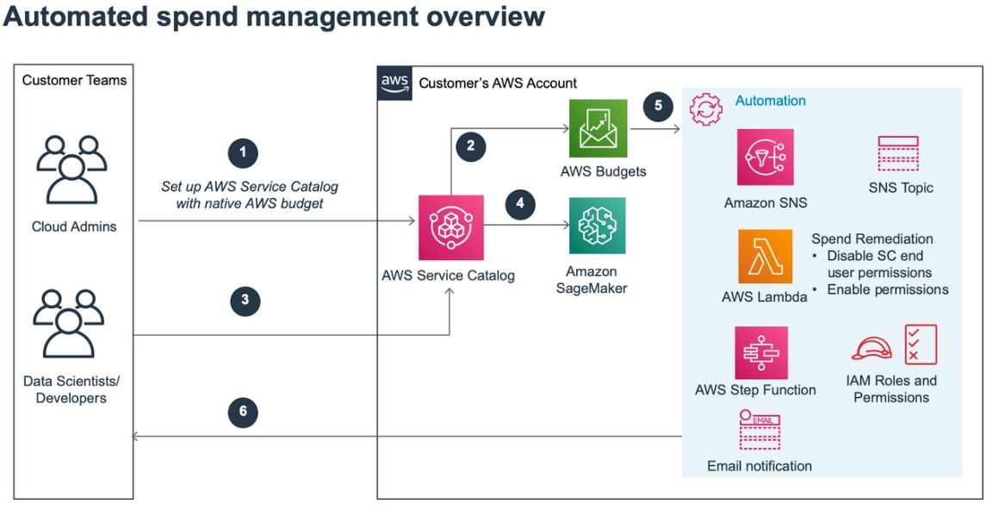

Have you ever been in cloud chaos situations, where you've found the resource cost has gone beyond your monthly budget unexpectedly? This can be caused by resources created more than actual needs, unattended long running instances, idle resources, etc. Meanwhile, have you desired to operate your cloud resources in an automatic way that allows you to focus more on your core business, and less on manual resource management to comply with your budget?

If that's the case, this post can help you take some practical actions to achieve the cloud cost control automation. These actions are organized to enable the automatic cloud cost control service portal, automatic stop of EC2 instances with low utilization in non-production environment, and automatic cost anomaly detection, which come together to offer you the following benefits:

* **Present a user friendly cost control service portal** - This approach allows you to enforce cost control to comply with your monthly budget plan, while maintaining the self-service model without unnecessary approval process that might impact your developers' productivity.
* **Stop low utilization EC2 instances by using AWS Trusted Advisor metrics to avoid unnecessary cost** - The low utilization resources largely contribute to unexpected cost, which can be effectively remediated through automatic stopping those resources upon Trusted Advisor's metrics.
* **Automatic alerts of cost anomaly powered by Machine Learning Capability** - This feature allows you to define specific cost anomaly settings to trigger alerts whenever cost anomaly is detected, so you can action on those abnormal resource consumption to save cost.

Basically you can implement all of the above solutions in your AWS non-production environment to automatically control cloud cost, while you can also jump to the specific section that can add the most value to your organization to start with. Now let's take a quick look for each solution.

## Automate Cost Control Using AWS Service Catalog and AWS Budgets

To enable the automated spend management capability at the point of self-service resource provisioning, We've built a serverless automated cost governance blueprint based on [this blog](https://aws.amazon.com/blogs/aws-cloud-financial-management/cost-control-blog-series-2-automate-cost-control-using-aws-service-catalog-aws-budgets/), using [AWS Service Catalog](https://aws.amazon.com/servicecatalog/) and [AWS Budgets](https://aws.amazon.com/aws-cost-management/aws-budgets/). In a nutshell, AWS Service Catalog allows you to pre-approve services for your users. With its integration with AWS Budgets, you can create and associate budgets with portfolios and products, and keep your developers informed the resource costs for them to run cost-aware workloads.

### How It Works

We use the workflow in the blog "[Enable self-service, secured data science using Amazon SageMaker notebooks and AWS Service Catalog](https://aws.amazon.com/blogs/mt/enable-self-service-secured-data-science-using-amazon-sagemaker-notebooks-and-aws-service-catalog/)" as an example to showcase how this cost control mechanism works. In this case, a developer possesses the necessary permissions to initiate [Amazon SageMaker](https://aws.amazon.com/sagemaker/) at the beginning of the month, given the monthly budget remains sufficient. The spend management automation comes into play when the forecasted cost reaches 60% of the monthly budget. Despite retaining the capability to launch SageMaker, the developer's access is limited to smaller instance sizes and families. Consequently, the privilege to launch new GPU instances is revoked for the remainder of the month. As the forecasted cost approaches 95% of the allowed monthly budget, the spend management automation will step in again, completely preventing the developer from launching SageMaker. This highly effective automation ensures that the monthly budget won't be exceeded and grants cloud administrators the means to maintain budgetary control effectively.

Architectural view from the blog "[Cost Control Blog Series #2: Automate Cost Control using AWS Service Catalog and AWS Budgets](https://aws.amazon.com/blogs/aws-cloud-financial-management/cost-control-blog-series-2-automate-cost-control-using-aws-service-catalog-aws-budgets/)" 

Let's take a closer look for the detail workflow:

1. The AWS Service Catalog Product "SageMaker Project" comes with a pre-configured budget to facilitate efficient spend tracking. This feature empowers users to create and associate budgets with Service Catalog portfolios and products, keeping track of their expenditures effectively.
2. As part of the budget setup, users can configure notifications to be sent via an [Amazon SNS](https://aws.amazon.com/sns/) topic when the spending approaches or exceeds the allocated budget amount. Please refer to [Creating an Amazon SNS topic for budget notifications](https://docs.aws.amazon.com/cost-management/latest/userguide/budgets-sns-policy.html) for further information.
3. When the SNS notification is received, a master Lambda function is invoked.
4. The lambda function will initiate the execution of a Step Functions state machine, which operates with specific parameters, facilitating the execution of the configured action.
5. Within the state machine, an action Lambda function is triggered as a task. This function interacts with IAM (Identity and Access Management) to effectively revoke the user's permissions to utilize the product catalog or create new AWS SageMaker resources, ensuring compliance with the budget plan.

### Implementation

You can follow the blog "[Cost Control Blog Series #2: Automate Cost Control using AWS Service Catalog and AWS Budgets](https://aws.amazon.com/blogs/aws-cloud-financial-management/cost-control-blog-series-2-automate-cost-control-using-aws-service-catalog-aws-budgets/)" to launch this automatic cost control mechanism. 

## Stop Low Utilization EC2 Instances by Using AWS Trusted Advisor Metrics

[AWS Trusted Advisor](https://aws.amazon.com/premiumsupport/technology/trusted-advisor/) provides recommendations to help you follow AWS best practices, which can optimize your infrastructure including cost reduction. With [AWS Business Support](https://aws.amazon.com/premiumsupport/plans/business/) and [AWS Enterprise Support](https://aws.amazon.com/premiumsupport/plans/enterprise/), AWS customers can access all Trusted Advisor checks to conduct cost optimization, while being able to call [AWS support APIs](https://docs.aws.amazon.com/awssupport/latest/user/about-support-api.html) to programatically interact with Trusted Advisor. 

### How It Works

The key idea is to build automation to stop low utilization EC2 instances based on Trusted Advisor's metrics, with detail workflow as below:

1. Create an Amazon IAM role that the [AWS Lambda](https://docs.aws.amazon.com/lambda/latest/dg/welcome.html) function will use. Access the IAM console and attach the necessary IAM policy to this role. You can find detailed instructions on how to create an IAM policy in the [IAM Policy Creation Documentation](http://docs.aws.amazon.com/IAM/latest/UserGuide/access_policies_create.html). Additionally, you may refer to the guide on creating an IAM role specifically for Lambda: [IAM Role Creation for Lambda Documentation](http://docs.aws.amazon.com/IAM/latest/UserGuide/id_roles_create_for-service.html#roles-creatingrole-service-console).
2. Create a Lambda function using the provided JavaScript [sample](https://github.com/aws/Trusted-Advisor-Tools/blob/master/LowUtilizationEC2Instances/LambdaFunction.js). During the creation of the Lambda function, ensure that you select the IAM role you created in step 1. Customize the configuration section of the Lambda function by setting appropriate tags and the desired region based on your requirements. For more information about Lambda and its setup, consult the AWS Lambda Developer Guide: [Getting Started with Lambda](http://docs.aws.amazon.com/lambda/latest/dg/getting-started.html).
3. Trigger the Lambda function created in step 2 by establishing an [Amazon CloudWatch Event](https://docs.aws.amazon.com/AmazonCloudWatch/latest/events/WhatIsCloudWatchEvents.html) rule. This rule should match the WARN status and correspond to the Low Utilization EC2 Instances Trusted Advisor check. You can refer to the [CloudWatch Event Pattern](https://github.com/aws/Trusted-Advisor-Tools/blob/master/LowUtilizationEC2Instances/CloudwatchEventPattern) as an example. For guidance on creating a Trusted Advisor CloudWatch events rule, refer to the following documentation: [Trusted Advisor CloudWatch Events Rule Creation](http://docs.aws.amazon.com/awssupport/latest/user/cloudwatch-events-ta.html).

By following these steps, you'll have successfully set up the necessary components in your AWS environment to execute the Lambda function when specific conditions are met.

### Implementation

You may follow the above steps to manually create the CloudWatch event rule alongside the Lambda function. Alternatively, you can refer to the [Trusted Advisor Tools github repo](https://github.com/aws/Trusted-Advisor-Tools/tree/master/LowUtilizationEC2Instances) to use the CloudFormation stack to automatically provision the solution. Once the solution has been launched, the CloudWatch event rule will invoke the lambda function when the status of Trusted Advisor check "Low Utilization Amazon EC2 Instances" is "WARN", so the lambda function will automatically stop those low utilized EC2 instances.

## Automatic Cost Anomaly Detection

[AWS Cost Anomaly Detection](https://aws.amazon.com/aws-cost-management/aws-cost-anomaly-detection/) leverages Machine Learning capability to identitfy anomalous spend and root causes, so you can quickly take action. With AWS Cost Anomaly Detection, you are empowered to create a customized monitoring system that keeps you informed about any unusual spending patterns. By leveraging this service, you can allow developers to focus on building while ensuring your expenses will be monitored automatically, minimizing the risk of unexpected billing issues.

To get started, set up AWS Cost Anomaly Detection either through the AWS Cost Explorer API or directly in the Cost Management Console. Once your monitoring preferences and alert settings are configured, AWS will notify you through individual alerts or daily/weekly summaries via SNS or emails. Additionally, you have the flexibility to conduct your own anomaly analysis within AWS Cost Explorer, to unlease further monitoring capabilities.

### How It Works

You can follow the below steps to enable the automatic Cost Anomaly Detection:

1. **Create a cost monitor** - A cost monitor can be configured to analyze your AWS services independently or by member accounts, cost allocation tags or cost categories. Creating multiple monitors is possible if there is a need to analyze spend across different segments. 
2. **Configure alert subscription** - In this step you can define the alerting frequency and alert recipients. Here's the [official guide](https://docs.aws.amazon.com/cost-management/latest/userguide/getting-started-ad.html#create-ad-alerts) to create your cost monitors and alert subscription.
3. **Edit your alerting perferences** - You can adjust your cost monitors and alert subscriptions in AWS Billing and Cost Management to match your needs. This includes subscription name, threshold, frequency, recipients, etc. refer to [this document](https://docs.aws.amazon.com/cost-management/latest/userguide/edit-alert-pref.html) for further details.
4. **Analyse the detected cost anomaly** - In this step you've got notified with detected cost anomaly. You can go to the overview page of Cost Anomaly Detection to view details of these anomaly items. 

By default, the anomalies are sorted based on their Start date. However, users have the option to click on any column name, such as "Total cost impact," "Impact percentage," "Accounts," etc., to sort the anomalies based on a different property. This functionality allows users to prioritize and focus on anomalies with the highest total cost impact or the greatest percentage impact, tailoring their analysis to suit their specific needs.

You can follow the AWS Well-Architected lab "[COST ANOMALY DETECTION](https://wellarchitectedlabs.com/cost/200_labs/200_6_cost_anomaly_detection/)" to walk through the detail steps of configuring the AWS Cost Anomaly Detection, with guidance of analysing those automatically identified items before you take cost optimization actions.

## Conclusion

This blog post focus on cost control automation, with introductions on 3 various solutions to help you enable a cost aware service catalog, automatically stop low utilization instances, and analyse cost anomaly items to avoid unexpected resource consumption in non-production environment. 

You can select a specific solution that work for your use case, or consider implementing all of the above cost control automations as they are compliment with each other. We hope this post provides valuable insight to help you achieve cost optimization.
