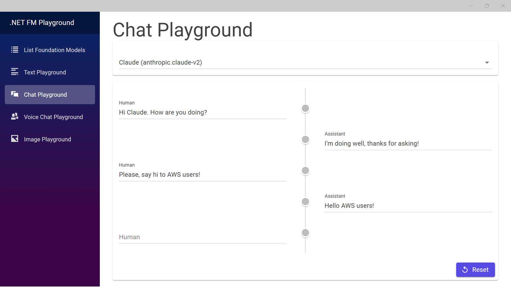

***TL;DR;*** *Amazon Bedrock enables .NET developers to easily access leading foundation models like Claude, Jurassic, Stable Diffusion and others through a single API using the [AWSSDK.BedrockRuntime Nuget package](https://www.nuget.org/packages/AWSSDK.BedrockRuntime). The post introduces Amazon Bedrock, walks through setting up the .NET SDK, and introduces a sample app to showcase using Amazon Bedrock in a .NET app.*

## Introduction

For .NET developers, we are entering an exciting new era of software development empowered by foundation models. Foundation models are the key stones of the Generative AI systems capable of generating text, images or other media. The applications we build in the future will be fundamentally different thanks to the capabilities of these models. The way we build software is also evolving as we figure out how to best leverage and integrate foundation models into our applications. 

We're still just at the beginning of unlocking the full potential of foundation models. While models like Claude, Jurassic-1, and DALL-E 2 demonstrate impressive capabilities today, we don't yet know what the best or most capable foundation models will look like in 5 or 10 years. This makes flexibility and easy integration critical. 

Amazon Bedrock allows .NET developers to tap into leading foundation models through a single API today, while maintaining the flexibility to adopt new models in the future. As we'll explore next, Bedrock opens the door to rapid foundation model innovation for .NET developers. We are entering a new and exciting time in software development thanks to the emergence of foundation models.

## Overview of Amazon Bedrock

Announced in April 2023 and promoted to general availability in September 2023, Amazon Bedrock is a fully managed AWS service that provides access to a range of leading foundation models through a single API. It enables you to integrate the capabilities of foundation models into your applications without needing machine learning expertise. 

Amazon Bedrock currently offers access to high-performing foundation models from AI21 Labs, Anthropic, Cohere, Stability AI, and Amazon, with access coming soon to models from Meta. This gives you a choice of different models and capabilities through the same Amazon Bedrock API. For a full list of available models, you can look [here](https://docs.aws.amazon.com/bedrock/latest/userguide/model-ids-arns.html).

AWS allows you to access this single API using the same authentication and authorization mechanisms you already use to access your AWS services, including access to an enterprise-ready audit of your Bedrock usage. And, its SDK for .NET makes it easy to interact with the API. You can think of Amazon Bedrock as the serverless service of foundation models.

For .NET developers, Amazon Bedrock provides an opportunity to quickly build natural language capabilities into apps. Rather than train and host custom models, developers can leverage leading foundation models with just a few lines of code. Next we'll walk through getting started with Amazon Bedrock using the AWS SDK for .NET.


## Walkthrough of AWS SDK for .NET setup for using Amazon Bedrock

To start using Amazon Bedrock's foundation models in your .NET applications, you first need to install the related NuGet packages from the AWS SDK for .NET. 

This can be done easily via the NuGet package manager in Visual Studio. First, open your .NET project in Visual Studio and right click on the project in Solution Explorer. Select "Manage NuGet Packages". Search for "AWSSDK.Bedrock". You will get two packages as a result for this search:

- AWSSDK.Bedrock
- AWSSDK.BedrockRuntime

You can also execute the following commands using the .NET Command Line Interface (CLI):
```bash
dotnet add package AWSSDK.Bedrock
dotnet add package AWSSDK.BedrockRuntime
```

The first package, AWSSDK.Bedrock, offers the client object to call Bedrock management API actions like ListFoundationModels.. You can find the full list of supported Bedrock API actions in the [AWS SDK for .NET API reference documentation](https://docs.aws.amazon.com/sdkfornet/v3/apidocs/items/Bedrock/TBedrockClient.html). The second package, AWSSDK.BedrockRuntime, offers the client object to call Bedrock model invocation API actions:
- InvokeModel
- InvokeModelWithResponseStream 

To invoke a model, install the latest version of [AWSSDK.BedrockRuntime](https://www.nuget.org/packages/AWSSDK.BedrockRuntime). This will automatically install the core AWSSDK.Core package as well. With the NuGet package installed, you can initialize a *AmazonBedrockRuntimeClient* object. It handles all communication with the Bedrock API. Be sure to setup a region where Bedrock is deployed. You can find the full list of regions supporting Bedrock in [AWS Documentation](https://docs.aws.amazon.com/bedrock/latest/userguide/what-is-bedrock.html#bedrock-regions). The following code invokes Claude v2 large language model using the client object. You instantiate an *InvokeRequest* object, set its properties and, then, call the *InvokeModelAsync* method of the *AmazonBedrockRuntimeClient* object.

```csharp
internal class Program
{
    static async Task Main(string[] args)
    {
        // Instantiate the client object
        AmazonBedrockRuntimeClient client = new(
            new AmazonBedrockRuntimeConfig()
            {
                RegionEndpoint = RegionEndpoint.USEast1
            }
        );

        // Instantiate the request object
        InvokeModelRequest request = new InvokeModelRequest()
        {
            // Set ContentType property to indicate we are sending inference parameters as a Json object. For Stable Diffusion model, it could be 'img/png'
            ContentType = "application/json",
            // Set Accept property to indcate we are expecting result as Json object. Again, for Stable Diffusion model, it could also be 'img/png'
            Accept = "application/json",
            // Set ModelId property which foundation model you cant to invoke. You can find the list of Model Ids you can use at https://docs.aws.amazon.com/bedrock/latest/userguide/model-ids-arns.html
            ModelId = "anthropic.claude-v2",
            // Serialize to a MemoryStream the Json object containing the inference parameters expected by the model. Each foundation model expects a different set of inference parameters in different formats (application/json for most of them). It is up to you to know what you need to provide in this property and the appropriate format.
            Body = new MemoryStream(
                Encoding.UTF8.GetBytes(
                    JsonSerializer.Serialize(new
                    {
                        prompt = "\n\nHuman:Explain how async/await work in .NET and provide a code example\n\nAssistant:",
                        max_tokens_to_sample = 2000
                    })
                )
            )
        };

        // Call the InvokeModelAsync method. It actually calls the InvokeModel action from the Amazon Bedrock API
        InvokeModelResponse response = await client.InvokeModelAsync(request);

        // Check the HttpStatusCode to ensure successful completion of the request
        if (response.HttpStatusCode == System.Net.HttpStatusCode.OK)
        {
            // Deserialize the Json object returned in a plain old C# object (POCO). Here, we use the ClaudeBodyResponse internal class defined bellow
            ClaudeBodyResponse? body = await JsonSerializer.DeserializeAsync<ClaudeBodyResponse>(
                response.Body,
                new JsonSerializerOptions() {
                    PropertyNameCaseInsensitive = true
                });
            // Write the completion string to the console
            Console.WriteLine(body?.Completion);
        }
        else
        {
            Console.WriteLine("Something wrong happened");
        }
    }

    /// <summary>
    /// Internal POCO defining Claude reponse
    /// </summary>
    internal class ClaudeBodyResponse
    {
        /// <summary>
        ///  Claude text answer
        /// </summary>
        public string? Completion { get; set; }

        /// <summary>
        /// Reason the model as stopped to generate text.
        /// It may have reached the max number of token to generate.
        /// It may have reached a state where the most likely next
        /// word is no word but the end of the text. 
        /// </summary>
        public string? Stop_Reason { get; set; }
    }
}
```
To discover the format of the inference parameters and model result, I suggest you to directly read the documentation of the foundation model you are using.

## Introducing .NET FM Playground sample app

The above code snippets show you how to invoke a foundation model but I want to give you more than just a code snippets. So I am pleased to introduce the .NET Foundation Model (FM) Playground. You can find its source code on [GitHub](https://github.com/build-on-aws/dotnet-fm-playground). This sample application is inspired by the different playgrounds you find in the Amazon Bedrock Console. They help you to test the different foundation models and get a sense of what you can do with them. 

I’ve borrowed this goal but built it with C#. My goal is to show you, .NET developers how you can unlock the power of foundation models with Amazon Bedrock. In order to let you test and interact with the different foundation models, the .NET FM Playground offers you four playground:
- A text playground allowing you to exercise your prompt engineering skills with different models
- A chat playground allowing you to chat with different models
- A voice chat playground allowing you to discuss with different models
- An image playground allowing you to generate images from text prompts

In addition, it also lists and displays the foundation models you have access to and their characteristics. 



It is a .NET MAUI Blazor Hybrid application. For now, you can build it and run it on Windows and MacOS. It requires you to configure your default AWS profile with credentials giving you access to Amazon Bedrock. You can learn more about [granting programmatic access](https://docs.aws.amazon.com/bedrock/latest/userguide/setting-up.html) and [setting up permissions](https://docs.aws.amazon.com/bedrock/latest/userguide/security-iam.html) in the Amazon Bedrock documentation. The [*README.md*](https://github.com/build-on-aws/dotnet-fm-playground) file gives you more information on the prerequisite, how to setup the project and your AWS account.

For example, an AWS account does not have access to foundation models by default. An Admin user with IAM access permission can request access to models using the model access page. You can learn more about managing model access [here](https://docs.aws.amazon.com/bedrock/latest/userguide/model-access.html).

## Final thoughts

We are at the very beginning of the Generative AI era. Those technologies will deeply impact the way we build software in the future but also the capabilities of software we build. Every month, you see new announcements about groundbreaking advances that enable some foundation models with lower numbers of parameters to reach performance and accuracy of larger foundation models or new models beating new records. 

No one can predict which model provider will build the next most interesting foundation models and where the Generative AI industry will land in the coming years. Knowing this, the best decision you can take today is to experiment and stay familiar with as many different foundation model providers as possible.

That’s exactly what Amazon Bedrock enables .NET developers: unlocking the power of foundation models now to build new experiences for your customers while delaying deep engagement with one foundation model provider. You can evaluate different foundation models to evaluate which ones are best for your use cases, build your application and still decide to change your mind later with reduced impact. You will still continue to use the same API with the same operation and security model.

I really encourage you to go fork the [.NET FM Playground repository](https://github.com/build-on-aws/dotnet-fm-playground) and start exploring the power of foundation models!