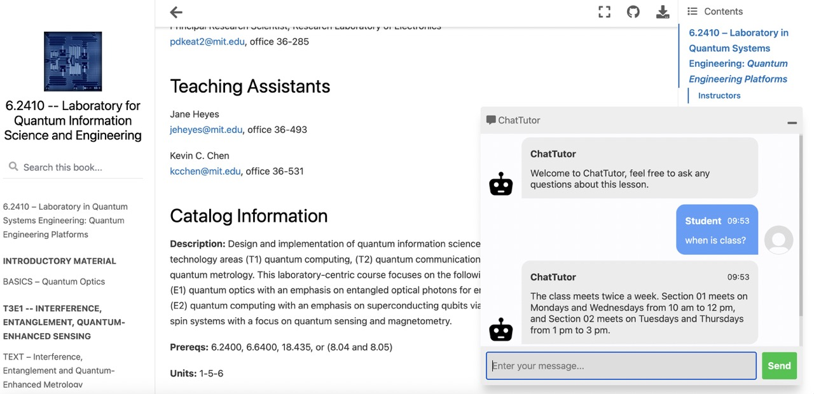

|ToC|
|---|

Newly accessible and user-friendly generative artificial intelligence (AI) tools are [transforming the education sector](https://www.chronicle.com/article/how-will-artificial-intelligence-change-higher-ed). There has been a considerable amount of debate about if and how AI can and should be used in the classroom. For students, how can AI fit into their educational journey? For educators, how can students be guided about its legitimate, fair and transparent use? And for administrators, can these tools help them streamline manual processes?
In this blog post, let's take a tour of the current state of generative AI in the classroom, discuss the particular challenges that educational institutions face in a moment of rapid technological change, and discover some ways that these tools may be appropriately used within an educational context.

## A 'Calculator' Moment

Before we can discuss how these tools can be used in the classroom, let's define this moment of rapid change - some call it the second industrial revolution. [AI is the field of computer science](https://aws.amazon.com/machine-learning/what-is-ai/?sc_channel=el&sc_campaign=genaiwave&sc_content=genai-for-edu&sc_geo=mult&sc_country=mult&sc_outcome=acq) dedicated to solving cognitive problems commonly associated with human intelligence, such as learning, problem solving, and pattern recognition. Trained on vast quantities of data, these systems now touch many aspects of our lives, from [wildlife conservation](https://www.theguardian.com/environment/2022/feb/21/five-ways-ai-is-saving-wildlife-from-counting-chimps-to-locating-whales-aoe) to powering [autonomous vehicles](https://news.mit.edu/2022/ai-autonomous-driving-idle-0517)_,_ and much more. Generative AI, which dominates the current discourse, is a subset of AI that, when trained on a vast corpus of data, can generate realistic output that reflects the characteristics of the training data but does not regenerate it verbatim. "It can produce a variety of novel content, such as images, video, music, speech, text, software code and product designs." ([source](https://www.gartner.com/en/topics/generative-ai)) Some have termed this moment a 'calculator moment' akin to the introduction of calculators to math classrooms, which forced changes to teaching methods, assessment, and curriculum design - and are still [controversial](https://www.theatlantic.com/education/archive/2016/12/the-conundrum-of-calculators-in-the-classroom/493961/) even though they were introduced in the 1970s.

No matter what their professors may say, however, students have widely adopted new generative AI tools to help them in their homework and other tasks.  One of the best-known among these tools is the ChatGPT chatbot which uses a large language model (LLM) to answer a large variety of questions in a conversational interface. Students quickly realized how powerful this tool is to write their papers and, much to many educators' chagrin, very quickly began using it wholesale. In a recent survey, 89% of students admitted to using ChatGPT ([source](https://www.forbes.com/sites/chriswestfall/2023/01/28/educators-battle-plagiarism-as-89-of-students-admit-to-using-open-ais-chatgpt-for-homework/?sh=7444d383750d)). Its usage statistics seem to be directly correlated to the school year's cadence; it declined in use over the summer months while US students were out of the classroom, and is [currently bouncing back](https://www.similarweb.com/blog/insights/ai-news/chatgpt-character-ai-2/) just in time for the new semester.

ChatGPT, of course, is only one of many Generative AI tools. The LLMs on which they are based are trained on a wide variety of texts primarily scraped from the internet so as to be capable of generating novel text based on that training. These tools have become so good at generating content based on prompts that it can be [hard to determine](https://www.technologyreview.com/2022/12/19/1065596/how-to-spot-ai-generated-text/) what is AI-generated and what was written by a human. Even though it can sound utterly convinced of its rectitude, when prompted for information on which the model is less trained, the AI tool can generate information that contains gaps or "hallucinations" - text that is not entirely factual or even completely wrong. Simple math problems can utterly confound them: "Sally (a girl) has 3 brothers. Each brother has 2 sisters. How many sisters does Sally have?" The correct answer is 1, but no LLM was able to answer correctly in this [benchmark study](https://benchmarks.llmonitor.com/sally). While last semester was a '[wild west](https://www.insidehighered.com/opinion/views/2023/09/07/what-students-said-about-spring-chatgpt-opinion)' of AI experimentation by students that was met by blanket bans, false positives, and self-policing experiments, the coming school year may well be a flashpoint where students will have to align to faculty expectations around fair use of these tools. Faculty likewise will have to change their ideas to adapt. To do this, the classroom will have to evolve.

## A Flashpoint in Education

Disruptive technology brings both new opportunities and obstacles to the industries they impact, and generative AI tools are already transforming the education sector. It is of course important to understand that the sector is not monolithic, and that administrators have different concerns than students or faculty members. Similarly, each academic discipline will need to adapt somewhat differently to the challenges and promise of rapid generative AI tooling adoption.

For administrators and faculty members, AI can be a great help in managing repetitive tasks around classroom management. For example, generative AI tools can help generate learning objectives, automate scheduling of classrooms and classes, answer frequently asked questions, and help create differentiated lesson plans. [Sal Khan](https://www.youtube.com/watch?v=hJP5GqnTrNo), founder of Khan Academy, a learning platform, expresses great optimism on how these tools can help students complete tasks and challenges in real-time by using an embedded chatbot that can help answer questions, remove barriers, and coach for improvements as the student progresses. ([source](https://www.nytimes.com/2023/06/26/technology/newark-schools-khan-tutoring-ai.html)). By conducting a pilot in Newark public schools, Khan Academy was able to refine the tool to better meet teachers' expectations.

At the same time, concerns around privacy and sharing sensitive student data should prevent teachers and administrators from feeding these LLMs with student PII in order to generate, for example, a roster. The recent article on the Open AI blog, [Teaching with AI](https://openai.com/blog/teaching-with-ai), offered suggestions on how educators can use generative chatbots in classroom debate simulations, crafting quizzes and lesson plans, and, most importantly, helping non-native English speakers improve their command of written English. Less convincing in this blogpost are the lengthy sample prompts given to coax a bot to perform as an AI tutor. It seems more likely that the bot iteratively developed by Khan academy in tandem with teachers and incorporating their feedback will be a more productive route to customize bot-student interaction.

> Professor Dirk Englund at MIT worked with students Hank P Stennes and Hunter Kemeny to build ChatTutor, a chatbot embedded in the course website that can answer questions about courseware—from basic info about the syllabus to technical readings on quantum engineering. Try it live [here](https://dkeathley.github.io/S23-6.2410-lab/intro.html) and consider contributing to the project by reaching out to englund@mit.edu and hkemeny@mit.edu.

For students, generative AI can be an enormous help in polishing essays, correcting errors, explaining fuzzy concepts, and generating outlines. But as the temptation to generate entire solutions to problems in record time proves hard to resist, these AI tools can also hinder student learning progress. Students may be tempted to constantly consult a chatbot rather than think through difficult problem over time, becoming conditioned to adopt quick results rather than producing sustained thought exercises. As a student author from Columbia University [stated](https://www.chronicle.com/article/im-a-student-you-have-no-idea-how-much-were-using-chatgpt), "It's very easy to use AI to do the lion's share of the thinking while still submitting work that looks like your own." While this student noted that one of the core tenets of the classroom is to produce writing that reflects your own thinking, complete with proper citations, they suggest that the world has moved on. According to this student, "writing is no longer much of an example in thinking." ([source](https://www.chronicle.com/article/im-a-student-you-have-no-idea-how-much-were-using-chatgpt))

Since an educator's main mission is to help a student emerge from their learning environment endowed with critical thinking skills, education professionals will have to rapidly [formulate a response](https://www.chronicle.com/article/chatgpt-is-a-plagiarism-machine) to this challenge and adapt to it quickly. Surprisingly, [college admissions departments](https://www.nytimes.com/2023/09/01/business/college-admissions-essay-ai-chatbots.html?searchResultPosition=2) as yet seem to have failed to do this, and are still hoping to rely on written entrance essays to triage candidates. Their lack of policy formulation around fair use of AI tools reflects the slow pace of higher education's adaptability, hampering their ability to react to this quickly shifting landscape.

## The CS Classroom and Code Generation Tools

Heavy usage of generative AI poses particular problems around environments where assessment is based on writing take-home essays ([source](https://www.chronicle.com/article/the-end-of-the-take-home-essay)), but it may have a place in computer science classrooms, where helper technologies have long been accepted by learners integrating into collaborative developer communities. The infusion of AI into developer tooling is not new, with developers having long benefited from intellisense-style tooling that offers helpful hints to the programmer to speed their output. Professional programmers have been leveraging code snippets from developer communities such as Stack Overflow for years. New programmers, however, can benefit from these tools even while in their early learning journey, so long as they learn the basic skills and languages underpinning their craft. Computer Science educators can use code-generation tools to empower students to become ethical, thoughtful programmers able to write neat, well-conceived code that is mindful of its source and license. [Amazon CodeWhisperer](https://aws.amazon.com/codewhisperer/?sc_channel=el&sc_campaign=genaiwave&sc_content=genai-for-edu&sc_geo=mult&sc_country=mult&sc_outcome=acq) is this type of useful helper technology.

CodeWhisperer is a general purpose, machine learning-powered code generator that provides users with code recommendations in real time. It is trained on billions of lines of code and can generate code suggestions ranging from snippets to full functions based on comments and existing code. Importantly, CodeWhisperer displays information about the license associated to the data used to train the model: "If CodeWhisperer detects that its output matches particular open-source training data, the built-in reference tracker will notify you with a reference to the license type (for example, MIT or Apache) and a URL for the open-source project." ([source](https://aws.amazon.com/codewhisperer/faqs/?sc_channel=el&sc_campaign=genaiwave&sc_content=genai-for-edu&sc_geo=mult&sc_country=mult&sc_outcome=acq)) A computer science professor can turn a session working through a given coding problem into a live-code session complete with a deep dive into software licensing norms. Alternately, students can request an entire Jupyter notebook be generated by a sequence of prompts and then be tasked to debug it, making it runnable, and document the process, similar to a code review. This type of technology can prove a valuable teaching tool.

## The Promise of Digital Humanities

Where does that leave the humanities, populated by courses that tend to favor the written word, rigorous use of primary sources, and a strict view against plagiarism? A relatively new interdisciplinary incubator of experimentation, [digital humanities](https://github.com/Digital-Humanities-Toolkit) classrooms offer a fertile ground for experimentation in curriculum and instruction while favoring the use of cutting-edge technical innovations. Professors at the recent [Massachusetts Institute of Technology (MIT) Digital Humanities Symposium](https://symposium2023.dhlab.mit.edu/) in April 2023 took a novel point of view about the disruption of AI tools: one embracing innovation, change, and bleeding-edge tech while still investing in traditional cultural studies. They explained how their classrooms are defined by [collaboration](https://ryancordell.org/research/dhcollaboration/), student-driven inquiry, and rapid experimentation. Assessment is based on oral presentations, multimedia asset creation, technical innovations, and site launches. Students are graded on their creativity and their ability to use code to give new life to ancient artifacts.

Using these tenets, digital humanities classrooms can place technology at the center of their curriculum to build unique online assets drawing on human creativity, using AI tools to shape [primary sources](https://www.kaggle.com/jenlooper/datasets) into datasets that can infuse reimagined online experiences. Allowing the tooling to help with the code needed to support the cultural studies will allow students to focus on their humanistic research rather than on the code needed to shape it. Students can work together to feed literary prompts into Midjourney, an AI art generator used to create some of this article's illustrations, and generate a comic book, reimagining the text for a new audience. They can feed poetry into a generative music creation app and create something new from something ancient. They can sift through a poetry corpus and look for patterns, generating new from old. The DH classroom's predilection towards digitizing new or previously ignored cultural assets, in addition, will only benefit the models underpinning AI by diversifying available data for training, with due diligence towards copyright and primary source citations.

## Next Steps for AI in Education

Classrooms with a culture of centering student inquiry, freeing them to collaborate and embrace new technical innovations, can lead the way into the next era of AI-informed or even AI-infused instruction. If educators can infuse classrooms with student-centered, innovative curricula, students may be less reliant on AI to provide canned content. Instead, they can learn to use AI as it is intended to be used: as a teaching assistant and a way to reimagine and enhance worlds built by human-centered experimentation and innovation. Stay informed on the many ways that Amazon is innovating in the generative AI space by visiting [https://aws.amazon.com/generative-ai/](https://aws.amazon.com/generative-ai/?sc_channel=el&sc_campaign=genaiwave&sc_content=genai-for-edu&sc_geo=mult&sc_country=mult&sc_outcome=acq) and learn more about this interesting moment by visiting [https://community.aws/generative-ai](/generative-ai).

## About the Author

Jen Looper is the Head of Academic Advocacy at AWS and manages a team in Developer Relations that curates the higher-ed student journey at AWS through great content, cool events, and a valuable community experience on campuses globally called [Cloud Clubs](https://s12d.com/cloud-clubs). Learn more about Academic Advocacy's initiatives [on our website](https://s12d.com/students). With a weakness for DH paired with a PhD in French literature, she is particularly attuned to the challenges faced by the humanities in this era of Generative AI while, as a lecturer in computer science, she is also interested in its potential.
