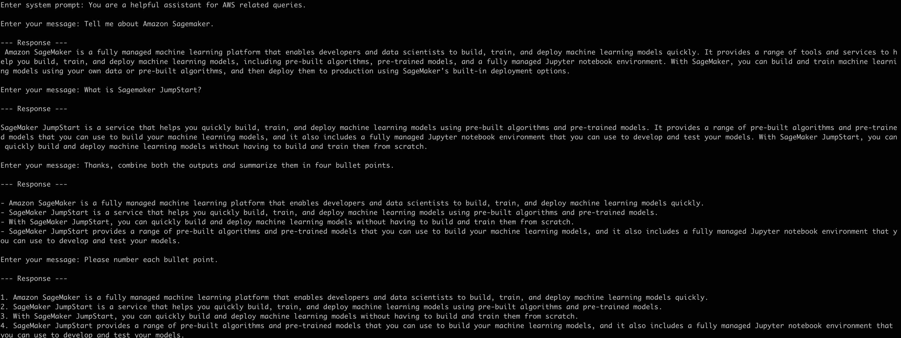

|ToC|
|---|

This article is an introductory guide for Go developers who want get started building Generative AI applications using [Amazon SageMaker Foundation Models](https://docs.aws.amazon.com/sagemaker/latest/dg/jumpstart-foundation-models.html). You will learn how to use the [AWS Go SDK (v2)](https://aws.github.io/aws-sdk-go-v2/docs/):

- To create and deploy a Foundation model,
- Use it for simple tasks such as code generation, and
- A chat application to hold a conversation with the Foundation Model.

> The code examples are available in this [GitHub repository](TODO link) 

After a brief introduction and code overview, we will dive straight in where I will walk you through the setup process and run the sample applications.


## Falcon family of Foundation models

[Amazon SageMaker](https://docs.aws.amazon.com/sagemaker/latest/dg/whatis.html) which is a fully managed machine learning service for data scientists and developers to build and train machine learning models, and then directly deploy them into a production-ready hosted environment. 

The machine learning model we will be working with is **Falcon 40B Instruct BF16**. It is available as part of [SageMaker JumpStart](https://docs.aws.amazon.com/sagemaker/latest/dg/studio-jumpstart.html) which provides pre-trained, open-source models for a wide range of requirements. This includes foundation models which are large models that are adaptable to many downstream tasks and often serve as the starting point for developing specialized models. These foundation models can be applied to use cases such as content writing, code generation, question answering, copywriting, summarization, classification, information retrieval, and more.

`Falcon-40B-Instruct` is a 40B parameters causal decoder-only model built by [TII](https://www.tii.ae/) based on Falcon-40B and is a ready-to-use chat/instruct model. `Falcon 40B` is an autoregressive decoder-only model trained on 1 trillion tokens with an architecture optimized for inference. It is mostly trained on English data and may not generalize to other languages. It carries the stereotypes and biases commonly encountered online and in the training data. Hence, it is recommended to develop guardrails and to take appropriate precautions for any production use. As it is an instruct model, it may not be ideal for fine-tuning.

> Although we are not covering this in the article, it's worth noting that SageMaker supports multiple machine learning environments, including [SageMaker Studio](https://docs.aws.amazon.com/sagemaker/latest/dg/studio.html) to deploy and manage our machine learning model. SageMaker Studio also helps you perform other machine learning tasks such as executing code in Jupyter notebooks, data preparation, fine-tuning models etc.

## Using SageMaker with Go

[Amazon SageMaker Python SDK](https://sagemaker.readthedocs.io/) is a widely used high-level Python library to start model training jobs and deploy the SageMaker models (note that this is not the same as the [AWS SDK for Python](https://aws.amazon.com/sdk-for-python/) (`Boto3`)). 

Go developers can use the [AWS Go SDK (v2)](https://aws.github.io/aws-sdk-go-v2/docs/) to invoke [SageMaker API operations](https://docs.aws.amazon.com/sagemaker/latest/APIReference/API_Operations_Amazon_SageMaker_Service.html) (such as creating a model, endpoint etc.) and [invoke runtime APIs](https://docs.aws.amazon.com/sagemaker/latest/APIReference/API_Operations_Amazon_SageMaker_Runtime.html) to get inferences from a hosted model at a specified endpoint. 

In the next section, let's take a look at how you can actually do this. To avoid repetition, I will provide a high-level walkthrough of the code with links to the respective implementation/code in the GitHub repo for this article.

## Using AWS Go SDK for SageMaker - code walkthrough

### Model and endpoint deployment

> Refer to the code here TODO link

To create the model and deploy the endpoint, we use the [sagemaker](https://pkg.go.dev/github.com/aws/aws-sdk-go-v2/service/sagemaker) package in the AWS Go SDK.

- We start by creating a model using [CreateModel](https://pkg.go.dev/github.com/aws/aws-sdk-go-v2/service/sagemaker#Client.CreateModel) function. We provide the model info (Docker image and S3 URL etc.), type (single model in this case) etc. 
- Then, we create an endpoint configuration with [CreateEndpointConfig](https://pkg.go.dev/github.com/aws/aws-sdk-go-v2/service/sagemaker#Client.CreateEndpointConfig) where we refer to the created model and provide configuration such as the EC2 compute instance type we want to use for hosting the endpoint, number of instances etc.
- Finally, we create the endpoint itself (using [CreateEndpoint](https://pkg.go.dev/github.com/aws/aws-sdk-go-v2/service/sagemaker#Client.CreateEndpoint)) by using the endpoint configuration created previously. *Note that this is an asynchronous process that returns after initiating the endpoint deployment.*

### Inferencing

After deploying the endpoint, you can run a few examples (details in another section). These use a simple wrapper client (on top of [sagemakerruntime](https://pkg.go.dev/github.com/aws/aws-sdk-go-v2/service/sagemakerruntime)) to invoke the SageMaker endpoint.

> Refer to the code here TODO link for client.go

- First, we define the input and output payloads for the inference endpoint - note that might differ from model to model.
- Then, we use [InvokeEndpoint](https://pkg.go.dev/github.com/aws/aws-sdk-go-v2/service/sagemakerruntime#Client.InvokeEndpoint) function to invoke the inferencing endpoint with the `JSON` payload that it accepts, and extract the response returned by the model.

Basic inference examples include simple prompts for different scenarios - refer to the code for basic inference examples TODO link.

**Chat application** 

This is slightly nuanced than the previous examples since it involves a conversational exchange that involves maintaining state across multiple messages. The model accepts this in a specific format.

> Refer to the code here TODO link

- The application starts by asking user for "system prompt"
- Then initiates the conversation and maintains state, which includes both end user and the FM responses.

Ok, you have sufficient background now! Let's see it in action.

## Prerequisites

1. Make sure you have set up SageMaker including all the steps as [outlined in the documentation](https://docs.aws.amazon.com/sagemaker/latest/dg/gs-set-up.html).

2. [Follow these instruction](https://docs.aws.amazon.com/sagemaker/latest/dg/sagemaker-roles.html#sagemaker-roles-create-execution-role) to create a SageMaker execution IAM role with the IAM managed policy, `AmazonSageMakerFullAccess`, attached.

## Deploy the SageMaker endpoint

Clone the GitHub repository and change to the required directory.

```bash
git clone TODO

cd deploy-endpoint
```

Run the program - this will create the model, endpoint configuration and initiate endpoint creation.

```bash
export SAGEMAKER_IAM_ROLE_ARN=<ARN of the SageMaker execution IAM role that you created>

go run main.go
```

You should see an output similar to this:

```bash
creating model huggingface-llm-falcon-40b-instruct-bf16-1695180470
model created - arn:aws:sagemaker:us-east-1:12345678910:model/huggingface-llm-falcon-40b-instruct-bf16-1695180470
endpoint config created - arn:aws:sagemaker:us-east-1:12345678910:endpoint-config/huggingface-llm-falcon-40b-instruct-bf16-1695180470-ep-config
endpoint creation initiated - arn:aws:sagemaker:us-east-1:12345678910:endpoint/huggingface-llm-falcon-40b-instruct-bf16-1695180470-endpoint
```

You can verify it by navigating to the SageMaker console under **Inference > Endpoints**:


> It should be in the **Creating** status - move to the next step when the status transitions to **InService**.

## Let's take the Foundation model for a spin!

Change to the right directory:

```bash
cd ../examples
```

To begin with, let's try simple inferencing examples. 

**How about writing some code?**

In the `examples` directory, open the `main.go` file, uncomment the `generateCode()` in the `main` function and run the program.


> The `generateCode` function uses the following prompt - "Write a program to compute factorial in Go:"

```bash
export SAGEMAKER_MODEL_ENDPOINT_NAME=<enter the name of SageMaker endpoint you deployed>

go run *.go
```

You should see an output similar to this:

```bash
Here is a program to compute factorial in Go:

package main

import "fmt"

func main() {
    num := 5
    fact := 1
    for i := 1; i <= num; i++ {
        fact *= i
    }
    fmt.Println(fact)
}

This program takes in a number as input and computes its factorial using a for loop. The result is then printed to the console.
```

Nice! You might a slightly different response though. Feel free to experiment with the prompts!

Go ahead and try out the other examples. Here is a list of the respective function you need to uncomment:

- Translation - `translate()`
- Sentiment analysis - `sentimentAnalysis()`
- Question/Answer - `qna()`

Let's take it up a notch. 

**It's time for a conversation with the model**

First, in the `main` function (in `examples/main.go`), comment everything else except the call to `startChat` function:


Run the program:

```bash
export SAGEMAKER_MODEL_ENDPOINT_NAME=<enter the name of SageMaker endpoint you deployed>

go run *.go
```

You should see this message - `Enter system prompt:`

Here is a sample conversation you can try out.

1. When prompted to `Enter system prompt:` - enter the following `You are a helpful assistant for AWS related queries.`
2. Next, enter this message and wait for the response: `Tell me about Amazon Sagemaker.`
3. Followed by another message: `What is Sagemaker JumpStart?`
4. After you get the response, enter the following message - `Thanks, combine both the outputs and summarize them in four bullet points.` *Note: since the program is maintaining the conversation state and sending it to SageMaker on each invocation, the model should be able to process this*
5. Wait for the response, and try this as the final message - `Please number each bullet point.`

At this point, you can end the program or continue the conversation.

Here is a snapshot of how my conversation went - yours might be different! As always, feel free to experiment.



## Clean up

Don't forget to delete the SageMaker components that you created.

- To delete the endpoint, navigate to the SageMaker console under **Inference > Endpoints**, select the endpoint and choose **Delete** from the **Actions** menu.
- To delete the endpoint configuration, navigate to the SageMaker console under **Inference > Endpoint configuration**, select the endpoint configuration and choose **Delete** from the **Actions** menu.
- To delete the model, navigate to the SageMaker console under **Inference > Models**, select the model and choose **Delete** from the **Actions** menu.

## Closing thoughts

I hope this proves useful for Go developers as a starting point into how to use Foundation models on SageMaker to power GenAI Go applications.

Here are some additional points you should consider:

- Using appropriate **model parameters** for invocation such as `max_length`, `max_new_tokens` etc.
- Using appropriate token size - this is especially important when the context becomes larger (for e.g. due to conversation history being maintained). For Falcon models, check **Limits on the number of input and output tokens** section in [this GitHub repo](https://github.com/aws/amazon-sagemaker-examples/blob/main/introduction_to_amazon_algorithms/jumpstart-foundation-models/text-generation-falcon.ipynb).
- **Fine-tuning** - Although fine-tuning isn't available for the model that we used (`Falcon 40B Instruct BF16`), but pre-trained for models that support this you can fine-tune them using a new dataset without training from scratch. This process, also known as *transfer learning*, can produce accurate models with smaller datasets and less training time.

Watch out for more articles covering Generative AI topics for Go developers. Until then, Happy Building!