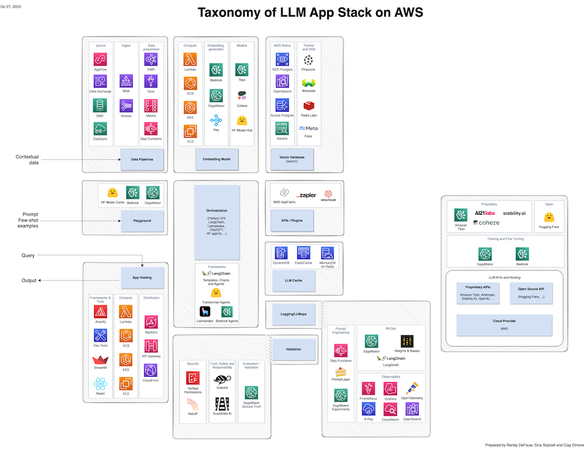
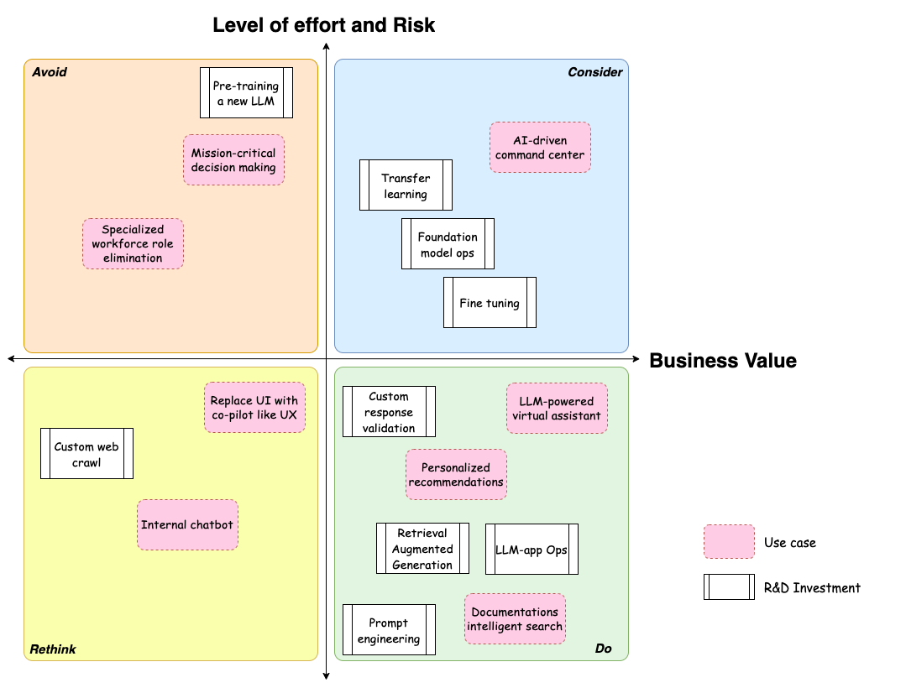

## Generative AI Project Prioritization

As you start ideating about how to use generative AI, using large language models (LLMs), in your business, you’ll probably end up with a long list of potential projects. Then it turns into a prioritization exercise - which projects should you take on, and in which order? This document lays out a prioritization framework based on business value, level of effort (LoE), and risk.

### Business Value

You probably already have a way to measure business value for new projects, whether it’s a strictly financial framework based on future returns or an Agile methodology like Scaled Agile’s “weighted shortest job first”, which includes both current business value and future risk reduction. 

Many of the entry-level generative AI use cases are focused on productivity improvements. These include use cases like summarization, question answering, knowledge management, code generation, and text generation. When these use cases are internally focused, they result in cost savings through reduced time and effort to complete tasks. When they are externally focused, they support business KPIs like customer satisfaction, conversion rates, and engagement. 

Another class of generative AI use cases uses a foundation model to interact with other systems on a person’s behalf. For example, a business user can provide a natural language question, and then the model drives a data warehouse to pull information and construct a dashboard. These types of use cases can accelerate customer adoption by reducing learning curves and provide time savings for internal use cases. The value measurement is similar to the entry-level use cases. On these use cases, pay close attention to the hierarchy of tasks to get a job done. Best in class solutions, powered by LLMs, target substantial (over 50%) productivity gains on individual units of work and eliminating complexity as opposed to incremental (less than 20%) improvements while maintaining exiting workflows. The evolution of productivity with generative AI should bring us closer to personal chief-of-staff vs. a high-touch copilot. 

A third set of generative AI use cases is potentially more transformational, unlocking net-new capabilities rather than just letting people do things faster. Eliminating complexity, means eliminating and automating some steps altogether. For example, in the life sciences space, some companies are looking to build models that can “speak” DNA sequences. That would let a scientist look for patterns in DNA information in a novel way, accelerating development of new health care products by an order of magnitude. While in some sense the value can be measured in terms like time to market, you should also evaluate these use cases as big bets that could unlock new markets or provide new business capabilities that you never had before.

You’ll also want to consider the cost of the solution. While generative AI solutions involve more than just the model, be aware that different models have very different cost points (orders of magnitude difference are possible) and cost structures (pay per request versus pay for capacity). 

### Risk

There are several risk factors to consider with generative AI solutions.

* What privacy and security guardrails can you get from the service hosting the model? 
* What responsible AI practices does the model creator follow?
* If you’re using your own data, is it well-governed and unbiased?
* Do you understand the security implications of integrating a generative AI model with other systems and tools?
* Do your end users understand what generative AI systems can and cannot do well? 

How you answer these questions will dictate how much potential risk you see in a project.

Besides those questions, also consider what happens if a generative AI model does something wrong. These models are purposely non-deterministic. How you ask a question can dramatically change the answer you get. And when these models are wrong, they may be wrong in novel ways - the types of coding errors that a code generation assistant makes could be wildly different from mistakes that people often make. Is your testing system robust enough to catch new error modes? 

Also consider that we don’t yet have robust ways to explain the output of generative AI models, and even evaluating model performance is currently the subject of active research. For all these reasons, many companies put an employee in the loop before the final output goes to an end user, in particular when the solution is dealing with sensitive data.

As with any new project, you should use a familiar risk evaluation framework and ask the usual questions. For example, if you classify projects by frequency and severity of risk, you can start classifying generative AI solutions in a familiar way. A chatbot that helps a user find answers to frequently asked questions may make mistakes fairly often, but the impact is low - if one of three suggested links isn’t relevant, the users can still get the information they need from the other two. 

### Level of Effort

While weighing business value requires input and judgement from many teams, gauging the level of effort (LoE) is a technical exercise performed by architects supported by data scientists. Calculating LoE in terms of development time or story points will depend on your own skill sets and existing tools. But you can consider these points.

* What type of fine-tuning do you need? Prompt engineering is inexpensive and does not require a particular skill set. Retrieval-augmented generation (RAG) requires integration work. Transfer learning requires a training job. With all these types of fine-tuning, there’s a tradeoff to consider between the size of the base model you need, the cost of using that model, and the speed and quality of response. Start simple and evolve with the needs of business to optimize for quality, alignment and cost.
* Is this a novel problem? If you need to pretrain an existing model, or design a new model from scratch, you need to plan for long and costly training jobs, and a higher level of basic data science expertise on your team.  Unlike traditional supervised machine learning, pre-training or custom fine-tuning an existing model may not converge into a better quality model that solves for complex use cases.  generative AI pre-training requires domain expertise as well as engaging in AI applied science experimentation.  
* Can you use a fully managed model service? If not, you will need to include additional operational tasks like basic infrastructure monitoring and scaling.  generative AI production workloads have a very different profile compared to a typical 3-tier or web microservices architecture. Latency is often measured in seconds or 10s of seconds and compute cost per API call is much higher than a normal enterprise application. While observability tooling is rapidly evolving in this space, the do-it-yourself (DIY) investment in achieving operational excellence with LLM powered apps cannot be discounted.
* Will your model be exposed directly to external users? If so, you will need extra rigor in security and privacy guardrails. Beyond following the emerging security and privacy best practices (e.g. [OWASP Top 10 for Large Language Model Applications](https://owasp.org/www-project-top-10-for-large-language-model-applications/)), identify specific threat vectors applicable to your overall solution architecture for your use case. You can apply the probability and impact risk modeling to those threat vectors and prioritize mitigating the associate risk accordingly for the highest ROI on security assurance efforts.  
* Do you have mature systems already in place for the pieces of the solution surrounding the model? As the diagram below shows, you may need some supporting capabilities in application hosting, data ingest, security, and operations. If you need to buy or hire new expertise, that will increase project cost and time.

Figure 1: Taxonomy of LLM App Stack on AWS inspired by [A16z’s emerging architectures for LLM Applications](https://a16z.com/emerging-architectures-for-llm-applications/)

### Conclusion

The balance of business value, risk and level of effort is organization and industry specific. The diagram below shows a simple example of categorizing a variety of use cases and R&D investments across the dimensions of business value, level of effort and risk. In figure 2, items in the bottom right quadrant would be the best choice, as they have a lot of value and relatively low effort and risk. Items in the top left should be avoided while the other quadrants deprioritized. For simplicity level of effort and risk are combined into a single dimension. For a real-world analysis, it’s advised to keep them separate and involve the right stakeholders for assessment and prioritization.

Figure 2: Example cost-benefit analysis for generative AI application prioritization

