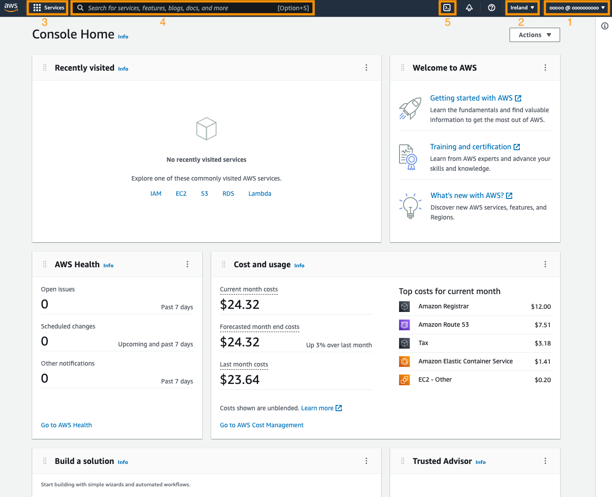
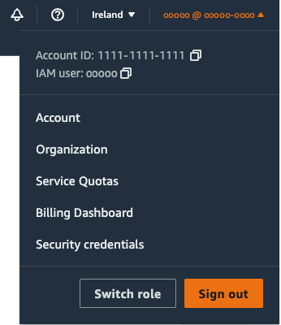
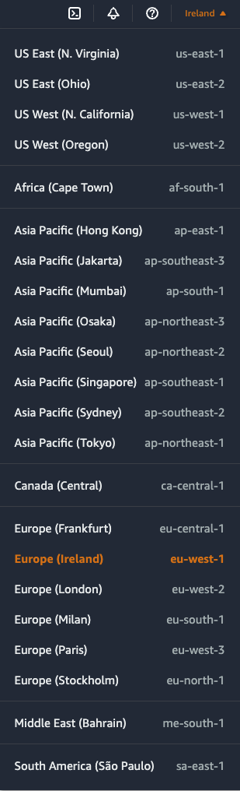
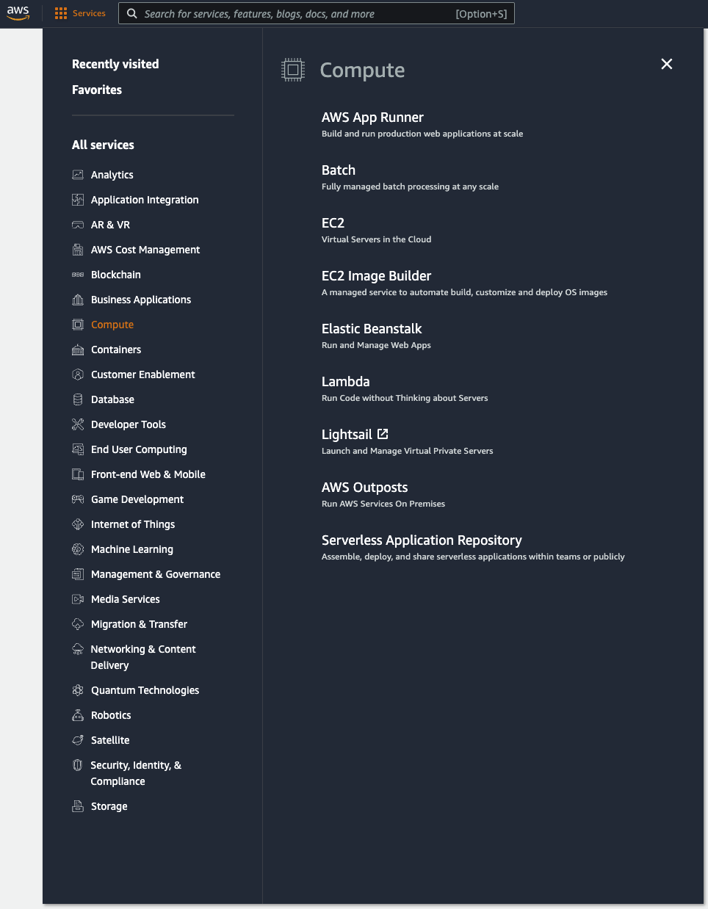
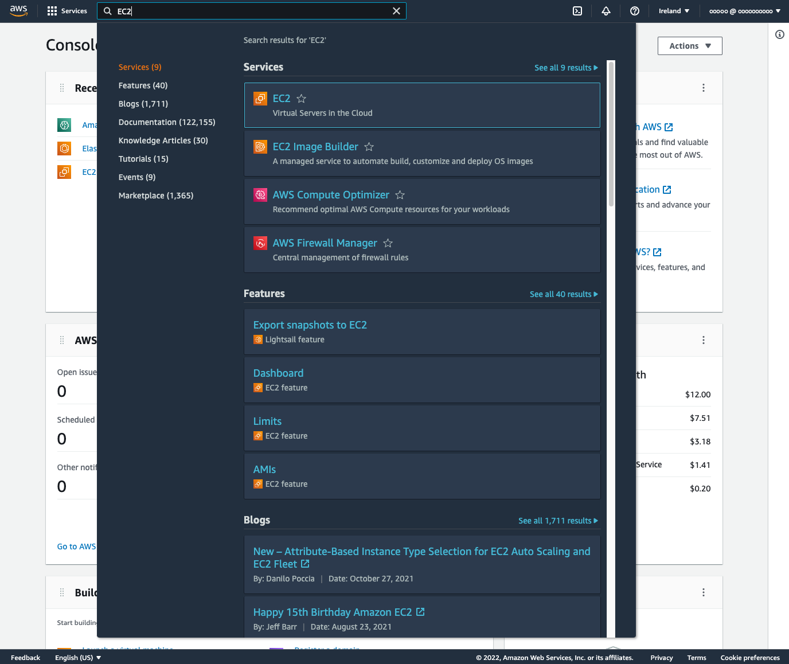
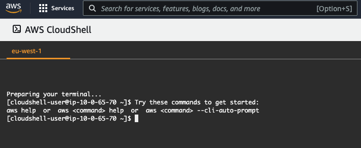
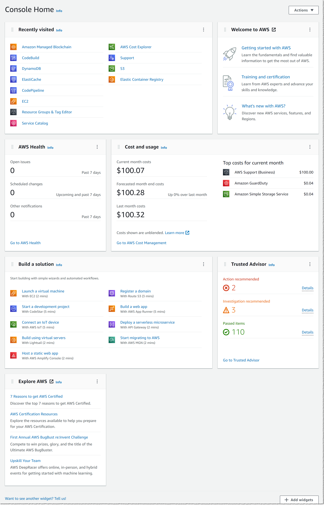

## Overview

In this guide, you will learn about the AWS Management Console and its features.

## What you will learn

- The different sections of the console dashboard
- How to access account information
- How to switch AWS Regions
- How to work with widgets on the console dashboard

## Sidebar

| Info                | Level                                  |
| ------------------- | -------------------------------------- |
| ✅ AWS Level        | Beginner                               |
| ⏱ Time to complete  | 15 minutes                                 |
| 💰 Cost to complete | Free when using the AWS Free Tier |

## Prerequisites

To complete this tutorial, you need to have an AWS account.  
  **TODO link to create an account tutorial**

---

## AWS Management Console

After signing up for a new AWS account and logging in, you will see the console dashboard. This is the starting point for interacting with the various AWS services and other important console components. The dashboard consists of a navigation bar at the top and a number of widgets in the main body of the page, which you can configure and rearrange. AWS is developing more widgets so you can further customize your console experience. 

We will start by taking a look at the navigation bar at the top. In the following image, we have highlighted five controls within the navigation bar, namely 1) account information, 2) Region selector, 3) services, 4) the search box, and 5) AWS CloudShell.  

### AWS account information

The first highlighted dropdown menu contains information and links for your account. It displays the AWS Account ID and the current user logged in to the console, along with links to navigate to the following pages:

- **Account** - Details about your account, including the address, contact information, billing settings, and more. For a full list of topics that describe how to manage your account, see [Managing your AWS account](https://docs.aws.amazon.com/accounts/latest/reference/managing-accounts.html) in the *AWS Account Management Reference Guide.*
- **Organization** - AWS Organizations is an account management service that enables you to consolidate multiple AWS accounts into an organization that you create and centrally manage. For more details, see the [*AWS Organizations User Guide*](https://docs.aws.amazon.com/organizations/latest/userguide/orgs_introduction.html).
- **Service Quotas** - Quotas, also referred to as limits in AWS services, are the maximum values for the resources, actions, and items in your AWS account. When a new account is created, there are default values, such as assigning five [Elastic IP addresses](https://docs.aws.amazon.com/AWSEC2/latest/UserGuide/elastic-ip-addresses-eip.html). These limits can be increased by logging a [support ticket](https://docs.aws.amazon.com/servicequotas/latest/userguide/request-quota-increase.html). For more details, see the [*Service Quotas User Guide*](https://docs.aws.amazon.com/servicequotas/latest/userguide/intro.html).
- **Billing Dashboard** - You can use the dashboard page of the AWS Billing console to gain a general view of your AWS spending. For more details, see [Using the AWS Billing console dashboard](https://docs.aws.amazon.com/awsaccountbilling/latest/aboutv2/view-billing-dashboard.html) in the *AWS Billing User Guide.*
- **Security credentials** - This link will take you to your AWS IAM user's page in the IAM part of the console where you can change your password, add two-factor authentication, generate AWS API keys, and more. For more details, see the [*AWS Identity and Access Management
User Guide*](https://docs.aws.amazon.com/IAM/latest/UserGuide/introduction.html).

### AWS Regions

The second highlighted dropdown menu shows the currently selected AWS Region. AWS global infrastructure is grouped into [Regions](https://aws.amazon.com/about-aws/global-infrastructure/regions_az/), and each service is hosted in a Region, unless it is a global service, such as AWS IAM or Amazon Route 53. This dropdown will display the currently selected Region, or "Global" when you have selected a global service. The text consists of the Region group, such as "Europe"; Region name, such as "Ireland"; and the Region string used by the AWS CLI, SDK, and other services, such as "eu-west-1". When you click on the currently selected Region, a dropdown will appear with all the available Regions, and you can switch the console to a different Region by clicking on one in the list.

### AWS service selector

The third highlighted dropdown menu is the AWS service selector. You can use this to navigate between services grouped by top-level categories, such as Compute, which includes Amazon EC2 along with other services such as AWS Elastic Beanstalk and Amazon Lightsail. This is a great way to explore the various services by category, especially if you are new to AWS. You can also mark services as favorites by selecting the star next to their names, which will pin them to the navigation bar. This can be done anywhere you see the star, including in the search box.

### AWS search

The fourth highlighted item is the search box. When you enter text into the box, the underlying search engine searches across a number of different locations to match the text that you entered. It will return matches in eight sections, namely:

- **Services:** List of AWS services
- **Features:** List of features of AWS services
- **Blogs:** Posts from the AWS blog
- **Documentation:** AWS Documentation
- **Knowledge Articles:** AWS Premium Support Knowledge Center
- **Tutorials:** Hands-on guides from the AWS Getting Started Resource Center
- **Events:** AWS hosted events that are upcoming, or available on-demand
- **Marketplace:** AWS Marketplace to find offerings to deploy in your AWS account

This is a quick way to search and navigate to what you are looking for. If the search engine is unable to find a match within one of these sections, the section will not be included in the list. As mentioned previously, you can add services to the navigation bar by selecting the star to favorite them.

### AWS CloudShell

The fifth highlighted item is the AWS CloudShell icon. By selecting this icon, you will launch a browser-based shell environment that is pre-authenticated with your console credentials. This enables you to execute AWS CLI commands or scripts using the AWS CDK from your browser. If you add any files to CloudShell (up to the 1GB limit), it will persist the files between sessions. CloudShell is a useful tool for securely interacting with your AWS account, and is Region specific, so any files that you upload are specific to that Region. The current selected Region is displayed in orange above the terminal.

## AWS Dashboard Widgets

The dashboard also contains a number of widgets to help you get started. We will discuss the widgets that appear by default, but you can move and resize these, or add different ones from the "Actions" dropdown. Three of the widgets provide you with static links to learn how to build a solution or to explore AWS (*Welcome to AWS,* *Build a solution,* and *Explore AWS*). The other five are dynamic and provide important information about AWS services, your AWS costs and usage, and best practices:

- **AWS Health:** Information on events that might affect your AWS infrastructure and account - for more details, see the [documentation](https://docs.aws.amazon.com/health/latest/ug/what-is-aws-health.html)
- **Cost and usage:** An overview of service costs, with a breakdown by AWS service - for more details, see the [documentation](https://docs.aws.amazon.com/cur/latest/userguide/what-is-cur.html)
- **Favorites:** A list of your favorite AWS services
- **Recently visited:** A list of top recently visited services
- **Trusted Advisor:** Recommendations to follow AWS best practices - for more details, see the [documentation](https://docs.aws.amazon.com/awssupport/latest/user/trusted-advisor.html)

## Conclusion

In this guide, you learned about the various parts of the AWS Management Console dashboard, and how to use the dashboard to navigate to services and account and billing information; search for services, features, articles, and guides; and view your billing dashboard.

To gain experience using the console, we recommend one of the following hands-on guides:

[Host a Static Website](https://aws.amazon.com/getting-started/hands-on/host-static-website/)
[Run a Serverless "Hello, World!" with AWS Lambda](https://aws.amazon.com/getting-started/hands-on/run-serverless-code/)
[Launch a Windows Virtual Machine in Amazon Lightsail](https://aws.amazon.com/getting-started/hands-on/launch-windows-vm/)
