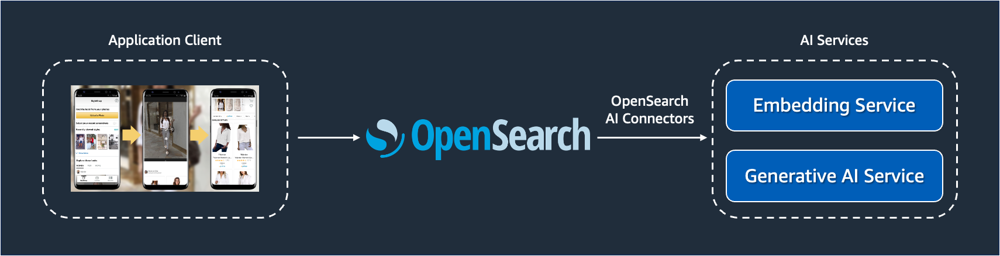
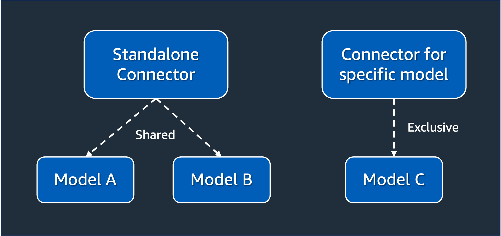
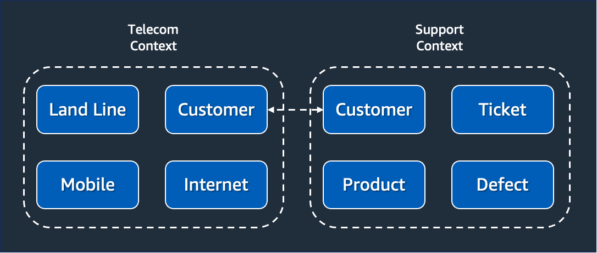
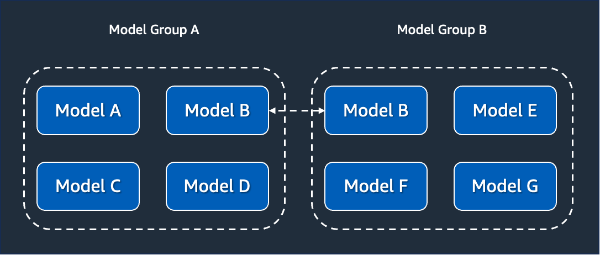

| ToC |
| --- |

[OpenSearch](https://opensearch.org/) is largely known in the industry for being one of the fastest purpose-built search and analytics engine. There are a great number of [use cases](https://aws.amazon.com/opensearch-service/customers/) around the world fully leveraging OpenSearch. All of this is possible thanks to the well-designed architecture of OpenSearch that allows for distributed work execution capable of delivering sub-second responses. Moreover, being heavily centered around open source roots is another key characteristic of OpenSearch because it allows for the technology to evolve at a faster pace around the community of developers.

You may already know all of this. But there's something you probably don't know. OpenSearch can also enhance the value of your data using machine learning. You can use a machine learning model and combine it with [k-NN search](https://opensearch.org/docs/latest/search-plugins/knn/index) to find similar documents. These models can be pre-trained or custom models deployed locally on your OpenSearch cluster. You can use LLM providers like Cohere, OpenAI ChatGPT, and AI21 Labs. Alternatively, you can use services like Amazon SageMaker, Amazon Bedrock, or your own infrastructure. Once deployed, you can use these models with OpenSearch for search, aggregation, and data analysis.

This series will introduce you to the models' feature and teach you how to utilize it in various scenarios. The first part gives you a basic understanding of the important details of this feature. Parts [two](/posts/getting-started-with-opensearch-models/02-processing-inferences-using-ai21labs) and [three](/posts/getting-started-with-opensearch-models/03-authoring-custom-connectors-opensearch) of this series will be more hands-on, and will provide you with tutorials so you can learn how to do things yourself. Part [four](/posts/getting-started-with-opensearch-models/04-troubleshooting-ml-commons-framework) is about providing you with tips and tricks on how to troubleshoot things.

Let's get started.

## Motivations for OpenSearch models

For a while now, OpenSearch allows ML developers to train and deploy models into OpenSearch clusters. This support is provided by the [OpenSearch ML Commons Framework](https://github.com/opensearch-project/ml-commons). The idea behind this project is to simplify the process of defining, deploying, and using models using REST APIs, a programming model that is known and accessible to many developers. Instead of learning frameworks specialized in ML, they can use REST and JSON, which provide simpler programming constructs.

Consider [this tutorial](https://opensearch.org/docs/latest/ml-commons-plugin/semantic-search/#tutorial) as an example of a pre-trained model based on [Hugging Face](https://huggingface.co) that can be invoked using the prediction API. In the example below, the identifier `cleMb4kBJ1eYAeTMFFg4` represents the model deployed on OpenSearch. This is how a developer can invoke this model:

```
POST /_plugins/_ml/_predict/text_embedding/cleMb4kBJ1eYAeTMFFg4
{
  "text_docs":[ "today is sunny"],
  "return_number": true,
  "target_response": ["sentence_embedding"]
}
```

The response of this inference, once executed, will be provided in the JSON format. A developer can easily process this JSON response in any programming language to retrieve the text embeddings of the provided prompt.

```json
{
   "inference_results":[
      {
         "output":[
            {
               "name":"sentence_embedding",
               "data_type":"FLOAT32",
               "shape":[
                  768
               ],
               "data":[
                  0.25517133,
                  -0.28009856,
                  0.48519906,
                  "..."
               ]
            }
         ]
      }
   ]
}
```

Similarly, the same deployed model could be used in searches:

```json
GET /my-nlp-index/_search
{
  "_source": {
    "excludes": [
      "passage_embedding"
    ]
  },
  "query": {
    "neural": {
      "passage_embedding": {
        "query_text": "wild west",
        "**model_id**": "cleMb4kBJ1eYAeTMFFg4",
        "k": 5
      }
    }
  }
}
```

By having developers use OpenSearch for their needs, the learning curve to implement AI use cases is drastically reduced as OpenSearch now acts as the middleware responsible for management, deployment, and execution of ML related tasks. It is a great way for organizations to democratize AI operations among teams, whether internal and external ones. If you work for a company whose bread-and-butter is to provide services to developers based on your own models, then OpenSearch provides everything you need to get your team focused on what matters.

## Same architecture, multiple deployment options

One of the coolest things provided by the [ML Commons Framework](https://github.com/opensearch-project/ml-commons) is the support for hybrid models. Using the same APIs for managing the lifecycle of your models, you can work with models that are deployed in your OpenSearch cluster, or available via an external API. This provides you with a seamless experience to work with models, as you can start working with models with OpenSearch using a local deployment model, and migrate to models available externally without changing a single line of your code.

This level of flexibility is also relevant for model training. You can use [pre-trained models](https://opensearch.org/docs/latest/ml-commons-plugin/pretrained-models) with OpenSearch, where you can simply reuse a trained model and deploy at OpenSearch. Alternatively, you can switch to deploy your own [custom models](https://opensearch.org/docs/latest/ml-commons-plugin/custom-local-models), maybe because you identified edge cases where the pre-trained models are not adequate. Switching from one approach to another won't break your applications, as the interaction design is the same.

But what if you work for a company who doesn't have expertise in AI? Even worst, a company who doesn't have any interest in developing this expertise in-house as the business is about something else? In this scenario, it doesn't make much sense to use pre-trained or custom models deployed locally. Moreover, using models deployed locally requires your OpenSearch cluster to have [compute nodes dedicated to ML related tasks](https://opensearch.org/docs/latest/ml-commons-plugin/gpu-acceleration). Not only this will increase the infrastructure footprint of your clusters, but it will be a workload that may compete with your other OpenSearch applications. For these situation, you can use externally available models.

[External models](https://opensearch.org/docs/latest/ml-commons-plugin/remote-models/index) allow models to be trained outside OpenSearch. This means doing the training of the model without any changes in the cluster. Additionally, the people responsible for the model training can perform their job without necessarily worrying about OpenSearch-related aspects. Data scientists, which are usually the people responsible for training models, don't necessarily need to learn OpenSearch in order to complete their duties. They can innovate using the approaches they are familiar with, which is great for keeping them focused on the business problem.

Just like models deployed locally at OpenSearch, externally available models are handled the same way. You can leverage the same REST APIs to deploy and use models.



OpenSearch will transparently invoke the external models via the registered connectors, taking care of the details regarding networking, security, work scheduling, and integration. It is important to clarify that using external models doesn't forbid you to deploy models locally. Both deployment options can be used at the same time, which is ideal for situations you started with local models but you plan to move to external ones to reduce cost, improve your efficiency, and scale your workloads.

## Connectors and Connector blueprints

To take advantage of external models, you must create a [connector](https://opensearch.org/docs/latest/ml-commons-plugin/extensibility/connectors). A connector defines the service to which OpenSearch will function as a client. Therefore, they need to include information about how to invoke the service, which parameters are expected, and how the result is provided. Moreover, connectors provide technology providers with a way to integrate their AI technologies with OpenSearch with minimal effort and becoming part of our open source community.

There are two types of connectors: standalone and the ones created for a specific model. The key criteria to decide which one to use depends on their level of reusability. If you want that, a connector can be used in different models, then you must create a standalone one. This means the connector can be the implementation path of one or multiple models. Otherwise, if you don't intend to reuse the connector as much and plan to use it for a single model, then you must choose to create a specific one.



Because standalone connectors intend to be reused across multiple models, they are stored in a dedicated index called `.plugins-ml-connector`. This way, even if a model is deleted, it won't affect the other models using the connector, as the lifecycle of the connector is not dependent on the model. Consequentially, when an internal connector is created, they are stored in the same index that also stores the models, an index called `.plugins-ml-model`.

To create a connector, you must provide the configuration of the connector a [connector blueprint](https://opensearch.org/docs/latest/ml-commons-plugin/extensibility/blueprints/). This is a JSON document containing all the metadata required to connect with the external model. Usually, the connector blueprint is created by ML developers who understand how the external model works and know their API contract works. The API contract is everything related to how messages will be exchanged, such as what are the data required to perform the request, as well as what are the data returned when a response is generated.

Think about connector blueprints as templates for connectors. Once the template is created and shared, one or multiple connectors can be created based on it. For instance, take this connector blueprint for an [Amazon SageMaker](https://docs.aws.amazon.com/sagemaker/latest/dg/gs.html) API as an example.

```json
POST /_plugins/_ml/connectors/_create
{
  "name": "<YOUR CONNECTOR NAME>",
  "description": "<YOUR CONNECTOR DESCRIPTION>",
  "version": "<YOUR CONNECTOR VERSION>",
  "protocol": "aws_sigv4",
  "credential": {
    "access_key": "<YOUR AWS ACCESS KEY>",
    "secret_key": "<YOUR AWS SECRET KEY>",
    "session_token": "<YOUR AWS SECURITY TOKEN>"
  },
  "parameters": {
    "region": "<YOUR AWS REGION>",
    "service_name": "sagemaker"
  },
  "actions": [
    {
      "action_type": "predict",
      "method": "POST",
      "headers": {
        "content-type": "application/json"
      },
      "url": "<YOUR SAGEMAKER MODEL ENDPOINT URL>",
      "request_body": "<YOUR REQUEST BODY. Example: ${parameters.inputs}>"
    }
  ]
}
```

As you can notice, the connector blueprint provides the guidance necessary to whoever is going to create a connector from this template know which parameters to provide. All the parameters fall into sections that are self-descriptive—such as the credential, parameters, and actions. ML developers creating connector blueprints must be as detailed as possible, to make sure that connectors created out of it will work as expected. A complete summary of all possible sections and fields of a connector blueprint can be seen [here](https://opensearch.org/docs/latest/ml-commons-plugin/extensibility/blueprints/#configuration-options).

## Model groups and models

In the software development world, [Domain-Driven Design (DDD)](https://en.wikipedia.org/wiki/Domain-driven_design) is a common approach to design software-intensive systems. DDD aims to unify the language used by system implementers and users to facilitate communication and achieve understanding. This is important for keeping different teams aligned and enabling them to discuss system development and evolution without getting caught up in semantic details. Now, you may wonder, what does this have to do with OpenSearch?

There are a few concepts we can borrow from DDD to better understand how external models work. One of them is the concept of a bounded context. When dealing with large models and teams, it is often a good idea to delineate a bounded context to group a set of related terms and concepts together. Different people will use subtly different vocabularies in different parts of a large organization. The precision of modeling rapidly runs into this, often leading to a lot of confusion. This is where creating a bounded context helps. They act as a container for all connected items from a domain model perspective, and provide a convenient way to search for them.

At OpenSearch you can use the concept of model groups to define these bounded contexts. Model groups are used to define a set of related models, and their relationships is about how they connect together to form the design you are trying to create. Model groups’ primary job is to manage model versions. This means that a model group is essentially a way to group a set of model versions. Moreover, model groups in OpenSearch are used to enforce security. Just like a bounded context, model groups must specify clear boundaries about who can access the models within that model group, given a set of permissions.

Using the same line of thinking based on DDD, you can see models as your possible entities or services that your domain model will contain. In your design model, there may be entities whose job is to represent something concrete from the real world, but their job is just this: to represent. They have attributes and qualifiers, but they don't have any behavior associated. Hence why they are called entities. Similarly, your domain model may need something to represent what your system will require as behavior, something that, given an input, will produce an output. Hence why they are called services. A model in OpenSearch can be used to either represent an entity or a service from your domain model.

When you used a model to represent an entity, it will be often for situations where you want to represent something that will augment and enrich your data. Common use cases for this is RAG and semantic searches, as you will see in the next parts of this series. For these use cases, you are using an entity that will be used to provide more context and meaning to your existing data. If you want to use a model to represent a service, the use case will be often about inference execution, which is commonly known as the perfect scenario for generative AI. Given a prompt, the model can respond with richer response than what a static dataset could provide.

There is no special formula that you can use to decide which components of your design will be entities, services, and how they should belong to a bounded context. It requires a thoughtful analysis of your domain model and what you are trying to model. What you need to keep in mind is the relationship between model groups and bounded contexts, as well as models with entities and services.

## Summary

In this first part of the series, you were introduced to the concept of models from OpenSearch. You have learned this feature creates the right approach for you to democratize the usage of AI within your organization, as OpenSearch takes care of much of what would be custom engineering implementation with no business value associated. By using models, you and your team can jump straight to what matters without having to worry about losing your investment because you decided to change the deployment model used.

In the [second part](/posts/getting-started-with-opensearch-models/02-processing-inferences-using-ai21labs), you will practice everything you learned here. You will learn how to spin up an development OpenSearch cluster, connect this OpenSearch cluster with the AI21 Labs Jurassic 2 foundation model via the Amazon Bedrock service, and test running inferences against the model.
