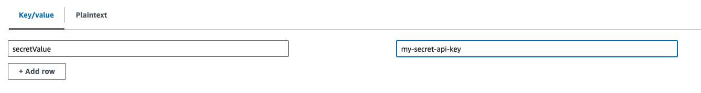
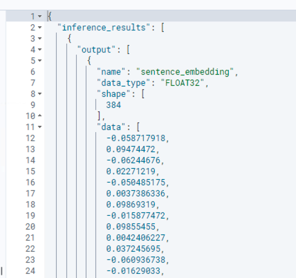
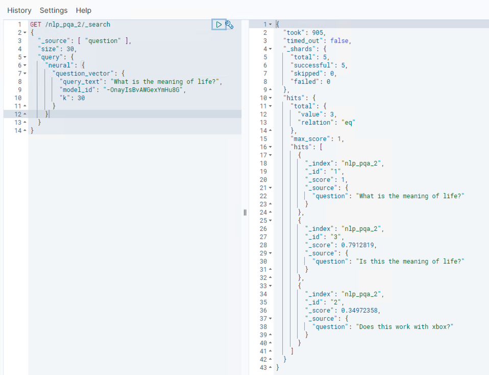
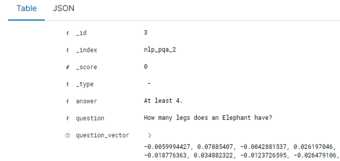
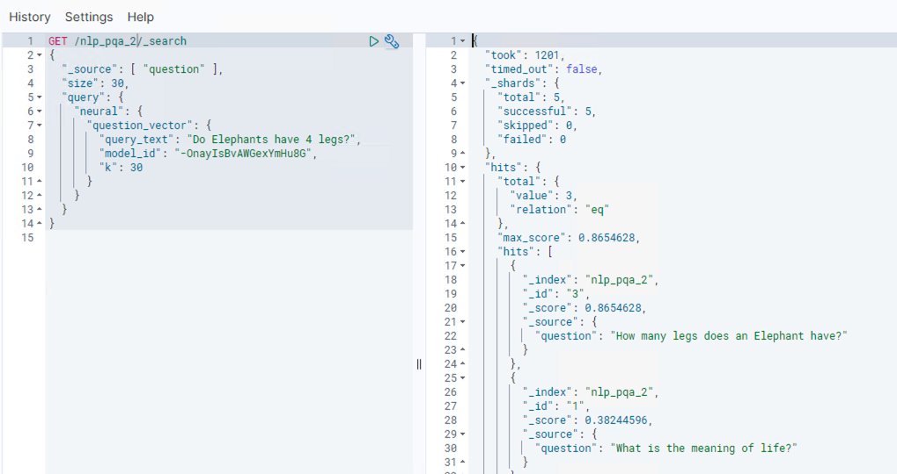

| ToC |
| --- |

Machine learning is an integral part of many data workflows. Machine learning models are often scattered across different platforms—some hosted by cloud providers, others running on internal infrastructure, and others provided by third-party vendors. This fragmentation can make it challenging to connect these disparate systems into an end-to-end workflow. For example, you may want to use a proprietary named entity recognition model with a transformer-based question answering system from a different provider. Maybe ingest documents into a search index while calling out to multiple external APIs for enrichment. By using external model connectors, [OpenSearch](https://opensearch.org/) provides a unified interface to integrate these heterogeneous systems, allowing you to build powerful AI-powered applications.

In this tutorial, you will deploy a custom ML API written in Python, and use it as a external model with OpenSearch. Keep in mind, though, that you can use the same approach if the ML API is executed elsewhere. As long as OpenSearch can reach the API endpoint, the ML API could be:

* Models from [Hugging Face](https://huggingface.co/)or custom models deployed onto a container or virtual machine
* Models deployed on [Amazon SageMaker,](https://aws.amazon.com/sagemaker/) including via [JumpStart](https://aws.amazon.com/sagemaker/jumpstart/)
* Managed AI services such as [Amazon Bedrock](https://aws.amazon.com/bedrock/), [Cohere](https://cohere.com/) or [Anthropic](https://www.anthropic.com/). 
* ...any API that you can connect to from the OpenSearch cluster. 

## Playing with the Custom ML API locally

To launch a local instance of the custom ML API, use the Docker Compose available in [this GitHub repository](https://github.com/build-on-aws/getting-started-with-opensearch-external-models).

1. `git clone https://github.com/build-on-aws/getting-started-with-opensearch-external-models`
2. `cd getting-started-with-opensearch-external-models/custom-ml-api`
3. `docker compose up -d`

[The Python application](https://github.com/build-on-aws/getting-started-with-opensearch-external-models/blob/main/custom-ml-api/app.py) exposes the ML API and make it available via the endpoint http://localhost:8888. To test this API before moving forward, you can send the following HTTP request using curl.

```
curl -u admin:secret -H 'Content-Type: application/json' http://localhost:8888/weather -d '{"text_inputs": "London"}' 
```

You should get an output similar to this:

```
{
  "description": "cloudy",
  "humidity": 98,
  "location": "London",
  "temp": 23.0262507888756
}
```

This means that the ML API is running correctly. Once you finish playing with the ML API, please deploy this API on AWS. The API is deployed using the [AWS Cloud Development Kit (CDK)](https://docs.aws.amazon.com/cdk/v2/guide/home.html), full instructions [are available in the repository](https://github.com/build-on-aws/getting-started-with-opensearch-external-models#deploying-the-sample-ml-api). Be sure to update the configuration as detailed in the repository to make the API available on your custom domain. This tutorial will consider the ML API is available in the following endpoint:  [https://api.mydomain.com](https://api.mydomain.com/).

## Configuring OpenSearch

Before moving forward with this tutorial, you will need an Amazon OpenSearch domain. You can create one manually using the instructions from the [AWS documentation](https://docs.aws.amazon.com/opensearch-service/latest/developerguide/createupdatedomains.html), or you can use [this Terraform code](https://github.com/build-on-aws/getting-started-with-opensearch-external-models/blob/main/amazon-opensearch.tf) that creates one for you automatically. Either way, make sure your Amazon OpenSearch domain is fully operational before continuing.

Just like you have learned in the part 2 of this series, before deploying any connectors you must configure your OpenSearch cluster with some persistent settings. Execute the following command:

```
PUT /_cluster/settings
{
    "persistent": {
        "plugins.ml_commons.connector_access_control_enabled": true,
        "plugins.ml_commons.trusted_connector_endpoints_regex": [
            "^https://api.mydomain.com/.*$"
        ]
    }
}
```

## Creating a basic connector

With the cluster prepared, next the connector can be created. The following example uses basic authentication to connect to an internal API. Using the Amazon OpenSearch service, the secret is stored in a [Secrets Manager](https://docs.aws.amazon.com/secretsmanager/latest/userguide/intro.html) secret with the following format. Note that the key name can be any value you like, but this has to match the attribute referenced in the connector:

Then an IAM role that OpenSearch can assume with permission to retrieve the secret is specified in the connector blueprint. For more details, see the [Amazon OpenSearch service documentation](https://docs.aws.amazon.com/opensearch-service/latest/developerguide/ml-external-connector.html#connector-external-prereq). The API method could be a `GET` or a `POST`. In this case a `POST` is used as a `POST` body is sent with the request:

```
POST /_plugins/_ml/connectors/_create
{
  "name": "weather",
  "description": "weather",
  "version": 1,
  "protocol": "http",
  "credential": {
    "secretArn": "<YOUR_SECRET>",
    "roleArn": "<YOUR_ROLE>",
  },
  "actions": [
    {
        "action_type": "predict",
      "method": "POST",
      "headers": {
        "content-type": "application/json",
        "Authorization": "Basic ${credential.secretArn.secretValue}"
      },
      "url": "https://api.mydomain.com/weather",
      "request_body": "{ \"text_inputs\": \"${parameters.input}\" }",
    }
  ]
}
```

Next the connector needs to be associated with a [model group](https://opensearch.org/docs/latest/ml-commons-plugin/model-access-control/#model-groups) and a model has to be deployed for external inference. To do this, the connector is registered to a model group. Then the output `model_id` of that task is retrieved using the `task_id`. With that, the model can be deployed:

```
POST /_plugins/_ml/models/_register
{
    "name": "minilm-l6",
    "function_name": "remote",
    "model_group_id": "28yhqosBjS86SRECErTY",
    "description": "test model",
    "connector_id": "W3ZnuosBt2q9Vp9BKukn"
}

GET /_plugins/_ml/tasks/vd9nuosBjS86SRECXYn6

POST /_plugins/_ml/models/vt9nuosBjS86SRECXokQ/_deploy
```

Finally, the newly deployed model can be tested using the [predict endpoint](https://opensearch.org/docs/latest/ml-commons-plugin/api/#predict). Note the payload must match that defined in the connector:

```
POST /_plugins/_ml/models/vt9nuosBjS86SRECXokQ/_predict
{
  "parameters": {"input": "London"}
}
```

Success! Here the response is being returned from the external model based on the input text:

```
{
  "inference_results": [
    {
      "output": [
        {
          "name": "response",
          "dataAsMap": {
            "description": "rainy",
            "humidity": 76,
            "location": null,
            "temp": 22.281690890440444
          }
        }
      ],
      "status_code": 200
    }
  ]
}
```

## Text embeddings with connectors

With the recent popularity of Generative AI, Retrieval Augmented Generation (RAG) has become a common pattern to augment text-generation with contextual data. RAG is a technique used in natural language processing where a large language model (LLM) is combined with an information retrieval system. The LLM is the component responsible for generating text, such as a response in a chatbot. The information retrieval system indexes relevant data that the LLM can reference to make its outputs more useful. For example, an LLM-based chatbot designed to answer customer support questions could retrieve documents or FAQs to inform its responses. Connecting the LLM with OpenSearch provides a way to index and query the relevant data.

Large language models (LLMs) are a class of natural language processing models that have been pre-trained on a huge corpus of text data.. They can generate human-like text given a prompt and enable applications like chatbots. However, on their own, LLMs have no way of augmenting their responses with real-world knowledge. By combining retrieval with the LLM, more contextually-aware applications can be built. To pass this data to the LLM, it has to be indexed. Often, this indexed data is stored as [vector embeddings.](https://aws.amazon.com/blogs/database/the-role-of-vector-datastores-in-generative-ai-applications/) The use-cases in this post illustrate how [OpenSearch can be used as a vector database](https://aws.amazon.com/blogs/big-data/amazon-opensearch-services-vector-database-capabilities-explained/) for these embeddings as part of a generative AI workflow. 

As a more practical example, if the model or API works with text embeddings, the [text_embeddings algorithm](https://opensearch.org/docs/latest/ml-commons-plugin/algorithms/) can be used to perform neural search on the index. Here is an example connector for working with an API that processes embeddings. In this example, a text string is sent and the encoded vector embeddings for the string are returned. This allows a [k-NN index](https://opensearch.org/docs/latest/search-plugins/knn/index/) to be used in OpenSearch to perform a similarity search for related documents. 

```
{
  "name": "weather",
  "description": "weather",
  "version": 1,
  "protocol": "http",
  "credential": {
    "secretArn": "arn:aws:secretsmanager:us-east-1:1234567890:secret:weather_api_key-Iz8AUH",
    "roleArn": "arn:aws:iam::1234567890:role/opensearch-api-role",
    },
  "actions": [
    {
      "action_type": "predict",
      "method": "POST",
      "headers": {
        "content-type": "application/json",
        "Authorization": "Basic ${credential.secretArn.secretValue}"
      },
      "url": "https://api.mydomain.com/embed",
      "pre_process_function": "\n    StringBuilder builder = new StringBuilder();\n    builder.append(\"\\\"\");\n    String first = params.text_docs[0];\n    builder.append(first);\n    builder.append(\"\\\"\");\n    def parameters = \"{\" +\"\\\"input_text\\\":\" + builder + \"}\";\n    return  \"{\" +\"\\\"parameters\\\":\" + parameters + \"}\";",
      "post_process_function": "\n      def name = \"sentence_embedding\";\n      def dataType = \"FLOAT32\";\n      if (params.results == null || params.results.length == 0) {\n        return params.message;\n      }\n      def shape = [params.results.length];\n      def json = \"{\" +\n                 \"\\\"name\\\":\\\"\" + name + \"\\\",\" +\n                 \"\\\"data_type\\\":\\\"\" + dataType + \"\\\",\" +\n                 \"\\\"shape\\\":\" + shape + \",\" +\n                 \"\\\"data\\\":\" + params.results +\n                 \"}\";\n      return json;\n    ",
      "request_body": "{ \"text_inputs\": \"${parameters.input_text}\" }",
    }
  ]
}
```

In this connector, a `pre_process_function` and a `post_process_function` is used. These allow the request and response to be transformed when working with a external model, so it is in the shape expected by OpenSearch. 

There are a number of [pre-created functions available for common integrations](https://opensearch.org/docs/latest/ml-commons-plugin/extensibility/blueprints/#built-in-pre--and-post-processing-functions), or you can implement your own using Painless scripting as in the above example. 

 The connector can then be deployed using the same process as highlighted above. Then it can be tested using the predict API:

```
POST /_plugins/_ml/models/-OnayIsBvAWGexYmHu8G/_predict
{
  "parameters": {"input_text": "hello world"},
  "return_number": true,
  "target_response": ["sentence_embedding"]
}
```

## API Contract

Depending on the expected request format, and the response sent by your API, you might not have to make any changes when using it from OpenSearch. From the example above, this is the JSON payload that is received by the WebAPI:

```json
{ "text_inputs": "hello world" }
```

In this Painless script, the text_docs parameter passed from the neural search query is being extracted and passed to the specified attribute (in this case “input_text”). This is then the request body that is defined in the connector. 

The API then processes this input string with whatever business logic is implemented and returns a response with the generated embeddings:

```javascript
response_data ={ "results" : [-0.058717918, 0.09474472, -0.06244676, ... , -0.0073602716]}
return jsonify(response_data)
```

The `post_process_function` then processes the APIs response. The example below has again formatted here for readability, for a working example see the connector definition above:

```javascript
"post_process_function": "
    def name = "sentence_embedding";
    def dataType = "FLOAT32";
    if (params.results == null || params.results.length == 0) {
        return params.message;
    }
    def shape = [params.results.length];
    def json = "{
            "name": + name + "," +
            "data_type": + dataType + "," +
            "shape": + shape + "," +
            "data": + params.results +
        "}";
    return json;",
```

The key part is `params.results`. Any attributes in the response object can be accessed via the params object. This function is used to specify which attributes in the response to map and return to OpenSearch. Pre and post functions can be used as required to transform the request and response to the desired format.

The above function is mapping the response to the following schema as expected by OpenSearch:

```bash
name: STRING (e.g. "sentence_embedding")
data_type: STRING (e.g. "FLOAT32")
shape: INT[] (e.g. [384])
data: FLOAT32[] (e.g. [-0.321, 1.234, etc])
```

The `data_type` is a string representation of the data type used in the data attribute, for example FLOAT32 or INT32. 

The Shape is an array of INT32 that represents the shape of the data attribute e.g. a 1-dimensional array of 384 items. Note that if the model is being used as part of an ingestion pipeline, this should match the `dimension` attribute defined on the index vector property. 

The data is then an array of objects that matches the format specified in data_type and the dimensions specified in shape. For example an array of FLOAT32. 

The response from the model has to either match this format or be manipulated using a `post_process_function` so that it matches.


## Configuring the connector for neural search

This connector can then be used as part of a [neural search query](https://opensearch.org/docs/latest/search-plugins/neural-search/). The following example converts in the input query text to vectors at search time using the external model. This search is then fulfilled locally using the k-NN index to find the most similar documents:

```
GET /nlp_pqa_2/_search
{
  "_source": [ "question" ],
  "size": 30,
  "query": {
    "neural": {
      "question_vector": {
        "query_text": "What is the meaning of life?",
        "model_id": "-OnayIsBvAWGexYmHu8G",
        "k": 30
      }
    }
  }
}
```

Additionally, an ingestion pipeline can be created that allows for the embeddings to be generated as documents are written to OpenSearch. This allows OpenSearch to function as a vector database for generative AI applications, whilst storing the original attributes of the document in place. This is useful for RAG use-cases such as augmented chatbots and intelligent document retrieval.

To do this, an ingestion pipeline is defined when the k-NN index is created. This pipeline maps a source attribute on the indexed document to a vector attribute of a specified size. In this example the “question” string attribute is being mapped to a “question_vector” vector attribute of size 384. The same approach works for other vector sizes, such as the 1536 shape used by [Amazon Bedrock’s Titan Embeddings](https://docs.aws.amazon.com/bedrock/latest/userguide/embeddings.html) model:

```
PUT _ingest/pipeline/nlp-pipeline
{
  "description": "An example neural search pipeline",
  "processors" : [
    {
      "text_embedding": {
        "model_id": "-OnayIsBvAWGexYmHu8G",
        "field_map": {
          "question": "question_vector"
        }
      }
    }
  ]
}

PUT /nlp_pqa
{
  "settings": {
      "index.knn": true,
      "index.knn.space_type": "cosinesimil",
      "default_pipeline": "nlp-pipeline",
      "analysis": {
        "analyzer": {
          "default": {
            "type": "standard",
            "stopwords": "_english_"
          }
        }
      }
  },
  "mappings": {
      "properties": {
          "question_vector": {
              "type": "knn_vector",
              "dimension": 384,
              "method": {
                  "name": "hnsw",
                  "space_type": "l2",
                  "engine": "faiss"
              },
              "store": true
          },
          "question": {
              "type": "text",
              "store": true
          },
          "answer": {
              "type": "text",
              "store": true
          }
      }
  }
}
```

Now, when new documents are added to the index, the ingestion pipeline runs. This sends the mapped attributes to the external model for inference and the response is written to the vector attribute in OpenSearch:

```
POST /nlp_pqa_2/_doc/3
{"question":"How many legs does an Elephant have?","answer":"At least 4."}
```

This can then be used for end-to-end RAG use-cases using the neural search text search functionality:

You can also implement neural searches using the integrations feature from Amazon OpenSearch. If you want to learn more about how this works, please visit [this blog post](#blog_post_at_aws_blogs) which provides a great tutorial.

## Summary

Throughout this series, you learned about the external models feature from OpenSearch and what you can do with it. The external models feature provides a powerful way for independent software vendors (ISVs) and model providers to connect their services to OpenSearch, so they can use them with RAG and text-embedding pipelines. This is particularly useful for situations where OpenSearch is acting as the vector database for generative AI applications.

By now, you should feel confident enough to begin developing your applications with OpenSearch and the external models feature. But, if you have some spare time, I highly recommend reading [part four](/posts/getting-started-with-opensearch-external-models/04-troubleshooting-ml-commons-framework) of this series. It provides a comprehensive overview of troubleshooting the ML Commons plugin. It's not necessary if you're solely focused on building applications, but it's always helpful to refer back to if things don't go as planned.
