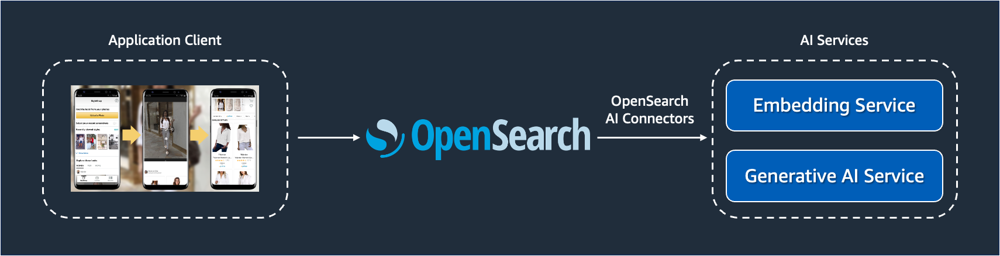
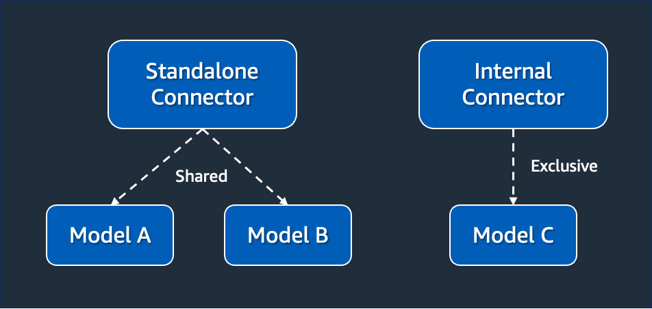

| ToC |
| --- |

[OpenSearch](https://opensearch.org/) is largely known in the industry for being one of the fastest document-oriented databases optimized for search and analytics. There are a great number of [use cases](https://aws.amazon.com/opensearch-service/customers/) around the world fully leveraging OpenSearch as data engine. All of this is possible thanks to the well-designed architecture of OpenSearch that allows for distributed work execution capable of delivering sub-second responses. Moreover, being heavily centered around open source roots is another key characteristic of OpenSearch because it allows for the technology to evolve at a faster pace around the community of developers.

But you may know all of this already. What you probably don't know is that OpenSearch also provides you with a great foundation to leverage AI connectors through a feature called [remote models](https://opensearch.org/docs/latest/ml-commons-plugin/extensibility/index/). It allows you to create connectors with services such as Amazon SageMaker, Amazon Bedrock, OpenAI, and others. Once these connectors are in place, you can leverage them to transform the way data are ingested, stored, and served. You can start executing inferences directly from OpenSearch, as well as use these connectors along with what OpenSearch does best—search, aggregation, and analysis of data.

In this series, you will be acquainted with the remote models' feature and learn how to explore its potential over different scenarios. This first part will be dedicated to introduce you to the concept, the implementation model, and understand the use cases you can build with this feature. Parts [two](/posts/getting-started-with-remote-models/02-processing-inferences-using-ai21labs) and [three](/posts/getting-started-with-remote-models/03-authoring-custom-connectors-opensearch) of this series will be more hands-on, and will provide you with tutorials so you can learn how to do things yourself. Part [four](/posts/getting-started-with-remote-models/04-troubleshooting-ml-commons-plugin) is about providing you with tips and tricks on how to troubleshoot things.

Let's get started.

## Motivations for remote models

The best way to understand the remote models' feature is by understanding the need for it. For a while now, OpenSearch allows ML developers to train and deploy models into OpenSearch clusters. This support is provided by the [ML Commons Plugin](https://opensearch.org/docs/latest/ml-commons-plugin/ml-framework/). The idea behind this plugin is to simplify the process of training and deployment of pre-trained and custom models using REST APIs, a programming model that is known and accessible to many developers. Instead of learning frameworks specialized on ML, they can simply use REST and JSON, which provide simpler programming constructs.

To illustrate the power of this, consider [this tutorial](https://opensearch.org/docs/latest/ml-commons-plugin/pretrained-models/#step-4-optional-test-the-model) as an example of a pre-trained model based on [Hugging Face](https://huggingface.co/) to be used to execute inferences and neural searches. In the example below, the value `cleMb4kBJ1eYAeTMFFg4` represents the `model_id` deployed in the OpenSearch cluster. After deploying the model, a developer can execute an inference this way:

```
POST /_plugins/_ml/_predict/text_embedding/cleMb4kBJ1eYAeTMFFg4
{
  "text_docs":[ "today is sunny"],
  "return_number": true,
  "target_response": ["sentence_embedding"]
}
```

The response of this inference, once executed, will be provided in the JSON format. A developer can easily process this JSON response in any programming language to retrieve the text embeddings of the provided prompt.

```json
{
   "inference_results":[
      {
         "output":[
            {
               "name":"sentence_embedding",
               "data_type":"FLOAT32",
               "shape":[
                  768
               ],
               "data":[
                  0.25517133,
                  -0.28009856,
                  0.48519906,
                  "..."
               ]
            }
         ]
      }
   ]
}
```

Similarly, the same deployed model could be used in searches:

```json
GET /my-nlp-index/_search
{
  "_source": {
    "excludes": [
      "passage_embedding"
    ]
  },
  "query": {
    "neural": {
      "passage_embedding": {
        "query_text": "wild west",
        "**model_id**": "cleMb4kBJ1eYAeTMFFg4",
        "k": 5
      }
    }
  }
}
```

By having developers using OpenSearch for their needs, the learning curve to implement AI use cases is drastically reduced as OpenSearch now acts as the middleware responsible for management, deployment, and execution of ML related tasks. It is a great way for organizations to democratize AI operations among teams—whether internal and external ones. If you work for a company whose bread-and-butter is to provide services to developers based on your own models, then OpenSearch provides everything you need to get your team focused on what matters.

But what if you work for a company who doesn't have expertise in AI? Even worst, a company who doesn't have any interest in developing this expertise in-house as the business is about something else? In this scenario, the value provided by the ML Commons plugin doesn't become attractive anymore because to leverage the transparent programming model you would need to invest in expertise and infrastructure. Invest in expertise because ultimately you would need to have people in the team with expertise in training models and infrastructure because your OpenSearch clusters would have to have [compute nodes dedicated to ML related tasks](https://opensearch.org/docs/latest/ml-commons-plugin/gpu-acceleration/).

Hence why OpenSearch introduced the feature remote models on its 2.9 release. A remote model, as the name implies, it's a model that lives outside the OpenSearch cluster. Having a model outside of the cluster provides several advantages. For starters, it means that the process of training the model and executing inferences will happen without draining compute and storage resources from the OpenSearch cluster. This minimizes the infrastructure footprint of the cluster and creates a natural separation of concerns in the architecture.

Remote models also allow the training of the model to happen outside of the scope of OpenSearch. This means doing the training of the model without requiring any changes in the cluster. Additionally, the people responsible for the model training can perform their job without necessarily worrying about OpenSearch-related aspects. Data scientists, which are usually the people responsible for training models, don't necessarily need to learn OpenSearch in order to complete their duties. They can innovate using the tools and approaches they are familiar with, which is great for keeping them focused on scaling the approach.

Besides all these advantages, remote models also continue providing developers with the same transparent programming model offered when models are running in the cluster. That's right, you can leverage the same REST APIs to deploy and use models.

OpenSearch will transparently invoke the remote models via the registered connectors, taking care of the details regarding networking, security, work scheduling, and integration. It is important to clarify that using remote models doesn't forbid you to deploy models within the cluster. Both features can be used at the same time, which is ideal for situations where you may have models being currently used but want to gradually migrate to remote ones.

## Connectors and Connector blueprints

To leverage the remote models' feature, you must create [connectors](https://opensearch.org/docs/latest/ml-commons-plugin/extensibility/connectors/) to exchange messages with remote models hosted outside OpenSearch. From this perspective, connectors define the services to which OpenSearch will function as a client. Therefore, they need to include information about how to invoke the service, which parameters are expected, and how the result is provided. Once created, connectors are instantiated automatically by OpenSearch every time a request is sent to the remote model the connector is associated with. In runtime, the request execution is handled by a task scheduled in one of the thread pools from OpenSearch. Part [four](/posts/getting-started-with-remote-models/04-troubleshooting-ml-commons-plugin) of this series will discuss which thread pools you need to monitor.

There are two types of connectors: standalone and internal ones. The key criteria to decide which one to use depends on their level of reusability. If you want that, a connector can be used in different models, then you must create a standalone one. This means the connector can be the implementation path of one or multiple models. Otherwise, if you don't intend to reuse the connector as much and plan to use it for a single model, then you must choose to create an internal one.

Because standalone connectors intend to be reused across multiple models, they are stored in a dedicated index called `.plugins-ml-connector`. This way, even if a model is deleted, it won't affect the other models using the connector, as the lifecycle of the connector is not dependent on the model. Consequentially, when an internal connector is created, they are stored in the same index that also stores the models, an index called `.plugins-ml-model`.

To create a connector, you must provide the configuration of the connector using something called [connector blueprint](https://opensearch.org/docs/latest/ml-commons-plugin/extensibility/blueprints/). This is a JSON document containing all the metadata required to connect with the external model. Usually, the connector blueprint is created by ML developers who understand how the remote model works and know their API contract works. The API contract is everything related to how messages will be exchanged, such as what are the data required to perform the request, as well as what are the data returned when a response is generated.

Think about connector blueprints as templates for connectors. Once the template is created and shared, one or multiple connectors can be created based on it. For instance, take this connector blueprint for an Amazon SageMaker API as an example.

```json
POST /_plugins/_ml/connectors/_create
{
  "name": "<YOUR CONNECTOR NAME>",
  "description": "<YOUR CONNECTOR DESCRIPTION>",
  "version": "<YOUR CONNECTOR VERSION>",
  "protocol": "aws_sigv4",
  "credential": {
    "access_key": "<YOUR AWS ACCESS KEY>",
    "secret_key": "<YOUR AWS SECRET KEY>",
    "session_token": "<YOUR AWS SECURITY TOKEN>"
  },
  "parameters": {
    "region": "<YOUR AWS REGION>",
    "service_name": "sagemaker"
  },
  "actions": [
    {
      "action_type": "predict",
      "method": "POST",
      "headers": {
        "content-type": "application/json"
      },
      "url": "<YOUR SAGEMAKER MODEL ENDPOINT URL>",
      "request_body": "<YOUR REQUEST BODY. Example: ${parameters.inputs}>"
    }
  ]
}
```

As you can notice, the connector blueprint provides the guidance necessary to whoever is going to create a connector from this template know which parameters to provide. All the parameters fall into sections that are self-descriptive—such as the credential, parameters, and actions. ML developers creating connector blueprints must be as detailed as possible, to make sure that connectors created out of it will work as expected. A complete summary of all possible sections and fields of a connector blueprint can be seen [here](https://opensearch.org/docs/latest/ml-commons-plugin/extensibility/blueprints/#configuration-options).

## Model groups and models

In the software development world, [Domain-Driven Design (DDD)](https://en.wikipedia.org/wiki/Domain-driven_design) is a common approach to design software-intensive systems. DDD aims to unify the language used by system implementers and users to facilitate communication and achieve understanding. This is important for keeping different teams aligned and enabling them to discuss system development and evolution without getting caught up in semantic details. Now, you may wonder, what does this have to do with OpenSearch?

There are a few concepts we can borrow from DDD to better understand how remote models work. One of them is the concept of a bounded context. When dealing with large models and teams, it is often a good idea to delineate a bounded context to group a set of related terms and concepts together. Different people will use subtly different vocabularies in different parts of a large organization. The precision of modeling rapidly runs into this, often leading to a lot of confusion. This is where creating a bounded context helps. They act as a container for all connected items from a domain model perspective, and provide a convenient way to search for them.

At OpenSearch you can use the concept of model groups to define these bounded contexts. Model groups are used to define a set of related models, and their relationships is about how they connect together to form the design you are trying to create. The relationship between model groups and models is of 1:N—which means that one model group may have at least one or multiple models associated to it. Moreover, model groups in OpenSearch are used to enforce security. Just like a bounded context, model groups must specify clear boundaries about who can access the models within that model group, given a set of permissions.

Using the same line of thinking based on DDD, you can see models as your possible entities or services that your domain model will contain. In your design model, there may be entities whose job is to represent something concrete from the real world, but their job is just this: to represent. They have attributes and qualifiers, but they don't have any behavior associated. Hence why they are called entities. Similarly, your domain model may need something to represent what your system will require as behavior, something that, given an input, will produce an output. Hence why they are called services. A model in OpenSearch can be used to either represent an entity or a service from your domain model.

When you used a model to represent an entity, it will be often for situations where you want to represent something that will augment and enrich your data. Common use cases for this is RAG and semantic searches, as you will see in the next parts of this series. For these use cases, you are using an entity that will be used to provide more context and meaning to your existing data. If you want to use a model to represent a service, the use case will be often about inference execution, which is commonly known as the perfect scenario for generative AI. Given a prompt, the model can respond with richer response than what a static dataset could provide.

There is no special formula that you can use to decide which components of your design will be entities, services, and how they should belong to a bounded context. It requires a thoughtful analysis of your domain model and what you are trying to model. What you need to keep in mind is the relationship between model groups and bounded contexts, as well as models with entities and services.

## Summary

I this first part of the series you were introduced to the concept of remote models from OpenSearch. You have learned this feature creates the right approach for you to democratize the usage of AI within your organization, as OpenSearch takes care of much of what would be custom engineering implementation with no business value associated. By using remote models, you and your team can jump straight to delivering business value part without having to own infrastructure in-house and even have to have AI expertise in your team.

In the [second part](/posts/getting-started-with-remote-models/02-processing-inferences-using-ai21labs), you will practice everything you learned here. You will learn how to spin up an development OpenSearch cluster, connect this OpenSearch cluster with the AI21 Labs Jurassic 2 foundation model via the Amazon Bedrock service, and test running inferences against the remote model.
