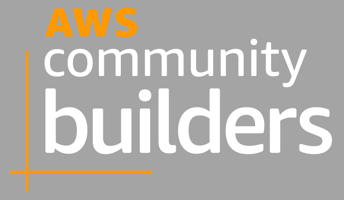

The IT industry is always evolving, offering new opportunities. One job title in particular has received a lot of attention in the past few years: DevOps Engineer.

I have a technical background, but until 2018 I knew nothing about DevOps. My job was to plan and design microwave transmission networks. But when the project I was working on came to an end, I had to find a new position at the same company. Among other roles, I'd discovered "DevOps Engineer", and I was curious to learn more about it. I talked with the manager and I was told to learn a bit of programming and scripting - and to brush up on databases. Then I did a technical interview and soon after became a DevOps Engineer. That was how my IT career started.

## What Exactly _Is_ DevOps?

There are a lot of [wrong ideas about DevOps](/posts/devops-wrong-answers-only) out there, but here's one definition from [AWS](https://aws.amazon.com/devops/what-is-devops/) that I find captures it well: "*DevOps is the combination of cultural philosophies, practices, and tools that increases an organization’s ability to deliver applications and services at high velocity: evolving and improving products at a faster pace than organizations using traditional software development and infrastructure management processes.*" In other words, DevOps is about people, processes, and the best way they can be brought together to accelerate the pace of innovation.

Due to the broad range of tasks you will be responsible for, DevOps Engineer is not an entry-level job in the industry, but this doesn't mean you can't do it. Some of the DevOps responsibilities include:

 - building and setting up new development tools and infrastructure
 - automating and improving development and release processes
 - testing and examining code written by others and analysing the results
 - ensuring that systems are safe and securing against cybersecurity threats
 - identifying technical problems and developing software updates and ‘fixes’
 - working with software developers and software engineers to ensure that development follows established processes and works as intended

It's worth noting here that different roles relate to the practical implementation of DevOps - Platform Engineer, Site Reliability Engineer, and so on. If you're interested in a more granular breakdown of those roles, plenty of [other resources](https://launchdarkly.com/blog/sre-vs.-platform-engineering-vs.-devops/) online provide that.

Here's what I learned as I entered DevOps for the first time.

## Plans - and When to Deviate from Them

Careers begin early - with planning often starting before you even attend university. That's not a bad thing: which career to pursue is an important decision in life, and changing careers later can be challenging. But career conversions - even in highly technical fields - [are increasingly possible](https://www.forbes.com/sites/carolinecastrillon/2023/02/26/why-non-linear-career-paths-are-the-future/) thanks to broadly available educational resources. One benefit of this shift is that the ease of transition actually brings more diversity into IT; people who come from different professional backgrounds bring their unique perspectives to new jobs. So if you're interested in DevOps, transitioning into it professionally is possible - and your past professional experiences could even help you find more success there.

I transitioned to DevOps mid-career, but it required an always-learning mindset. I made constant discoveries. I discovered this thing called [`cloud`](https://www.buildon.aws/posts/what-is-the-cloud) and I started working with the AWS console. I later discovered this new thing called `Infrastructure as Code`, and I really wanted to [try it out](/tags/infrastructure-as-code). The newness of everything was overwhelming at first, but it also gave me the opportunity to choose what to focus on. At this point I was studying for my first AWS certification and looking for a job that would allow me to grow and to do IaC hands-on. It may sound silly, but I even moved to another country to achieve this goal.

Along the way, I also learned there are two types of decisions: 1-way door decisions and 2-way door decisions. In other words, some decisions can't be undone without considerable difficulties or costs (they are 1-way doors), but other decisions are easily reversible - so if you regret them, you can always go back (hence, 2-way doors).

You should never be afraid to learn or make other 2-way door decisions: they help you learn what you enjoy (and what you don't). 1-way door decisions, like leaving a job or moving to another country, aren't bad, but you'll want to more carefully consider them before making the commitment. In short...

> Tip: Don't be afraid to try things out.

## Getting Involved

While living in the Netherlands, I discovered Meetups and communities like AWS User Groups and ServerlessDays Amsterdam. At first, attending the events wasn't easy for me. Although I like to talk to people, I'm not an extrovert, and I was outside of my comfort zone. Seeing how welcoming the communities are and how open-minded everybody is, though, I kept coming back - and I even volunteered for one of the meetups (which turned out to be an incredible experience).

I didn't stop there. I found out about [AWS Community Builders](https://aws.amazon.com/developer/community/community-builders/), a program for passionate people who contribute to the developer community in any way and on any technical topics - not only AWS. Being part of this community gave me the chance to connect with great people who inspired me. This eventually led me to attend re:Invent in person, where I met builders from all around the world - people who were passionate about DevOps, Serverless, Security, and everything else. These were the people to talk to and ask advice and opinions about DevOps and any other roles.

Career changes are tough, but they're even harder when you do them alone. So be sure to **get involved in the community**. **Go to events**, put forth this extra level of effort, and it'll be well worth it. You can meet people who already have the position you are looking to try out and ask them about it; you can feel out the community; you can get practical advice on learning. Volunteering is a more structured way to get involved. Some meetups seek volunteers for events, and you can always ask first about the responsibilities and time commitments.

Attending events is a good entry point to meet people with the same interests, but you can also connect with people on LinkedIn or your favorite platform. It's good to be in touch, to engage online with those in the field you're entering. And while you have to do your own research about the new position, the people who are already in that position will always be well positioned to offer practical insights that research might not surface. So...

> Tip: Do your own research, and then talk to other people.

## Conclusion
When you want to start your DevOps journey you can have a look at the [DevOps Roadmap](https://roadmap.sh/devops), and then talk to people already in the job about it. A roadmap offers a very good overview to entering the field, but the insights you get from experienced people are priceless, and sometimes more specific and actionable.

If you're curious about DevOps as a career path, I recommend you watch [Getting started with DevOps w/ Lian Li](https://www.youtube.com/watch?v=fpglhplg-to) from **Women in Cloud Native**.

You can also learn more about DevOps and other career paths in IT, what they mean and what you need to know to do the job, by watching [this great video](https://www.youtube.com/watch?v=XmWkcePhf84&t=1486s) by Nana Janashia.
