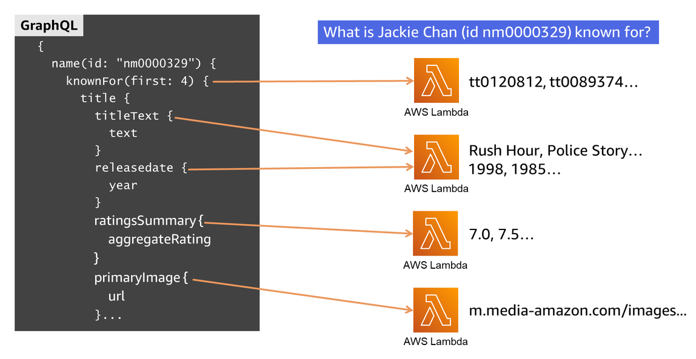
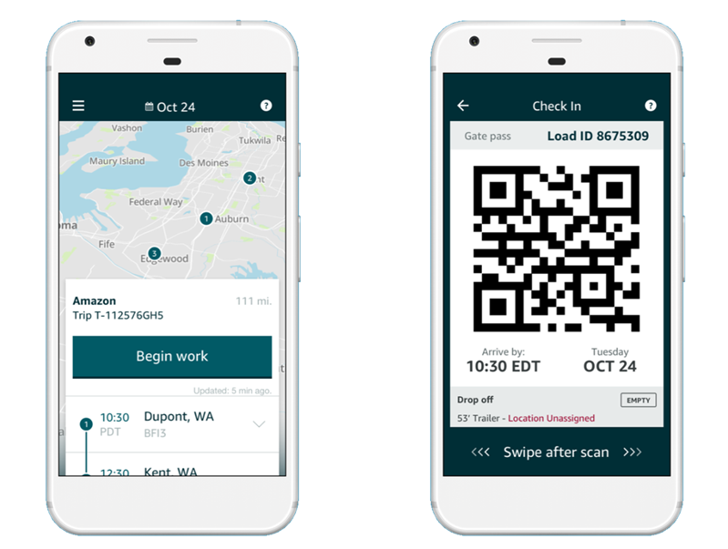
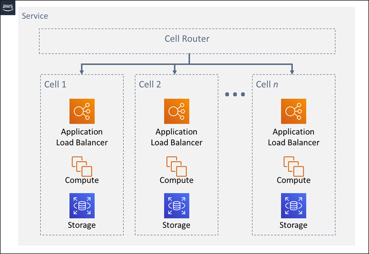
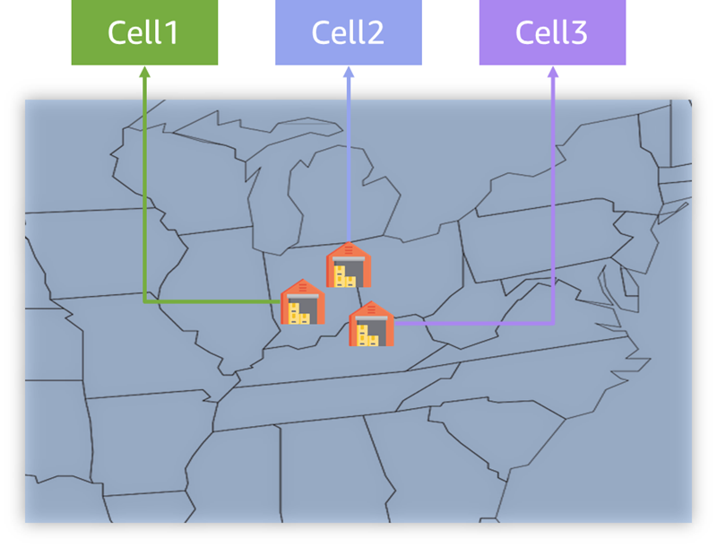
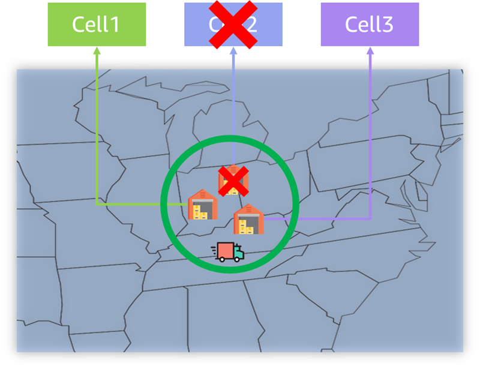
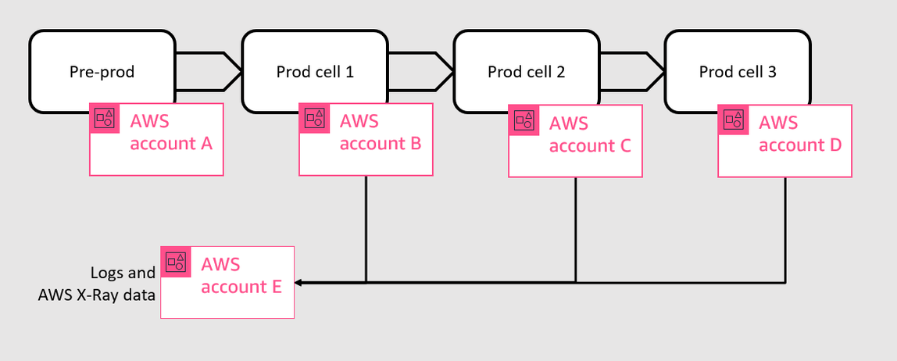

When I arrived at Amazon as a developer in 2005 (before AWS was even a thing) I was handed an actual, physical pager (Figure 1). Why? Because developers at Amazon not only design and implement their services, but they deploy and manage operation of them as well. For that operations piece, developers take turn being "oncall" and available to diagnose and fix any problems. Hence, the pager.

All this is to say, Amazon was doing DevOps before "DevOps" was even a term. [Amazon.com](http://amazon.com/) runs thousands of systems on AWS to power its worldwide marketplaces, video delivery, and other consumer services.  When the opportunity comes to re-architect, Amazon developers do so with DevOps in mind, so as to make it easier during oncall to deliver the best experience to their customers.

Here I will share several examples of Amazon.com teams and their applications, and how they architected for [continuous](https://aws.amazon.com/devops/continuous-delivery?sc_channel=el&sc_campaign=devopswave&sc_geo=mult&sc_country=mult&sc_outcome=acq&sc_content=how-amazon-does-devops-in-real-life), automated, independent deployment of the [microservices](https://aws.amazon.com/devops/what-is-devops?sc_channel=el&sc_campaign=devopswave&sc_geo=mult&sc_country=mult&sc_outcome=acq&sc_content=how-amazon-does-devops-in-real-life#microservices) behind those applications, using infrastructure as code. This enables innovation by allowing changes to get to production sooner without disrupting other components. And it makes oncall easier by aligning the business logic with the microservices and the teams that own them, so that any emergent problem gets to the right team sooner.

## IMDb

The Internet Movie Database, or IMDb, is the world’s most popular source for movie, TV, and celebrity content. For years, their backend was a monolith, with a REST API running on 100s of EC2 instance hosts. This architecture worked, but innovation was slow, and oncall was a chore.

The backend is responsible for serving show titles, actors’ names, aggregate star ratings, images, release years... the list goes on and on. GraphQL was a good fit here, and using federated GraphQL, the backend could be divided into multiple microservices, each focused on a specific set of business logic — one serving images, another handling ratings, while another knows which actors are in which shows. Federated GraphQL enables each of these services to know only the schema it needs to know, while clients can request data that spans multiple microservices.

Here is how it works. Figure 2 shows a GraphQL query on the left (abbreviated) for the "Known for" webpage widget on the Jackie Chan page here: [https://www.imdb.com/name/nm0000329/](https://www.imdb.com/name/nm0000329/). Actors have IDs that start with `nm` (for example Jackie is `nm0000329`). And shows — including movies or TV series — have `tt` IDs. The query is sent to a gateway which knows the entire schema, and routes each of the pieces to the appropriate microservice (known as graphlets), each fronted by an [AWS Lambda](https://docs.aws.amazon.com/lambda/latest/dg/welcome.html?sc_channel=el&sc_campaign=devopswave&sc_geo=mult&sc_country=mult&sc_outcome=acq&sc_content=how-amazon-does-devops-in-real-life). Lambda is serverless which means you can just run your code, no servers needed.  The top microservice in figure 2 knows which movies to show, the next one down knows the metadata about the movies (title, year, etc.), and so on.

The gateway and each of the graphlets are separate stacks, independently deployable. As you can see, business logic for each graphlet is well-defined, and the teams that own those graphlets understand it and the technology behind it. Some graphlets were created from older services and fronted with a Lambda that can shape the proper response to the GraphQL query. Others are newer and completely serverless. The old ones can be replaced with the serverless ones without any disruption to the rest of the system. And teams find oncall easier now, because with no more monolith, it is clearer where problems are occurring and which team owns their resolution.

## Amazon Relay - Amazon’s mobile app for Truckers

Let’s take a look at another part of Amazon’s business, and maybe the one for which it is best known: shipping. The items you buy on Amazon.com need to be in the right place at the right time. Between fulfillment centers (what Amazon calls warehouses), post offices, and vendor facilities, there are tens of thousands of places Amazon moves the items between in North America, and they do it with "big-rig" trucks (Figure 3)

Amazon has over the years developed sophisticated models to put items in the right place, but these are just data in a computer. To actually move stuff, the truckers need to know where to go, when to go there, what to pick up, and where to take it. There’s an app for that. The [Amazon Relay app](https://relay.amazon.com/) (figure 4) is the way these sophisticated models are turned into action.

Similar to IMDb, the Relay team designed a gateway that the app talks to, and they put the business logic into multiple backend services they call "modules." For example, one service determines warehouse access and generates the gate pass you see in figure 4, and another module calculates load execution (where and when drivers need to be). The gateway and the modules are independently deployable, in their own pipelines.

Figure 5 shows how they did it.  Using [Amazon API Gateways](https://docs.aws.amazon.com/apigateway/latest/developerguide/welcome.html?sc_channel=el&sc_campaign=devopswave&sc_geo=mult&sc_country=mult&sc_outcome=acq&sc_content=how-amazon-does-devops-in-real-life) they can present a single point of externalization using a domain name, and then use path-based routing so each call goes to the right service. So requests to  `example.com/message` go to the module that runs the messaging feature, while `example.com/navigate` requests go to the navigation module. API Gateway lets you create these API mappings for a given path to a specified Lambda. New modules are serverless, using Lambda, [DynamoDB](https://docs.aws.amazon.com/amazondynamodb/latest/developerguide/Introduction.html?sc_channel=el&sc_campaign=devopswave&sc_geo=mult&sc_country=mult&sc_outcome=acq&sc_content=how-amazon-does-devops-in-real-life) (NoSQL database), and [SQS](https://docs.aws.amazon.com/AWSSimpleQueueService/latest/SQSDeveloperGuide/welcome.html?sc_channel=el&sc_campaign=devopswave&sc_geo=mult&sc_country=mult&sc_outcome=acq&sc_content=how-amazon-does-devops-in-real-life) (queue service). Older ones were updated to put Lambda out front, to integrate with the API Gateways.

Since there is no shared ownership of code or infrastructure between teams, each team can deploy whenever they want, getting new features or fixes into production with no need to coordinate between teams. Using multiple API Gateways here enables the team to isolate each module from one another and perform a staggered deployment to less critical modules first and rollback if any issues arise without impacting the more critical ones.

This architecture also makes it easier to implement a multi-Region strategy. Truckers, whether in the east or west, benefit from lower latency, as their requests are routed to an AWS Region closer to them. And this multi-Region architecture also enables a [disaster recovery strategy](https://aws.amazon.com/blogs/architecture/disaster-recovery-dr-architecture-on-aws-part-i-strategies-for-recovery-in-the-cloud?sc_channel=el&sc_campaign=devopswave&sc_geo=mult&sc_country=mult&sc_outcome=acq&sc_content=how-amazon-does-devops-in-real-life), where all traffic can be routed to just one of the Regions if needed. For more details on [how Amazon Relay enabled multi-Region, see this video](https://www.youtube.com/watch?v=QeW9wCB36ck&t=1339s).

Hear firsthand from Alex Polfliet, a Senior SDE on the Relay App team:

https://www.youtube.com/shorts/DeGBLSHLQKA

## Amazon Fulfillment Technologies and Robotics - The systems that run Amazon warehouses

I’ve covered the trucks going between fulfillment centers (FCs), now let’s talk about the FCs themselves. Globally, Amazon operates more than 500 FCs. Amazon Fulfillment Technologies and Robotics is the Amazon organization that designs, deploys, and operates the services powering the FCs. This includes systems for receiving items, determining where they go in the warehouse, telling associates where to find them to fulfill a customer order, generating shipping info, determining which box to use, and so on.

As you might expect by now, each of these services is independently deployable, but here they take independent deployment to the next level by using cell-based architecture. With cell-based architecture each cell is a complete, independent instance of the service (Figure 6). Each cell is independent and does not share state with other cells. Incoming requests are deterministically routed to a specific cell based on some partition key.

For the systems that power Amazon’s FCs, a natural key is the FC itself. FCs do not share state with other FCs, therefore it is a natural fit to have each one mapped to specific cell. The reason to do this is improved resilience through a best practice called *fault isolation*. To see how, consider Figure 7. Three FCs are located near each other and all serve the same geographic area.

Now assume a fault occurs, whether a bug in newly deployed software, or an infrastructure issue. A resilient architecture can mitigate such failures, and that is exactly what a cell-based architecture does. The fault is isolated to just the affected cell, possibly impacted that FC’s operations. But the other cells are protected by fault isolation, and continue successfully serving requests. In the case here, such a fault might impair one of the FCs in our group (Figure 8), but because FCs in this geographic area are in different cells, they can continue serving the customers in that area with the remaining FCs.

Each cell is deployed independently, with its own automated deployment pipeline. Each one is an independent stack of a given backend service. Figure 9 shows that each cell is deployed to its own AWS Account, plus there is a pre-production ("pre-prod") account for testing, and a shared account for log data and traces. Each one is deployed sequentially, only after the previous one has succeeded, and testing and monitoring indicate it is healthy.

## Continuous, automated, independent deployment for the win

In each of these three use cases, you have seen how continuous, automated, independent deployment unlocks agility, makes operations easier, and improves resilience. Amazon does this at massive scale, but the same principles apply to any workload in the cloud.  The DevOps model enables developers and operations teams to innovate for customers faster, adapt to changing markets better, and deliver business results.

## To learn more

* [DevOps Essentials: An essential guide for learning about DevOps and its core concepts](https://www.buildon.aws/concepts/devops-essentials/)
* [Reliable scalability: How Amazon.com scales in the cloud - re:Invent 2022](https://bit.ly/reliable2022) [all three examples, plus others]
* [Building federated GraphQL on AWS Lambda](https://aws.amazon.com/blogs/compute/building-federated-graphql-on-aws-lambda?sc_channel=el&sc_campaign=devopswave&sc_geo=mult&sc_country=mult&sc_outcome=acq&sc_content=how-amazon-does-devops-in-real-life) [IMDb]
* [The Story Behind Improving Resiliency of Large Scale Systems Through Cellularization](https://www.youtube.com/watch?v=ebLJMA1q3Go) [Amazon Fulfillment Technologies and Robotics]
