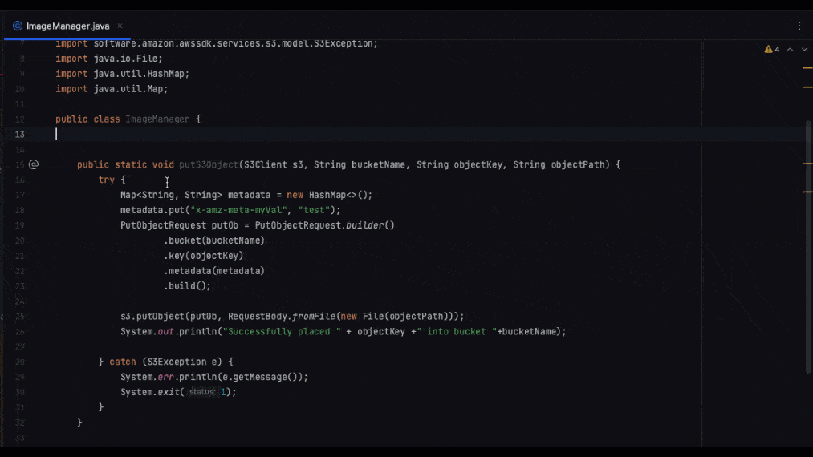
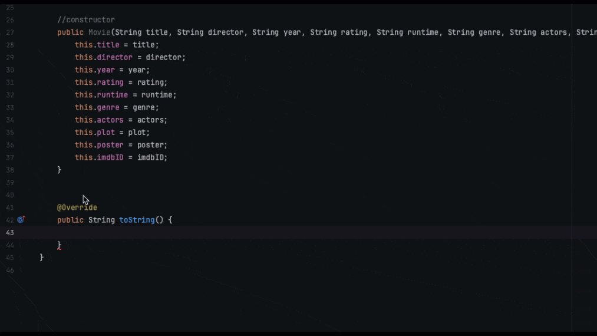

As developers, we're often asked complex technical questions that don't have simple and definitive answers. The best response we can muster is usually "Well, it depends...". This ambiguity stems from the many potential variables, context, and use cases that factor into most coding challenges and architecture decisions. When you are on the receiving end of that answer, it may feel frustrating (infuriating even) sometimes, but humans will usually try to help further, and ask qualifying questions to better understand the problem at hand.

This is similar to using generative AI tools like AI coding companions. However, rather than asking clarifying questions like a human, AI will attempt to provide an answer based on your initial inputs. The quality of the answer depends heavily on how well you frame the question and provide relevant context.

I got my fair amount of frustrations when I started to use these tools, as it would not read my mind as I was expecting (can you believe it?)! As I kept working with my AI coding assistant, I became better at leveraging it, and I can tell this help me bring back the joy to code again (disclaimer: in my current job, I don't get to code every day...).

In this article, I'll share tips and good practices from my own experience for getting the most out of AI coding assistants. I will use [Amazon CodeWhisperer](https://aws.amazon.com/codewhisperer/?trk=83c710fd-0a7a-416b-9bb8-baa535b64ee0&sc_channel=el), and with examples in Java, we'll cover:

- a brief overview of AI coding companions
- set your expectations correctly
- the art of prompt engineering
- Tips and tricks
- When AI companions fall short and you're better off coding yourself

The goal is to provide a practical guide so you can maximize productivity gains when collaborating with an AI pair programmer.

## Introducing AI Companions

AI coding companions are a new category of developer tools that utilize advancements in Generative AI (GenAI) to provide intelligent code completion and generation.

Unless you have lived under a rock for the past year, you must have heard about GenAI, and language models that can produce novel text, code, images and other content based on patterns learned from (very!) large datasets. Models like [Claude v2](https://www.anthropic.com/product), [LLaMA 2](https://ai.meta.com/llama/), [Stable Diffusion](https://stability.ai/stablediffusion), [GPT-4](https://openai.com/gpt-4) and [PaLM](https://developers.generativeai.google/) have demonstrated impressive fluency in natural language and programming languages.

>Note: If you are interested in learning more about LLMs and GenAI, check out the [GenAI space on community.aws](/generative-ai)

Using an AI coding companion helps to boost my productivity as I code. It generates real-time code suggestions as I type, keeping me in the flow instead of searching the web or asking colleagues for help. CodeWhisperer meets you inside your favorite IDE like VSCode or IntelliJ's, by installing the AWS Toolkit. It's optimized for AWS APIs, so you can build cloud apps faster. I also like the fact that it scans your code for security vulnerabilities, giving you pointers in your code on where to fix issues before they create problems. Finally, I find very useful that CodeWhisperer can flag or filter code suggestions that resemble open-source training data. It means that it will give you the associated open-source project’s repository URL and license so that you can more easily review them and add attribution.

You can use CodeWhisperer for free, by [signing up with just an email address](https://aws.amazon.com/codewhisperer/resources/#Getting_started?trk=83c710fd-0a7a-416b-9bb8-baa535b64ee0&sc_channel=el).

>Have a look at some useful introductory videos from my colleagues on this [playlist](https://www.youtube.com/watch?v=sFh3_cMUrMk&list=PLDqi6CuDzubxzL-yIqgQb9UbbceYdKhpK)

https://www.youtube.com/watch?v=sFh3_cMUrMk

When I started to use those tools, I found them almost magical. But soon, I was not really getting what I wanted, and grew frustrated. It is important to keep a few things in mind when working your new companion.

## Set Your Expectations Correctly

When first using an AI coding companion, it's important to set your expectations properly to get the most out of the tool. Here are a few points to remember:

- The AI will not write perfect code immediately. Expect initial results to be rough and require refinement. The AI may make logical errors or use suboptimal code structures. It may not automatically import the libraries they are suggesting for example.
  
- Don't expect the AI to understand broader context or objectives. It will generate code based solely on the prompts you provide. Give sufficient background and constraints.

- The AI may struggle with complex logic or novel coding scenarios. Its code generation abilities are best suited for common coding patterns and scenarios the AI has seen before. It can learn from you, from the example you provide, and it is continuously enriched with new code samples.
  
- You'll need to review, refine, and iterate. The AI should act as an intelligent assistant, not an autonomous coder. Treat it as a partner and carefully evaluate its suggestions. You are in the driving seat.
  
- Start with simple prompts and builds up from there. As you get a feel for the AI's capabilities, you can increase prompt complexity incrementally.
  
- Be patient and keep practicing prompt engineering. It takes time and experimentation to learn how to prompt the AI effectively.

Setting modest initial expectations will prevent frustration. The breakthroughs will come through deliberate practice and iteration. Remember, AI coding tools are not programmers - they are assistants to make programmers more efficient and productive. Keep these limitations in mind, while taking advantage of the tremendous potential.

## The art of prompt engineering

As AI coding assistants become more prevalent, developers need to learn how to provide effective prompts to these tools. Prompt engineering is the practice of structuring prompts to steer the AI assistant towards generating high-quality, relevant code.

For AI coding tools, the prompt consists of several parameters:

- Existing code in the open files and project: The AI reviews current code to infer patterns, style, and domain language. Classes names, methods names, variable names, and imported libraries provide critical context.
  
- Comments: Clear, concise comments orient the AI towards intended functionality without being overly prescriptive.

- Use intuitive names for code elements like variables and functions, as explained by my colleague Brooke in a [previous article](/posts/quick-tips-for-codewhisperer)
  
- Test cases: Tests demonstrate required behavior and provide concrete examples for the AI to train on. That's why test-driven development (TDD) is highly effective when working with AI assistants. Writing tests first creates a "specification" for the code. The AI uses these tests as prompts for generating function bodies and other code. You then can quickly validate that the generated code is delivering what you expected. I recommend you to have a look at this video about TDD.

https://www.youtube.com/watch?v=BcieaXtPHjM

For best results, develop a high-level prompt that describes what you want to achieve in human language. Avoid too many implementation details - let the AI figure those out. However, if you want to use a specific algorithm to improve performance for example, instruct your companion to do it. Then provide tests exemplifying desired behavior. As you write methods, get more granular with prompts about how each component should function. In the following example, I need help to write method to compute the Fibonacci number, then I ask to use an algorithm that has a better performance.

Sprinkle clarifying comments throughout. The AI continuously refines its output based on new prompts as you work through a feature.

With thoughtful prompt engineering, AI coding assistants can rapidly produce high-quality code. Treat the AI like a colleague - provide context, restraints, and examples. Develop prompts iteratively in tandem with the generated code. Before long, you'll be working in symbiosis with your new AI partner.

## Tips and Tricks

Now that you have a better understanding of prompt engineering with an AI Coding assistant, I am going to share some of my learnings working with an AI coding assistant.

### Check the Learn page

Prompt engineering is a new discipline that is moving fast, and we are all learning everyday how to better harness the technology. Links to tutorials, and examples of code are available from within the AWS toolkit. You will find the Learn page under the CodeWhisperer menu.

### Auto-suggestions

You can disable auto-suggestions. We had a debate in the team. Some developers really like to have auto-suggestions on all the time. They are used to get code suggestions, quickly check, and accept or decline. I prefer to be in control of my flow. When auto-completion appeared on Eclipse in early 2000's, and I moved away from Emacs/vi, I became a fanatic of control+SPACE to accelerated my writing. I like to call CodeWhisperer whenever I need it. Sometimes I just need the IDE's native autocompletion, because I know exactly what I want to write, and I can quickly check the methods I want to use for a Class. Once you pause auto-suggestions from the AWS Toolkit menu in your IDE, you can manually trigger CodeWhisperer by pressing Option+C (MacOS) or Alt+C (Windows).

### Regular Expressions

Writing regular expressions is a joy with an AI coding assistant. RegEx have always been my nemesis. I have never been good at them, so I used to spend a lot of time browsing pages of code on the Internet. Now, I get suggestions very quickly without leaving my IDE. In this example, I want to check whether an IP address is public or private ([RFC1918](https://www.rfc-editor.org/rfc/rfc1918)), CodeWhisperer proposes different solutions.

  

### Cross-File reference

Keep a few tabs opened. If you are like me, and are used to have 10s (or much more) files opened in your IDE, you may not get the results that you are looking for. I realized that keeping the few relevant Classes opened in my IDE would help my AI assistant deliver better suggestions. In the following, I am using the Fibonacci Class I created earlier in another file. I keep the file Fibonacci.java open, so CodeWhisperer has context.

### Documentation

Documentation is key in a project, specifically when you are collaborating with others. But it can be very time consuming to write good docs. I found CodeWhisperer reliable to help me write documentations for the code I wrote. In this example, I already wrote a method to upload objects into S3. With the little help of my assistant, I can quickly write a basic Javadoc.

IDEs are usually very good at speeding up the process of writing the Javadoc with templates. The difference here is that CodeWhisperer actually understands your code, and provide meaningful details. The more documentation you write with your code, the more your AI coding assistant learns from it, and can provide better outputs.

### Leading by example

As I alluded to previously, CodeWhisperer can learn from the examples you provide. This is true for documentation format, but also it can influence the way code is generated.

### Coding on AWS

You know how tedious it can be to dig through documentation and examples before we can start using new third-party libraries. But with Amazon's AI coding assistant, leveraging AWS services just got easier.

CodeWhisperer has been specifically trained on Amazon's own internal code, so it has learned directly from AWS experts how to best use their libraries. This means when I want to work with a service like DynamoDB, the tool already understands the most common usage patterns and best practices.

For example, when I needed to create a table in DynamoDB to store customer details, I simply added the AWS SDK, imported the DynamoDB package, and described my goal in plain language. Immediately, CodeWhisperer provided working code snippets demonstrating how to properly configure and instantiate the DynamoDB table with the attributes I wanted.

The AWS knowledge already embedded in the tool let me get up and running with a complex task in DynamoDB right away, without having to dig through documentation or examples first. It accelerates my development by letting me focus on describing the problem, not implementation details. And that time savings really starts to add up over the course of a project.

With CodeWhisperer, I can take full advantage of the AWS services I need more quickly and confidently. It's like having an AWS expert coder right inside my IDE.

### Keep your code more secure

As developers, we know how tricky it can be to write secure code. It's easy to overlook vulnerabilities that can put our applications at risk. That's why I'm excited the security scanning capabilities CodeWhisperer offers.

It analyzes both the code it generates and code you've written yourself to uncover potential security flaws. It goes beyond basic bugs and looks for subtle issues like the top 10 vulnerabilities listed by [OWASP](https://owasp.org/). So it can catch problems that are easy for us, humans, to miss.

When it detects a potential vulnerability, it doesn't just point it out. It actually suggests ways you can remediate the problem and make the code more secure. It's like having an expert security auditor recommend fixes right alongside you as you code. When you run the security scan, it check all the files, and libraries in your project, not just the open file.

### Keep your code private

By default, CodeWhisperer may utilize segments of your code to continue improving its suggestions. However, if you prefer to keep your code entirely private, you can easily opt-out.

In your IDE settings, simply locate the CodeWhisperer configuration and disable the "Contribute Code to Training" parameter. This ensures none of your proprietary code or sensitive segments are ever collected.

The choice is yours. But it's good to know you can easily adjust CodeWhisperer to align with your code privacy preferences. Just toggle that one setting and your code remains completely private while you continue enjoying personalized AI-powered suggestions.

## When AI companions fall short and you're better off coding yourself

While AI coding assistants can boost productivity in many cases, they do have limitations. As developers, we need to recognize situations where it's better to rely on our own skills and experience.

### Using New Libraries

If you're adopting a brand new library or framework that has little usage data available, the AI will lack the knowledge to help much. As humans, we can ramp up quickly by reading docs and examples. The AI can't draw on prior learning, so it's less useful in these cutting edge scenarios.

### Complex Logic Code

Some complex problems requiring tricky state management, recursive functions, or intricate control flow can easily confuse AI systems. Their pattern matching works best on straightforward logic. As developers, we're better equipped to reason through and debug complex stateful code.

### Domain-Specific Logic

When code relies on deep business logic or specialized domain knowledge, the AI simply won't have the requisite background. The institutional knowledge teams accumulate over years working in a domain remains a uniquely human asset.

### Performance Optimization

AI suggestions probably won't account for performance bottlenecks and pain points. Experienced developers have intuition for optimization gained from battle-testing code. We're still better at judiciously optimizing compute and memory intensive sections.

### Security, Compliance, Safety

For code where security, regulatory compliance, or safety is paramount, AI systems may miss critical edge cases. Human engineers bring greater caution and defensiveness when writing mission-critical code.

## Conclusion

Let's be honest - like any new technology, AI coding assistants have room to mature. They are not perfect autonomous coders yet. But combining my skills with CodeWhisperer has been a game changer for my productivity.

When I properly frame prompts and provide examples, my AI coding assistant can generate solid code for common tasks incredibly fast. It handles the repetitive coding so I can focus my mental energy on the truly complex logic. But I've still got to lead. CodeWhisperer won't intuit broader goals or read my mind. I provide context through comments, tests, and variable names. Prompting well takes practice and iteration.

There are times I'm absolutely better off coding myself - new libraries, optimization, security issues. These need human judgement and experience that AI coding companions lack currently. However, for general backend code, APIs, and integrations, they accelerate my workflow tremendously. Together we deliver robust code much faster than I could solo. That productivity boost is invaluable.

While not yet perfect, AI coding assistants have made my coding life markedly easier. I can't imagine working without an AI helper suggesting code alongside me. It's like having a programming expert in my IDE recommending code in real-time. I provide the creativity and judgement, CodeWhisperer brings speed and knowledge. Our combined strengths help us code faster and smarter. AI assistance is a game changer for software development.

If you want to explore further, I highly encourage you have a look at the videos on the below playlist. They are examples of using an AI coding assistant for creating end-to-end Java code.

https://www.youtube.com/playlist?list=PL5bUlblGfe0IOZEW8KBAzc1bCW8UcarAD
