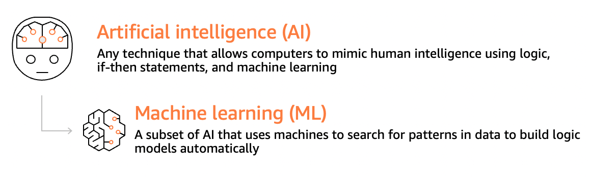
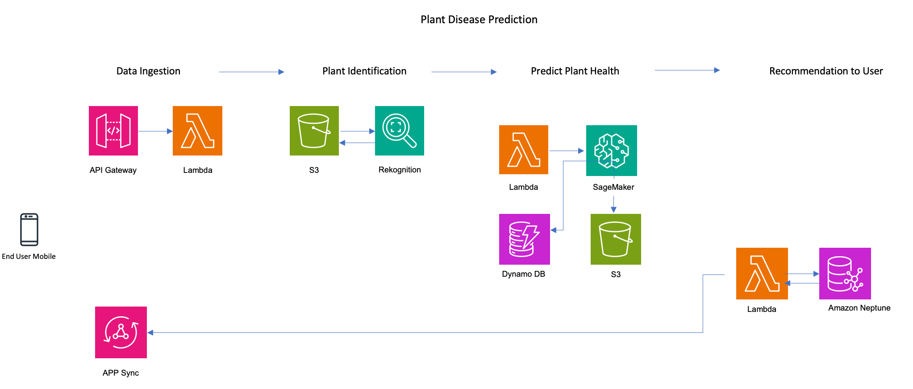
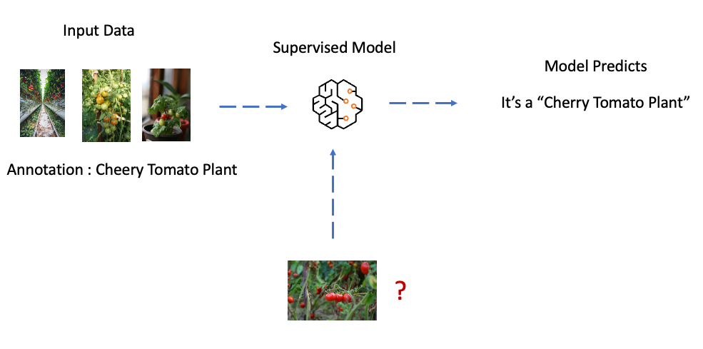
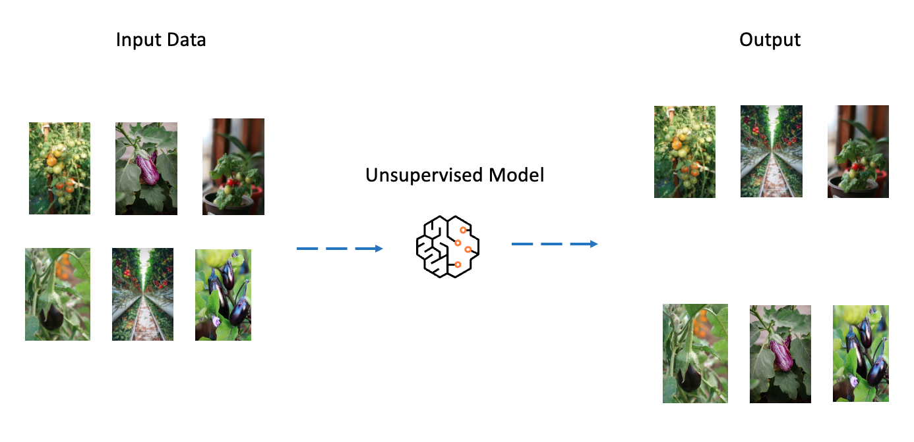

## Meet Jerry a young community gardener

Jerry is a passionate community gardener in the US city where I live. I met him in 2020, when he lost his whole tomato harvest due to early blights. Even after he applied fungicides, the blight spread. The next year, in order to avoid the same problems, he implemented preventative measures, planting disease-resistant cultivars and practicing good hygiene by sanitizing his tools. This time, aphids attacked and destroyed the tomato harvest again.

Back In 2021, Jerry was devastated to loose all of his tomato harvest due to early blights. Even after he took efforts to apply fungicides, the blight kept spreading and affected his crops. Following year he implemented preventive practices like planting disease-resistant varieties, and practiced good hygiene by sanitizing his tools. However, this time aphids attacked his tomato plants and he lost his tomato harvest again.

To overcome such challenges, jerry used to visually inspect the plants for signs of damage or infestation, such as chewed stems, or webbing and he took appropriate actions. He used traps or baits to capture pests and identify them and adjusted his fertilizer and watering cycles. I found these manual inspection rely heavily on the gardener's expertise and ability to detect subtle changes in plant health and this curiosity geared me to learn  how AI (Artificial Intelligence) and ML (Machine Learning) may be of jerry's assistance 

### What is Artificial Intelligence and Machine Learning

Both AI and ML are related but distinct concepts. AI refers to the ability of machines to perform tasks that typically requires human intelligence, such as decision-making, recognizing patterns, and learning from experience.

ML is a specific technique under AI. It uses data to train a model, and you have a trained model, you're capable of adding more data and predict an outcome based on the initial model. In other words ML uses algorithms and statistical models to allow machines to learn from data without being explicitly programmed.

Computer vision systems like [Amazon Rekognition](https://aws.amazon.com/rekognition/?sc_channel=el&sc_campaign=datamlwave&sc_geo=mult&sc_country=mult&sc_outcome=acq&sc_content=how-i-got-started-learning-ai-ml) is a specific AI that can analyze images or videos of plants and identify different species based on their physical features, such as leaf shape, stem structure, and flower color. These systems use various AI techniques such as Deep Learning, Convolutional Neural Networks (CNN), and object detection algorithms to recognize and classify different plants, pests and plant diseases. CNN are a type of deep learning architecture that is specifically designed for processing and analyzing visual data, they are capable of learning and recognizing patterns and features from visual data through multiple layers of convolutional and pooling operations.

Once the Plant type is classified then a predictive analysis function takes place. ML can be used to develop predictive models to identify and diagnose plants health based on the historical data  of tomato plant health and disease outbreaks.. This prediction can be used to recommend organic and natural pest management strategies by identifying patterns and anomalies. [Amazon SageMaker](https://aws.amazon.com/sagemaker/?sc_channel=el&sc_campaign=datamlwave&sc_geo=mult&sc_country=mult&sc_outcome=acq&sc_content=how-i-got-started-learning-ai-ml) is a fully managed machine learning service that provides a complete set of tools for building, training, and deploying machine learning models. With Amazon SageMaker, I can preprocess and clean the historical data, select the appropriate machine learning algorithm or framework, and train the model on the prepared dataset. SageMaker supports a wide range of popular machine learning algorithms and frameworks, such as TensorFlow, PyTorch, XGBoost, and scikit-learn, giving the flexibility to choose the one that best suits my needs. This pre trained model provides the outcome of its analysis using a text and image format.

Further on the last stage this output is used to identify the user recommendation. Knowledge Graphs, are designed to store and navigate highly connected data, making it suitable for applications that require modeling complex relations and querying large-scale graph datasets. [Amazon Neptune](https://aws.amazon.com/neptune/?sc_channel=el&sc_campaign=datamlwave&sc_geo=mult&sc_country=mult&sc_outcome=acq&sc_content=how-i-got-started-learning-ai-ml) is a fully managed graph database service that allows me to build, manage, and query graph databases. I'm able to create and manage knowledge graphs by defining entities, relationships, and properties within the graph database, then use graph query languages like SPARQL or Gremlin to traverse and extract information from the graph, enabling powerful knowledge-driven applications. Once a suitable recommendation is identified that is shared to Jerry for his actions.

## AI/ML distinction that helped me to get started

Over the course of finding ways to help Jerry, I learned the basic concepts of AI and ML and types of AI and ML’s available that can be used individually or in combination to address different business problems.

### Types of AI

Reactive Machines: These are AI systems that reacts to the current situation based on a set of predefined rules. Amazon Rekognition is a reactive machine AI, it can perform automatic actions in response to given Image or video. [Amazon Lex](https://aws.amazon.com/lex/?sc_channel=el&sc_campaign=datamlwave&sc_geo=mult&sc_country=mult&sc_outcome=acq&sc_content=how-i-got-started-learning-ai-ml) is another type of reactive machine AI, it is a conversational interface for building chatbots and natural language processing applications. It is designed to understand natural language and respond accordingly.

Limited memory: These AI systems can store and recall previous experiences to inform their decisions in the present. [Amazon Kendra](https://aws.amazon.com/kendra/?sc_channel=el&sc_campaign=datamlwave&sc_geo=mult&sc_country=mult&sc_outcome=acq&sc_content=how-i-got-started-learning-ai-ml) is a limited memory AI. It is a question answering system that uses natural language processing and machine learning techniques for information and answer user queries. It is designed to work with a limited set of data, such as an organization s internal documents, FAQ’s and knowledge bases.

Theory of mind: These AI systems have the ability to understand and predict the emotions, beliefs, and intentions of other agents. They are still in development, but they have potential applications in social robotics and virtual assistants. For example, the MIT Media Lab has developed a robot called Leonardo that can understand and interpret human gestures and facial expressions.

Self-aware AI: These systems have a sense of consciousness and are aware of their own existence, it will have emotions, needs, beliefs and potentially desires of its own. This is a topic of ongoing research.

### Types of ML

Supervised learning: In supervised learning, the machine learning model is trained on labeled data, which means that each data point has a corresponding label or output value. The goal is to learn a function that can map new, unseen inputs to their correct output labels. This is typically used for classification tasks, where the model predicts a discrete output label, or regression tasks, where the model predicts a continuous output value.

Unsupervised learning: In unsupervised learning, the machine learning model is trained on unlabeled data, which means that there are no corresponding output labels. The goal is to find patterns or structure in the data that can be used to understand the underlying relationships or features of the data. This is typically used for clustering tasks, where the model groups similar data points together, or for dimensionality reduction, where the model reduces the complexity of the data.

Reinforcement learning: In reinforcement learning, the machine learning model learns to make decisions by interacting with an environment and receiving feedback in the form of rewards or penalties. The goal is to learn a policy that maximizes the cumulative reward over time. This is typically used for sequential decision-making tasks, such as game playing or robotics. [AWS DeepRacer](https://docs.aws.amazon.com/deepracer/latest/developerguide/deepracer-how-it-works-overview-reinforcement-learning.html?sc_channel=el&sc_campaign=datamlwave&sc_geo=mult&sc_country=mult&sc_outcome=acq&sc_content=how-i-got-started-learning-ai-ml) is a perfect example to be quoted that exhibits reinforcement learning behavior

## How can you get started in the world of AI/ML

Incorporating AI/ML to solve a real life problem seemed like a difficult experience at first, but with services like Amazon Rekognition, SageMaker and Neptune I was able build a solution for an important problem and help Jerry to be more efficient on his gardening journey.

Now Jerry has a simple mobile interface through which he can submit a snap of the plant’s. the application will analyze the image using Amazon Rekognition, then provide recommendations and insights based on the analysis, leveraging the trained model and knowledge graph stored in Neptune.

### Step - 1 : Socialized to collaborate, Improve positive and productive learning experience and got exposed to diverse perspectives

While interacting with others, I got introduced to the material being presented by others, listened to concepts, asked question. By receiving feedback from others helped me understand the material and remember it more effectively.

1. There are many online communities and forums dedicated to AI and ML, where you can ask questions, share your knowledge, and learn from others. AWS [re:Post](https://repost.aws/topics/TAXwEBZll0TtWxbiOoSjJrfw?categoryID=36?sc_channel=el&sc_campaign=datamlwave&sc_geo=mult&sc_country=mult&sc_outcome=acq&sc_content=how-i-got-started-learning-ai-ml) is my favorite place to socialize with other members and AI/ML enthusiasts.

2. Attending conferences and meetups: Attending conferences and meetups is a great way to connect with other professionals in the AI and ML industry. Some conferences and meetups I followed include the International Conference on Machine Learning (ICML), the Conference on Neural Information Processing Systems (NeurIPS), and AWS [Innovate](https://aws.amazon.com/events/innovate-online-conference/?sc_channel=el&sc_campaign=datamlwave&sc_geo=mult&sc_country=mult&sc_outcome=acq&sc_content=how-i-got-started-learning-ai-ml).

3. Following [blogs](https://aws.amazon.com/blogs/machine-learning/?sc_channel=el&sc_campaign=datamlwave&sc_geo=mult&sc_country=mult&sc_outcome=acq&sc_content=how-i-got-started-learning-ai-ml), thought leaders and influencers in the AI and ML industry helped me stay up-to-date on the latest trends and technologies, and provide valuable insights and perspectives.

### Step - 2: Attended formal trainings for structured and comprehensive learning

1. [Machine Learning University](https://aws.amazon.com/machine-learning/mlu/?sc_channel=el&sc_campaign=datamlwave&sc_geo=mult&sc_country=mult&sc_outcome=acq&sc_content=how-i-got-started-learning-ai-ml) is a place for beginners that helped me with a self-service pathway to understand the foundations of Machine Learning.

2. I developed a custom [ramp-up guide](https://d1.awsstatic.com/training-and-certification/ramp-up_guides/Ramp-Up_Guide_Machine_Learning.pdf?sc_channel=el&sc_campaign=datamlwave&sc_geo=mult&sc_country=mult&sc_outcome=acq&sc_content=how-i-got-started-learning-ai-ml) that suits my learning needs to advance on specific needs such like natural language processing and computer vision.

### Step - 3: Self-assessment allowed me to identify knowledge gaps, set my learning goals, monitor progress, and fine tune my learning style

1. Identifying knowledge gaps: Self-assessment helped me to identify areas where I need to improve my understanding of the technology. This helped me focus my learning efforts on the areas that are most important for my goals.

2. Setting learning goals: Self-assessment helped me to set specific and measurable learning goals. This helped me to stay motivated and focused on my learning objectives.

3. Identifying learning style: Self-assessment helped me to identify my preferred learning style, such as visual, auditory, or kinesthetic. This helped me tailor my learning approach to suit my individual needs and preferences.

### Step - 4: Practice and challenges helped me with reinforced knowledge, identify weaknesses, encourage problem-solving, and increase creativity

1. Practicing helped to reinforce the concepts and skills that I learned. [AI/ML Workshops](https://workshops.aws/categories/AI%2FML?sc_channel=el&sc_campaign=datamlwave&sc_geo=mult&sc_country=mult&sc_outcome=acq&sc_content=how-i-got-started-learning-ai-ml) helped to improve the knowledge I gathered and comprehension of the concepts.

2. Participating on competitions helped me to develop and refine my skills with specific technology. With repeated participation on events like [AWS Deep racer](https://aws.amazon.com/deepracer/league/?sc_channel=el&sc_campaign=datamlwave&sc_geo=mult&sc_country=mult&sc_outcome=acq&sc_content=how-i-got-started-learning-ai-ml) league increased my proficiency and efficiency with the technology.

## How my journey transformed Jerry's gardening skills
Following are the words of Jerry. " Ever since I embraced the power of AI/ML based mobile app, my love for growing tomatoes reached new heights. No longer limited by the challenges of pest infections and plant disease, I now have an incredible tool at my fingertips. Together with this symbolic relationship that celebrates the wonders of nature and the limitless potential of technology, not only my tomato harvest increased but I'm looking to extend this capability to my other plant types"

My journey in learning AI/Ml and applying that knowledge to solve jerry's gardening problem led to a remarkable transformation of his gardening skills. This experience showcased the incredible potential of AI/ML to revolutionize traditional gardening practices providing innovative solutions and unlocking new level of success in the world of gardening.

Go Build and Enjoy solving real world problems!!!

