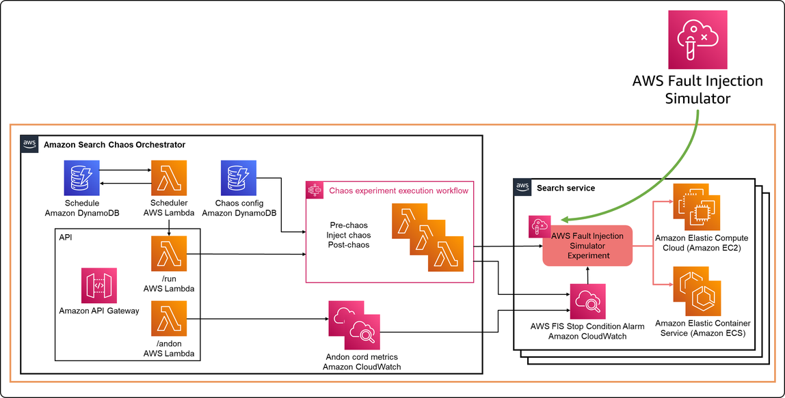
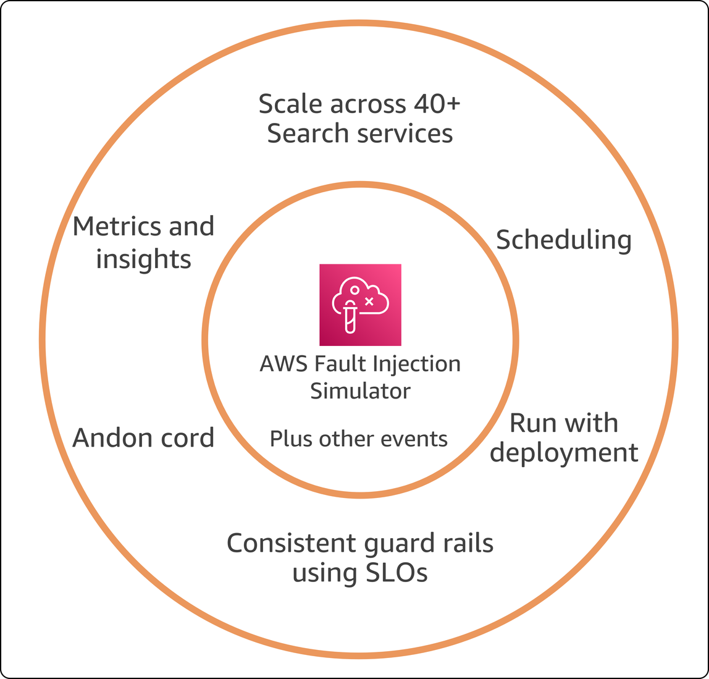

|ToC|
|---|

**Note**: _This is the first in a two-part series. [Part 2 can be read here](/posts/amazon-search-chaos-engineering-journey)_

This is a story about Chaos Engineering, and how the high scale distributed services that power Search on [Amazon.com](http://amazon.com?sc_channel=el&sc_campaign=resiliencewave&sc_geo=mult&sc_country=mult&sc_outcome=acq&sc_content=how-search-uses-chaos-engineering) use it to ensure that all customers can search Amazon’s expansive catalog whenever they need to. Chaos Engineering enables teams to experiment with faults or load to better understand how their applications will react, and therefore improve resilience. And this is also a story about DevOps, and how a single team dedicated to resilience was able to create technologies and drive changes that made it easier for the multiple teams that are part of Search to run Chaos experiments on the many services powering Search.

If you are looking to implement Chaos Engineering to improve resilience, looking for how to create an effective model to empower builders, or both, then read on.

## DevOps

DevOps is a big topic and I cannot cover it all here. I do like the definition that my colleague Jacquie Grindrod wrote in her explanation of [What is DevOps?](/concepts/what-is-devops?sc_channel=el&sc_campaign=resiliencewave&sc_geo=mult&sc_country=mult&sc_outcome=acq&sc_content=how-search-uses-chaos-engineering)

>DevOps is an approach to solving problems collaboratively. It values teamwork and communication, fast feedback and iteration, and removing friction or waste through automation.

You may have heard about all the tools used in DevOps like Kubernetes, Terraform, and GitLab, but tools are not the right place to start. DevOps is about *culture.* See Jacquie’s definition above? *Collaboration*, *teamwork*, *communication* — these are all part of culture. The automation tools then enable the culture to get stuff done.

As I said, DevOps is big, so here I will only focus on the primary DevOps concepts that are illustrated in the story of how Search adopted Chaos Engineering:

* **Empowering teams**: DevOps fosters a culture where teams are empowered to try new ideas and learn from both successes and failures. 
* **Ownership and responsibility**: In DevOps, teams own the services they build and are responsible for ensuring the right outcomes. Empowerment is a pre-requisite to this, as the team needs to be able to understand how their services are used and be able to implement changes they see fit.
* **Breaking down walls:** The impulse behind "DevOps" is to [break down the traditional barriers that often exist between development and operations teams](/posts/devops-wrong-answers-only#walls). By promoting collaboration and shared goals, DevOps aims to eliminate silos and create a more streamlined and efficient workflow.
* **Enabling teams to do more**: This is where automation and tools can play a major role. But also organizational structure and responsibilities are crucial here. A team that takes a hand-off from the development team and operates the service *for* them is not ideal (see “breaking down walls” above). But a specialized team that works *with* development and reduces the [undifferentiated heavy lifting](/posts/devops-wrong-answers-only#undifferentiated-heavy-lifting) of operating the service is better. *Undifferentiated heavy lifting* is all the hard work (“heavy lifting”) that is necessary to accomplish a task (say, deploy and operate a service) but does vary appreciably from service to service (“undifferentiated”). If every service team has to do this work themselves, then it is wasteful. Having one team to create tools and processes that do much of this heavy lifting removes the burden from the service teams is liberating!

## Amazon Search

If you have shopped on Amazon.com or any of the Amazon sites worldwide you have probably used Search to find what you were looking for. Searching for a topic like Chaos Engineering returns over 1,000 results (Figure 1), and Amazon Search then lets you refine that search by many different parameters like language, book format, or release date.

Over 1,000 results is a lot, and Search is responsible for quickly serving results from a catalog of many millions of products to over 300 million active customers. On Prime day 2022, Amazon Search served 84,000 requests per second. That is massive scale. The principles I will share with you here work to enable resilience at that scale, but they also work at whatever scale your systems run too.

Amazon Search consists of over 40 backend services, owned by different teams of builders (also known as [two-pizza teams](https://aws.amazon.com/executive-insights/content/amazon-two-pizza-team?sc_channel=el&sc_campaign=resiliencewave&sc_geo=mult&sc_country=mult&sc_outcome=acq&sc_content=how-search-uses-chaos-engineering)).  Each team has ownership of their service (or services), from design and implementation, to deployment and operation. So already we can see DevOps practices emerging in our story. When the team owns both development and operations, that is one way to adopt a culture of **ownership and responsibility**, and **breaking down walls** between development and operations. Amazon builder teams are able to own deployment and operation because there is an Amazon-wide builder tools team that creates tooling and processes, removing undifferentiated heavy lifting, and **enabling teams to do more.** A specialized team (Builder Tools) enables two-pizza teams to do more. We will see an echo of this approach later when we talk about how Search adopted Chaos Engineering.

## Chaos Engineering

>Chaos Engineering is the discipline of experimenting on a system in order to build confidence in the system’s capability to withstand turbulent conditions in production. – [Principles of Chaos Engineering](https://principlesofchaos.org/)

Some folks are put off by the term “chaos”, but it is important to know that Chaos Engineering is *not* about creating chaos. Instead, it is about protecting your applications from the chaos that is already in production by exposing them to chaos in a controlled manner. You apply the scientific method, creating a hypothesis. The hypothesis is based on how you have designed your application to stay resilient to specific events such as faults or load scenarios. Then you run an experiment by simulating those events, and observing how your application performs, testing the hypothesis. This will show you were your application is doing well against those events, or where you can improve it.

Watch [Chaos Engineering in under 2 minutes](/posts/chaos-engineering-2-minutes) to learn more, and there is also a list of resources to learn more there.

**Empowering teams** includes giving them the autonomy to create and run chaos experiments on their services.

## The Search Resilience Team

The Search Resilience Team is a two-pizza team within the Search organization, on a mission to improve and drive the resilience of the Amazon Search service. They bring everything I have discussed above together: DevOps + Amazon Search + Chaos Engineering. That said, they would not necessarily describe themselves a DevOps team, preferring to call themselves an operational excellence and site reliability engineering organization. But just like the Amazon builder tools team operates as a specialized team **enabling teams to do more** across all of Amazon, the Search Resilience Team operates as a specialized team *within* Search **enabling teams to do more** across the 40+ two-pizza teams that own services in the Search org.

Remember that the DevOps model does not have Search Resilience team creating nor owning the chaos experiments for their service teams. Instead they needed to create a scalable process, and the tech behind it, to make it easier for those service teams to create, own, and run chaos experiments, even in production. To do this the Search Resilience team created the Amazon Search Chaos Orchestrator.

## Amazon Search Chaos Orchestrator

The Search Resilience team had many specific goals in creating this chaos orchestrator, which I will discuss a little later. But the overall goal was to create a system to make it easier for Search two-pizza teams to create and run chaos experiments with the services they own. Figure 2. shows an overview of the orchestrator.

Note I have made an annotation so you cannot miss [AWS Fault Injection Simulator (AWS FIS)](https://docs.aws.amazon.com/fis/latest/userguide/what-is.html?sc_channel=el&sc_campaign=resiliencewave&sc_geo=mult&sc_country=mult&sc_outcome=acq&sc_content=how-search-uses-chaos-engineering). AWS FIS is a managed service that enables you to perform fault injection experiments on your AWS-hosted applications, and therefore is a natural choice when it came to creating and running chaos experiments on the Search services, which are all hosted on AWS using AWS services like Amazon S3, Amazon API Gateway, Amazon DynamoDB, Amazon EC2, Amazon ECS, and more. FIS is something anyone running on AWS can use today. The Search Resilience team wanted to make it as easy as possible for Search teams to use FIS, without each of them having to build the same integrations and overhead. 

There were Search-specific requirements they wanted to implement, so each team did not have to do it themselves. For example see in Figure 2 where it says “Chaos experiment execution workflow.”  By making the chaos experiment part of a workflow, they can add Search-specific steps before and after the experiment. For example the pre-experiment steps checks if tests have passed in pre-production environments before running them in production, and they also check that no customer-impacting events are in progress before running an experiment. After the experiment, the workflow checks if metrics were adversely impacted (see [Consistent Guardrails Using SLOs](#consistent-guardrails-using-slos) below for more details on these metrics).

There were several other Search-specific requirements that are made easier for teams by using the chaos orchestrator. These goals are shown in Figure 3, and I will give you an explanation of each.

### Scale across 40+ Search services

Just by removing the undifferentiated heavy lifting, the Search Orchestrator helps to achieve this goal. Also, the Search resilience team wanted to make it easy to use so they created graphical UX front-end. You can see API Gateway in Figure 2 above that presents two APIs. Teams are free to programmatically call these, or they can use the graphical UX that calls these APIs. You can see in Figure 4 it is not the “prettiest” UX ever, but it gives Search teams all the functionality they need to define and run chaos experiments. This is also in line with agile and DevOps where we spend effort only on things that matter.

### Scheduling

AWS FIS documents [instructions on how to schedule experiments using Amazon EventBridge Scheduler](https://docs.aws.amazon.com/fis/latest/userguide/fis-tutorial-recurring-experiment.html?sc_channel=el&sc_campaign=resiliencewave&sc_geo=mult&sc_country=mult&sc_outcome=acq&sc_content=how-search-uses-chaos-engineering). But remember, we want to eliminate the undifferentiated work. So this is just built in to the orchestrator, and Search teams can use it. Note in Figure 2 that the Search Resilience team went a somewhat different route, using Amazon DynamoDb to store schedules and EventBridge actually invokes a Lambda function to read the schedules and kick of the experiment runs.

### Run with Deployment

Similar to scheduling, anyone using FIS can run it with their deployment pipelines. For example [here is how to integrate it from AWS CodePipeline](https://aws.amazon.com/blogs/architecture/chaos-testing-with-aws-fault-injection-simulator-and-aws-codepipeline?sc_channel=el&sc_campaign=resiliencewave&sc_geo=mult&sc_country=mult&sc_outcome=acq&sc_content=how-search-uses-chaos-engineering). But again, to save work for the two-pizza teams, why not just make it work with the teams’ pipelines. Also, Search uses an internal Amazon tool for pipelines and deployment, so the orchestrator takes on the work of integrating with this.

### Consistent Guardrails Using SLOs

OK, a lot to unpack here.  First guardrails — these are a MUST for chaos experiments. Guardrails are conditions you define that indicate the experiment will cause unwanted impact, so when these conditions happen, the experiment must be stopped and rolled back. Of course AWS FIS lets your define stop conditions as guardrails — you can see those on the right side of Figure 2. So what added benefit does the Search chaos Orchestrator provide here? That is where SLOs come in. 

Service Level Objective, or SLOs, are simply goals that look something like this (this is just a fictional example): In a 28 day trailing window, we will serve 99.9% of requests with a latency of less than 1000 milliseconds. The Search Resilience team did not just build the chaos experiment orchestrator, but they also build an SLO definition tracking system too. This system lets teams define the SLOs for their service, and then it monitors those SLOs, tracking when services are out of compliance. The Search Chaos Orchestrator integrates with this, and uses these SLOs as guardrails for the experiments run by the service teams. In addition to stopping the experiment, the orchestrator notifies service owners and cuts a tracking ticket when a guardrail is breached.

### Andon Cord

See that big red button in Figure 4 that says “Halt All Search Chaos Experiments”?  That is the Andon cord. The [Andon was created by Toyota manufacturing](https://mag.toyota.co.uk/andon-toyota-production-system/) in their factories where “each and every one is permitted to stop the production line if they spot something they perceive to be a threat to vehicle quality”. Here it allows anyone to stop all the experiments if there is any risk to customer experience. They can use the big red button or a CLI command. You can see in Figure 2 how the Andon functionality is implemented making use of the stop condition functionality built into FIS. In addition to stopping all running experiments, the Andon will cause the Search Resilience engineer who is on-call to be paged. Most two-pizza teams across Amazon have at least one member on-call to handle incidents 24/7, which is part of the DevOps practice of owning service operation.

### Metrics and Insights

[AWS FIS supports metrics and logging.](https://docs.aws.amazon.com/fis/latest/userguide/monitoring-experiments.html?sc_channel=el&sc_campaign=resiliencewave&sc_geo=mult&sc_country=mult&sc_outcome=acq&sc_content=how-search-uses-chaos-engineering) The chaos engineering orchestrator uses that functionality, and aggregates the results from all Search teams to present as a single report.

## A Chaos Experiment on Amazon Search

Amazon Search, like many Amazon services, makes use of emergency levers as part of their resilience strategy. An [emergency lever](https://docs.aws.amazon.com/wellarchitected/latest/framework/rel_mitigate_interaction_failure_emergency_levers.html?sc_channel=el&sc_campaign=resiliencewave&sc_geo=mult&sc_country=mult&sc_outcome=acq&sc_content=how-search-uses-chaos-engineering) is a rapid process that allows systems to recover from stress or impact. So naturally Search wants to experiment to understand that the emergency levers work as intended. In this case, a simplified hypothesis might be as follows:

>When the search load exceeds [some value] and errors and latency start to climb (specify which metrics and by how much), then activating the emergency lever to disable non-critical services will keep errors and latency within acceptable limits (define these), up to loads of [specified amount]. 

This particular emergency lever disables all non-critical services, conserving resources when the system is under duress, so that critical services remain available. You can see this in Figure 5. On the left is the normal Search experience. On the right is after the emergency lever has been pulled. Critical functionality such as title, image, and price is shown, but nothing else. Search would rather show the experience on the right, than to fail to return any results at all. This is a resilience best practice called [graceful degradation](https://docs.aws.amazon.com/wellarchitected/latest/framework/rel_mitigate_interaction_failure_graceful_degradation.html?sc_channel=el&sc_campaign=resiliencewave&sc_geo=mult&sc_country=mult&sc_outcome=acq&sc_content=how-search-uses-chaos-engineering).

For the chaos experiment, the events include a combination of adding synthetic load to the system and then pulling the emergency lever. This way Search can build confidence that in the case of a real high load event, the lever will enable Search to remain available.

## Conclusion

Chaos Engineering is a great way to better understand the resilience of your services. And AWS FIS is a great service for creating and running chaos experiments on AWS. Two-pizza teams in Search could have each independently began using FIS and running experiments. But by adopting a DevOps culture that focused on **enabling teams to do more**, the Search Resilience team was able to make the process even easier for Search two-pizza teams, and add many valuable features that make chaos engineering more effective across all of Search.

## You May Also Be Interested In

**[Engineering Resilience: Lessons from Amazon Search's Chaos Engineering Journey](/posts/amazon-search-chaos-engineering-journey)**
* Learn about the Search Resilience team, detailing their progression from running load tests in the production environment to adopting chaos engineering and conducting numerous large-scale experiments 

**[Big Trucks, Jackie Chan movies, and millions of cardboard boxes: How Amazon Does DevOps in Real Life](/posts/how-amazon-does-devops-in-real-life)**
* Read about three more examples of Amazon teams using DevOps to drive resilience

**[Improving Business Resiliency with Chaos Engineering • GOTO 2021](https://www.youtube.com/watch?v=6NIh-GsO1Kg)**
* Learn how Amazon Prime Video followed their journey to enable teams to use DevOps practices and Chaos Engineering.

**[re:Invent ARC206 - Reliable scalability: How Amazon.com scales in the cloud](https://bit.ly/reliable2022)**
* With real-world examples of massive-scale production workloads from IMDb, Amazon Search, Amazon Selection and Catalog Systems, Amazon Warehouse Operations, and Amazon Transportation, this presentation shows how Amazon builds and runs cloud workloads at scale and how they reliably process millions of transactions per day

**[Chaos Engineering in the cloud](https://aws.amazon.com/blogs/architecture/chaos-engineering-in-the-cloud?sc_channel=el&sc_campaign=resiliencewave&sc_geo=mult&sc_country=mult&sc_outcome=acq&sc_content=how-search-uses-chaos-engineering)**
* This blog introduces you to Chaos Engineering for cloud-based applications