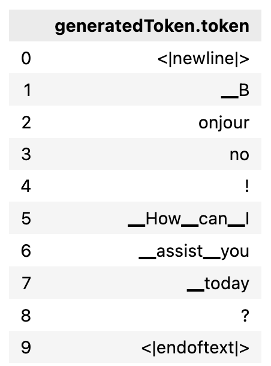

|ToC|
|---|

Generative Artificial Inteligence (Generative AI) has made remarkable progress in 2022, pushing the boundaries with its ability to generate content mimicking human creativity in text, images, audio, and video.

The abilities of Generative AI stem from deep learning models (Fig. 1), which are trained using vast amounts of data. Deep learning models, after extensive training on billions of examples, become what is called "foundation models" (FM). Large language models (LLMs) are one kind of FM that leverage these foundation models for generative capabilities like reasoning, problem-solving and creative expression at a human level. They are capable of understanding language and performing complex tasks through natural conversation.


Over the past few decades, artificial intelligence has been steadily advancing. However, what makes recent advances in generative AI remarkable is its accessibility and easy integration into applications. 

In this blog, I'll provide you with the tools to understand the workings of LLMs and select the optimal one for your needs.

## How LLMs Work

There are a [lot popular LLMs](https://aws.amazon.com/what-is/large-language-model/), some of those more advanced LLMs have been trained on far more data than others. The additional training empowers them to tackle complex tasks and engage in advanced conversations. 

Nonetheless, their operation remains the same: users provide instructions or tasks in natural language, and the LLM generates a response based on what the model "thinks" could be the continuation of the prompt. (Fig. 2).


The art of building a good prompt is called [prompt engineering](https://aws.amazon.com/what-is/prompt-engineering/). It is a discipline with specific techniques for developing and refining prompts that allow language models to have effective outputs. Prompt engineering is focused on optimizing prompts for efficient and helpful responses from language models.

With a well-designed prompt, the model's pre-trained abilities can be leveraged to serve novel queries within its scope. Two of the most well-known Prompt Engineer techniques are:

### Zero-shot Learning:

For tasks that do not require prior examples to understand the context of the task that is required. For example, classification.


### Few-shot Learning:

Zero-shot capabilities refer to the ability of large language models to complete tasks they did not train it on. However, they still face limitations when performing complex tasks with only a short initial prompt without guidance. Few-shot Learning improves model performance on difficult tasks by incorporating demonstrations or in-context learning.

>📚 **Tip:** Put the LLM in context of what its role is, for example: "You are a travel assistant".


Learn about prompt engineering: 

- [What is prompt engineering?](https://aws.amazon.com/what-is/prompt-engineering/)

- [Prompt engineering for foundation models](https://docs.aws.amazon.com/sagemaker/latest/dg/jumpstart-foundation-models-customize-prompt-engineering.html)

- [Prompt Engineering Guide](https://www.promptingguide.ai/)

- [Guide to Anthropic's prompt engineering resources](https://docs.anthropic.com/claude/docs)

- [Prompt Engineering for Developers: How AI Can Help With Architecture Decisions](https://community.aws/posts/prompt-engineering-for-developers/how-ai-can-help-with-architecture-decisions)

- [Fun on a Friday with Prompt Engineering and thinking about re:Invent 2023](https://community.aws/posts/friday-fun-style-changing-reinvent-guide)


## How To Choose The Best LLM? 

To make this decision, I am going to list some aspects that I consider to be most important:

### The LLM's Mission In The Application

What will be the need that the LLM is going to solve in the application. The functionalities with the highest usage are:

- Summarize
- Classification
- Question Answering
- Code generation
- Content writing
- Instruccion following
- Multilingual Task
- [Embedding:](https://docs.aws.amazon.com/bedrock/latest/userguide/embeddings.html) translate the text into a vector representation.

As I mentioned before, there are advanced models capable of handling complex tasks and multitasking. For Example, [Llama-2-13b-chat](https://aws.amazon.com/es/bedrock/llama-2/) is a powerful LLM for managing conversations, but only in English.

You can select a model that can satisfy all your requirements at once, or create decoupled applications with multiple specialized models for each task. 

> 📚 **Remember:** Use prompt engineer to generate desired outputs.

## The language 

There are LLM specialized in certain tasks, capable of speaking one language or more than one. It’s important to define if your application will speak only one language or more than one before choosing the LLM. For example, [Titan Text Express](https://aws.amazon.com/es/bedrock/titan/) is multilingual, unlike [Titan Text Lite](https://aws.amazon.com/es/bedrock/titan/), which only talks in English. 

> 📚 **Tip:** : If the LLM you need doesn't have the desired language function, try using a multilenguial LLM for translation or  Amazon Translate before sending the prompt. 


### Leght Of Context Window 

A context window refers to the length of text an AI model can handle and reply to at once, this text, in most LLMs, is measured in tokens. 


Regarding `tokens`, are like the individual building blocks that make up words. For example:

- In English, a single token is typically around 4 characters long.

- A token is approximately 3/4 of a word.

- 100 tokens equate to roughly 75 words.

This code snippet shows how to determine the token count using Jurassic-2 Ultra with Amazon Bedrock.

```python
import boto3
import json
bedrock_runtime = boto3.client(
    service_name='bedrock-runtime', 
    region_name='us-east-1'
)
model_id = "ai21.j2-ultra-v1"

prompt="Hola Mundo"

kwargs = {
  "modelId": model_id,
  "contentType": "application/json",
  "accept": "*/*",
  "body": "{\"prompt\":\""+ prompt +"\",\"maxTokens\":200,\"temperature\":0.7,\"topP\":1,\"stopSequences\":[],\"countPenalty\":{\"scale\":0},\"presencePenalty\":{\"scale\":0},\"frequencyPenalty\":{\"scale\":0}}"
}

response = bedrock_runtime.invoke_model(**kwargs)
```

Breaking down the response:

```python
response_body = json.loads(response.get("body").read())
completion = response_body.get("completions")[0].get("data").get("text")
print(completion)
```
```
Bonjourno! How can I assist you today?
```
Let's find out the token count in both the Prompt Input and Generated Output(completion):

**Prompt Input:**

```
tokens_prompt = response_body.get('prompt').get('tokens')
df_tokens_prompt = json_normalize(tokens_prompt)[["generatedToken.token"]]
```


**Generated Output:**

```
tokens_completion = response_body.get("completions")[0].get('data')["tokens"]
df_tokens_completion = json_normalize(tokens_completion)[["generatedToken.token"]]
```



### Pricing

As there are open source LLMs, there are other payments, depending on the provider, modality and model, however, they all take the number of tokens into consideration.

Referring to the modality of paid LLMs:

**✅ Only Inference:** When invoke the model as an API, the pricing corresponds to the number of incoming and outgoing tokens (Fig. 5). [Amazon Bedrock](https://aws.amazon.com/es/bedrock/) is fully managed service offers the option to use [LLMs through an API call](https://docs.aws.amazon.com/bedrock/latest/userguide/using-api.html), with a choice between on-demand or [Provisioned Throughput](https://docs.aws.amazon.com/bedrock/latest/userguide/prov-throughput.html) to save costs, see [pricing here](https://aws.amazon.com/es/bedrock/pricing/) and [pricing examples here](https://aws.amazon.com/bedrock/pricing/?refid=8a3219f5-3219-4b0e-aca1-a209523015e8#:~:text=on%20Amazon%20Bedrock.-,Pricing%20examples,-AI21%20labs).


**✅ Customization (fine-tuning):** when it is necessary to fine-tuning the model to a specific need (Fig. 6). In this type of pricing to the previous value, you must add the new training and the storage of the new model. [Amazon Bedrock](https://aws.amazon.com/es/bedrock/) also offers a mode for [customization (fine-tuning)](https://docs.aws.amazon.com/bedrock/latest/userguide/custom-models.html).  

 Modality ")

For those who need to experience more there is [Amazon SageMaker JumpStart](https://aws.amazon.com/sagemaker/jumpstart/), which allows you, within several functionalities, to train and tune models before deployment with a jupyter notebook. Amazon SageMaker JumpStart  has available [this models](https://aws.amazon.com/sagemaker/jumpstart/getting-started/?sagemaker-jumpstart-cards.sort-by=item.additionalFields.priority&sagemaker-jumpstart-cards.sort-order=asc&awsf.sagemaker-jumpstart-filter-product-type=product-type%23foundation-model&awsf.sagemaker-jumpstart-filter-text=*all&awsf.sagemaker-jumpstart-filter-vision=*all&awsf.sagemaker-jumpstart-filter-tabular=*all&awsf.sagemaker-jumpstart-filter-audio-tasks=*all&awsf.sagemaker-jumpstart-filter-multimodal=*all&awsf.sagemaker-jumpstart-filter-RL=*all&awsm.page-sagemaker-jumpstart-cards=1), and check the [pricing here.](https://aws.amazon.com/sagemaker/pricing/)


## Comparison of LLMs and features

Take a look at this chart of some available [Amazon Bedrock](https://docs.aws.amazon.com/bedrock/latest/userguide/what-is-bedrock.html) models for a broader perspective when making comparisons.  

|Provider|Model|Supported use cases|Languages|Max tokens Context Window|
 |--|--|--|--|--|
 |[Anthropic](https://www.anthropic.com/)|[Claude v2](https://aws.amazon.com/es/bedrock/claude/)|Thoughtful dialogue, content creation, complex reasoning, creativity, and coding|English and multiple other languages|[~100k](https://docs.anthropic.com/claude/docs/introduction-to-prompt-design#prompt-length)|
 |[Anthropic](https://www.anthropic.com/)|[Claude v1.3](https://aws.amazon.com/es/bedrock/claude/)|Text generation, Conversational, Coding|English and multiple other languages|[~100k](https://docs.anthropic.com/claude/docs/introduction-to-prompt-design#prompt-length)|
 |[Cohere](https://cohere.com/)|[Command](https://aws.amazon.com/es/bedrock/cohere-command/)|Chat, text generation, text summarization.|English|[4K]((https://docs.cohere.com/docs))|
 |[AI21 Labs](https://www.ai21.com/)|[Jurassic-2 Ultra](https://aws.amazon.com/es/bedrock/jurassic/)|Question answering, summarization, draft generation, advanced information extraction, ideation for tasks requiring intricate reasoning and logic.|English, Spanish, French, German, Portuguese, Italian, Dutch |[8,192](https://aws.amazon.com/marketplace/pp/prodview-f4y5ksmu5kccy?sr=0-1&ref_=beagle&applicationId=AWSMPContessa)|
 |[AI21 Labs](https://www.ai21.com/)|[Jurassic-2 Mid](https://aws.amazon.com/es/bedrock/jurassic/)|Question answering, summarization, draft generation, advanced information extraction, ideation.|English, Spanish, French, German, Portuguese, Italian, Dutch|[8,192](https://aws.amazon.com/marketplace/pp/prodview-bzjpjkgd542au)|
 |Amazon|[Titan Text Generation 1 (G1)- Lite](https://aws.amazon.com/es/bedrock/titan/)|Open-ended text generation, brainstorming, summarization, code generation, table creation, data formatting, paraphrasing, chain of thought, rewrite, extraction, Q&A, and chat.|English|[4K](https://aws.amazon.com/es/bedrock/titan/)|
 |Amazon|[Titan Text Generation 1 (G1) - Express](https://aws.amazon.com/es/bedrock/titan/)| Retrieval augmented generation, open-ended text generation, brainstorming, summarization, code generation, table creation, data formatting, paraphrasing, chain of thought, rewrite, extraction, Q&A, and chat.|100+ languages|[8K](https://aws.amazon.com/es/bedrock/titan/)|
 |Amazon|[Titan Embeddings](https://aws.amazon.com/es/bedrock/titan/)| Translates text into a numerical representation, Text retrieval, semantic similarity, and clustering.|25+ languages|[8K](https://aws.amazon.com/es/bedrock/titan/)|
|Meta |[Llama-2-13b-chat](https://aws.amazon.com/es/bedrock/llama-2/)| Assistant-like chat |English|[13B](https://aws.amazon.com/es/bedrock/llama-2/)|
  


## Conclusion

Thank you for joining this reading where I explain how LLMs work, and how to improve response using the prompt engineering technique. You learned how to choose the best one for your application based on features such as:


- The LLM’s mission in the application: what problem will the LLM help me to solve?

- The language: Do I need the LLM to understand in multiple languages?

- Length Of Context Window: The amount of text in the input request and generated output.

- Pricing: Where I need to know the cost of the LLM that fits my needs and also ask myself: Are the LLMs available sufficient for what I need? If not, do I need to do fine-tuning?

Finally, you saw what a comparison chart built with some of the available Amazon Bedrock models looks like.  


🚀 Some links for you to continue learning and building:

- [Integrating Foundation Models into Your Code with Amazon Bedrock](https://www.youtube.com/watch?v=ab1mbj0acDo)

- [Amazon Bedrock Workshop](https://github.com/aws-samples/amazon-bedrock-workshop)

- [AWS Kendra LangChain Extensions](https://github.com/aws-samples/amazon-kendra-langchain-extensions/tree/main)

- [Prompt Engineering Techniques](https://www.promptingguide.ai/techniques)

- [Learn the fundamentals of generative AI for real-world applications](https://www.deeplearning.ai/courses/generative-ai-with-llms/)

- [LangChain for LLM Application Development](https://www.deeplearning.ai/short-courses/langchain-for-llm-application-development/)

- [The Cohere Platform](https://docs.cohere.com/docs)

- [Context Window in LLMs](https://ai.plainenglish.io/context-window-in-llms-198e8079d3c8)
