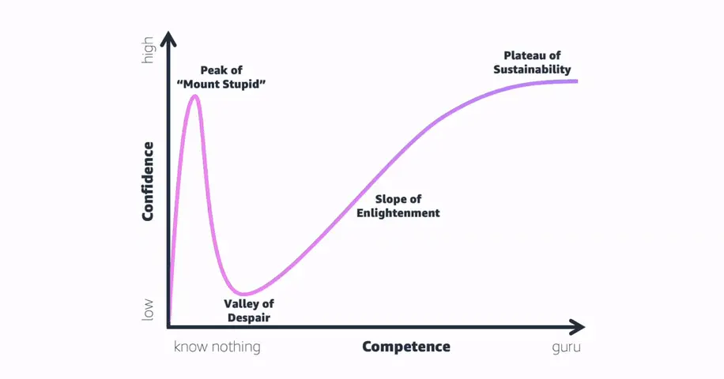
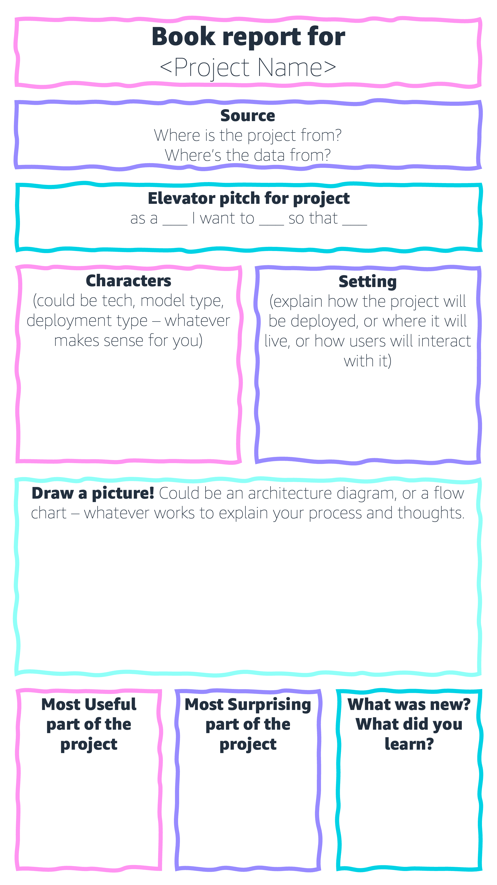

|ToC|
|---|

## Introduction

Generative AI is so popular now that when Uber drivers find out I work in tech, they immediately ask me about its applications, use cases, and ethics. Not only is it thrilling to discuss something I’m so passionate about like GenAI, but it’s also heartening to see deep artificial intelligence and machine learning conversations happening outside of tech circles. The pinnacle of these chats? When someone’s curiosity piques and they ask how they can dive into AI themselves. That’s the kind of enthusiasm that fuels my work.

At the fifth annual [Nasdaq LGBTQ+ Leaders Conference](https://www.nasdaq.com/videos/colors-of-the-rainbow%3A-nasdaq-hosts-its-fifth-annual-lgbtq-leaders-conference-1) earlier this year, I highlighted a crucial point: while many use AI, not everyone gets the opportunity to build it, or build with it. My biggest motivation when creating content about AI/ML is making it seem attainable and approachable for anyone, regardless of their tech background. I believe in a future shaped by diverse and intersectional voices, and that means empowering more people to create with AI. Services like Amazon Bedrock are pivotal in democratizing generative AI, but there’s a gap for those wanting to start from the ground up.

Enter this article! Consider it your stepping stone in the world of generative AI. If there’s anything you’d like me to add to future revisions of this piece, feel free to submit any questions through my GenAI AMA [here](https://www.linkedin.com/feed/update/urn:li:activity:7097618646541168640/).

## The Learning Curve: Embracing the Ups and Downs

After talking with developers all over the world, I’m confident that the biggest barrier to learning about generative AI isn’t a lack of resources or learning material, it’s battling with the learning curve.

Picture this: you start out, everything’s clicking, and you feel like a big-brain AI genius. But then out of nowhere, there’s a massive reality check, like the Dunning-Kruger effect. You hit this point where you think, “Woah there’s so much I don’t know.” It’s like hitting a dip on a rollercoaster, and it’s super easy to lose confidence and motivation here.

Being able to push through the “Valley of Despair” is the most crucial skill you’ll need to master if you want to really get comfortable with AI/ML. It’s not a sign that you’re out of your depth, and this is part of everyone’s learning journey. Pushing past this is totally worth it! Once you get over the hump, and the slump, you’ll be ready to reach the level of technical proficiency you’re dreaming of.

## DIY Glossary: Making Sense of the Jargon

Okay, so remember when you were in school and used to make cheat sheets or flash cards before exams? Think of making a glossary for your generative AI learning in the same way. As you’re learning, you’ll come across lots of terms that seem like a whole new language. Every time you spot one of these, jot it down, define it in your own words, and for bonus points, add a little diagram!

As your glossary grows, it helps you to not only understand each term, but also how they relate to each other. But here’s the cool part—when folks in your community hear that you’ve been learning about GenAI and start to ask for advice on how to learn about it (trust me, they will), you’ve got a ready-made guide to share. It’s a win-win: you get to review and reinforce your own learning, and your friends will get a leg up on their journey.

I believe in this approach so much that I went ahead and did it myself! If you’re curious, check out my post “The ABCs of Generative AI” [right here](https://bit.ly/ABCsGenAI).

## The “Book Report” Hack

Remember when you were learning to read at school, and you’d fill out a little worksheet for each book you read so you could summarize the book with characters, plot points, and new vocab? We’re giving this a tech twist!

For example, my re:Invent session, “Use generative AI to name your pet after your favorite song” [(BOA208 in the session catalog)](https://hub.reinvent.awsevents.com/attendee-portal/catalog/?search=boa208) has been a fun challenge to prepare for! Before my co-hosts ([Ben Cashman](https://www.linkedin.com/in/ben-cashman/) and [Fred Graichen](https://www.linkedin.com/in/fgraichen/)) and I take the stage with developers from all walks of tech, I made a book report! Not only did it help to organize my thoughts on the project’s architecture, models, and deployment strategy, but it was also a super helpful way to reflect on decision making processes and surprise learnings.

This is the blueprint I use, but you can make it your own!

Some fields are obvious, like the “Project Name” but other fields are useful even though they seem strange. A big example of this is the “Source” field — this helps me to understand where the data and model I’m working with have come from, but it’s also really helpful for your own records as it helps you to remember where you found examples so you can find them again later. The “Elevator Pitch” field is the most important field to spend time on if you're planning on using your projects as a portfolio to land a job in generative AI in the future, so make sure you don't gloss over this element.

I found this format to be a game-changer. It’s a powerful tool to distill complex projects into understandable chunks, making the whole process more tangible and approachable. And if you’re anything like me, sharing what you learn (especially in public forums) is one of the most important pieces of the puzzle. The moment you put your journey out there, folks will message and comment asking for tips, advice, and queries. If you keep “book reports” from your projects, you’ve got a collection of resources for your community. Believe me — your community will be your biggest ally in learning generative AI!

## Engaging with the Community: It Takes a Village to Master AI

As I mentioned, sharing book reports isn’t just a way of organizing your thoughts, it’s also a reminder of the shared journey we’re all on. Learning generative AI from scratch isn’t all sunshine and rainbows — remember the “Valley of Despair” from the Dunning-Kruger effect earlier in this article? We’ve all been there.

This is where the power of community shines. When you’re down in that valley feeling overwhelmed, it’s the community that throws you a rope. It’s the shared experiences, the “been there done that” stories, and the collective wisdom that helps you pull towards the slope of enlightenment. By learning in public, like sharing your glossaries or book report breakdowns, you’re not only cementing your own knowledge but also signaling to others that it’s ok to be vulnerable. The feedback, insights, and shared lightbulb moments can be all the motivation you need to push through and get to your GenAI goals.

Engage actively. Dive deep into forums, join discussions, and share the collective wisdom. Share your highs and your lows. When you see someone struggling to learn AI for the first time, reach out — share a tip, insight, or even just a bit of encouragement. Find your local [AWS User Group](https://aws.amazon.com/developer/community/usergroups/?sc_channel=el&sc_campaign=genaiwave&sc_content=how-to-learn-generative-ai-from-scratch&sc_geo=mult&sc_country=mult&sc_outcome=acq), and if you’re feeling brave, give a talk at one! Also, always be the first to congratulate your peers for launching their new generative AI project, dataset, or startup!

## The Links You Came Here For: How to Learn GenAI from Scratch

I feel a bit like a recipe blogger doing this and burying the ‘“important part” under a lot of text in this post, but I really want you to read the first parts of this post, because I want you to actually learn generative AI without giving up! So without further ado, here’s a list of resources to get you started.

* [My re:Invent Session BOA208: Use generative AI to name your pet after your favorite song](https://hub.reinvent.awsevents.com/attendee-portal/catalog/?search=BOA208)
* [The ABCs of Generative AI](https://bit.ly/ABCsGenAI)
* [Workshop: Learn Python on AWS](https://catalog.us-east-1.prod.workshops.aws/workshops/3d705026-9edc-40e8-b353-bdabb116c89c/en-US?sc_channel=el&sc_campaign=genaiwave&sc_content=how-to-learn-generative-ai-from-scratch&sc_geo=mult&sc_country=mult&sc_outcome=acq)
* [Amazon CodeWhisperer – Getting Started Course](https://explore.skillbuilder.aws/learn/course/external/view/elearning/16405/amazon-codewhisperer-getting-started?sc_channel=el&sc_campaign=genaiwave&sc_content=how-to-learn-generative-ai-from-scratch&sc_geo=mult&sc_country=mult&sc_outcome=acq)
* [AWS Jam Journey – Build Using Amazon CodeWhisperer](https://explore.skillbuilder.aws/learn/course/external/view/elearning/16401/build-using-amazon-codewhisperer?sc_channel=el&sc_campaign=genaiwave&sc_content=how-to-learn-generative-ai-from-scratch&sc_geo=mult&sc_country=mult&sc_outcome=acq)
* [Free Course: Generative AI Foundations on AWS](https://www.youtube.com/playlist?list=PLhr1KZpdzukf-xb0lmiU3G89GJXaDbAIF)
* [Generative AI Foundations on AWS | Part 1: Introduction to foundation models](https://www.youtube.com/watch?v=oYm66fHqHUM)
* [Generative AI Foundations on AWS | Part 2: Picking the right foundation model](https://www.youtube.com/watch?v=EVqTWGafpfo)
* [Generative AI Foundations on AWS | Part 3: Prompt engineering and fine-tuning](https://www.youtube.com/watch?v=RK9bLf8a5Lo)
* [Generative AI Foundations on AWS | Part 4: Pre-training a new foundation model](https://www.youtube.com/watch?v=0xfe54_pYIQ)
* [Generative AI Foundations on AWS | Part 5: Preparing data and training at scale](https://www.youtube.com/watch?v=QpPpbM0FQ1Y)
* [Generative AI Foundations on AWS | Part 6: RL with human feedback](https://www.youtube.com/watch?v=An-ha4YzxXo)
* [Generative AI Foundations on AWS | Part 7: Deploying a foundation model](https://www.youtube.com/watch?v=TGCe3FXDgGY)
* [DeepLearning.AI in Collaboration with AWS | Generative AI with Large Language Models (LLMs)](https://www.deeplearning.ai/courses/generative-ai-with-llms/)
* [Generative AI Innovation Center: Open unimagined possibilities with generative AI](https://aws.amazon.com/generative-ai/innovation-center/?sc_channel=el&sc_campaign=genaiwave&sc_content=how-to-learn-generative-ai-from-scratch&sc_geo=mult&sc_country=mult&sc_outcome=acq)

## Onward and Upward with Generative AI

And there we have it! Embarking on your GenAI journey might seem daunting at first, but remember every expert was once a beginner! Embrace the highs, the lows, and everything in between. And when you hit those inevitable bumps in the road, remember you’ve got an entire community cheering you on.

Your journey in Generative AI is uniquely yours, but that doesn’t mean you have to go it alone. Share your milestones, your challenges, and those “Aha!” moments. Use the hashtags **#GenAIfromScratch** and **#AWSCommunity** on social media, so we can all join in, celebrate, and learn together. The world of GenAI is vast and ever-evolving, and I’m excited to see what you all build! You can find me making cloud content on [LinkedIn](https://www.linkedin.com/in/brookejamieson/), [Twitter](https://twitter.com/brooke_jamieson), [TikTok](https://www.tiktok.com/@brookebytes) and [Instagram](https://www.instagram.com/brooke.bytes/), and I’ll be speaking at **AWS re:Invent 2023** - search for “[BOA208](https://hub.reinvent.awsevents.com/attendee-portal/catalog/?search=boa208)” in the session catalog to favorite my session called “[Use generative AI to name your pet after your favorite song](https://hub.reinvent.awsevents.com/attendee-portal/catalog/?search=boa208)”.
