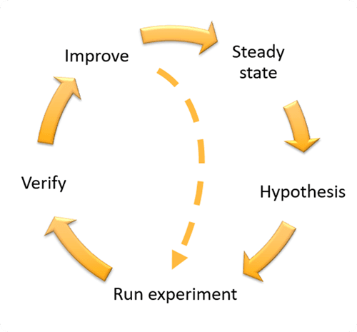

## Learn how to find issues in Production before your customers!

### Why test in Production

In days gone by, "Production" was the sacred environment that no one touched.  In many cases, it took a special approval to break the glass to even get access to prod.  Enter the world of complex distributed, cloud architectures with disparate microservices, site-reliability engineering, and wide ranging dependencies.  The keys to testing in production are recognizing that we're not trying to create chaos, but rather recognizing that chaos already exists in systems running in production. Using planning, communication, infrastructure as code, blast radius, baselines, failure mode guardrails, the right tools for the job, all brains in the game, best practices, test harness, and the stop button allows us be confident that our testing in production is controlled. By identifying the conditions that can impair our resilience in production, we are able to mitigate those circumstances and best support our business Recover Point Objectives (RPO) and Recovery Time Objectives (RTO). There are many types of tests that are relevant in production including load, integration, acceptance, smoke, and chaos.

Testing in production has historically had negative connotations linked to the notions of slamming changes into production, lack of a solid testing approach, recklessness, and a lack of customer obsession.  Done right, all these mistaken notions can be corrected, done wrong those negative impressions are reinforced.

#### Execute the ***planning*** to identify what's going to occur during the testing.

Testing in production doesn't have to be a mythical journey, but it does require capturing how we're testing, the experiments we're testing, why they are important (severity, likelihood, impact), who is involved, what's the communication plan, the identified blast radius, and most importantly how to hit the "Stop Button". Normally the best practice is to execute any test or experiment in a non-production environment prior to doing so in production environments. The process used in testing is similar with most approaches including load and fault.

For a given test event (fault, load, canary), you run an experiment. To run an experiment, you follow these steps.

#### Broadcast ***communication*** to create awareness of the testing in production.

When you're testing a workload in production, we want to ensure that people involved know what's supposed to occur, but also so anyone on the perimeter can be aware.  In the event that the test, aka experiment, exceeds the blast radius, the communication plan let's folks know what to do to stop, mitigate or escalate any unexpected side effects.  

#### Use ***infrastructure as code (IAC)*** to have codified understanding of the workload.

Testing in production requires the ability to not only isolate the test, but also to be able to quickly hit the stop button or recover from any unintended side effects from the testing when it exceeds the blast radius.  Infrastructure as code (IAC) with CloudFormation, CDK, Terraform, K8S manifests, etc. allows you to have a codified, shared, versioned, and executed view of most aspects of your workload. This assures that you know what the system components should be and allows you to analyze for failure modes and dependencies. 

#### Define the ***blast radius*** to ensure we know the area of impact.

If it’s possible to start your test/experiment in a non-production environment first, that is your safest bet, as we mentioned in the planning. Often teams need to be treating these systems in real time. As such, minimizing your blast radius — the zone of systems and therefore users affected — is paramount.

For example, instead of running a production test/experiment, against all of your infrastructure, identify the areas that have minimal risk to the business but are still similar enough to the rest of your infrastructure to draw direct comparison. In short the blast radius should be minimal — while you are testing the workload, your business operations should be kept undisturbed.

 
#### Document the ***baseline*** to identify known good.

Monitoring, measuring, alarming, tracing for observability are about knowing when things are running well, and conversely when there is something wrong.  That baseline can be used to identify the amount of "wrongness" and to know the action to be taken.  If normal latency is 10 ms, when it is 20ms for an extended period we may raise a warning, if it want to 50ms we might start alarming for action, and if it stopped responding we might want to notify the leadership.  Each time we test and reach steady state, we may need to update our baseline for a specific test harness configuration.

#### Ensure ***failure mode guardrails*** are in place.

Testing in production needs to respect boundaries. Defining boundaries can help you recognize what's not to be impacted by the testing.  For instance, testing known single points of failure would be just confirming a known failure mode. Beyond that there are failure modes that cannot be truly injected in testing because they might impact customer health, financials, regulatory compliance.  Those areas have to be respected in production testing, whether failure modes, resilience, performance, or chaos.  Further, the workload may need to be isolated to ensure there isn't broad business or customer experience impact.

#### Utilize the ***right tools*** whether cloud-native, open source, or custom.

Production testing requires the right tools for the job through the various areas noted.  Planning, communication, IaC, tracking, validation, escalation, test harness, and chaos engineering toolsets.  A coordinated approach that ensures that teams know what tools are available, preferred, and prohibited as a matrix ensures that we get the most bang for our investment for your workloads, lines of business, and organization. 

#### Get ***all brains in the game***.

Testing in production for complex distributed systems requires a collaborative teams. All brains in the game aligns with DevOps, including knowledge sharing, culture of celebration, no blame-shaming, and kaizen. 

#### Use  ***best practices***.

Best practices depend on the architecture, workload, business requirements, and cost factors. In AWS we utilize the [Well-Architected Framework](https://wa.aws.amazon.com/wat.question.REL_12.en.html), to inform best practice implementations of operational excellence, security, reliability, performance efficiency, cost optimization and sustainability.

#### ***How*** does all this come together

To do testing in prodution for workloads, and more specifically anything complex, requires coordination of multiple teams and possibly lines of business or organizations.  Most 3rd parties, for whom you have dependencies, like to be notified before you do any major testing (fault/load/performance/resilience). The production workload will require blast radius isolation, which can be done a variety of ways; bubble environment in production, geolocation, zonal isolation, or other mechanisms to make sure that you're not affecting the actual business users that you don't intend, or might not realize what's occurring.  Simple ways to ensure that we're testing on people we know and willingly accept the possibility of failure is to use mechanisms like URL parameters to route their requests to the environment experiencing the test in production. We can use canary deployments (not CloudWatch Synthetic canaries) or Blue/Green deployments to move tests/experiments into production.  If you're application is cellularized you can deploy the test/experiment to only one cell, if your application is multi-zone then deploy the test/experiment to one zone, if your application is multi-region deploy the test/experiment only to a single region. 

There are several options for simulating fault/resilience tests including open source tools like [Chaos Toolkit](https://chaostoolkit.org/), as well as commercial products. For workloads on AWS, [AWS Fault Injection Simulator (AWS FIS)](https://docs.aws.amazon.com/fis/latest/userguide/what-is.html?sc_channel=el&sc_campaign=resiliencewave&sc_geo=mult&sc_country=mult&sc_outcome=acq&sc_content=how-to-test-in-production-without-destroying-your-business) provides many pre-made fault simulations called [actions](https://docs.aws.amazon.com/fis/latest/userguide/actions.html?sc_channel=el&sc_campaign=resiliencewave&sc_geo=mult&sc_country=mult&sc_outcome=acq&sc_content=how-to-test-in-production-without-destroying-your-business). You can also define custom actions that run in AWS FIS using [AWS Systems Manager documents](https://docs.aws.amazon.com/systems-manager/latest/userguide/sysman-ssm-docs.html?sc_channel=el&sc_campaign=resiliencewave&sc_geo=mult&sc_country=mult&sc_outcome=acq&sc_content=how-to-test-in-production-without-destroying-your-business). 

Regardless of the test we need to ensure *stop conditions* if the test or experiment exceeds the blast radius. [Stop conditions for AWS FIS](https://docs.aws.amazon.com/fis/latest/userguide/stop-conditions.html?sc_channel=el&sc_campaign=resiliencewave&sc_geo=mult&sc_country=mult&sc_outcome=acq&sc_content=how-to-test-in-production-without-destroying-your-business) are supported as part of the experiment template.  For other tests, that might be as a simple as someone doing a *kill -9* for the script running the test, or whatever mechanism halts the experiment effectively without leaving resources/application/workload impaired.  

### To learn more
* [Development and Test on AWS (AWS Docs)](https://docs.aws.amazon.com/whitepapers/latest/development-and-test-on-aws/testing-phase.html)
* [Introduction - Blue/Green Deployments on AWS (AWS Whitepaper)](https://docs.aws.amazon.com/whitepapers/latest/blue-green-deployments/introduction.html)
* [Automating safe, hands-off deployments (AWS Builders Library)](https://aws.amazon.com/builders-library/automating-safe-hands-off-deployments/)
* [How Amazon.com Search Uses Chaos Engineering to Handle Over 84K Requests Per Second (Blog Post)](https://docs.aws.amazon.com/whitepapers/latest/development-and-test-on-aws/testing-phase.html)
* [Verify the resilience of your workloads using Chaos Engineering (Blog Post)](https://aws.amazon.com/blogs/architecture/verify-the-resilience-of-your-workloads-using-chaos-engineering?sc_channel=el&sc_campaign=resiliencewave&sc_geo=mult&sc_country=mult&sc_outcome=acq&sc_content=how-to-test-in-production-without-destroying-your-business)
* [AWS re:Invent 2022 - Reliable scalability: How Amazon.com scales in the cloud (ARC206)](https://bit.ly/reliable2022) - Learn how Amazon search implemented Chaos Engineering
* [AWS Fault Injection Simulator (AWS FIS)](https://docs.aws.amazon.com/fis/latest/userguide/what-is.html?sc_channel=el&sc_campaign=resiliencewave&sc_geo=mult&sc_country=mult&sc_outcome=acq&sc_content=how-to-test-in-production-without-destroying-your-business)
