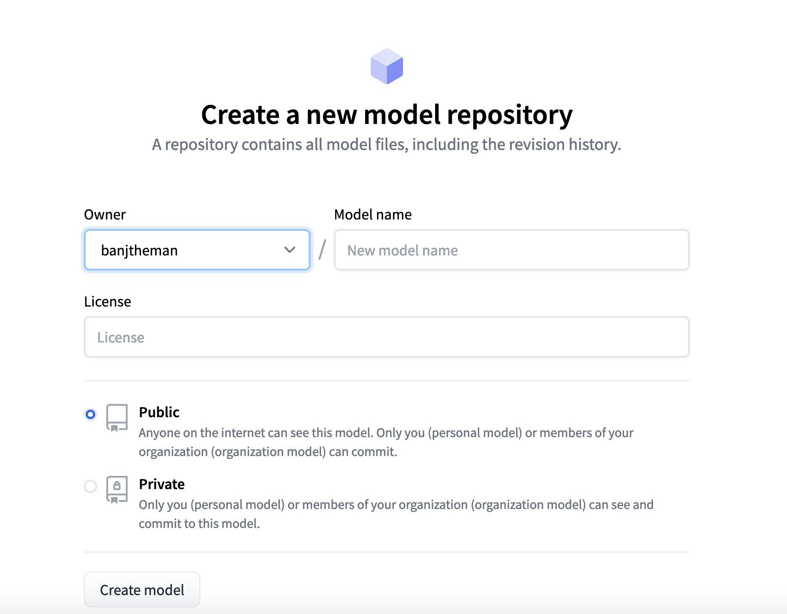

Building Natural Language Processing (NLP) solutions doesn't have to be hard. With Hugging Face, you can leverage a streamlined developer experience to train, evaluate, and deploy NLP models. In this post I will walk through an end-to-end example of building a helpful product review classifier from a labeled dataset with an endpoint for inference on AWS.

## Prerequisites

For this walk though we will be using python3.7+, git, and the following pip modules.

```python
transformers
huggingface_hub
datasets
evaluate
torch
pandas
requests
```
## Collecting data

In order to build a supervised model, we need data. [The AWS Open Data Registry](https://registry.opendata.aws/) has over 300 datasets ranging from satellite images to climate data. We are going to build a model that can predict whether a review on [Amazon.com](http://amazon.com/) is helpful by using the [Helpful Reviews dataset](https://registry.opendata.aws/helpful-sentences-from-reviews/). 

## Prep data

The data that is provided is in a nonstandard JSON format. Before we can do any training, we have to convert the data to a pandas dataframe.

The following code simply gets the raw JSON file and turns the data into an array for processing. 

```python
def get_data(url: str):
    """
    Purpose:
        gets the json data
    Args:
        url - location of data
    Returns:
        data_array: array of the data
    """

    data = requests.get(url)
    raw_data = data.text
    data_array = raw_data.split("\n")

    return data_array
```

This code processes each element of the array by extracting the raw text and then assigned a label of helpful or not helpful based on the score. A pandas dataframe with all the elements are returned 

```python
def get_helpful_label_num(helpful_score):
    """
    Purpose:
        gets a label based on score
    Args:
        helpful_score: score of how helpful
    Returns:
        helpful_label: label of how helpful
    """

    if helpful_score < 1:
        return 0
    else:
        return 1

def data_to_df(data_array):
    """
    Purpose:
        turn data to a df
    Args:
        data_array - array of data
    Returns:
        df: df of the data
    """

    df_map = {}
    df_map["text"] = []
    df_map["label"] = []

    for item in data_array:

        try:
            item_json = json.loads(item)
        except:
            continue

        df_map["text"].append(item_json["sentence"])

        # Get helpful label from score
        helpful_score = item_json["helpful"]
        helpful_label = get_helpful_label_num(helpful_score)
        df_map["label"].append(helpful_label)

    # Create dataframe
    df = pd.DataFrame.from_dict(df_map)
    return df
```

The following code is how we connect each of the functions to create a dataframe from the raw JSON files.

```python
import logging
import json
import requests
import pandas as pd
...
# Code from above

def main():
    """
    Purpose:
        Run the main function
    Args:
        N/A
    Returns:
        N/A
    """
    train_data = "https://helpful-sentences-from-reviews.s3.amazonaws.com/train.json"
    test_data = "https://helpful-sentences-from-reviews.s3.amazonaws.com/test.json"
    
    train_data = get_data(train_data)
    test_data = get_data(test_data)
    
    train_df = data_to_df(train_data)
    test_df = data_to_df(test_data)

    train_df.to_csv("helpful_sentences_train.csv", index=False)
    test_df.to_csv("helpful_sentences_test.csv", index=False)
```

## Train Model

Now that we have our data in a standard format, we can begin to train a model. With Hugging Face, we can fine tune state-of-the-art models without having to train one from scratch. For this example we will use the [DistilBERT base model](https://huggingface.co/distilbert-base-uncased) for our text classification task.

The following code uses a tokenizer to process the text and include a padding and truncation strategy Next the pandas dataframe is loaded and transformed to a Hugging Face dataset. Finally, the Datasets map method is applied as a preprocessing function over the entire dataset.

```python
from transformers import TrainingArguments, Trainer
from transformers import AutoModelForSequenceClassification
from transformers import AutoTokenizer
from transformers import DataCollatorWithPadding
import pandas as pd
from datasets import Dataset
from datasets import load_dataset

# Create tokenizer
tokenizer = AutoTokenizer.from_pretrained("distilbert-base-uncased")
data_collator = DataCollatorWithPadding(tokenizer=tokenizer)

# Load Base Model
model = AutoModelForSequenceClassification.from_pretrained(
    "distilbert-base-uncased", num_labels=2
)
def preprocess_function(examples):
    return tokenizer(examples["text"], truncation=True)

# Load Data
test_data = pd.read_csv("helpful_sentences_test.csv")
train_data = pd.read_csv("helpful_sentences_train.csv")

# Create Dataset
test_dataset = Dataset.from_pandas(test_data)
train_dataset = Dataset.from_pandas(train_data)

tokenized_test = test_dataset.map(preprocess_function, batched=True)
tokenized_train = train_dataset.map(preprocess_function, batched=True)
```

With the datasets prepared, we can finally train the model! The following code loads the accuracy metric, setups the training arguments, and then finally begins training. Training can take a couple hours depending on how strong your machine is, this is where leveraging AWS Sagemaker can come in handy. This [notebook](https://github.com/huggingface/notebooks/blob/main/sagemaker/01_getting_started_pytorch/sagemaker-notebook.ipynb) provides an end-to-end example of how you would train on AWS.

```python
from datasets import load_metric
import numpy as np

# Metrics
metric = load_metric("accuracy")
def compute_metrics(eval_pred):
    logits, labels = eval_pred
    predictions = np.argmax(logits, axis=-1)
    return metric.compute(predictions=predictions, references=labels)

# Training args
training_args = TrainingArguments(
    output_dir="./results",
    learning_rate=2e-5,
    per_device_train_batch_size=16,
    per_device_eval_batch_size=16,
    num_train_epochs=5,
    weight_decay=0.01,
    evaluation_strategy="epoch"
)

# Set up Training job
trainer = Trainer(
    model=model,
    args=training_args,
    train_dataset=tokenized_train,
    eval_dataset=tokenized_test,
    tokenizer=tokenizer,
    data_collator=data_collator,
    compute_metrics=compute_metrics,
)

# Train the model
trainer.train()
```

## Test model locally

Once the model has finished training, you can create a [Hugging Face pipeline](https://huggingface.co/docs/transformers/main_classes/pipelines) to classify text.

```python
from transformers import (
    AutoTokenizer,
    AutoModelForSequenceClassification,
    TextClassificationPipeline,
)

tokenizer = AutoTokenizer.from_pretrained("results/checkpoint-6000/")
model = AutoModelForSequenceClassification.from_pretrained(
    "results/checkpoint-6000/"
)
pipe = TextClassificationPipeline(model=model, tokenizer=tokenizer)

result = pipe("This was a Christmas gift for my grandson.")
print(result)
#[{'label': 'LABEL_0', 'score': 0.998775064945221}]# This is NOT A HELPFUL comment
```

## Evaluation

Using the [Hugging Face evaluate](https://huggingface.co/docs/evaluate/index) module we can easily benchmark the model on a variety of predefined metrics such as accuracy or F1 score.

```python
from transformers import (
    pipeline,
)
import pandas as pd
from datasets import Dataset
from evaluate import evaluator
import evaluate

# Define model
pipe = pipeline(
    "text-classification", model="results/checkpoint-6000/"
)
# Define dataset
test_data = pd.read_csv("helpful_sentences_test.csv")
test_dataset = Dataset.from_pandas(test_data)

# Define evaluator
accuracy = evaluate.load("accuracy")

# Evaluate accuracy
eval = evaluator("text-classification")
result = eval.compute(
    model_or_pipeline=pipe,
    data=test_dataset,
    metric=accuracy,
    label_mapping={"LABEL_0": 0, "LABEL_1": 1},
    strategy="bootstrap",
    n_resamples=200,
)
print(result)
# {'accuracy': {'confidence_interval': (0.7991824857067859, 0.837), 'standard_error': 0.009116387310110274, 'score': 0.823}}

# Evaluate F1 score
f1_metric = evaluate.load("f1")
result = eval.compute(
    model_or_pipeline=pipe,
    data=test_dataset,
    metric=f1_metric,
    label_mapping={"LABEL_0": 0, "LABEL_1": 1},
    strategy="bootstrap",
    n_resamples=200,
)
print(result)
#{'f1': {'confidence_interval': (0.8619904693250219, 0.8852541552022207), 'standard_error': 0.006116815390939261, 'score': 0.8729361091170136}}
```

## Upload Model to Hugging Face hub

Now we can finally upload our model to Hugging Face hub. The [new model url](https://huggingface.co/new) will let you create a new model git based repo.



Once the repo is created, you can then clone the repo and push the model artifacts from the result folder. The following code highlights how I pushed my model.

```bash
git lfs install
git clone https://huggingface.co/banjtheman/distilbert-base-uncased-helpful-amazon
cp -r PATH_TO_MODEL/results/checkpoint-6000/* distilbert-base-uncased-helpful-amazon/
cd distilbert-base-uncased-helpful-amazon/
git add .
git commit -am "initial commit"
git push
```

Here is the [model I uploaded](https://huggingface.co/banjtheman/distilbert-base-uncased-helpful-amazon), once in the cloud it can be used by the community.

## Deploy to Serverless endpoint

Finally, we can deploy the model as a Sagemaker endpoint so it can be used as an API. Using Amazon Sagemaker studio (https://aws.amazon.com/sagemaker/studio/) we can deploy Hugging Face hub models from a notebook. The following code setups the settings of the endpoint.

```python
import sagemaker
from sagemaker.huggingface.model import HuggingFaceModel
from sagemaker.serverless import ServerlessInferenceConfig

# Specify Model Image_uri
image_uri='763104351884.dkr.ecr.us-east-1.amazonaws.com/huggingface-pytorch-inference:1.9.1-transformers4.12.3-cpu-py38-ubuntu20.04'

# Hub Model configuration. <https://huggingface.co/models>
# NOTE: replace with your model
hub = {
    'HF_MODEL_ID':'banjtheman/distilbert-base-uncased-helpful-amazon',
    'HF_TASK':'text-classification'
}

# create Hugging Face Model Class
huggingface_model = HuggingFaceModel(
   env=hub,                      # configuration for loading model from Hub
   role=sagemaker.get_execution_role(),                    
                                 # iam role with permissions
   transformers_version="4.17",  # transformers version used
   pytorch_version="1.10",        # pytorch version used
   py_version='py38',            # python version used
   image_uri=image_uri,          # image uri
)

# Specify MemorySizeInMB and MaxConcurrency
serverless_config = ServerlessInferenceConfig(
    memory_size_in_mb=4096, max_concurrency=10,
)

# deploy the serverless endpoint
predictor = huggingface_model.deploy(
    serverless_inference_config=serverless_config
)
```

This code shows how you can make predictions by passing in data and using boto3 to invoke the endpoint from a Lambda function.

```python
import boto3
import json

data = {
  "inputs": "This was a Christmas gift for my grandson.",
}

user_encode_data = json.dumps(data, indent=2).encode('utf-8')

client = boto3.client('sagemaker-runtime')
endpoint_name = predictor.endpoint_name
content_type = "application/json"
response = client.invoke_endpoint(
    EndpointName=endpoint_name,
    ContentType=content_type,
    Body=user_encode_data)
result = json.loads(response['Body'].read().decode())
print(result)
```

## Conclusion

In this post, we discussed how to successfully achieve the following

* Extract, Transform and Load datasets from AWS Open Data Registry
* Train a Hugging Face model
* Evaluate the model
* Upload the model to huggingface hub
* Create a Sagemaker endpoint for the model
* Create an API for inference

The flexibility of Hugging Face allows this workflow to be run locally or in the cloud. With this workflow you can easily add customizations based on your workload needs, such as changing the modeling task or hyperparameter tuning. The combination of Hugging Face to develop models and AWS for deployment and compute provides a developer first experience for building NLP solutions.

To watch a presentation on building Hugging Face Models check out my talk at re:Invent 2022
https://www.youtube.com/watch?v=XqmEf8rOhUw

Follow Banjo on Twitter [@banjtheman](https://twitter.com/banjtheman) and [@AWSDevelopers](https://twitter.com/awsdevelopers) for more useful tips and tricks about the cloud in general and AWS.

## About the Author

Banjo is a Senior Developer Advocate at AWS, where he helps builders get excited about using AWS. Banjo is passionate about operationalizing data and has started a podcast, a meetup, and open-source projects around utilizing data. When not building the next big thing, Banjo likes to relax by playing video games especially JRPGs and exploring events happening around him.