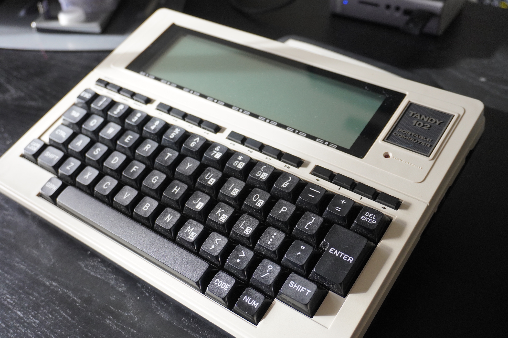
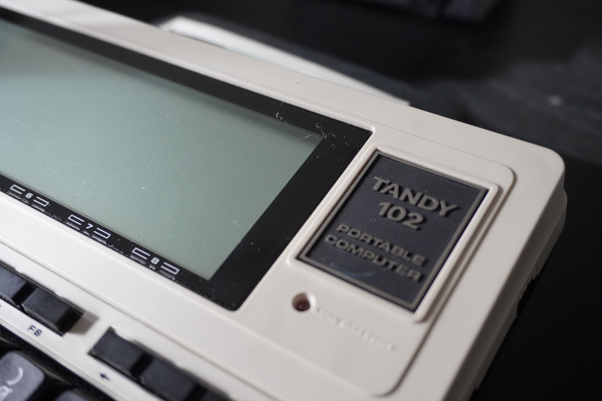
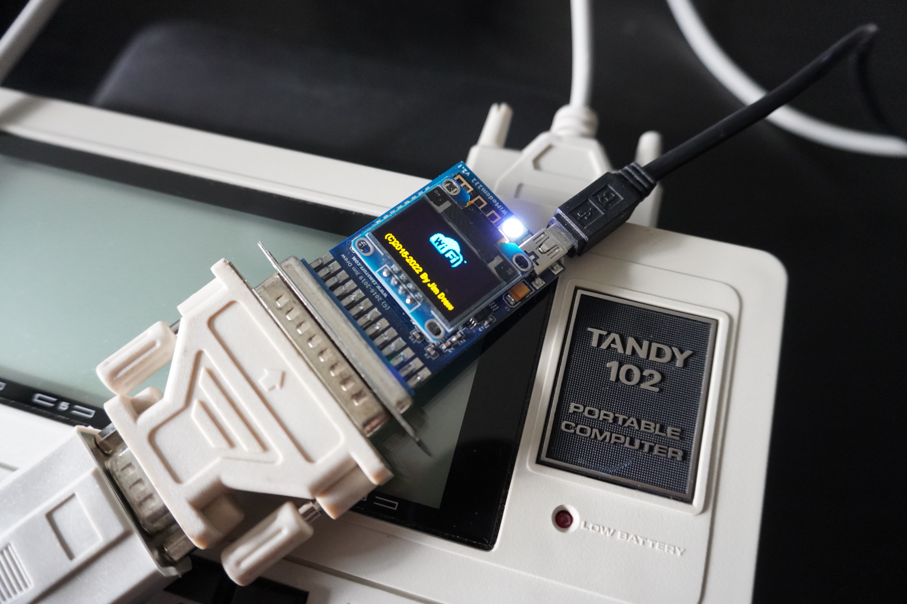
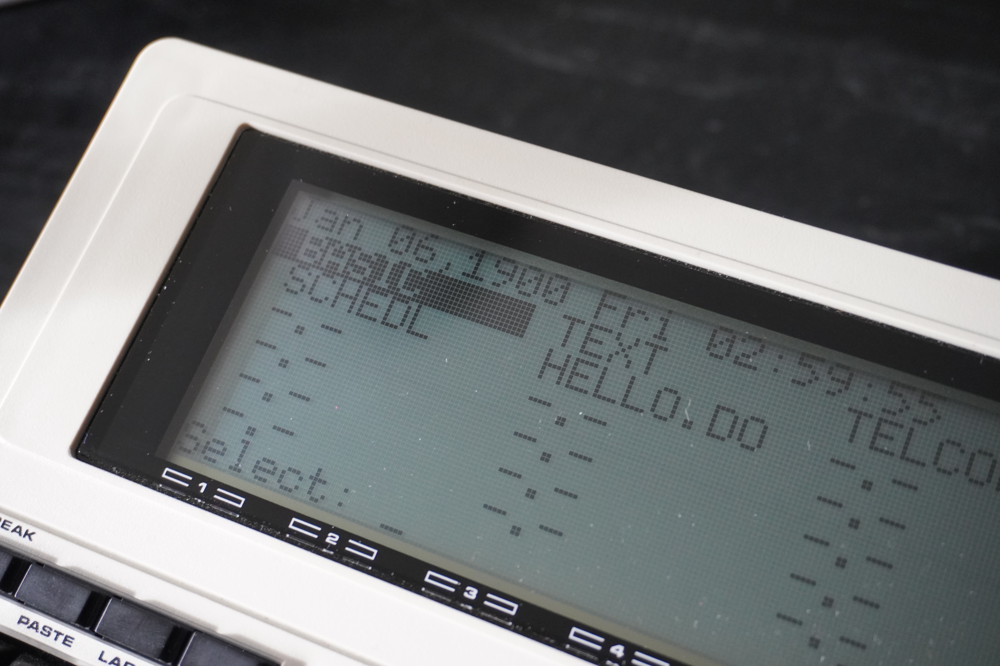
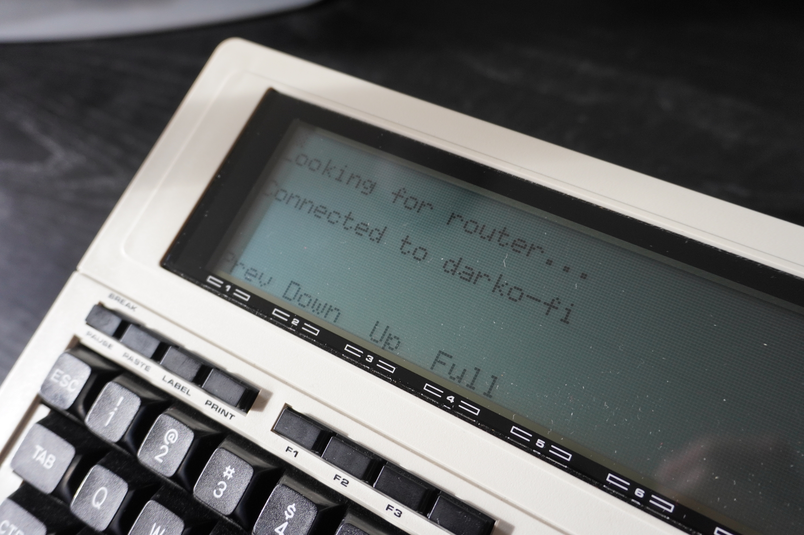
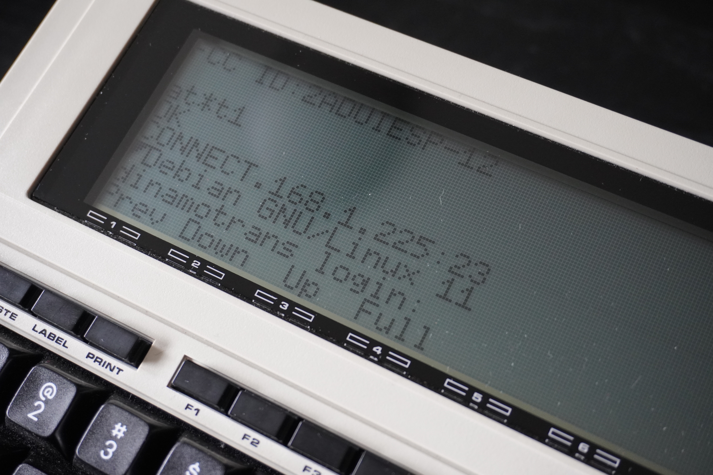

# I deployed Kubernetes with a 1986 Tandy 102 Portable Computer 

I love making the outdated technology I collect do things it was never built to do, forcing the very old to work with the very new. Deploying Kubernetes with a 1986 Tandy 102 Portable Computer is exactly that. And it turns out, a 37-year-old computer can do some very modern things, things that would've seemed like science fiction to the people of the 1980s. But this project also tells us something about the cloud: that given the growth of cloud computing in this day and age, the importance of optimizing your local hardware is diminishing. The oldest personal computers were inspired by mainframe-connected terminals, and with the rise of the cloud, we seem to be returning to some extent to that age, treating our machines as glorified terminals for something way bigger, up in a cloud. And that's a good thing.

Keep reading for some nostalgia, terminals, and serial connections - but more importantly to see how a bygone era of computing gives us a window into a cloud-connected future, in which our computing isn't delimited to our machine's capabilities. (Disclaimer: Computers in 1986 weren't built to deploy Kubernetes, so please do not use this hardware in any production environments, or for anything too important.)

## Portable computing



This right here is a [TRS-80 Model 102](https://en.wikipedia.org/wiki/TRS-80_Model_100), also known as the Tandy 102. This is a successor to the famous Model 100, a portable, battery-powered, notebook-style computer. It was actually one of the first of its kind. According to some sources, the computer was used a lot in the world of journalism. Journalists were able to quickly take notes and write articles while on the go, then send them back to news desks by dialing in using the computer’s internal modem and transferring the text files. Fascinating stuff for 1983.

The model I have is just a cost-cut version of the 1983 original, with a higher base spec of RAM but otherwise identical. It features the Intel 80C85 CPU, manufactured by OKI, 32KB of RAM, a full-size keyboard, and a less-than-stellar 240x64 pixel LCD screen (8x40 characters). My device has no storage; instead, all the software is contained in its ROM chips. The system is amazing to type on, and it can run on 4 AA batteries for around 20h. Again, fascinating for 1983.

## To the internet and beyond

The TRS-80 Model 102 had capabilities of being connected to the internet, although the internet back then was something way different from what it is now. As the device featured a built-in 300 baud Modem, you could dial in to computer systems, check mail, upload and download files, and connect to BBSs (Bulletin Board Systems). To make this work, you hook up an [Acoustic Coupler](https://en.wikipedia.org/wiki/Acoustic_coupler) to the computer, stick a phone headset into the acoustic couple, and dial. What this means is that you would simply dial into systems, not actually the internet (as it did not exist in its current form then). So if you need to check your "electronic mail", you dial into the mail server. If you need to send files over, you dial into the file server, and so on. And I could actually use something like that for my use case — dial into a terminal server and be done with it. But my home dial-up system (yes, I have one) is currently offline, and I have an easier way for this to work.

The amazing thing about this system is that it has a Serial Interface. To be precise, it has an RS-232 port on its back. That means we can use a serial device and do some communicating over it. Perfect. Let me introduce you to an amazing little device: [WiModem232](https://www.cbmstuff.com/index.php?route=product/product&product_id=59?#:~:text=The%20WiModem232%20is%20an%20internet,a%20BBS%20of%20your%20own!). This is a serial WiFi Modem, a small ESP32-powered device that emulates a normal dial-up modem but is actually connected to my local WiFi network. It supports all the native Modem commands (Hayes) and will actually do a few other things.


To make this work, I need to plug in the modem to the back of the Tandy 102, but as they are both female connectors, I will be using a longer cable that will adapt the two. On top of this, the Modem needs some power, so I hook up a Mini-USB cable to get it connected to power. The little display is on, and it’s time to configure the modem. For this, I will need the Tandy 102 and its built-in Terminal application.


Okay, the beautiful thing about this computer is that it comes with a Terminal application built into its ROM (TELCO), and I will be using that for everything moving forward. A Terminal Application in this case is the main application you would use for any sort of communication work. This includes sending emails, uploading files, and working on a remote server (that’s foreshadowing, if you didn't notice). And it allows you to dial systems and communicate over the serial interface. Before this will work with my modem, I need to make some configuration changes. I’ll change the Baud rate to 300, as that is the default on the modem itself. To do so, I just need to enter the following command once I open the Terminal application.

```
stat 38N1E
```

That's it. This will set the baud rate of the serial connection to 300. More information can be found [here](http://dunfield.classiccmp.org/kyocera/m102user.pdf) on page 86 of the manual. We are ready to communicate. Hit the F4 button, or type in `TERM`. If all is set up correctly, I should be now able to type stuff in.

The first command I use to test this is:

```
ATI
```

This will print out some information about the modem — its firmware version as well as connection details. Because I have not connected the modem yet, there will be no connection info available. Let's fix that and connect it to WiFi. To do so, I have to enter the following command in the Terminal, followed by hitting ENTER:

```
AT*SSIDwifiname,wifipassword
```

This has now connected me to the internet. Well, actually the modem is connected. There is one more setting I need to do:

```
AT*T1
```

This will change the translation mode to TELNET, which will come in handy later on. Finally, to save the settings to the device permanently, I just type:

```
AT&W
```


## Cheating my way to the goal

Now that this is all done and configured and we are connected to the internet, it is time to do some Kubernetes. As you may have noticed, I will be cheating in this goal. Yes, the device itself cannot run anything related to Kubernetes. The command `kubectl` is written in Go, and am quite certain that no one has written a compiler for it for the Intel 80C85 CPU. Even if we could compile it, it would definitely not fit in its measly 32KB of RAM (around 29K with everything running). So how do we do this? Well, the secret was alluded to all along: we will use a remote server to do our bidding. Yes, this Tandy 102 will be a glorified Terminal, but hey, that is also cool.

One thing I will be using for this task is a [Raspberry Pi](https://www.raspberrypi.com/) running [Raspberry Pi OS](https://www.raspberrypi.com/software/) and Telnet server - [inetd](https://en.wikipedia.org/wiki/Inetd). I won’t go over how I configured Telnet on the system, as that should be rather straightforward (basically just installing the `inetd` service and enabling it). But I did have to configure something special for my Tandy 102 so it would be able to interact with the Raspberry Pi. 

For any system to be able to communicate properly with a remote system via the Terminal, we need to set the Linux `terminfo` for it. Terminfo is basically a collection of capabilities of terminals and instructions on how to perform certain screen operation (more info [here](https://man7.org/linux/man-pages/man5/terminfo.5.html)). If you open up your terminal now and type `echo $TERM`, you will most likely get some value out. For example, on my current Linux laptop I get the value `st-256color`. By default if I log into my Telnet server, it will set my `TERM` environmental variable to `network`, which is a non-existent `terminfo`. Then if I try to do things such as clear the screen, it will fail to do so. Lucky for me, someone has created `terminfo` configurations for the Tandy portable computers, right here on this [project](https://github.com/hackerb9/Tandy-Terminfo). I just followed the instructions on this page, and compiled the `terminfo` and created one shell script that I would always execute when logging in.

```bash
# Set terminal type to Tandy 200
export TERM=m100
# Send ASCII, not Unicode UTF-8 chars
export LANG=C
# Reset the terminal (turns off labels)
reset
# Turn on software flow control (^S/^Q)
stty ixon ixoff
# Some apps ignore the size in TERMINFO
stty rows 8 cols 40
# Backspace key sends ^H not ^?
stty erase ^H
# Right arrow key sends ^\, so don't use that to abort and dump core.
stty quit undef
# Translate Carriage Return to Newline (for uploads > N_TTY_BUF_SIZE)
stty icrnl
# Don't logout when exiting terminal mode in TELCOM
stty clocal
# Nice short prompt
PS1='\$ '


# Workarounds
export MANPAGER=more
export MANWIDTH=40
export GCC_COLORS=""
alias nano="nano -Opx"
alias w3m="w3m -color=0"

# No ANSI colors in Bash tab completion
bind 'set colored-completion-prefix off'
# See .inputrc for more td200 settings.

if [ $SHLVL -gt 1 ]; then
  echo "Error, do not run this script."
  echo "It must be sourced, like so:"
  echo -ne "\n\t"
  if type $(basename $0)>/dev/null 2>&1
  then
    echo ". $(basename $0)"
  else
    echo "source $0"
  fi
  echo
  exit 1
fi
```

This script just configures a few things for my current session so my terminal session is actually usable. Alright, enough preparation: time to connect to the system.

To connect to my Telnet server, I just run the following command in the Terminal Application:

```
ATDT192.168.1.225:23
```

This command will "dial" into the Telnet server, showing me the login prompt. And from there, I am ready to do whatever I want, as I am now basically on a modern system and have access to all the tools I need.


## Conclusion

The reason I decided to do some Kubernetes is that my good friend Jacquie and I did a Live Stream one day, in which she taught me how to use Kubernetes and how to deploy my first application to Amazon EKS. You can check out the recording [HERE](https://www.twitch.tv/videos/1740165035). I will not get into the weeds of how I do Kubernetes on this system. Here is a [Git Repo](https://github.com/gogococo/whack_a_pod) with the code and instructions I have used (Thank you, [Jacquie](https://twitter.com/devopsjacquie)!).

The big question is, "Should you do this yourself?" Absolutely! Treat this as a nice experiment and a learning opportunity, but also as a chance to show appreciation for how far we have come in the world of computing in the last 40 years. And to see that we should all very grateful for the technology we have to do our jobs. And maybe, just maybe, that a 3 year old Macbook is actually good after all.

Enjoy the video of the deployment in action (sped up for your convenience):

https://www.youtube.com/watch?v=rcfxmzg-LBg
