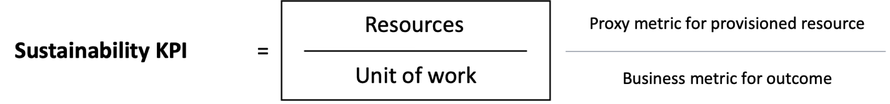
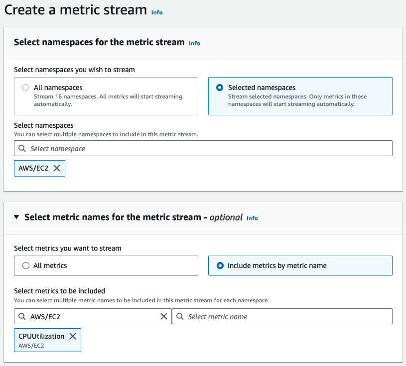
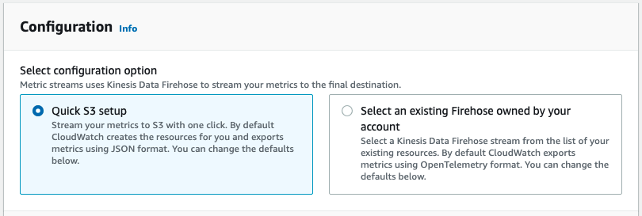
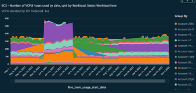
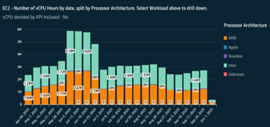
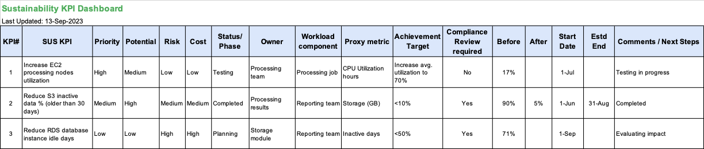

| ToC |
|-----|

## Identifying Proxy Metrics for Sustainability Optimization

Sustainability optimization is a continuous journey. [AWS Well-Architected Sustainability Pillar](https://docs.aws.amazon.com/wellarchitected/latest/sustainability-pillar/sustainability-pillar.html?sc_channel=el&sc_campaign=costwave&sc_content=identifying-proxy-metrics-for-sustainability-optimization&sc_geo=mult&sc_country=mult&sc_outcome=acq) provides [design principles](https://docs.aws.amazon.com/wellarchitected/latest/sustainability-pillar/design-principles-for-sustainability-in-the-cloud.html?sc_channel=el&sc_campaign=costwave&sc_content=identifying-proxy-metrics-for-sustainability-optimization&sc_geo=mult&sc_country=mult&sc_outcome=acq) and [best practices](https://docs.aws.amazon.com/wellarchitected/latest/sustainability-pillar/best-practices-for-sustainability-in-the-cloud.html?sc_channel=el&sc_campaign=costwave&sc_content=identifying-proxy-metrics-for-sustainability-optimization&sc_geo=mult&sc_country=mult&sc_outcome=acq) to meet sustainability targets for your AWS workloads. The goal of sustainability optimization is to use all the resources you provision, and complete the same work with the minimum resources possible. During their sustainability optimization journey, customers often face a challenge to determine appropriate measures for tracking improvement changes.

The [AWS Customer Carbon Footprint Tool](https://aws.amazon.com/aws-cost-management/aws-customer-carbon-footprint-tool/?sc_channel=el&sc_campaign=costwave&sc_content=identifying-proxy-metrics-for-sustainability-optimization&sc_geo=mult&sc_country=mult&sc_outcome=acq) (CCFT) provides monthly output metric of the greenhouse gas emissions associated with a customer’s AWS service usage. A continuous sustainability optimization cycle calls for fine-grained metrics, hence we complement the carbon emissions reported by the AWS CCFT with dependent provisioned resources metrics that we call [*sustainability proxy metrics*](https://docs.aws.amazon.com/wellarchitected/latest/sustainability-pillar/evaluate-specific-improvements.html#proxy-metrics?sc_channel=el&sc_campaign=costwave&sc_content=identifying-proxy-metrics-for-sustainability-optimization&sc_geo=mult&sc_country=mult&sc_outcome=acq). Good sustainability proxy metrics serve as substitute to carbon emissions, provides insight into workload efficiency, and helps to quantify the effect of the change on the associated resources. In this blog, we will review how to identify & extract proxy metrics for a sample workload, optimize the workload, and visualize/track optimization using dashboard. Refer to this [blog](https://aws.amazon.com/blogs/aws-cloud-financial-management/measure-and-track-cloud-efficiency-with-sustainability-proxy-metrics-part-i-what-are-proxy-metrics/?sc_channel=el&sc_campaign=costwave&sc_content=identifying-proxy-metrics-for-sustainability-optimization&sc_geo=mult&sc_country=mult&sc_outcome=acq) to learn more about proxy metrics.

## How to measure sustainability optimization

To track resource efficiency over a period of time, consider including business metric (along with proxy metric) to normalize provisioned resources along with business outcome ([refer to this User Guide](https://docs.aws.amazon.com/wellarchitected/latest/sustainability-pillar/evaluate-specific-improvements.html?sc_channel=el&sc_campaign=costwave&sc_content=identifying-proxy-metrics-for-sustainability-optimization&sc_geo=mult&sc_country=mult&sc_outcome=acq)), and define a Sustainability KPI. Your [business metrics](https://docs.aws.amazon.com/wellarchitected/latest/sustainability-pillar/evaluate-specific-improvements.html?sc_channel=el&sc_campaign=costwave&sc_content=identifying-proxy-metrics-for-sustainability-optimization&sc_geo=mult&sc_country=mult&sc_outcome=acq) should reflect the value provided by your workload. Identifying and measuring business metrics requires engagement from various stakeholders across organization to identify and align with respective resource consumption (proxy metric). [Sustainability KPI](https://docs.aws.amazon.com/wellarchitected/latest/sustainability-pillar/evaluate-specific-improvements.html#key-performance-indicators?sc_channel=el&sc_campaign=costwave&sc_content=identifying-proxy-metrics-for-sustainability-optimization&sc_geo=mult&sc_country=mult&sc_outcome=acq)can be determined by dividing the proxy metrics for provisioned resource by the business outcomes achieved to find out the provisioned resources per unit of work.

## How to extract proxy metrics

AWS Service and tools can help you extract relevant proxy metrics for optimization across various domains like compute, storage, network etc.

* [AWS Trusted Advisor](https://aws.amazon.com/premiumsupport/technology/trusted-advisor/?sc_channel=el&sc_campaign=costwave&sc_content=identifying-proxy-metrics-for-sustainability-optimization&sc_geo=mult&sc_country=mult&sc_outcome=acq) (TA) provides actionable proxy metrics (and optimization recommendations) by analyzing usage and configuration of resources in your AWS account by using [checks](https://docs.aws.amazon.com/awssupport/latest/user/trusted-advisor-check-reference.html?sc_channel=el&sc_campaign=costwave&sc_content=identifying-proxy-metrics-for-sustainability-optimization&sc_geo=mult&sc_country=mult&sc_outcome=acq).
* AWS [Cost and Usage Reports](https://docs.aws.amazon.com/cur/latest/userguide/what-is-cur.html?sc_channel=el&sc_campaign=costwave&sc_content=identifying-proxy-metrics-for-sustainability-optimization&sc_geo=mult&sc_country=mult&sc_outcome=acq) (CUR) contain line items for each unique combination of AWS products, usage type, and operation that you use in your AWS account. You can use [Amazon Athena to aggregate usage data available in AWS CUR](https://docs.aws.amazon.com/cur/latest/userguide/cur-query-athena.html?sc_channel=el&sc_campaign=costwave&sc_content=identifying-proxy-metrics-for-sustainability-optimization&sc_geo=mult&sc_country=mult&sc_outcome=acq) to identify proxy metrics for optimization.
* [Amazon CloudWatch](https://docs.aws.amazon.com/AmazonCloudWatch/latest/monitoring/working_with_metrics.html?sc_channel=el&sc_campaign=costwave&sc_content=identifying-proxy-metrics-for-sustainability-optimization&sc_geo=mult&sc_country=mult&sc_outcome=acq) collects and track metrics, which are variables you can measure for your resources and applications.

## Sample workload

We will use AnyCompany’s workload to identify proxy metrics for sustainability optimization. The workload architecture includes:

* receive operational data from third party providers once a day
* in-house developed legacy code running on a compute cluster for ingested data processing every night
* processed data results stored in a database, and emailed to corporate analysis/specialists next day morning
* results are also stored in object storage from where data scientists in corporate office download, and build complex data models using high performance desktops
* historical data (stored in database) is accessed when needed

## Identify proxy metrics of sample workload

For the preceding architecture, let’s identify 3 areas of optimization using AWS service and tools, and by [normalizing](https://aws.amazon.com/blogs/aws-cloud-financial-management/measure-and-track-cloud-efficiency-with-sustainability-proxy-metrics-part-i-what-are-proxy-metrics/?sc_channel=el&sc_campaign=costwave&sc_content=identifying-proxy-metrics-for-sustainability-optimization&sc_geo=mult&sc_country=mult&sc_outcome=acq) respective proxy metrics. Please note that while there are multiple areas of optimization in this architecture, we will discuss the following three.

### EC2 Processing Nodes

AWS CloudWatch `CPUUtilization` [metric for EC2 instance](https://docs.aws.amazon.com/AWSEC2/latest/UserGuide/viewing_metrics_with_cloudwatch.html#ec2-cloudwatch-metrics?sc_channel=el&sc_campaign=costwave&sc_content=identifying-proxy-metrics-for-sustainability-optimization&sc_geo=mult&sc_country=mult&sc_outcome=acq) can be used to find out percentage of physical CPU time that Amazon EC2 uses to run the EC2 instance, which includes time spent to run both the user code and the Amazon EC2 code.

In the preceding sample architecture, we can calculate average `CPUUtilization` of all four EC2 instances over a period of time by either using [CloudWatch Metrics Insights](https://docs.aws.amazon.com/AmazonCloudWatch/latest/monitoring/query_with_cloudwatch-metrics-insights.html?sc_channel=el&sc_campaign=costwave&sc_content=identifying-proxy-metrics-for-sustainability-optimization&sc_geo=mult&sc_country=mult&sc_outcome=acq) or ingest CloudWatch metrics into Amazon S3 using [metric stream](https://docs.aws.amazon.com/AmazonCloudWatch/latest/monitoring/CloudWatch-Metric-Streams.html?sc_channel=el&sc_campaign=costwave&sc_content=identifying-proxy-metrics-for-sustainability-optimization&sc_geo=mult&sc_country=mult&sc_outcome=acq) for further analysis. For quick CPU utilization summary and visualization, you can use CloudWatch Metrics Insights console and query metrics data using [SQL query engine](https://docs.aws.amazon.com/AmazonCloudWatch/latest/monitoring/cloudwatch-metrics-insights-queryexamples.html?sc_channel=el&sc_campaign=costwave&sc_content=identifying-proxy-metrics-for-sustainability-optimization&sc_geo=mult&sc_country=mult&sc_outcome=acq). Currently, you can query [only the most recent three hours](https://docs.aws.amazon.com/AmazonCloudWatch/latest/monitoring/cloudwatch-metrics-insights-limits.html?sc_channel=el&sc_campaign=costwave&sc_content=identifying-proxy-metrics-for-sustainability-optimization&sc_geo=mult&sc_country=mult&sc_outcome=acq) of metrics data. For preceding sample architecture optimization, we would like to calculate utilization over 30 days period. AWS CloudWatch metric streams can continuously stream metrics to supported destination, including Amazon S3 and third-party service provider destinations. Let’s review steps involved for calculating `CPUUtilization` of four EC2 instances using metric streams:

* In CloudWatch console, create a new stream with AWS/EC2 namespace and select `CPUUtilization` metric

* Select Quick S3 setup and let CloudWatch create required resources (Kinesis Firehose stream, S3 bucket, IAM role etc.) to emit the metrics in JSON format

* By default, metric stream includes `minimum, maximum, sample count, and sum` [statistics](https://docs.aws.amazon.com/AmazonCloudWatch/latest/monitoring/CloudWatch-metric-streams-statistics.html?sc_channel=el&sc_campaign=costwave&sc_content=identifying-proxy-metrics-for-sustainability-optimization&sc_geo=mult&sc_country=mult&sc_outcome=acq)
* Once you are finished creating the metric stream, CloudWatch will then automatically start directing the EC2 instances metrics to Amazon Kinesis Firehouse delivery stream, with delivery to a data lake in S3
* You can then use Amazon Athena to query metric data stored in S3. Refer to this user guide for [creating table using AWS Glue](https://docs.aws.amazon.com/athena/latest/ug/data-sources-glue.html?sc_channel=el&sc_campaign=costwave&sc_content=identifying-proxy-metrics-for-sustainability-optimization&sc_geo=mult&sc_country=mult&sc_outcome=acq) for metrics data stored in S3, and access it in [Athena for querying](https://docs.aws.amazon.com/athena/latest/ug/querying-JSON.html?sc_channel=el&sc_campaign=costwave&sc_content=identifying-proxy-metrics-for-sustainability-optimization&sc_geo=mult&sc_country=mult&sc_outcome=acq)
* Once you have setup Athena to query the S3 database, you can run SQL queries to filter out and aggregate four EC2 instances metric data to calculate average `CPUUtilization` by dividing `sum` with `sample count` statistics
* Dive-deep into JSON data formatting and extraction, SQL queries to aggregate and process data to calculate average utilization, is beyond the scope of this article

Alternatively, you can also take [EC2 instance vCPU-Hours](https://docs.aws.amazon.com/AWSEC2/latest/UserGuide/usage-reports.html?sc_channel=el&sc_campaign=costwave&sc_content=identifying-proxy-metrics-for-sustainability-optimization&sc_geo=mult&sc_country=mult&sc_outcome=acq) used [from CUR](https://www.wellarchitectedlabs.com/cost/300_labs/300_cur_queries/queries/compute/#ec2-hours-a-day) as proxy metrics. In preceding architecture, as the compute nodes process the received data nightly, EC2 instances are idle most of the time during the day. This proxy metric will indicate low CPU hours utilized for the EC2 instances which can be used as candidate for optimization.

To measure vCPU utilization optimization over period of time, we can compare:

* average vCPU utilization of all instances (proxy metric) / number of processed transactions (business metric)
* total vCPU hours used of all instances (proxy metric) / number of processed transactions (business metric)

To optimize their architecture, AnyCompany can use [Instance Scheduler on AWS solution](https://aws.amazon.com/solutions/implementations/instance-scheduler-on-aws/?sc_channel=el&sc_campaign=costwave&sc_content=identifying-proxy-metrics-for-sustainability-optimization&sc_geo=mult&sc_country=mult&sc_outcome=acq) or [Resource Scheduler for EC2](https://docs.aws.amazon.com/systems-manager/latest/userguide/quick-setup-scheduler.html?sc_channel=el&sc_campaign=costwave&sc_content=identifying-proxy-metrics-for-sustainability-optimization&sc_geo=mult&sc_country=mult&sc_outcome=acq) to automate processing nodes scale-up only when nightly processing job starts, and then scale-down. Following that change, evaluate the identified proxy metric, and consider [right-sizing the EC2 instance](https://docs.aws.amazon.com/whitepapers/latest/cost-optimization-right-sizing/tips-for-right-sizing-your-workloads.html?sc_channel=el&sc_campaign=costwave&sc_content=identifying-proxy-metrics-for-sustainability-optimization&sc_geo=mult&sc_country=mult&sc_outcome=acq), if required. This optimization also reduces EC2 cost as environment is right-sized and scales up/down as needed. Implementing this change aligns with the best practice outlined in the AWS Well Architected Sustainability Pillar to use [minimum amount of hardware](https://docs.aws.amazon.com/wellarchitected/latest/sustainability-pillar/sus_sus_hardware_a2.html?sc_channel=el&sc_campaign=costwave&sc_content=identifying-proxy-metrics-for-sustainability-optimization&sc_geo=mult&sc_country=mult&sc_outcome=acq), and [scale underlying infrastructure dynamically](https://docs.aws.amazon.com/wellarchitected/latest/sustainability-pillar/sus_sus_user_a2.html?sc_channel=el&sc_campaign=costwave&sc_content=identifying-proxy-metrics-for-sustainability-optimization&sc_geo=mult&sc_country=mult&sc_outcome=acq).

### S3 storage

[AWS Cost and Usage Reports](https://docs.aws.amazon.com/cur/latest/userguide/what-is-cur.html?sc_channel=el&sc_campaign=costwave&sc_content=identifying-proxy-metrics-for-sustainability-optimization&sc_geo=mult&sc_country=mult&sc_outcome=acq) (CUR) can be used to aggregate the AWS resource usage data. For the preceding architecture, we can use CUR to calculate data stored for different [S3 storage classes](https://aws.amazon.com/s3/storage-classes/?sc_channel=el&sc_campaign=costwave&sc_content=identifying-proxy-metrics-for-sustainability-optimization&sc_geo=mult&sc_country=mult&sc_outcome=acq), and identify optimization opportunities where data could be deleted, or moved to a more appropriate tier.

In the preceding sample architecture, daily ingested data and processed results are stored in two separate S3 buckets. Let’s assume AnyCompany’s Analysts/Specialists generally access last 30 days processed data for further processing and reference. As processed results are generated using ingested data, storing processed results for longer duration (e.g. more than 30 days) is not a best practice in this case, as the processed results can be regenerated using ingested data at any given point of time. By using CUR data, identify volume of S3 storage used for storing processed results dataset which is older than 30 days. Refer to this workshop to [calculate amount of data stored in S3 storage classes](https://catalog.workshops.aws/well-architected-sustainability/en-US/5-process-and-culture/cur-reports-as-efficiency-reports/3-query-s3-usage-by-class?sc_channel=el&sc_campaign=costwave&sc_content=identifying-proxy-metrics-for-sustainability-optimization&sc_geo=mult&sc_country=mult&sc_outcome=acq) and then delete the data older than 30 days. [Amazon Athena](https://docs.aws.amazon.com/cur/latest/userguide/cur-query-athena.html?sc_channel=el&sc_campaign=costwave&sc_content=identifying-proxy-metrics-for-sustainability-optimization&sc_geo=mult&sc_country=mult&sc_outcome=acq) can be used to query the CUR data stored in S3. You can also refer to the [CUR Query Library](https://www.wellarchitectedlabs.com/cost/300_labs/300_cur_queries/) for curated SQL queries to get you started with analyzing your CUR data.

To measure optimization over period of time, we can compare:

* total S3 data (GB/TB) stored (proxy metric) / Number of analyses performed (business metric).

To optimize preceding architecture, identify and delete data older than 30 days. You can configure [S3 Lifecycle Expiring objects](https://docs.aws.amazon.com/AmazonS3/latest/userguide/lifecycle-expire-general-considerations.html?sc_channel=el&sc_campaign=costwave&sc_content=identifying-proxy-metrics-for-sustainability-optimization&sc_geo=mult&sc_country=mult&sc_outcome=acq) action to automate and S3 will delete such objects on your behalf. This also reduces S3 storage cost which could have continued to increase as daily processed data storage grows. Alternatively, you can use [S3 Intelligent-Tiering](https://aws.amazon.com/s3/storage-classes/intelligent-tiering/?sc_channel=el&sc_campaign=costwave&sc_content=identifying-proxy-metrics-for-sustainability-optimization&sc_geo=mult&sc_country=mult&sc_outcome=acq) to automatically move data to the most cost-effective access tier based on access frequency, without performance impact, retrieval fees, or operational overhead. The AWS CloudWatch `BucketSizeBytes`  metric can also be used to determine amount of data stored across storage-tiers of S3 bucket, and then you can define S3 Lifecycle based objects transition to other storage class. You can also use [S3 Storage Lens](https://aws.amazon.com/s3/storage-lens/?sc_channel=el&sc_campaign=costwave&sc_content=identifying-proxy-metrics-for-sustainability-optimization&sc_geo=mult&sc_country=mult&sc_outcome=acq) which delivers organization-wide visibility into object storage usage, activity trends, and makes actionable recommendations. Implementing the above mentioned changes aligns with the best practice outlined in the AWS Well Architected Sustainability Pillar to [remove redundant data](https://docs.aws.amazon.com/wellarchitected/latest/sustainability-pillar/sus_sus_data_a6.html?sc_channel=el&sc_campaign=costwave&sc_content=identifying-proxy-metrics-for-sustainability-optimization&sc_geo=mult&sc_country=mult&sc_outcome=acq), and using policies to manage the [lifecycle of your data](https://docs.aws.amazon.com/wellarchitected/latest/sustainability-pillar/sus_sus_data_a4.html?sc_channel=el&sc_campaign=costwave&sc_content=identifying-proxy-metrics-for-sustainability-optimization&sc_geo=mult&sc_country=mult&sc_outcome=acq).

### RDS database

AWS [Trusted Advisor’s check](https://docs.aws.amazon.com/awssupport/latest/user/cost-optimization-checks.html#amazon-rds-idle-dbs-instances?sc_channel=el&sc_campaign=costwave&sc_content=identifying-proxy-metrics-for-sustainability-optimization&sc_geo=mult&sc_country=mult&sc_outcome=acq) `Amazon RDS Idle DB Instances` can be used to find out if the RDS MySQL database (used for storing summary data in preceding architecture) is actively used by Specialists/Analysts or not.

In preceding architecture, RDS MySQL database is used for accessing any historical data when needed - generally such database/applications are accessed rarely and only when an audit takes place or historical information is needed. Using Trusted Advisor’s `Amazon RDS Idle DB Instances` check, AnyCompany can identify if RDS instance is not accessed (inactive) for more than 7 days, and plan for optimization.

In preceding architecture, RDS MySQL database is used for accessing any historical data when needed - generally such database/applications are accessed rarely and only when an audit takes place or historical information is needed. Using Trusted Advisor’s `Amazon RDS Idle DB Instances` check, AnyCompany can identify if RDS instance is not accessed (inactive) for up to 14 or more days, and plan for optimization. As this proxy metric is already normalized by highlighting no business outcome (data processed) in reported number of days, we don’t have to identify any other business metric for measuring optimization over period of time. After implementing the optimization changes, we can review the same proxy metric to compare improvement.

To optimize preceding architecture, consider [Aurora Serverless for MySQL](https://aws.amazon.com/getting-started/hands-on/configure-connect-serverless-mysql-database-aurora/?sc_channel=el&sc_campaign=costwave&sc_content=identifying-proxy-metrics-for-sustainability-optimization&sc_geo=mult&sc_country=mult&sc_outcome=acq) to automatically start, scale, and shut down an Aurora database based on application needs. It’s a suitable option for infrequent, intermittent, or unpredictable workloads. This will help to reduce the fixed cost of running RDS instance which is accessed only when needed by Analysts. For right-sizing the compute instances used for RDS, you can also consider [CloudWatch RDS `CPUUtilization` metric](https://docs.aws.amazon.com/AmazonRDS/latest/UserGuide/rds-metrics.html?sc_channel=el&sc_campaign=costwave&sc_content=identifying-proxy-metrics-for-sustainability-optimization&sc_geo=mult&sc_country=mult&sc_outcome=acq). Refer to AWS WA Sustainability Pillar best practice [[SUS05-BP01 Use the minimum amount of hardware to meet your needs](https://docs.aws.amazon.com/wellarchitected/latest/sustainability-pillar/sus_sus_hardware_a2.html?sc_channel=el&sc_campaign=costwave&sc_content=identifying-proxy-metrics-for-sustainability-optimization&sc_geo=mult&sc_country=mult&sc_outcome=acq)] and [[SUS02-BP01 Scale workload infrastructure dynamically](https://docs.aws.amazon.com/wellarchitected/latest/sustainability-pillar/sus_sus_user_a2.html?sc_channel=el&sc_campaign=costwave&sc_content=identifying-proxy-metrics-for-sustainability-optimization&sc_geo=mult&sc_country=mult&sc_outcome=acq)].

There are several other areas of optimization in preceding architecture which you can target part of optimization journey - for example, optimizing CloudWatch Logs retention by either altering retention duration or [exporting logs to S3](https://docs.aws.amazon.com/AmazonCloudWatch/latest/logs/S3ExportTasksConsole.html) appropriate storage tier [[SUS04-BP03 Use policies to manage the lifecycle of your datasets](https://docs.aws.amazon.com/wellarchitected/latest/sustainability-pillar/sus_sus_data_a4.html?sc_channel=el&sc_campaign=costwave&sc_content=identifying-proxy-metrics-for-sustainability-optimization&sc_geo=mult&sc_country=mult&sc_outcome=acq)], considering [Amazon WorkSpaces](https://aws.amazon.com/workspaces/features/?nc=sn&loc=2&dn=1&sc_channel=el&sc_campaign=costwave&sc_content=identifying-proxy-metrics-for-sustainability-optimization&sc_geo=mult&sc_country=mult&sc_outcome=acq) as virtual desktop solution to replace on-premises high performance desktops [[SUS02-BP05 Optimize team member resources for activities performed](https://docs.aws.amazon.com/wellarchitected/latest/sustainability-pillar/sus_sus_user_a6.html?sc_channel=el&sc_campaign=costwave&sc_content=identifying-proxy-metrics-for-sustainability-optimization&sc_geo=mult&sc_country=mult&sc_outcome=acq)].

## Visualize and Track

A dashboard of metrics makes it easy for team members to visualize, track, and report their progress of optimizations and changes. You can use these visualizations to set workload-level sustainability targets and technical resource plans to reduce energy use in your workloads. Start with setting up proxy metrics (resource provisioned), and then add business data to normalize AWS resource usage against the value provided by your workload. Normalizing proxy metrics with business data ensures that we have a comparable value to optimize over time, regardless of business growth. As your business grows, your resource usage may also increase.

Refer to this [AWS Workshop](https://catalog.workshops.aws/well-architected-sustainability/en-US/5-process-and-culture/cur-reports-as-efficiency-reports?sc_channel=el&sc_campaign=costwave&sc_content=identifying-proxy-metrics-for-sustainability-optimization&sc_geo=mult&sc_country=mult&sc_outcome=acq) for step-by-step information to setup Sustainability Proxy Metrics Dashboard using AWS Services.

Alternatively, you can start with a simple worksheet based tracker to measure, track, and report optimizations. Following is a sample tracking worksheet for reference:

## Resources

* [Optimizing your AWS Infrastructure for Sustainability, Part I: Compute](https://aws.amazon.com/blogs/architecture/optimizing-your-aws-infrastructure-for-sustainability-part-i-compute/?sc_channel=el&sc_campaign=costwave&sc_content=identifying-proxy-metrics-for-sustainability-optimization&sc_geo=mult&sc_country=mult&sc_outcome=acq)
* [Optimizing your AWS Infrastructure for Sustainability, Part II: Storage](https://aws.amazon.com/blogs/architecture/optimizing-your-aws-infrastructure-for-sustainability-part-ii-storage/?sc_channel=el&sc_campaign=costwave&sc_content=identifying-proxy-metrics-for-sustainability-optimization&sc_geo=mult&sc_country=mult&sc_outcome=acq)
* [Optimizing your AWS Infrastructure for Sustainability, Part III: Networking](https://aws.amazon.com/blogs/architecture/optimizing-your-aws-infrastructure-for-sustainability-part-iii-networking/?sc_channel=el&sc_campaign=costwave&sc_content=identifying-proxy-metrics-for-sustainability-optimization&sc_geo=mult&sc_country=mult&sc_outcome=acq)
* [Optimizing your AWS Infrastructure for Sustainability, Part IV: Databases](https://aws.amazon.com/blogs/architecture/optimizing-your-aws-infrastructure-for-sustainability-part-iv-databases/?sc_channel=el&sc_campaign=costwave&sc_content=identifying-proxy-metrics-for-sustainability-optimization&sc_geo=mult&sc_country=mult&sc_outcome=acq)
* [Measure and track cloud efficiency with sustainability proxy metrics, Part II: Establish a metrics pipeline](https://aws.amazon.com/blogs/aws-cloud-financial-management/measure-and-track-cloud-efficiency-with-sustainability-proxy-metrics-part-ii-establish-a-metrics-pipeline/?sc_channel=el&sc_campaign=costwave&sc_content=identifying-proxy-metrics-for-sustainability-optimization&sc_geo=mult&sc_country=mult&sc_outcome=acq)
* [Best Practices from IBM and AWS for Optimizing SaaS Solutions for Sustainability](https://aws.amazon.com/blogs/apn/best-practices-from-ibm-and-aws-for-optimizing-saas-solutions-for-sustainability/?sc_channel=el&sc_campaign=costwave&sc_content=identifying-proxy-metrics-for-sustainability-optimization&sc_geo=mult&sc_country=mult&sc_outcome=acq)
* [AWS CloudWatch Metrics Insights sample queries](https://docs.aws.amazon.com/AmazonCloudWatch/latest/monitoring/cloudwatch-metrics-insights-queryexamples.html?sc_channel=el&sc_campaign=costwave&sc_content=identifying-proxy-metrics-for-sustainability-optimization&sc_geo=mult&sc_country=mult&sc_outcome=acq)
* [Turning Cost & Usage Reports into Efficiency Reports](https://catalog.workshops.aws/well-architected-sustainability/en-US/5-process-and-culture/cur-reports-as-efficiency-reports?sc_channel=el&sc_campaign=costwave&sc_content=identifying-proxy-metrics-for-sustainability-optimization&sc_geo=mult&sc_country=mult&sc_outcome=acq)
* [Query Amazon S3 data using AWS Athena](https://www.wellarchitectedlabs.com/security/200_labs/200_remote_configuration_installation_and_viewing_cloudwatch_logs/8_query_from_athena/) (for processing AWS CloudWatch metrics stream use case)
* [Rightsizing - The right way!](/posts/rightsizing-the-right-way)
* [Sustainable Data Management Practices](/posts/sustainable-data-management-practices/01-understanding-sustainable-data-management)

## Conclusion

In this blog post, we discussed ways to identify proxy metrics which will help optimize AWS resources for sustainability benefits. It is important to understand that while proxy metrics help quantify effect of change on a particular resource, it is also important to use these in conjunction with business metrics to come up with KPI’s to establish a baseline to measure per unit improvement.

Customers can leverage AWS Services and tools to measure, report, and forecast their carbon emission of workloads. Using AWS Well-Architected Sustainability Pillar best practices, customer can optimize their IT infrastructure and operations, and design optimized future workloads to reduce energy consumption.

## About Authors

**Pooja Karnik** is a Technical Account Manager, Strategic Accounts at Amazon Web Services. She helps educate, empower, and evolve AWS customers throughout their cloud journey.

**Raman Pujani** is a Solutions Architect, Strategic Accounts at Amazon Web Services. He helps customers transform and accelerate their sustainability journey with AWS.
