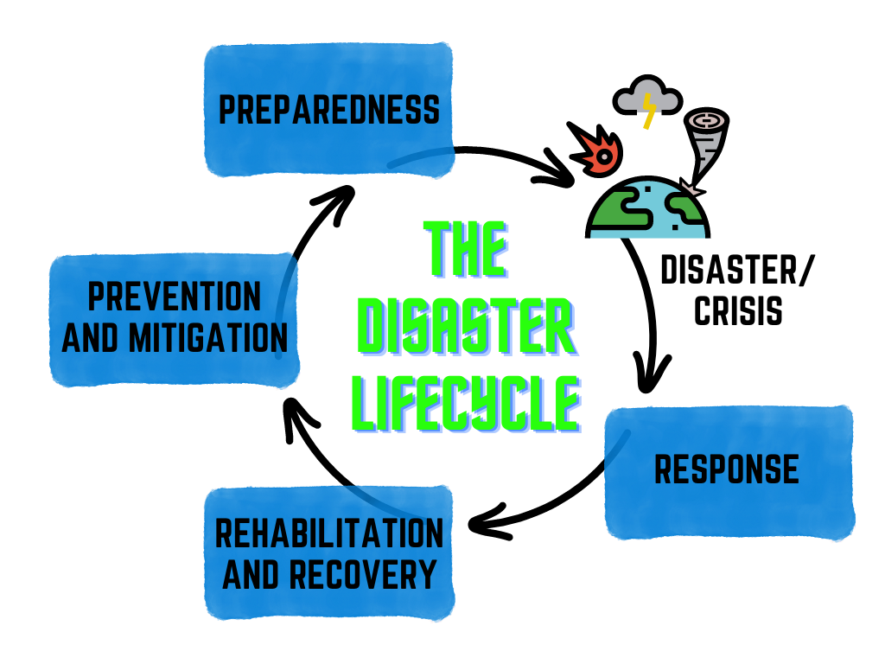

---

title: Improve Disaster Response with Machine Learning
description: Learn how a community of developers came together through the AWS Disaster Response hackathon to build models to support natural disaster preparedness and response.
tags:
  - ai-ml
  - disaster-response

authorGithubAlias: antjebar
authorName: Antje Barth
date: 2022-10-05
---

Around the world, natural disasters such as hurricanes, typhoons, floods, and wildfires are increasing in both their frequency and their severity. In response, governments, businesses, nonprofits, and international organizations are placing more emphasis on disaster preparedness and response than ever before. 

Many of these entities are also accelerating their efforts to make their data publicly available for others to use. Repositories such as the [Registry of Open Data on AWS](https://registry.opendata.aws/) and [Humanitarian Data Exchange](https://data.humdata.org/) contain treasure troves of data for use by developers, data scientists, and machine learning (ML) practitioners.

In an effort to stimulate ways to apply ML to solve pressing challenges in natural disaster preparedness and response, we launched the global [AWS Disaster Response hackathon](https://awsdisasterresponse.devpost.com/) in December 2021. In this blog post, I will summarize hackathon highlights and the winning projects. 

## The AWS Disaster Response Hackathon
In collaboration with the [AWS Disaster Response program](https://aws.amazon.com/government-education/nonprofits/disaster-response/), we started the hackathon at AWS re:Invent 2021. We asked the developer community to think about creative ways to apply ML to solve some of the most pressing challenges in natural disaster preparedness and response. The solution had to solve a challenge that is aligned with at least one of the phases of the disaster life cycle, such as preparedness, response, rehabilitation and recovery, or prevention and mitigation. 

The solution also had to focus on a challenge that is present in one or more types of natural disaster, for example, hurricanes and cyclones, wildfires, floods, earthquakes, or drought. Finally, the solution had to use ML to solve the challenge. This included the submission of an ML model that helps people predict, identify, categorize, or prioritize. And the response was impressive!

### Over 1,400 developers globally joined the hackathon
We wrapped the hackathon in February 2022 with over 1,400 global participants, joining the hackathon from over 80 countries, and we received 42 project submissions.

To prototype their ML models and solutions, the teams used [Amazon SageMaker Studio Lab](https://studiolab.sagemaker.aws/), a free ML development environment. SageMaker Studio Lab provides compute (both CPU and GPU) and up to 15 GB of storage at no-charge and without the need for an AWS account. So, it's the perfect starting place for ML coders. 

## Popular File Formats, Datasets, ML Tools, and Libraries for Disaster Response

Many challenges in disaster response, such as *"How might we accurately and efficiently determine the extent of damage to individual homes in a given disaster-impacted area?"* require work with geospatial data, satellite and drone imagery. This section highlights some of the file formats, datasets, ML tools, and libraries the hackathon teams used. 

### File Formats 
Popular file formats for encoding geographic data are [Geographic JSON](https://geojson.org/) (GeoJSON), [Geographic Tagged Image File Format](https://en.wikipedia.org/wiki/GeoTIFF) (GeoTIFF), and 
[Cloud-Optimized GeoTIFF](https://www.cogeo.org/) (COG).  

* GeoJSON is a format for encoding a variety of geographic data structures, multi-polygons, and custom properties. 

* GeoTIFF organizes and stores geospatial raster image datasets such as satellite imagery and terrain models. GeoTIFF also stores spatial information and coordinates within the image file including the raster’s cell size and coordinate reference system (CRS). 

* A Cloud Optimized GeoTIFF (COG) is a regular GeoTIFF file with pixels organized in a way that enables HTTP GET range requests. This allows streaming the GeoTIFF as needed versus having to download the whole file.

### Datasets

The [Registry of Open Data on AWS](https://registry.opendata.aws/tag/disaster-response/) helps people discover and share datasets that are available via AWS resources. Popular datasets include: 

* Satellite imagery, meteorological, and oceanographic data from the [US National Oceanic and Atmospheric Administration](https://registry.opendata.aws/collab/noaa/) (NOAA). 

* Satellite imagery from [Sentinel-2](https://registry.opendata.aws/sentinel-2/), providing high resolution optical imagery and continuity for the current SPOT and Landsat missions through a land monitoring constellation of two satellites.

* Global land cover map provided by the [European Space Agency (ESA) WorldCover](https://registry.opendata.aws/esa-worldcover/) dataset with 11 different land cover classes.

[OpenStreetMap](https://www.openstreetmap.org/) is a collaborative, crowd-sourced geographic database of the world from over 2 million registered users using GPS devices, aerial photography, and local knowledge of the area.

The [Maxar Open Data Program](https://www.maxar.com/open-data) releases open data for select sudden onset major crisis events, such as hurricanes, floodings, earthquakes and wildfires. 

In addition, many hackathon teams included region and use case specific data, such as the [Forestry Insect-and-Disease Detection Survey](https://www.fs.usda.gov/foresthealth/applied-sciences/mapping-reporting/detection-surveys.shtml) providing data the health of trees in areas affected by insects and diseases throughout U.S. forests.

### ML Tools and Libraries
Here are some of ML tools and libraries that the hackathon teams used to prepare, build, and train their ML models: 

* [ResUNet](https://arxiv.org/abs/1711.10684) is a semantic segmentation neural network that extracts road from aerial images used for disaster-response research.

* [GeoPandas](https://github.com/geopandas) adds support for geographic data to [pandas](https://pandas.pydata.org/). It implements `GeoSeries` and `GeoDataFrame` as subclasses of `pandas.Series` and `pandas.DataFrame`.

* [EarthPy](https://earthpy.readthedocs.io/) is a Python package devoted to working with spatial-raster and remote-sensing vector data.

* [Rasterio](https://rasterio.readthedocs.io/en/latest/) reads and writes GeoTIFF files and provides a Python API based on [NumPy](https://numpy.org/) N-dimensional arrays.

* [Numba](https://numba.pydata.org/) is an open source just-in-time (JIT) compiler that translates Python and NumPy code into fast machine code. With its support for [NVIDIA CUDA](https://developer.nvidia.com/cuda-toolkit), you can write parallel GPU algorithms using Python.

In addition, the hackathon teams used the popular open source machine learning library [Scikit-Learn](https://scikit-learn.org/stable/tutorial/machine_learning_map/index.html) to build and train ML models using a variety supervised and unsupervised ML algorithms. 

Tip: If you look for guidance which ML algorithm to pick, here's a great [cheat sheet](https://scikit-learn.org/stable/tutorial/machine_learning_map/index.html).

Now, let's have a look at the winning projects of the AWS Disaster Response hackathon.

## Winning Projects

### 1st Place: **DisaVu**
The team around DisaVu built a solution to direct relief resources to where they are needed most using a sophisticated machine learning approach that is able to detect the extent of damage caused by natural disasters based on satellite images.

Check out the team's [hackathon project page](https://devpost.com/software/disavu) and [GitHub code repo](https://github.com/SrzStephen/DisaVu).

### 2nd Place: **Thunderstorm Prediction**
This team focused on thunderstorm predictions by finding correlations between the atmospheric conditions at the time of the lightning strike to predict the occurrence of lightning and thunderstorms. 

Check out the team's [hackathon project page](https://devpost.com/software/lighting-prediction-in-india-using-ml) and [GitHub code repo](https://github.com/suryaremanan/Thunderstorm-Prediction-Using-ML). 

### 3rd Place: **Wildfire Mitigation**
This team from Accenture Federal Services focused on wildfire mitigation. They developed a computer vision model to identify dead and diseased trees in near real-time using open-source Landsat data from their work with Federal, state, and local land managers. 

Check out the team's [hackathon project page](https://devpost.com/software/wildfire-mitigation-computer-vision-id-of-hazard-fuels) and [GitHub code repo](https://github.com/MarjorieRWillner/DisasterHack).

### Best Solution to The Challenge: **Soteria**
The team around Soteria used machine learning with satellite imagery to map natural disaster impacts for faster emergency response. 

Check out the team's [hackathon project page](https://devpost.com/software/soteria-yolciw) and [GitHub code repo](https://github.com/Soteria-ai/Soteria). 

### Best Technical Implementation: **Global Fire Spread Prediction** 
The tech team at SatelliteVu applied their knowledge of wildfires, satellite imagery, and machine learning to demonstrate a fire spread prediction system. 

Check out the team's [hackathon project page](https://devpost.com/software/global-fire-spread-prediction-system) and [GitHub code repo](https://github.com/SatelliteVu/SatelliteVu-AWS-Disaster-Response-Hackathon). 

And we have received many more amazing projects. Two honorary mentions, for example, include an [AI for Disaster Assistant](https://devpost.com/software/ai-wonder-girls-disaster-response) to support humanitarian workers and civilians to achieve faster response in earthquake emergencies, and another team exploring [migratory birds](https://devpost.com/software/earthquake-anticipation-using-migratory-birds-behaviour) and their ability to sense subtle, local geomagnetic disturbances, and their change in behavior, to forecast earthquakes. 

## Conclusion
This completes the quick whirlwind tour of the highlights and top projects of the AWS Disaster Response hackathon. Congratulations again to all winners and many thanks to everyone who participated! I also want to extend a big thank you to our hackathon jury and the organizations who contributed challenge ideas to provide further inspiration. You can explore all submitted projects in the AWS Disaster Response hackathon [project gallery](https://awsdisasterresponse.devpost.com/project-gallery). 

### Run The Code
If you want to run the projects' sample code, [sign-up for a free SageMaker Studio Lab account](https://studiolab.sagemaker.aws/), and either click the  buttons in the shared GitHub repos, or use `git clone` to copy the projects into your Studio Lab environment.

### Learn more about data science and machine learning
If you are interested in learning more about how to get started with data science and machine learning on AWS, here are a few recommendations: 

If you are looking for a self-paced digital course with hands-on exercises, check out the [Practical Data Science on the AWS Cloud](https://www.coursera.org/specializations/practical-data-science) Specialization on Coursera, developed in collaboration with [DeepLearning.AI](https://www.deeplearning.ai/). 

If you prefer reading, have a look at the [Data Science on AWS](https://www.amazon.com/Data-Science-AWS-End-End/dp/1492079391) O'Reilly book which I co-authored together with my colleague Chris Fregly. The book discusses how to implement end-to-end, continuous AI and Machine Learning Pipelines. All of the code is publicly available on [GitHub](https://github.com/data-science-on-aws/data-science-on-aws).

We also host monthly meetups discussing use cases, best practices and the latest AI/ML technologies. If you're interested in joining us, follow the link on [datascienceonaws.com](http://www.datascienceonaws.com/).