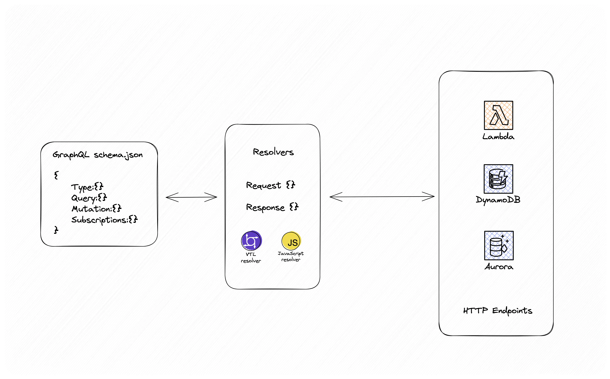
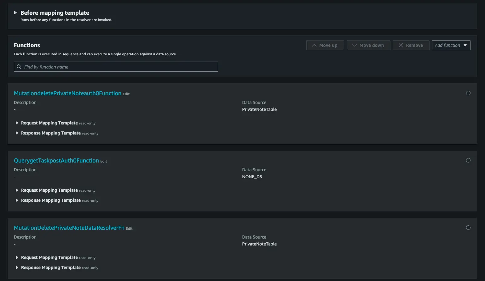

| ToC |
|-----|

[AWS AppSync](https://aws.amazon.com/appsync/) is a fully-managed serverless GraphQL API which enables serverless developers to build, deploy and also a powerful API layer for integrating seamlessly with other AWS services. Clearly, [GraphQL is destined to be the future of APIs](https://community.aws/posts/four-reasons-why-graphql-is-the-future) and learn about how you can get started with [AppSync](https://blog.theserverlessterminal.com/aws-appsync-101). In this blog, we will look into how [AWS AppSync supporting JavaScript resolvers](https://aws.amazon.com/about-aws/whats-new/2023/08/aws-appsync-javascript-all-resolvers-graphql-apis/) has improved the developer experience.

## AppSync resolvers
[AppSync resolvers](https://docs.aws.amazon.com/appsync/latest/devguide/resolver-components.html) are the components responsible for integrating with different supported AppSync data sources such as - AWS Lambda functions, Amazon Aurora, Amazon DynamoDB, HTTP endpoints and many others. These resolvers have mapping templates for the GraphQL `type`, `query`, `mutation` and `subscription`. Resolvers can be written in Velocity Template Language (VTL) or JavaScript runtime. 



### Why are resolvers important?
Whenever integrating with AWS Services, resolvers (VTL or JavaScript based) would help with data manipulation for constructing the request mapping which the data source requires along with the response mapping where the response is constructed to the needed GraphQL schema. Additionally, resolvers support sharing of data between different resolver functions in a `pipeline resolver` with `context` and `arguments`. In both `unit resolver` and `pipeline resolver`, AppSync supports usage of different utility functions for data transformation of JSONs, Arrays Lists and generation of UUIDs.


The above screenshot from AppSync console shows how a Pipeline resolver can have multiple functions which can integrate with the respective data source and sharing the data amongst the different resolver functions using `context.stash`.

## VTL resolvers
Velocity Template Language (VTL) is used to generate dynamic JSON content and based on Java environment. 

For instance, the AppSync model `PrivateNote`.
```
type PrivateNote {
	id: ID!
	content: String!
	createdAt: AWSDateTime!
	updatedAt: AWSDateTime!
	owner: String
}
```
A mutation `createPrivateNote` for creating new notes, in a typical VTL resolver which sets the different default values and validates for authentication of the user with Amazon Cognito for identifying the owner of the note by using the `util` functions on AppSync -  `$util.defaultIfNull()`, `$$util.dynamodb.toDynamoDBJson()` and `$$util.dynamodb.toMapValues()` to make the DynamoDB operation of `PutItem`.

```JSON
## [Start] Initialization default values. **
$util.qr($ctx.stash.put("defaultValues", $util.defaultIfNull($ctx.stash.defaultValues, {})))
#set( $createdAt = $util.time.nowISO8601() )
$util.qr($ctx.stash.defaultValues.put("id", $util.autoId()))
$util.qr($ctx.stash.defaultValues.put("createdAt", $createdAt))
$util.qr($ctx.stash.defaultValues.put("updatedAt", $createdAt))
$util.toJson({
  "version": "2018-05-29",
  "payload": {}
})
## Check for Cognito authorization and set the owner
#if( $util.authType() == "User Pool Authorization" )
  #if( !$isAuthorized )
    #set( $ownerEntity0 = $util.defaultIfNull($ctx.args.input.owner, null) )
    #set( $ownerClaim0 = $util.defaultIfNull($ctx.identity.claims.get("sub"), "___xamznone____") )
    #set( $currentClaim1 = $util.defaultIfNull($ctx.identity.claims.get("username"), $util.defaultIfNull($ctx.identity.claims.get("cognito:username"), "___xamznone____")) )
    #set( $ownerClaim0 = "$ownerClaim0::$currentClaim1" )
    #set( $ownerClaimsList0 = [] )
    $util.qr($ownerClaimsList0.add($util.defaultIfNull($ctx.identity.claims.get("sub"), "___xamznone____")))
    $util.qr($ownerClaimsList0.add($util.defaultIfNull($ctx.identity.claims.get("username"), $util.defaultIfNull($ctx.identity.claims.get("cognito:username"), "___xamznone____"))))
    #set( $ownerAllowedFields0 = ["id","content"] )
    #set( $isAuthorizedOnAllFields0 = true )
    #if( $ownerClaim0 == $ownerEntity0 || $ownerClaimsList0.contains($ownerEntity0) )
      #if( $isAuthorizedOnAllFields0 )
        #set( $isAuthorized = true )
      #else
        $util.qr($allowedFields.addAll($ownerAllowedFields0))
      #end
    #end
    #if( $util.isNull($ownerEntity0) && !$ctx.args.input.containsKey("owner") )
      $util.qr($ctx.args.input.put("owner", $ownerClaim0))
      #if( $isAuthorizedOnAllFields0 )
        #set( $isAuthorized = true )
      #else
        $util.qr($allowedFields.addAll($ownerAllowedFields0))
      #end
    #end
  #end
#end
## [Start] Create Request template. **
#set( $args = $util.defaultIfNull($ctx.stash.transformedArgs, $ctx.args) )
## Set the default values to put request **
#set( $mergedValues = $util.defaultIfNull($ctx.stash.defaultValues, {}) )
## copy the values from input **
$util.qr($mergedValues.putAll($util.defaultIfNull($args.input, {})))
## set the typename **
$util.qr($mergedValues.put("__typename", "PrivateNote"))
#set( $PutObject = {
  "version": "2018-05-29",
  "operation": "PutItem",
  "attributeValues":   $util.dynamodb.toMapValues($mergedValues),
  "condition": $condition
} )
#if( $args.condition )
  $util.qr($ctx.stash.conditions.add($args.condition))
#end
## Begin - key condition **
#if( $ctx.stash.metadata.modelObjectKey )
  #set( $keyConditionExpr = {} )
  #set( $keyConditionExprNames = {} )
  #foreach( $entry in $ctx.stash.metadata.modelObjectKey.entrySet() )
    $util.qr($keyConditionExpr.put("keyCondition$velocityCount", {
  "attributeExists": false
}))
    $util.qr($keyConditionExprNames.put("#keyCondition$velocityCount", "$entry.key"))
  #end
  $util.qr($ctx.stash.conditions.add($keyConditionExpr))
#else
  $util.qr($ctx.stash.conditions.add({
  "id": {
      "attributeExists": false
  }
}))
#end
## End - key condition **
## Start condition block **
#if( $ctx.stash.conditions && $ctx.stash.conditions.size() != 0 )
  #set( $mergedConditions = {
  "and": $ctx.stash.conditions
} )
  #set( $Conditions = $util.parseJson($util.transform.toDynamoDBConditionExpression($mergedConditions)) )
  #if( $Conditions.expressionValues && $Conditions.expressionValues.size() == 0 )
    #set( $Conditions = {
  "expression": $Conditions.expression,
  "expressionNames": $Conditions.expressionNames
} )
  #end
  ## End condition block **
#end
#if( $Conditions )
  #if( $keyConditionExprNames )
    $util.qr($Conditions.expressionNames.putAll($keyConditionExprNames))
  #end
  $util.qr($PutObject.put("condition", $Conditions))
#end
#if( $ctx.stash.metadata.modelObjectKey )
  $util.qr($PutObject.put("key", $ctx.stash.metadata.modelObjectKey))
#else
  #set( $Key = {
  "id":   $util.dynamodb.toDynamoDB($mergedValues.id)
} )
  $util.qr($PutObject.put("key", $Key))
#end
$util.toJson($PutObject)
## [End] Create Request template. **
```

VTL could be powerful but at certain scenarios, just isn't *developer friendly* for a developer who is building the Serverless GraphQL API. 

### Debugging VTL resolvers
In a complex `unit resolver` or `pipeline resolver`, debugging is tedious as the VTL code is executed at runtime and having debugging breakpoints or ways to track the flow of execution is hard. 

It's possible to add debug logs using the util functions `$util.log.info()` and `$util.log.error()` which are available in CloudWatch logs as the execution happens. However, this is not an efficient way of debugging during development.

A good way to catch the errors is possible in the response mapping template.

```JSON
#if( $ctx.error )
$util.error($ctx.error.message, $ctx.error.type)
#else
$util.toJson($ctx.result)
#end
```

### VTL verbose syntax
When working with `if-else` statements or `foreach` looping statement on VTL, the syntax of the VTL can be verbose. 

```JSON
#set($start = 0)
#set($end = 5)
#set($range = [$start..$end])

#foreach($i in $range)
   $util.qr($myMap.put($i, "${i}foo"))
#end

#if($condition)
  #set($result = "True")
#else
  #set($result = "False")
#end
$util.toJson($result)
```

### Complexity of the resolver
With the syntax and complex resolvers, often the direct data source to a database or HTTP can become hard to handle with the limited utility handler functions and in case of `pipeline resolver`, it can be a huge learning curve of how to use different functions, mapping request/response for all the functions and the parent resolver.

For some use-cases and scenarios, using VTL resolvers may turn out to be overwhelming which results in developers moving towards Lambda function resolvers.

## JavaScript resolvers
AppSync's JavaScript resolvers enable developers to use JavaScript runtime for all the resolvers instead of VTL. 

Using the same example of `createPrivateNote` mutation, the resolver for it would be something like - 

```JavaScript
import { util } from '@aws-appsync/utils';

/**
 * Puts an item into the DynamoDB table.
 * @param {import('@aws-appsync/utils').Context<{input: any}>} ctx the context
 * @returns {import('@aws-appsync/utils').DynamoDBPutItemRequest} the request
 */
export function request(ctx) {
    const { id, ...values } = ctx.args.input;
    const key = { id };
    const condition = { and: [] };
    for (const k in key) {
        condition.and.push({ [k]: { attributeExists: false } });
    }
    return dynamodbPutRequest({ key, values, condition });
}

/**
 * Returns the item or throws an error if the operation failed.
 * @param {import('@aws-appsync/utils').Context} ctx the context
 * @returns {*} the result
 */
export function response(ctx) {
    const { error, result } = ctx;
    if (error) {
        return util.appendError(error.message, error.type, result);
    }
    return result;
}

/**
 * Helper function to create a new item
 * @returns {*} the request
 */
function dynamodbPutRequest(params) {
    const { key, values, condition: inCondObj } = params;
    
    let condition;
    if (inCondObj) {
        condition = JSON.parse(util.transform.toDynamoDBConditionExpression(inCondObj));
        if (condition && condition.expressionValues && !Object.keys(condition.expressionValues).length) {
            delete condition.expressionValues;
        }
    }
    return {
        operation: 'PutItem',
        key: util.dynamodb.toMapValues(key),
        attributeValues: util.dynamodb.toMapValues(values),
        condition,
    }
}

```
This defines the `request()` and `response()` methods for mapping with AppSync's mutation. With the familiarity of JavaScript, it's easy to modularize your resolvers with different JavaScript functions as you see in the example above, `dynamodbPutRequest()` is invoked from the `request()` method and whenever this returns, the `response()` method would handle the response mapping with the defined schema.

In JavaScript resolvers, you can import `@aws-appsync/utils` for all the util helper methods such as `util.transform.toDynamoDBConditionExpression()` and `util.dynamodb.toMapValues()`.

## A closer look at the developer experience
Based on the stats and popularity of Node.JS usage for Serverless, developers would be familiar with JavaScript runtimes which are used in their existing workloads with Amazon Lambda functions or their Infrastructure as Code (IaC) where NodeJS and TypeScript have been widely adapted. And ensuring that their resolvers could now also be built with JavaScripts, this new enhancement is a celebration for Serverless developers. 

### Comfort and familiarity with the tech stack
Everyone loves to build with something that they are familiar with. As a developer who has used VTL and now played around with JavaScript resolvers, choosing JavaScript resolvers and building AppSync APIs is a faster and easier choice. Since developers have been used to JavaScript in their backend and also frontend, the learning curve to adapt VTL is reduced massively.

### Utilities and functions
JavaScript resolvers also supports utility helper functions with `@aws-appsync/utils` the package. 
- `@aws-appsync/eslint-plugin` is the ESLint tool which detects issues in code during the development.
- Using `util.transform` helper functions for easier transformations with DynamoDB and other data sources with different filters on Maps and Lists.
- Built-in modules for different data sources makes it programming language compatible for developers to use functions and operations.
- Apart from the native JavaScript's flexibility to work with `datetime`, there are `util.time` helper functions available.
- Working with different type classes - `Array`, `String`, `Object` from JavaScript.

### Going Type safe with TypeScript
Since JavaScript is supported, there are workarounds available for TypeScript to resolver more type strict. 

```TypeScript
import * as ddb from '@aws-appsync/utils/dynamodb'
import { Context, util } from '@aws-appsync/utils'
import { PrivateNote, CreatePrivateNoteVariables } from '../src/API'

export function request(ctx: Context<CreatePrivateNoteVariables>) {
    return ddb.put({
        key: { __typename: 'PrivateNote', id: util.auoId() },
        item: ctx.args.input
    })
}

export function response(ctx: Context) {
    return ctx.result as PrivateNote
}
```
The catch here is that, AppSync doesn't directly support TypeScript so it's possible to build AppSync APIs only from IDE given that you have the configurations set for building them as JavaScript code.

### Code bundling with esbuild
JavaScript resolvers support usage of custom and external libraries but there are some catch with JS runtime requirements on AppSync. While bundling with `esbuild`, it's possible to bundle with external libraries. Keep in mind that `@aws-appsync/*` library is already available in JS runtime and this should not be bundled with the code.

### Codebase with developer tools
AppSync is deployed with AWS CDK and AWS Amplify which are developer friendly tools for building and deploying AppSync to the cloud, these already support JavaScript and TypeScript. Building AppSync resolvers will make the codebase more organized with the same tech stack. While developing, IDE support various extensions and tools for JavaScript making the code authoring process more smooth for development and debugging.

## What's best for you
Choosing what's best for you is really important. JavaScript with no doubt has the better experience while building GraphQL APIs on AppSync when compared with VTL. Some of the patterns that I've seen is that for simpler resolvers such as *using Lambda function as the data source*, still makes sense to use VTL as in that case VTL is only forwarding all the `context` arguments to Lambda function.