[AWS Lambda](https://docs.aws.amazon.com/lambda/?sc_channel=el&sc_campaign=reinvent&sc_geo=mult&sc_country=mult&sc_outcome=acq&sc_content=improved-lambda-warm-start-speed-95) is a fantastic compute choice, providing a wide variety of runtimes, a pay-for-use model, and native integration with AWS services — a great starting point for a modern microservices architecture. While there are many benefits to using Lambda functions, a few challenges face developers using them, and one of those is cold starts.

While cold starts have been mitigated by the Lambda service in recent years, they still introduce latency and unpredictability, which can pose challenges in particular for applications with consistent response time requirements. Moreover, managing external resources like databases or third-party services can further complicate Lambda development.

This is where performance tuning, effective architecture design, and the implementation of best practices and tools come into play — allowing you to fully leverage the capabilities of AWS Lambda. In this post we will focus on on performance tuning and how to improve the transactions-per-second of your Lambda function.

## The Challenge

We set out to optimize a very common pattern: a Lambda function triggered by Amazon API Gateway that retrieves data from an Amazon Aurora database. Our fictitious app retrieves a list of Professional American Football (NFL) stadiums in the United States from an Aurora database and returns them as a JSON object. Lambda is a great choice for our app as each request is short (under 10ms) and can quickly scale up to respond to hand high transactions per second. 

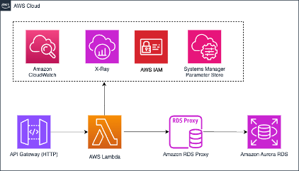

Our goal: to see exactly how much we can improve the performance of our function through different optimization techniques. Seems fairly straightforward, right? Well... it may be more complicated than you’d think.

As you’ll see, we learned there’s a lot of nuanced decisions made in the journey toward optimization. Everything from which database client is chosen to the memory configuration of the Lambda function can have significant impact on Lambda performance.

## Testing the Application

Any good experiment needs a method for testing the results. Here’s how we approached testing our application.

First, we have two versions of the application: the first version is a simple app before any optimizations have been implemented; the second version of the application we optimized over time by identifying enhancements and measuring the performance gains for each one. You can find the code examples on our [AWS Sample github repository](https://github.com/aws-samples/optimizations-for-lambda-functions). Below is the diagram for the pre-optimized version.

As we tested performance, we hoped to identify the optimal configuration for a GET request to a Lambda function and retrieve data from an [Aurora database](https://docs.aws.amazon.com/rds/?sc_channel=el&sc_campaign=reinvent&sc_geo=mult&sc_country=mult&sc_outcome=acq&sc_content=improved-lambda-warm-start-speed-95). To simulate users and requests, Artillery was used to send data to API Gateway, and then to Lambda. Artillery lets a developer test their application in a defined way using a YAML configuration file. We configured our tests to be 60 seconds long, in one of two configurations. The first test starts at 50 RPS and runs for a minute. You can see the configuration of Artillery below:

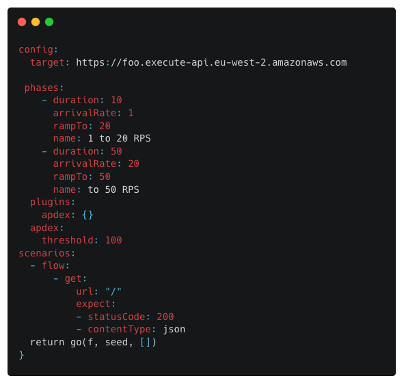

Here’s a quick breakdown of the process we used for measuring and improving performance.

First, we leveraged AWS Powertools, which is a library that allows Serverless developers to quickly implement best practices and improve developer velocity. Powertools includes methods and libraries for quickly implementing consistent logging, metrics, and traces inside your codebase. For instance, with X-Ray you have a companion for your distributed traces. Traces allows you to understand an end-to-end event as it goes from resource to resource by segment. One of the benefits of using X-Ray is to capture the individual performance by segment and log if there was a cold start. Here’s an example of one of these logs below. Notice below the column labeled “coldStarts” for each invocation of the function with a value of “1”. 

Second, by instrumenting the the application, we were able to identify the segments of code that weren’t performing well and identify additional changes we could make to optimize. (Don’t worry: we’ll get to these changes in a minute.)

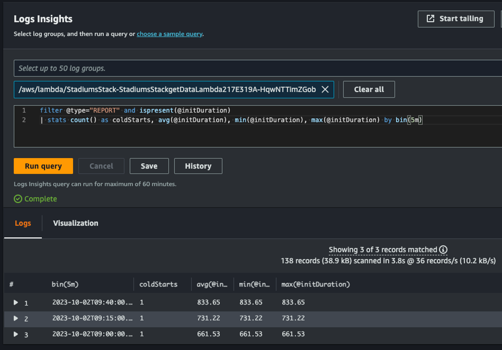

We measured performance by evaluating the segment timeline. Take the Segment Timeline below, which shows segment by segment how long each phase took during the initialization of the function. Highlighted in the orange box is the total time that that specific initialization took for Lambda to run our code — which was 1.43 seconds.

You’ll notice that we didn’t focus on the total duration of 2.79 seconds. You may be wondering why. Well, this number includes things like Lambda service overhead of 38 ms, which as a developer, you can’t control. (That overhead is time that Lambda service requires to set up each invocation, like starting up and shutting down the environment.)

Instead, our focus is only on the segments we can directly impact with code changes. Our testing will focus on two metrics: reducing the number of cold starts, and reducing how long an initialization runs. Reducing the execution time of a function will increase the TPS per sandbox. 

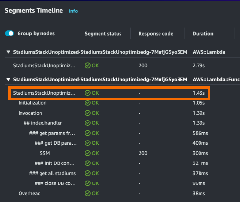

## Method 1: High-level View, Implementation, Testing/Data Summaries

Amazon RDS Proxy is a natural addition to ensuring performance between a Lambda function and the RDS database. While both the pre-optimized and optimized versions of our application have an RDS Proxy configured, it’s worth calling out here the benefits of the service. This includes the ability to to efficiently scale the connections to your Serverless applications. Further, RDS Proxy enables you to maintain predictable database performance by managing the number of database connections that are opened. Managing connections helps manage unpredictable workloads and can provide higher availability in the event of a transient database failure. 

One last consideration for performance optimization: when designating code as an ES module, you can use the await keyword at the top level of your code. With this feature, Node.js can complete the asynchronous initialization code before the handler invocations. Here we are making the request to Parameter Store, a capability of AWS Systems Manager, which will complete prior to the first invocation. You can read more about the top-level await [here](https://aws.amazon.com/blogs/compute/using-node-js-es-modules-and-top-level-await-in-aws-lambda/?sc_channel=el&sc_campaign=reinvent&sc_geo=mult&sc_country=mult&sc_outcome=acq&sc_content=improved-lambda-warm-start-speed-95) in this AWS Blog article. This is important, as you’re getting the benefit of the additional CPU during initialization (above 1.8 GB of memory), providing additional compute that otherwise be used for the TLS Handshake as part of Parameter Store.

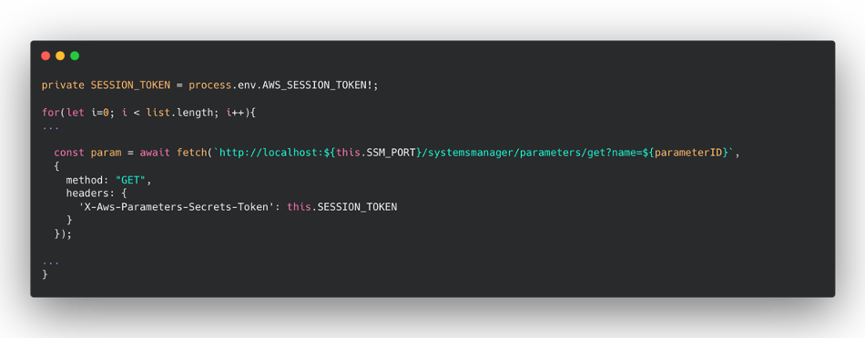

At this stage, we were happy with our API, we have minified and bundle the code, we followed the best practices like top-level await, we set a sensible memory size to mantain the costs low and so on. However we noticed during the ramped up load testing that the application reached 33 TPS before triggering errors. We saw a reduction in execution time. More specifically, we observed that there were 18 cold starts with a 1.42 second execution time. Once the execution environment was created, the cold starts were eliminated, and we saw 167ms execution times. This was exacerbated when we ran a sustained test and saw 137 cold starts, which reduced the number of TPS that the application could scale to until there were sufficient execution environments created.

So, we asked ourselves: what can we do to make our API handle more requests with the same Lambda function execution environment to decrease the cost and the response time as well? Looking at the most common ways to optimize a workload running on a Lambda function, we could start looking at the bundle size of the function code.

## Dependencies and bundle size

When we analyzed how the bundle was composed using `esbuild —analyse` flag we quickly realized the major offender for the bundle size was the package `moment-timezone`, a dependency used by Sequelize, the SQL module used for querying Postgres.

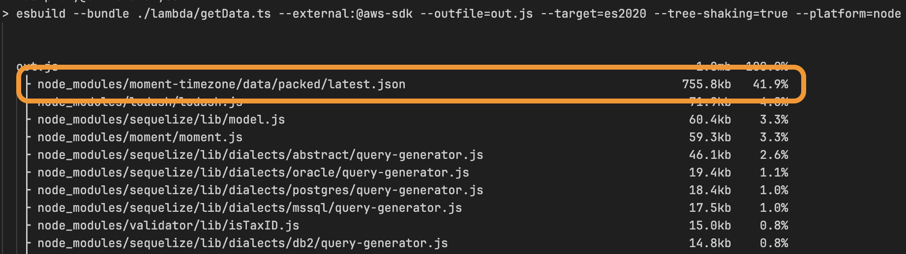

Therefore, we looked into replacing it with another Postgres library and we found in Postgres.js the perfect answer.

In fact, just refactoring the code and removing Sequelize in favour of Postgres.js moved the bundle size from 1.6MB to slightly over 40KB. The final bundle of the optimized version after adding more libraries ended up being 246KB. This was a great result with a small effort. Considering our function is not very complex, think what you can achieve in workloads with a large codebase per function.

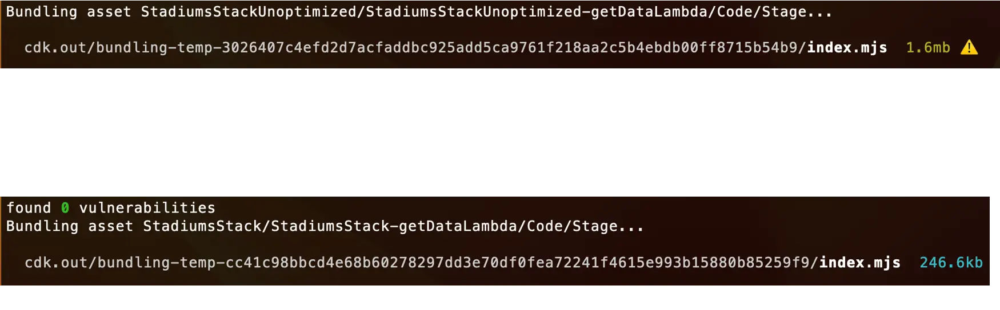

## Leveraging extensions

Using the top-level await for retrieving the parameters from Parameters Store was fine, but at scale the challenge is that you have to deal with the [transactions per second quotas](https://docs.aws.amazon.com/general/latest/gr/ssm.html?sc_channel=el&sc_campaign=reinvent&sc_geo=mult&sc_country=mult&sc_outcome=acq&sc_content=improved-lambda-warm-start-speed-95) of the `getParameter(s)` API. In many cases the parameters are not changing every second or even less. So the Parameters Store team created an extension for Lambda functions that takes care to retrieve the parameters from Parameters Store and/or secrets from Secrets Manager. The extension takes care also to cache these data, and you can configure multiple parameters — for instance, the time-to-live before retrieving again these data from both services.

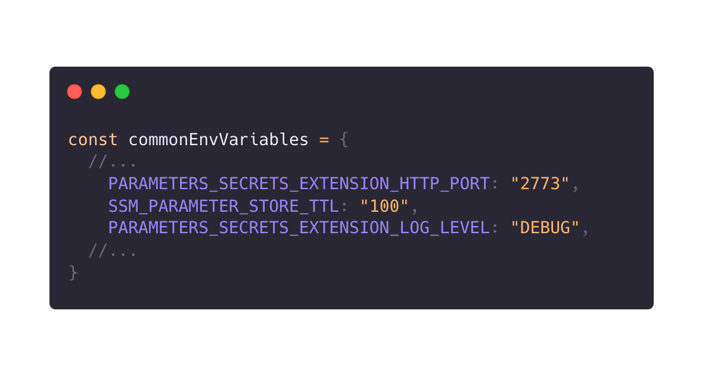

If you are not familiar with Lambda function extensions, think about them like a background process. Therefore the communication between the Lambda function and an extension happens via localhost as you can see in the following example `database/DBParameters.ts` integration.

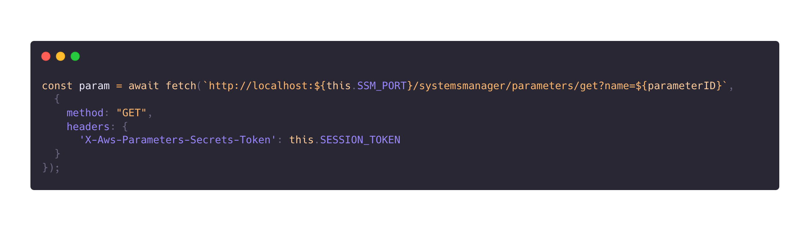

When we decided to integrate the extension, we were able to remove all the dependencies to the AWS SDK, trimming down the size of the final bundle and improving the execution time of the function that know retrieves the parameters less often than consuming an API from the AWS SDK and it’s cached in the same network. We moved from double-digit responses via the SDK to single-digit from the extension.

This latency reduction improved the response time of the optimized function making our response time faster and reducing the cost for running our logic.

## Cache-Aside Pattern

While we were running load testing sessions, we asked ourselves if the response of the API could be cached or not. In the initial test, also with the best execution time, the Lambda function was spending more than 100ms to perform the same query over and over again.

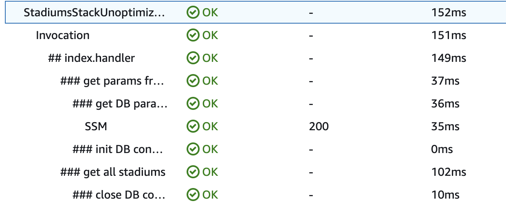

In our experience — not only in our case but in many others we have seen in the trenches — a cache can become a mechanism to improve the API response time and reduce the strain for upstream dependencies. Even content that changes frequently might have some parts (if not the entire data set) that is cacheable for few seconds or minutes. It might seem like a small amount of time, but absorbing hundreds or thousands of requests using a cache pattern helps you to handle more traffic and reduces the load towards a database or a third party system, for instance.

We decided to use [Amazon ElastiCache](https://docs.aws.amazon.com/elasticache/?sc_channel=el&sc_campaign=reinvent&sc_geo=mult&sc_country=mult&sc_outcome=acq&sc_content=improved-lambda-warm-start-speed-95) for storing temporarily the query result and relying on Redis cache eviction mechanisms for querying fresh data from Postgres when data weren’t available in ElastiCache.

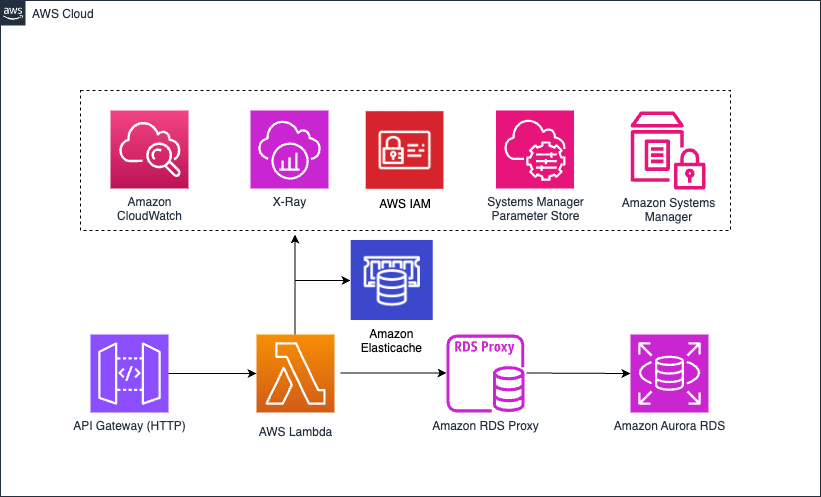

This approach is called cache-aside pattern. With this approach, we not only enhance performance but also maintain data consistency between the cached information and the underlying data store.

Applications utilize caching to optimize frequent access to data stored in a data repository. Nonetheless, it's unrealistic to assume that cached data will consistently align perfectly with the data in the underlying store. Therefore, applications should establish a robust strategy to ensure that cached data remains as up-to-date as feasible, while also being capable of detecting and handling situations where the cached data becomes outdated.

In the following sequence diagram, you can understand the logic mapped inside the Lambda function’s code:

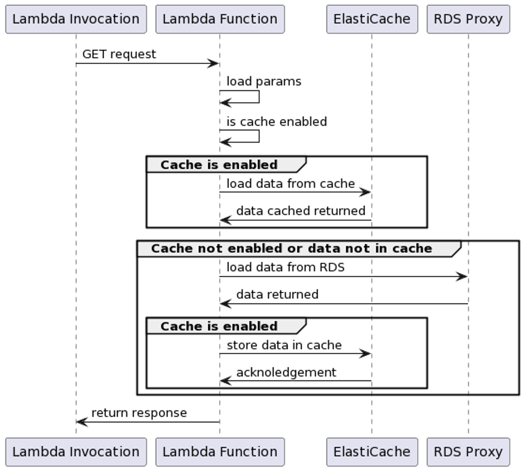

Retrieving the data from an in-memory cache helped tremendously the performance of our Lambda function. In fact we moved from hundreds of milliseconds to query the data to a couple of milliseconds in the best case scenario!

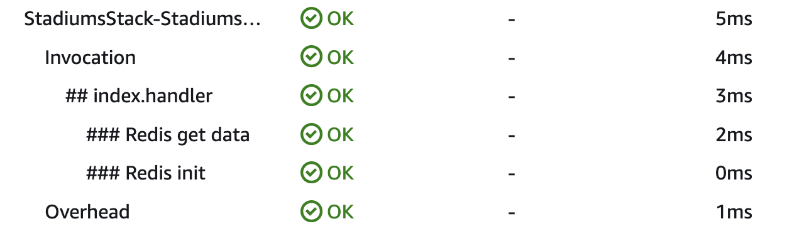

The other positive effect of this approach is that the ElastiCache cluster is shared across all the execution environments needed to handle the traffic load. Therefore also with cold starts, we will improve the response time performance, considering the data set is likely to be cached in memory and only in the worse case scenario we might reach over hundreds of milliseconds to serve the response. There are other alternatives to cache responses for an API like using API Gateway cache or a CDN like CloudFront. However ElastiCache provides the flexibility to store only the data needed and you can even increase resilience leveraging the 99.99% of availability offered by this service since the beginning of 2023.

## Memory Size and Architecture

When we implemented the first version of the API, we decided to go slightly above the minimum memory size of a function (256MB), guessing that it would be cheaper. Guesstimates rarely pay off, so for this new version, we decided to use [Lambda Power Tuning](https://github.com/alexcasalboni/aws-lambda-power-tuning) and find the sweet spot between cost and performance. Lambda Power Tuning is an open source tool that tests a Lambda function with different memory size, returning the average response time for every memory size tested (it includes cold and warm starts).

We decided to test the pre-optimized version of our application first, and we immediately spotted that our guesstimate of using 256MB was quite wrong. Increasing the memory size to 512MB would have already improved the previous results. Remember that the amount of memory also determines the amount of virtual CPU available to a function, so adding more memory proportionally increases the amount of CPU, which in turn increases the overall computational power available. If a function is CPU-, network-, or memory-bound, then changing the memory setting can dramatically improve its performance.

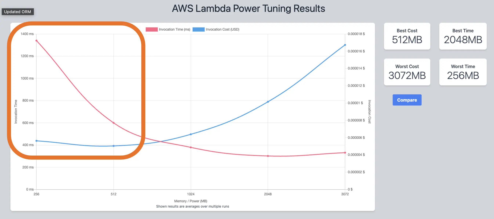

When we tested the final version of the optimized version, we found 1024MB to be the sweet spot for cost and performance, as suggested by Lambda Power Tuning for this API. Hence, we changed the memory size to 1GB without guesstimating the new memory size. 

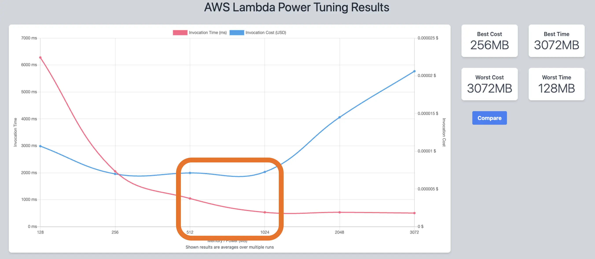

Power Tuning is an absolute must for finding the right memory size on every change we made during the refactoring process.

## Move to Graviton

The other change we made, for cost savings more than performance, is that we moved from X86 to Graviton 2 architecture. This is a simple but effective change that can be done when you are not using any libraries that rely on X86 architecture with libraries that require that architecture. Lambda functions powered by Graviton 2 are designed to deliver up to 19% better performance at 20% lower cost — so it seemed like a no-brainer.

## AWS SDK

Finally, in the optimized version of our app, we removed any AWS SDK dependency, because we changed the retrieval of environment variables from Parameter Store using the extension over the SDK.

However, when we had the AWS SDK bundled with the code, we saw an increase of performance compared to leverage in the one available in the runtime. You might wonder why that is.

Well, the reason is pretty simple: colocating the SDK code within your bundle (remember to use tree-shaking to bundle only the code needed and not more) makes the execution immediate. When we load the dependency from the runtime, we are relying on the speed of reading from disk that takes longer than having the code available already in-memory. If you want to learn more, we highly encourage reading [this post](https://aws.amazon.com/blogs/developer/reduce-lambda-cold-start-times-migrate-to-aws-sdk-for-javascript-v3/?sc_channel=el&sc_campaign=reinvent&sc_geo=mult&sc_country=mult&sc_outcome=acq&sc_content=improved-lambda-warm-start-speed-95) written by the AWS SDK engineers.

## Final results

So after all of these changes, what was the final result? For the ramped test, when we compare the pre-optimized versus the optimized versions, we found the optimizations resulted in a 167ms run versus 6ms respectively. That’s 161ms or 96% reduction of duration per execution!

Let’s evaluate the P95 and P99 of the testing. Looking at the P99 of the pre-optimized application for the ramped test, it is far to the right with around 2.05 seconds of latency.

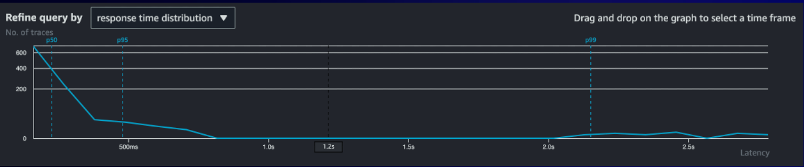

In comparison, when running the ramped test against the optimized solution, the P99 is less than 100ms.

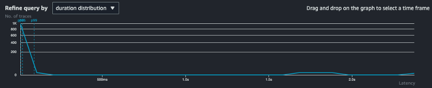

These graphs highlight the performance improvement for the optimized solution as well as demonstrating visually the improvement. These improvements lead to fewer cold starts, more responses handled by the same execution environment, and an increase of throughput of our API.
Finally, we moved from 33 TPS with 18 cold starts of the pre-optimized version to 48 TPS with 9 cold starts using exactly the same load testing strategy with Artillery.

## Summary

In this example, we've taken you through our thought process and the choices we made while optimizing. Lambda functions might not be rocket science, but they give you a bunch of knobs and features to juice up your code and settings for peak performance. Here are some practical takeaways for everyday builders:

* **Load test your Serverless workloads before deploying in production**: Prove your assumptions and adjust accordingly based on results.
* **Dependencies and code optimizations are important**: In workloads using containers we are used to waiting minutes for complex web applications to scale out. However, with Lambda functions, the scaling model is different. Investing time to understand your dependencies and optimize your code and bundle size can help you achieve better performance and a more sustainable codebase in the long run.
* **Every programming language has its own ways to be optimized**: In this example we have worked with TypeScript, where we could apply code minification, tree-shaking, dead code elimination, and more. Every programming language has its own mechanisms to be optimized, so look inside your favorite community and find the best resources to improve your code.
* **Avoid guesstimates, stick with facts**: Using tools like Lambda Power Tuning and embedding them in your development lifecycle helps you to reduce the guesses and increase the confidence in your decisions
* **Cold starts can be mitigated**: Optimizing your Lambda functions will reduce the cold starts inside your system. It’s important to highlight that cold starts might a problem in latency-sensitive workloads, but not every workload requires synchronous responses (asynchronicity to the rescue) and if there are less workloads, the P95 and P99 results will improve massively.

Every workload comes with its unique challenges, but we're hoping this article sparks some fresh ideas for beefing up your Lambda functions and demystifying the potential of this awesome compute service.

## Where to Go Next

We covered a lot of ground in this post. If you're keen to dive deeper into optimizing your Lambda functions, we would suggest diving into [Serverless Land](https://serverlessland.com/blog) as starting point.

And if you want the lowdown on the Lambda service's architecture and how these functions do their thing, you should definitely check out this [fantastic talk](https://www.youtube.com/watch?v=0_jfH6qijVY) by Julian Wood, Principal Serverless Developer Advocate, and Chris Greenwood, the Lambda Principal Engineer, from re:invent 2022.

Last but not least, you can't go wrong with the official Lambda documentation for solidifying your knowledge on this service. There's even a section dedicated to [functions optimizations](https://docs.aws.amazon.com/lambda/latest/operatorguide/perf-optimize.html?sc_channel=el&sc_campaign=reinvent&sc_geo=mult&sc_country=mult&sc_outcome=acq&sc_content=improved-lambda-warm-start-speed-95), which is a great place to kick things off.
