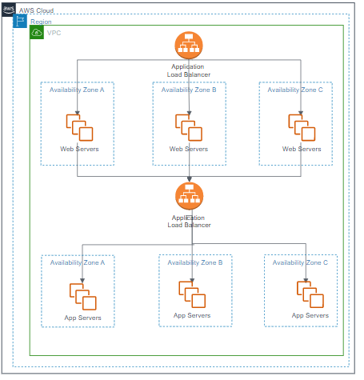
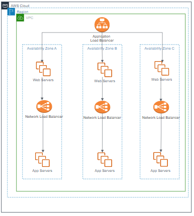

The use of multiple AWS accounts to manage different workloads or business units within an organization is a common practice for many AWS customers. Using multiple accounts allows for better management and governance of large-scale deployments when multiple teams are involved. AWS provides several tools and services for organizations to manage multiple AWS accounts, including [AWS Organizations](https://aws.amazon.com/organizations/) and [AWS Control Tower](https://aws.amazon.com/controltower/).

Multiple accounts usually involve multiple [Amazon Virtual Private Clouds (VPC)](https://aws.amazon.com/vpc/)s. The number of VPCs that customers use is generally correlated with their number of accounts, teams, and staged environments (production, development, test, etc.).

With multiple accounts and VPC deployments, it becomes more difficult to ensure the effective use of [Availability Zones](https://aws.amazon.com/about-aws/global-infrastructure/regions_az/) (AZ)s across all the accounts and VPCs. In this post, we'll discuss the benefits of using multiple AZs for your workload, the impact of not using multiple AZs effectively, and the best practices for using multiple AZs in a multiple account/multiple VPC environment.

## Benefits of using multiple AZs in your Architecture

An AZ is one or more discrete data centers with redundant power, networking, and connectivity in an AWS region. Deploying your application across multiple AZs can improve resiliency by providing redundancy and minimizing the impact of failures. By distributing your resources across multiple AZs and leveraging AWS services (i.e., [Elastic Load Balancing](https://aws.amazon.com/elasticloadbalancing/), [Amazon Aurora](https://aws.amazon.com/rds/aurora/)), you can ensure that your application remains available and continues to operate even in the face of disruptions or failures.

Suppose you have a web application running on EC2 instances in a single AZ within a region. If that AZ experiences an outage due to a natural disaster, hardware failure, or any other type of disruption, your application would be impacted until the issue is resolved. However, if you deploy your application across multiple AZs within the same region, it can continue to operate normally even if one or more AZs become unavailable. For example, you can deploy your application on EC2 instances in multiple AZs and use Elastic Load Balancing (ELB) to distribute traffic across the instances in each AZ. If one AZ is experiencing failures, traffic can be automatically redirected to the instances in the other AZs, ensuring that your application remains available.

## Impacts of inadequate use of multiple AZs

While using multiple AZs in your architecture provides multiple benefits, not using AZs effectively can negatively impact your AWS deployment. Inadequate AZ utilization can decrease the availability of your workload, impact the performance of your applications, and increase your AWS usage cost.

### Performance: 

Round-trip latency between two instances in the same AZ is generally a sub-millisecond when using [enhanced networking](https://docs.aws.amazon.com/AWSEC2/latest/UserGuide/enhanced-networking.html). It can increase, however, to a few milliseconds between AZs in the same Region (it remains within a single-digit millisecond).

If your application needs traffic to traverse the boundaries of AZs multiple times in order to produce a response, all these delays will add up, negatively impacting the performance and responsiveness of your application.

This blog [post](https://aws.amazon.com/blogs/architecture/improving-performance-and-reducing-cost-using-availability-zone-affinity/) illustrates very well how traversing AZ boundaries numerous times can increase the end-to-end latency for a service.

### Availability: 

To illustrate the impact of non-effective multiple AZs use on the availability of an application, let's consider the example of a simple two-tier application deployed across three AZs to ensure redundancy. Figure 1 illustrates the case where an [Application Load Balancer](https://aws.amazon.com/elasticloadbalancing/application-load-balancer/) (ALB) is used to distribute traffic between three sets of web servers in the three AZs, and a second ALB is used to distribute traffic between the three sets of application servers across the three AZs. Figure 2 illustrates the case where an Application Load Balancer (ALB) is used to distribute traffic between the three sets of web servers in the three AZs, while each web server uses a local network load balancer to distribute the traffic among the local application servers. Network load balancers can be limited to a single AZ as opposed to an ALB, which needs at least two AZs to work.

In the case of one Availability Zone impairment, with the architecture depicted in Figure 1, the chance of avoiding the impaired zone is $\frac{2}{3}$ X $\frac{2}{3}$ = $\frac{4}{9}$. However, with the architecture depicted in Figure 2, the chances to avoid the impaired availability zone are $\frac{2}{3}$. If N services are a part of this call path, then these numbers generalize to  $(\frac{2}{3})^{N}$ for N services, versus remaining constant at  $\frac{2}{3}$ for zonal services. Check this blog [post](https://aws.amazon.com/builders-library/static-stability-using-availability-zones/) for more in depth understanding of how to use AZs to achieve static stability at AWS.

*Figure 1: Cross AZs load balancing*

*Figure 2: AZ Affinity*

### Cost: 

Data transferred "in" and "out" from [Amazon EC2](https://aws.amazon.com/ec2/pricing/on-demand/), [Amazon RDS](https://aws.amazon.com/rds/aurora/), [Amazon Redshift](https://aws.amazon.com/redshift/), [Amazon DynamoDB Accelerator](https://aws.amazon.com/dynamodb/dax/) (DAX), [Amazon ElastiCache](https://aws.amazon.com/elasticache/) instances, [Elastic Network Interfaces](https://docs.aws.amazon.com/AWSEC2/latest/UserGuide/using-eni.html), or [VPC Peering connections](https://docs.aws.amazon.com/vpc/latest/peering/what-is-vpc-peering.html) across Availability Zones in the same AWS Region is not free. There is a cost per GB charged in each direction. Detailed pricing is available [here](https://aws.amazon.com/ec2/pricing/on-demand/#Data_Transfer_within_the_same_AWS_Region).

Though the charges associated with data transfer across AZs are low, it is still wise to reduce cross-AZ traversals to save avoidable expenses.

## Best Practices for Multi-Account Environments

As explained above, you should deploy your workloads in multiple AZs to achieve high availability and fault tolerance, but at the same time, you want to reduce the need for your traffic to cross AZ boundaries as much as possible to avoid the negative impacts associated with multi-AZ environments.

This recommendation is easy to implement in a single-account environment. It becomes challenging when dealing with multiple-account, multiple-VPC environments.

### Use case:   

To illustrate the AZ usage challenges that come with multi-account/multi-VPC environments, and to present some best practices to effectively use AZs, let's consider a common architecture, depicted in Figure 3.

In this example, we will consider that three teams own three separate accounts. The network engineering team owns the shared networking account. All traffic transiting between VPCs and existing in or entering the AWS environment is inspected by the AWS firewall. This is a [common architecture](https://aws.amazon.com/blogs/networking-and-content-delivery/deploy-centralized-traffic-filtering-using-aws-network-firewall/) that multiple AWS customers use. The system administration team owns the shared services account. In our scenario, we consider that an [AWS Managed Microsoft AD](https://aws.amazon.com/directoryservice/) is deployed in the shared services account. Finally, an application team owns an application account where an application is deployed.

*Figure 3: Multi-Account/Multi-VPC deployment architecture*

 
### Challenges:

As explained earlier, to effectively use Availability Zones in your architecture, you need to reduce, as much as possible, the need for traffic to cross AZ boundaries in your architecture.

The challenge is that different teams don't necessarily see what Availability Zones other teams are using. Even within a single AWS account, if different AZs are used in different VPCs, there is a higher probability that traffic will cross the AZ boundaries.

Statistically, if an organization decides to use k AZs in a given region and does not set rules on what AZs are used, there are possible $\binom{n}{k}$ combinations of k AZs that can be selected. For example, if we decide to use 2 AZs randomly in the US West 2 (Oregon) region, where 7 AZs are available, we have 21 possible combinations of AZs that can be selected. If we don't set the number of AZs to use, and we let each account randomly select the number and the AZs to use, we will end up with $\binom{n}{1}$ + $\binom{n}{2}$ + . .+  $\binom{n}{n}$ possible combinations of AZs. In the case of the US West 2 region, this generates 127 possible AZ use cases in different VPCs in different accounts.

Consider Flow 1 (blue) in Figure 3, going from the application VPC in the application account to the shared services VPC in the shared service account. As all traffic must be inspected by the AWS firewall in the inspection VPC, the outgoing flow will first be routed to the AWS Inspection VPC before being sent back to the AWS Transit gateway, which will route it to the shared services VPC. Assuming that traffic within each VPC is routed within the same AZ, traffic for Flow 1 (blue), generated at AZ AB, will first be routed to AZ CB for inspection, then routed to AZ BB for shared services connectivity.

With a random selection of AZs across accounts and VPCs, and considering that different account teams don't have default visibility of what other accounts have selected as AZs, the probability that AZ AA, AZ CB, and BB DA in Figure 3 are the same is $\frac{1}{n}$ x $\frac{1}{n}$ x $\frac{1}{n}$ , where n is the number of AZs in the region. For the US West 2 Oregon region example, the probability that the three AZs are the same is $\frac{1}{7}$ x $\frac{1}{7}$ x $\frac{1}{7}$ = 0.00297, or about 0.3%. This means that without proper planning and selecting of AZs in each VPC, the chance that Flow 1 will cross AZ boundaries at least once is 99.7%, which is very high.

### Best Practices dealing with AZs in multi-account/multi-VPC environments

1. **Centrally manage AZ assignations.**

A central team should be in charge of assigning what AZs to use in each region. A central team is usually in charge of assigning CIDR for different VPCs to avoid conflicts, so the same team can also assign AZs to be used.

Note that there is a difference between the Availability Zone name and the Availability Zone ID. The Availability Zone us-east-1a for your AWS account might not represent the same physical location as us-east-1a for a different AWS account. AWS maps the physical Availability Zones randomly for the Availability Zone names for each AWS account. For more information, see [Availability Zone IDs for your AWS resources](https://docs.aws.amazon.com/ram/latest/userguide/working-with-az-ids.html).

The central team provides the AZ ID that needs to be used in each region where the Organization has a presence.

To view the AZ IDs for the Availability Zones in your account:

- Navigate to the AWS ([AWS Resource Access Manager](https://aws.amazon.com/ram/)) (RAM) console page in the AWS console.
- You can view the AZ IDs for the current AWS Region under Your AZ ID.

*Figure 4: Determining the AZ IDs for an account in a given region*
_

Some AWS-managed resources use only two AZs as the AWS-managed AD. So, at minimum, make sure these two AZs are preferred across all accounts.

You can use [AWS Network Manager](https://docs.aws.amazon.com/managedservices/latest/userguide/networking-manager.html) to select the two Availability Zones with the least amount of latency between them.

2. **Implement AZ-aware routing.**

An [AWS transit gateway](https://aws.amazon.com/transit-gateway/) is what multiple customers use to interconnect their different VPCs in different accounts. When connecting within a VPC, it is important to have a Transit Gateway attachment to a subnet in the same AZ as the subnet of the resource that needs connectivity. You also need to make sure that your resource subnet routing table routes the traffic to the local (in the same AZ) AWS transit gateway attachment and not to an attachment in another AZ.

For inter-VPC routing, the Transit Gateway will attempt to keep traffic in the same AZ that it originated in until it reaches its destination. Traffic crosses AZs between attachments only if there is an AZ failure or if there are no subnets associated with a VPC attachment in that AZ. It is important, though, to build routing tables for different VPCs and for the transit gateway not to override this default behavior and force routing to other AZs.

This [post](https://aws.amazon.com/blogs/networking-and-content-delivery/deployment-models-for-aws-network-firewall-with-vpc-routing-enhancements/) provides multiple scenarios on how to implement AZ-aware routing for AWS Firewall deployments, and this [post](https://aws.amazon.com/blogs/networking-and-content-delivery/centralized-inspection-architecture-with-aws-gateway-load-balancer-and-aws-transit-gateway/) explains how to implement routing when using a third-party appliance firewall, which is also a common practice among AWS customers.

3. **Implement AZ-aware load balancing.**

Flow 2 (yellow) in Figure 3 sources from the internet to an Application Load Balancer (ALB). Without implementing AZ awareness, the traffic will risk traversing one AZ in the Ingress VPC (network account) and going to another AZ in the application VPC (application account). Other than ensuring that the Ingress VPC (network account) and application VPC (application account) are using the same AZs, we also need to ensure that if an AZ is selected by the ALB at the Ingress VPC, the traffic is sent to the same AZ in the application VPC.

The solution to this is to deploy [Network Load Balancers](https://aws.amazon.com/elasticloadbalancing/network-load-balancer/) (NLB) at each Ingress VPC subnet that has an ALB endpoint and to use those NLBs as targets for the ALB. Each NLB will be limited to one AZ and will distribute the traffic to the local endpoints in the application VPC.

If you want to give the application full control of its environment, you can deploy the NLBs in the application account and have proxy servers in the Ingress account that will route traffic to the NLB local to the AZ where they are running.

This [post](https://aws.amazon.com/blogs/networking-and-content-delivery/resolve-dns-names-of-network-load-balancer-nodes-to-limit-cross-zone-traffic/) provides a good reference on how to implement AZ-aware load balancing with ALB and NLBs.

4. **Use local resources to the AZ when possible.**

When target selection is managed by the client itself (i.e., Flow 1 in Figure 3), the application instance can decide what AD instance to use as primary and what AD instance to use as secondary. In that case, the best practice is to set an order where the primary AD is always the AD in the same AZ.

The same principle can be applied to traffic exiting to the internet as Flow 3 (red) in Figure 3. We recommend utilizing separate NAT Gateways in each AZ and routing traffic locally within the same AZ, as opposed to sharing a NAT Gateway across multiple Availability Zones (AZ).

This is also true for multiple types of customer-deployed applications that implement retrial mechanisms rather than relying on an external load balancer.

5. **Regularly review and optimize AZ utilization based on performance and cost metrics.**

Finally, it's important to regularly review and optimize your AZ utilization based on performance and cost metrics. This includes analyzing network traffic patterns, monitoring resource utilization and costs, and adjusting your resource placement and routing strategies to optimize performance and minimize costs.

## Conclusion

In summary, multi-AZ architecture is a key feature of AWS that provides high availability, fault tolerance, and improved performance for your applications. However, effective AZ utilization is critical for maximizing these benefits and minimizing the risks associated with suboptimal resource placement and routing. By following best practices for multi-account environments, you can optimize AZ utilization, reduce latency and costs, and ensure the availability and performance of your applications in AWS.

