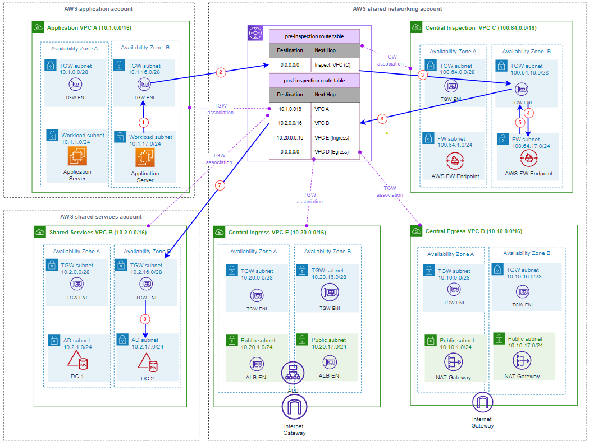

 

Using multiple AWS accounts to manage different workloads or business units within an organization is a common practice for many AWS customers. Using a multi-account strategy helps isolate and manage your business applications and data. AWS provides several tools and services for organizations to manage multiple AWS accounts, including [AWS Organizations](https://docs.aws.amazon.com/organizations/latest/userguide/orgs_introduction.html) and [AWS Control Tower](https://docs.aws.amazon.com/controltower/latest/userguide/what-is-control-tower.html).

Multiple accounts usually involve multiple [Amazon Virtual Private Clouds (VPC)](https://docs.aws.amazon.com/vpc/latest/userguide/what-is-amazon-vpc.html)s. The number of VPCs that customers use generally correlates with their number of accounts, teams, and environments (production, pre-production, development, test, etc.).

With multiple accounts and VPC deployments, ensuring the effective use of [Availability Zones](https://aws.amazon.com/about-aws/global-infrastructure/regions_az/) (AZs) across all the accounts and VPCs becomes more challenging. In this post, we will discuss:

- the benefits of using multiple AZs for your workload,
- the impacts of ineffective use of multiple AZs, and
- some guidelines for using multiple AZs in multi-account/multi-VPC environments.

## The Benefits of Using Multiple AZs in Your Architecture

Each AWS Region consists of three or more AZs. Each AZ is one or more discrete data centers with redundant power, networking, and connectivity, independent of the other AZs within that Region. Deploying your application across multiple AZs can improve resiliency by providing redundancy and constraining the impact of failures. By distributing your resources across multiple AZs, you can help ensure that your application remains available and continues to operate even in the face of disruptions or failures.

Suppose you have a web application running on [Amazon EC2](https://docs.aws.amazon.com/AWSEC2/latest/UserGuide/concepts.html) instances in a single AZ within a region. If that AZ experiences an outage due to a natural disaster, hardware failure, or any other disruption, your application would be impacted until the issue is resolved. However, if you deploy your application across multiple AZs within the same region, it can continue to operate normally even if one AZ becomes impaired. This is because each AZ is independent of the others, and acts as a fault boundary. For example, you can deploy your application on EC2 instances in multiple AZs and use [Elastic Load Balancing (ELB)](https://docs.aws.amazon.com/elasticloadbalancing/latest/userguide/what-is-load-balancing.html) to distribute traffic across the instances in each AZ. If one AZ is experiencing failures, traffic can be automatically redirected to the instances in the other AZs, ensuring that your application remains available.

## Impacts of Inadequate Use of Multiple AZs

While using multiple AZs in your architecture provides several benefits, ineffective use of AZs can impact the performance of your applications and increase your AWS cost as follows.

**Performance:**

For latency sensitive applications, you need to limit cross-AZ traffic as round-trip latency between two instances in the same AZ is generally [sub-millisecond when using enhanced networking](https://aws.amazon.com/blogs/architecture/improving-performance-and-reducing-cost-using-availability-zone-affinity/).

Suppose your application needs traffic to traverse the boundaries of AZs multiple times in order to produce a response. In that case, all these delays will add up, negatively impacting the performance and responsiveness of your application.

Improving Performance and Reducing Cost Using Availability Zone Affinity blog [post](https://aws.amazon.com/blogs/architecture/improving-performance-and-reducing-cost-using-availability-zone-affinity/) illustrates how traversing AZ boundaries numerous times can increase the end-to-end latency for a service.

**Cost:**

Data transferred "n/Ingress" and "out/Egress" from [Amazon EC2](https://aws.amazon.com/ec2/pricing/on-demand/), [Amazon RDS](https://docs.aws.amazon.com/AmazonRDS/latest/AuroraUserGuide/CHAP_AuroraOverview.html), [Amazon Redshift](https://docs.aws.amazon.com/redshift/latest/dg/welcome.html), [Amazon DynamoDB Accelerator](https://docs.aws.amazon.com/amazondynamodb/latest/developerguide/DAX.html) (DAX), [Amazon ElastiCache](https://docs.aws.amazon.com/AmazonElastiCache/latest/red-ug/WhatIs.html) instances, [Elastic Network Interfaces](https://docs.aws.amazon.com/AWSEC2/latest/UserGuide/using-eni.html), or [VPC Peering connections](https://docs.aws.amazon.com/vpc/latest/peering/what-is-vpc-peering.html) across Availability Zones in the same AWS Region is not free. There is a cost per GB charged in each direction. Detailed pricing is available in [Data Transfer](https://aws.amazon.com/ec2/pricing/on-demand/#Data_Transfer_within_the_same_AWS_Region) section of the documentation.

It is important to reduce cross-AZ traversals to save avoidable expenses.

## Guidelines for Multi-Account Environments

As explained above, you should deploy your workloads in multiple AZs to achieve high availability and fault tolerance, but at the same time, you want to reduce the need for your traffic to cross AZ boundaries as much as possible to avoid the performance and cost impacts associated with multi-AZ environments.

This recommendation is easy to implement in a single-account environment. However, it may become challenging when dealing with multi-account/multi-VPC environments because of the lack of visibility that different account teams have on the AZs that the other account teams are using.

**Use case**

To illustrate the AZ usage challenges that come with multi-account/multi-VPC environments, and to present some best practices on effective use of AZs, let's consider a common architecture, depicted in Figure 1.

In this example, we consider that three teams own three separate accounts. The network engineering team owns the **shared networking account**. The AWS Network Firewall inspects all Ingress, Egress and East/West (VPC-to-VPC) traffic in a [centralized deployment architecture](https://aws.amazon.com/blogs/networking-and-content-delivery/deployment-models-for-aws-network-firewall/). The system administration team owns the **shared services account**. In our scenario, we consider that [AWS Managed Microsoft AD](https://docs.aws.amazon.com/directoryservice/latest/admin-guide/ms_ad_getting_started.html) domain controllers (DC) are deployed in the **shared services account**. Finally, an application team owns an **application account** where an application is deployed. The application servers in the **application account** need to join the domain managed by the AWS Managed Microsoft AD. Usually, customers have many such application accounts for different workloads but for the simplicity of the use case we consider just one application account.

| |
|:--:|
|*Figure 1: Multi-Account/Multi-VPC deployment architecture*|
 

**Challenges**

To effectively use AZs, you need to reduce cross-AZ traffic as much as possible in your architecture.

The challenge is that different teams may not necessarily see what AZs other teams are using. Even within a single AWS account, if different AZs are used in different VPCs, there is a higher probability that traffic will cross the AZ boundaries.

Statistically, if an organization decides to use k AZs in a given region that consists of n AZs and does not set rules on what AZs to be used, there are multiple possible [combinations](https://mathworld.wolfram.com/Combination.html) of k AZs that can be selected. For example, if we decide to deploy the architecture of Figure 1 in AWS US West 2 (Oregon) region that consists of 4 AZs (usw2-az1, usw2-az2, usw2-az3 and usw2-az4), and we decide to randomly select 2 AZs for each account, then we will have 6 possible combinations of the 2 AZs that can be chosen for each account, namely (usw2-az1, usw2-az2), (usw2-az1, usw2-az3), (usw2-az1, usw2-az4), (usw2-az2, usw2-az3), (usw2-az2, usw2-az4) and (usw2-az3, usw2-az4). The chances that the three accounts randomly choose the same two AZs is low and hence the importance of selecting the AZs to use in a systematic way.

||
|:--:|
|*Figure 2: East-West (VPC-to-VPC) traffic inspection scenario*|
 
Consider the East-West (VPC-to-VPC) traffic inspection scenario in Figure 2. Traffic is going from the application VPC (VPC-A) in the **application account** to the shared services VPC (VPC-B) in the **shared service account.** As the AWS Network Firewall must inspect all traffic in the inspection VPC (VPC-C) in the **shared networking account** , the outgoing flow will first be routed to the AWS Inspection VPC (VPC-C) before being sent back to the AWS Transit gateway, which will route it to the shared services VPC (VPC-B). Assuming that traffic within each VPC is routed within the same AZ as shown in the diagram, traffic generated at VPC-A AZ-B, will first be routed to VPC-C AZ-B for inspection, then routed to VPC-B AZ-B for shared services connectivity.

With a random selection of AZs across accounts and VPCs, and considering that different account teams don't have default visibility of what other accounts have selected as AZs, the probability that VPC-A AZ-B, VPC-C AZ-B, and VPC-B AZ-B in Figure 2 are the same is low. This means that without proper planning and selecting of AZs in each VPC, the chance that East-West inspection flow will cross AZ boundaries at least once is high.

**Availability Zone Name vs. Availability Zone ID**

It is important to be aware that there is a difference between AWS's concepts: **Availability Zone name** and[**Availability Zone ID (AZ ID)**](https://docs.aws.amazon.com/ram/latest/userguide/working-with-az-ids.html). When you create or modify a resource from the AWS console, such as creating a new VPC, you are presented with a list of **Availability Zone names** to select from, as shown in Figure 3.

||
|:--:|
|*Figure 3: Availability Zone Name (create VPC)*|

AWS maps the physical AZs randomly for the **Availability Zone names** for each AWS account in order to help distribute resources across the Availability Zones in an AWS Region instead of resources likely being concentrated in an AZ say "a" for each Region. For example, the AZ us-west-2a for your **shared networking account** in Figure 3 might not represent the same physical location as us-west-2a for the **application account**.

To identify the actual location of your resources relative to your accounts _AZ ID__is used_. An AZ ID is a unique and consistent identifier for an AZ across all AWS accounts. For example, usw2-az1 is an AZ ID for an AZ in the us-west-2 Region and it represents the same physical location in every AWS account. Figure 4 shows an example of a possible mapping between AZ names and availability Zone IDs in the US West 2 region.

||
|:--:|
|*Figure 4: Availability Zone Name – Availability Zone ID mapping example*|
 

When selecting AZs to use for each account, you need to work with AZ IDs and not AZ names.

**Guidelines dealing with AZs in multi-account/multi-VPC environments**

1. **Centrally manage AZ assignments.**

In many organizations, a central team is usually in charge of [assigning CIDR](https://aws.amazon.com/blogs/networking-and-content-delivery/amazon-vpc-ip-address-manager-best-practices/) ranges for different VPCs, so the same team should also select what AZs to use in each region.

The central team provides the AZ ID that needs to be used in each region where the Organization has a presence.

To view the AZ IDs for the Availability Zones in your account:

- Navigate to the AWS ([AWS Resource Access Manager](https://docs.aws.amazon.com/govcloud-us/latest/UserGuide/govcloud-ram.html)) (RAM) console page in the AWS console.
- You can view the AZ IDs for the current AWS Region under Your AZ ID. Alternately, you can also go to EC2 Dashboard in the console for the respective region and see the AZ IDs listed under the Zones section.

*Figure 5: Determining the AZ IDs for an account in a given region*

Some AWS-managed resources use only two AZs, such as the AWS Managed Microsoft AD. So, at minimum, ensure the two AZs you choose for your AD are preferred across all accounts.

Inter/Intra-AZ latency data is also exposed via [AWS Network Manager](https://docs.aws.amazon.com/managedservices/latest/userguide/networking-manager.html)-\>Infrastructure Performance dashboard. You can also view and select the two AZs with the minimal cross-AZ latency for your workload.

2. **Implement AZ-aware shared networking**

[AWS transit gateway](https://docs.aws.amazon.com/vpc/latest/tgw/what-is-transit-gateway.html) (TGW) is used to interconnect different VPCs in different accounts. When you attach a VPC to a transit gateway, you must enable one or more Availability Zones to be used by the transit gateway to route traffic to resources in the VPC subnets. You need to enable the same Availability Zones as the VPC resources that need to communicate through the AWS Transit Gateway. Any resources in Availability Zones where there is no [transit gateway attachment](https://docs.aws.amazon.com/vpc/latest/tgw/tgw-vpc-attachments.html) cannot reach the transit gateway.

For inter-VPC communications, AWS Transit Gateway is designed to keep traffic in the same AZ it originated in until it reaches its destination or is routed to another AZ. This is referred to as Availability Zone affinity. The traffic inspection scenario causes another challenge as traffic in both directions needs to be inspected by the same firewall instance in order for the return traffic not to be blocked by the firewall, for that it is important to enable the [TGW appliance mode](https://docs.aws.amazon.com/vpc/latest/tgw/transit-gateway-appliance-scenario.html)on the Inspection VPC attachment.

Figure 6 shows a traffic flow that is initiated by the application servers in the application VPC-A AZ-A and is destined to the domain controller in the shared service VPC-B AZ-B. In this scenario, we assume that the AZs A and B are the same for all the accounts. The source and destination are in two different AZs in order to illustrate the AZ related behavior.

||
|:--:|
|*Figure 6: Traffic flow from the application server to the domain controller.*|

Let's walk through the traffic flow from the Application Server to the Domain Controller:

1. Traffic from the application server in AZ-A VPC-A is sent to the Transit Gateway for destination in VPC-B AZ-B. The default route (0.0.0.0/0) in Application VPC A route table is used. Traffic is sent to the Transit Gateway [Elastic Network Interface](https://docs.aws.amazon.com/AWSEC2/latest/UserGuide/using-eni.html) (ENI) in AZ-A due to the Transit Gateway AZ affinity.
2. The Transit Gateway uses default route (0.0.0.0/0) of pre-inspection route table to route traffic to the inspection VPC C in the **networking account** as the application VPC A attachment is associated with the pre-inspection route table.
3. The traffic is sent to the Transit Gateway ENI in AZ A in the Inspection VPC as the Transit gateway maintains the AZ affinity.
4. Traffic is routed to the AWS Firewall Endpoint in AZ A based on the (0.0.0.0/0) on the route table of the TGW attachment subnet (_AZ A - TGW subnet route table)_ in the inspection VPC. Here we are using routing to maintain the AZ affinity.
5. Based on the default route (0.0.0.0/0) in Inspection VPC C route table, the traffic to Transit Gateway routes traffic to the Transit Gateway ENI in the same AZ (AZ-A).
6. Transit gateway uses default route (10.2.0.0/16) in the post-inspection route table to route traffic to the shared services VPC as the inspection VPC C attachment is associated with that route table.
7. Due to the AZ affinity behavior of the Transit Gateway, the traffic is sent to the TGW ENI in AZ A in the shared services VPC as the source is in AZ A.
8. Traffic is routed to the destination based on the route (10.2.0.0/16) in VPC B route table. The AZ change happens here.

The return traffic from the DC to the application server is illustrated in Figure 7 below. One important step to pay attention to in Figure 7 is step 3. Traffic originated at AZ B is being forward to the TGW ENI in AZ A at the Inspection VPC. This is due to the enablement of the appliance mode on the inspection VPC attachment that keeps traffic in both direction symmetric.

||
|:--:|
| *Figure 7: Return traffic flow to the Application Server to the from the Domain Controller.*|

This inspection scenario illustrates that you must always keep AZs in mind while designing and implementing your routing first by conserving the AZ affinity of the transit gateway and second by enabling appliance mode for stateful appliance. Sub-optimal routing implementation across the different VPCs and accounts can result in traffic bouncing between different AZs which can impact performance and cost. Adopting a convention to assign well-defined CIDR blocks for subnets in each AZ simplifies the routing tables in the **network account**. For example, in Figure 6, the /16 CIDR block for each VPC is divided into two /20 CIDR blocks, the first block is used in AZ A, and the second block is used for AZ B in all accounts simplifies the routing table by summarizing by AZ mainly when you need to implement [asymmetric routing](https://docs.aws.amazon.com/prescriptive-guidance/latest/inline-traffic-inspection-third-party-appliances/transit-gateway-asymmetric-routing.html).

Centralized egress scenario is shown in Figure 8. In this case, we recommend utilizing separate NAT Gateways in each AZ and routing traffic locally within the same AZ instead of sharing a NAT Gateway across multiple Availability Zones (AZ) or routing the egress traffic via a NAT Gateway in a different AZ compared from the source. Route tables of the two TGW attachment subnets in the Central Egress VPC are shown in Figure 8. You can see that the outgoing traffic is routed to the local NAT gateway in each AZ. There is no need to enable the appliance mode on the Egress VPC D attachment.

||
|:--:|
|*Figure 8: Routing traffic through NAT Gateway.*|

Deployment models for AWS Network Firewall with VPC routing enhancements blog [post](https://aws.amazon.com/blogs/networking-and-content-delivery/deployment-models-for-aws-network-firewall-with-vpc-routing-enhancements/) provide multiple scenarios on how to implement AZ-aware routing for AWS Network Firewall deployments in a single account. The Centralized inspection architecture with AWS Gateway Load Balancer and AWS Transit Gateway blog [post](https://aws.amazon.com/blogs/networking-and-content-delivery/centralized-inspection-architecture-with-aws-gateway-load-balancer-and-aws-transit-gateway/) explains how to implement routing when using a third-party firewall appliance in a single account, which is also a common practice among AWS customers.

3. **Consider disabling cross-zone load balancing.**

Let's consider centralized Ingress inspection as shown in Figure 9. Traffic is sourced from the Internet through the [Internet Gateway](https://docs.aws.amazon.com/vpc/latest/userguide/VPC_Internet_Gateway.html) (IGW) to an [Application Load Balancer](https://docs.aws.amazon.com/elasticloadbalancing/latest/application/introduction.html) (ALB). Without implementing AZ awareness, the ALB can use its Elastic Network Interface (ENI) in one AZ in the Ingress VPC ( **network account** ) for traffic targeting a final destination in another AZ in the application VPC ( **application account** ). For this, other than ensuring that the Ingress VPC ( **network account** ) and application VPC ( **application account** ) are using the same AZs, we also need to ensure that if the ALB selects an AZ at the Ingress VPC, the traffic is sent to the same AZ in the application VPC.

||
|:--:|
|*Figure 9:AZ aware load balancing scenario*|
 
1. Traffic from the Internet flows in through the Internet Gateway to the [Elastic IP address](https://docs.aws.amazon.com/AWSEC2/latest/UserGuide/elastic-ip-addresses-eip.html) of the ALB, which is dynamically created when you deploy an Internet-facing ALB.
2. The ALB is associated with one public subnet in each AZ. The ALB uses its internal logic to determine which ALB ENI to send traffic to. It is here where the [cross-zone load balancing](https://docs.aws.amazon.com/elasticloadbalancing/latest/application/disable-cross-zone.html) setting plays an important role. If cross-zone load balancing is disabled, then the ALB will send the traffic to an ALB ENI in the same AZ as the target endpoint. If not, then ALB can send the traffic to an ALB ENI that is in an AZ different from the AZ target endpoint. This scenario is further explained in step 10 below.
3. Traffic is sent to the Transit Gateway based on the VPC E route table default route.
4. Since Ingress VPC E attachment is associated with the pre-inspection route table, Transit gateway uses default route (0.0.0.0/0) to route traffic to the Inspection VPC.
5. As Transit Gateway maintains Availability zone affinity, the traffic is sent to the attachment TGW ENI in the same AZ (AZ B).
6. Traffic routed to the AWS Network Firewall Endpoint in AZ B based on the routing table of the AWS Firewall subnet in AZ B.
7. Based on the default route (0.0.0.0/0) in Inspection _VPC C route table_, the traffic to Transit Gateway routes traffic to the local (same AZ) Transit Gateway ENI in AZ-B.
8. Since Inspection VPC C attachment is associated with the post-inspection route table, Transit gateway uses route (10.1.0.0/16) to route traffic to the Application VPC.
9. Due to the Availability Zone affinity behavior of the Transit Gateway, the traffic is sent to the TGW ENI in Availability Zone B in the Application VPC as the source is in AZ B.
10. Traffic is routed to the destination based on the routing rule (10.1.0.0/16) in VPC A route table. With cross-zone load balancing disabled, traffic will always be kept in the same AZ. This is possible because the ALB will select an ALB ENI in the same AZ as the destination, as explained in step 2. If you enable the cross-zone load balancing, traffic can be sent to an AZ different from the ALB ENI AZ. Flow 10a 2Hillustrates this scenario.

While designing your cross-account load balancing, consider to [disable the cross-zone load balancing](https://docs.aws.amazon.com/elasticloadbalancing/latest/application/disable-cross-zone.html) if that is a possible option for you. Disabling cross-zone load balancing, comes with some limitations, such as the lack of support for stickiness and the need to properly plan the capacity in each AZ, as explained in the [documentation](https://docs.aws.amazon.com/elasticloadbalancing/latest/userguide/how-elastic-load-balancing-works.html). [Choosing a stickiness strategy for your load balancer](https://docs.aws.amazon.com/prescriptive-guidance/latest/load-balancer-stickiness/welcome.html) describes different types of load balancer stickiness and applicable use cases, to help you choose your stickiness strategy.

4. **Use local resources to the AZ when possible.**

When the client itself manages target selection, the application instance can decide what server to connect to and hence in which AZ. For example, if we consider the scenario of Figure 2, it is possible to have the application servers configured and point to specific domain controllers in the same AZ, thereby keeping the traffic local to that AZ. This will ensure that the traffic will not cross the AZ boundary unless there is a failure or a need for to use the secondary domain controller.

The same principle applies to other applications that have the flexibility to choose what target to connect to without an intermediate component, such as the load balancer.

5. **Regularly review and optimize AZ utilization based on performance and cost metrics.**

Finally, it's important to regularly review and optimize your AZ utilization based on performance and cost metrics. This includes analyzing network traffic patterns using [VPC flow](https://docs.aws.amazon.com/vpc/latest/userguide/flow-logs.html) for example, monitoring data transfer [charges](https://docs.aws.amazon.com/cur/latest/userguide/cur-data-transfers-charges.html), and adjusting your resource placement and routing strategies to optimize performance and minimize costs.

## Conclusion

In summary, multi-AZ architecture is a key feature of AWS that provides high availability and fault tolerance for your applications. However, effective AZ utilization is critical for maximizing these benefits and minimizing the risks associated with suboptimal resource placement and routing. In this blog post, we covered some best practices for multi-account environments, that you can use to optimize AZ utilization, reduce latency and costs, and ensure the availability and performance of your applications in AWS.