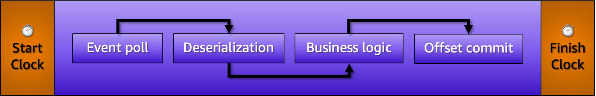
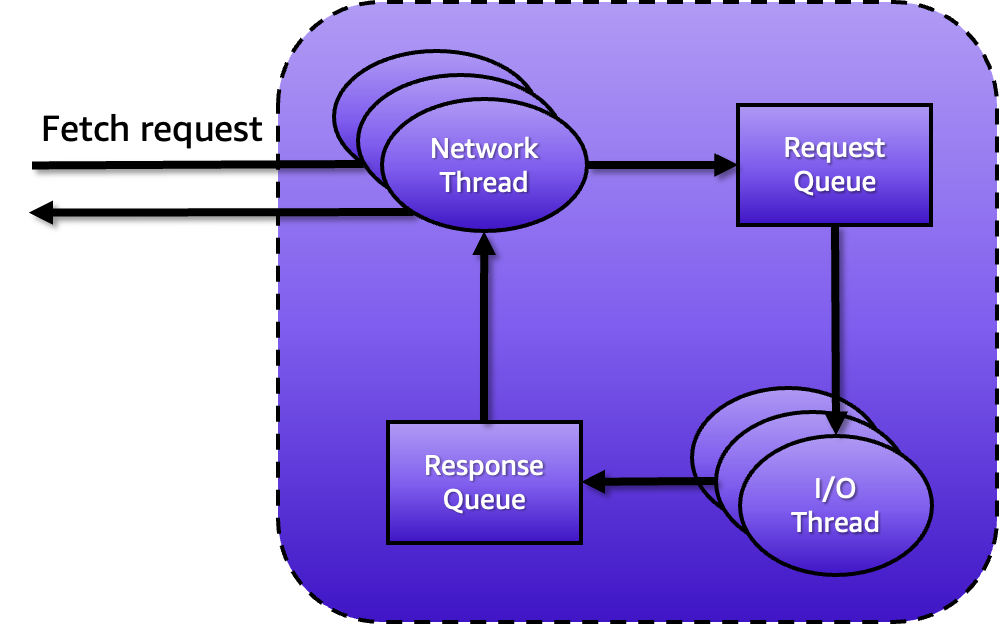

|ToC|
|---|

Every technology has that key concept that people struggle to understand. With databases, the struggle usually happens when you have to decide which join clause to use for fetching data from multiple tables. Which one is faster? What about consistency? How will concurrency look like if I pick this one versus the other? It is often a hard choice. Containers are another great example. Implementing persistence with containers is troublesome because each workload has its own set of requirements, and there is no silver bullet. For example, you may have a workload that requires each container to store 20% of the dataset locally, whereas the other 80% should go straight to a shared filesystem that is mounted on every container instance. But, you should not reuse this design for a microservices workload, for example.

Just like any other technology, [Apache Kafka](https://kafka.apache.org/) also has a key concept that people struggle to understand, which is partitions. Partitions are tricky because they dictate pretty much everything about how Kafka works, and picking the right number is not simple. If you go to places like [Stack Overflow](https://stackoverflow.com/) and [Hacker News](https://news.ycombinator.com/), you will see developers providing objective answers to questions like how to install Kafka on Kubernetes, how to backup Kafka data on Amazon S3, and how to implement a Kafka consumer in Java. But when someone asks how many partitions to set for their Kafka topics, oh boy, this is where you see those long threads full of subjective opinions that more often than not don't provide a concrete answer. And even when they do, it is a total guessing game.

Why is this important? You may ask. Well, sizing Kafka partitions wrongly affects many aspects of the system, such as consistency, parallelism, and durability. Worse, it may also affect how much load Kafka can handle. Hence why often the decision about how many partitions to set for a topic is handled by Ops teams, as we see this to be only an infrastructure matter. In reality, it's an architectural design decision that affects even the amount of code you write. In this three-part series of blog posts, I will share everything you need to build more confidence about how to size Kafka partitions correctly, and to spot a poor decision when you see one. This first part will peel off the concept of partitions, and highlight the effect they have on Kafka.

## Part 1: What are Kafka partitions?

Going to the doctor's office for your annual check-up is one of those annoying situations in life. You go because you need to, not because you want to. Once you are there; you promptly do everything you are told and answer as many questions your physician asks you, with that inner feeling that you want to hear that everything is okay. The reality, however, is rather disappointing. There are always things to discuss, even more so as you get older. Though your physician may try their best to explain the nuts and bolts of your situation, you don't really care about the nitty details. You care about concrete things, such as whether you can do that thing you love again.

But what does all of this has to do with Kafka? Well, explaining what partitions are is like a physician explaining to the patient about their condition. Most people don't really care about the nitty details. They just want to hear that everything is okay, and also about concrete things such as whether the cluster can handle more load. Controversially, there is no better way to assess a Kafka cluster than looking into things at the partition's level. Partitions are the heart of everything Kafka does, and truly understanding them is your ticket to master Kafka and realize why things behave the way they behave. For this reason, I will dive into what partitions are and the role they play for the Kafka cluster and its clients. To get things started, I would like to encourage you to ignore what most people say about partitions being just Kafka's unit-of-parallelism. I mean, it's not entirely wrong, but this definition is diminishing and incomplete. Instead, let's work with the following definition:

Partitions are Kafka's unit-of-parallelism, unit-of-storage, and unit-of-durability.

### Partitions as the unit-of-parallelism

Kafka was designed from the ground up to completely isolate producers and consumers. However, with Kafka, this is not just in an API level design like we see in other messaging systems. Kafka also allows producers and consumers to scale independently. This means that your producers may get crazy and write more data than the consumers can handle, and the consumers will still process those events as fast as they can without Kafka having to apply any back-pressure strategy. This is possible because Kafka acts as a buffer between producers and consumers, with persistence enabled by default. So higher write throughput doesn't affect slow read throughput. But why will read throughput ever be slower than writing?

To understand this, you must understand what happens when events are processed in Kafka. The consumer polls for new events, and once these events are fetched from the broker, they need to be deserialized. This is a very CPU consuming task and therefore, it must be counted towards processing time. Even more so if you are using formats like JSON, Thrift, Avro, and Protocol Buffers. After this, the consumer will start the actual processing of the events, which is tied to the business logic. Sometimes this is as simple as writing them off into a target system, but some other times it is a bit more complicated than that. What matters here is that processing those events doesn't come for free when it comes to resources utilization. You can surely know that CPU, memory, and network resources will be used for this. So whatever resource contention happens during this process, it must also count towards processing time. Finally, after processing the events, the consumer needs to inform Kafka that those events should be marked as processed. Otherwise, the same events will be included in the next event polling. This is done by committing the offsets from each one of those events. Figure 1 depicts all these steps.



As you can see from this narrative, processing events are not straightforward. While the narrative focused on explaining the stages of event processing, it intentionally gave you a positive perspective that everything just works. However, in the real world, lots of errors can happen during event processing, including the processing attempt of poison pills. These are events that can't be processed because they have invalid formats, wrong data types, or business-related problems such as events with integrity issues. When these events are polled, consumers may try to reprocess them unsuccessfully multiple times, while further events in the partition are blocked by the ones in the head. This is known as the [head-of-line blocking](https://en.wikipedia.org/wiki/Head-of-line_blocking) problem. This problem was originally coined in the context of computer networking, but it also applies in the world of streaming data with Kafka. This is one of the most common problems that can slow down your read throughput.

#### Scaling things up and out

Another factor that causes read throughput slow down is how many consumers you use to process events. It can be challenging to get things processed fast with only one consumer processing events. In Kafka, multiple consumers can be used to process events simultaneously. If you increase the number of consumers, processing will be presumably faster, as long each consumer is running on different machines. Why? because as mentioned before, processing events doesn't come for free when it comes to resources utilization. Let's say processing 10,000 events requires 85% of the machine resources running your consumer. This means that to process 20,000 events, two machines with identical configuration are required. This way, you can scale out the event processing just by adding more consumer machines, right?

Technically, yes, but take this with a grain of salt. As mentioned before, when one or more consumers join a group, the group coordinator executes the partition assignment by executing the assignors configured. If the topic has only one partition, then it won't matter if you have multiple consumers running on different machines. Only one consumer will receive events while the others will remain idle. If you try to play dumb and put the consumers in different groups; then Kafka will broadcast the same events to each group, meaning that you will process the same events multiple times. This may lead to a serious problem of data consistency. Not much of a solution, right? The solution is creating more partitions. For example, if you have 2 partitions, you can have 2 consumers within the same group processing the events in parallel — each one being fed events from a dedicated partition. Figure 2 shows this example.


Having multiple partitions also helps to solve another problem, which is the broker becoming the bottleneck. If you have a single partition, then the partition will be hosted by a single broker. Your producers and consumers will always connect to that same broker, potentially exceeding the number of network concurrent connections it can handle. The solution is using multiple brokers to scale things out, but for this to happen, you need to configure your topics to have more partitions. When you create a topic, Kafka first decides how to distribute the partitions between the brokers.

Suppose you have 6 brokers and you decide to create a topic with 12 partitions. Kafka will distribute the partitions in such a way that each broker will end up with 2 partitions. Now your producers and consumers can start network connections with different brokers concurrently and remove the bottleneck from the equation. Of course, the actual distribution is a bit more complicated than this, as you will see later when I discuss replicas. But for now, just know that the broker bottleneck is a solved problem if you create multiple partitions.

#### How many partitions do I need?

All of this may get you thinking about creating as many partitions as you need. Incidentally, your instinct will be to create empirical ways to come up with a usable number. I don't fancy criticizing any method. Whatever works for you is the best method you should use. However, if I could be of any help, here is a method that has been proved to produce good "good enough" numbers. Since partitions are your unit-of-parallelism, you can use your target throughput, measured in events per second, as criteria. You start by measuring the write throughput that you can achieve with a single partition, and then the read throughput. While measuring this, it is important to consider only one partition because this is your unit of scale.

The easiest way to measure write and read throughput is by using the tools `kafka-producer-perf-test` and `kafka-consumer-perf-test` that are available in the `/bin` folder of your Kafka distribution. For example, to test if a partition can handle 2,000 events per second, with each event containing 1024 bytes of payload size, you can send 100,000 from a machine using this command:

```bash
kafka-producer-perf-test --producer.config config.properties --throughput 2000 --num-records 100000 --record-size 1024 --topic <TOPIC_NAME>
```

This command will produce an output similar to this:

```bash
7501 records sent, 1499.3 records/sec (1.46 MB/sec), 2124.3 ms avg latency, 1307.0 ms max latency.
9870 records sent, 1273.6 records/sec (1.23 MB/sec), 2343.6 ms avg latency, 1452.0 ms max latency.
8805 records sent, 1358.9 records/sec (1.32 MB/sec), 2713.4 ms avg latency, 1982.0 ms max latency.
8355 records sent, 1160.7 records/sec (1.62 MB/sec), 2426.3 ms avg latency, 2783.0 ms max latency.
8925 records sent, 1284.6 records/sec (1.24 MB/sec), 3103.8 ms avg latency, 3353.0 ms max latency.
8820 records sent, 1361.5 records/sec (1.32 MB/sec), 3543.1 ms avg latency, 3921.0 ms max latency.
10290 records sent, 1054.7 records/sec (1.01 MB/sec), 3829.9 ms avg latency, 3943.0 ms max latency.
9000 records sent, 1398.2 records/sec (1.36 MB/sec), 3872.3 ms avg latency, 4291.0 ms max latency.
10125 records sent, 2022.6 records/sec (1.98 MB/sec), 4317.7 ms avg latency, 4490.0 ms max latency.
9660 records sent, 1231.6 records/sec (1.29 MB/sec), 4302.4 ms avg latency, 4430.0 ms max latency.
```

The 100,000 events are sent in batches. On each batch, it is calculated how many data could actually fit in the desired throughput of 2,000 events per second. The reading here is that the producer could do this only once, when it could send `2022.6` events per second. There is surely a contention somewhere. It may be because of compression, network bandwidth, throttling rules from your egress NAT gateway, or maybe the machine doesn't have enough resources to achieve that throughput. The next step is to change the target throughput until you reach a number of events per second that will be constant throughout all batches sent. This will be your measured write throughput. If you know where the contention is; and if you can do something about, instead of changing your target throughput you can simply work towards fixing the issues. But in my experience, these two ifs are usually mutually exclusive.

Measuring read throughput is similar. For example, to test how much throughput a single partition can handle if it tries to process 100,000, you can use this command:

```bash
kafka-consumer-perf-test --bootstrap-server <BROKER_ENDPOINT> --messages 100000 --topic <TOPIC_NAME>
```

This command will produce an output similar to this:

```bash
start.time, end.time, data.consumed.in.MB, MB.sec, data.consumed.in.nMsg, nMsg.sec, rebalance.time.ms, fetch.time.ms, fetch.MB.sec, fetch.nMsg.sec
2022-06-29 17:26:05:891, 2022-06-29 17:26:21:816, 98.1252, 6.1617, 100489, 6310.1413, 1767, 14158, 6.9307, 7097.6833
```

The columns that you are after here are `MB.sec` and `nMsg.sec`, which tells you exactly the throughput achieved in MB/s and in terms of the number of events fetched. In this example, the machine could handle up to `6.1617` MB/s, which was the equivalent of `6310.1413` events per second. If the number of events per second fetched multiplied by the payload size came close to the MB/s number, then you are getting somewhere. Just like you did while measuring the write throughput, you must work towards reaching a number that will be constant throughout different executions of this command. As a best practice, consider that the read throughput is going to be usually higher than your write throughput. This happens because, once stored, you will likely share the same events with different systems. A good rule-of-thumb is considering that your read throughput will be 3X higher than your write throughput. Therefore, whatever number you got while measuring the read throughput, multiply it by 3 to be on the safe side.

Once you have measured the write and read throughput that a single partition can handle, you can use those numbers in the following formula:

`NUM_PARTITIONS = MAX(T/W, T/R)`

Here, `T` is your target throughput, `W` is your measured write throughput, and `R` is your measured read throughput. The result is how many partitions you need for a topic. With that said, use this formula at your discretion. Also, take into account that the measured read throughput doesn't consider business logic processing. You should think about this as well.

### Partitions as the unit-of-storage

Despite what most people think, Kafka doesn't store data into topics. Physically, topics are just folders from the broker's node used to organize the files that build up a partition on disk. Every new event written into a "topic" is actually written into a partition, which comprises multiple log segment files and their indexes. By default, each log segment file can grow to up to 1GB of size as you can read it [here](https://kafka.apache.org/documentation/#brokerconfigs_log.segment.bytes). When this 1GB water-mark is reached; Kafka flushes all events to disk and a new log segment file is created, along with its index file. New events are then appended to this new log segment file. For each log segment and index file, the broker has to create a [file handle](https://datacadamia.com/file/file_descriptor) as read requests may need to be served. If you have worked with infrastructure before, you know how file handles affects scaling. Having multiple file handles open in a single node is surely a source of bottleneck.

To illustrate this bottleneck scenario, let's say you have a broker running on a node capable of creating 1024 file handles, which is the typical limit that Linux systems have per process. Then, you create a topic with only 1 partition. All partitions are created atomically, so once this topic is created, one partition will be active on that broker, with one log segment containing 2 file handles — one for the log segment file and another for its index. A producer writes data into this topic every minute, writing about 250MB of data per minute. This means that in 48 hours, this broker will run out of file handles if the producer continues to write data at that pace.

Surely, you could take different actions to remediate this bottleneck scenario, such decreasing the retention policy for the topic, executing multiple brokers in different processes, increasing the limit of file handles per process, and perhaps just adding more brokers in different nodes. But this scenario suits the need for your understanding that creating partitions arbitrarily has a direct impact on the amount of resources consumed by your Kafka brokers. If a topic with 1 partition could quickly exhaust the broker's node in less than 3 days, what would happen if the topic had more partitions? Any partition takes a toll on the brokers, because partitions, not topics, are your unit-of-storage.

#### Storage from the developer perspective

While all of this happens at an infrastructure level, it may be hard for you, as a developer, to think about partitions. Have you ever wondered why you never had to worry about partitions while writing and reading events with Kafka? Well, Kafka is a magnificent piece of technology when it comes to client APIs. From the producer standpoint, every time you invoke the `send()` function to write a new event, there is an internal process triggered that takes care of deciding which partition that event should go to. This process is known as partitioning, and it can be customized by a component called [partitioner](https://kafka.apache.org/32/javadoc/org/apache/kafka/clients/producer/Partitioner.html).

Here is how partitioning works. If the event produced has a partition assigned, then it will use it. Otherwise, if a custom partitioner was configured via the `partitioner.class` property, then it will execute this partitioner to compute which partition to use. If there is no custom partitioner configured, then Kafka tries to compute which partition to use based on the key assigned. The `partitionForKey()` method below describes how the key is used along with the number of available partitions.

```java
public static int partitionForKey(final byte[] serializedKey, final int numPartitions) {
    return Utils.toPositive(Utils.murmur2(serializedKey)) % numPartitions;
}
```

If the event doesn't have a key or if the property `partitioner.ignore.keys` is configured to true, then Kafka will fallback to compute which partition to use based on factors such as broker load, the amount of data produced to each partition, etc. This partitioning behavior was introduced by [KIP-794](https://cwiki.apache.org/confluence/display/KAFKA/KIP-794%3A+Strictly+Uniform+Sticky+Partitioner).

Consumers work similarly. Every time you invoke the `poll()` function from the consumer to read events, the events will be read from partitions selected by an internal process triggered beforehand that takes care of deciding how to assign the partitions to consumers. This process is known as assignment, and it can be customized by a component called [assignor](https://kafka.apache.org/32/javadoc/org/apache/kafka/clients/consumer/ConsumerPartitionAssignor.html). To better understand how assignors work, you need to understand how Kafka handles consumers. All consumers must belong to a consumer group. This is the reason the `group.id` property in the consumer API is mandatory. Every group has a group coordinator, which oversees who joins and leaves the group.

Once one or more consumers join the group, the group coordinator executes the partition assignment by executing the assignors configured. This partition assignment can be triggered by discrete events. It may happen when a consumer dies, perhaps because of hardware or software malfunctioning. It may also happen if the consumer becomes so busy that it stops to respond to any heartbeat checking about its aliveness. And it may also happen if a brand new consumer joins the group. By the way, this assignment process is also known as rebalancing.

Consumers in Kafka come with a list of assignors configured. It defaults to the [RangeAssignor](https://kafka.apache.org/32/javadoc/org/apache/kafka/clients/consumer/RangeAssignor.html), which tries to distribute the available partitions evenly amongst the range of consumers. But if there are more partitions than consumers, then the first consumers from the list (which are ordered in a lexicographic manner) will receive one extra partition each. The `assign()` method below from the RangeAssignor implementation describes how this works.

```java
public Map<String, List<TopicPartition>> assign(Map<String, Integer> partitionsPerTopic,
                                                Map<String, Subscription> subscriptions) {
    Map<String, List<MemberInfo>> consumersPerTopic = consumersPerTopic(subscriptions);

    Map<String, List<TopicPartition>> assignment = new HashMap<>();
    for (String memberId : subscriptions.keySet())
        assignment.put(memberId, new ArrayList<>());

    for (Map.Entry<String, List<MemberInfo>> topicEntry : consumersPerTopic.entrySet()) {
        String topic = topicEntry.getKey();
        List<MemberInfo> consumersForTopic = topicEntry.getValue();

        Integer numPartitionsForTopic = partitionsPerTopic.get(topic);
        if (numPartitionsForTopic == null)
            continue;

        Collections.sort(consumersForTopic);

        int numPartitionsPerConsumer = numPartitionsForTopic / consumersForTopic.size();
        int consumersWithExtraPartition = numPartitionsForTopic % consumersForTopic.size();

        List<TopicPartition> partitions = AbstractPartitionAssignor.partitions(topic, numPartitionsForTopic);
        for (int i = 0, n = consumersForTopic.size(); i < n; i++) {
            int start = numPartitionsPerConsumer * i + Math.min(i, consumersWithExtraPartition);
            int length = numPartitionsPerConsumer + (i + 1 > consumersWithExtraPartition ? 0 : 1);
            assignment.get(consumersForTopic.get(i).memberId).addAll(partitions.subList(start, start + length));
        }
    }
    return assignment;
}    
```

While the RangeAssignor does a good enough job distributing the partitions amongst the consumers, it doesn't provide any safety measures to prevent stop-the-world rebalances. This is a problem that prevents continuous processing of events, as the rebalance first needs to finish before the consumers resume their operations and fetch new events from the partitions. For this reason, if you're using newer Kafka clusters, the clients should prefer using the [CooperativeStickyAssignor](https://kafka.apache.org/32/javadoc/org/apache/kafka/clients/consumer/CooperativeStickyAssignor.html) assignor. This assignor uses cooperative rebalancing to prevent stop-the-world pauses, and focus on moving only the partitions changing ownership, instead of all the partitions all over again. The `assign()` method below from the CooperativeStickyAssignor implementation describes how this works.

```java
public Map<String, List<TopicPartition>> assign(Map<String, Integer> partitionsPerTopic,
                                                Map<String, Subscription> subscriptions) {
    Map<String, List<TopicPartition>> assignments = super.assign(partitionsPerTopic, subscriptions);

    Map<TopicPartition, String> partitionsTransferringOwnership = super.partitionsTransferringOwnership == null ?
        computePartitionsTransferringOwnership(subscriptions, assignments) :
        super.partitionsTransferringOwnership;

    adjustAssignment(assignments, partitionsTransferringOwnership);
    return assignments;
}

private void adjustAssignment(Map<String, List<TopicPartition>> assignments,
                                Map<TopicPartition, String> partitionsTransferringOwnership) {
    for (Map.Entry<TopicPartition, String> partitionEntry : partitionsTransferringOwnership.entrySet()) {
        assignments.get(partitionEntry.getValue()).remove(partitionEntry.getKey());
    }
}

private Map<TopicPartition, String> computePartitionsTransferringOwnership(Map<String, Subscription> subscriptions,
                                                                            Map<String, List<TopicPartition>> assignments) {
    Map<TopicPartition, String> allAddedPartitions = new HashMap<>();
    Set<TopicPartition> allRevokedPartitions = new HashSet<>();

    for (final Map.Entry<String, List<TopicPartition>> entry : assignments.entrySet()) {
        String consumer = entry.getKey();

        List<TopicPartition> ownedPartitions = subscriptions.get(consumer).ownedPartitions();
        List<TopicPartition> assignedPartitions = entry.getValue();

        Set<TopicPartition> ownedPartitionsSet = new HashSet<>(ownedPartitions);
        for (TopicPartition tp : assignedPartitions) {
            if (!ownedPartitionsSet.contains(tp))
                allAddedPartitions.put(tp, consumer);
        }

        Set<TopicPartition> assignedPartitionsSet = new HashSet<>(assignedPartitions);
        for (TopicPartition tp : ownedPartitions) {
            if (!assignedPartitionsSet.contains(tp))
                allRevokedPartitions.add(tp);
        }
    }

    allAddedPartitions.keySet().retainAll(allRevokedPartitions);
    return allAddedPartitions;
}
```

How your code writes events into partitions and reads from them is one of those processes that are so well encapsulated that developers rarely pay attention to it. It's the reason I call Kafka's client API a magnificent piece of technology. It makes you believe you are dealing with this high-level construct called topic, but in reality, the whole partition plumbing is being handled behind the scenes. This is even more true when you are working with integration platforms like [Kafka Connect](https://kafka.apache.org/documentation/#connect), or stream processing technologies such as [Kafka Streams](https://kafka.apache.org/documentation/streams), [ksqlDB](https://ksqldb.io/), and [Amazon Kinesis Data Analytics](https://docs.aws.amazon.com/streams/latest/dev/getting-started.html). They will be discussed in more details on the part three of this blog post series.

#### Storage from the Ops perspective

The way your data is distributed across the cluster is another way to see partitions as a unit-of-storage. To implement horizontal scalability, each broker from the cluster hosts one or multiple partitions. As you add new brokers to your cluster, you increase the storage capacity of the cluster to store events, as the total storage capacity of a cluster is dictated by the sum of all brokers' storage. With a cluster containing 4 brokers, each one with the storage capacity of 1TB, you can store up to 4TB of data. But how your data will leverage all this capacity depends directly on the partitions.

To illustrate this, let's say you start a cluster with 2 brokers. Once the cluster is up-and-running, you create a topic with 4 partitions. As mentioned before, partitions are created atomically, so after the topic creation, the partitions are distributed across the cluster. Here, each broker will host 2 partitions. With this setup ready, your producers can start writing events and they will be distributed over those partitions if no keys are used. Eventually, you may start noticing that the brokers are reaching their maximum disk capacity, and you don't plan to get rid of data. Your solution is to add 2 more brokers, so now you have a cluster with 4 brokers, doubling your storage capacity. The most likely symptom you may notice after this is that your clients will get slower. Why is this happening? They are supposed to get faster, not slower.

This happens because partitions are not automatically reassigned as brokers are added or removed to/from a cluster. So in this case, the partitions may still live in the 2 original brokers and, with more data coming in, they may become slow as they can start running out of disk space, out of file handles, out of memory, swapping frequently, etc. To resolve this problem, you have two choices. You can bounce the cluster so when it gets back, the partitions are reassigned, but this leads to cluster unavailability. The other option is forcing this reassign while the cluster is online using the `kafka-reassign-partitions` tool available in the `/bin` folder of your Kafka distribution. You can do this by first generating a reassignment recommendation given the new layout of your cluster.

```bash
kafka-reassign-partitions --bootstrap-server <BROKER_ENDPOINT> --broker-list 2,3 --topics-to-move-json-file partitions-to-reassign.json --generate
```

In this command, the property `broker-list` was set to `2,3`, which correspond to the broker ids of the newly added brokers. The `partitions-to-reassign.json` file provided as a parameter is a file you must create yourself and it should contain information about which one or more partitions you intend to reassign. You should create this file using the following syntax:

```json
{
   "topics": [
      {
         "topic": "<TOPIC_NAME>"
      }
   ],
   "version": 1
}
```

Once the command completes, you should obtain a content similar to this:

```bash
Current partition replica assignment
{"version":1,"partitions":[{"topic":"test","partition":0,"replicas":[0],"log_dirs":["any"]},{"topic":"test","partition":1,"replicas":[1],"log_dirs":["any"]},{"topic":"test","partition":2,"replicas":[0],"log_dirs":["any"]},{"topic":"test","partition":3,"replicas":[1],"log_dirs":["any"]}]}

Proposed partition reassignment configuration
{"version":1,"partitions":[{"topic":"test","partition":0,"replicas":[3],"log_dirs":["any"]},{"topic":"test","partition":1,"replicas":[2],"log_dirs":["any"]},{"topic":"test","partition":2,"replicas":[3],"log_dirs":["any"]},{"topic":"test","partition":3,"replicas":[2],"log_dirs":["any"]}]}
```

Save the contents of the proposed partition reassignment configuration into a new file. You may tweak the file with your own proposal, or just settle with what was recommended by Kafka. To execute the reassignment, use the command below:

```bash
kafka-reassign-partitions.sh --bootstrap-server <BROKER_ENDPOINT> --reassignment-json-file new-reassignment-file.json --execute
```

This command may take a while to complete if you have large partitions, depending on your network bandwidth, and surely how many partitions you are reassigning. Eventually, the partitions will become available across all the brokers you selected in the reassignment JSON file. Of course, assuming that the command didn't fail to complete. The point that matters here is that you won't leverage the full capacity of your cluster if you don't have your data distributed across the cluster, and this happens at a partition level.

### Partitions as your unit-of-durability

Kafka as storage for your data streams wouldn't be very useful if it couldn't ensure data consistency. As with any distributed system, failures are a constant, and a well-designed architecture should consider failures happening any time. Luckily for us, Kafka's architecture includes durability built-in, with your data replicated across the cluster, and ultimately on each broker's disk.

Different from other messaging systems where replication is treated as a feature that is optionally enabled, in Kafka, replication is enabled by default. If you don't specify a replication factor while creating a topic, you create that topic with a replication factor of one. This means that for each partition of that topic, there will be one replica of it in another broker. As the name implies, the purpose of a replica is to serve as a backup for a partition in case the broker that hosts that partition fails. When this happens, a healthy broker will be selected and the partition will be moved to this broker, with the partition's data based on one of the replicas. As you can see here, the unit of replication in Kafka is not individual events but entire partitions.

This is important because knowing this will allow you to better understand how many actual partitions exist in your clusters. The number of partitions in a cluster is dictated by the number of topics you have, the partitions set for each topic, as well as the replication factor configured. For example, if a topic is created with 4 partitions and the replication factor set to 3, this means that 12 partitions will be created in the cluster. For a cluster with 4 brokers, it should look like what is shown in figure 3.


The allocation is primarily focused on distributing the replicas evenly between the brokers, but this is not the only criteria. Starting from Kafka 0.10.0, if the brokers are configured to contain information about the rack they should belong to, then the allocation will also take this into consideration and assign partition replicas to different racks as much as possible. This is useful to ensure that if an entire rack fails, your data is safe and sound in another rack. For cloud-based deployments, building blocks such as availability zones should be used as racks.

#### Leaders and followers

Now that you know the relationship between partitions and replicas, know that there are two types of replicas: leaders and followers. Leader replicas are the ones responsible for processing write requests. When a producer sends events to Kafka, the leader replica is the one taking care of writing them off to guarantee consistency. From this perspective, leader replicas are notably your actual partitions. They are elected by a component of the cluster called controller, which is a broker from the cluster with the additional responsibility of handling leader's election. The other replicas, called followers, have the job of staying up-to-date with leaders in terms of event data. They do this by replicating all events from the leader. If a follower stays up-to-date with the leader, that follower is marked as an ISR, acronym for an in-sync replica. ISRs are super important because if a leader replica dies, one of the ISRs will be promoted to be the new leader for the partition. Followers that don't stay up-to-date with the leader for longer than what specified in the property `replica.lag.time.max.ms` will be marked as out-of-sync replicas. Anecdotally, they don't use OSR as an acronym. 🤷🏻

ISRs are also very important in the context of data consistency when producers write events to Kafka. This is done by using the `ack` property from the producer configuration. Setting this property to `0` will tell the producer to not wait for anything after events are sent to the brokers. The acknowledgment comes back right away, and no guarantees are provided. Setting this property to `1` provides the guarantee that at least the leader replica needs to store the event before returning the acknowledgement. Finally, setting this property to `all` provides the guarantee that all ISRs need to store the event before returning the acknowledgment. While it may be tempting to set the `ack` property to `all` at all times, please be aware that doing so also increases the producer latency. By producer latency, I mean the time it takes for the producer to write events to Kafka. But for the sake of end-to-end latency, this isn't much of a problem. To ensure data consistency, Kafka doesn't allow consumers to read events that haven't been written to all ISRs, anyway.

Speaking of consumers, they may also leverage replicas. When a consumer polls for events, a fetch request is sent to the broker that contains the leader replica, which as mentioned before handles all writes. However, since the introduction of the [KIP-392](https://cwiki.apache.org/confluence/display/KAFKA/KIP-392%3A+Allow+consumers+to+fetch+from+closest+replica) in Kafka, follower replicas can also serve read requests, which helps towards decreasing the network traffic costs of consumers not fetching events from nearest replicas. Consequentially, this also helps to alleviate the leader replica's work as it can be dedicated to handle more writes and fewer, luckily none, reads.

As you can see, replicas play an important role in how Kafka ensures data consistency. Therefore, it is important for you to know exactly how to keep track of the exact details of replicas in your cluster. The tool `kafka-topics` that are available in the `/bin` folder of your Kafka distribution can be used to investigate the details about the topic's partitions, replicas, and which replicas are ISRs.

```bash
kafka-topics --bootstrap-server <BROKER_ENDPOINT> --topic <TOPIC_NAME> --describe
```

This command will produce an output similar to this:

```bash
Topic: replicasTest    TopicId: VAE9FZCOTH2OlLLM8Mn82A    PartitionCount: 4    ReplicationFactor: 3    Configs: segment.bytes=1073741824
    Topic: replicasTest    Partition: 0    Leader: 2    Replicas: 2,1,0    Isr: 2,1,0    Offline:
    Topic: replicasTest    Partition: 1    Leader: 1    Replicas: 1,0,2    Isr: 1,0,2    Offline:
    Topic: replicasTest    Partition: 2    Leader: 0    Replicas: 0,2,1    Isr: 0,2,1    Offline:
    Topic: replicasTest    Partition: 3    Leader: 2    Replicas: 2,0,1    Isr: 2,0,1    Offline:
```

#### Busy clusters with replication

Why aren't all replicas ISRs? You may ask. A replica may become out-of-sync with the leader because of reasons such as network congestion or to fall behind because the broker is busy. This is important because you should never forget that replicating entire partitions over the network is computationally expensive. When creating partitions, keep in mind that they will have replicas, and those replicas will be distributed over the cluster. If you create more partitions than your cluster may have been sized to handle, you can create contention problems on your brokers by being more busy replicating partitions than actually storing them and making them available for reads. This happens because the way Kafka handles replication is not very different from how consumers read data.

To stay in-sync, brokers with replicas send fetch requests to the brokers that contain the leader of the partition. These are the same fetch requests that consumers send when the `poll()` function from the consumer is invoked. Because it is the same fetch request for both — they are served by the same request processing model. Here is how it works. Fetch requests are received by one thread from a pool called network threads. These threads are associated with the listener port of each broker. Once a network thread finishes receiving the request, it adds the request to an in-memory FIFO queue that will be eventually processed by one thread from another pool called I/O threads. Figure 4 shows this in more details.



If you create more replicas than your cluster can handle, you may exhaust both the pool of network threads and the pool of I/O threads with too many fetch requests related to replication. The default value set for the network thread pool is `3` and the default value set for the I/O thread pool is `8`. In theory, a naïve solution to resolve the problem of busy threads is increasing these pools in higher numbers. However, doing this doesn't solve the problem. In fact, it may actually make the situation worse, as more threads mean more context switching between the CPUs. If you don't have enough CPUs in the broker node, then this is likely to happen. Having partitions as your unit-of-durability is a good thing for the sake of data consistency, but you must use this information wisely to avoid problems with busy clusters.

## Summary

In this blog post, I discussed how partitions affect your system if you configure them wrongly. The role partitions play with Kafka was explored in scenarios of common traps, such as bottlenecks generated by running out of file handles, cluster storage not fully leveraged, decreased event processing speed, and busy clusters with replication. The discussion around these traps provides you with a good understanding of how Kafka handles your data using partitions. I also explained to you the impact that partitions have on many aspects of the system, such as consistency, parallelism, and durability.

As I mentioned before, partitions are the heart of everything Kafka does. They store your data, allow parallel reads to speed up your event processing, and they also ensure that your data is not lost when brokers fail. I mean, yeah, you can surely pretend that everything in Kafka boils down to topics, the story ends you wake up in your bed and believe whatever you want to believe. But I want to help you, so I recommend you to take the red pill and stay in Wonderland, so I can show you how deep the rabbit hole goes. So please, don't forget to read the second part of this series where I discuss the impact that changing partitions bring to your Kafka workloads, and whether you can recover from them.
