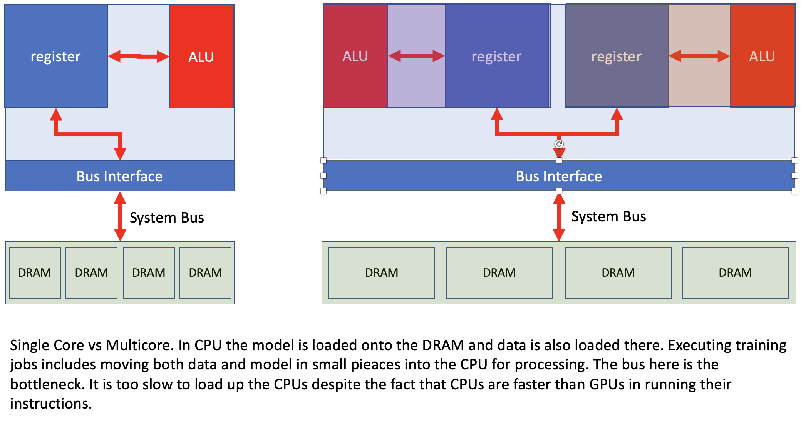
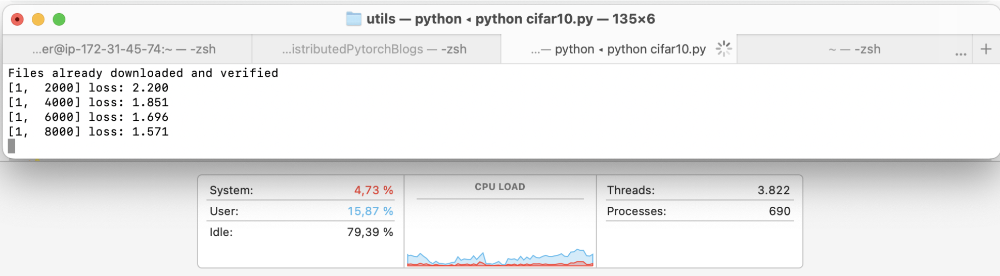

    # Distributed training
Distribution of a deep learning model over miltiple GPUs can happen in different ways. For instance, if the model small enogh to fit on a single GPU, then we can load a copy of the model on each GPU and then distribute data onto different GPUs, calculat the gradiants for the part of data that is sent to a specific GPU and then combine those gradinents together. It could happen that the model itself becomes too large for a single GPU and then we obvously can no longer load the whole model on a GPU and would need to breakup the model and laod different part of a model on to a different gpu. In this blog we are going to look at different methods for distrbution of training on multiple GPUs on the same machine; but first things first, let us take a look at GPU architecture and how CUDA makes that architecture available to developers.
## GPU architecture
Most of us who are old enough to have taken ASM (assembly language), have a good undertanding of Intel CPU architecture and its instructions. 

CPU is a lighting fast muli purpose processing unit. Its intruction set include basic arithmetics like add and subtract, basic logical operations such as and, or, and not, control flow, data instructions, and more. CPU can run a whole programme and operating logical and arithmetic operations inside its ALU, while running imperative programmes, that are sequential by nature. data is loaded from RAM using a bus. It instructions are performed in  registers, whcih are fast small memory insuide the CPU with the ability to run instructions. CPUs are also equipped with cash in order to hold small amount of data and instructions for reuse. This makes CPU a very efficinet and super fast processing units to run complex sequential operations. The problem with CPU is that data bus remains the bottleneck and we cannot supply the CPU with enough data to process and remain highly utilized. . Below is an example from my laptop 
as I try to train CIFAR10.

Generally due to memory latency we are stuck with low efficineies of feeding the CPU in CPU architecture, where the memory bus is hsared and we are sequentially delivering relatively small amounts of data to the CPU to proces. Next we are going to take a look at how GPU overcomes this issue and where the model and data would reside in a GPU before going deeper into data and model paralellism.
*Acknowledgements:
- Thanks to [NVIDIA talk](https://www.nvidia.com/en-us/on-demand/session/gtcspring21-s31151) for some of the concepts here.
- CPU images are inspired by [CMU course](https://www.cs.cmu.edu/~fp/courses/15213-s07/lectures/27-multicore.pdf)

