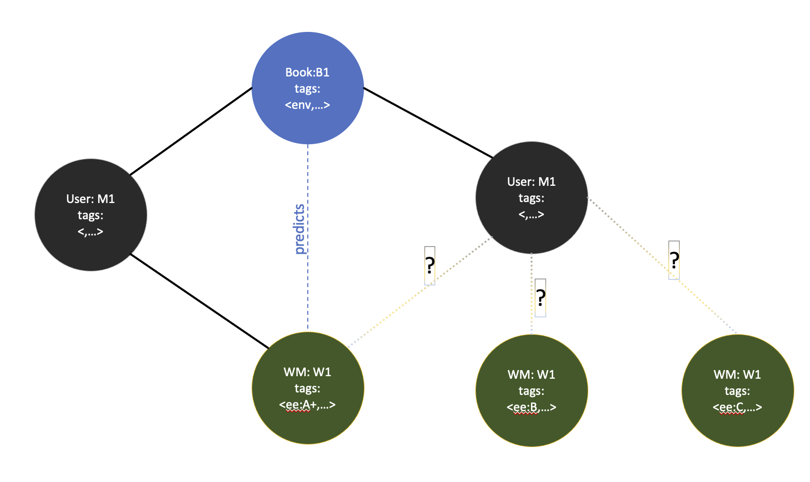

# NGCF
## Introduction
Collaborative filtering is one of the oldest and most explored methods in recommendation. It created a connection between users, who interact with the system such as users of a video streaming system and items, which is what a system offers such as videos in a video streaming service. Before graphs, user-item relationship was modeled using sparse matrices, where the user-item relationship was represented as a rating score. For instance, a user can give one to five star to a movie. The task of collaborative filtering was to use the known ratings, and predict ratings for unknown rarings.


The above image represnts 10 users and 100 items with density of 0.05. The colour of the squares is indicative of rating score. The lightest gray is 1 and black is 5, whicle white means there is not rating for an item by a uer. Even in this image we can see that the the matrix is mostly filled with empty space. In real world scenarios, we often have 
tens of millions of users and tens of millions of items with densities around 0.005.' [movielens20M dataset](https://grouplens.org/datasets/movielens/20m/). Other larger datasets could have potentially much lower densities. Imagine that a music straming service such as Amazon Music has 100000000 songs. If an average person rates 200 songs, the density will be at 0.000002 and 99.9998 percent of the rating matrix will be occupied by empty space.


Useful as all variations of collaborative filtering were, they suffered from a series of deficinecies, chief amongst them were handling of very large sparse matrices and loss of collaborative signal.


We have already seen the root-cause of sparsity. The Loss of collaborative signal results from the fact that users and items pass through separate embedding layers, then they are combined through linear or neural methods. This prevents us to explicitly capture collaboration signal. The single step embedding and consolidation also fails to capture higher level connectivity. The image above schematically demonstrates how traditional collaborative filtering works.

Neural Graph collaborative filtering addresses both issues through modeling user-item relationships as a bipartite graph with rating represented as weight of a collaboration. A simplified visualization of such a bipartite graph is shown in the image below.


## The NGCF Paradigm
There are three steps to implement NGCF, 1) Loading the data into a bipartite graph. 2) Embedding layers that implment first-order embedding capturing firt-order interaction, and higher-order embedding that captures higher-order interactions for constructing more accurate informatio, 3) prediction, which proposes user-item possible interactions using embedding. 

### Data Loading
[Amazon review dataset](https://cseweb.ucsd.edu/~jmcauley/datasets/amazon_v2/) can be summarized to uers, items, and ratings. Loading the data involves creating a class that includes users, items, and the link between the two.
```python
class Data(object):
    def __init__(self, path, batch_size):
        ...
        
        user_item_src = []
        user_item_dst = []
        
        ...
```
The important part to notice here is two arrays that will include the interactions.
The dataset is broken into trainingand test sets. Each line has user id as first entry and a list of items with which the user interacts.

For instance, in the Amazon dataset the fist line is as follows:
```
0 0 1 2 3 4 5 6 7 8 9 10 11 12 13 14 15 16 17 18 19 20 21 22 23 24 25 26 27 28 29 30 31 32 33 34 35 36 37 38 39 40 41 42 43 44 45 46 47 48 49 50 51 52
```
This means that user 0 interacts with items 0, 1, 2, ..., 51, 52. There are a total of 

We need to create `user_item_src` to have a length of 52 with all entries containing the `user_id==0`. The `user_item_dst` will have the same length and contains all the item ids listed in the above line.

We now have two arrays:
`user_item_src = [0, 0, ..., 0]` with `len(user_item_src)==52` and `user_item_dst = [0, 1, ..., 51, 52]` with `len(user_item_dst)==52`. 

We then repeast the process for all the users in the system. We can then use each pair of correspondig arrays to create a data dictionary baed on pairing of elements of the arrays with the same index. This data dictionary will be used to generate a heterogeneous graph. In the previous blogs I defined heterogeneous graphs as a graph, which contains either multiple types of objects or multiple types of links. For more information, please refer to my [introduction to graph theory](https://github.com/cyrusmvahid/Graph-BuildOn/blob/main/02-graph-theory.ipynb).

The eventual data dictionary will include: 1) user self loops, 2) item self loops, 3) user-item relationships, and 4) item-user relationships. The important part to focus on is the relations that start from user and interact with items and start with items and interact with a user. This is the part and we use to capture explicit collaboration signal that was lost in previous reincarnations of collaborative filtering.

```python
data_dict = {
            ...
            ("user", "ui", "item"): (user_item_src, user_item_dst),
            ("item", "iu", "user"): (user_item_dst, user_item_src),
        }
```

The only part that is left is to create a graph and we can begin the process of propogation and create necessary embedding.

```python
self.g = dgl.heterograph(data_dict, ...)
```

As you can see, graph *g* is a member variable of class *Data*.
### Embedding
As mentioned before, we intend to perform embedding explicitly on combined user and item information. For this purpose we define the embedding vector of the size $d$ where $e_u, e_i \in \mathbb{R^d}$ to contain both user and item information represented by parameter matrix $E=[e_{u_1},\dots,e_{u_N}, e_{i_1},\dots,e_{i_M}]$. the part subscribed with $u$ contains user information and the part subscribe with $i$ represent items. Unlike the traditional models, we then propagate these embeddings over user-item interaction graph in order to inject collaboration signal in to embeddings. [Wang et. al](https://arxiv.org/abs/1905.08108)

Embedding propagation layers are built based on MPNN (Message Passing Neural Network), which I described in some details in a different [post](https://github.com/cyrusmvahid/Graph-BuildOn/blob/main/03-mpnn.ipynb). WE can capture both first order relations as well as higher order collaborative signal. Let us take a look at what each one of the two propagations do.

Figure below demonstrates higher order connectivity in graphs. we can see that $u_1$ only interacts directly with $\{i_1, i_2, i_3\}$, but $u_3$ also interacts with $u_3$. In turn $i_4$ interacts with $u_3$, so adding to propagation layers can capture the more distance or higher order relationship between $u_1$ and $i_4$.


image reference: [Wang et. al](https://arxiv.org/abs/1905.08108)

Let us take a look at a more concrete example. User $M_1$ intends to buy a washing machine from an e-commerce platform. Considering only first order interactions, we have no indication as which washing machine to offer to the user. Second order interactions, shows that user $M_2$ has purchased the same book ($B_1$) as has user $M_1$, who appears to have also purchased washing machine ($W_1$), so it seems to be a better option than pure random to recommend the same washing machine to user $M_1$. This is of course a toy example, but we can discover causal relation here as well. Book $B_1$, is tagged as $<env>$ or related to environment. item $W_1$ is tagged $<ee:A++>$ for energy efficiency of A++, and that related to environmental awareness of the user obtained through higher order collaboration signal. The causal relations as well as knowledge graph models will be discussed separately in their own blogs.


#### First order propagation
I you might guess by know, the first order propagation, captures direct interactions between users and items. We saw in the code, we did not only create user-item tuple, but we also created item-user relationships. In this way, collaborative similarity of two users (users $M_1$ and $M_2$ in the above example), leads to collaborative similarity of two items ($B_1$ and $W_1$ in the above example).
Now as it is the case with MPNN-based propagation, we need to construct the message. The message should be able to distill information about user-item interaction. [Wang et. al](https://arxiv.org/abs/1905.08108) suggest to create an message that considers contributions of both $e_i$ and $e_u$ as opposed to normal graph convolutional networks that only consider contribution of $e_i$. This will give the ability to distill more information from the collaboration signal in order to 1) increase the model's representational ability as well as increasing predictive  performance.. The paper also suggest a decay or discount factor. The discount factor has reverse relationship with the number of immediate neighbors, meaning that the more immediate connections i and j have, the less each element effects the outcome. The message is formed in general terms $f(e_i, e_u, p_{ui})$ with $p_{ui}$ being the discount coefficient and is computed as $\frac{1}{\sqrt{|N_i||N_u|}}$ where $N_i$ and $N_u$ are one-hop neighbors of $i$.  and $j$. For more details about the math, please refer to the [Wang et. al](https://arxiv.org/abs/1905.08108) paper.
#### Higher order propagation
Higher order propagation is simply adding more layers for building embeddings over multi-hop neighbourhoods. In the example of recommending washing machine, we have seen $l==2$ for 2-hop propagation. in the image below you can observe that $u_1 \leftarrow i_2 \leftarrow u_2 \leftarrow i_4$ can be captured using $l==3$

image reference: [Wang et. al](https://arxiv.org/abs/1905.08108)
Now let us take a look at the code.
We first need to create an NGCF layer. then layer should include 1) message weights, as the function $f(e_i, e_u, p_{ui})$ is a learnable function. 2)The proposed aggregation function in the paper is LeakyRelu, so we need to define an aggregation function based on LeakyRelu to provide a) non-linearity and b) ability to handle small negative numbers. Additionally we need to create initialization, drop out and other necessary utilities in the class that implements NGCF layer.
```python
import torch.nn as nn

class NGCFLayer(nn.Module):
    def __init__(self, in_size, out_size, norm_dict, dropout):
        super(NGCFLayer, self).__init__()

        ...

        # weights for different types of messages
        self.W1 = nn.Linear(in_size, out_size, bias=True)
        self.W2 = nn.Linear(in_size, out_size, bias=True)

        # leaky relu
        self.leaky_relu = nn.LeakyReLU(0.2)
        
        ...

```
With the data (norm_dict) passed to the constructor in the ```forward``` method of the class we implement message passing. As suggested in the paper, for the self loops we only use the weights associated to the same entity.

```python
if srctype == dsttype:  # for self loops
                messages = self.W1(feat_dict[srctype])
                g.nodes[srctype].data[etype] = messages  # store in ndata
                funcs[(srctype, etype, dsttype)] = (
                    fn.copy_u(etype, "m"),
                    fn.sum("m", "h"),
                )  # define message and reduce functions


Figure below demonstrates higher order connectivity in graphs. we can see that $u_1$ only interacts directly with $\{i_1, i_2, i_3\}$, but $u_3$ also interacts with $u_3$. In turn $i_4$ interacts with $u_3$, so adding to propagation layers can capture the more distance or higher order relationship between $u_1$ and $i_4$.


Let us take a look at a more concrete example. User $M_1$ intends to buy a washing machine from an e-commerce platform. Considering only first order interactions, we have no indication as which washing machine to offer to the user. Second order interactions, shows that user $M_2$ has purchased the same book ($B_1$) as has user $M_1$, who appears to have also purchased washing machine ($W_1$), so it seems to be a better option than pure random to recommend the same washing machine to user $M_1$. This is of course a toy example, but we can discover causal relation here as well. Book $B_1$, is tagged as $<env>$ or related to environment. item $W_1$ is tagged $<ee:A++>$ for energy efficiency of A++, and that related to environmental awareness of the user obtained through higher order collaboration signal. The causal relations as well as knowledge graph models will be discussed separately in their own blogs.

